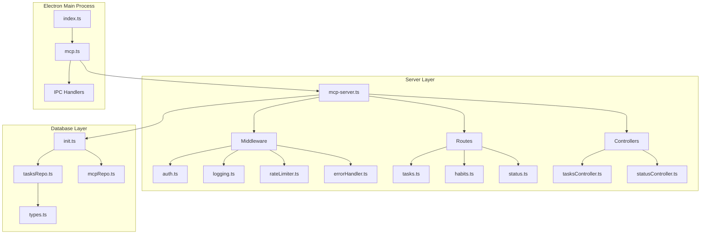
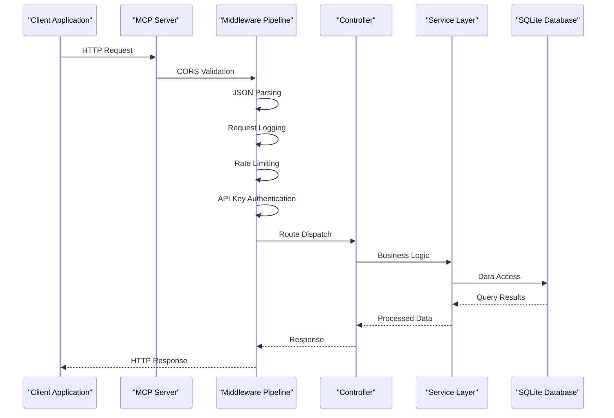
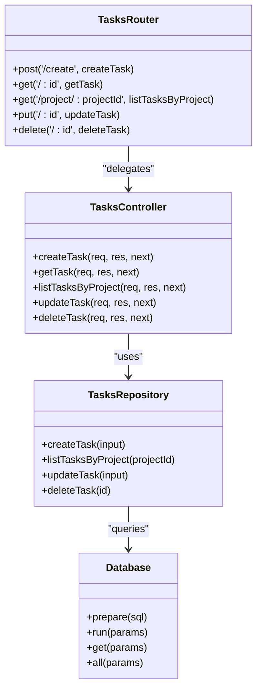
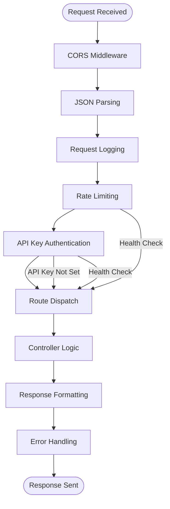
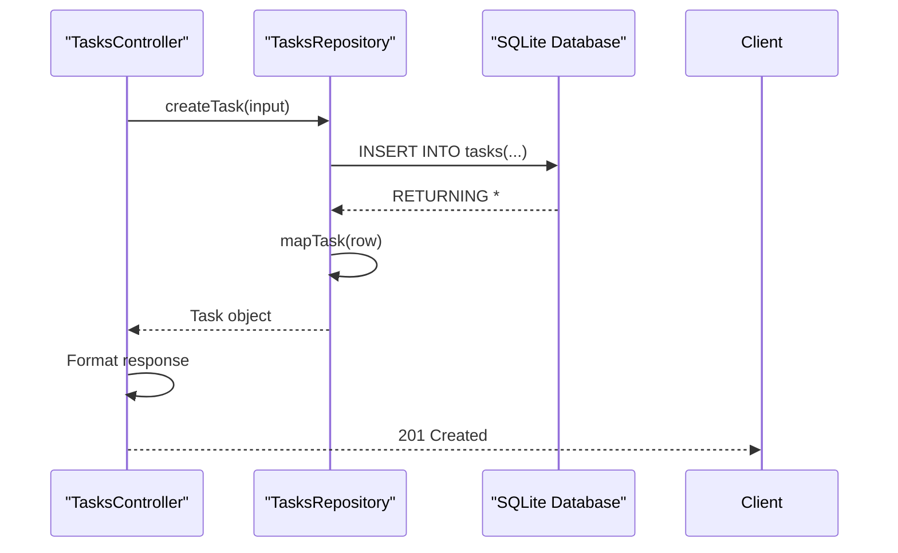
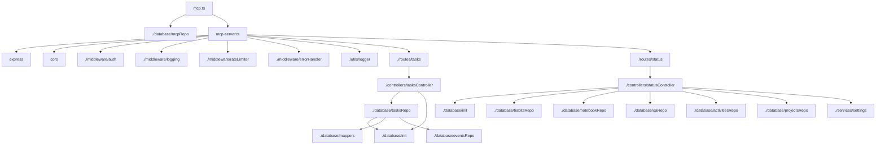

# MCP Server & Backend Services Architecture

<cite>
**Referenced Files in This Document**   
- [mcp-server.ts](file://src/server/mcp-server.ts)
- [auth.ts](file://src/server/middleware/auth.ts)
- [logging.ts](file://src/server/middleware/logging.ts)
- [rateLimiter.ts](file://src/server/middleware/rateLimiter.ts)
- [errorHandler.ts](file://src/server/middleware/errorHandler.ts)
- [logger.ts](file://src/server/utils/logger.ts)
- [tasksController.ts](file://src/server/controllers/tasksController.ts)
- [statusController.ts](file://src/server/controllers/statusController.ts)
- [tasks.ts](file://src/server/routes/tasks.ts)
- [status.ts](file://src/server/routes/status.ts)
- [init.ts](file://src/database/init.ts)
- [tasksRepo.ts](file://src/database/tasksRepo.ts)
- [types.ts](file://src/database/types.ts)
- [mcpRepo.ts](file://src/database/mcpRepo.ts)
- [mcp.ts](file://src/main/ipc/mcp.ts)
- [index.ts](file://src/main/index.ts)
- [package.json](file://package.json)
</cite>

## Table of Contents
1. [Introduction](#introduction)
2. [Project Structure](#project-structure)
3. [Core Components](#core-components)
4. [Architecture Overview](#architecture-overview)
5. [Detailed Component Analysis](#detailed-component-analysis)
6. [Dependency Analysis](#dependency-analysis)
7. [Performance Considerations](#performance-considerations)
8. [Troubleshooting Guide](#troubleshooting-guide)
9. [Conclusion](#conclusion)

## Introduction
The MCP Server (Model Context Protocol) in LifeOS serves as a standalone Express.js RESTful API layer that decouples backend services from the Electron main process. This architecture enables seamless integration with AI models, external tools, and third-party applications while maintaining data integrity and application state. The server operates as an embedded service within the Electron application, providing HTTP access to all core functionality including tasks, projects, habits, notebooks, and system status. This document details the architectural design, implementation patterns, middleware pipeline, database integration, security considerations, and deployment topology of the MCP Server.

## Project Structure

**Diagram sources**
- [mcp-server.ts](file://src/server/mcp-server.ts#L1-L80)
- [init.ts](file://src/database/init.ts#L1-L144)
- [mcp.ts](file://src/main/ipc/mcp.ts#L1-L151)

**Section sources**
- [mcp-server.ts](file://src/server/mcp-server.ts#L1-L80)
- [init.ts](file://src/database/init.ts#L1-L144)
- [mcp.ts](file://src/main/ipc/mcp.ts#L1-L151)

## Core Components

The MCP Server architecture follows a clean separation of concerns through the route-controller-service pattern. The entry point `mcp-server.ts` initializes the Express application with middleware pipeline and routes. Controllers handle HTTP requests by orchestrating data operations through repository functions that interact directly with the SQLite database. The middleware layer provides cross-cutting concerns including authentication, logging, rate limiting, and error handling. The Electron main process communicates with the MCP Server through IPC handlers that can start, stop, and monitor the server process.

**Section sources**
- [mcp-server.ts](file://src/server/mcp-server.ts#L1-L80)
- [tasksController.ts](file://src/server/controllers/tasksController.ts#L1-L140)
- [tasksRepo.ts](file://src/database/tasksRepo.ts#L1-L211)

## Architecture Overview

**Diagram sources**
- [mcp-server.ts](file://src/server/mcp-server.ts#L1-L80)
- [auth.ts](file://src/server/middleware/auth.ts#L1-L27)
- [logging.ts](file://src/server/middleware/logging.ts#L1-L23)
- [rateLimiter.ts](file://src/server/middleware/rateLimiter.ts#L1-L70)
- [tasksController.ts](file://src/server/controllers/tasksController.ts#L1-L140)
- [tasksRepo.ts](file://src/database/tasksRepo.ts#L1-L211)

## Detailed Component Analysis

### Route-Controller-Service Pattern Implementation

The MCP Server implements a clean route-controller-service pattern that separates HTTP interface concerns from business logic and data access. Routes define the API endpoints and map HTTP methods to controller functions. Controllers handle request validation, response formatting, and orchestrate operations by calling repository functions. Repository functions contain the actual database operations using parameterized queries to prevent SQL injection.

**Diagram sources**
- [tasks.ts](file://src/server/routes/tasks.ts#L1-L26)
- [tasksController.ts](file://src/server/controllers/tasksController.ts#L1-L140)
- [tasksRepo.ts](file://src/database/tasksRepo.ts#L1-L211)
- [init.ts](file://src/database/init.ts#L1-L144)

### Middleware Pipeline Analysis

The MCP Server implements a comprehensive middleware pipeline that handles cross-cutting concerns before requests reach the controllers. The pipeline includes CORS configuration, JSON parsing, request logging, rate limiting, and optional API key authentication. Each middleware function follows the Express.js standard signature and either calls `next()` to continue the chain or sends a response to terminate it.

**Diagram sources**
- [mcp-server.ts](file://src/server/mcp-server.ts#L1-L80)
- [auth.ts](file://src/server/middleware/auth.ts#L1-L27)
- [logging.ts](file://src/server/middleware/logging.ts#L1-L23)
- [rateLimiter.ts](file://src/server/middleware/rateLimiter.ts#L1-L70)
- [errorHandler.ts](file://src/server/middleware/errorHandler.ts#L1-L70)

### Database Integration and Data Flow

The MCP Server integrates with a shared SQLite database through the `better-sqlite3` driver, providing synchronous query execution and direct database access. The data flow follows a pattern where controllers call repository functions that execute parameterized SQL queries against the database. The `init.ts` module manages the database connection lifecycle and schema initialization, ensuring the database is properly configured before any operations occur.

**Diagram sources**
- [tasksController.ts](file://src/server/controllers/tasksController.ts#L1-L140)
- [tasksRepo.ts](file://src/database/tasksRepo.ts#L1-L211)
- [init.ts](file://src/database/init.ts#L1-L144)
- [types.ts](file://src/database/types.ts#L1-L31)

## Dependency Analysis

**Diagram sources**
- [mcp-server.ts](file://src/server/mcp-server.ts#L1-L80)
- [tasksController.ts](file://src/server/controllers/tasksController.ts#L1-L140)
- [statusController.ts](file://src/server/controllers/statusController.ts#L1-L151)
- [tasksRepo.ts](file://src/database/tasksRepo.ts#L1-L211)
- [init.ts](file://src/database/init.ts#L1-L144)
- [mcp.ts](file://src/main/ipc/mcp.ts#L1-L151)

**Section sources**
- [mcp-server.ts](file://src/server/mcp-server.ts#L1-L80)
- [tasksController.ts](file://src/server/controllers/tasksController.ts#L1-L140)
- [statusController.ts](file://src/server/controllers/statusController.ts#L1-L151)
- [tasksRepo.ts](file://src/database/tasksRepo.ts#L1-L211)
- [init.ts](file://src/database/init.ts#L1-L144)
- [mcp.ts](file://src/main/ipc/mcp.ts#L1-L151)

## Performance Considerations

The MCP Server architecture incorporates several performance optimizations to ensure responsive API operations. The use of `better-sqlite3` provides synchronous query execution without callback overhead, while prepared statements and parameterized queries enable query plan caching. Database indexes are strategically created on frequently queried columns such as `tasks.project_id`, `tasks.status`, and `activities.created_at`. The rate limiting middleware prevents abuse and ensures fair resource allocation across clients. Request logging is optimized to capture essential information without excessive I/O overhead, and the error handling middleware provides consistent error responses without stack trace exposure in production.

**Section sources**
- [init.ts](file://src/database/init.ts#L1-L144)
- [rateLimiter.ts](file://src/server/middleware/rateLimiter.ts#L1-L70)
- [logging.ts](file://src/server/middleware/logging.ts#L1-L23)
- [errorHandler.ts](file://src/server/middleware/errorHandler.ts#L1-L70)

## Troubleshooting Guide

Common issues with the MCP Server typically involve configuration, database connectivity, or process management. The server configuration is managed through environment variables and the `mcp_config` database table, with default values provided for essential parameters. Database initialization occurs automatically when the Electron application starts, creating the necessary tables and indexes if they don't exist. The server process can be controlled through IPC handlers that allow starting, stopping, and monitoring the MCP Server from within the Electron application. Error logging is implemented at multiple levels, with request-level logging in the middleware and structured error handling that provides meaningful error codes and messages.

**Section sources**
- [mcp-server.ts](file://src/server/mcp-server.ts#L1-L80)
- [init.ts](file://src/database/init.ts#L1-L144)
- [mcp.ts](file://src/main/ipc/mcp.ts#L1-L151)
- [errorHandler.ts](file://src/server/middleware/errorHandler.ts#L1-L70)
- [logger.ts](file://src/server/utils/logger.ts#L1-L48)

## Conclusion

The MCP Server in LifeOS provides a robust, decoupled RESTful API layer that enables external access to application functionality while maintaining separation from the Electron main process. The architecture follows established patterns with clear separation of concerns between routes, controllers, and data access layers. The middleware pipeline provides essential cross-cutting features including security, logging, and rate limiting. Integration with the shared SQLite database is efficient and secure, using parameterized queries and proper connection management. The server can operate independently or be embedded within the Electron application, with process lifecycle managed through IPC communication. This design supports both local development scenarios and potential future deployment models where the API layer might be separated from the desktop application.