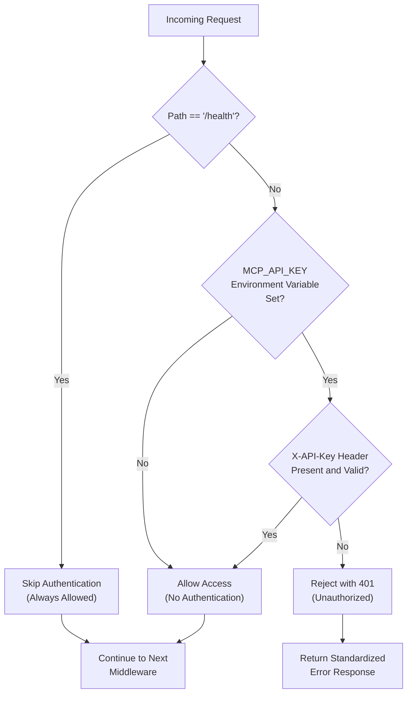
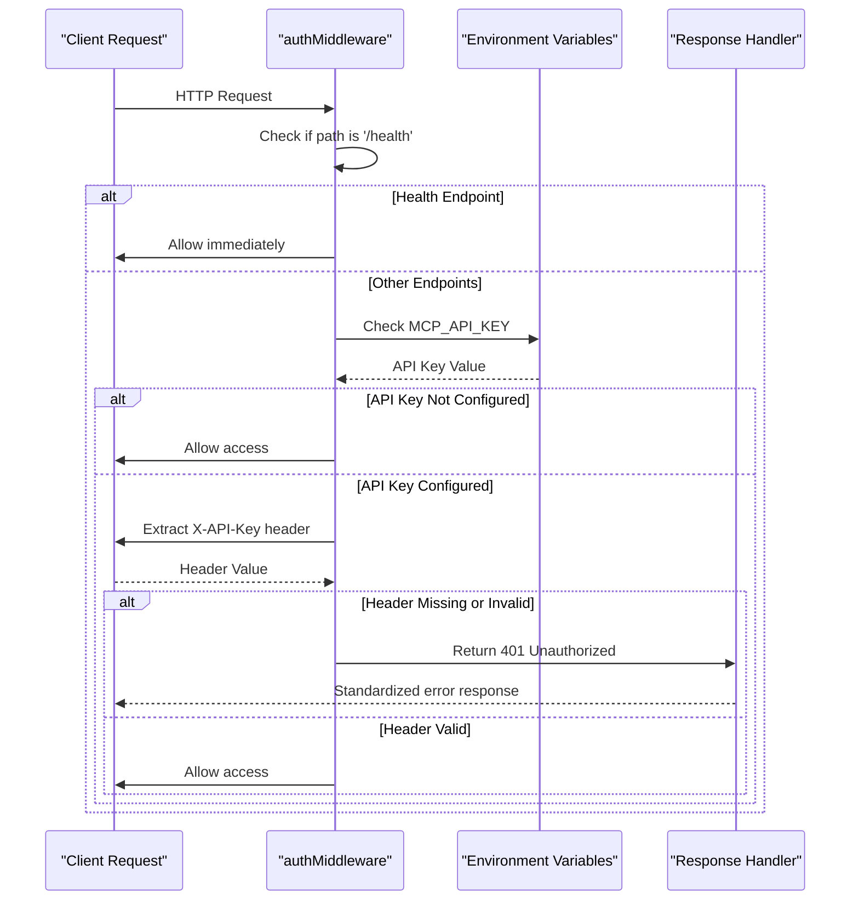
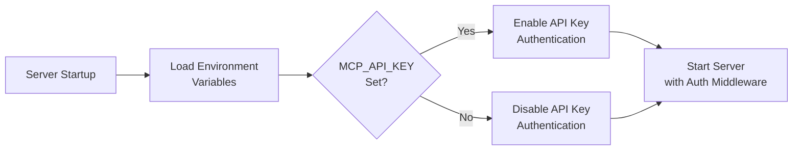
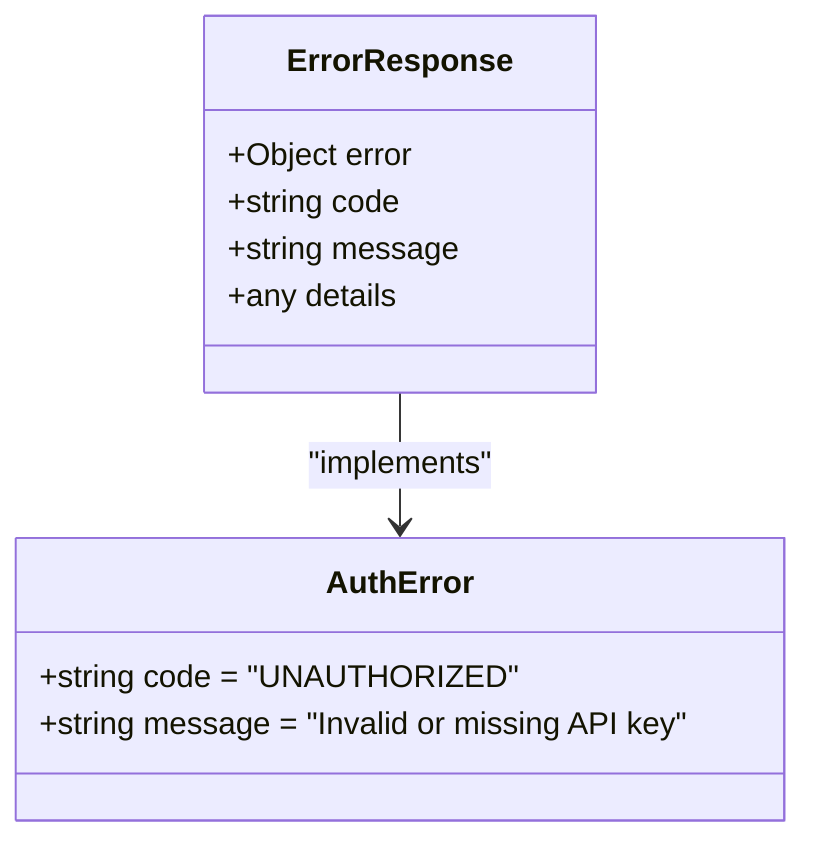

# Authentication Middleware

<cite>
**Referenced Files in This Document**
- [auth.ts](file://src/server/middleware/auth.ts)
- [mcp-server.ts](file://src/server/mcp-server.ts)
- [statusController.ts](file://src/server/controllers/statusController.ts)
- [status.ts](file://src/server/routes/status.ts)
- [mcp.md](file://AI/mcp.md)
- [package.json](file://package.json)
- [mcp.ts](file://src/main/ipc/mcp.ts)
</cite>

## Table of Contents
1. [Introduction](#introduction)
2. [Authentication Architecture](#authentication-architecture)
3. [Middleware Implementation](#middleware-implementation)
4. [Configuration](#configuration)
5. [Security Features](#security-features)
6. [Error Handling](#error-handling)
7. [API Usage Examples](#api-usage-examples)
8. [Security Best Practices](#security-best-practices)
9. [Troubleshooting](#troubleshooting)
10. [Production Deployment](#production-deployment)

## Introduction

The MCP Server's authentication middleware provides optional API key authentication for securing API endpoints. This middleware implements a lightweight, configurable authentication system that protects sensitive endpoints while maintaining accessibility for internal applications and monitoring systems.

The authentication mechanism operates on a principle of "defense in depth," where local-only binding serves as the primary security measure, supplemented by optional API key authentication for production deployments. This approach ensures that the server remains accessible for development and internal use while providing robust protection in production environments.

## Authentication Architecture

The authentication system follows a layered security approach designed for flexibility and security:



**Diagram sources**
- [auth.ts](file://src/server/middleware/auth.ts#L3-L26)

### Security Layers

1. **Network Layer Protection**: By default, the server binds to localhost, restricting access to the local machine
2. **Endpoint-Level Protection**: Specific endpoints can be protected through middleware configuration
3. **API Key Validation**: Optional header-based authentication for external access
4. **Health Endpoint Bypass**: Monitoring and health checks remain accessible without authentication

**Section sources**
- [auth.ts](file://src/server/middleware/auth.ts#L1-L27)
- [mcp-server.ts](file://src/server/mcp-server.ts#L20-L25)

## Middleware Implementation

### Core Authentication Logic

The `authMiddleware` function implements a simple yet effective authentication strategy:



**Diagram sources**
- [auth.ts](file://src/server/middleware/auth.ts#L3-L26)

### Key Implementation Details

The middleware performs three critical operations:

1. **Health Endpoint Bypass**: Automatically allows requests to `/health` without authentication
2. **Environment Variable Check**: Validates the presence of the `MCP_API_KEY` environment variable
3. **Header Validation**: Compares the provided `X-API-Key` header against the configured API key

**Section sources**
- [auth.ts](file://src/server/middleware/auth.ts#L3-L26)

## Configuration

### Environment Variables

The authentication system relies on a single environment variable for configuration:

| Variable | Description | Default | Required |
|----------|-------------|---------|----------|
| `MCP_API_KEY` | Secret key for API authentication | None | No |

### Setting Up API Keys

#### Development Environment
For development, API key authentication is disabled by default. The server runs with minimal security restrictions:

```bash
# No API key required
export MCP_API_KEY=""  # Empty value disables authentication
export MCP_API_KEY="development-key"  # Enable authentication
```

#### Production Environment
In production, configure a strong, randomly generated API key:

```bash
# Generate a secure API key
openssl rand -hex 32
# Example output: "a1b2c3d4e5f67890abcdef1234567890abcdef1234567890abcdef1234567890"

# Set the API key
export MCP_API_KEY="a1b2c3d4e5f67890abcdef1234567890abcdef1234567890abcdef1234567890"
```

### Server Configuration

The server automatically reads environment variables during startup:



**Diagram sources**
- [mcp-server.ts](file://src/server/mcp-server.ts#L18-L25)
- [auth.ts](file://src/server/middleware/auth.ts#L9-L11)

**Section sources**
- [mcp.md](file://AI/mcp.md#L477-L485)
- [mcp-server.ts](file://src/server/mcp-server.ts#L18-L25)

## Security Features

### Local-Only Binding

The server implements network-level security by binding to localhost by default:

```typescript
const HOST = process.env.MCP_SERVER_HOST || 'localhost';
const PORT = process.env.MCP_SERVER_PORT || 3000;
```

This configuration ensures that:
- Only local applications can connect to the server
- Network exposure is minimized
- Development and testing remain convenient
- Production deployments require explicit network configuration

### API Key Protection

When enabled, API key authentication provides additional security layers:

1. **Header-Based Authentication**: Uses the standard `X-API-Key` header
2. **Exact Match Validation**: Requires exact string comparison
3. **Standardized Error Responses**: Consistent error messaging for security
4. **No Rate Limiting**: Relies on higher-level rate limiting middleware

### Health Endpoint Accessibility

The `/health` endpoint remains accessible without authentication to support:
- Monitoring systems
- Load balancer health checks
- Container orchestration platforms
- Automated deployment pipelines

**Section sources**
- [mcp-server.ts](file://src/server/mcp-server.ts#L18-L25)
- [auth.ts](file://src/server/middleware/auth.ts#L5-L7)

## Error Handling

### Unauthorized Response Format

When authentication fails, the middleware returns a standardized JSON response:

```json
{
  "error": {
    "code": "UNAUTHORIZED",
    "message": "Invalid or missing API key"
  }
}
```

### HTTP Status Codes

The authentication middleware responds with appropriate HTTP status codes:

| Condition | Status Code | Response |
|-----------|-------------|----------|
| Successful authentication | 200 | Continue processing |
| Missing API key (when required) | 401 | Unauthorized |
| Invalid API key (when required) | 401 | Unauthorized |
| Health endpoint access | 200 | Always allowed |

### Error Response Structure

The error response follows a consistent pattern across the API:



**Diagram sources**
- [auth.ts](file://src/server/middleware/auth.ts#L16-L23)

**Section sources**
- [auth.ts](file://src/server/middleware/auth.ts#L16-L23)
- [mcp.md](file://AI/mcp.md#L370-L385)

## API Usage Examples

### Valid Request Patterns

#### Without API Key Authentication (Development)
```bash
# Health check (always allowed)
curl http://localhost:3000/health

# Task creation (no API key needed)
curl -X POST http://localhost:3000/api/tasks \
  -H "Content-Type: application/json" \
  -d '{"title": "Test Task"}'
```

#### With API Key Authentication (Production)
```bash
# Health check (still allowed)
curl http://localhost:3000/health

# Task creation with API key
curl -X POST http://localhost:3000/api/tasks \
  -H "Content-Type: application/json" \
  -H "X-API-Key: your-secret-api-key" \
  -d '{"title": "Secure Task"}'

# Project status with API key
curl http://localhost:3000/api/projects/status \
  -H "X-API-Key: your-secret-api-key"
```

### Invalid Request Patterns

#### Missing API Key
```bash
# Will fail with 401 Unauthorized
curl -X POST http://localhost:3000/api/tasks \
  -H "Content-Type: application/json" \
  -d '{"title": "Test Task"}'
```

#### Incorrect API Key
```bash
# Will fail with 401 Unauthorized
curl -X POST http://localhost:3000/api/tasks \
  -H "Content-Type: application/json" \
  -H "X-API-Key: wrong-key" \
  -d '{"title": "Test Task"}'
```

#### Health Endpoint with Invalid Key
```bash
# Health endpoint bypasses authentication
curl http://localhost:3000/health \
  -H "X-API-Key: invalid-key"
# Returns 200 OK regardless of key
```

**Section sources**
- [statusController.ts](file://src/server/controllers/statusController.ts#L12-L15)
- [mcp.md](file://AI/mcp.md#L580-L610)

## Security Best Practices

### Production Deployment Guidelines

1. **Strong API Key Generation**
   ```bash
   # Generate cryptographically secure API key
   openssl rand -hex 32
   
   # Store securely in environment
   export MCP_API_KEY="generated-strong-key"
   ```

2. **Environment Variable Management**
   - Use `.env` files for development
   - Configure environment variables in production
   - Never commit API keys to version control
   - Rotate keys regularly

3. **Network Configuration**
   ```bash
   # Bind to localhost (default)
   export MCP_SERVER_HOST=localhost
   
   # For internal network access (use with caution)
   export MCP_SERVER_HOST=0.0.0.0
   
   # For external access (requires API key)
   export MCP_SERVER_HOST=0.0.0.0
   export MCP_API_KEY="strong-production-key"
   ```

4. **Monitoring and Logging**
   - Enable comprehensive logging for authentication failures
   - Monitor for unusual authentication patterns
   - Set up alerts for repeated 401 responses

### Development Environment Security

1. **Local Testing Only**
   - Use localhost binding for development
   - Disable API keys during development
   - Test authentication flows thoroughly

2. **Environment Separation**
   - Separate development and production configurations
   - Use different API keys for different environments
   - Implement proper environment variable validation

### Container Deployment

For containerized deployments:

```dockerfile
# Dockerfile example
FROM node:18-alpine
WORKDIR /app
COPY package*.json ./
RUN npm ci --only=production
COPY dist ./dist
EXPOSE 3000

# Use environment variables for configuration
ENV MCP_SERVER_HOST=0.0.0.0
ENV MCP_API_KEY=${MCP_API_KEY}

CMD ["npm", "run", "mcp:start"]
```

**Section sources**
- [mcp.md](file://AI/mcp.md#L354-L365)
- [mcp-server.ts](file://src/server/mcp-server.ts#L18-L25)

## Troubleshooting

### Common Issues and Solutions

#### Issue: 401 Unauthorized Responses

**Symptoms:**
- Requests receive 401 status codes
- Error message: "Invalid or missing API key"

**Diagnosis Steps:**
1. Verify API key is set in environment
2. Check header format: `X-API-Key: your-key`
3. Ensure key matches exactly (case-sensitive)

**Solutions:**
```bash
# Check if API key is set
echo $MCP_API_KEY

# Verify header format
curl -I http://localhost:3000/api/status \
  -H "X-API-Key: $MCP_API_KEY"

# Test with curl
curl http://localhost:3000/api/status \
  -H "X-API-Key: $MCP_API_KEY" \
  -H "Content-Type: application/json"
```

#### Issue: Health Endpoint Failing

**Symptoms:**
- `/health` endpoint returns 401 instead of 200

**Root Cause:**
The health endpoint should never require authentication, but this could indicate a middleware configuration issue.

**Solution:**
Check middleware order in server configuration:
```typescript
// Correct middleware order
app.use(authMiddleware);  // Must come before route handlers
app.use('/api/*', apiRoutes);
```

#### Issue: Environment Variable Not Loading

**Symptoms:**
- API key appears to be ignored
- Authentication works inconsistently

**Diagnosis:**
```bash
# Check environment variable availability
printenv | grep MCP_API_KEY

# Verify in Node.js
node -e "console.log(process.env.MCP_API_KEY)"
```

**Solutions:**
1. Restart the server after setting environment variables
2. Use proper shell syntax: `export MCP_API_KEY=value`
3. Check for typos in variable names

#### Issue: CORS Problems with API Key

**Symptoms:**
- Cross-origin requests failing
- Preflight requests blocked

**Solution:**
Configure CORS appropriately:
```typescript
app.use(cors({
  origin: process.env.MCP_CORS_ORIGIN || '*',  // '*' for development
  credentials: true
}));
```

### Debugging Authentication Flow

Enable detailed logging to debug authentication issues:

```typescript
// Add to auth middleware for debugging
console.log('API Key from env:', process.env.MCP_API_KEY);
console.log('Provided key:', req.headers['x-api-key']);
```

### Performance Considerations

The authentication middleware has minimal performance impact:
- Single environment variable lookup
- String comparison operation
- Minimal memory allocation
- Fast execution time (< 1ms)

**Section sources**
- [auth.ts](file://src/server/middleware/auth.ts#L9-L26)
- [mcp.md](file://AI/mcp.md#L370-L385)

## Production Deployment

### Deployment Checklist

1. **Environment Configuration**
   - [ ] Set `MCP_API_KEY` environment variable
   - [ ] Configure `MCP_SERVER_HOST` appropriately
   - [ ] Set `MCP_SERVER_PORT` if different from default
   - [ ] Configure CORS origins if needed

2. **Security Hardening**
   - [ ] Bind to localhost or internal network
   - [ ] Use strong, randomly generated API keys
   - [ ] Implement proper logging and monitoring
   - [ ] Set up automated backups

3. **Monitoring Setup**
   - [ ] Monitor authentication success rates
   - [ ] Track 401 error patterns
   - [ ] Set up alerting for authentication failures
   - [ ] Monitor server health endpoints

### Deployment Examples

#### systemd Service (Linux)
```ini
[Unit]
Description=MCP Server
After=network.target

[Service]
Type=simple
User=mcp-user
WorkingDirectory=/opt/mcp-server
Environment=MCP_API_KEY=your-production-key
Environment=MCP_SERVER_HOST=0.0.0.0
Environment=MCP_SERVER_PORT=3000
ExecStart=/usr/bin/npm run mcp:start
Restart=always

[Install]
WantedBy=multi-user.target
```

#### Docker Compose
```yaml
version: '3.8'
services:
  mcp-server:
    image: lifeos-mcp:latest
    ports:
      - "3000:3000"
    environment:
      - MCP_API_KEY=${MCP_API_KEY}
      - MCP_SERVER_HOST=0.0.0.0
      - MCP_SERVER_PORT=3000
    restart: unless-stopped
```

### Scaling Considerations

For high-availability deployments:
- Use load balancers with sticky sessions
- Implement API key caching for performance
- Consider distributed authentication systems
- Set up proper SSL/TLS termination

**Section sources**
- [mcp.md](file://AI/mcp.md#L486-L508)
- [mcp-server.ts](file://src/server/mcp-server.ts#L50-L89)