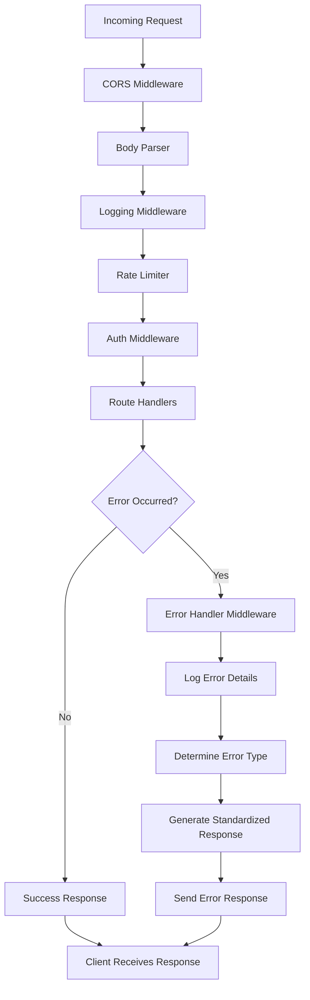
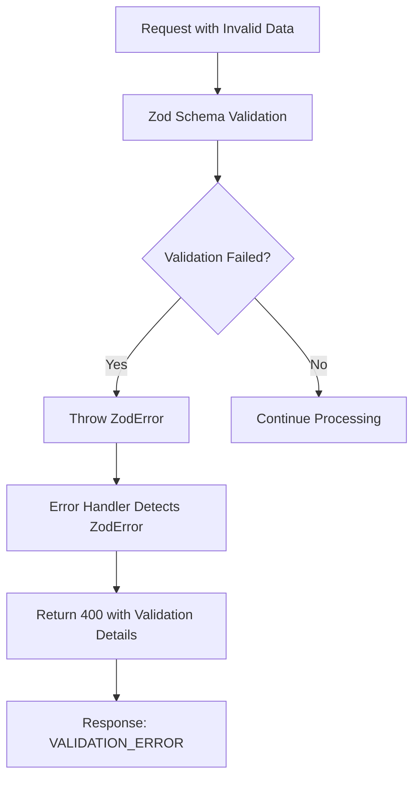
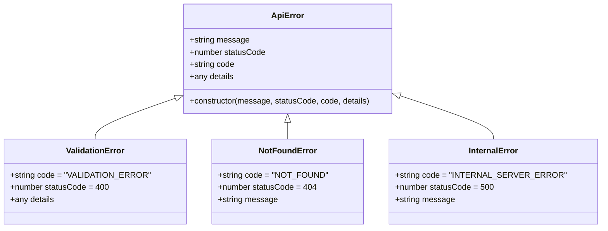
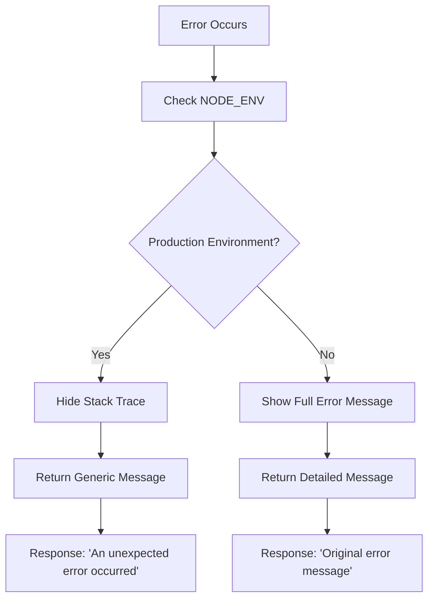
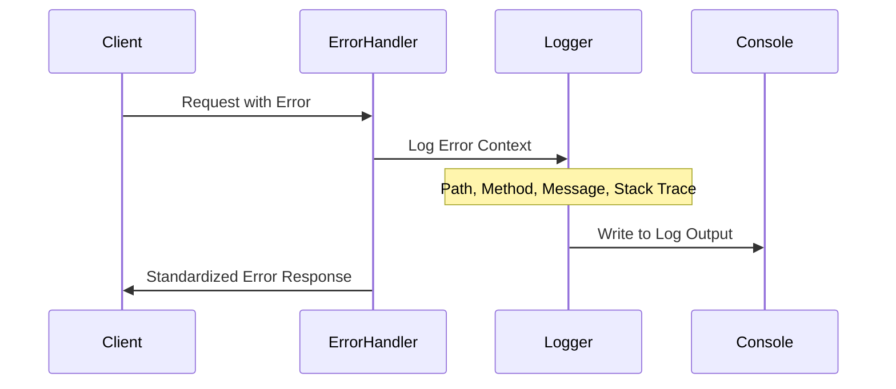
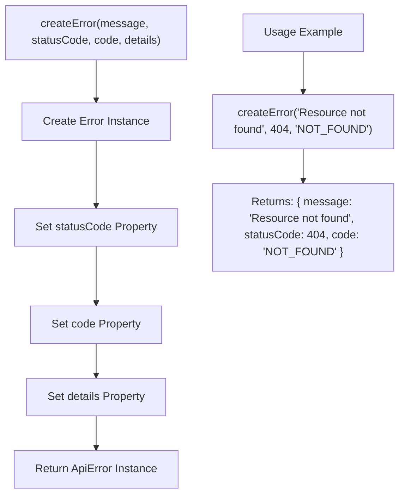
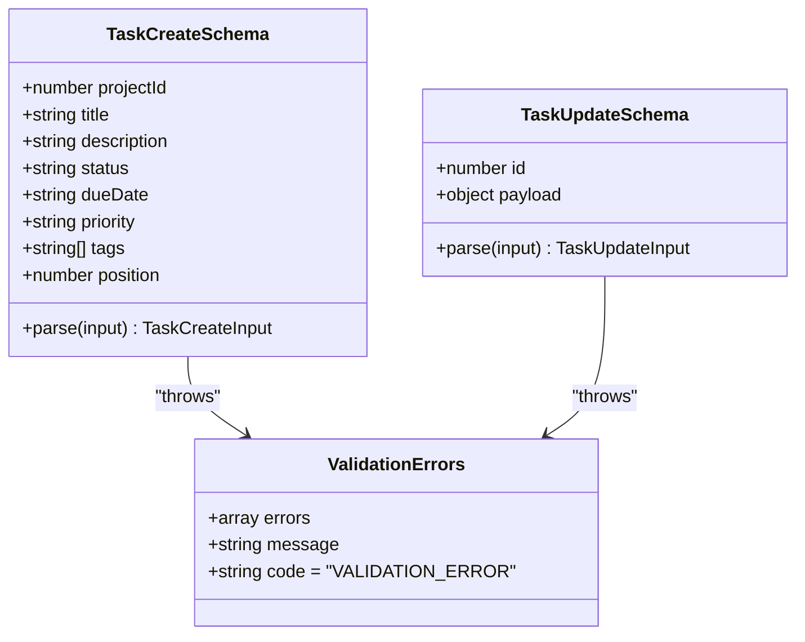
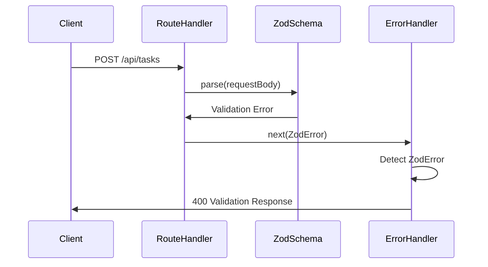

# Error Handling Middleware

<cite>
**Referenced Files in This Document**
- [errorHandler.ts](file://src/server/middleware/errorHandler.ts)
- [logger.ts](file://src/server/utils/logger.ts)
- [mcp-server.ts](file://src/server/mcp-server.ts)
- [tasksController.ts](file://src/server/controllers/tasksController.ts)
- [projectsController.ts](file://src/server/controllers/projectsController.ts)
- [tasksRepo.ts](file://src/database/tasksRepo.ts)
- [projectsRepo.ts](file://src/database/projectsRepo.ts)
- [init.ts](file://src/database/init.ts)
- [rateLimiter.ts](file://src/server/middleware/rateLimiter.ts)
- [auth.ts](file://src/server/middleware/auth.ts)
- [logging.ts](file://src/server/middleware/logging.ts)
</cite>

## Table of Contents
1. [Introduction](#introduction)
2. [Error Handler Architecture](#error-handler-architecture)
3. [Error Types and Hierarchy](#error-types-and-hierarchy)
4. [Production-Safe Error Messages](#production-safe-error-messages)
5. [Logging Integration](#logging-integration)
6. [Error Creation Utilities](#error-creation-utilities)
7. [Zod Validation Integration](#zod-validation-integration)
8. [Error Response Formats](#error-response-formats)
9. [Extending Error Handling](#extending-error-handling)
10. [Troubleshooting Guide](#troubleshooting-guide)
11. [Best Practices](#best-practices)

## Introduction

The MCP Server implements a centralized error handling middleware that provides consistent, structured error responses across all API endpoints. This system intercepts errors at the application level, categorizes them according to predefined patterns, and returns standardized JSON responses while maintaining security and operational visibility.

The error handling middleware serves as the final line of defense in the request processing pipeline, ensuring that all errors are captured, logged appropriately, and presented to clients in a consistent format regardless of their origin.

## Error Handler Architecture

The error handling system is built around a single middleware function that sits at the end of the Express middleware chain, catching any unhandled errors that propagate through the application.



**Diagram sources**
- [mcp-server.ts](file://src/server/mcp-server.ts#L20-L45)
- [errorHandler.ts](file://src/server/middleware/errorHandler.ts#L10-L70)

**Section sources**
- [mcp-server.ts](file://src/server/mcp-server.ts#L20-L45)
- [errorHandler.ts](file://src/server/middleware/errorHandler.ts#L10-L70)

## Error Types and Hierarchy

The error handling middleware implements a hierarchical approach to error categorization, processing errors in a specific order to ensure appropriate responses are generated for different types of failures.

### Zod Validation Errors (400 Bad Request)

Zod validation errors represent the highest priority category, occurring when incoming request data fails schema validation. These errors receive special treatment because they indicate client-side data issues.



**Diagram sources**
- [tasksRepo.ts](file://src/database/tasksRepo.ts#L6-L18)
- [errorHandler.ts](file://src/server/middleware/errorHandler.ts#L18-L28)

### Custom ApiError Instances

Custom ApiError instances represent application-specific errors that developers explicitly create using the `createError` utility. These errors carry additional metadata including status codes, error codes, and detailed information.



**Diagram sources**
- [errorHandler.ts](file://src/server/middleware/errorHandler.ts#L5-L10)
- [errorHandler.ts](file://src/server/middleware/errorHandler.ts#L30-L42)

### Not Found Errors (404)

Not found errors occur when requested resources cannot be located. The system specifically checks for error messages containing the word "not found" to identify these scenarios.

### Generic Internal Server Errors (500)

All other errors that don't match the above categories are treated as generic internal server errors. These typically represent unexpected conditions or unhandled exceptions.

**Section sources**
- [errorHandler.ts](file://src/server/middleware/errorHandler.ts#L18-L60)

## Production-Safe Error Messages

The error handling system implements a security-first approach to error messaging, ensuring sensitive information is not exposed in production environments while still providing useful feedback for debugging.

### Environment-Based Message Filtering



**Diagram sources**
- [errorHandler.ts](file://src/server/middleware/errorHandler.ts#L55-L60)

### Security Considerations

- **Stack Traces Hidden**: Production environments suppress stack traces to prevent information disclosure
- **Generic Messages**: Internal server errors return generic messages rather than technical details
- **Selective Information**: Validation errors and specific error types provide helpful context without exposing internals

**Section sources**
- [errorHandler.ts](file://src/server/middleware/errorHandler.ts#L55-L60)

## Logging Integration

The error handling middleware integrates seamlessly with the server's logging system to capture comprehensive error context for monitoring and debugging purposes.

### Error Context Capture



**Diagram sources**
- [errorHandler.ts](file://src/server/middleware/errorHandler.ts#L12-L17)
- [logger.ts](file://src/server/utils/logger.ts#L30-L47)

### Log Entry Structure

The logging system captures the following contextual information for each error:

| Field | Description | Example |
|-------|-------------|---------|
| path | Request URL path | `/api/tasks/123` |
| method | HTTP method | `GET`, `POST`, `PUT` |
| error | Error message | `"Task not found"` |
| stack | Error stack trace | Full stack trace |

**Section sources**
- [errorHandler.ts](file://src/server/middleware/errorHandler.ts#L12-L17)
- [logger.ts](file://src/server/utils/logger.ts#L30-L47)

## Error Creation Utilities

The `createError` utility function provides a standardized way to generate custom API errors throughout the application, ensuring consistency in error creation patterns.

### Error Factory Function

The `createError` function creates ApiError instances with proper TypeScript typing and default values:



**Diagram sources**
- [errorHandler.ts](file://src/server/middleware/errorHandler.ts#L62-L70)

### Usage Patterns

The error factory is used throughout controllers and services to create consistent error responses:

- **Resource Not Found**: `createError('Task not found', 404, 'NOT_FOUND')`
- **Validation Failures**: `createError('Invalid input data', 400, 'VALIDATION_ERROR')`
- **Permission Denied**: `createError('Access denied', 403, 'FORBIDDEN')`
- **Internal Errors**: `createError('Database operation failed', 500, 'DATABASE_ERROR')`

**Section sources**
- [errorHandler.ts](file://src/server/middleware/errorHandler.ts#L62-L70)

## Zod Validation Integration

The server leverages Zod for comprehensive request validation, with the error handler automatically detecting and processing Zod validation errors.

### Schema Definition Pattern



**Diagram sources**
- [tasksRepo.ts](file://src/database/tasksRepo.ts#L6-L18)
- [tasksRepo.ts](file://src/database/tasksRepo.ts#L20-L32)

### Validation Workflow



**Diagram sources**
- [tasksRepo.ts](file://src/database/tasksRepo.ts#L50-L55)
- [errorHandler.ts](file://src/server/middleware/errorHandler.ts#L18-L28)

**Section sources**
- [tasksRepo.ts](file://src/database/tasksRepo.ts#L6-L32)
- [projectsRepo.ts](file://src/database/projectsRepo.ts#L6-L14)

## Error Response Formats

The error handling middleware generates standardized JSON responses that follow a consistent structure across all error types.

### Standard Error Response Structure

```json
{
  "error": {
    "code": "ERROR_CODE",
    "message": "Human-readable error description",
    "details": {
      // Additional error-specific information
    }
  }
}
```

### HTTP Status Code Mapping

| Error Type | Status Code | Example Code | Typical Scenarios |
|------------|-------------|--------------|-------------------|
| Validation Error | 400 | `VALIDATION_ERROR` | Invalid request data, schema violations |
| Not Found | 404 | `NOT_FOUND` | Resource not found, invalid IDs |
| Unauthorized | 401 | `UNAUTHORIZED` | Missing or invalid API key |
| Rate Limited | 429 | `RATE_LIMIT_EXCEEDED` | Too many requests |
| Internal Error | 500 | `INTERNAL_SERVER_ERROR` | Unexpected server errors |

### Specific Error Examples

#### Zod Validation Error Response
```json
{
  "error": {
    "code": "VALIDATION_ERROR",
    "message": "Invalid request data",
    "details": [
      {
        "code": "too_small",
        "minimum": 1,
        "type": "string",
        "inclusive": true,
        "message": "String must contain at least 1 character(s)",
        "path": ["title"]
      }
    ]
  }
}
```

#### Custom ApiError Response
```json
{
  "error": {
    "code": "NOT_FOUND",
    "message": "Task not found",
    "details": {
      "id": 123,
      "resourceType": "task"
    }
  }
}
```

#### Production Internal Server Error
```json
{
  "error": {
    "code": "INTERNAL_SERVER_ERROR",
    "message": "An unexpected error occurred"
  }
}
```

**Section sources**
- [errorHandler.ts](file://src/server/middleware/errorHandler.ts#L18-L60)

## Extending Error Handling

The error handling system is designed to be extensible, allowing developers to add custom error types and handling logic as needed.

### Adding Custom Error Types

To add a new error type, extend the ApiError interface and modify the error handler:

```typescript
// Extend the ApiError interface
export interface ApiError extends Error {
  statusCode?: number;
  code?: string;
  details?: any;
  customField?: string; // New field
}

// Modify error handler to handle new type
if (err instanceof CustomError) {
  return res.status(err.statusCode || 500).json({
    error: {
      code: err.code || 'CUSTOM_ERROR',
      message: err.message,
      details: err.details,
      customField: err.customField // Include new field
    }
  });
}
```

### Creating Custom Error Classes

```typescript
export class CustomError extends Error {
  constructor(
    public code: string,
    public message: string,
    public statusCode: number = 500,
    public details?: any
  ) {
    super(message);
    this.code = code;
    this.statusCode = statusCode;
    this.details = details;
  }
}
```

### Middleware Integration

Custom error handlers can be integrated into the middleware chain by adding them before the main error handler:

```typescript
app.use(customErrorHandler);
app.use(errorHandler);
```

## Troubleshooting Guide

Common error scenarios and their resolution strategies.

### Debugging Error Handling Issues

#### Problem: Errors Not Being Caught
**Symptoms**: Unhandled exceptions causing server crashes
**Solution**: Ensure error handler is the last middleware in the chain

#### Problem: Missing Error Context
**Symptoms**: Logs lack path, method, or stack trace information
**Solution**: Verify logger integration and error handler placement

#### Problem: Incorrect Status Codes
**Symptoms**: Validation errors returning 500 instead of 400
**Solution**: Check Zod error detection logic in error handler

### Common Error Scenarios

#### Database Connection Errors
When the database fails to initialize, the system continues running but with reduced functionality. The error handler catches these gracefully.

#### Validation Failures
Zod validation errors are automatically detected and formatted with detailed validation information.

#### Resource Not Found
Explicit resource not found errors are handled consistently across all controllers.

### Debugging Workflows

1. **Enable Debug Logging**: Set `MCP_LOG_LEVEL=debug` to capture detailed error information
2. **Test Error Scenarios**: Use known invalid inputs to trigger validation errors
3. **Monitor Logs**: Check server logs for error context and stack traces
4. **Verify Environment**: Ensure proper NODE_ENV setting for production safety

**Section sources**
- [init.ts](file://src/database/init.ts#L25-L35)
- [logger.ts](file://src/server/utils/logger.ts#L8-L12)

## Best Practices

### Error Handling Guidelines

1. **Always Use Try-Catch**: Wrap all asynchronous operations in try-catch blocks
2. **Pass Errors to Next**: Use `next(error)` to propagate errors to the error handler
3. **Use Standard Error Codes**: Leverage the established error code patterns
4. **Provide Meaningful Messages**: Include context in error messages for debugging
5. **Maintain Security**: Never expose sensitive information in error messages

### Controller Error Patterns

```typescript
// Good: Consistent error handling
export async function getTask(req: Request, res: Response, next: NextFunction) {
  try {
    const id = parseInt(req.params.id, 10);
    const task = tasksRepo.getTaskById(id);
    
    if (!task) {
      return res.status(404).json({
        error: {
          code: 'NOT_FOUND',
          message: 'Task not found'
        }
      });
    }
    
    res.json({ data: task });
  } catch (error) {
    next(error);
  }
}

// Better: Using createError utility
export async function getTask(req: Request, res: Response, next: NextFunction) {
  try {
    const id = parseInt(req.params.id, 10);
    const task = tasksRepo.getTaskById(id);
    
    if (!task) {
      throw createError('Task not found', 404, 'NOT_FOUND');
    }
    
    res.json({ data: task });
  } catch (error) {
    next(error);
  }
}
```

### Validation Best Practices

1. **Define Clear Schemas**: Use Zod to define comprehensive request schemas
2. **Validate Early**: Perform validation as close to the route handler as possible
3. **Provide Helpful Messages**: Include context in validation error messages
4. **Handle Edge Cases**: Account for null, undefined, and malformed data

### Logging Best Practices

1. **Structured Logging**: Use consistent log formats across the application
2. **Context Preservation**: Include relevant request context in error logs
3. **Security Awareness**: Avoid logging sensitive data in production
4. **Performance Consideration**: Minimize logging overhead in high-traffic scenarios

**Section sources**
- [tasksController.ts](file://src/server/controllers/tasksController.ts#L10-L15)
- [projectsController.ts](file://src/server/controllers/projectsController.ts#L10-L15)
- [errorHandler.ts](file://src/server/middleware/errorHandler.ts#L62-L70)