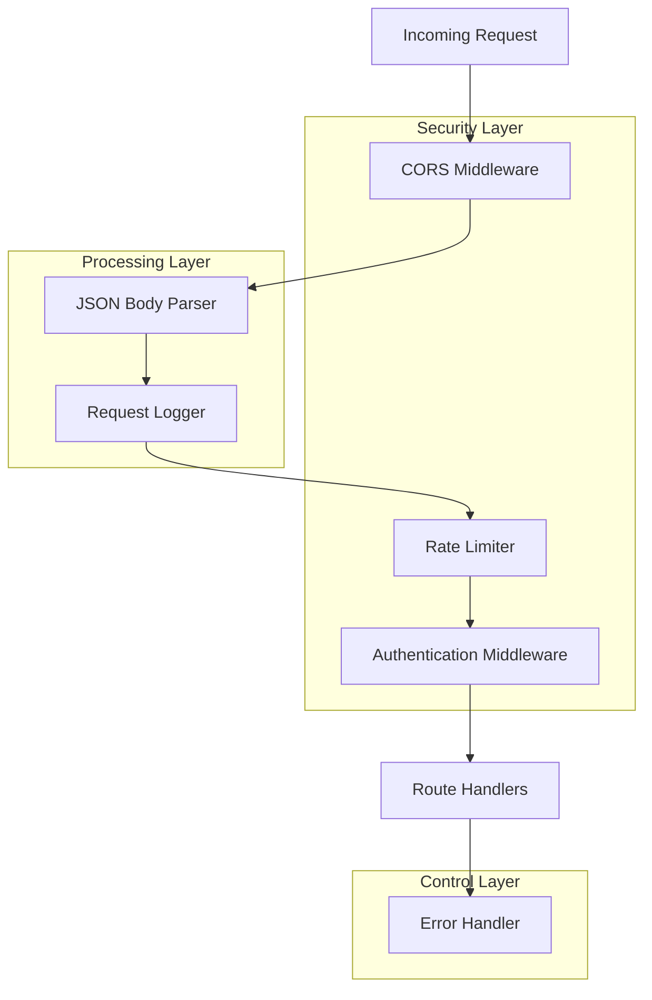
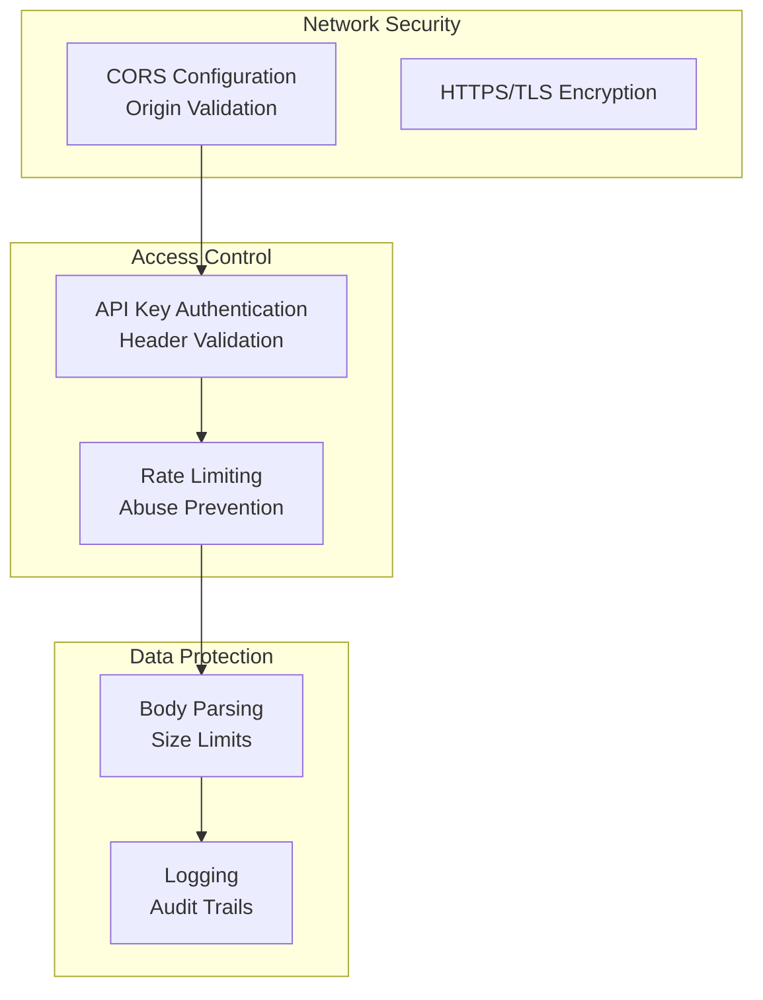
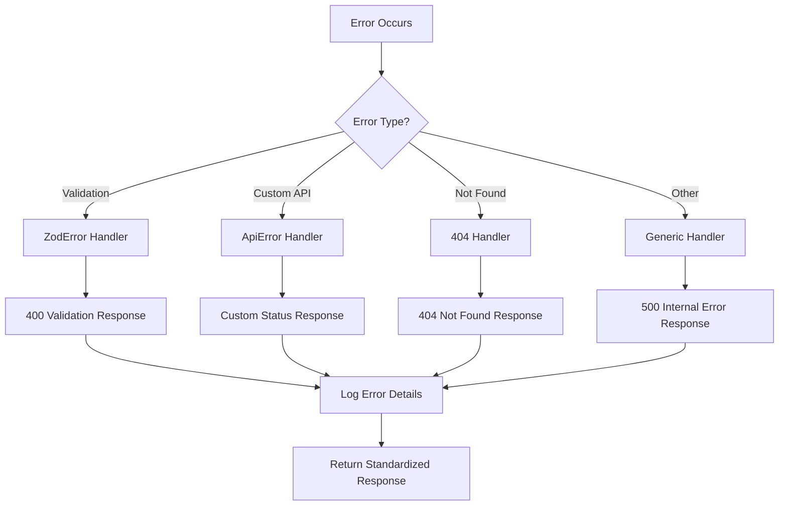
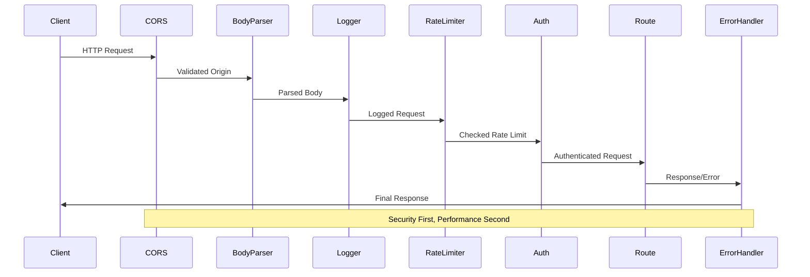

# Middleware Pipeline

<cite>
**Referenced Files in This Document**
- [mcp-server.ts](file://src/server/mcp-server.ts)
- [auth.ts](file://src/server/middleware/auth.ts)
- [errorHandler.ts](file://src/server/middleware/errorHandler.ts)
- [logging.ts](file://src/server/middleware/logging.ts)
- [rateLimiter.ts](file://src/server/middleware/rateLimiter.ts)
- [logger.ts](file://src/server/utils/logger.ts)
- [statusController.ts](file://src/server/controllers/statusController.ts)
- [mcp.ts](file://src/main/ipc/mcp.ts)
- [mcpRepo.ts](file://src/database/mcpRepo.ts)
</cite>

## Table of Contents
1. [Introduction](#introduction)
2. [Middleware Architecture Overview](#middleware-architecture-overview)
3. [Core Middleware Components](#core-middleware-components)
4. [Security Configuration](#security-configuration)
5. [Error Handling Strategy](#error-handling-strategy)
6. [Environment Variables](#environment-variables)
7. [Middleware Chain Execution Order](#middleware-chain-execution-order)
8. [Extending the Middleware Pipeline](#extending-the-middleware-pipeline)
9. [Troubleshooting Guide](#troubleshooting-guide)
10. [Best Practices](#best-practices)

## Introduction

The MCP (Model Context Protocol) Server implements a robust middleware pipeline that provides essential functionality for secure, reliable, and performant API operations. The middleware chain follows a sequential execution model where each middleware component handles specific concerns such as security, logging, rate limiting, and error management.

The middleware architecture is designed with modularity and extensibility in mind, allowing developers to easily add custom functionality while maintaining security and performance standards. Each middleware component operates independently but contributes to the overall system reliability and user experience.

## Middleware Architecture Overview

The MCP Server middleware pipeline consists of five primary components that execute in a specific order to process incoming HTTP requests. The architecture emphasizes security-first principles with comprehensive logging, rate limiting, and error handling capabilities.



**Diagram sources**
- [mcp-server.ts](file://src/server/mcp-server.ts#L25-L40)

**Section sources**
- [mcp-server.ts](file://src/server/mcp-server.ts#L25-L40)

## Core Middleware Components

### CORS Configuration Middleware

The Cross-Origin Resource Sharing (CORS) middleware enables controlled access from web applications hosted on different domains. It provides configurable origin whitelisting and credential support.

**Key Features:**
- Origin-based access control with wildcard support
- Credential support for authenticated requests
- Environment variable configuration
- Automatic health check bypass

**Configuration Options:**
- `MCP_CORS_ORIGIN`: Specifies allowed origins (default: '*')
- Credentials support for authenticated requests

**Security Implications:**
- Wildcard origins (`*`) allow unrestricted access
- Production environments should specify exact origins
- Credentials support requires careful origin validation

**Section sources**
- [mcp-server.ts](file://src/server/mcp-server.ts#L26-L30)

### JSON Body Parsing Middleware

The JSON body parser handles incoming request payloads with configurable size limits and encoding support. It automatically parses JSON content and makes it available in the request object.

**Key Features:**
- Automatic JSON parsing for supported content types
- Size limit configuration (default: 10MB)
- URL-encoded form data support
- Built-in error handling for malformed JSON

**Configuration Options:**
- Content size limit: 10MB default
- Extended URL-encoded support
- Automatic content-type detection

**Section sources**
- [mcp-server.ts](file://src/server/mcp-server.ts#L31-L32)

### Request Logging Middleware

The request logging middleware provides comprehensive audit trails for all API interactions. It captures request details, response information, and performance metrics.

**Key Features:**
- Structured logging with metadata
- Performance timing measurement
- Conditional log levels
- Request/response correlation

**Logging Levels:**
- `info`: Successful requests and informational messages
- `error`: Failed requests and error conditions
- Configurable via `MCP_LOG_LEVEL` environment variable

**Log Format:**
```
[timestamp] LEVEL → METHOD PATH {query, body}
[timestamp] LEVEL ← METHOD PATH STATUS_CODE (duration)ms
```

**Section sources**
- [logging.ts](file://src/server/middleware/logging.ts#L4-L22)
- [logger.ts](file://src/server/utils/logger.ts#L1-L47)

### Rate Limiting Middleware

The rate limiting middleware prevents abuse and ensures fair resource allocation by controlling request frequency per IP address.

**Key Features:**
- IP-based rate limiting
- Configurable rate limits and time windows
- Automatic cleanup of expired entries
- Standardized rate limit headers
- Graceful degradation with 429 responses

**Rate Limiting Algorithm:**
- Fixed window implementation
- Memory-based storage
- Automatic cleanup of expired entries
- Configurable window size (default: 1 minute)

**Rate Limit Headers:**
- `X-RateLimit-Limit`: Maximum requests per window
- `X-RateLimit-Remaining`: Remaining requests in current window
- `X-RateLimit-Reset`: Window reset timestamp
- `Retry-After`: Seconds until rate limit resets

**Section sources**
- [rateLimiter.ts](file://src/server/middleware/rateLimiter.ts#L1-L69)

### Authentication Middleware

The authentication middleware provides API key-based authentication for production deployments. It validates requests against configured API keys.

**Key Features:**
- API key validation via `X-API-Key` header
- Health check bypass for monitoring
- Configurable authentication requirements
- Standardized unauthorized responses

**Authentication Flow:**
1. Skip authentication for `/health` endpoint
2. Check for `MCP_API_KEY` environment variable
3. Validate `X-API-Key` header against configured key
4. Return 401 Unauthorized for invalid or missing keys

**Security Considerations:**
- API keys should be securely stored and transmitted
- Use HTTPS in production environments
- Regular key rotation recommended
- Monitor authentication failures

**Section sources**
- [auth.ts](file://src/server/middleware/auth.ts#L3-L26)

## Security Configuration

The MCP Server implements multiple layers of security through its middleware pipeline. Each component contributes to the overall security posture while maintaining flexibility for different deployment scenarios.

### Security Layers



**Diagram sources**
- [auth.ts](file://src/server/middleware/auth.ts#L1-L27)
- [rateLimiter.ts](file://src/server/middleware/rateLimiter.ts#L1-L70)

### Deployment Security Recommendations

**Development Environment:**
- Localhost binding only
- No API key requirement
- Verbose logging enabled

**Production Environment:**
- Specific CORS origins
- API key authentication enabled
- Rate limiting activated
- Minimal logging for performance
- HTTPS enforcement

**Section sources**
- [auth.ts](file://src/server/middleware/auth.ts#L1-L27)
- [rateLimiter.ts](file://src/server/middleware/rateLimiter.ts#L1-L70)

## Error Handling Strategy

The MCP Server implements a comprehensive error handling strategy that provides consistent error responses, detailed logging, and graceful degradation capabilities.

### Error Response Format

All error responses follow a standardized format for consistent client-side handling:

```typescript
{
  error: {
    code: string;        // Error classification
    message: string;     // Human-readable description
    details?: any;       // Additional error context
  }
}
```

### Error Categories

| Error Type | HTTP Status | Code Pattern | Description |
|------------|-------------|--------------|-------------|
| Validation | 400 | `VALIDATION_ERROR` | Request data validation failed |
| Authentication | 401 | `UNAUTHORIZED` | Missing or invalid API key |
| Rate Limiting | 429 | `RATE_LIMIT_EXCEEDED` | Request rate exceeded |
| Not Found | 404 | `NOT_FOUND` | Resource not found |
| Server Error | 500 | `INTERNAL_SERVER_ERROR` | Unexpected server error |

### Error Handling Flow



**Diagram sources**
- [errorHandler.ts](file://src/server/middleware/errorHandler.ts#L10-L69)

**Section sources**
- [errorHandler.ts](file://src/server/middleware/errorHandler.ts#L1-L69)

## Environment Variables

The MCP Server middleware configuration relies on several environment variables that control behavior and security settings.

### Core Configuration Variables

| Variable | Default Value | Description | Security Impact |
|----------|---------------|-------------|-----------------|
| `MCP_API_KEY` | None | API key for authentication | Enables authentication |
| `MCP_CORS_ORIGIN` | '*' | Allowed CORS origins | Controls cross-origin access |
| `MCP_RATE_LIMIT` | 100 | Requests per minute | Prevents abuse |
| `MCP_LOG_LEVEL` | 'info' | Logging verbosity | Debugging and monitoring |
| `MCP_SERVER_PORT` | 3000 | Server listening port | Network accessibility |
| `MCP_SERVER_HOST` | 'localhost' | Server bind address | Network exposure |

### Environment Variable Usage

**Authentication Configuration:**
```bash
# Enable API key authentication
export MCP_API_KEY="your-secret-api-key"

# Disable authentication (development)
export MCP_API_KEY=""
```

**CORS Configuration:**
```bash
# Allow specific origins
export MCP_CORS_ORIGIN="https://yourdomain.com,https://app.yourdomain.com"

# Allow all origins (development)
export MCP_CORS_ORIGIN="*"
```

**Rate Limiting Configuration:**
```bash
# Set custom rate limit (requests per minute)
export MCP_RATE_LIMIT=200

# Disable rate limiting (development)
export MCP_RATE_LIMIT=0
```

**Logging Configuration:**
```bash
# Verbose logging
export MCP_LOG_LEVEL="debug"

# Production logging
export MCP_LOG_LEVEL="info"

# Minimal logging
export MCP_LOG_LEVEL="error"
```

**Section sources**
- [auth.ts](file://src/server/middleware/auth.ts#L9-L11)
- [rateLimiter.ts](file://src/server/middleware/rateLimiter.ts#L10-L11)
- [logger.ts](file://src/server/utils/logger.ts#L2-L3)
- [mcp-server.ts](file://src/server/mcp-server.ts#L18-L19)

## Middleware Chain Execution Order

The middleware pipeline executes in a specific order that ensures security, performance, and reliability. Understanding this order is crucial for debugging and extending the middleware chain.

### Execution Sequence



**Diagram sources**
- [mcp-server.ts](file://src/server/mcp-server.ts#L25-L40)

### Middleware Positioning Justification

1. **CORS First**: Validates origin before processing request
2. **Body Parser Second**: Ensures request data is available for subsequent middleware
3. **Logger Third**: Captures request details before business logic execution
4. **Rate Limiter Fourth**: Monitors request frequency before authentication
5. **Authentication Fifth**: Validates credentials before accessing protected resources
6. **Routes Last**: Handles business logic and generates responses
7. **Error Handler Last**: Catches and formats all errors

**Section sources**
- [mcp-server.ts](file://src/server/mcp-server.ts#L25-L40)

## Extending the Middleware Pipeline

The MCP Server middleware architecture supports extension through custom middleware components. This section provides guidelines for adding new functionality while maintaining security and performance standards.

### Creating Custom Middleware

**Basic Middleware Template:**
```typescript
import { Request, Response, NextFunction } from 'express';

export function customMiddleware(req: Request, res: Response, next: NextFunction) {
  // Pre-processing logic
  
  // Call next middleware in chain
  next();
  
  // Post-processing logic
}
```

### Extension Guidelines

**Security Considerations:**
- Validate all inputs and outputs
- Implement proper error handling
- Log security-relevant events
- Respect existing middleware decisions

**Performance Considerations:**
- Minimize synchronous operations
- Use appropriate caching strategies
- Implement early termination when possible
- Monitor execution time

**Integration Patterns:**
- Place security middleware early in the chain
- Add logging middleware for debugging
- Position rate limiting appropriately
- Ensure error handlers are last

### Example: Custom Logging Middleware

```typescript
import { Request, Response, NextFunction } from 'express';
import { logger } from '../utils/logger';

export function customMetricsMiddleware(req: Request, res: Response, next: NextFunction) {
  const startTime = Date.now();
  
  // Capture request metrics
  const originalSend = res.send;
  res.send = function(data) {
    const duration = Date.now() - startTime;
    logger.info('API Metrics', {
      path: req.path,
      method: req.method,
      status: res.statusCode,
      duration: duration,
      dataSize: Buffer.byteLength(data)
    });
    originalSend.call(this, data);
  };
  
  next();
}
```

### Adding Middleware to Pipeline

**Integration Example:**
```typescript
// Add custom middleware after rate limiter
app.use(customMetricsMiddleware);
```

**Section sources**
- [logging.ts](file://src/server/middleware/logging.ts#L4-L22)
- [rateLimiter.ts](file://src/server/middleware/rateLimiter.ts#L12-L14)

## Troubleshooting Guide

This section addresses common issues encountered with the MCP Server middleware pipeline and provides practical solutions.

### Authentication Issues

**Problem: 401 Unauthorized Responses**
- **Cause**: Missing or incorrect API key
- **Solution**: Verify `MCP_API_KEY` environment variable and `X-API-Key` header
- **Debug**: Check authentication middleware logs

**Problem: Authentication Bypass**
- **Cause**: API key disabled in production
- **Solution**: Configure `MCP_API_KEY` for production deployments
- **Prevention**: Implement API key rotation policies

### Rate Limiting Problems

**Problem: 429 Too Many Requests**
- **Cause**: Exceeded rate limit threshold
- **Solution**: Reduce request frequency or increase rate limit
- **Debug**: Check rate limit headers and logs

**Problem: Rate Limiting Disabled**
- **Cause**: `MCP_RATE_LIMIT=0` or missing environment variable
- **Solution**: Set appropriate rate limit value
- **Monitoring**: Implement rate limit alerting

### CORS Configuration Issues

**Problem: Cross-Origin Requests Blocked**
- **Cause**: Incorrect CORS origin configuration
- **Solution**: Verify `MCP_CORS_ORIGIN` matches requesting domain
- **Debug**: Check browser developer tools network tab

**Problem: Credentials Not Working**
- **Cause**: CORS credentials not enabled
- **Solution**: Ensure CORS middleware allows credentials
- **Security**: Use specific origins instead of wildcards

### Logging and Monitoring Issues

**Problem: Missing Request Logs**
- **Cause**: Insufficient log level or disabled logging
- **Solution**: Adjust `MCP_LOG_LEVEL` environment variable
- **Debug**: Enable debug logging for development

**Problem: Performance Degradation**
- **Cause**: Excessive logging or slow middleware
- **Solution**: Optimize logging and middleware performance
- **Monitoring**: Implement request timing metrics

### Error Handling Problems

**Problem: Unhandled Exceptions**
- **Cause**: Missing error handler middleware
- **Solution**: Ensure error handler is last in middleware chain
- **Debug**: Check error handler logs

**Problem: Inconsistent Error Responses**
- **Cause**: Custom errors not properly formatted
- **Solution**: Use `createError()` function for custom errors
- **Standards**: Follow standardized error response format

### Health Check Issues

**Problem: Health Endpoint Failing**
- **Cause**: Database connection issues or middleware problems
- **Solution**: Verify database initialization and middleware execution
- **Debug**: Check health endpoint logs

**Section sources**
- [auth.ts](file://src/server/middleware/auth.ts#L12-L26)
- [rateLimiter.ts](file://src/server/middleware/rateLimiter.ts#L12-L14)
- [errorHandler.ts](file://src/server/middleware/errorHandler.ts#L10-L69)
- [logging.ts](file://src/server/middleware/logging.ts#L4-L22)

## Best Practices

### Security Best Practices

1. **API Key Management**
   - Use strong, randomly generated API keys
   - Store keys securely in environment variables
   - Implement regular key rotation
   - Monitor authentication patterns for anomalies

2. **CORS Configuration**
   - Use specific origins instead of wildcards in production
   - Validate origins carefully to prevent XSS attacks
   - Test CORS configuration thoroughly
   - Monitor CORS-related errors

3. **Rate Limiting**
   - Set appropriate limits based on expected load
   - Implement exponential backoff for clients
   - Monitor rate limit violations
   - Provide clear rate limit headers

### Performance Best Practices

1. **Middleware Optimization**
   - Keep middleware lightweight and fast
   - Use asynchronous operations where possible
   - Implement proper caching strategies
   - Monitor middleware execution times

2. **Logging Efficiency**
   - Use structured logging for better analysis
   - Implement log level controls
   - Avoid logging sensitive information
   - Use appropriate log rotation

3. **Resource Management**
   - Implement proper cleanup in middleware
   - Use memory-efficient data structures
   - Monitor resource usage patterns
   - Implement graceful degradation

### Development Best Practices

1. **Testing Middleware**
   - Write unit tests for each middleware component
   - Test error handling scenarios
   - Validate security configurations
   - Mock external dependencies

2. **Documentation**
   - Document custom middleware clearly
   - Update configuration documentation
   - Provide troubleshooting guides
   - Maintain API documentation

3. **Monitoring and Alerting**
   - Implement comprehensive monitoring
   - Set up alerts for critical issues
   - Monitor middleware performance
   - Track security events

**Section sources**
- [auth.ts](file://src/server/middleware/auth.ts#L1-L27)
- [rateLimiter.ts](file://src/server/middleware/rateLimiter.ts#L1-L70)
- [errorHandler.ts](file://src/server/middleware/errorHandler.ts#L1-L70)
- [logging.ts](file://src/server/middleware/logging.ts#L1-L23)