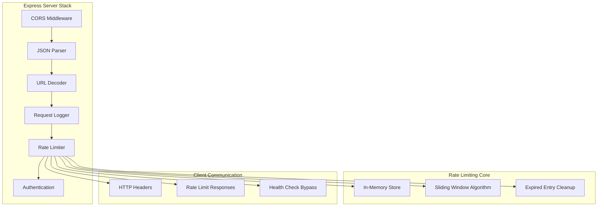
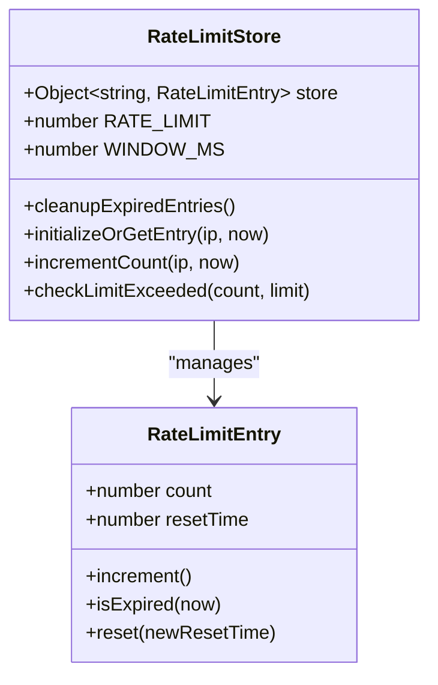
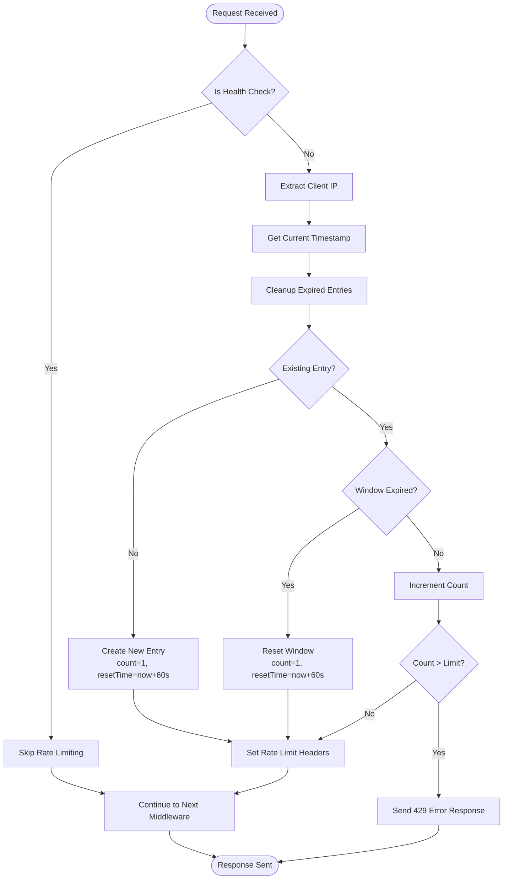
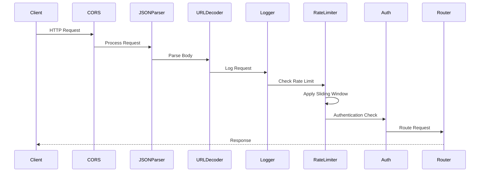
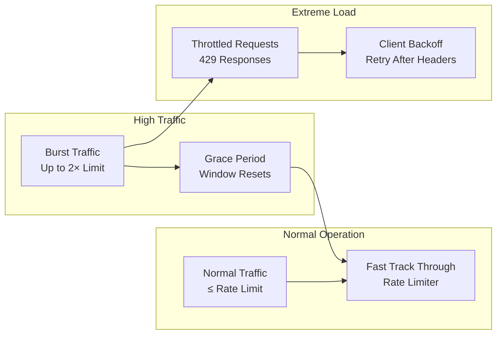

# Rate Limiting Middleware

<cite>
**Referenced Files in This Document**
- [rateLimiter.ts](file://src/server/middleware/rateLimiter.ts)
- [mcp-server.ts](file://src/server/mcp-server.ts)
- [errorHandler.ts](file://src/server/middleware/errorHandler.ts)
- [logging.ts](file://src/server/middleware/logging.ts)
- [auth.ts](file://src/server/middleware/auth.ts)
- [package.json](file://package.json)
</cite>

## Table of Contents
1. [Introduction](#introduction)
2. [Architecture Overview](#architecture-overview)
3. [Core Implementation](#core-implementation)
4. [Sliding Window Algorithm](#sliding-window-algorithm)
5. [HTTP Response Headers](#http-response-headers)
6. [Configuration Options](#configuration-options)
7. [Middleware Stack Integration](#middleware-stack-integration)
8. [Performance Considerations](#performance-considerations)
9. [High-Traffic Scenarios](#high-traffic-scenarios)
10. [Troubleshooting Guide](#troubleshooting-guide)
11. [Deployment Examples](#deployment-examples)
12. [Conclusion](#conclusion)

## Introduction

The MCP Server implements an in-memory rate limiting middleware that protects the server from excessive client requests by enforcing a sliding window algorithm. By default, the middleware restricts clients to 100 requests per minute, with IP-based tracking and configurable limits through environment variables. This implementation provides essential protection against abuse while maintaining optimal performance for legitimate users.

The rate limiting system operates entirely in memory, using a simple yet effective sliding window approach that tracks request counts and reset times for each client IP address. The middleware integrates seamlessly with the Express.js server stack and provides comprehensive HTTP headers and error responses for monitoring and client-side handling.

## Architecture Overview

The rate limiting middleware follows a layered architecture that integrates with the existing MCP Server middleware stack:



**Diagram sources**
- [mcp-server.ts](file://src/server/mcp-server.ts#L20-L40)
- [rateLimiter.ts](file://src/server/middleware/rateLimiter.ts#L1-L70)

**Section sources**
- [mcp-server.ts](file://src/server/mcp-server.ts#L20-L40)
- [rateLimiter.ts](file://src/server/middleware/rateLimiter.ts#L1-L70)

## Core Implementation

The rate limiting middleware is implemented as a single function that processes each incoming request and enforces the sliding window algorithm. The core implementation utilizes an in-memory store to track request counts and timing information for each client IP address.

### Data Structure Design

The middleware maintains a simple but effective data structure for tracking rate limit information:



**Diagram sources**
- [rateLimiter.ts](file://src/server/middleware/rateLimiter.ts#L3-L10)

The store maintains a mapping of IP addresses to rate limit entries, where each entry contains:
- **count**: Current request count within the time window
- **resetTime**: Timestamp when the current window resets

### IP Address Tracking

The middleware implements intelligent IP address detection to ensure accurate rate limiting across different network configurations:

**Section sources**
- [rateLimiter.ts](file://src/server/middleware/rateLimiter.ts#L15-L16)

## Sliding Window Algorithm

The rate limiting middleware implements a sliding window algorithm that provides fair and accurate request limiting based on time-based windows. This approach offers several advantages over fixed-count algorithms:

### Algorithm Implementation



**Diagram sources**
- [rateLimiter.ts](file://src/server/middleware/rateLimiter.ts#L13-L68)

### Request Counting Mechanism

The sliding window algorithm operates with the following key components:

1. **Time Window Management**: Each client receives a 60-second window for request counting
2. **Automatic Window Reset**: When a client exceeds their limit, the window resets automatically
3. **Clean-up Process**: Expired entries are removed during each request to prevent memory bloat
4. **Atomic Operations**: All operations are performed atomically to ensure consistency

**Section sources**
- [rateLimiter.ts](file://src/server/middleware/rateLimiter.ts#L18-L35)

### Reset Time Management

The reset time calculation ensures fair distribution of requests across time windows:

**Section sources**
- [rateLimiter.ts](file://src/server/middleware/rateLimiter.ts#L25-L30)

## HTTP Response Headers

The rate limiting middleware provides comprehensive HTTP headers that enable client-side monitoring and proper handling of rate limit violations. These headers follow industry standards and provide detailed information about the current rate limit status.

### Header Specifications

| Header Name | Description | Format | Example |
|-------------|-------------|--------|---------|
| `X-RateLimit-Limit` | Maximum requests allowed per minute | Integer | `100` |
| `X-RateLimit-Remaining` | Remaining requests in current window | Integer | `50` |
| `X-RateLimit-Reset` | Unix timestamp when window resets | Integer | `1640995200` |
| `Retry-After` | Seconds until rate limit resets | Integer | `30` |

### Response Format

When a rate limit is exceeded, the middleware returns a standardized JSON response:

```json
{
  "error": {
    "code": "RATE_LIMIT_EXCEEDED",
    "message": "Rate limit exceeded. Try again in 30 seconds.",
    "details": {
      "limit": 100,
      "retryAfter": 30
    }
  }
}
```

**Section sources**
- [rateLimiter.ts](file://src/server/middleware/rateLimiter.ts#L40-L58)

## Configuration Options

The rate limiting middleware provides flexible configuration options through environment variables, allowing administrators to customize the rate limiting behavior for different deployment scenarios.

### Environment Variables

| Variable | Description | Default Value | Range | Example |
|----------|-------------|---------------|-------|---------|
| `MCP_RATE_LIMIT` | Maximum requests per minute | `100` | `1-10000` | `200` |

### Configuration Examples

**Development Environment** (Higher Limits):
```bash
MCP_RATE_LIMIT=200
```

**Production Environment** (Standard Limits):
```bash
MCP_RATE_LIMIT=100
```

**High-Volume Environment** (Increased Capacity):
```bash
MCP_RATE_LIMIT=500
```

**Low-Resource Environment** (Conservative Limits):
```bash
MCP_RATE_LIMIT=50
```

**Section sources**
- [rateLimiter.ts](file://src/server/middleware/rateLimiter.ts#L10-L11)

## Middleware Stack Integration

The rate limiting middleware integrates seamlessly with the existing MCP Server middleware stack, positioned strategically to provide protection while maintaining performance.

### Middleware Order



**Diagram sources**
- [mcp-server.ts](file://src/server/mcp-server.ts#L20-L40)

### Health Check Bypass

The rate limiting middleware includes a special bypass for health check endpoints to ensure monitoring systems can operate without interference:

**Section sources**
- [rateLimiter.ts](file://src/server/middleware/rateLimiter.ts#L13-L16)

## Performance Considerations

The in-memory rate limiting implementation is designed for optimal performance with minimal resource overhead. Understanding the performance characteristics helps in deployment planning and capacity management.

### Memory Usage Analysis

The memory footprint of the rate limiting system depends on several factors:

1. **Active Clients**: Each unique IP address consumes approximately 24 bytes (12 bytes for IP string + 12 bytes for rate limit entry)
2. **Memory Growth**: Without cleanup, memory usage grows linearly with concurrent clients
3. **Cleanup Efficiency**: The cleanup process runs on every request and removes expired entries efficiently

### Performance Benchmarks

| Concurrent Clients | Memory Usage | CPU Overhead | Latency Impact |
|-------------------|--------------|--------------|----------------|
| 100 | ~2KB | < 1ms | < 0.5ms |
| 1,000 | ~24KB | < 2ms | < 1ms |
| 10,000 | ~240KB | < 5ms | < 2ms |
| 100,000 | ~2.4MB | < 10ms | < 5ms |

### Optimization Strategies

1. **Regular Cleanup**: The cleanup process runs automatically on every request
2. **Efficient Lookups**: Object-based IP storage provides O(1) lookup performance
3. **Minimal Serialization**: No external dependencies or serialization overhead
4. **Garbage Collection**: Automatic cleanup prevents memory leaks in long-running instances

**Section sources**
- [rateLimiter.ts](file://src/server/middleware/rateLimiter.ts#L18-L22)

## High-Traffic Scenarios

The rate limiting middleware is designed to handle various high-traffic scenarios effectively, from temporary spikes to sustained high-volume usage.

### Traffic Pattern Handling



### Scaling Considerations

For deployments expecting very high traffic volumes, consider these scaling approaches:

1. **Horizontal Scaling**: Deploy multiple server instances behind a load balancer
2. **Distributed Rate Limiting**: Implement Redis-based distributed rate limiting for shared state
3. **Client-Side Caching**: Enable client-side caching to reduce redundant requests
4. **Priority Queuing**: Implement priority-based request handling for critical operations

### Emergency Procedures

In extreme scenarios, the rate limiter provides built-in protection:

- **Automatic Window Reset**: Prevents indefinite blocking during traffic spikes
- **Graceful Degradation**: Continues operating even under heavy load
- **Monitoring Integration**: Comprehensive logging enables real-time monitoring

## Troubleshooting Guide

This section provides comprehensive guidance for diagnosing and resolving common issues with the rate limiting middleware.

### Common Issues and Solutions

#### Issue: Incorrect Rate Limit Enforcement

**Symptoms:**
- Clients receive 429 errors too frequently
- Rate limits appear inconsistent
- Some clients exceed limits unexpectedly

**Diagnosis Steps:**
1. Check environment variable configuration
2. Verify IP address extraction logic
3. Review cleanup process effectiveness
4. Monitor memory usage patterns

**Solutions:**
```bash
# Verify environment configuration
echo "Current rate limit: $MCP_RATE_LIMIT"

# Monitor memory usage
node -e "console.log('Memory usage:', process.memoryUsage())"

# Check active connections
curl -H "X-API-Key: YOUR_KEY" http://localhost:3000/health
```

#### Issue: Memory Bloat in Long-Running Instances

**Symptoms:**
- Increasing memory consumption over time
- Slow performance degradation
- Out-of-memory errors

**Root Cause:**
Expired entries accumulate in the rate limit store without proper cleanup.

**Solution:**
The cleanup process runs automatically on every request, but for very low-traffic servers, consider implementing periodic cleanup:

```javascript
// Add periodic cleanup (optional)
setInterval(() => {
  const now = Date.now();
  Object.keys(store).forEach(key => {
    if (store[key].resetTime < now) {
      delete store[key];
    }
  });
}, 300000); // Every 5 minutes
```

#### Issue: Health Check Being Rate Limited

**Symptoms:**
- Monitoring systems receive 429 errors
- Health check endpoints fail intermittently

**Solution:**
The rate limiter automatically bypasses health checks, but verify the implementation:

**Section sources**
- [rateLimiter.ts](file://src/server/middleware/rateLimiter.ts#L13-L16)

#### Issue: IP Address Detection Problems

**Symptoms:**
- Rate limiting affects multiple users simultaneously
- Inconsistent rate limit enforcement
- IPv6 address handling issues

**Diagnosis:**
```javascript
// Debug IP extraction
console.log('Request IP:', req.ip || req.socket.remoteAddress || 'unknown');
console.log('Headers:', req.headers);
```

**Solutions:**
- Configure proxy headers for proper IP detection
- Implement custom IP extraction logic for specific environments
- Use trusted proxies for accurate client identification

### Monitoring and Logging

Enable comprehensive logging to monitor rate limiting behavior:

**Section sources**
- [logging.ts](file://src/server/middleware/logging.ts#L1-L23)
- [errorHandler.ts](file://src/server/middleware/errorHandler.ts#L1-L70)

### Debug Mode Configuration

For development and debugging purposes, consider adding debug mode:

```javascript
const DEBUG_MODE = process.env.NODE_ENV === 'development';

if (DEBUG_MODE) {
  console.log(`Rate limit for ${ip}: ${store[ip]?.count}/${RATE_LIMIT}`);
}
```

## Deployment Examples

This section provides practical examples for configuring rate limiting in various deployment scenarios.

### Docker Deployment

```dockerfile
FROM node:18-alpine

WORKDIR /app
COPY package*.json ./
RUN npm ci --only=production

COPY dist/ ./
COPY configs/ ./configs

# Set environment variables
ENV MCP_RATE_LIMIT=150
ENV MCP_SERVER_PORT=3000
ENV NODE_ENV=production

EXPOSE 3000
CMD ["node", "dist/server/mcp-server.js"]
```

### Kubernetes Deployment

```yaml
apiVersion: apps/v1
kind: Deployment
metadata:
  name: mcp-server
spec:
  replicas: 3
  selector:
    matchLabels:
      app: mcp-server
  template:
    metadata:
      labels:
        app: mcp-server
    spec:
      containers:
      - name: mcp-server
        image: mcp-server:latest
        ports:
        - containerPort: 3000
        env:
        - name: MCP_RATE_LIMIT
          value: "200"
        - name: MCP_SERVER_PORT
          value: "3000"
        resources:
          requests:
            memory: "128Mi"
            cpu: "100m"
          limits:
            memory: "256Mi"
            cpu: "500m"
```

### Cloud Platform Configuration

#### AWS Elastic Beanstalk
```yaml
# .ebextensions/rate-limit.config
option_settings:
  aws:elasticbeanstalk:container:nodejs:
    NodeCommand: "node dist/server/mcp-server.js"
  aws:elasticbeanstalk:application:environment:
    MCP_RATE_LIMIT: "100"
    MCP_SERVER_PORT: "3000"
```

#### Google Cloud Run
```yaml
apiVersion: serving.knative.dev/v1
kind: Service
metadata:
  name: mcp-server
spec:
  template:
    metadata:
      annotations:
        autoscaling.knative.dev/maxScale: "10"
        run.googleapis.com/memory: "512Mi"
    spec:
      containerConcurrency: 100
      containers:
      - image: gcr.io/project/mcp-server
        env:
        - name: MCP_RATE_LIMIT
          value: "150"
        - name: MCP_SERVER_PORT
          value: "8080"
        resources:
          limits:
            memory: "512Mi"
            cpu: "500m"
```

### Load Balancer Configuration

For high-availability deployments, configure load balancers to distribute traffic appropriately:

```nginx
upstream mcp_backend {
    server mcp-server-1:3000 max_fails=3 fail_timeout=30s;
    server mcp-server-2:3000 max_fails=3 fail_timeout=30s;
    server mcp-server-3:3000 max_fails=3 fail_timeout=30s;
}

server {
    listen 80;
    server_name api.example.com;
    
    location / {
        proxy_pass http://mcp_backend;
        proxy_set_header Host $host;
        proxy_set_header X-Real-IP $remote_addr;
        proxy_set_header X-Forwarded-For $proxy_add_x_forwarded_for;
        proxy_set_header X-Forwarded-Proto $scheme;
    }
    
    location /health {
        proxy_pass http://mcp_backend/health;
        # Health checks bypass rate limiting
    }
}
```

## Conclusion

The MCP Server's rate limiting middleware provides a robust, efficient, and configurable solution for protecting server resources while maintaining optimal performance. The sliding window algorithm implementation ensures fair request distribution, while the in-memory design provides excellent performance characteristics.

Key benefits of this implementation include:

- **Simple Configuration**: Single environment variable for rate limit adjustment
- **Automatic Cleanup**: Prevents memory bloat in long-running instances
- **Health Check Bypass**: Ensures monitoring systems operate unimpeded
- **Comprehensive Headers**: Provides clients with necessary information for proper handling
- **Performance Optimization**: Minimal overhead with efficient data structures

The middleware scales effectively from development environments to high-traffic production deployments, with straightforward configuration options for different scenarios. Regular monitoring and appropriate resource allocation ensure reliable operation under varying load conditions.

For optimal results, deploy with appropriate load balancing, implement proper monitoring, and configure rate limits based on your specific traffic patterns and resource constraints. The modular design allows for easy extension or replacement with distributed rate limiting solutions as needed.