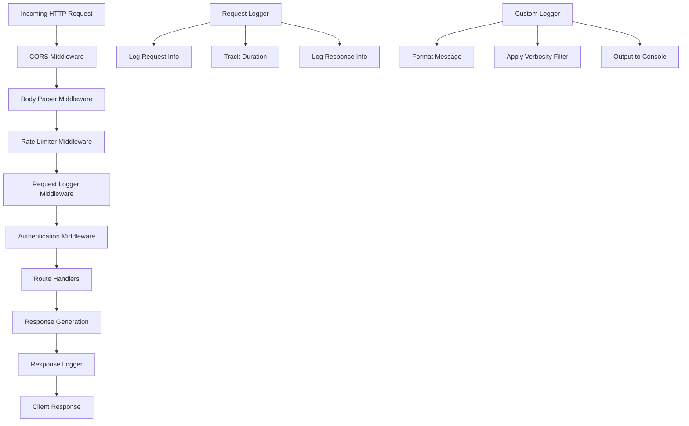
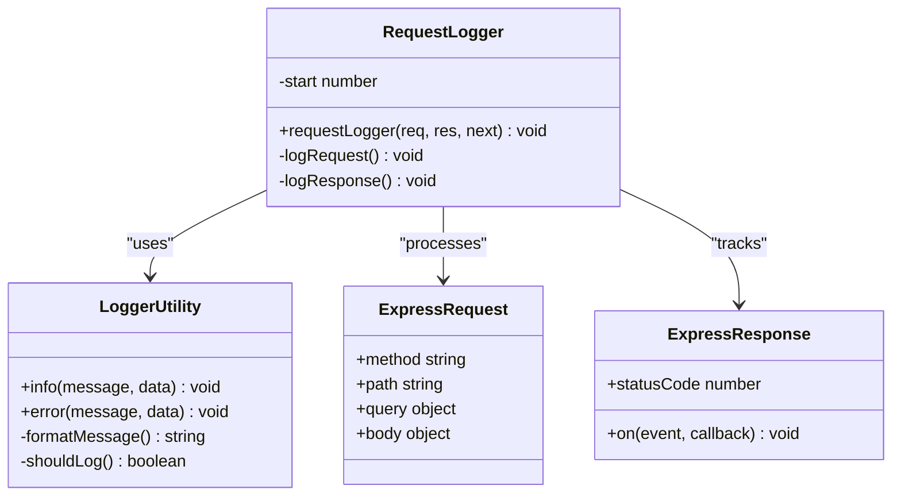
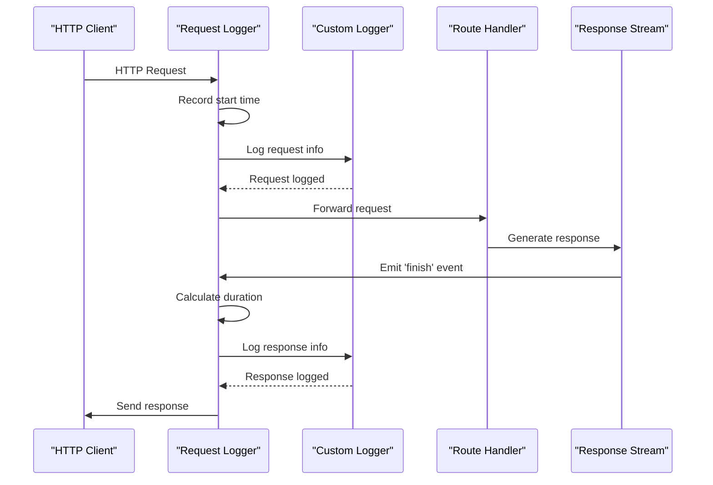
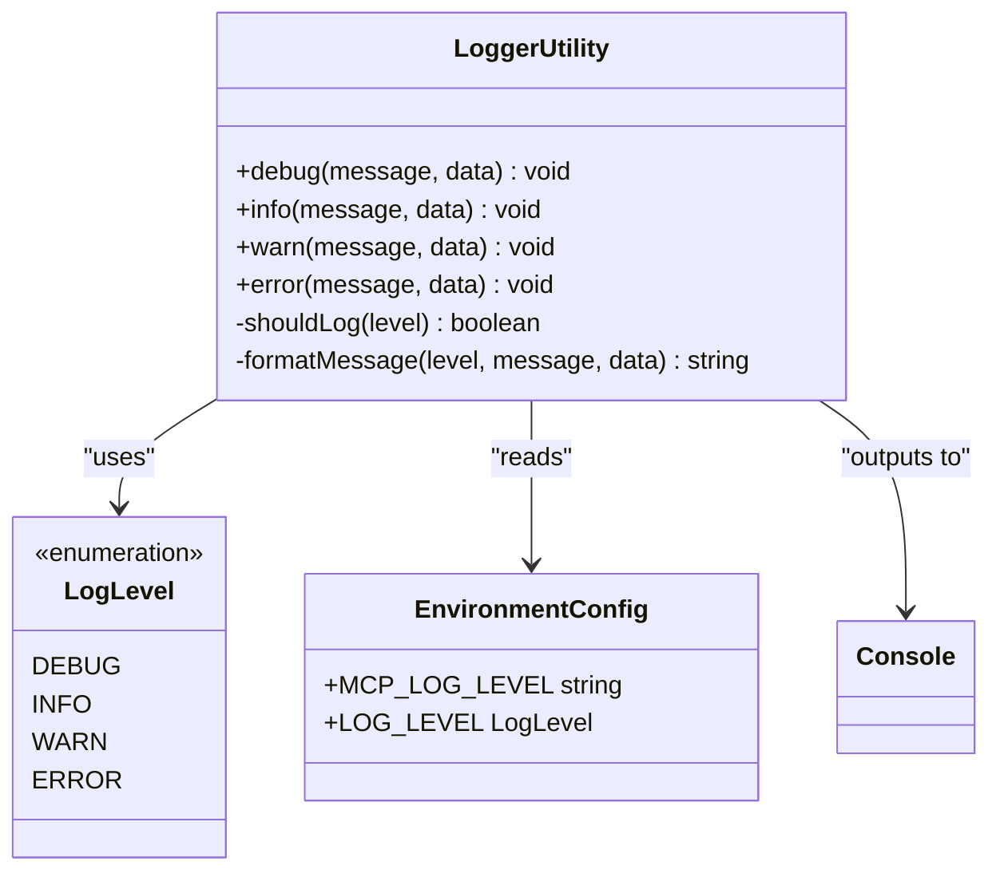

# Request Logging Middleware

<cite>
**Referenced Files in This Document**
- [logging.ts](file://src/server/middleware/logging.ts)
- [logger.ts](file://src/server/utils/logger.ts)
- [mcp-server.ts](file://src/server/mcp-server.ts)
- [tasks.ts](file://src/server/routes/tasks.ts)
- [tasksController.ts](file://src/server/controllers/tasksController.ts)
- [README.md](file://src/server/README.md)
</cite>

## Table of Contents
1. [Introduction](#introduction)
2. [Architecture Overview](#architecture-overview)
3. [Core Implementation](#core-implementation)
4. [Logging Mechanism](#logging-mechanism)
5. [Integration with Logger Utility](#integration-with-logger-utility)
6. [Environment Configuration](#environment-configuration)
7. [Log Output Examples](#log-output-examples)
8. [Performance Considerations](#performance-considerations)
9. [Monitoring and Debugging](#monitoring-and-debugging)
10. [Security Auditing](#security-auditing)
11. [Troubleshooting Guide](#troubleshooting-guide)
12. [Best Practices](#best-practices)

## Introduction

The MCP Server's request logging middleware provides comprehensive HTTP request and response tracking capabilities, capturing essential information about API interactions for monitoring, debugging, and security auditing purposes. This middleware automatically logs incoming requests with method, path, query parameters, and request bodies (for non-GET requests), while recording outgoing responses with status codes, durations, and appropriate log levels based on response codes.

The logging system is built on a custom logger utility that supports configurable verbosity levels and structured logging with timestamps and contextual metadata. The middleware integrates seamlessly with the Express.js application stack, providing transparent request tracking without impacting application performance significantly.

## Architecture Overview

The request logging middleware follows a middleware pattern within the Express.js framework, positioned early in the middleware chain to capture all incoming requests before they reach route handlers.



**Diagram sources**
- [mcp-server.ts](file://src/server/mcp-server.ts#L25-L35)
- [logging.ts](file://src/server/middleware/logging.ts#L4-L22)

**Section sources**
- [mcp-server.ts](file://src/server/mcp-server.ts#L25-L35)
- [logging.ts](file://src/server/middleware/logging.ts#L1-L23)

## Core Implementation

The request logging middleware is implemented as a pure Express.js middleware function that captures timing information and logs both request and response details. The implementation utilizes the `res.on('finish')` event to ensure logging occurs after the response has been sent to the client.

### Middleware Function Structure

The middleware function accepts three standard Express.js parameters and maintains request timing information:



**Diagram sources**
- [logging.ts](file://src/server/middleware/logging.ts#L4-L22)
- [logger.ts](file://src/server/utils/logger.ts#L25-L47)

### Request Capture Mechanism

The middleware captures incoming requests by extracting essential information including HTTP method, path, query parameters, and request body (for non-GET requests). The request logging occurs immediately upon middleware execution, providing visibility into all incoming API interactions.

**Section sources**
- [logging.ts](file://src/server/middleware/logging.ts#L4-L12)

## Logging Mechanism

The logging mechanism operates in two distinct phases: request logging and response logging. Each phase captures different aspects of the HTTP transaction and applies appropriate log levels based on the nature of the interaction.

### Request Logging Phase

During the request logging phase, the middleware captures:
- HTTP method (GET, POST, PUT, DELETE, etc.)
- Request path with URL segments
- Query parameters as key-value pairs
- Request body (excluding GET requests to avoid excessive logging)

The request log format follows a standardized convention that includes directional indicators (`→` for requests, `←` for responses) to distinguish between incoming and outgoing messages.

### Response Logging Phase

The response logging phase executes when the response stream completes, capturing:
- HTTP status code (200, 404, 500, etc.)
- Request duration in milliseconds
- Automatic log level adjustment based on status code



**Diagram sources**
- [logging.ts](file://src/server/middleware/logging.ts#L13-L21)

### Automatic Log Level Adjustment

The middleware implements intelligent log level selection based on HTTP status codes:
- **Success responses (2xx)**: Logged at INFO level
- **Client errors (4xx)**: Promoted to ERROR level for visibility
- **Server errors (5xx)**: Automatically logged at ERROR level

This automatic promotion ensures that problematic responses receive appropriate attention in log analysis and monitoring systems.

**Section sources**
- [logging.ts](file://src/server/middleware/logging.ts#L13-L21)

## Integration with Logger Utility

The request logging middleware leverages a custom logger utility that provides structured logging capabilities with configurable verbosity levels. The logger utility supports multiple log levels and applies filtering based on environment settings.

### Logger Utility Architecture

The logger utility implements a flexible logging system with the following characteristics:



**Diagram sources**
- [logger.ts](file://src/server/utils/logger.ts#L25-L47)

### Structured Logging Format

The logger utility produces structured log entries with the following format:
- Timestamp in ISO 8601 format
- Log level indicator (DEBUG, INFO, WARN, ERROR)
- Message content
- Optional JSON-formatted data payload

The format ensures consistent log parsing and enables efficient log aggregation and analysis across distributed systems.

### Verbosity Control

The logger utility supports configurable verbosity through the `MCP_LOG_LEVEL` environment variable, allowing administrators to adjust logging intensity based on operational requirements:

| Log Level | Numeric Value | Description |
|-----------|---------------|-------------|
| debug | 0 | Detailed diagnostic information |
| info | 1 | General informational messages |
| warn | 2 | Warning conditions |
| error | 3 | Error conditions |

**Section sources**
- [logger.ts](file://src/server/utils/logger.ts#L1-L47)

## Environment Configuration

The request logging middleware supports environment-based configuration for controlling logging behavior and verbosity levels. The primary configuration parameter is `MCP_LOG_LEVEL`, which determines the minimum log level threshold.

### Configuration Parameters

| Parameter | Default Value | Description |
|-----------|---------------|-------------|
| MCP_LOG_LEVEL | info | Minimum log level for output |
| MCP_SERVER_PORT | 3000 | Server listening port |
| MCP_SERVER_HOST | localhost | Server binding address |

### Environment Variable Impact

The `MCP_LOG_LEVEL` environment variable affects both the custom logger utility and the request logging middleware behavior:

- **debug**: Enables all log levels, including detailed debugging information
- **info**: Shows general request/response information (default)
- **warn**: Filters out info-level logs, showing warnings and errors only
- **error**: Shows only error-level logs, minimizing output volume

**Section sources**
- [logger.ts](file://src/server/utils/logger.ts#L2-L3)
- [mcp-server.ts](file://src/server/mcp-server.ts#L15-L16)

## Log Output Examples

Understanding the format and content of log entries helps administrators interpret system behavior and troubleshoot issues effectively. The following examples demonstrate typical log patterns for various scenarios.

### Successful Request Logs

Successful requests generate INFO-level logs with request details and response information:

```
[2024-10-27T14:30:22.123Z] INFO  → POST /api/tasks/create {"projectId":1,"title":"Test Task"}
[2024-10-27T14:30:22.456Z] INFO  ← POST /api/tasks/create 201 (333ms)
```

### Failed Request Logs

Failed requests, particularly client errors (4xx), generate ERROR-level logs for increased visibility:

```
[2024-10-27T14:30:25.789Z] INFO  → GET /api/tasks/999
[2024-10-27T14:30:25.901Z] ERROR ← GET /api/tasks/999 404 (112ms)
```

### Request with Query Parameters

Requests with query parameters include the parameters in the log entry:

```
[2024-10-27T14:30:30.123Z] INFO  → GET /api/tasks/project/1?page=1&limit=10
[2024-10-27T14:30:30.234Z] INFO  ← GET /api/tasks/project/1 200 (111ms)
```

### Request with Body Data

POST and PUT requests include the request body in the log (excluding GET requests):

```
[2024-10-27T14:30:35.456Z] INFO  → POST /api/tasks/create {"title":"New Task","description":"Task description","status":"To-Do"}
[2024-10-27T14:30:35.678Z] INFO  ← POST /api/tasks/create 201 (222ms)
```

### Server Error Logs

Server-side errors generate ERROR-level logs with detailed information:

```
[2024-10-27T14:30:40.901Z] INFO  → GET /api/tasks/1
[2024-10-27T14:30:41.012Z] ERROR ← GET /api/tasks/1 500 (111ms)
```

**Section sources**
- [logging.ts](file://src/server/middleware/logging.ts#L6-L21)

## Performance Considerations

The request logging middleware is designed with minimal performance impact in mind, utilizing efficient timing mechanisms and selective logging strategies to maintain optimal server performance.

### Timing Mechanism Efficiency

The middleware uses `Date.now()` for timing measurements, which provides millisecond precision with minimal computational overhead. The timing calculation occurs only once per request-response cycle, avoiding repeated expensive operations.

### Memory Usage Optimization

Request logging minimizes memory allocation by:
- Creating log objects only when logging is enabled
- Using string concatenation for log messages rather than template literals
- Avoiding deep cloning of request objects
- Filtering out request bodies for GET requests to reduce memory footprint

### Conditional Logging

The middleware implements conditional logging based on request method, ensuring that potentially large request bodies (for POST/PUT requests) are only logged when necessary. This approach reduces memory usage and improves performance for high-volume APIs.

### Event Listener Management

The middleware registers a single `finish` event listener on the response object, which is automatically cleaned up when the response completes. This prevents memory leaks and ensures efficient resource utilization.

**Section sources**
- [logging.ts](file://src/server/middleware/logging.ts#L5-L21)

## Monitoring and Debugging

The request logging middleware provides comprehensive visibility into API operations, enabling effective monitoring and debugging of application behavior across development, staging, and production environments.

### Request Tracing

The logging system enables end-to-end request tracing by:
- Capturing request identifiers through URL paths and query parameters
- Recording request duration for performance analysis
- Tracking HTTP status codes for success/failure identification
- Including contextual data for correlation with business logic

### Performance Analysis

Request duration logging facilitates performance monitoring and optimization:
- Identifying slow-performing endpoints
- Detecting performance regressions
- Analyzing request patterns and load distribution
- Supporting capacity planning and scaling decisions

### Error Pattern Recognition

The automatic log level promotion for error responses enables:
- Early detection of client-side issues
- Identification of recurring error patterns
- Correlation between request failures and system health
- Enhanced debugging capabilities through detailed error logging

### Debug Information Collection

The middleware collects valuable debugging information including:
- Complete request URLs with query parameters
- Request body content for state-changing operations
- Response status codes and timing information
- Request routing information for endpoint analysis

**Section sources**
- [logging.ts](file://src/server/middleware/logging.ts#L13-L21)

## Security Auditing

The request logging middleware supports security auditing requirements by capturing comprehensive information about API interactions, enabling investigation of suspicious activities and compliance with security standards.

### Access Pattern Analysis

The logging system captures sufficient information for security analysts to:
- Identify unusual access patterns and volumes
- Detect potential abuse or scanning activities
- Track user behavior and API consumption
- Monitor unauthorized access attempts

### Request Content Logging

For security-sensitive operations, the middleware logs:
- Full request URLs with sensitive parameters
- Request body content for state-changing operations
- HTTP headers that may contain authentication tokens
- Response status codes indicating successful or failed operations

### Compliance Support

The structured logging format supports compliance requirements by:
- Providing audit trails with timestamps
- Maintaining request-response correlation
- Enabling forensic analysis of security incidents
- Supporting regulatory reporting requirements

### Security Incident Investigation

The logging system aids in security incident investigation by:
- Capturing the complete request lifecycle
- Recording timing information for attack pattern analysis
- Preserving request context for forensic examination
- Supporting correlation with other security systems

**Section sources**
- [logging.ts](file://src/server/middleware/logging.ts#L6-L12)

## Troubleshooting Guide

Common issues with the request logging middleware and their resolution strategies help administrators maintain optimal system operation and quickly address logging-related problems.

### No Log Output Issues

**Symptoms**: No request logs appear in the console despite active API usage

**Possible Causes**:
- Incorrect `MCP_LOG_LEVEL` environment variable setting
- Middleware not properly registered in Express application
- Console output redirection or filtering

**Resolution Steps**:
1. Verify `MCP_LOG_LEVEL` environment variable is set correctly
2. Check middleware registration order in `mcp-server.ts`
3. Ensure console output is not being redirected or filtered
4. Test with `MCP_LOG_LEVEL=debug` for maximum verbosity

### Excessive Log Volume

**Symptoms**: Log files grow rapidly, consuming disk space

**Possible Causes**:
- Low log level threshold (debug or info)
- High-traffic endpoints with frequent requests
- Large request bodies being logged

**Resolution Strategies**:
1. Increase log level to `warn` or `error`
2. Implement request filtering for specific endpoints
3. Reduce request body logging for bulk operations
4. Implement log rotation policies

### Performance Impact

**Symptoms**: Application performance degradation with logging enabled

**Possible Causes**:
- High-frequency logging of rapid requests
- Synchronous logging operations
- Large request body serialization

**Optimization Approaches**:
1. Implement asynchronous logging where possible
2. Reduce logging frequency for high-volume endpoints
3. Optimize request body filtering logic
4. Consider sampling strategies for high-traffic scenarios

### Log Format Issues

**Symptoms**: Malformed or incomplete log entries

**Troubleshooting Steps**:
1. Verify JSON serialization of request/response data
2. Check for circular references in request objects
3. Ensure proper encoding of special characters
4. Validate timestamp formatting across different environments

**Section sources**
- [logger.ts](file://src/server/utils/logger.ts#L15-L22)
- [logging.ts](file://src/server/middleware/logging.ts#L6-L12)

## Best Practices

Effective implementation and maintenance of the request logging middleware require adherence to established best practices that balance observability needs with performance and security considerations.

### Logging Verbosity Management

Configure logging verbosity based on operational requirements:
- **Development**: Use `debug` level for comprehensive troubleshooting
- **Staging**: Use `info` level for production-like testing
- **Production**: Use `warn` or `error` level for minimal overhead
- **Security-critical**: Enable detailed logging with appropriate retention policies

### Request Body Filtering

Implement intelligent request body filtering to optimize performance:
- Exclude request bodies for GET requests
- Filter sensitive data (passwords, tokens) from logs
- Limit request body size for logging
- Consider sampling strategies for high-volume endpoints

### Log Retention and Rotation

Establish appropriate log management policies:
- Implement automated log rotation
- Set reasonable retention periods based on compliance requirements
- Archive historical logs for long-term analysis
- Monitor log storage usage and implement cleanup procedures

### Security Considerations

Maintain security best practices in logging:
- Sanitize sensitive data from log entries
- Implement proper access controls for log files
- Consider log encryption for sensitive environments
- Audit log access and modifications

### Monitoring Integration

Integrate logging with monitoring systems:
- Export logs to centralized logging platforms
- Implement alerting for error-level logs
- Create dashboards for request patterns and performance metrics
- Establish SLA monitoring based on log analysis

### Performance Optimization

Optimize logging performance impact:
- Use efficient timing mechanisms (Date.now())
- Implement conditional logging based on request characteristics
- Consider asynchronous logging for high-throughput applications
- Monitor logging overhead and adjust strategies accordingly

**Section sources**
- [logger.ts](file://src/server/utils/logger.ts#L15-L22)
- [logging.ts](file://src/server/middleware/logging.ts#L13-L21)