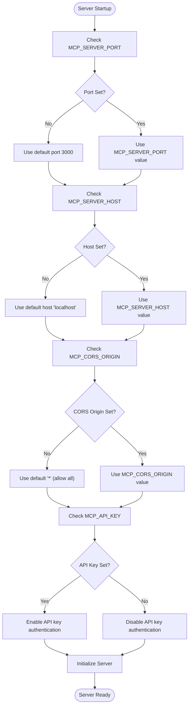
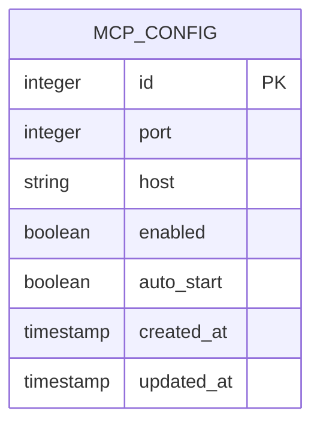
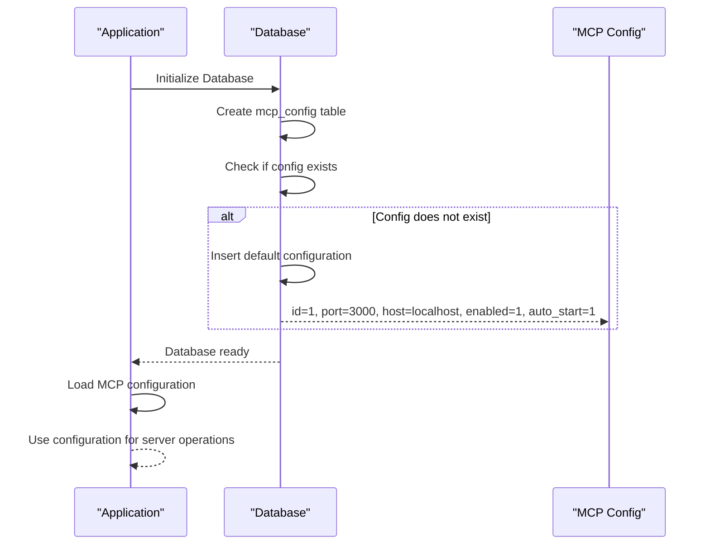
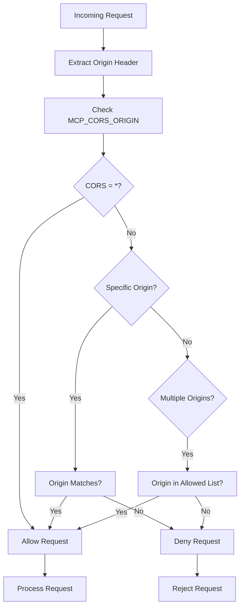
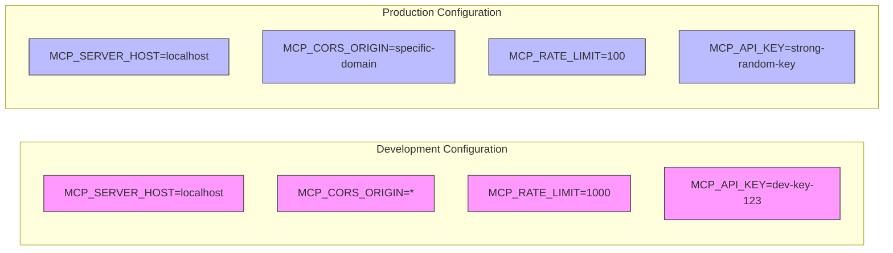
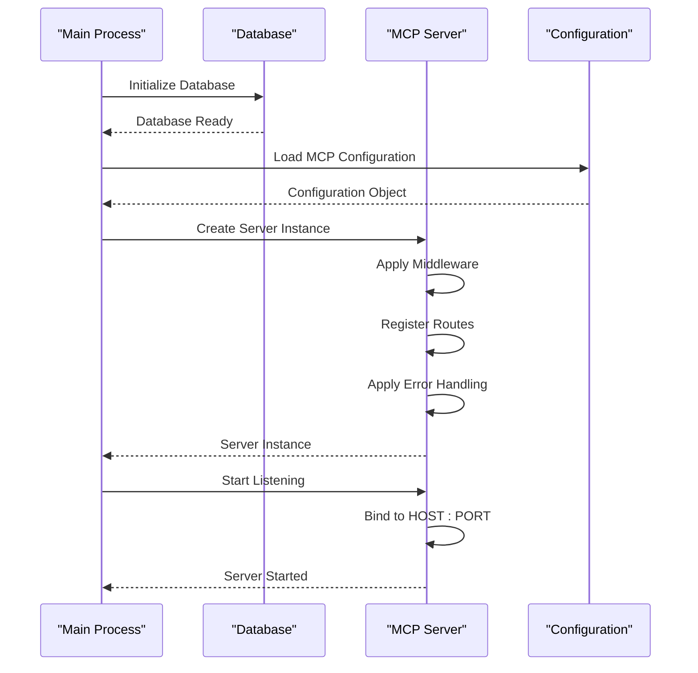
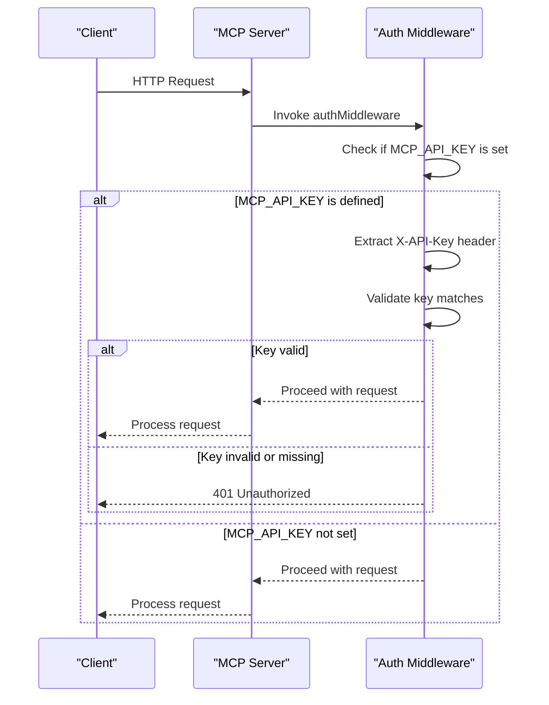
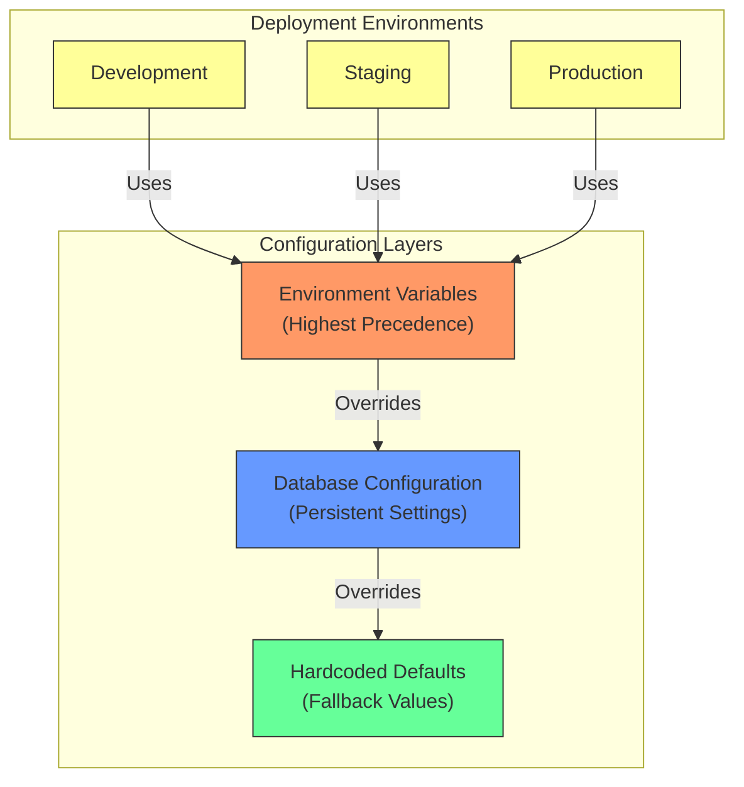

# Server Configuration and Environment

<cite>
**Referenced Files in This Document**   
- [mcp-server.ts](file://src/server/mcp-server.ts)
- [mcpRepo.ts](file://src/database/mcpRepo.ts)
- [init.ts](file://src/database/init.ts)
- [auth.ts](file://src/server/middleware/auth.ts)
- [settings.ts](file://src/services/settings.ts)
- [mcp.ts](file://src/main/ipc/mcp.ts)
- [types.ts](file://src/common/types.ts)
- [README.md](file://src/server/README.md)
</cite>

## Table of Contents
1. [Introduction](#introduction)
2. [Configuration Parameters](#configuration-parameters)
3. [Environment Variables](#environment-variables)
4. [Database Configuration](#database-configuration)
5. [Security Implications](#security-implications)
6. [Production vs Development Configuration](#production-vs-development-configuration)
7. [Server Startup Process](#server-startup-process)
8. [API Key Management](#api-key-management)
9. [Configuration Across Environments](#configuration-across-environments)
10. [Common Configuration Issues](#common-configuration-issues)
11. [Debugging Connectivity Problems](#debugging-connectivity-problems)

## Introduction
The MCP Server in LifeOS provides a comprehensive HTTP API for interacting with application data and functionality. This documentation details the configuration system, covering environment variables, code-level settings, security considerations, and operational best practices. The server configuration is managed through a combination of environment variables and persistent database storage, allowing for flexible deployment across different environments.

**Section sources**
- [mcp-server.ts](file://src/server/mcp-server.ts#L1-L89)
- [README.md](file://src/server/README.md#L1-L291)

## Configuration Parameters
The MCP Server exposes several configurable parameters that control its behavior, accessibility, and security posture. These parameters are accessible both through environment variables and persistent storage in the application database.

### Core Configuration Parameters
The following table outlines the primary configuration parameters available for the MCP Server:

| Parameter | Type | Default Value | Description |
|---------|------|---------------|-------------|
| MCP_SERVER_PORT | number | 3000 | Port number on which the server listens for incoming connections |
| MCP_SERVER_HOST | string | localhost | Host interface to bind the server to; controls network accessibility |
| MCP_CORS_ORIGIN | string | * | Origin(s) permitted for cross-origin resource sharing |
| MCP_API_KEY | string | undefined | Secret key required for API authentication when enabled |
| MCP_RATE_LIMIT | number | 100 | Maximum number of requests allowed per minute per IP address |

**Section sources**
- [mcp-server.ts](file://src/server/mcp-server.ts#L6-L7)
- [auth.ts](file://src/server/middleware/auth.ts#L7-L25)
- [README.md](file://src/server/README.md#L45-L58)

## Environment Variables
The MCP Server utilizes environment variables as the primary mechanism for runtime configuration. These variables are evaluated at server startup and take precedence over any stored configuration values.

### Environment Variable Processing
The server processes environment variables in the following manner:



**Diagram sources**
- [mcp-server.ts](file://src/server/mcp-server.ts#L6-L7)
- [auth.ts](file://src/server/middleware/auth.ts#L7-L25)

**Section sources**
- [mcp-server.ts](file://src/server/mcp-server.ts#L6-L89)
- [auth.ts](file://src/server/middleware/auth.ts#L7-L25)

## Database Configuration
In addition to environment variables, the MCP Server configuration is persisted in the application database, allowing for dynamic configuration changes through the user interface.

### MCP Configuration Schema
The database schema for MCP configuration includes the following fields:



**Diagram sources**
- [init.ts](file://src/database/init.ts#L109-L148)
- [mcpRepo.ts](file://src/database/mcpRepo.ts#L1-L57)

### Configuration Initialization
The MCP configuration table is created and initialized during database setup with the following default values:

- **port**: 3000
- **host**: localhost
- **enabled**: true
- **auto_start**: true

The configuration is stored in a singleton pattern with a primary key constraint of `id = 1`, ensuring only one configuration record exists.



**Diagram sources**
- [init.ts](file://src/database/init.ts#L109-L148)
- [mcpRepo.ts](file://src/database/mcpRepo.ts#L1-L57)

**Section sources**
- [init.ts](file://src/database/init.ts#L109-L148)
- [mcpRepo.ts](file://src/database/mcpRepo.ts#L1-L57)
- [types.ts](file://src/common/types.ts#L84-L100)

## Security Implications
The configuration of the MCP Server has significant security implications that must be carefully considered based on the deployment environment and intended use case.

### Host Binding Security
The `MCP_SERVER_HOST` parameter controls which network interfaces the server binds to, with important security consequences:

- **localhost (127.0.0.1)**: Only accessible from the local machine, providing maximum security
- **0.0.0.0**: Accessible from any network interface, exposing the server to external networks
- **Specific IP**: Binds to a specific network interface, allowing controlled external access

Binding to `0.0.0.0` should only be done when external access is required and appropriate security measures (firewall, API keys, etc.) are in place.

### CORS Configuration Security
The `MCP_CORS_ORIGIN` setting controls which domains can make cross-origin requests to the MCP Server:

- **Wildcard (*)**: Allows requests from any origin (least secure)
- **Specific origin**: Restricts requests to a specific domain
- **Multiple origins**: Allows requests from a defined list of domains

Using a wildcard origin should be avoided in production environments to prevent potential cross-site request forgery (CSRF) attacks.



**Diagram sources**
- [mcp-server.ts](file://src/server/mcp-server.ts#L14-L18)
- [README.md](file://src/server/README.md#L55-L58)

**Section sources**
- [mcp-server.ts](file://src/server/mcp-server.ts#L14-L18)
- [README.md](file://src/server/README.md#L55-L58)

## Production vs Development Configuration
The MCP Server supports different configuration profiles for development and production environments, balancing convenience with security.

### Development Configuration
For development environments, the following configuration is recommended:

```env
MCP_SERVER_PORT=3000
MCP_SERVER_HOST=localhost
MCP_CORS_ORIGIN=*
MCP_API_KEY=dev-key-123
MCP_RATE_LIMIT=1000
```

This configuration prioritizes developer convenience with:
- Localhost binding for security
- Permissive CORS for frontend development
- Rate limit relaxed for testing
- API key present but not highly secure

### Production Configuration
For production environments, a more restrictive configuration is required:

```env
MCP_SERVER_PORT=3000
MCP_SERVER_HOST=localhost
MCP_CORS_ORIGIN=https://yourdomain.com
MCP_API_KEY=strong-random-generated-key
MCP_RATE_LIMIT=100
```

Production configuration emphasizes security with:
- Strong, randomly generated API key
- Restricted CORS to specific domain
- Standard rate limiting to prevent abuse
- Localhost binding to prevent external access



**Diagram sources**
- [README.md](file://src/server/README.md#L45-L58)
- [mcp-server.ts](file://src/server/mcp-server.ts#L6-L7)

**Section sources**
- [README.md](file://src/server/README.md#L45-L58)
- [mcp-server.ts](file://src/server/mcp-server.ts#L6-L7)

## Server Startup Process
The MCP Server follows a defined startup sequence that integrates configuration from multiple sources.

### Startup Sequence
The server startup process involves the following steps:



**Diagram sources**
- [mcp-server.ts](file://src/server/mcp-server.ts#L45-L89)
- [init.ts](file://src/database/init.ts#L20-L40)

### Configuration Precedence
During startup, configuration values are resolved with the following precedence:

1. Environment variables (highest precedence)
2. Database configuration
3. Hardcoded defaults (lowest precedence)

This hierarchy allows environment-specific overrides while maintaining persistent configuration settings.

**Section sources**
- [mcp-server.ts](file://src/server/mcp-server.ts#L6-L89)
- [init.ts](file://src/database/init.ts#L20-L40)

## API Key Management
API key authentication provides an additional security layer for protecting the MCP Server endpoints.

### Authentication Flow
The API key authentication process follows this sequence:



**Diagram sources**
- [auth.ts](file://src/server/middleware/auth.ts#L7-L25)
- [mcp-server.ts](file://src/server/mcp-server.ts#L19-L22)

### Key Security Best Practices
When implementing API key authentication, follow these security best practices:

- Generate keys using cryptographically secure random generators
- Store keys in environment variables, not in code
- Rotate keys periodically
- Use different keys for different environments
- Monitor for unauthorized access attempts

**Section sources**
- [auth.ts](file://src/server/middleware/auth.ts#L7-L25)
- [README.md](file://src/server/README.md#L230-L240)

## Configuration Across Environments
Managing MCP Server configuration across different deployment environments requires a systematic approach.

### Configuration Strategy
The application employs a multi-layered configuration strategy:



**Diagram sources**
- [mcp-server.ts](file://src/server/mcp-server.ts#L6-L7)
- [mcpRepo.ts](file://src/database/mcpRepo.ts#L1-L57)

### Environment-Specific Configuration
For each environment, use the following configuration approach:

- **Development**: Environment variables in `.env` file with permissive settings
- **Staging**: Environment variables with production-like security settings
- **Production**: Environment variables managed by deployment platform with strict security

The database configuration provides a consistent baseline across environments, while environment variables allow for deployment-specific overrides.

**Section sources**
- [mcp-server.ts](file://src/server/mcp-server.ts#L6-L89)
- [mcpRepo.ts](file://src/database/mcpRepo.ts#L1-L57)
- [README.md](file://src/server/README.md#L45-L58)

## Common Configuration Issues
Several common issues can arise when configuring the MCP Server, typically related to port conflicts, network binding, or security settings.

### Port Conflicts
When the configured port is already in use:

- **Symptom**: Server fails to start with "EADDRINUSE" error
- **Solution**: Change MCP_SERVER_PORT to an available port
- **Prevention**: Use port scanning tools to identify available ports

### Network Binding Issues
When the server is not accessible from expected locations:

- **Symptom**: Connection refused or timeout errors
- **Solution**: Verify MCP_SERVER_HOST setting matches network requirements
- **Prevention**: Test connectivity with tools like curl or telnet

### CORS Errors
When frontend applications cannot access the API:

- **Symptom**: Browser console shows CORS errors
- **Solution**: Configure MCP_CORS_ORIGIN to include frontend origin
- **Prevention**: Set appropriate CORS policy during development

### Authentication Failures
When API requests are rejected due to authentication:

- **Symptom**: 401 Unauthorized responses
- **Solution**: Verify X-API-Key header matches MCP_API_KEY value
- **Prevention**: Implement proper key management and rotation

**Section sources**
- [README.md](file://src/server/README.md#L260-L291)
- [mcp-server.ts](file://src/server/mcp-server.ts#L6-L89)

## Debugging Connectivity Problems
Effective debugging of MCP Server connectivity issues requires a systematic approach.

### Diagnostic Flowchart
The following flowchart guides the troubleshooting process:

```mermaid
flowchart TD
Start["Connectivity Issue Reported"] --> CheckServer["Is Server Running?"]
CheckServer --> |No| StartServer["Start MCP Server"]
StartServer --> VerifyStart["Server Started Successfully?"]
VerifyStart --> |No| CheckPort["Check Port Availability"]
CheckPort --> ResolvePort["Change MCP_SERVER_PORT if needed"]
ResolvePort --> StartServer
VerifyStart --> |Yes| TestLocal["Test Local Connectivity"]
CheckServer --> |Yes| TestLocal
TestLocal --> CanConnect{"Can connect to localhost:port?"}
CanConnect --> |No| CheckFirewall["Check Firewall Settings"]
CheckFirewall --> AdjustFirewall["Allow port in firewall"]
AdjustFirewall --> TestLocal
CanConnect --> |Yes| CheckHost["Check MCP_SERVER_HOST Setting"]
CheckHost --> HostLocal{"Host = localhost?"}
HostLocal --> |Yes| ExternalAccess["External access not expected"]
HostLocal --> |No| TestExternal["Test External Connectivity"]
TestExternal --> ExternalConnect{"Can external clients connect?"}
ExternalConnect --> |No| CheckNetwork["Check Network Configuration"]
CheckNetwork --> VerifyHost["Verify host binding and routing"]
VerifyHost --> TestExternal
ExternalConnect --> |Yes| CheckCORS["Check CORS Configuration"]
CheckCORS --> CORSWorking{"CORS working correctly?"]
CORSWorking --> |No| UpdateCORS["Update MCP_CORS_ORIGIN"]
UpdateCORS --> TestExternal
CORSWorking --> |Yes| CheckAuth["Check Authentication"]
CheckAuth --> AuthWorking{"Authentication working?"]
AuthWorking --> |No| VerifyKey["Verify API key configuration"]
VerifyKey --> CheckAuth
AuthWorking --> |Yes| IssueResolved["Connectivity Issue Resolved"]
```

**Diagram sources**
- [mcp-server.ts](file://src/server/mcp-server.ts#L6-L89)
- [README.md](file://src/server/README.md#L260-L291)

### Diagnostic Commands
Use these commands to diagnose common issues:

```bash
# Check if server is running
curl http://localhost:3000/health

# Test API endpoint with authentication
curl http://localhost:3000/api/status \
  -H "X-API-Key: your_api_key"

# Check port availability
netstat -an | grep 3000

# Test CORS configuration
curl -H "Origin: http://example.com" \
  -H "Access-Control-Request-Method: GET" \
  -H "Access-Control-Request-Headers: X-API-Key" \
  -X OPTIONS -v http://localhost:3000/api/status
```

**Section sources**
- [README.md](file://src/server/README.md#L260-L291)
- [mcp-server.ts](file://src/server/mcp-server.ts#L6-L89)
- [auth.ts](file://src/server/middleware/auth.ts#L7-L25)