# Server Lifecycle Management

<cite>
**Referenced Files in This Document**
- [mcp-server.ts](file://src/server/mcp-server.ts)
- [index.ts](file://src/main/index.ts)
- [mcp.ts](file://src/main/ipc/mcp.ts)
- [types.ts](file://src/common/types.ts)
- [mcpRepo.ts](file://src/database/mcpRepo.ts)
- [init.ts](file://src/database/init.ts)
- [preload/index.ts](file://src/preload/index.ts)
- [MCPStatusIndicator.tsx](file://src/renderer/components/MCPStatusIndicator.tsx)
- [SettingsPage.tsx](file://src/renderer/pages/SettingsPage.tsx)
- [devRunner.ts](file://src/main/devRunner.ts)
</cite>

## Table of Contents
1. [Introduction](#introduction)
2. [Dual Execution Modes](#dual-execution-modes)
3. [Core Factory Functions](#core-factory-functions)
4. [Standalone Server Mode](#standalone-server-mode)
5. [Integrated Electron Mode](#integrated-electron-mode)
6. [Configuration Management](#configuration-management)
7. [Lifecycle Control](#lifecycle-control)
8. [Error Handling Strategies](#error-handling-strategies)
9. [Graceful Shutdown Procedures](#graceful-shutdown-procedures)
10. [Integration Examples](#integration-examples)
11. [Monitoring and Status](#monitoring-and-status)
12. [Troubleshooting Guide](#troubleshooting-guide)

## Introduction

The MCP (Model Context Protocol) Server in LifeOS operates under a sophisticated dual execution model that allows it to function both as a standalone Express.js server and as an integrated component within the Electron main process. This flexible architecture enables developers to choose the most appropriate deployment strategy based on their specific requirements while maintaining consistent functionality across both modes.

The server lifecycle management encompasses several critical aspects: factory function-based initialization, conditional startup logic, comprehensive error handling, graceful shutdown procedures, and seamless integration with the Electron ecosystem. This documentation provides a complete guide to understanding and implementing these lifecycle management capabilities.

## Dual Execution Modes

### Standalone Process Mode

In standalone mode, the MCP server operates independently as a Node.js process, providing maximum isolation and flexibility. This mode is ideal for development environments, testing scenarios, and production deployments where the server needs to be managed separately from the main application.

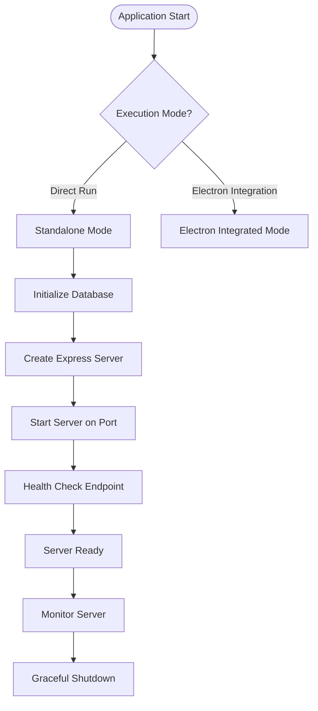

**Diagram sources**
- [mcp-server.ts](file://src/server/mcp-server.ts#L80-L89)

### Integrated Electron Mode

The integrated mode embeds the MCP server within the Electron main process, enabling tight integration with the application's lifecycle management. This mode provides automatic startup, shutdown coordination, and seamless communication between the server and the main application.

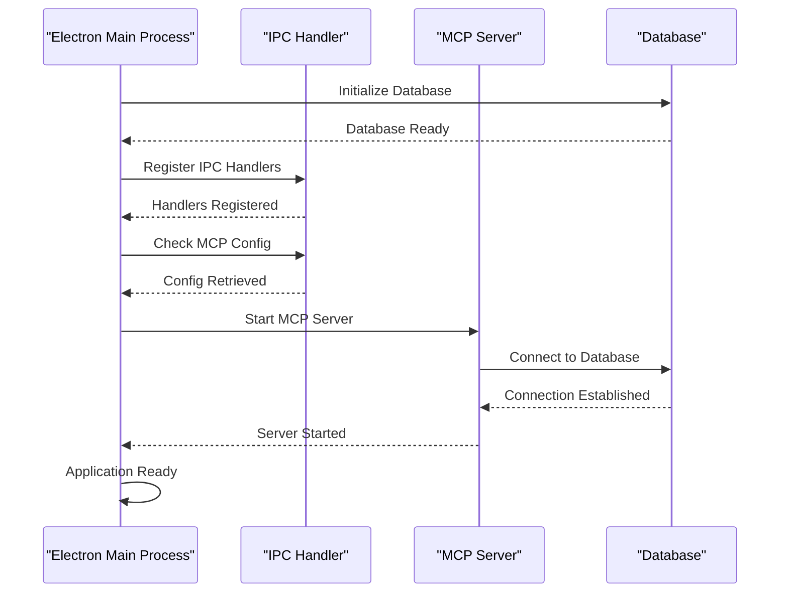

**Diagram sources**
- [index.ts](file://src/main/index.ts#L60-L95)
- [mcp.ts](file://src/main/ipc/mcp.ts#L10-L50)

**Section sources**
- [mcp-server.ts](file://src/server/mcp-server.ts#L80-L89)
- [index.ts](file://src/main/index.ts#L60-L95)

## Core Factory Functions

### createMcpServer() Factory Function

The `createMcpServer()` function serves as the primary factory for constructing the MCP server instance. This function encapsulates all server configuration, middleware setup, route registration, and error handling logic.

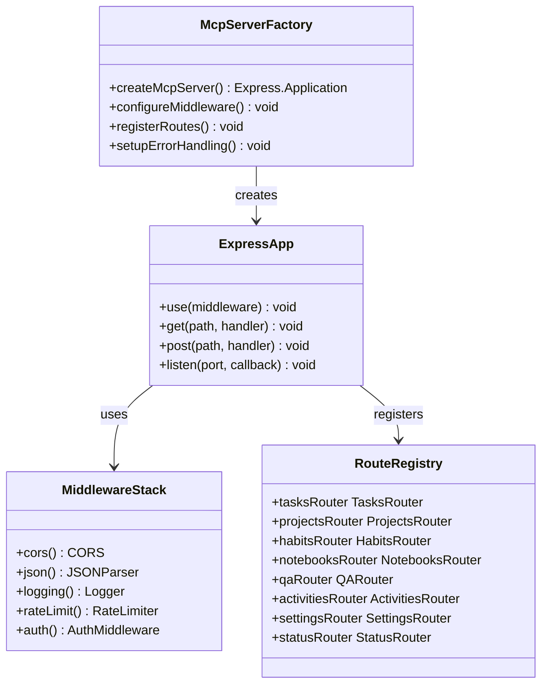

**Diagram sources**
- [mcp-server.ts](file://src/server/mcp-server.ts#L15-L50)

The factory function implements a comprehensive middleware stack including CORS configuration, JSON parsing, request logging, rate limiting, and authentication middleware. It also establishes health check endpoints and registers all API routes for different functional domains.

**Section sources**
- [mcp-server.ts](file://src/server/mcp-server.ts#L15-L50)

### startMcpServer() Startup Function

The `startMcpServer()` function orchestrates the complete server startup process with proper error handling and promise-based return patterns. This function ensures that all prerequisites are met before attempting to start the server.

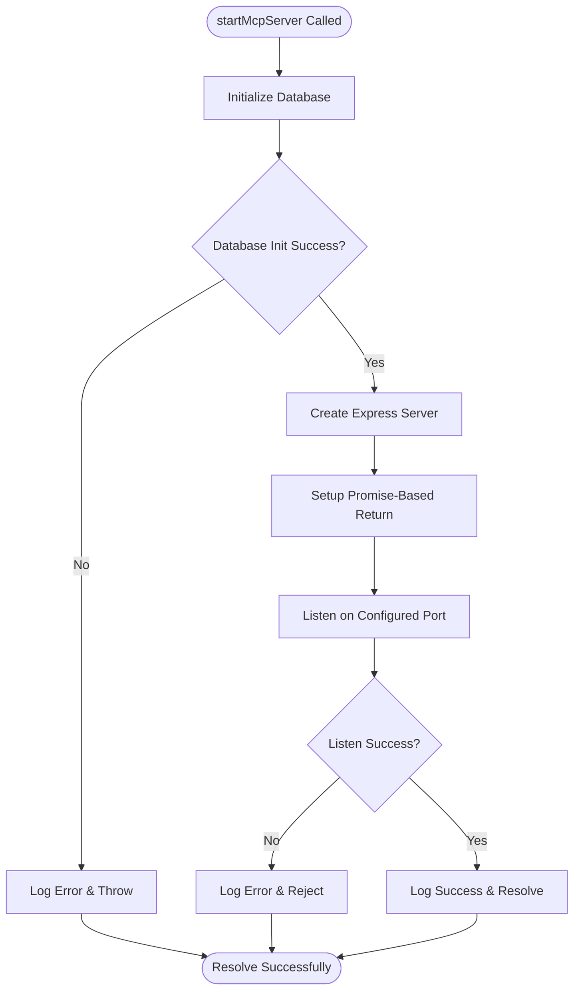

**Diagram sources**
- [mcp-server.ts](file://src/server/mcp-server.ts#L52-L78)

The startup function follows a strict sequence: database initialization, server creation, and network binding. Each step includes comprehensive error logging and appropriate rejection patterns for promise-based error handling.

**Section sources**
- [mcp-server.ts](file://src/server/mcp-server.ts#L52-L78)

## Standalone Server Mode

### Direct Module Execution

The standalone server mode is activated when the module is executed directly via Node.js. This mode includes automatic startup logic that initializes the server and handles any startup failures gracefully.

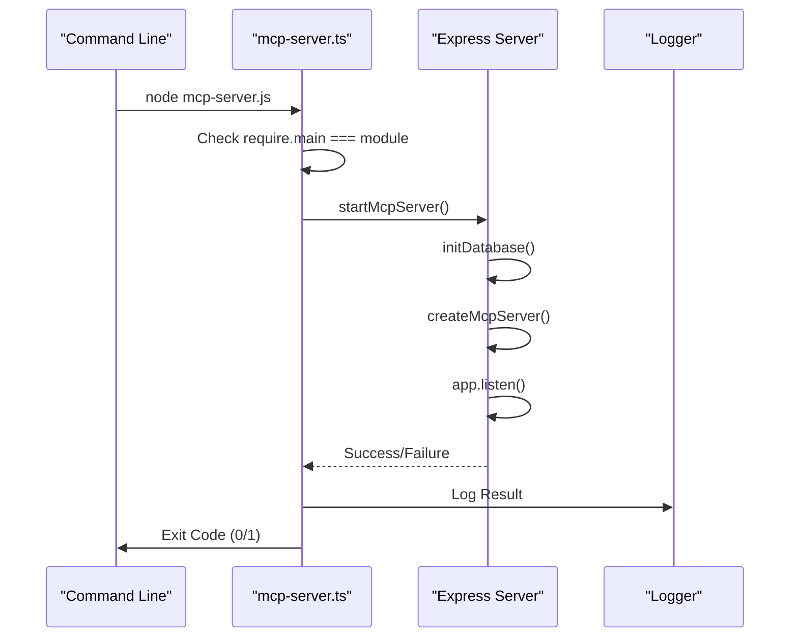

**Diagram sources**
- [mcp-server.ts](file://src/server/mcp-server.ts#L80-L89)

### Environment Configuration

The standalone mode respects environment variables for server configuration, allowing flexible deployment across different environments without code changes.

| Environment Variable | Default Value | Description |
|---------------------|---------------|-------------|
| `MCP_SERVER_PORT` | 3000 | Server listening port |
| `MCP_SERVER_HOST` | localhost | Server bind address |
| `MCP_CORS_ORIGIN` | * | CORS allowed origins |

**Section sources**
- [mcp-server.ts](file://src/server/mcp-server.ts#L13-L14)
- [mcp-server.ts](file://src/server/mcp-server.ts#L80-L89)

## Integrated Electron Mode

### Electron Main Process Integration

The integrated mode seamlessly integrates the MCP server within the Electron main process, providing automatic startup coordination and lifecycle management.

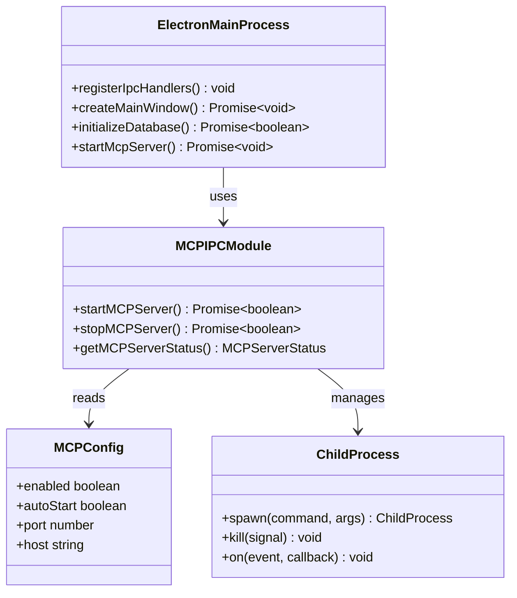

**Diagram sources**
- [index.ts](file://src/main/index.ts#L60-L95)
- [mcp.ts](file://src/main/ipc/mcp.ts#L10-L50)

### Conditional Auto-Startup Logic

The Electron integration implements sophisticated conditional logic to determine when and how to start the MCP server automatically.

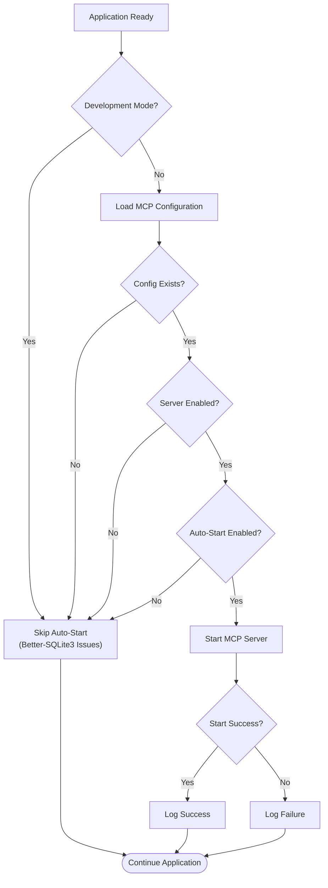

**Diagram sources**
- [index.ts](file://src/main/index.ts#L80-L95)

**Section sources**
- [index.ts](file://src/main/index.ts#L60-L95)

## Configuration Management

### Database Schema and Initialization

The MCP server configuration is persisted in the application's SQLite database, ensuring that settings survive application restarts and provide a centralized configuration management system.

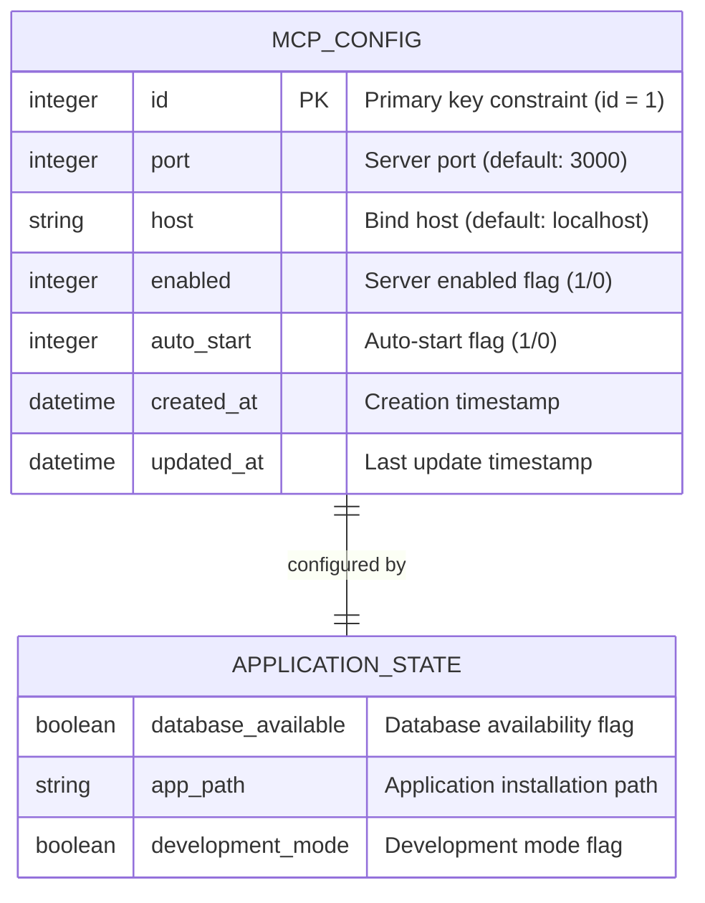

**Diagram sources**
- [init.ts](file://src/database/init.ts#L120-L135)
- [mcpRepo.ts](file://src/database/mcpRepo.ts#L4-L15)

### Configuration Repository Pattern

The configuration management follows a repository pattern that provides type-safe access to MCP server settings with automatic database persistence.

| Configuration Field | Type | Default | Description |
|--------------------|------|---------|-------------|
| `id` | number | 1 | Primary key constraint ensuring single configuration record |
| `port` | number | 3000 | TCP port for server binding |
| `host` | string | localhost | Network interface for server binding |
| `enabled` | boolean | true | Master switch for server operation |
| `autoStart` | boolean | true | Automatic startup on application launch |

**Section sources**
- [mcpRepo.ts](file://src/database/mcpRepo.ts#L4-L58)
- [init.ts](file://src/database/init.ts#L120-L135)

## Lifecycle Control

### Process-Based Server Management

The integrated Electron mode manages the MCP server as a separate child process, providing isolation and robust error recovery mechanisms.

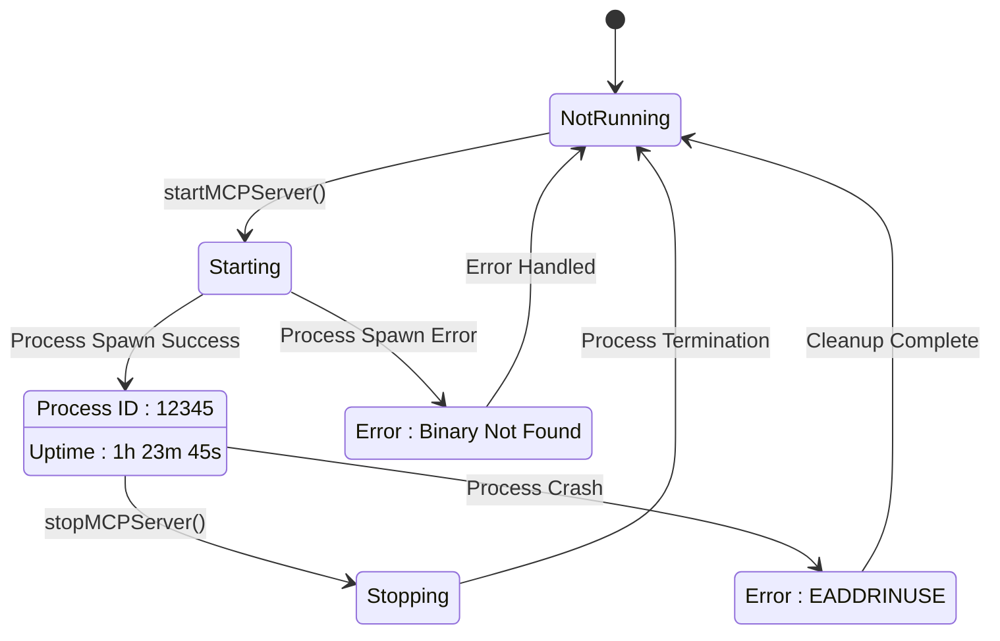

**Diagram sources**
- [mcp.ts](file://src/main/ipc/mcp.ts#L10-L80)

### IPC Communication Layer

The IPC layer provides bidirectional communication between the Electron main process and the MCP server, enabling remote control and status monitoring.

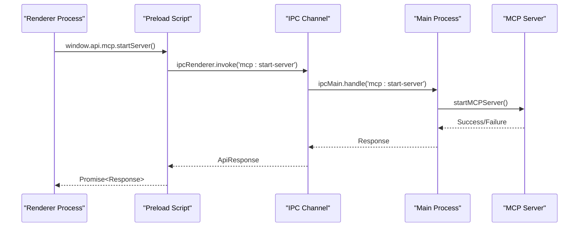

**Diagram sources**
- [preload/index.ts](file://src/preload/index.ts#L180-L190)
- [mcp.ts](file://src/main/ipc/mcp.ts#L100-L120)

**Section sources**
- [mcp.ts](file://src/main/ipc/mcp.ts#L10-L80)
- [preload/index.ts](file://src/preload/index.ts#L180-L190)

## Error Handling Strategies

### Multi-Level Error Handling

The MCP server implements comprehensive error handling at multiple levels: database initialization, server startup, runtime operations, and process management.

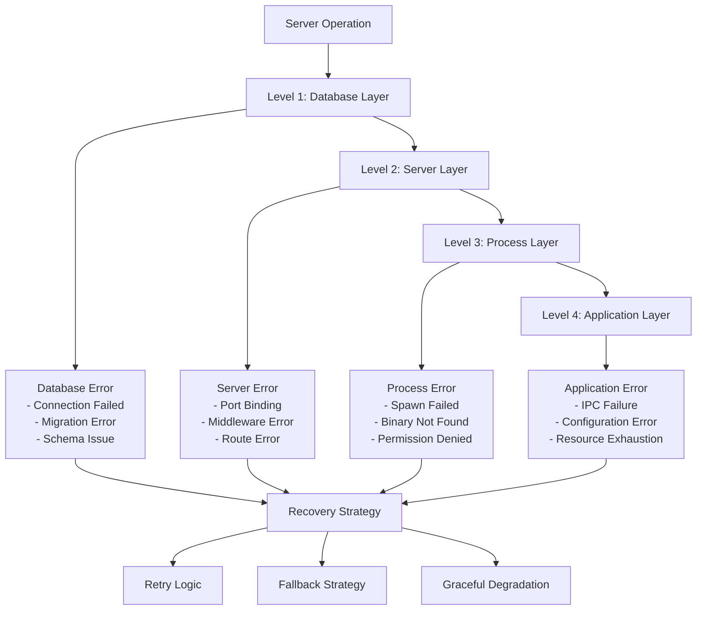

### Error Recovery Patterns

The system implements several error recovery patterns to ensure robust operation under various failure conditions.

| Error Category | Recovery Strategy | Implementation |
|---------------|------------------|----------------|
| Database Connection | Graceful degradation | Continue with limited functionality |
| Server Startup | Process restart | Automatic retry with exponential backoff |
| IPC Communication | Timeout handling | Fallback to polling status |
| Configuration | Default values | Use safe defaults for missing settings |

**Section sources**
- [mcp.ts](file://src/main/ipc/mcp.ts#L40-L50)
- [mcp-server.ts](file://src/server/mcp-server.ts#L52-L78)

## Graceful Shutdown Procedures

### Process Termination Management

The graceful shutdown procedure ensures clean termination of the MCP server process with proper resource cleanup and state preservation.

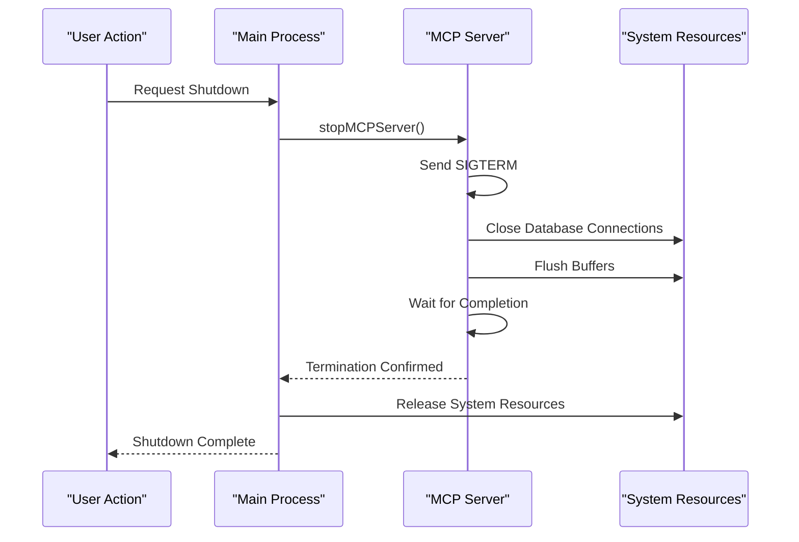

**Diagram sources**
- [mcp.ts](file://src/main/ipc/mcp.ts#L52-L80)

### Resource Cleanup Strategies

The shutdown process implements a comprehensive resource cleanup strategy to prevent resource leaks and ensure proper system state.

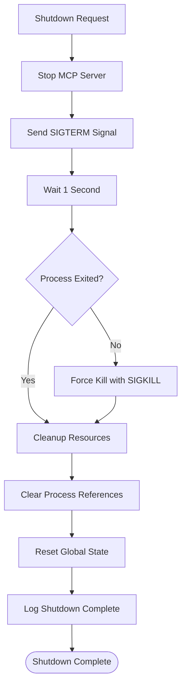

**Diagram sources**
- [mcp.ts](file://src/main/ipc/mcp.ts#L52-L80)

**Section sources**
- [mcp.ts](file://src/main/ipc/mcp.ts#L52-L80)

## Integration Examples

### Basic Electron Integration

Here's a complete example of integrating the MCP server within an Electron application:

```typescript
// Main process integration example
import { app, BrowserWindow } from 'electron';
import { initDatabase } from '../database/init';

app.whenReady().then(async () => {
  // Initialize database first
  await initDatabase();
  
  // Register IPC handlers
  require('./ipc/mcp');
  
  // Load MCP configuration
  const mcpRepo = require('../database/mcpRepo');
  const mcpConfig = mcpRepo.getMCPConfig();
  
  // Conditionally start server
  if (mcpConfig.enabled && mcpConfig.autoStart) {
    const { startMCPServer } = require('./ipc/mcp');
    await startMCPServer();
  }
});
```

### Custom Server Configuration

Example of custom server configuration with environment variables:

```typescript
// Custom server configuration
process.env.MCP_SERVER_PORT = '8080';
process.env.MCP_SERVER_HOST = '0.0.0.0';
process.env.MCP_CORS_ORIGIN = 'https://myapp.com';

// Start server programmatically
import { startMcpServer } from './mcp-server';

startMcpServer().then(success => {
  if (success) {
    console.log('MCP Server started successfully');
  }
}).catch(error => {
  console.error('Failed to start MCP Server:', error);
});
```

**Section sources**
- [index.ts](file://src/main/index.ts#L60-L95)
- [mcp.ts](file://src/main/ipc/mcp.ts#L10-L50)

## Monitoring and Status

### Real-Time Status Monitoring

The system provides comprehensive real-time monitoring capabilities through the status indicator component and IPC-based status queries.

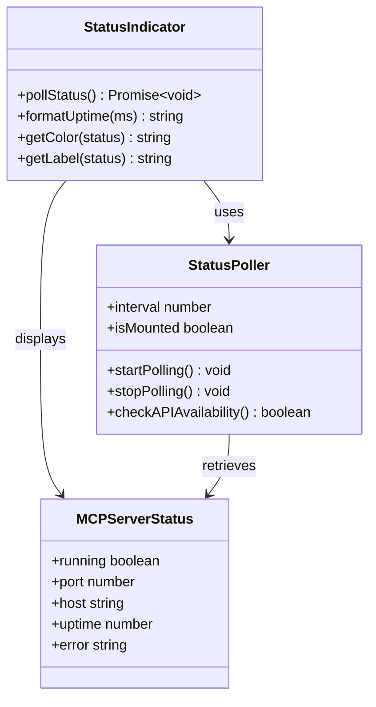

**Diagram sources**
- [MCPStatusIndicator.tsx](file://src/renderer/components/MCPStatusIndicator.tsx#L10-L50)
- [mcp.ts](file://src/main/ipc/mcp.ts#L82-L90)

### Status Display Components

The status indicator component provides visual feedback about the server's operational state with real-time updates.

| Status State | Visual Indicator | Uptime Display | Error Handling |
|-------------|------------------|----------------|----------------|
| Running | Green dot with pulse animation | Hours:Minutes:Seconds | Normal operation |
| Stopped | Red dot | N/A | No service available |
| Loading | Yellow dot | N/A | API connection pending |
| Error | Red dot | N/A | Service unavailable |

**Section sources**
- [MCPStatusIndicator.tsx](file://src/renderer/components/MCPStatusIndicator.tsx#L10-L135)
- [mcp.ts](file://src/main/ipc/mcp.ts#L82-L90)

## Troubleshooting Guide

### Common Startup Issues

#### Database Initialization Failures

**Symptoms**: Server fails to start with database-related errors
**Causes**: 
- Disk space limitations
- Permission denied accessing database file
- Corrupted database file
- Missing database directory

**Resolution Steps**:
1. Check disk space availability
2. Verify application permissions
3. Attempt database repair
4. Reset to default configuration

#### Port Binding Conflicts

**Symptoms**: Server fails to bind to configured port
**Causes**:
- Port already in use by another process
- Insufficient privileges for privileged ports (< 1024)
- Firewall blocking port access

**Resolution Steps**:
1. Change to alternative port
2. Check for conflicting applications
3. Run with elevated privileges
4. Configure firewall exceptions

#### Process Spawn Failures

**Symptoms**: Child process fails to start in Electron mode
**Causes**:
- Missing server binary
- Incorrect executable permissions
- Missing dependencies
- Path resolution issues

**Resolution Steps**:
1. Verify server binary exists
2. Check executable permissions
3. Install missing dependencies
4. Validate path resolution

### Performance Optimization

#### Memory Management

Monitor memory usage patterns and implement appropriate garbage collection strategies for long-running server instances.

#### Connection Pooling

Configure optimal connection pool sizes for database operations to balance performance and resource utilization.

#### Request Throttling

Implement rate limiting to prevent resource exhaustion under high load conditions.

**Section sources**
- [mcp.ts](file://src/main/ipc/mcp.ts#L20-L30)
- [mcp-server.ts](file://src/server/mcp-server.ts#L52-L78)