# Client-Side State Management with Zustand

<cite>
**Referenced Files in This Document**   
- [tasks.ts](file://src/store/tasks.ts)
- [projects.ts](file://src/store/projects.ts)
- [habits.ts](file://src/store/habits.ts)
- [activity.ts](file://src/store/activity.ts)
- [theme.ts](file://src/store/theme.ts)
- [TaskCard.tsx](file://src/renderer/components/TaskCard.tsx)
- [HabitStatsModule.tsx](file://src/renderer/components/HabitStatsModule.tsx)
- [Dashboard.tsx](file://src/renderer/pages/Dashboard.tsx)
- [HabitsPage.tsx](file://src/renderer/pages/HabitsPage.tsx)
- [types.ts](file://src/common/types.ts)
- [ARCHITECTURE.md](file://AI/ARCHITECTURE.md)
- [STATE-MANAGEMENT.md](file://AI/STATE-MANAGEMENT.md)
</cite>

## Table of Contents
1. [Introduction](#introduction)
2. [Architecture Overview](#architecture-overview)
3. [Store Slices](#store-slices)
4. [Integration Between Stores](#integration-between-stores)
5. [Optimistic Updates and Error Handling](#optimistic-updates-and-error-handling)
6. [Selectors and Derived Data](#selectors-and-derived-data)
7. [Performance Optimization](#performance-optimization)
8. [Component Integration](#component-integration)
9. [Conclusion](#conclusion)

## Introduction

LifeOS implements a client-side state management system using Zustand, a lightweight and performant state management library for React applications. This architecture provides a centralized, predictable state container that manages domain-specific data across the application. The system follows a modular slice-based approach where each store encapsulates related state and actions, promoting separation of concerns and maintainability. Zustand was chosen over other state management solutions due to its minimal API surface, excellent performance characteristics, and seamless TypeScript integration, which aligns with LifeOS's technical stack and architectural principles.

**Section sources**
- [ARCHITECTURE.md](file://AI/ARCHITECTURE.md#L25-L26)
- [STATE-MANAGEMENT.md](file://AI/STATE-MANAGEMENT.md#L3-L5)

## Architecture Overview

The state management architecture in LifeOS follows a domain-driven design pattern with distinct store slices for different functional areas. Each store slice maintains its own state, actions, and selectors while communicating with other slices when necessary. The architecture leverages Zustand's ability to create independent stores that can be composed together, providing both isolation and integration capabilities. Stores interact with the backend through IPC (Inter-Process Communication) calls exposed via the preload script, following a unidirectional data flow pattern.

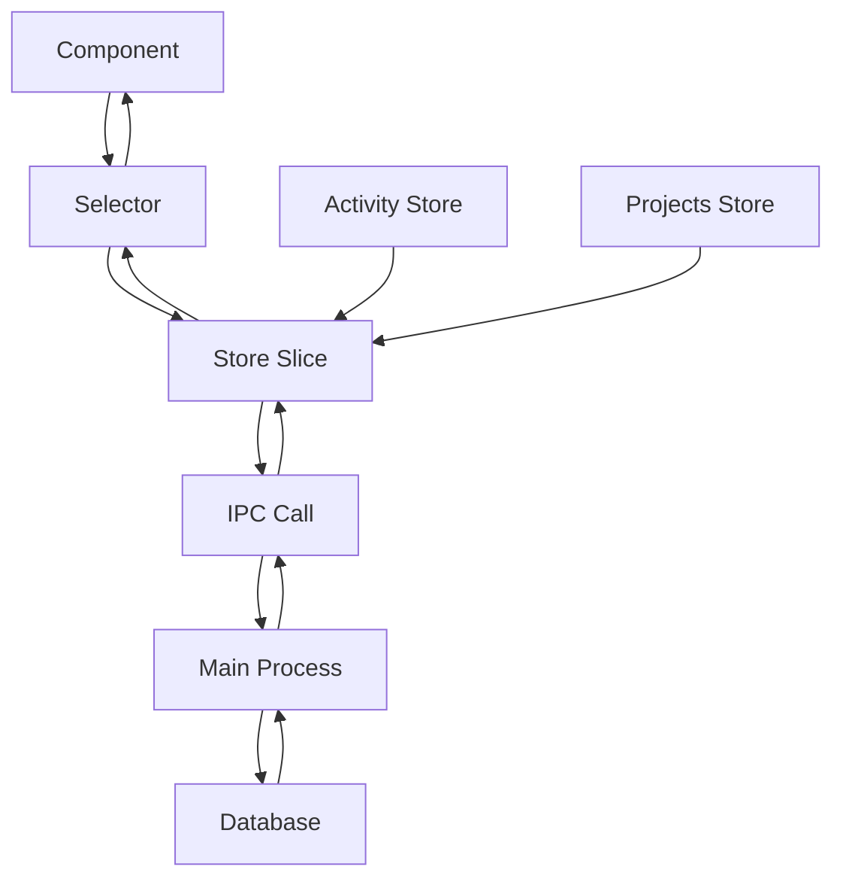

**Diagram sources**
- [tasks.ts](file://src/store/tasks.ts#L1-L10)
- [projects.ts](file://src/store/projects.ts#L1-L10)
- [activity.ts](file://src/store/activity.ts#L1-L10)

**Section sources**
- [ARCHITECTURE.md](file://AI/ARCHITECTURE.md#L55-L57)
- [STATE-MANAGEMENT.md](file://AI/STATE-MANAGEMENT.md#L3-L5)

## Store Slices

LifeOS implements a slice-based state management pattern where each domain has its own dedicated store. This modular approach allows for better code organization, easier testing, and improved performance through selective re-renders. Each store slice encapsulates domain-specific state and provides actions to modify that state, following the principle of co-location.

### Tasks Store

The `useTasksStore` manages all task-related state, organizing tasks by project ID to enable efficient access and updates. It maintains a dictionary of tasks (`tasksByProject`) where keys are project IDs and values are arrays of tasks. The store also tracks loading states per project and error conditions. Key actions include `loadTasks`, `createTask`, `updateTask`, and `moveTask`, all of which handle IPC communication with error handling and optimistic update patterns.

```mermaid
classDiagram
class TasksState {
+tasksByProject : Record<number, Task[]>
+loading : Record<number, boolean>
+error? : string
+loadTasks(projectId : number) : Promise<void>
+createTask(payload : CreateTaskInput) : Promise<void>
+updateTask(id : number, payload : UpdateTaskPayload) : Promise<void>
+moveTask(args : { id : number; projectId : number; status : string; position : number }) : Promise<void>
}
class Task {
+id : number
+projectId : number
+title : string
+description? : string
+status : string
+dueDate? : string
+priority? : string
+tags? : string[]
+position : number
+createdAt : string
+updatedAt : string
}
TasksState --> Task : "contains"
```

**Diagram sources**
- [tasks.ts](file://src/store/tasks.ts#L5-L15)
- [types.ts](file://src/common/types.ts#L10-L32)

**Section sources**
- [tasks.ts](file://src/store/tasks.ts#L1-L132)

### Projects Store

The `useProjectsStore` manages project-related state including the list of projects, the active project ID, and loading/error states. It provides actions for loading projects, setting the active project, and creating new projects. The store plays a crucial role in the application's navigation model, as the active project determines which tasks are displayed in the UI. When a project is activated, the store automatically triggers the loading of associated tasks.

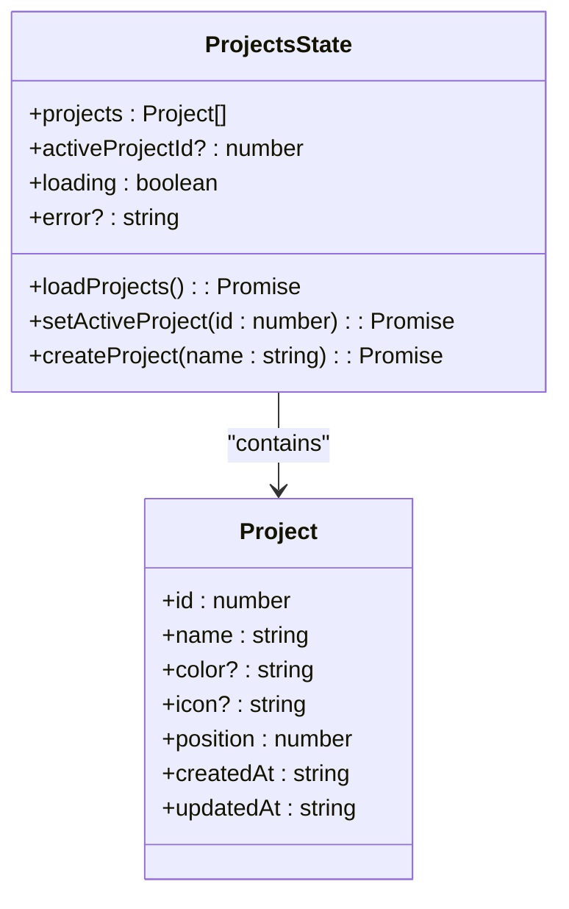

**Diagram sources**
- [projects.ts](file://src/store/projects.ts#L5-L15)
- [types.ts](file://src/common/types.ts#L1-L9)

**Section sources**
- [projects.ts](file://src/store/projects.ts#L1-L86)

### Habits Store

The `useHabitsStore` manages habit tracking functionality, including habit definitions, completion logs, and statistics. It maintains a list of habits with their associated statistics and a map of habit logs indexed by habit ID. The store provides comprehensive actions for habit management including creation, updating, deletion, and logging completions. It also supports selecting a specific habit for detailed viewing and automatically loads logs when a habit is selected.

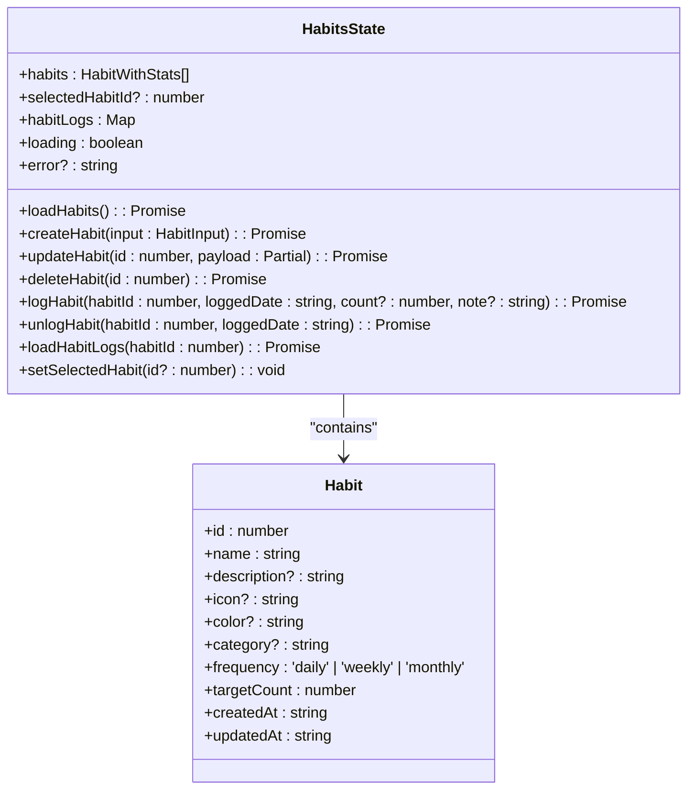

**Diagram sources**
- [habits.ts](file://src/store/habits.ts#L5-L25)
- [types.ts](file://src/common/types.ts#L1-L32)

**Section sources**
- [habits.ts](file://src/store/habits.ts#L1-L160)

### Activity Store

The `useActivityStore` manages the application's activity log, which records user actions and system events. It maintains a list of activity entries and provides actions for loading activities, pushing new activities, and clearing the log. The store is used throughout the application to log significant events such as task creation, project creation, and habit completions, providing an audit trail of user activity.

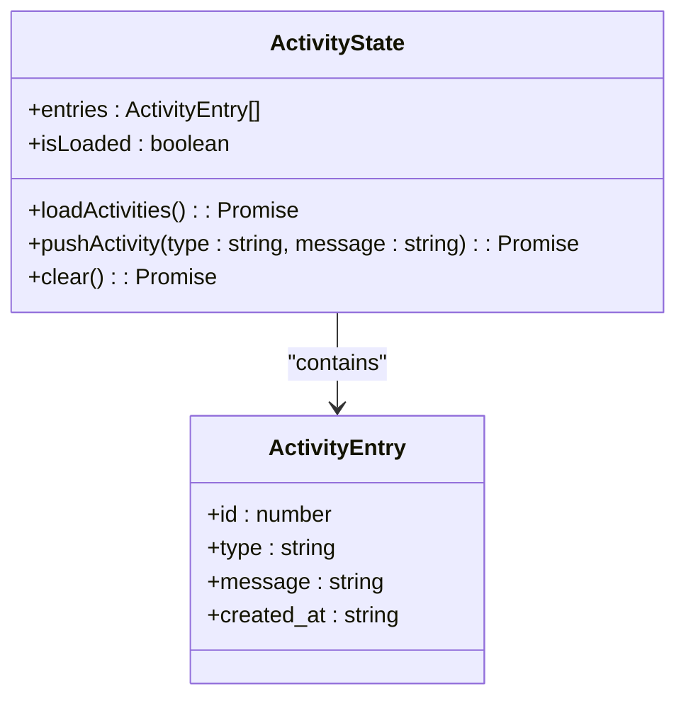

**Diagram sources**
- [activity.ts](file://src/store/activity.ts#L5-L15)
- [types.ts](file://src/common/types.ts#L1-L32)

**Section sources**
- [activity.ts](file://src/store/activity.ts#L1-L68)

### Theme Store

The `useThemeStore` manages the application's visual theme, supporting both light and dark modes. It maintains the current theme state and provides actions for loading the theme from settings, setting a specific theme, and toggling between themes. The store also includes a utility function `applyTheme` that updates CSS custom properties to reflect the current theme, enabling dynamic theming without requiring a page reload.

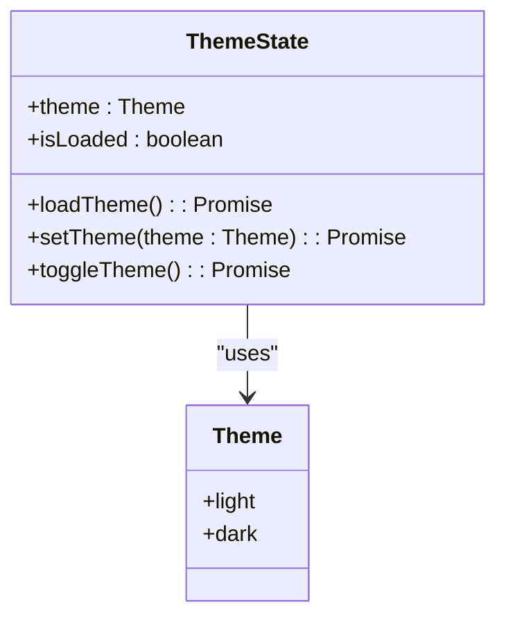

**Diagram sources**
- [theme.ts](file://src/store/theme.ts#L5-L15)
- [types.ts](file://src/common/types.ts#L1-L32)

**Section sources**
- [theme.ts](file://src/store/theme.ts#L1-L88)

## Integration Between Stores

The store slices in LifeOS are designed to work together through well-defined integration points, creating a cohesive state management system. The most significant integration occurs between the `useProjectsStore` and `useTasksStore`, where the active project selection directly influences task scoping and loading.

### Project-Task Integration

The `useProjectsStore` and `useTasksStore` are tightly integrated to provide a seamless project-based task management experience. When a project is set as active, either through user interaction or application initialization, the projects store automatically triggers the loading of tasks for that project. This integration ensures that the task list always reflects the currently active project.

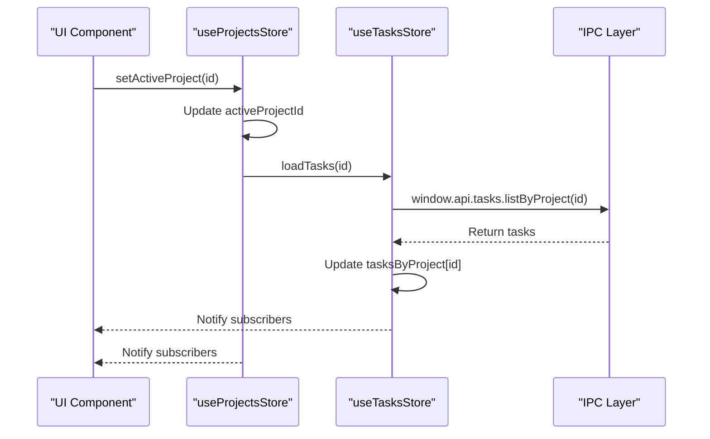

**Diagram sources**
- [projects.ts](file://src/store/projects.ts#L45-L68)
- [tasks.ts](file://src/store/tasks.ts#L20-L40)

**Section sources**
- [projects.ts](file://src/store/projects.ts#L45-L68)
- [tasks.ts](file://src/store/tasks.ts#L20-L40)

### Activity Logging Integration

Multiple stores integrate with the `useActivityStore` to maintain a comprehensive activity log. Whenever significant actions occur in domain stores (such as creating a task or project), they push corresponding entries to the activity store. This cross-store communication is achieved through direct access to the activity store's state using `getState()`.

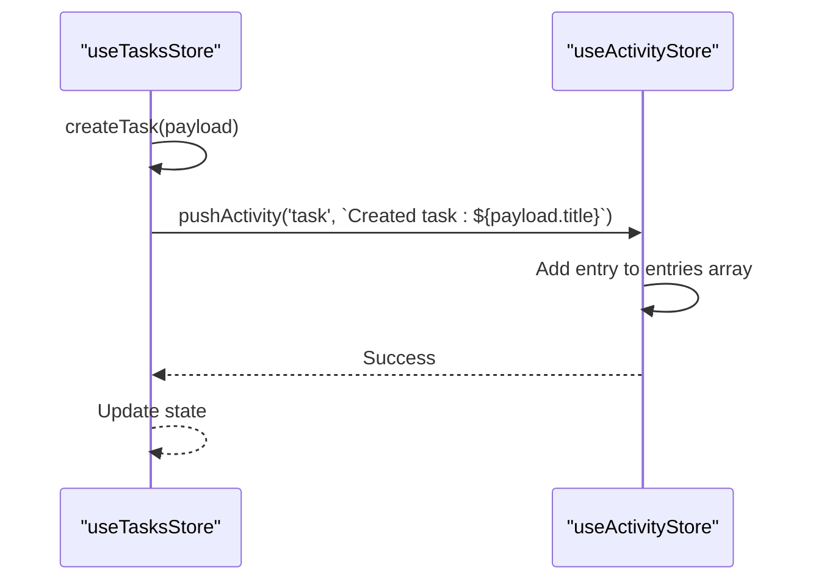

**Diagram sources**
- [tasks.ts](file://src/store/tasks.ts#L70-L75)
- [projects.ts](file://src/store/projects.ts#L80-L85)
- [habits.ts](file://src/store/habits.ts#L50-L55)

**Section sources**
- [tasks.ts](file://src/store/tasks.ts#L70-L75)
- [projects.ts](file://src/store/projects.ts#L80-L85)

## Optimistic Updates and Error Handling

LifeOS implements optimistic update patterns to enhance UI responsiveness, particularly for actions that involve IPC calls to the main process. This approach immediately updates the local state to reflect the expected outcome of an operation, providing instant feedback to users, while handling the actual data persistence asynchronously.

### Optimistic Update Pattern

The optimistic update pattern is consistently applied across all store actions. When a user performs an action like creating a task, the store immediately updates its local state with the new data before the IPC call completes. If the IPC call succeeds, the state remains as is. If it fails, the store reverts to the previous state and surfaces the error to the UI.

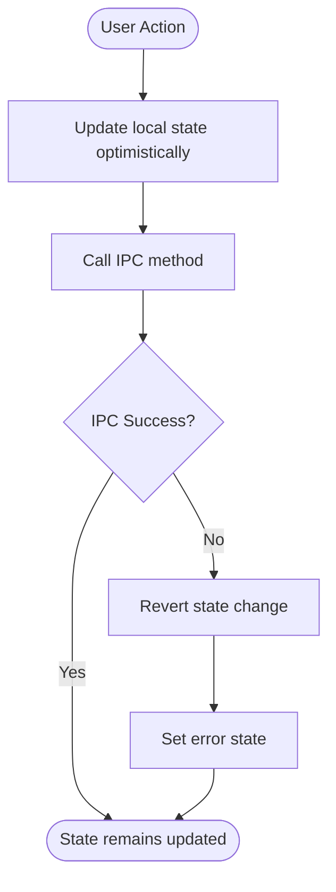

**Diagram sources**
- [tasks.ts](file://src/store/tasks.ts#L50-L75)
- [projects.ts](file://src/store/projects.ts#L50-L70)

**Section sources**
- [tasks.ts](file://src/store/tasks.ts#L50-L75)
- [projects.ts](file://src/store/projects.ts#L50-L70)

### Error Handling Strategy

The state management system implements a comprehensive error handling strategy that captures errors from IPC calls and makes them available to the UI through the store's error state. Each store slice maintains an `error` property that is set when an operation fails, allowing components to display appropriate error messages to users.

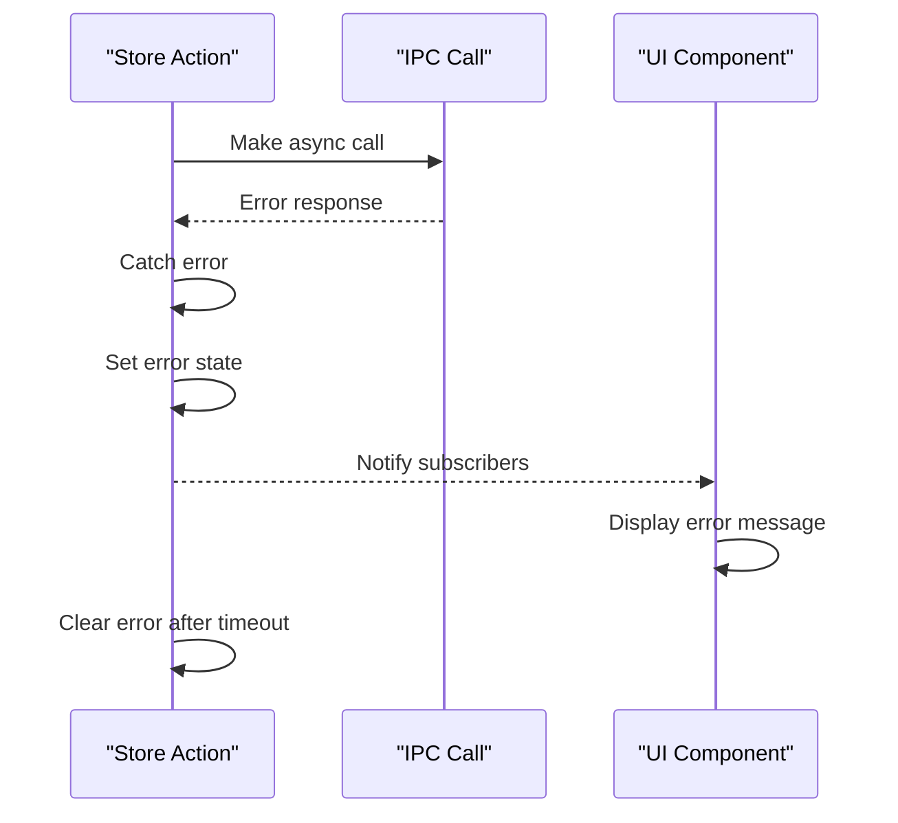

**Diagram sources**
- [tasks.ts](file://src/store/tasks.ts#L30-L40)
- [projects.ts](file://src/store/projects.ts#L20-L30)

**Section sources**
- [tasks.ts](file://src/store/tasks.ts#L30-L40)
- [projects.ts](file://src/store/projects.ts#L20-L30)

## Selectors and Derived Data

Zustand selectors are used extensively in LifeOS to derive computed data from the raw state and to optimize component re-renders by subscribing to only the specific state slices they need.

### Custom Hook Selectors

Each store exports a custom hook selector (e.g., `useTasks`, `useProjects`) that allows components to subscribe to specific portions of the store state. These selectors transform the raw store state into a format that is convenient for components to consume, often filtering or formatting the data.

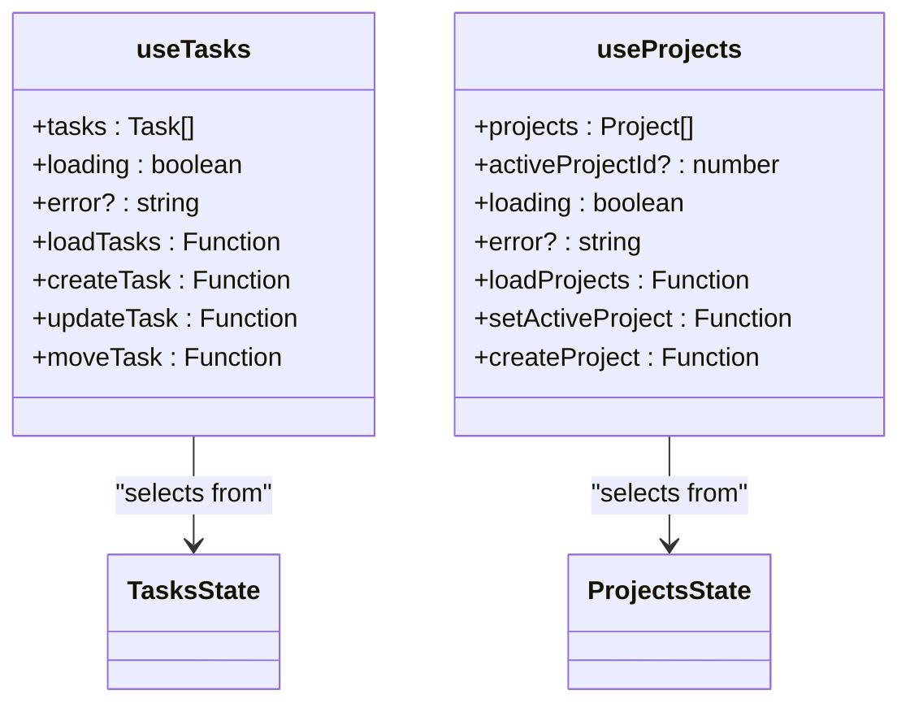

**Diagram sources**
- [tasks.ts](file://src/store/tasks.ts#L107-L131)
- [projects.ts](file://src/store/projects.ts#L69-L85)

**Section sources**
- [tasks.ts](file://src/store/tasks.ts#L107-L131)
- [projects.ts](file://src/store/projects.ts#L69-L85)

### Computed Properties

Selectors are used to compute derived properties from the raw state. For example, the tasks store uses a `sortTasks` function to ensure tasks are always sorted by status and position, while the habits store computes statistics like completion rates and streaks from the raw habit data.

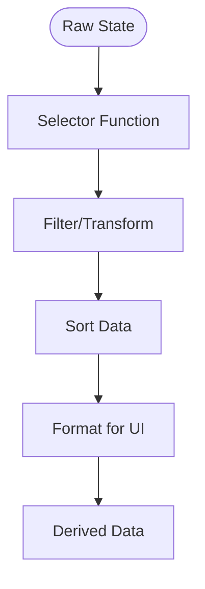

**Diagram sources**
- [tasks.ts](file://src/store/tasks.ts#L15-L25)
- [habits.ts](file://src/store/habits.ts#L100-L120)

**Section sources**
- [tasks.ts](file://src/store/tasks.ts#L15-L25)
- [habits.ts](file://src/store/habits.ts#L100-L120)

## Performance Optimization

The state management system in LifeOS incorporates several performance optimizations to ensure a responsive user experience, particularly when dealing with large datasets or frequent state updates.

### Partial State Updates

Stores use partial state updates to minimize the amount of data that needs to be processed and compared during re-renders. Instead of replacing the entire state object, actions only update the specific properties that have changed, leveraging Zustand's efficient state comparison.

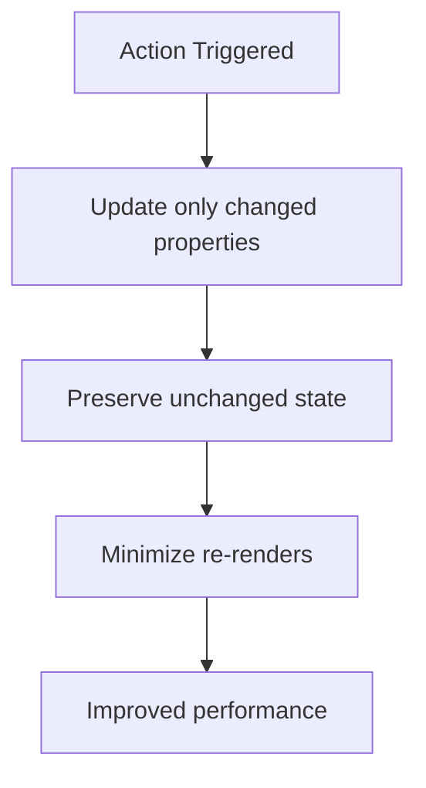

**Diagram sources**
- [tasks.ts](file://src/store/tasks.ts#L20-L40)
- [projects.ts](file://src/store/projects.ts#L20-L30)

**Section sources**
- [tasks.ts](file://src/store/tasks.ts#L20-L40)
- [projects.ts](file://src/store/projects.ts#L20-L30)

### Subscription Scoping

Components use Zustand's selector pattern to subscribe only to the specific state slices they need, preventing unnecessary re-renders when unrelated state changes occur. This is particularly important in complex UIs where multiple components depend on different parts of the same store.

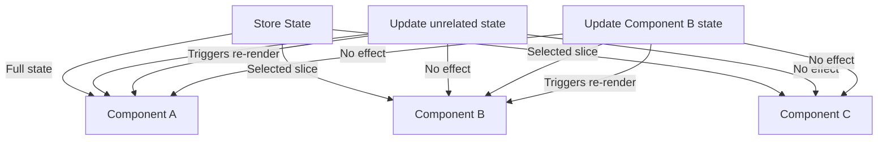

**Diagram sources**
- [tasks.ts](file://src/store/tasks.ts#L107-L131)
- [Dashboard.tsx](file://src/renderer/pages/Dashboard.tsx#L10-L20)

**Section sources**
- [tasks.ts](file://src/store/tasks.ts#L107-L131)
- [Dashboard.tsx](file://src/renderer/pages/Dashboard.tsx#L10-L20)

## Component Integration

The state management system is integrated into UI components throughout the application, providing a consistent pattern for accessing and modifying state.

### TaskCard Component

The `TaskCard` component demonstrates how components consume state from the store. It receives task data as a prop and uses it to render a visual representation of a task, including title, description, priority indicators, and metadata like due dates and tags. The component does not directly access the store but receives its data through parent components that use store selectors.

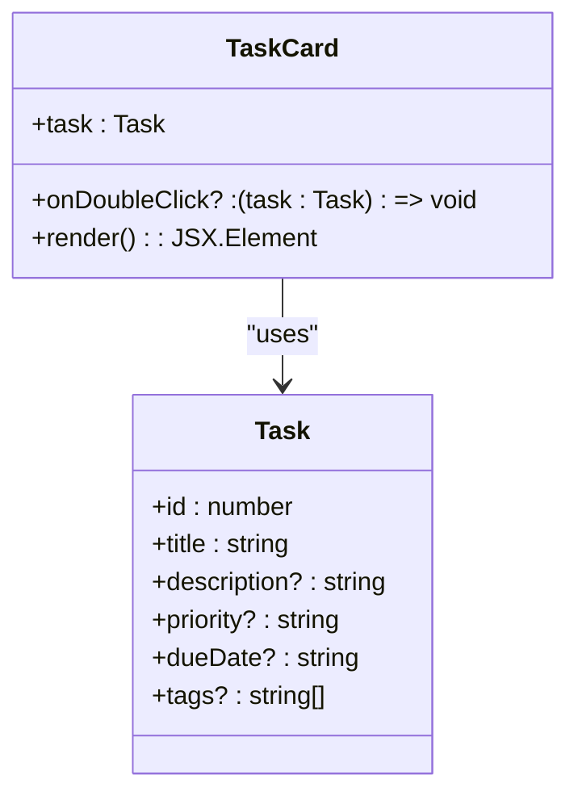

**Diagram sources**
- [TaskCard.tsx](file://src/renderer/components/TaskCard.tsx#L1-L10)
- [types.ts](file://src/common/types.ts#L10-L32)

**Section sources**
- [TaskCard.tsx](file://src/renderer/components/TaskCard.tsx#L1-L181)

### HabitStatsModule Component

The `HabitStatsModule` component illustrates direct store integration, using the `useHabits` selector to access habit statistics and display them in a dashboard widget. The component subscribes to the habits store and re-renders whenever the habit data changes, providing real-time updates to the user.

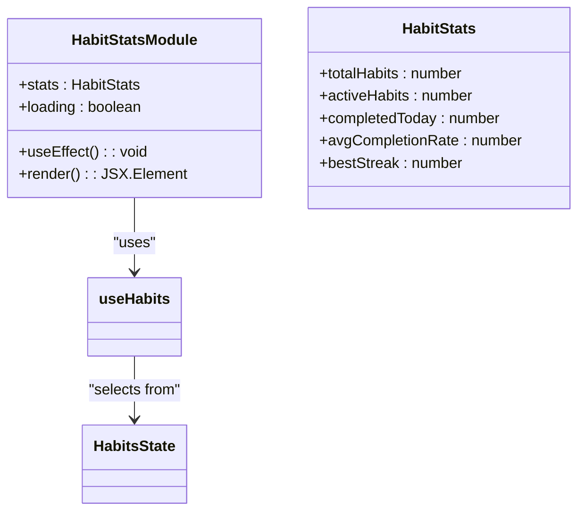

**Diagram sources**
- [HabitStatsModule.tsx](file://src/renderer/components/HabitStatsModule.tsx#L1-L10)
- [habits.ts](file://src/store/habits.ts#L1-L10)

**Section sources**
- [HabitStatsModule.tsx](file://src/renderer/components/HabitStatsModule.tsx#L1-L169)

## Conclusion

The client-side state management system in LifeOS, built on Zustand, provides a robust, performant, and maintainable solution for managing application state. By adopting a modular slice-based architecture, the system effectively organizes state by domain while enabling necessary integrations between related domains. The implementation of optimistic updates enhances UI responsiveness, while comprehensive error handling ensures a reliable user experience. Through the use of selectors and subscription scoping, the system optimizes performance and prevents unnecessary re-renders. This architecture aligns with LifeOS's overall design principles of simplicity, performance, and maintainability, providing a solid foundation for the application's complex state management needs.