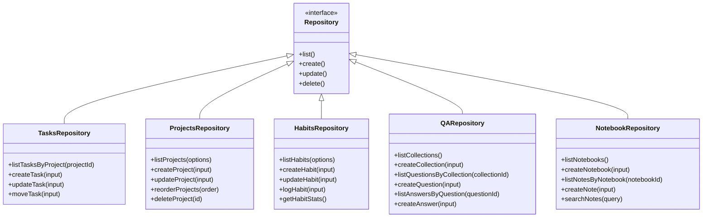

# Persistent Data Storage and Repository Pattern

<cite>
**Referenced Files in This Document**   
- [init.ts](file://src/database/init.ts)
- [types.ts](file://src/database/types.ts)
- [mappers.ts](file://src/database/mappers.ts)
- [tasksRepo.ts](file://src/database/tasksRepo.ts)
- [projectsRepo.ts](file://src/database/projectsRepo.ts)
- [habitsRepo.ts](file://src/database/habitsRepo.ts)
- [qaRepo.ts](file://src/database/qaRepo.ts)
- [notebookRepo.ts](file://src/database/notebookRepo.ts)
- [eventsRepo.ts](file://src/database/eventsRepo.ts)
- [common/types.ts](file://src/common/types.ts)
- [habitsSchema.ts](file://src/database/habitsSchema.ts)
- [qaSchema.ts](file://src/database/qaSchema.ts)
- [notebookSchema.ts](file://src/database/notebookSchema.ts)
- [metricsSchema.ts](file://src/database/metricsSchema.ts)
- [tasks.ts](file://src/main/ipc/tasks.ts)
- [projects.ts](file://src/main/ipc/projects.ts)
- [habits.ts](file://src/main/ipc/habits.ts)
- [qa.ts](file://src/main/ipc/qa.ts)
- [notebook.ts](file://src/main/ipc/notebook.ts)
</cite>

## Table of Contents
1. [Introduction](#introduction)
2. [Database Initialization and Schema Management](#database-initialization-and-schema-management)
3. [Repository Pattern Implementation](#repository-pattern-implementation)
4. [Data Mapping and Type Safety](#data-mapping-and-type-safety)
5. [State Management Integration](#state-management-integration)
6. [Transactional Operations and Data Integrity](#transactional-operations-and-data-integrity)
7. [Query Optimization and Performance](#query-optimization-and-performance)
8. [Input Validation and Sanitization](#input-validation-and-sanitization)
9. [Conclusion](#conclusion)

## Introduction

The LifeOS application implements a robust persistent data layer using the repository pattern with better-sqlite3 as the underlying database engine. This documentation provides a comprehensive analysis of how the application manages data persistence, focusing on the architecture, implementation details, and integration patterns that ensure data integrity, type safety, and efficient state synchronization between the UI and database.

The data layer is designed with clear separation of concerns, where repositories abstract CRUD operations, mappers handle data transformation between database records and application models, and IPC handlers bridge the gap between the Electron main process and renderer UI components. This architecture enables type-safe database interactions, transactional integrity, and seamless synchronization of Zustand stores with SQLite records.

**Section sources**
- [init.ts](file://src/database/init.ts)
- [types.ts](file://src/database/types.ts)
- [mappers.ts](file://src/database/mappers.ts)

## Database Initialization and Schema Management

The database initialization process in `init.ts` handles the creation and migration of the SQLite database with a comprehensive schema setup. When the application starts, the `initDatabase` function is called to establish a connection to the database file stored in the user's application data directory.

The initialization process follows a structured approach:
1. Creates the user data directory if it doesn't exist
2. Establishes a connection to the SQLite database file
3. Applies PRAGMA settings for data integrity
4. Executes schema migrations and table creation


**Diagram sources**
- [init.ts](file://src/database/init.ts#L1-L149)

The schema management system uses a migration-based approach where tables are created with `CREATE TABLE IF NOT EXISTS` statements, ensuring idempotent execution. The system also handles schema evolution through ALTER TABLE statements wrapped in try-catch blocks to gracefully handle cases where columns already exist.

Module-specific schemas are applied through dedicated functions (`applyMetricsSchema`, `applyQASchema`, etc.) that create tables and indexes for specialized features like habits tracking, Q&A management, and notebook functionality. This modular approach allows for independent evolution of different data domains while maintaining a cohesive overall schema.

Foreign key constraints are explicitly enabled through the `PRAGMA foreign_keys = ON` directive, ensuring referential integrity across related tables. The schema includes comprehensive indexing strategies to optimize query performance, with indexes created on frequently queried columns such as project positions, task statuses, and creation timestamps.

**Section sources**
- [init.ts](file://src/database/init.ts#L1-L149)
- [habitsSchema.ts](file://src/database/habitsSchema.ts)
- [qaSchema.ts](file://src/database/qaSchema.ts)
- [notebookSchema.ts](file://src/database/notebookSchema.ts)
- [metricsSchema.ts](file://src/database/metricsSchema.ts)

## Repository Pattern Implementation

The LifeOS application implements the repository pattern through a collection of specialized repository modules, each responsible for managing a specific domain entity. The repositories provide an abstraction layer between the application logic and the underlying database, encapsulating all data access operations.

The core repositories include:
- `tasksRepo.ts`: Manages task entities and their relationships
- `projectsRepo.ts`: Handles project lifecycle and organization
- `habitsRepo.ts`: Implements habit tracking functionality
- `qaRepo.ts`: Manages Q&A collections and knowledge management
- `notebookRepo.ts`: Handles notebook and note entities



**Diagram sources**
- [tasksRepo.ts](file://src/database/tasksRepo.ts)
- [projectsRepo.ts](file://src/database/projectsRepo.ts)
- [habitsRepo.ts](file://src/database/habitsRepo.ts)
- [qaRepo.ts](file://src/database/qaRepo.ts)
- [notebookRepo.ts](file://src/database/notebookRepo.ts)

Each repository follows a consistent pattern of exposing CRUD operations through well-defined functions that handle database interactions. The repositories are stateless and rely on the `getDb()` function to obtain a database connection, ensuring that all operations use the same database instance.

The repository methods are designed to handle business logic related to their domain entities. For example, the `tasksRepo` handles task positioning logic by automatically calculating the next position when creating a new task, while the `projectsRepo` manages project reordering through batch updates within a transaction.

This pattern provides several benefits:
- Encapsulation of data access logic
- Separation of concerns between data access and business logic
- Consistent API for data operations across different entity types
- Centralized error handling and transaction management
- Testability through dependency injection

**Section sources**
- [tasksRepo.ts](file://src/database/tasksRepo.ts)
- [projectsRepo.ts](file://src/database/projectsRepo.ts)
- [habitsRepo.ts](file://src/database/habitsRepo.ts)
- [qaRepo.ts](file://src/database/qaRepo.ts)
- [notebookRepo.ts](file://src/database/notebookRepo.ts)

## Data Mapping and Type Safety

The LifeOS application employs a sophisticated data mapping system that transforms database records into application models and vice versa. This mapping layer ensures type safety and proper data transformation between the database schema and the application's domain model.

The mapping system is implemented in `mappers.ts` and consists of functions that convert database rows (with underscored column names) to application models (with camelCased property names). For example, the `mapTask` function transforms a `TaskRow` database record into a `Task` application model:


**Diagram sources**
- [mappers.ts](file://src/database/mappers.ts#L1-L53)
- [types.ts](file://src/database/types.ts)
- [common/types.ts](file://src/common/types.ts)

The type system is defined across multiple files:
- `src/database/types.ts`: Defines database row interfaces with underscored naming
- `src/common/types.ts`: Defines application model interfaces with camelCase naming
- Repository-specific interfaces: Define domain-specific models

The mapping functions handle data transformation, including:
- Converting column names from snake_case to camelCase
- Transforming null values to undefined for optional properties
- Parsing JSON-encoded fields (like tags)
- Calculating derived properties (like habit streaks)

TypeScript interfaces ensure compile-time type safety throughout the data layer. The `common/types.ts` file defines the application's domain models, while `database/types.ts` defines the database schema interfaces. This separation allows for independent evolution of the database schema and application models while maintaining type safety through explicit mapping functions.

The system also handles special data types:
- Date/time strings are preserved as ISO strings
- JSON-encoded arrays (like tags) are parsed and serialized
- Boolean values are properly converted between database integers and JavaScript booleans
- Optional fields are handled with null/undefined conversion

**Section sources**
- [mappers.ts](file://src/database/mappers.ts#L1-L53)
- [types.ts](file://src/database/types.ts)
- [common/types.ts](file://src/common/types.ts)

## State Management Integration

The LifeOS application integrates its persistent data layer with UI state management through a well-defined IPC (Inter-Process Communication) system that synchronizes Zustand stores with SQLite records. This integration pattern ensures that UI state mutations trigger appropriate database operations and that database changes are reflected in the UI.

The integration follows a unidirectional data flow:
1. UI components dispatch actions to Zustand stores
2. Stores make IPC calls to the main process
3. IPC handlers invoke repository methods
4. Database operations are performed
5. Results are returned to the renderer process
6. Zustand stores are updated with the results


**Diagram sources**
- [tasks.ts](file://src/main/ipc/tasks.ts)
- [projects.ts](file://src/main/ipc/projects.ts)
- [habits.ts](file://src/main/ipc/habits.ts)
- [qa.ts](file://src/main/ipc/qa.ts)
- [notebook.ts](file://src/main/ipc/notebook.ts)

The IPC handlers in the `src/main/ipc` directory serve as the bridge between the renderer process and the main process database operations. Each handler uses the `wrapIpc` utility to standardize error handling and response formatting. The handlers are thin wrappers around repository methods, ensuring that business logic remains in the repositories rather than the IPC layer.

This architecture creates a clear separation between transient UI state and persisted domain entities:
- Transient UI state: Managed by Zustand stores, includes temporary values, form states, and UI-specific flags
- Persisted domain entities: Stored in SQLite, represent the authoritative source of truth

When state mutations occur, they follow this pattern:
1. The UI initiates a state change
2. The Zustand store makes an IPC call to persist the change
3. The repository performs the database operation
4. The successful result is used to update the store
5. The UI re-renders with the updated state

This approach ensures data consistency while providing a responsive user experience. The system also handles edge cases like network failures or database errors by maintaining the separation between UI state and persisted data, allowing for proper error recovery.

**Section sources**
- [tasks.ts](file://src/main/ipc/tasks.ts)
- [projects.ts](file://src/main/ipc/projects.ts)
- [habits.ts](file://src/main/ipc/habits.ts)
- [qa.ts](file://src/main/ipc/qa.ts)
- [notebook.ts](file://src/main/ipc/notebook.ts)

## Transactional Operations and Data Integrity

The LifeOS application ensures data integrity through careful use of transactions and referential integrity constraints. The system employs both implicit and explicit transaction management to maintain consistency across related data operations.

The database schema enforces referential integrity through foreign key constraints with cascading deletes. For example, when a project is deleted, all related tasks are automatically removed due to the `ON DELETE CASCADE` constraint defined in the schema. This ensures that orphaned records cannot exist in the database.

Explicit transactions are used for operations that affect multiple related entities. The `deleteProject` function in `projectsRepo.ts` demonstrates this pattern:


**Diagram sources**
- [projectsRepo.ts](file://src/database/projectsRepo.ts#L1-L147)

The transaction system uses better-sqlite3's transaction API to wrap multiple operations in a single atomic unit. If any operation within the transaction fails, all changes are rolled back, maintaining data consistency. This is particularly important for operations like project deletion, where multiple related records must be removed together.

The application also maintains data integrity through:
- Unique constraints (e.g., project names must be unique)
- NOT NULL constraints on required fields
- Default values for timestamps and status fields
- Check constraints (e.g., MCP config ID must be 1)
- Domain-specific validation rules

Event sourcing is used to track state transitions, particularly for tasks. The `recordTaskState` function in `eventsRepo.ts` logs every status change, creating an audit trail of task progression. This not only provides historical data but also enables features like cycle time analysis and productivity metrics.

The system also handles concurrency through SQLite's built-in locking mechanism, ensuring that multiple operations on the same database connection are properly serialized. This prevents race conditions when multiple IPC calls are made simultaneously.

**Section sources**
- [projectsRepo.ts](file://src/database/projectsRepo.ts#L1-L147)
- [eventsRepo.ts](file://src/database/eventsRepo.ts)
- [init.ts](file://src/database/init.ts)

## Query Optimization and Performance

The LifeOS application implements several query optimization strategies to ensure responsive performance even with growing data volumes. These optimizations include strategic indexing, query composition, and efficient data retrieval patterns.

The database schema includes carefully selected indexes on columns that are frequently used in WHERE, ORDER BY, and JOIN clauses:

```mermaid
erDiagram
PROJECTS ||--o{ TASKS : contains
PROJECTS {
int id PK
string name UK
int position
datetime created_at
datetime updated_at
}
TASKS {
int id PK
int project_id FK
string title
string status
datetime due_date
int position
datetime created_at
datetime updated_at
}
INDEX idx_projects_position ON projects(position)
INDEX idx_tasks_project_status ON tasks(project_id, status)
INDEX idx_tasks_due_date ON tasks(due_date)
INDEX idx_activities_created_at ON activities(created_at DESC)
```

**Diagram sources**
- [init.ts](file://src/database/init.ts#L1-L149)
- [habitsSchema.ts](file://src/database/habitsSchema.ts)
- [qaSchema.ts](file://src/database/qaSchema.ts)
- [notebookSchema.ts](file://src/database/notebookSchema.ts)

The indexing strategy follows these principles:
- Single-column indexes on frequently filtered columns
- Composite indexes on commonly used column combinations
- Covering indexes where appropriate to avoid table lookups
- Descending indexes on time-based columns for efficient recent-first queries

Query composition is optimized to minimize database round trips. For example, the `listQuestionsByCollection` function in `qaRepo.ts` uses a single query with JOINs and aggregation to retrieve both question data and answer statistics:

```sql
SELECT 
  q.*,
  COUNT(DISTINCT a.id) as answer_count,
  COUNT(DISTINCT CASE WHEN a.is_partial = 1 THEN a.id END) as partial_answer_count
FROM qa_questions q
LEFT JOIN qa_answers a ON a.question_id = q.id
WHERE q.collection_id = ?
GROUP BY q.id
ORDER BY q.position ASC, q.id ASC
```

The application also employs several performance optimization techniques:
- Using prepared statements for frequently executed queries
- Limiting result sets with pagination where appropriate
- Selecting only required columns rather than using SELECT *
- Using efficient data types and avoiding unnecessary conversions
- Caching frequently accessed data in memory when appropriate

For complex queries, the system uses aggregate functions and GROUP BY clauses to reduce the amount of data transferred from the database to the application. Statistics endpoints like `getHabitStats` and `getQAStats` use server-side aggregation to calculate metrics efficiently.

The repository methods are designed to be composable, allowing higher-level functions to combine multiple queries when necessary while still maintaining good performance characteristics.

**Section sources**
- [init.ts](file://src/database/init.ts)
- [tasksRepo.ts](file://src/database/tasksRepo.ts)
- [qaRepo.ts](file://src/database/qaRepo.ts)
- [notebookRepo.ts](file://src/database/notebookRepo.ts)
- [habitsRepo.ts](file://src/database/habitsRepo.ts)

## Input Validation and Sanitization

The LifeOS application implements comprehensive input validation and sanitization using Zod schemas to ensure data integrity and prevent injection attacks. This validation layer sits between the IPC handlers and repository methods, providing type-safe input processing.

Each repository defines Zod schemas for its input types, such as `createTaskSchema` and `updateTaskSchema` in `tasksRepo.ts`. These schemas define the expected structure, types, and constraints for input data:


**Diagram sources**
- [tasksRepo.ts](file://src/database/tasksRepo.ts)
- [projectsRepo.ts](file://src/database/projectsRepo.ts)
- [habitsRepo.ts](file://src/database/habitsRepo.ts)

The validation system provides several key benefits:
- Type safety: Ensures inputs match expected types at runtime
- Data integrity: Enforces constraints like minimum/maximum lengths
- Security: Prevents injection attacks by validating and sanitizing inputs
- Error handling: Provides detailed error messages for invalid inputs
- Documentation: Serves as living documentation of expected data structures

The Zod schemas are defined with specific constraints:
- String fields have min/max length limits
- Numeric fields have range constraints
- Required fields are explicitly marked
- Optional fields are handled appropriately
- Enumerated values are validated against allowed options
- Nested objects are validated recursively

Before data is persisted, it undergoes additional sanitization:
- String trimming to remove extraneous whitespace
- JSON serialization for complex data types like tags
- Proper escaping of special characters
- Conversion of JavaScript types to database-compatible formats

The system also handles edge cases gracefully:
- Null values are properly converted to database NULL
- Undefined optional fields are handled appropriately
- Default values are applied when needed
- Error recovery is implemented for validation failures

This multi-layered approach to input validation ensures that only clean, properly formatted data enters the database, maintaining data integrity and preventing common security vulnerabilities.

**Section sources**
- [tasksRepo.ts](file://src/database/tasksRepo.ts)
- [projectsRepo.ts](file://src/database/projectsRepo.ts)
- [habitsRepo.ts](file://src/database/habitsRepo.ts)
- [qaRepo.ts](file://src/database/qaRepo.ts)
- [notebookRepo.ts](file://src/database/notebookRepo.ts)

## Conclusion

The persistent data layer in LifeOS demonstrates a well-architected implementation of the repository pattern using better-sqlite3. The system provides a robust foundation for data persistence with careful attention to data integrity, type safety, and performance optimization.

Key strengths of the implementation include:
- Clear separation of concerns between database operations, data mapping, and state management
- Comprehensive schema management with migration support
- Type-safe interactions through TypeScript interfaces and Zod validation
- Efficient query patterns with strategic indexing
- Proper transaction management for data integrity
- Seamless integration between UI state and persistent storage

The architecture successfully balances the need for data consistency with the requirements of a responsive user interface. By using the repository pattern, the application encapsulates data access logic while providing a clean API for higher-level components.

Future enhancements could include:
- Query optimization through more advanced indexing strategies
- Caching layer for frequently accessed data
- Database migration versioning system
- Enhanced error handling and recovery mechanisms
- Performance monitoring and query analysis tools

Overall, the persistent data layer in LifeOS provides a solid foundation for the application's functionality, ensuring reliable data storage and efficient access patterns while maintaining code quality and maintainability.