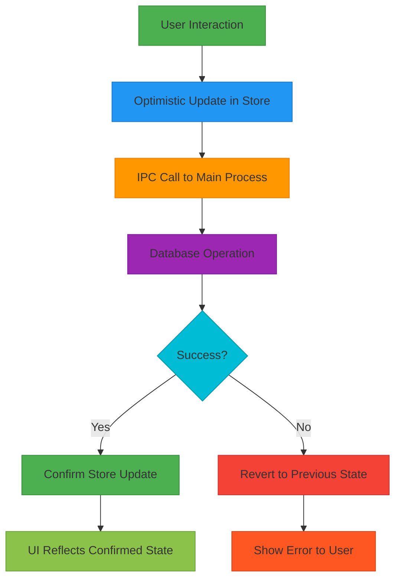
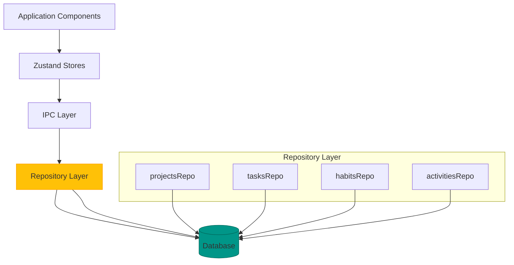
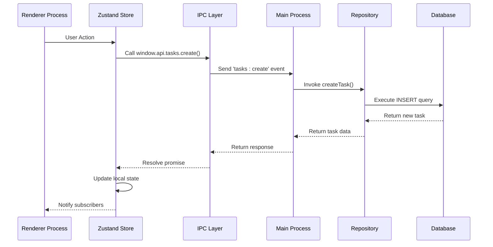
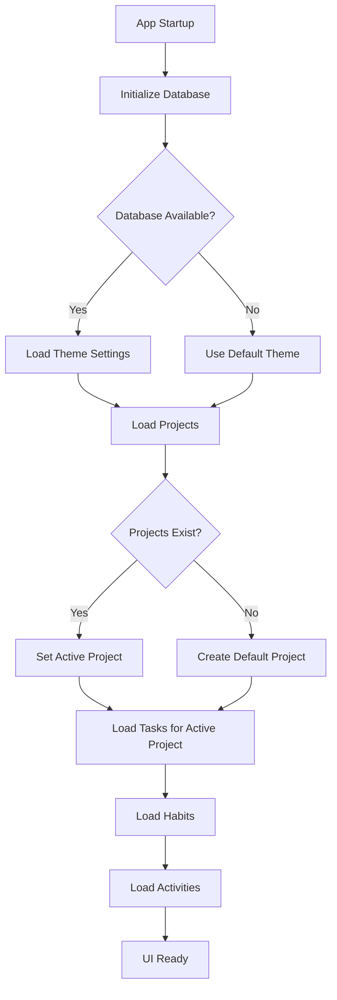

# State Management and Persistence Architecture

<cite>
**Referenced Files in This Document**   
- [STATE-MANAGEMENT.md](file://AI/STATE-MANAGEMENT.md)
- [tasks.ts](file://src/store/tasks.ts)
- [projects.ts](file://src/store/projects.ts)
- [habits.ts](file://src/store/habits.ts)
- [theme.ts](file://src/store/theme.ts)
- [activity.ts](file://src/store/activity.ts)
- [tasksRepo.ts](file://src/database/tasksRepo.ts)
- [projectsRepo.ts](file://src/database/projectsRepo.ts)
- [habitsRepo.ts](file://src/database/habitsRepo.ts)
- [tasks.ts](file://src/main/ipc/tasks.ts)
- [projects.ts](file://src/main/ipc/projects.ts)
- [habits.ts](file://src/main/ipc/habits.ts)
- [init.ts](file://src/database/init.ts)
- [types.ts](file://src/common/types.ts)
- [App.tsx](file://src/renderer/App.tsx)
</cite>

## Table of Contents
1. [Introduction](#introduction)
2. [State Management Strategy](#state-management-strategy)
3. [Store Architecture](#store-architecture)
4. [Persistence Layer](#persistence-layer)
5. [IPC Integration and Data Flow](#ipc-integration-and-data-flow)
6. [State Initialization and Synchronization](#state-initialization-and-synchronization)
7. [Performance Optimizations](#performance-optimizations)
8. [Data Integrity and Concurrency](#data-integrity-and-concurrency)
9. [Conclusion](#conclusion)

## Introduction

LifeOS implements a sophisticated state management architecture that combines client-side Zustand stores with persistent database storage to create a responsive and reliable user experience. This document details the system's approach to managing both transient UI state and persistent domain data, explaining how state changes trigger IPC or API calls and how responses update both local stores and database records. The architecture is designed to provide immediate UI feedback through optimistic updates while ensuring data consistency through proper synchronization with the persistent storage layer.

The system follows a clear separation between ephemeral UI state (such as theme preferences and UI controls) and persistent domain data (including tasks, habits, and projects). This separation allows for efficient state management while maintaining data integrity across application restarts and potential failures.

**Section sources**
- [STATE-MANAGEMENT.md](file://AI/STATE-MANAGEMENT.md#L1-L32)

## State Management Strategy

LifeOS employs Zustand as its primary state management library due to its simplicity, performance characteristics, and modular architecture. The state management strategy follows several key principles:

1. **Single source of truth per domain**: Each domain (tasks, projects, habits, etc.) has its own dedicated store, ensuring clear separation of concerns and preventing state duplication.

2. **Optimistic updates**: The system implements optimistic updates for UI responsiveness, immediately reflecting changes in the local store before confirming persistence. This creates a seamless user experience while the system handles the asynchronous persistence operations.

3. **Clear state categorization**: The architecture distinguishes between transient UI state and persistent domain data, applying different management strategies to each category.

4. **Derived data through selectors**: Computed values and filtered views are created through selectors, ensuring consistent data presentation across the application.

The state management approach prioritizes user experience by providing immediate feedback to interactions while maintaining data integrity through proper error handling and reconciliation mechanisms.



**Diagram sources**
- [STATE-MANAGEMENT.md](file://AI/STATE-MANAGEMENT.md#L1-L32)
- [tasks.ts](file://src/store/tasks.ts#L1-L133)

## Store Architecture

The state management system in LifeOS is organized into domain-specific store slices, each responsible for managing a particular aspect of the application state. This modular approach enables focused development and testing while maintaining clear boundaries between different functional areas.

### Domain Store Slices

The application implements several specialized store slices:

- **Tasks Store**: Manages tasks organized by project, including CRUD operations, filtering, and sorting
- **Projects Store**: Handles project management, active project selection, and project ordering
- **Habits Store**: Manages habit tracking, streak calculations, and completion logging
- **Theme Store**: Controls UI theme preferences (light/dark mode)
- **Activity Store**: Tracks user activities and system events

Each store slice follows a consistent pattern of state definition, action implementation, and selector creation, promoting code reuse and maintainability.

### State Structure and Relationships

The store architecture establishes clear relationships between different domain stores. For example, the tasks store depends on the projects store to determine which tasks to load based on the active project:

```mermaid
classDiagram
class ProjectsState {
+projects : Project[]
+activeProjectId? : number
+loading : boolean
+error? : string
+loadProjects() : Promise~void~
+setActiveProject(id : number) : Promise~void~
+createProject(name : string) : Promise~void~
}
class TasksState {
+tasksByProject : Record~number, Task[]~
+loading : Record~number, boolean~
+error? : string
+loadTasks(projectId : number) : Promise~void~
+createTask(payload : CreateTaskInput) : Promise~void~
+updateTask(id : number, payload : UpdateTaskPayload) : Promise~void~
+moveTask(args : MoveTaskArgs) : Promise~void~
}
class HabitsState {
+habits : HabitWithStats[]
+selectedHabitId? : number
+habitLogs : Map~number, HabitLog[]~
+loading : boolean
+error? : string
+loadHabits() : Promise~void~
+createHabit(input : HabitInput) : Promise~void~
+updateHabit(id : number, payload : Partial~Habit~) : Promise~void~
+logHabit(habitId : number, loggedDate : string, count? : number, note? : string) : Promise~void~
}
class ThemeState {
+theme : 'light' | 'dark'
+isLoaded : boolean
+loadTheme() : Promise~void~
+setTheme(theme : Theme) : Promise~void~
+toggleTheme() : Promise~void~
}
ProjectsState --> TasksState : "triggers load"
ProjectsState --> HabitsState : "context"
ThemeState --> "UI Components" : "applies styling"
TasksState --> ActivityStore : "logs actions"
HabitsState --> ActivityStore : "logs actions"
```

**Diagram sources**
- [projects.ts](file://src/store/projects.ts#L1-L87)
- [tasks.ts](file://src/store/tasks.ts#L1-L133)
- [habits.ts](file://src/store/habits.ts#L1-L161)
- [theme.ts](file://src/store/theme.ts#L1-L89)

**Section sources**
- [projects.ts](file://src/store/projects.ts#L1-L87)
- [tasks.ts](file://src/store/tasks.ts#L1-L133)
- [habits.ts](file://src/store/habits.ts#L1-L161)
- [theme.ts](file://src/store/theme.ts#L1-L89)

## Persistence Layer

The persistence architecture in LifeOS is built around a SQLite database, providing reliable local storage for all domain data. The system implements a clear separation between the database layer and the application state, with well-defined interfaces for data access and manipulation.

### Database Schema and Structure

The database schema is designed to support the application's domain model, with tables for projects, tasks, habits, and other entities. Key aspects of the schema include:

- **Projects table**: Stores project metadata including name, color, icon, and position
- **Tasks table**: Contains task details with foreign key references to projects
- **Habits table**: Manages habit definitions and tracking data
- **Activities table**: Records user actions and system events for auditing and analytics

The schema includes appropriate indexes to optimize common query patterns, such as retrieving tasks by project or filtering habits by category.

### Repository Pattern Implementation

The database interactions follow the repository pattern, with dedicated repository modules for each domain:



Each repository module encapsulates the database operations for its domain, providing a clean API that abstracts the underlying SQL implementation. This approach enables easier testing and potential database migration in the future.

**Diagram sources**
- [init.ts](file://src/database/init.ts#L1-L150)
- [projectsRepo.ts](file://src/database/projectsRepo.ts#L1-L148)
- [tasksRepo.ts](file://src/database/tasksRepo.ts#L1-L211)
- [habitsRepo.ts](file://src/database/habitsRepo.ts#L1-L395)

**Section sources**
- [init.ts](file://src/database/init.ts#L1-L150)
- [projectsRepo.ts](file://src/database/projectsRepo.ts#L1-L148)
- [tasksRepo.ts](file://src/database/tasksRepo.ts#L1-L211)
- [habitsRepo.ts](file://src/database/habitsRepo.ts#L1-L395)

## IPC Integration and Data Flow

The communication between the renderer process (UI) and the main process (database) is handled through Electron's IPC mechanism, with a well-defined flow for data operations.

### IPC Handler Architecture

The IPC system follows a consistent pattern across all domains, with handlers registered in the main process that bridge the gap between the renderer and the database:



### Request-Response Pattern

The IPC integration uses a request-response pattern with proper error handling:

1. The renderer process calls an IPC method through the `window.api` interface
2. The main process receives the request and invokes the appropriate repository method
3. The repository performs the database operation and returns the result
4. The main process sends the response back to the renderer
5. The Zustand store updates its state based on the response

This pattern ensures that all data modifications go through a controlled pathway, allowing for proper validation, error handling, and state synchronization.

**Diagram sources**
- [tasks.ts](file://src/main/ipc/tasks.ts#L1-L37)
- [projects.ts](file://src/main/ipc/projects.ts#L1-L84)
- [habits.ts](file://src/main/ipc/habits.ts#L1-L101)
- [tasks.ts](file://src/store/tasks.ts#L1-L133)

**Section sources**
- [tasks.ts](file://src/main/ipc/tasks.ts#L1-L37)
- [projects.ts](file://src/main/ipc/projects.ts#L1-L84)
- [habits.ts](file://src/main/ipc/habits.ts#L1-L101)

## State Initialization and Synchronization

The application implements a robust state initialization process that ensures consistency between the local stores and the persistent database.

### Application Startup Sequence

When the application starts, it follows a specific initialization sequence:

1. Initialize the database connection
2. Load persistent state (theme, settings) into local stores
3. Load domain data (projects, tasks, habits) from the database
4. Establish active context (e.g., active project)

The initialization process handles potential failures gracefully, allowing the application to function in a limited capacity if the database is unavailable.

### Cross-Store Synchronization

The system implements several synchronization patterns between stores:

- **Projects and Tasks**: When the active project changes, the tasks store automatically loads the tasks for the new active project
- **Activity Logging**: Domain actions (creating tasks, updating habits) trigger activity log entries in the activity store
- **State Dependencies**: Stores can depend on the state of other stores through selector subscriptions

This synchronization ensures that related state remains consistent across the application, providing a cohesive user experience.



**Diagram sources**
- [index.ts](file://src/main/index.ts#L1-L123)
- [App.tsx](file://src/renderer/App.tsx#L1-L176)
- [projects.ts](file://src/store/projects.ts#L1-L87)
- [tasks.ts](file://src/store/tasks.ts#L1-L133)

**Section sources**
- [index.ts](file://src/main/index.ts#L1-L123)
- [App.tsx](file://src/renderer/App.tsx#L1-L176)

## Performance Optimizations

The state management system incorporates several performance optimizations to ensure a responsive user experience.

### Partial State Updates

The stores are designed to minimize unnecessary re-renders through selective state updates:

- **Scoped Updates**: The tasks store maintains tasks by project, allowing updates to affect only the relevant project's tasks
- **Loading State Granularity**: Loading states are tracked per project, enabling fine-grained loading indicators
- **Error Isolation**: Errors are scoped to specific operations, preventing global state corruption

### Efficient Data Retrieval

The system optimizes data retrieval through several mechanisms:

- **Indexed Database Queries**: Database indexes are created for common query patterns
- **Batch Operations**: Related operations are grouped to minimize IPC round trips
- **Caching Strategies**: Frequently accessed data is cached in memory to reduce database queries

### Memory Management

The architecture includes considerations for memory efficiency:

- **Map for Habit Logs**: The habits store uses a Map to efficiently store logs by habit ID
- **Selective State Exposure**: Custom hooks (e.g., `useTasks`) expose only the necessary state to components
- **Cleanup on Unmount**: Stores are designed to handle component unmounting gracefully

These optimizations ensure that the application remains responsive even with large datasets.

**Section sources**
- [tasks.ts](file://src/store/tasks.ts#L1-L133)
- [habits.ts](file://src/store/habits.ts#L1-L161)
- [init.ts](file://src/database/init.ts#L1-L150)

## Data Integrity and Concurrency

The system implements several strategies to ensure data integrity and handle potential concurrency issues.

### Transaction Management

Database operations use transactions to ensure atomicity:

- **Single Operations**: Individual create, update, and delete operations are wrapped in transactions
- **Batch Operations**: Related operations (e.g., deleting a project and its tasks) use explicit transactions
- **Error Recovery**: Failed transactions are rolled back, maintaining database consistency

### Conflict Resolution

The architecture handles potential conflicts through:

- **Optimistic Locking**: The system assumes conflicts are rare and resolves them when they occur
- **Reconciliation**: Failed operations trigger state reconciliation to restore consistency
- **User Feedback**: Clear error messages inform users of issues and potential solutions

### Data Validation

The system implements validation at multiple levels:

- **Schema Validation**: Zod schemas validate input data before database operations
- **Business Logic Validation**: Repository methods enforce domain rules
- **UI Validation**: Stores provide immediate feedback on invalid operations

These mechanisms work together to maintain data integrity while providing a smooth user experience.

**Section sources**
- [tasksRepo.ts](file://src/database/tasksRepo.ts#L1-L211)
- [projectsRepo.ts](file://src/database/projectsRepo.ts#L1-L148)
- [habitsRepo.ts](file://src/database/habitsRepo.ts#L1-L395)
- [types.ts](file://src/common/types.ts#L1-L117)

## Conclusion

LifeOS implements a comprehensive state management and persistence architecture that effectively balances responsiveness with data integrity. By combining client-side Zustand stores with persistent database storage, the system provides immediate user feedback while ensuring data consistency across application restarts.

The architecture follows several key principles:
- Clear separation between transient UI state and persistent domain data
- Optimistic updates for improved user experience
- Domain-specific store slices with well-defined responsibilities
- Robust IPC integration for secure main-renderer communication
- Comprehensive error handling and data validation

The system's design enables efficient development and maintenance while providing a responsive and reliable user experience. Future enhancements could include more sophisticated conflict resolution for collaborative scenarios, enhanced offline capabilities, and improved data synchronization across devices.

The current implementation successfully addresses the core requirements of state management in a desktop application, providing a solid foundation for further development and feature expansion.