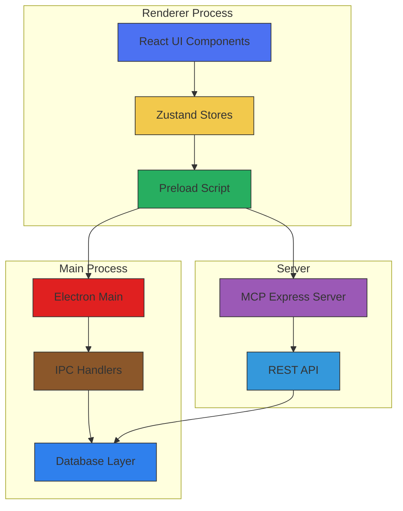
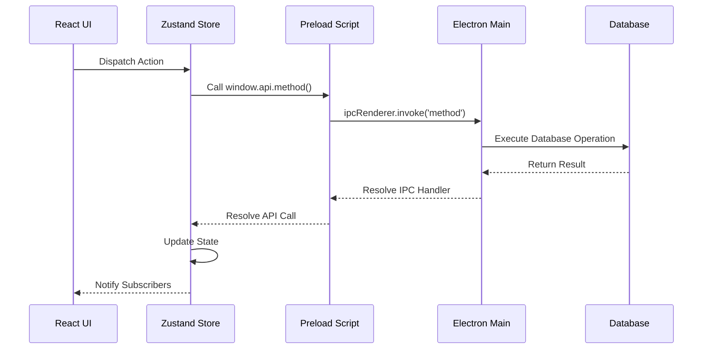
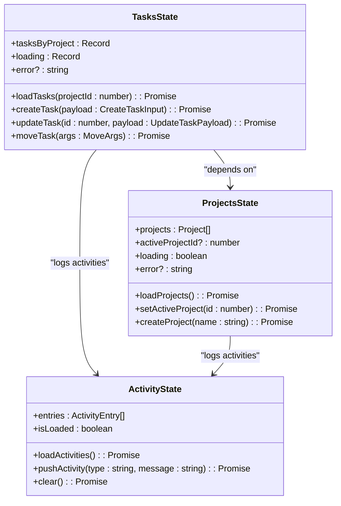
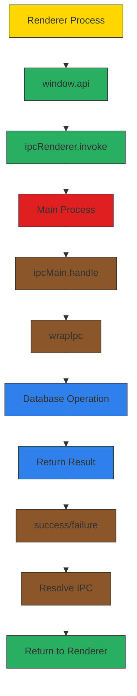
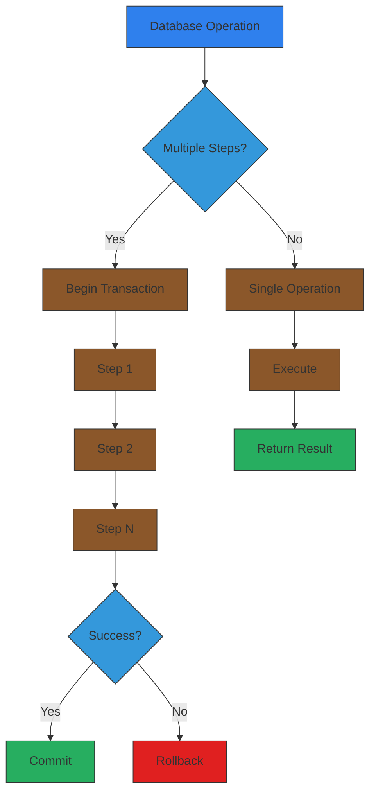
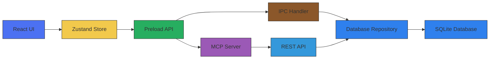

# State Synchronization Between UI and Database

<cite>
**Referenced Files in This Document**   
- [index.ts](file://src/preload/index.ts)
- [database.ts](file://src/main/ipc/database.ts)
- [tasks.ts](file://src/store/tasks.ts)
- [projects.ts](file://src/store/projects.ts)
- [init.ts](file://src/database/init.ts)
- [projects.ts](file://src/main/ipc/projects.ts)
- [tasks.ts](file://src/main/ipc/tasks.ts)
- [projectsRepo.ts](file://src/database/projectsRepo.ts)
- [tasksRepo.ts](file://src/database/tasksRepo.ts)
- [types.ts](file://src/common/types.ts)
- [activity.ts](file://src/store/activity.ts)
- [response.ts](file://src/main/utils/response.ts)
- [Dashboard.tsx](file://src/renderer/pages/Dashboard.tsx)
- [STATE-MANAGEMENT.md](file://AI/STATE-MANAGEMENT.md)
- [DATABASE.md](file://AI/DATABASE.md)
</cite>

## Table of Contents
1. [Introduction](#introduction)
2. [Project Structure](#project-structure)
3. [Core Components](#core-components)
4. [Architecture Overview](#architecture-overview)
5. [Detailed Component Analysis](#detailed-component-analysis)
6. [Dependency Analysis](#dependency-analysis)
7. [Performance Considerations](#performance-considerations)
8. [Troubleshooting Guide](#troubleshooting-guide)
9. [Conclusion](#conclusion)

## Introduction
This document provides comprehensive documentation for the state synchronization mechanism in the LifeOS application, which ensures consistency between client-side Zustand stores and the persistent SQLite database. The system enables seamless data flow from user interactions in the React UI through Electron's IPC mechanism to database operations, with proper error handling and state reconciliation. The architecture supports both direct database access via IPC and REST API communication through the MCP Express server, maintaining consistent payload structures across both channels.

## Project Structure

**Diagram sources**
- [index.ts](file://src/preload/index.ts)
- [init.ts](file://src/database/init.ts)
- [projects.ts](file://src/main/ipc/projects.ts)

**Section sources**
- [index.ts](file://src/preload/index.ts)
- [init.ts](file://src/database/init.ts)

## Core Components

The state synchronization system consists of several core components that work together to maintain data consistency across the application. The Zustand stores in the renderer process maintain the client-side state, while the IPC layer bridges the gap between the renderer and main processes. The database layer handles persistence with proper transaction management, and the preload script exposes a secure API surface to the renderer.

**Section sources**
- [tasks.ts](file://src/store/tasks.ts)
- [projects.ts](file://src/store/projects.ts)
- [database.ts](file://src/main/ipc/database.ts)

## Architecture Overview

**Diagram sources**
- [index.ts](file://src/preload/index.ts)
- [tasks.ts](file://src/store/tasks.ts)
- [projects.ts](file://src/main/ipc/projects.ts)

## Detailed Component Analysis

### State Management with Zustand

The application uses Zustand for state management, providing a lightweight and efficient solution for managing client-side state. Each store encapsulates related functionality and maintains its own state, with proper error handling and loading states.

**Diagram sources**
- [tasks.ts](file://src/store/tasks.ts)
- [projects.ts](file://src/store/projects.ts)
- [activity.ts](file://src/store/activity.ts)

**Section sources**
- [tasks.ts](file://src/store/tasks.ts)
- [projects.ts](file://src/store/projects.ts)

### IPC Communication Layer

The IPC (Inter-Process Communication) layer serves as the bridge between the renderer and main processes in the Electron application. The preload script exposes a secure API surface using contextBridge, while the main process handles IPC events with proper error wrapping.

**Diagram sources**
- [index.ts](file://src/preload/index.ts)
- [response.ts](file://src/main/utils/response.ts)
- [projects.ts](file://src/main/ipc/projects.ts)

**Section sources**
- [index.ts](file://src/preload/index.ts)
- [response.ts](file://src/main/utils/response.ts)

### Database Operations and Transactions

The database layer implements proper transaction management to ensure data consistency during multi-step operations. All database operations are wrapped in transactions where appropriate, and foreign key constraints are enforced.

**Diagram sources**
- [database.ts](file://src/main/ipc/database.ts)
- [projectsRepo.ts](file://src/database/projectsRepo.ts)
- [tasksRepo.ts](file://src/database/tasksRepo.ts)

**Section sources**
- [database.ts](file://src/main/ipc/database.ts)
- [projectsRepo.ts](file://src/database/projectsRepo.ts)

## Dependency Analysis

**Diagram sources**
- [index.ts](file://src/preload/index.ts)
- [projects.ts](file://src/main/ipc/projects.ts)
- [projectsRepo.ts](file://src/database/projectsRepo.ts)

**Section sources**
- [index.ts](file://src/preload/index.ts)
- [projects.ts](file://src/main/ipc/projects.ts)

## Performance Considerations

The state synchronization mechanism includes several performance optimizations:

1. **Optimistic Updates**: The UI updates immediately upon user action, enhancing perceived performance
2. **Batched Operations**: Related operations are grouped to minimize IPC calls
3. **Indexing**: Database tables are properly indexed for common query patterns
4. **Caching**: Frequently accessed data is cached in Zustand stores
5. **Error Resilience**: Graceful degradation when database is unavailable

The system also implements proper loading states and error boundaries to maintain a responsive user interface even during data operations.

## Troubleshooting Guide

Common issues and their solutions:

1. **Database not initialized**: Ensure the database is properly initialized in the main process
2. **IPC timeout**: Check for long-running database operations that may exceed timeout thresholds
3. **State desynchronization**: Verify that all database mutations trigger corresponding store updates
4. **Transaction failures**: Ensure proper error handling in transactional code
5. **Race conditions**: Implement proper locking or queuing for concurrent operations

The `wrapIpc` utility provides consistent error handling and graceful degradation when the database is unavailable, helping to prevent application crashes during data operations.

**Section sources**
- [response.ts](file://src/main/utils/response.ts)
- [DATABASE.md](file://AI/DATABASE.md)

## Conclusion

The state synchronization mechanism in LifeOS provides a robust and efficient solution for maintaining consistency between the client-side UI and persistent storage. By leveraging Zustand for state management, Electron's IPC for process communication, and SQLite for data persistence, the system achieves a balance of performance, reliability, and maintainability. The architecture supports both optimistic updates for enhanced user experience and proper error handling for data integrity. Future enhancements could include undo/redo functionality and more sophisticated conflict resolution for concurrent modifications.