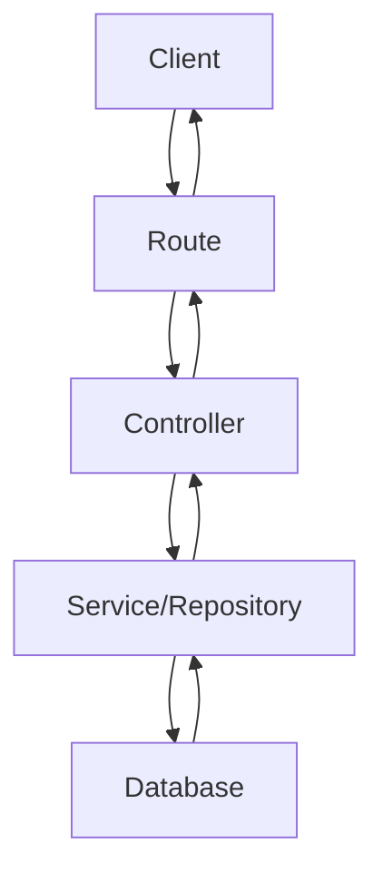
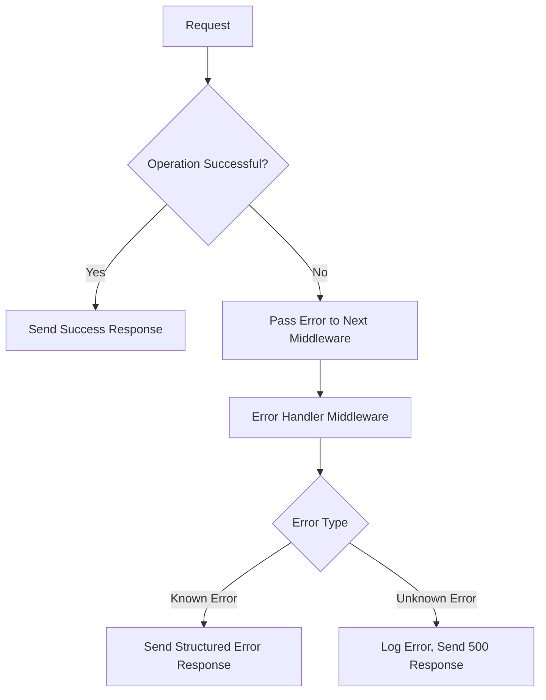
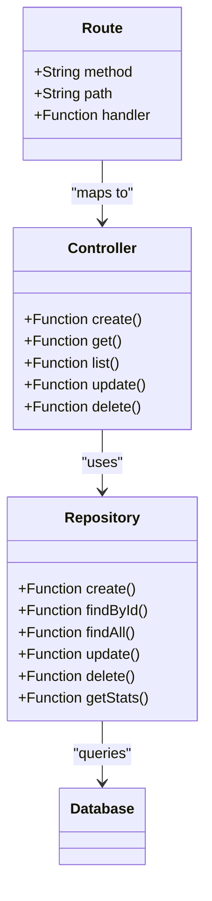

# API Reference

<cite>
**Referenced Files in This Document**   
- [tasks.ts](file://src/server/routes/tasks.ts)
- [projects.ts](file://src/server/routes/projects.ts)
- [habits.ts](file://src/server/routes/habits.ts)
- [notebooks.ts](file://src/server/routes/notebooks.ts)
- [notes.ts](file://src/server/routes/notes.ts)
- [qa.ts](file://src/server/routes/qa.ts)
- [activities.ts](file://src/server/routes/activities.ts)
- [settings.ts](file://src/server/routes/settings.ts)
- [status.ts](file://src/server/routes/status.ts)
- [tasksController.ts](file://src/server/controllers/tasksController.ts)
- [projectsController.ts](file://src/server/controllers/projectsController.ts)
- [habitsController.ts](file://src/server/controllers/habitsController.ts)
- [notebooksController.ts](file://src/server/controllers/notebooksController.ts)
- [notesController.ts](file://src/server/controllers/notesController.ts)
- [qaController.ts](file://src/server/controllers/qaController.ts)
- [activitiesController.ts](file://src/server/controllers/activitiesController.ts)
- [settingsController.ts](file://src/server/controllers/settingsController.ts)
- [statusController.ts](file://src/server/controllers/statusController.ts)
- [mcp.md](file://AI/mcp.md)
- [auth.ts](file://src/server/middleware/auth.ts)
- [errorHandler.ts](file://src/server/middleware/errorHandler.ts)
- [rateLimiter.ts](file://src/server/middleware/rateLimiter.ts)
</cite>

## Table of Contents
1. [Introduction](#introduction)
2. [API Overview](#api-overview)
3. [Authentication and Security](#authentication-and-security)
4. [Error Handling](#error-handling)
5. [Rate Limiting](#rate-limiting)
6. [Tasks Module](#tasks-module)
7. [Projects Module](#projects-module)
8. [Habits Module](#habits-module)
9. [Notebooks Module](#notebooks-module)
10. [Notes Module](#notes-module)
11. [Q&A Module](#qa-module)
12. [Activities Module](#activities-module)
13. [Settings Module](#settings-module)
14. [Global Status Module](#global-status-module)
15. [Architecture and Implementation](#architecture-and-implementation)
16. [Usage Examples](#usage-examples)
17. [Versioning and Compatibility](#versioning-and-compatibility)

## Introduction

The LifeOS MCP Server provides a comprehensive RESTful API that exposes all core functionality of the LifeOS application. This API enables seamless integration with AI models, external tools, and third-party applications. The endpoints follow a consistent pattern across modules, providing CRUD operations, status information, and specialized actions for each domain.

The API is designed to be intuitive, well-structured, and secure, with standardized response formats, comprehensive error handling, and appropriate authentication mechanisms. This documentation provides detailed information about each endpoint, including request/response schemas, authentication requirements, and practical usage examples.

## API Overview

The LifeOS MCP Server API is organized into multiple modules, each corresponding to a core feature of the application. All endpoints are accessible via HTTP methods and follow a consistent URL pattern: `/api/<module>/<action>`.

The API follows REST principles with resource-oriented URLs and appropriate HTTP methods:
- `GET` for retrieving resources
- `POST` for creating resources
- `PUT` for updating resources
- `DELETE` for removing resources

Each module provides standard CRUD operations along with module-specific actions and status endpoints that provide aggregated information.

**Base URL**: `http://localhost:3000/api/` (configurable via environment variables)

**Content Type**: All requests and responses use JSON format with `Content-Type: application/json`.

**Response Structure**: All successful responses follow a consistent format:
```json
{
  "data": { /* resource or operation result */}
}
```

**Status Codes**: The API uses standard HTTP status codes to indicate the result of operations.

**Section sources**
- [mcp.md](file://AI/mcp.md#L1-L617)
- [tasks.ts](file://src/server/routes/tasks.ts#L1-L26)
- [projects.ts](file://src/server/routes/projects.ts#L1-L29)

## Authentication and Security

The LifeOS MCP Server implements a flexible authentication system designed to balance security and ease of use.

### Authentication Methods

The API supports two authentication modes:

1. **Local Access (Default)**: The server binds to `localhost:3000` by default, restricting access to local applications. No API key is required in this mode.

2. **API Key Authentication**: When the `MCP_API_KEY` environment variable is set, the server requires API key authentication for all requests.

**Header**: `X-API-Key`
**Value**: The API key specified in the environment variable

```bash
curl -H "X-API-Key: your-api-key-here" http://localhost:3000/api/status
```

### Security Implementation

The authentication middleware is implemented in `src/server/middleware/auth.ts` and follows this logic:

```typescript
middleware.auth = (req, res, next) => {
  if (process.env.MCP_API_KEY) {
    const apiKey = req.headers['x-api-key'];
    if (apiKey !== process.env.MCP_API_KEY) {
      return res.status(401).json({ error: 'Unauthorized' });
    }
  }
  next();
};
```

### Security Configuration

Authentication and security settings are configured through environment variables:

| Environment Variable | Default Value | Description |
|----------------------|-------------|-------------|
| `MCP_SERVER_PORT` | 3000 | Port on which the MCP server listens |
| `MCP_SERVER_HOST` | localhost | Host interface to bind to |
| `MCP_API_KEY` | (not set) | Optional API key for authentication |
| `MCP_RATE_LIMIT` | 100 | Maximum requests per minute per IP |
| `DATABASE_PATH` | ./app.db | Path to the SQLite database |

### Security Considerations

The API implements several security measures:
- **Local-only binding** by default to prevent external access
- **Optional API key** for production deployments
- **CORS configuration** to control cross-origin requests
- **Rate limiting** to prevent abuse
- **Input validation** for all endpoints
- **SQL injection prevention** through parameterized queries
- **Comprehensive logging** of API access

**Section sources**
- [mcp.md](file://AI/mcp.md#L150-L180)
- [auth.ts](file://src/server/middleware/auth.ts#L1-L20)

## Error Handling

The LifeOS MCP Server implements a standardized error handling system that provides consistent and informative responses for all error conditions.

### Error Response Format

All error responses follow a standardized JSON format:

```json
{
  "error": {
    "code": "string",
    "message": "string",
    "details": {} // optional
  }
}
```

### Standard Error Codes

The API uses a comprehensive set of error codes to indicate specific failure conditions:

| Code | HTTP Status | Description |
|------|-----------|-------------|
| `VALIDATION_ERROR` | 400 | Request data failed validation |
| `NOT_FOUND` | 404 | Requested resource does not exist |
| `DATABASE_ERROR` | 500 | Database operation failed |
| `UNAUTHORIZED` | 401 | Authentication failed or required |
| `RATE_LIMIT_EXCEEDED` | 429 | Rate limit exceeded |
| `CONFLICT` | 409 | Operation conflicts with current state |

### Error Handling Implementation

The error handling middleware is implemented in `src/server/middleware/errorHandler.ts` and processes errors from controllers. Each controller wraps operations in try-catch blocks and passes errors to the next middleware:

```typescript
export async function getTask(req: Request, res: Response, next: NextFunction) {
  try {
    // operation logic
  } catch (error) {
    next(error);
  }
}
```

When a resource is not found, controllers return a 404 response with a structured error:

```typescript
return res.status(404).json({
  error: {
    code: 'NOT_FOUND',
    message: 'Task not found'
  }
});
```

### Common Error Scenarios

**Resource Not Found**: When attempting to access a non-existent resource:

```json
{
  "error": {
    "code": "NOT_FOUND",
    "message": "Task not found"
  }
}
```

**Validation Error**: When request data is invalid:

```json
{
  "error": {
    "code": "VALIDATION_ERROR",
    "message": "Search query is required"
  }
}
```

**Authentication Required**: When authentication is required but not provided:

```json
{
  "error": {
    "code": "UNAUTHORIZED",
    "message": "Unauthorized"
  }
}
```

**Section sources**
- [mcp.md](file://AI/mcp.md#L182-L200)
- [errorHandler.ts](file://src/server/middleware/errorHandler.ts#L1-L30)
- [tasksController.ts](file://src/server/controllers/tasksController.ts#L15-L30)

## Rate Limiting

The LifeOS MCP Server implements rate limiting to prevent abuse and ensure fair usage of the API.

### Rate Limiting Configuration

Rate limiting is configured through the `MCP_RATE_LIMIT` environment variable, which specifies the maximum number of requests allowed per minute per IP address. The default limit is 100 requests per minute.

### Implementation

The rate limiting middleware is implemented in `src/server/middleware/rateLimiter.ts` and uses a sliding window algorithm to track request counts. The middleware is applied to all routes to prevent excessive usage.

When the rate limit is exceeded, the server returns a 429 (Too Many Requests) status code with a structured error response:

```json
{
  "error": {
    "code": "RATE_LIMIT_EXCEEDED",
    "message": "Rate limit exceeded. Please try again later."
  }
}
```

### Rate Limit Headers

The API includes rate limit information in the response headers:

- `X-RateLimit-Limit`: The maximum number of requests allowed per minute
- `X-RateLimit-Remaining`: The number of requests remaining in the current window
- `X-RateLimit-Reset`: The time at which the rate limit will reset (Unix timestamp)

### Best Practices

To avoid hitting rate limits, clients should:

1. Implement exponential backoff for retry logic
2. Cache responses when appropriate
3. Batch operations when possible
4. Respect the rate limit headers
5. Use webhooks or polling with reasonable intervals for monitoring

**Section sources**
- [mcp.md](file://AI/mcp.md#L170-L175)
- [rateLimiter.ts](file://src/server/middleware/rateLimiter.ts#L1-L25)

## Tasks Module

The Tasks module provides endpoints for managing tasks within projects, including creation, retrieval, updating, and deletion operations.

### Endpoints

#### Create Task
- **Method**: POST
- **URL**: `/api/tasks/create`
- **Authentication**: Required
- **Request Body**:
```json
{
  "projectId": 1,
  "title": "Implement feature X",
  "description": "Complete implementation",
  "status": "To-Do",
  "priority": "High",
  "estimatedMinutes": 120
}
```
- **Response**: 201 Created with created task data
- **Section sources**: [tasks.ts](file://src/server/routes/tasks.ts#L5-L6), [tasksController.ts](file://src/server/controllers/tasksController.ts#L5-L13)

#### Get Task by ID
- **Method**: GET
- **URL**: `/api/tasks/:id`
- **Authentication**: Required
- **Response**: 200 OK with task data or 404 Not Found
- **Section sources**: [tasks.ts](file://src/server/routes/tasks.ts#L8-L9), [tasksController.ts](file://src/server/controllers/tasksController.ts#L15-L30)

#### List Tasks by Project
- **Method**: GET
- **URL**: `/api/tasks/project/:projectId`
- **Authentication**: Required
- **Response**: 200 OK with array of tasks
- **Section sources**: [tasks.ts](file://src/server/routes/tasks.ts#L11-L12), [tasksController.ts](file://src/server/controllers/tasksController.ts#L32-L40)

#### Update Task
- **Method**: PUT
- **URL**: `/api/tasks/:id`
- **Authentication**: Required
- **Request Body**: Partial task object
- **Response**: 200 OK with updated task data
- **Section sources**: [tasks.ts](file://src/server/routes/tasks.ts#L14-L15), [tasksController.ts](file://src/server/controllers/tasksController.ts#L42-L50)

#### Delete Task
- **Method**: DELETE
- **URL**: `/api/tasks/:id`
- **Authentication**: Required
- **Response**: 200 OK with success confirmation or 404 Not Found
- **Section sources**: [tasks.ts](file://src/server/routes/tasks.ts#L17-L18), [tasksController.ts](file://src/server/controllers/tasksController.ts#L52-L67)

#### Move Task
- **Method**: PUT
- **URL**: `/api/tasks/:id/move`
- **Authentication**: Required
- **Request Body**: 
```json
{
  "projectId": 2,
  "status": "In Progress"
}
```
- **Response**: 200 OK with updated task data
- **Section sources**: [tasks.ts](file://src/server/routes/tasks.ts#L20-L21), [tasksController.ts](file://src/server/controllers/tasksController.ts#L69-L77)

#### Get Tasks Status
- **Method**: GET
- **URL**: `/api/tasks/status`
- **Authentication**: Required
- **Response**: 200 OK with aggregated task statistics
```json
{
  "total": 25,
  "byStatus": {
    "backlog": 5,
    "todo": 10,
    "inProgress": 7,
    "completed": 3
  },
  "byPriority": {
    "critical": 2,
    "high": 8,
    "medium": 10,
    "low": 5
  },
  "avgEstimatedMinutes": 45,
  "avgActualMinutes": 52,
  "completionRate": 12
}
```
- **Section sources**: [tasks.ts](file://src/server/routes/tasks.ts#L23-L24), [tasksController.ts](file://src/server/controllers/tasksController.ts#L79-L139)

## Projects Module

The Projects module provides endpoints for managing projects, including creation, retrieval, updating, and organizational operations.

### Endpoints

#### Create Project
- **Method**: POST
- **URL**: `/api/projects/create`
- **Authentication**: Required
- **Request Body**:
```json
{
  "name": "Website Redesign",
  "description": "Complete redesign of company website"
}
```
- **Response**: 201 Created with created project data
- **Section sources**: [projects.ts](file://src/server/routes/projects.ts#L5-L6), [projectsController.ts](file://src/server/controllers/projectsController.ts#L5-L13)

#### Get Project by ID
- **Method**: GET
- **URL**: `/api/projects/:id`
- **Authentication**: Required
- **Response**: 200 OK with project data or 404 Not Found
- **Section sources**: [projects.ts](file://src/server/routes/projects.ts#L8-L9), [projectsController.ts](file://src/server/controllers/projectsController.ts#L15-L30)

#### List All Projects
- **Method**: GET
- **URL**: `/api/projects`
- **Authentication**: Required
- **Query Parameters**: 
  - `includeArchived=true` - Include archived projects
- **Response**: 200 OK with array of projects
- **Section sources**: [projects.ts](file://src/server/routes/projects.ts#L11-L12), [projectsController.ts](file://src/server/controllers/projectsController.ts#L32-L40)

#### Update Project
- **Method**: PUT
- **URL**: `/api/projects/:id`
- **Authentication**: Required
- **Request Body**: Partial project object
- **Response**: 200 OK with updated project data
- **Section sources**: [projects.ts](file://src/server/routes/projects.ts#L14-L15), [projectsController.ts](file://src/server/controllers/projectsController.ts#L42-L50)

#### Delete Project
- **Method**: DELETE
- **URL**: `/api/projects/:id`
- **Authentication**: Required
- **Response**: 200 OK with success confirmation
- **Section sources**: [projects.ts](file://src/server/routes/projects.ts#L17-L18), [projectsController.ts](file://src/server/controllers/projectsController.ts#L52-L60)

#### Reorder Projects
- **Method**: PUT
- **URL**: `/api/projects/reorder`
- **Authentication**: Required
- **Request Body**:
```json
{
  "order": [3, 1, 2, 4]
}
```
- **Response**: 200 OK with success confirmation
- **Section sources**: [projects.ts](file://src/server/routes/projects.ts#L20-L21), [projectsController.ts](file://src/server/controllers/projectsController.ts#L62-L70)

#### Set Active Project
- **Method**: PUT
- **URL**: `/api/projects/:id/set-active`
- **Authentication**: Required
- **Response**: 200 OK with active project ID
- **Section sources**: [projects.ts](file://src/server/routes/projects.ts#L23-L24), [projectsController.ts](file://src/server/controllers/projectsController.ts#L72-L80)

#### Get Projects Status
- **Method**: GET
- **URL**: `/api/projects/status`
- **Authentication**: Required
- **Response**: 200 OK with aggregated project statistics
```json
{
  "total": 4,
  "activeProjectId": 1,
  "projects": [
    {
      "id": 1,
      "name": "Website Redesign",
      "taskCount": 15,
      "completedCount": 3,
      "completionRate": 20,
      "totalEstimatedMinutes": 1200,
      "totalActualMinutes": 800
    }
  ]
}
```
- **Section sources**: [projects.ts](file://src/server/routes/projects.ts#L26-L27), [projectsController.ts](file://src/server/controllers/projectsController.ts#L82-L133)

## Habits Module

The Habits module provides endpoints for managing habits, tracking completions, and retrieving habit statistics.

### Endpoints

#### Create Habit
- **Method**: POST
- **URL**: `/api/habits/create`
- **Authentication**: Required
- **Request Body**:
```json
{
  "name": "Morning Exercise",
  "description": "30 minutes of exercise",
  "frequency": "daily",
  "targetCount": 1
}
```
- **Response**: 201 Created with created habit data
- **Section sources**: [habits.ts](file://src/server/routes/habits.ts#L5-L6), [habitsController.ts](file://src/server/controllers/habitsController.ts#L5-L13)

#### Get Habit by ID
- **Method**: GET
- **URL**: `/api/habits/:id`
- **Authentication**: Required
- **Response**: 200 OK with habit data or 404 Not Found
- **Section sources**: [habits.ts](file://src/server/routes/habits.ts#L8-L9), [habitsController.ts](file://src/server/controllers/habitsController.ts#L15-L30)

#### List All Habits
- **Method**: GET
- **URL**: `/api/habits`
- **Authentication**: Required
- **Query Parameters**:
  - `includeArchived=true` - Include archived habits
- **Response**: 200 OK with array of habits
- **Section sources**: [habits.ts](file://src/server/routes/habits.ts#L11-L12), [habitsController.ts](file://src/server/controllers/habitsController.ts#L32-L40)

#### Update Habit
- **Method**: PUT
- **URL**: `/api/habits/:id`
- **Authentication**: Required
- **Request Body**: Partial habit object
- **Response**: 200 OK with updated habit data
- **Section sources**: [habits.ts](file://src/server/routes/habits.ts#L14-L15), [habitsController.ts](file://src/server/controllers/habitsController.ts#L42-L50)

#### Delete Habit
- **Method**: DELETE
- **URL**: `/api/habits/:id`
- **Authentication**: Required
- **Response**: 200 OK with success confirmation
- **Section sources**: [habits.ts](file://src/server/routes/habits.ts#L17-L18), [habitsController.ts](file://src/server/controllers/habitsController.ts#L52-L60)

#### Log Habit Completion
- **Method**: POST
- **URL**: `/api/habits/:id/log`
- **Authentication**: Required
- **Request Body**:
```json
{
  "loggedDate": "2024-10-27",
  "count": 1,
  "note": "Completed successfully"
}
```
- **Response**: 201 Created with log entry
- **Section sources**: [habits.ts](file://src/server/routes/habits.ts#L20-L21), [habitsController.ts](file://src/server/controllers/habitsController.ts#L62-L70)

#### Unlog Habit
- **Method**: DELETE
- **URL**: `/api/habits/:id/log/:date`
- **Authentication**: Required
- **Response**: 200 OK with success confirmation
- **Section sources**: [habits.ts](file://src/server/routes/habits.ts#L23-L24), [habitsController.ts](file://src/server/controllers/habitsController.ts#L72-L80)

#### Get Habit Logs
- **Method**: GET
- **URL**: `/api/habits/:id/logs`
- **Authentication**: Required
- **Query Parameters**:
  - `limit=30` - Number of logs to return (default: 30)
- **Response**: 200 OK with array of log entries
- **Section sources**: [habits.ts](file://src/server/routes/habits.ts#L26-L27), [habitsController.ts](file://src/server/controllers/habitsController.ts#L82-L90)

#### Get Habits Status
- **Method**: GET
- **URL**: `/api/habits/status`
- **Authentication**: Required
- **Response**: 200 OK with aggregated habit statistics
```json
{
  "total": 8,
  "active": 6,
  "archived": 2,
  "completedToday": 3,
  "avgCompletionRate": 65.5,
  "bestStreak": 45,
  "habits": [
    {
      "id": 1,
      "name": "Morning Exercise",
      "frequency": "daily",
      "currentStreak": 23,
      "completionRate": 85.7,
      "todayCompleted": true
    }
  ]
}
```
- **Section sources**: [habits.ts](file://src/server/routes/habits.ts#L29-L30), [habitsController.ts](file://src/server/controllers/habitsController.ts#L92-L131)

## Notebooks Module

The Notebooks module provides endpoints for managing notebooks and their metadata.

### Endpoints

#### Create Notebook
- **Method**: POST
- **URL**: `/api/notebooks/create`
- **Authentication**: Required
- **Request Body**:
```json
{
  "title": "Project Notes",
  "description": "Notes for current project"
}
```
- **Response**: 201 Created with created notebook data
- **Section sources**: [notebooks.ts](file://src/server/routes/notebooks.ts#L5-L6), [notebooksController.ts](file://src/server/controllers/notebooksController.ts#L5-L13)

#### Get Notebook by ID
- **Method**: GET
- **URL**: `/api/notebooks/:id`
- **Authentication**: Required
- **Response**: 200 OK with notebook data or 404 Not Found
- **Section sources**: [notebooks.ts](file://src/server/routes/notebooks.ts#L8-L9), [notebooksController.ts](file://src/server/controllers/notebooksController.ts#L15-L30)

#### List All Notebooks
- **Method**: GET
- **URL**: `/api/notebooks`
- **Authentication**: Required
- **Response**: 200 OK with array of notebooks
- **Section sources**: [notebooks.ts](file://src/server/routes/notebooks.ts#L11-L12), [notebooksController.ts](file://src/server/controllers/notebooksController.ts#L32-L40)

#### Update Notebook
- **Method**: PUT
- **URL**: `/api/notebooks/:id`
- **Authentication**: Required
- **Request Body**: Partial notebook object
- **Response**: 200 OK with updated notebook data
- **Section sources**: [notebooks.ts](file://src/server/routes/notebooks.ts#L14-L15), [notebooksController.ts](file://src/server/controllers/notebooksController.ts#L42-L50)

#### Delete Notebook
- **Method**: DELETE
- **URL**: `/api/notebooks/:id`
- **Authentication**: Required
- **Response**: 200 OK with success confirmation
- **Section sources**: [notebooks.ts](file://src/server/routes/notebooks.ts#L17-L18), [notebooksController.ts](file://src/server/controllers/notebooksController.ts#L52-L60)

#### Get Notebooks Status
- **Method**: GET
- **URL**: `/api/notebooks/status`
- **Authentication**: Required
- **Response**: 200 OK with aggregated notebook statistics
```json
{
  "total": 5,
  "totalNotes": 42,
  "notebooks": [
    {
      "id": 1,
      "title": "Project Notes",
      "noteCount": 15,
      "lastUpdated": "2024-10-27T14:30:00Z"
    }
  ]
}
```
- **Section sources**: [notebooks.ts](file://src/server/routes/notebooks.ts#L20-L21), [notebooksController.ts](file://src/server/controllers/notebooksController.ts#L62-L88)

## Notes Module

The Notes module provides endpoints for managing individual notes within notebooks.

### Endpoints

#### Create Note
- **Method**: POST
- **URL**: `/api/notes/create`
- **Authentication**: Required
- **Request Body**:
```json
{
  "notebookId": 1,
  "title": "Meeting Notes",
  "content": "Discussed project timeline..."
}
```
- **Response**: 201 Created with created note data
- **Section sources**: [notes.ts](file://src/server/routes/notes.ts#L5-L6), [notesController.ts](file://src/server/controllers/notesController.ts#L5-L13)

#### Get Note by ID
- **Method**: GET
- **URL**: `/api/notes/:id`
- **Authentication**: Required
- **Response**: 200 OK with note data or 404 Not Found
- **Section sources**: [notes.ts](file://src/server/routes/notes.ts#L8-L9), [notesController.ts](file://src/server/controllers/notesController.ts#L15-L30)

#### List Notes in Notebook
- **Method**: GET
- **URL**: `/api/notes/notebook/:notebookId`
- **Authentication**: Required
- **Response**: 200 OK with array of notes
- **Section sources**: [notes.ts](file://src/server/routes/notes.ts#L11-L12), [notesController.ts](file://src/server/controllers/notesController.ts#L32-L40)

#### Update Note
- **Method**: PUT
- **URL**: `/api/notes/:id`
- **Authentication**: Required
- **Request Body**: Partial note object
- **Response**: 200 OK with updated note data
- **Section sources**: [notes.ts](file://src/server/routes/notes.ts#L14-L15), [notesController.ts](file://src/server/controllers/notesController.ts#L42-L50)

#### Delete Note
- **Method**: DELETE
- **URL**: `/api/notes/:id`
- **Authentication**: Required
- **Response**: 200 OK with success confirmation
- **Section sources**: [notes.ts](file://src/server/routes/notes.ts#L17-L18), [notesController.ts](file://src/server/controllers/notesController.ts#L52-L60)

#### Search Notes
- **Method**: GET
- **URL**: `/api/notes/search`
- **Authentication**: Required
- **Query Parameters**:
  - `q=search term` - Search query (required)
- **Response**: 200 OK with array of matching notes or 400 Bad Request if query is missing
- **Section sources**: [notes.ts](file://src/server/routes/notes.ts#L20-L21), [notesController.ts](file://src/server/controllers/notesController.ts#L62-L80)

#### Get Notes Status
- **Method**: GET
- **URL**: `/api/notes/status`
- **Authentication**: Required
- **Response**: 200 OK with aggregated note statistics
```json
{
  "total": 42,
  "byNotebook": [
    {
      "notebookId": 1,
      "count": 15
    }
  ],
  "totalContentLength": 15678,
  "avgNoteLength": 373
}
```
- **Section sources**: [notes.ts](file://src/server/routes/notes.ts#L23-L24), [notesController.ts](file://src/server/controllers/notesController.ts#L82-L119)

## Q&A Module

The Q&A module provides endpoints for managing question-answer collections, questions, and answers.

### Endpoints

#### Create Collection
- **Method**: POST
- **URL**: `/api/qa/collections/create`
- **Authentication**: Required
- **Request Body**:
```json
{
  "name": "Technical Interview Prep",
  "description": "Questions for technical interviews"
}
```
- **Response**: 201 Created with created collection data
- **Section sources**: [qa.ts](file://src/server/routes/qa.ts#L5-L6), [qaController.ts](file://src/server/controllers/qaController.ts#L5-L13)

#### Get Collection by ID
- **Method**: GET
- **URL**: `/api/qa/collections/:id`
- **Authentication**: Required
- **Response**: 200 OK with collection data
- **Section sources**: [qa.ts](file://src/server/routes/qa.ts#L7-L8), [qaController.ts](file://src/server/controllers/qaController.ts#L15-L23)

#### List All Collections
- **Method**: GET
- **URL**: `/api/qa/collections`
- **Authentication**: Required
- **Response**: 200 OK with array of collections
- **Section sources**: [qa.ts](file://src/server/routes/qa.ts#L9-L10), [qaController.ts](file://src/server/controllers/qaController.ts#L25-L33)

#### Update Collection
- **Method**: PUT
- **URL**: `/api/qa/collections/:id`
- **Authentication**: Required
- **Request Body**: Partial collection object
- **Response**: 200 OK with updated collection data
- **Section sources**: [qa.ts](file://src/server/routes/qa.ts#L11-L12), [qaController.ts](file://src/server/controllers/qaController.ts#L35-L43)

#### Delete Collection
- **Method**: DELETE
- **URL**: `/api/qa/collections/:id`
- **Authentication**: Required
- **Response**: 200 OK with success confirmation
- **Section sources**: [qa.ts](file://src/server/routes/qa.ts#L13-L14), [qaController.ts](file://src/server/controllers/qaController.ts#L45-L53)

#### Create Question
- **Method**: POST
- **URL**: `/api/qa/questions/create`
- **Authentication**: Required
- **Request Body**:
```json
{
  "collectionId": 1,
  "question": "What is React?",
  "difficulty": "Easy"
}
```
- **Response**: 201 Created with created question data
- **Section sources**: [qa.ts](file://src/server/routes/qa.ts#L16-L17), [qaController.ts](file://src/server/controllers/qaController.ts#L55-L63)

#### Get Question by ID
- **Method**: GET
- **URL**: `/api/qa/questions/:id`
- **Authentication**: Required
- **Response**: 200 OK with question data
- **Section sources**: [qa.ts](file://src/server/routes/qa.ts#L18-L19), [qaController.ts](file://src/server/controllers/qaController.ts#L65-L73)

#### List All Questions
- **Method**: GET
- **URL**: `/api/qa/questions`
- **Authentication**: Required
- **Response**: 200 OK with array of questions
- **Section sources**: [qa.ts](file://src/server/routes/qa.ts#L20-L21), [qaController.ts](file://src/server/controllers/qaController.ts#L75-L83)

#### Update Question
- **Method**: PUT
- **URL**: `/api/qa/questions/:id`
- **Authentication**: Required
- **Request Body**: Partial question object
- **Response**: 200 OK with updated question data
- **Section sources**: [qa.ts](file://src/server/routes/qa.ts#L22-L23), [qaController.ts](file://src/server/controllers/qaController.ts#L85-L93)

#### Delete Question
- **Method**: DELETE
- **URL**: `/api/qa/questions/:id`
- **Authentication**: Required
- **Response**: 200 OK with success confirmation
- **Section sources**: [qa.ts](file://src/server/routes/qa.ts#L24-L25), [qaController.ts](file://src/server/controllers/qaController.ts#L95-L103)

#### Create Answer
- **Method**: POST
- **URL**: `/api/qa/answers/create`
- **Authentication**: Required
- **Request Body**:
```json
{
  "questionId": 1,
  "answer": "React is a JavaScript library for building user interfaces.",
  "isCorrect": true
}
```
- **Response**: 201 Created with created answer data
- **Section sources**: [qa.ts](file://src/server/routes/qa.ts#L27-L28), [qaController.ts](file://src/server/controllers/qaController.ts#L105-L113)

#### Get Answers for Question
- **Method**: GET
- **URL**: `/api/qa/answers/:questionId`
- **Authentication**: Required
- **Response**: 200 OK with array of answers
- **Section sources**: [qa.ts](file://src/server/routes/qa.ts#L29-L30), [qaController.ts](file://src/server/controllers/qaController.ts#L115-L123)

#### Update Answer
- **Method**: PUT
- **URL**: `/api/qa/answers/:id`
- **Authentication**: Required
- **Request Body**: Partial answer object
- **Response**: 200 OK with updated answer data
- **Section sources**: [qa.ts](file://src/server/routes/qa.ts#L31-L32), [qaController.ts](file://src/server/controllers/qaController.ts#L125-L133)

#### Delete Answer
- **Method**: DELETE
- **URL**: `/api/qa/answers/:id`
- **Authentication**: Required
- **Response**: 200 OK with success confirmation
- **Section sources**: [qa.ts](file://src/server/routes/qa.ts#L33-L34), [qaController.ts](file://src/server/controllers/qaController.ts#L135-L143)

#### Get Q&A Status
- **Method**: GET
- **URL**: `/api/qa/status`
- **Authentication**: Required
- **Response**: 200 OK with aggregated Q&A statistics
```json
{
  "totalQuestions": 25,
  "totalAnswers": 89,
  "byStatus": {
    "unanswered": 3,
    "inProgress": 7,
    "answered": 15
  },
  "answerRate": 60,
  "collections": [
    {
      "name": "Technical Interview Prep",
      "questionCount": 15
    }
  ]
}
```
- **Section sources**: [qa.ts](file://src/server/routes/qa.ts#L36-L37), [qaController.ts](file://src/server/controllers/qaController.ts#L145-L153)

## Activities Module

The Activities module provides endpoints for retrieving activity data and statistics.

### Endpoints

#### Get All Activities
- **Method**: GET
- **URL**: `/api/activities`
- **Authentication**: Required
- **Response**: 200 OK with array of all activities
- **Section sources**: [activities.ts](file://src/server/routes/activities.ts#L5-L6), [activitiesController.ts](file://src/server/controllers/activitiesController.ts#L5-L13)

#### Get Activities by Date
- **Method**: GET
- **URL**: `/api/activities/date/:date`
- **Authentication**: Required
- **Path Parameter**: `date` in YYYY-MM-DD format
- **Response**: 200 OK with array of activities for the specified date
- **Section sources**: [activities.ts](file://src/server/routes/activities.ts#L8-L9), [activitiesController.ts](file://src/server/controllers/activitiesController.ts#L15-L23)

#### Get Activities by Type
- **Method**: GET
- **URL**: `/api/activities/type/:type`
- **Authentication**: Required
- **Path Parameter**: `type` (task, habit, note, qa)
- **Response**: 200 OK with array of activities of the specified type
- **Section sources**: [activities.ts](file://src/server/routes/activities.ts#L11-L12), [activitiesController.ts](file://src/server/controllers/activitiesController.ts#L25-L33)

#### Get Activities Status
- **Method**: GET
- **URL**: `/api/activities/status`
- **Authentication**: Required
- **Response**: 200 OK with aggregated activity statistics
```json
{
  "today": 12,
  "thisWeek": 89,
  "thisMonth": 345,
  "byType": {
    "task": 45,
    "habit": 23,
    "note": 15,
    "qa": 6
  },
  "streak": 7,
  "lastActivityAt": "2024-10-27T14:30:00Z",
  "heatmapData": [
    {
      "date": "2024-10-27",
      "count": 12
    }
  ]
}
```
- **Section sources**: [activities.ts](file://src/server/routes/activities.ts#L14-L15), [activitiesController.ts](file://src/server/controllers/activitiesController.ts#L35-L43)

## Settings Module

The Settings module provides endpoints for managing application settings and theme configuration.

### Endpoints

#### Get All Settings
- **Method**: GET
- **URL**: `/api/settings`
- **Authentication**: Required
- **Response**: 200 OK with all settings
- **Section sources**: [settings.ts](file://src/server/routes/settings.ts#L5-L6), [settingsController.ts](file://src/server/controllers/settingsController.ts#L5-L13)

#### Update Settings
- **Method**: PUT
- **URL**: `/api/settings`
- **Authentication**: Required
- **Request Body**: Object with settings to update
- **Response**: 200 OK with updated settings
- **Section sources**: [settings.ts](file://src/server/routes/settings.ts#L8-L9), [settingsController.ts](file://src/server/controllers/settingsController.ts#L15-L23)

#### Get Theme Settings
- **Method**: GET
- **URL**: `/api/settings/theme`
- **Authentication**: Required
- **Response**: 200 OK with theme settings
- **Section sources**: [settings.ts](file://src/server/routes/settings.ts#L11-L12), [settingsController.ts](file://src/server/controllers/settingsController.ts#L25-L33)

#### Update Theme Settings
- **Method**: PUT
- **URL**: `/api/settings/theme`
- **Authentication**: Required
- **Request Body**: Object with theme settings to update
- **Response**: 200 OK with updated theme settings
- **Section sources**: [settings.ts](file://src/server/routes/settings.ts#L14-L15), [settingsController.ts](file://src/server/controllers/settingsController.ts#L35-L43)

## Global Status Module

The Global Status module provides a comprehensive overview of the entire system state.

### Endpoint

#### Get Comprehensive System Status
- **Method**: GET
- **URL**: `/api/status`
- **Authentication**: Required
- **Response**: 200 OK with comprehensive system status
```json
{
  "timestamp": "2024-10-27T14:30:00Z",
  "uptime": 3600,
  "version": "1.0.0",
  "modules": {
    "tasks": {
      "total": 25,
      "byStatus": {
        "backlog": 5,
        "todo": 10,
        "inProgress": 7,
        "completed": 3
      },
      "completionRate": 12
    },
    "projects": {
      "total": 4,
      "active": 1,
      "status": {
        "total": 4,
        "activeProjectId": 1,
        "projects": [
          {
            "id": 1,
            "name": "Website Redesign",
            "taskCount": 15,
            "completedCount": 3,
            "completionRate": 20
          }
        ]
      }
    },
    "habits": {
      "total": 8,
      "active": 6,
      "completedToday": 3,
      "status": {
        "total": 8,
        "active": 6,
        "archived": 2,
        "completedToday": 3,
        "avgCompletionRate": 65.5,
        "bestStreak": 45
      }
    },
    "notebooks": {
      "total": 5,
      "notes": 42,
      "status": {
        "total": 5,
        "totalNotes": 42,
        "notebooks": [
          {
            "id": 1,
            "title": "Project Notes",
            "noteCount": 15,
            "lastUpdated": "2024-10-27T14:30:00Z"
          }
        ]
      }
    },
    "qa": {
      "questions": 25,
      "answers": 89,
      "status": {
        "totalQuestions": 25,
        "totalAnswers": 89,
        "byStatus": {
          "unanswered": 3,
          "inProgress": 7,
          "answered": 15
        },
        "answerRate": 60
      }
    },
    "activities": {
      "today": 12,
      "thisWeek": 89,
      "streak": 7,
      "status": {
        "today": 12,
        "thisWeek": 89,
        "thisMonth": 345,
        "byType": {
          "task": 45,
          "habit": 23,
          "note": 15,
          "qa": 6
        },
        "streak": 7
      }
    }
  },
  "database": {
    "size": 2048000,
    "lastBackup": "2024-10-26T23:00:00Z",
    "healthy": true
  }
}
```
- **Section sources**: [status.ts](file://src/server/routes/status.ts#L5-L6), [statusController.ts](file://src/server/controllers/statusController.ts#L5-L50)

## Architecture and Implementation

The LifeOS MCP Server follows a clean, modular architecture that separates concerns and promotes maintainability.

### Architecture Overview

The API follows a standard Express.js application structure with the following layers:

1. **Routes**: Define URL patterns and HTTP methods, mapping them to controller functions
2. **Controllers**: Handle HTTP requests, validate input, and coordinate operations
3. **Services/Repositories**: Contain business logic and data access operations
4. **Database**: SQLite database with direct access through better-sqlite3



**Diagram sources**
- [mcp.md](file://AI/mcp.md#L250-L280)
- [tasks.ts](file://src/server/routes/tasks.ts#L1-L26)
- [tasksController.ts](file://src/server/controllers/tasksController.ts#L1-L140)

### Request Flow

The typical request flow follows this pattern:

1. **Route Matching**: Express router matches the incoming request to a route
2. **Middleware Processing**: Authentication, logging, and rate limiting middleware execute
3. **Controller Execution**: Controller function processes the request
4. **Service/Repository Call**: Controller calls repository functions to perform operations
5. **Database Interaction**: Repository executes SQL queries against the database
6. **Response Construction**: Controller constructs response and sends it back

### Error Handling Flow

The error handling follows a centralized pattern:



**Diagram sources**
- [errorHandler.ts](file://src/server/middleware/errorHandler.ts#L1-L30)
- [tasksController.ts](file://src/server/controllers/tasksController.ts#L10-L13)

### Data Flow Relationships

The relationship between routes, controllers, and services is consistent across modules:



**Diagram sources**
- [mcp.md](file://AI/mcp.md#L250-L280)
- [tasks.ts](file://src/server/routes/tasks.ts#L1-L26)
- [tasksController.ts](file://src/server/controllers/tasksController.ts#L1-L140)
- [tasksRepo.ts](file://src/database/tasksRepo.ts#L1-L50)

## Usage Examples

This section provides practical examples of common operations using the LifeOS MCP Server API.

### Creating a Task

To create a new task in a project:

```bash
curl -X POST http://localhost:3000/api/tasks/create \
  -H "Content-Type: application/json" \
  -d '{
    "projectId": 1,
    "title": "Implement user authentication",
    "description": "Add login and registration functionality",
    "status": "To-Do",
    "priority": "High",
    "estimatedMinutes": 180
  }'
```

Expected response:
```json
{
  "data": {
    "id": 26,
    "projectId": 1,
    "title": "Implement user authentication",
    "description": "Add login and registration functionality",
    "status": "To-Do",
    "priority": "High",
    "estimatedMinutes": 180,
    "createdAt": "2024-10-27T14:30:00Z",
    "updatedAt": "2024-10-27T14:30:00Z"
  }
}
```

**Section sources**: [tasksController.ts](file://src/server/controllers/tasksController.ts#L5-L13)

### Logging a Habit Completion

To log completion of a daily habit:

```bash
curl -X POST http://localhost:3000/api/habits/1/log \
  -H "Content-Type: application/json" \
  -d '{
    "loggedDate": "2024-10-27",
    "count": 1,
    "note": "Completed morning exercise routine"
  }'
```

Expected response:
```json
{
  "data": {
    "id": 45,
    "habitId": 1,
    "loggedDate": "2024-10-27",
    "count": 1,
    "note": "Completed morning exercise routine",
    "createdAt": "2024-10-27T07:30:00Z"
  }
}
```

**Section sources**: [habitsController.ts](file://src/server/controllers/habitsController.ts#L62-L70)

### Retrieving System Status

To get a comprehensive overview of the system:

```bash
curl http://localhost:3000/api/status
```

Expected response:
```json
{
  "data": {
    "timestamp": "2024-10-27T14:30:00Z",
    "uptime": 3600,
    "version": "1.0.0",
    "modules": {
      "tasks": {
        "total": 25,
        "byStatus": {
          "backlog": 5,
          "todo": 10,
          "inProgress": 7,
          "completed": 3
        },
        "completionRate": 12
      },
      "projects": {
        "total": 4,
        "active": 1
      },
      "habits": {
        "total": 8,
        "active": 6,
        "completedToday": 3
      }
    }
  }
}
```

**Section sources**: [statusController.ts](file://src/server/controllers/statusController.ts#L5-L50)

### Searching Notes

To search for notes containing a specific term:

```bash
curl "http://localhost:3000/api/notes/search?q=meeting"
```

Expected response:
```json
{
  "data": [
    {
      "id": 12,
      "notebookId": 1,
      "title": "Team Meeting Notes",
      "content": "Discussed project timeline and milestones...",
      "createdAt": "2024-10-25T10:30:00Z",
      "updatedAt": "2024-10-25T10:30:00Z"
    }
  ]
}
```

**Section sources**: [notesController.ts](file://src/server/controllers/notesController.ts#L62-L80)

## Versioning and Compatibility

The LifeOS MCP Server API is designed with backward compatibility and future extensibility in mind.

### Current Version

The current API version is 1.0.0, following semantic versioning principles. The version is included in the global status response and can be used by clients to determine compatibility.

### Versioning Strategy

While the current implementation does not include versioned endpoints (e.g., `/api/v1/tasks`), the architecture supports future versioning through:

1. **URL-based versioning**: Adding version to the URL path
2. **Header-based versioning**: Using custom headers to specify version
3. **Query parameter versioning**: Including version in query parameters

### Backward Compatibility

The API maintains backward compatibility through:

1. **Non-breaking changes**: Adding new endpoints, fields, or optional parameters does not affect existing clients
2. **Deprecation policy**: Marking endpoints as deprecated before removal
3. **Error code consistency**: Maintaining consistent error codes across versions
4. **Response structure stability**: Preserving the overall response format

### Future Enhancements

The mcp.md document outlines several future enhancements that will be implemented with proper versioning:

- **WebSocket support** for real-time updates
- **GraphQL endpoint** as an alternative to REST
- **Batch operations** endpoint for efficiency
- **Advanced search and filtering** capabilities
- **API versioning strategy** for formal version management

When introducing breaking changes, the team will follow a standard procedure:
1. Announce deprecation of old endpoints
2. Maintain old endpoints for a transition period
3. Introduce new versioned endpoints
4. Provide migration guides
5. Eventually retire deprecated endpoints

**Section sources**: [mcp.md](file://AI/mcp.md#L380-L400)