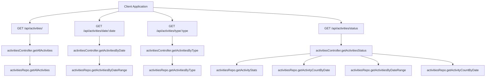
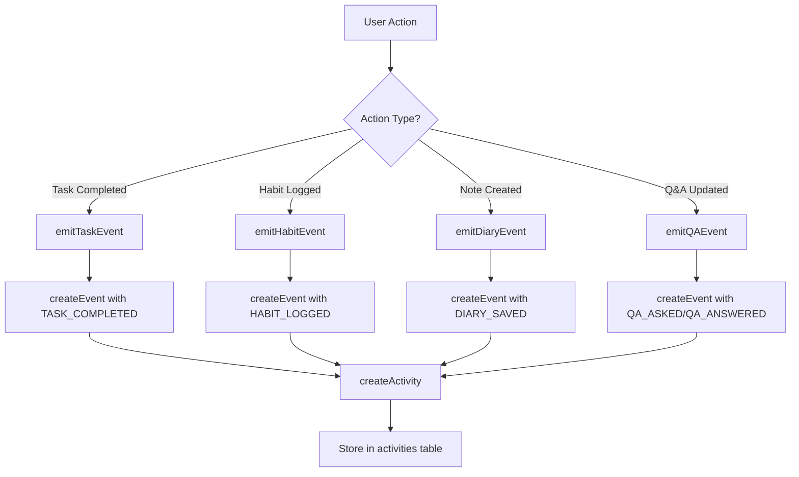
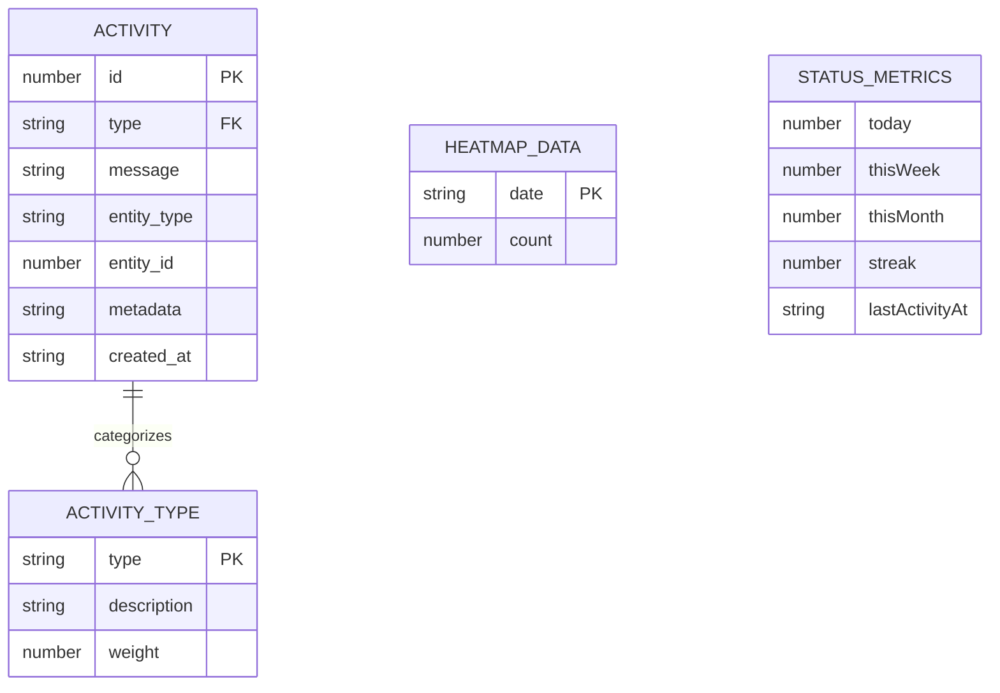
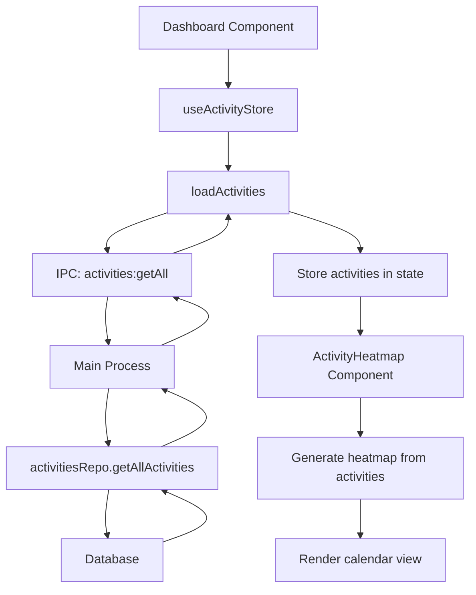
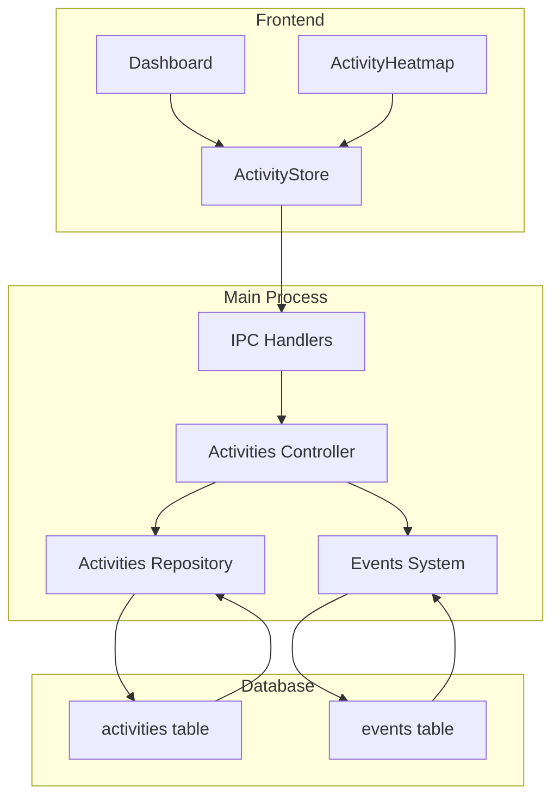

# Activities API

<cite>
**Referenced Files in This Document**   
- [activitiesController.ts](file://src/server/controllers/activitiesController.ts)
- [activities.ts](file://src/server/routes/activities.ts)
- [activitiesRepo.ts](file://src/database/activitiesRepo.ts)
- [eventsRepo.ts](file://src/database/eventsRepo.ts)
- [metricsSchema.ts](file://src/database/metricsSchema.ts)
- [ActivityHeatmap.tsx](file://src/renderer/components/ActivityHeatmap.tsx)
- [activity.ts](file://src/store/activity.ts)
- [statusController.ts](file://src/server/controllers/statusController.ts)
</cite>

## Table of Contents
1. [Introduction](#introduction)
2. [API Endpoints](#api-endpoints)
3. [Activity Generation](#activity-generation)
4. [Status Endpoint and Metrics](#status-endpoint-and-metrics)
5. [Response Formats](#response-formats)
6. [Frontend Integration](#frontend-integration)
7. [Usage Examples](#usage-examples)
8. [Architecture Overview](#architecture-overview)

## Introduction
The Activities API is a comprehensive system for tracking user engagement across all modules in the LifeOS application. It provides endpoints for retrieving user activities by various criteria, generating comprehensive status reports with metrics, and visualizing engagement patterns through heatmap data. The API automatically captures user interactions from tasks, habits, notes, and Q&A entries, creating a complete picture of user productivity and engagement.

The system is designed to support analytics, user motivation through streak tracking, and visualization of engagement patterns over time. Activities are automatically generated when users complete tasks, log habits, create notes, or update Q&A entries, ensuring comprehensive tracking without requiring explicit user actions.

## API Endpoints

The Activities API provides several endpoints for retrieving activities based on different criteria:

- **GET /api/activities/**: Retrieves all activities with an optional limit parameter
- **GET /api/activities/date/:date**: Retrieves activities for a specific date
- **GET /api/activities/type/:type**: Retrieves activities filtered by type with optional limit
- **GET /api/activities/status**: Retrieves comprehensive metrics including counts, streaks, and heatmap data

The API supports query parameters for limiting results and path parameters for filtering by date and type. All endpoints return JSON responses with a consistent structure containing a data property with the requested information.



**Diagram sources**
- [activities.ts](file://src/server/routes/activities.ts#L1-L16)
- [activitiesController.ts](file://src/server/controllers/activitiesController.ts#L1-L109)
- [activitiesRepo.ts](file://src/database/activitiesRepo.ts#L1-L139)

**Section sources**
- [activities.ts](file://src/server/routes/activities.ts#L1-L16)
- [activitiesController.ts](file://src/server/controllers/activitiesController.ts#L1-L109)

## Activity Generation

Activities are automatically generated when users interact with various modules in the application. The system captures events from task completions, habit logging, note creation, and Q&A updates, converting them into activity records that are stored in the database.

The activity generation process is triggered by user actions in different modules:
- When tasks are completed or progressed
- When habits are logged for the day
- When notes or diary entries are saved
- When Q&A entries are created or updated

These events are captured through the events system, which normalizes different user actions into standardized event types. The events are then used to create corresponding activity records with appropriate types and messages.



**Diagram sources**
- [eventsRepo.ts](file://src/database/eventsRepo.ts#L1-L135)
- [metricsSchema.ts](file://src/database/metricsSchema.ts#L1-L103)
- [activitiesRepo.ts](file://src/database/activitiesRepo.ts#L1-L139)

**Section sources**
- [eventsRepo.ts](file://src/database/eventsRepo.ts#L1-L135)
- [metricsSchema.ts](file://src/database/metricsSchema.ts#L1-L103)

## Status Endpoint and Metrics

The status endpoint provides comprehensive metrics about user engagement, including daily, weekly, and monthly activity counts, activity streaks, and heatmap data for visualization. This endpoint is essential for displaying user progress and engagement patterns in the application's dashboard.

Key metrics provided by the status endpoint include:
- **Today's count**: Number of activities completed today
- **This week's count**: Number of activities completed this week
- **This month's count**: Number of activities completed this month
- **Streak**: Current consecutive days with at least one activity
- **Last activity timestamp**: When the most recent activity occurred
- **Heatmap data**: Daily activity counts for the last 90 days for visualization

The streak calculation works by counting backward from the current date, incrementing the streak counter for each consecutive day that has at least one activity, and stopping when it encounters a day with no activities.

```mermaid
classDiagram
class ActivityStatus {
+today : number
+thisWeek : number
+thisMonth : number
+byType : Record~string, number~
+streak : number
+lastActivityAt : string | null
+heatmapData : {date : string, count : number}[]
}
class HeatmapDataPoint {
+date : string
+count : number
}
class ActivityStats {
+total : number
+byType : Record~string, number~
+last7Days : number
+last30Days : number
}
ActivityStatus "1" --> "90" HeatmapDataPoint
ActivityStatus --> ActivityStats
```

**Diagram sources**
- [activitiesController.ts](file://src/server/controllers/activitiesController.ts#L50-L109)
- [activitiesRepo.ts](file://src/database/activitiesRepo.ts#L1-L139)

**Section sources**
- [activitiesController.ts](file://src/server/controllers/activitiesController.ts#L50-L109)

## Response Formats

The Activities API returns responses in a consistent JSON format with a top-level data property containing the requested information. Different endpoints return different structures based on the requested data.

For individual activities, the response includes:
- **id**: Unique identifier for the activity
- **type**: Category of the activity (e.g., "task", "habit", "note")
- **message**: Description of the activity
- **entity_type**: Type of entity associated with the activity
- **entity_id**: ID of the entity associated with the activity
- **metadata**: Additional data about the activity in JSON format
- **created_at**: Timestamp when the activity was created

The status endpoint returns a more complex structure with multiple metrics and the heatmap data array. The heatmap data consists of objects with date and count properties, representing the number of activities on each day for the last 90 days.



**Diagram sources**
- [activitiesRepo.ts](file://src/database/activitiesRepo.ts#L1-L139)
- [activitiesController.ts](file://src/server/controllers/activitiesController.ts#L50-L109)

**Section sources**
- [activitiesRepo.ts](file://src/database/activitiesRepo.ts#L1-L139)
- [activitiesController.ts](file://src/server/controllers/activitiesController.ts#L50-L109)

## Frontend Integration

The Activities API is integrated into the frontend through the activity store and IPC handlers, enabling seamless communication between the UI components and the backend services. The ActivityHeatmap component uses the API data to visualize user engagement patterns over time.

The frontend architecture includes:
- **Activity store**: Zustand store for managing activity state
- **IPC handlers**: Electron IPC handlers for communicating with the main process
- **ActivityHeatmap component**: React component for visualizing activity patterns
- **Dashboard integration**: Display of activity metrics in the main dashboard

The ActivityHeatmap component processes the activity data to create a calendar view of user engagement, with color intensity representing the number of activities on each day. The component supports tooltips that display detailed information when users hover over specific days.



**Diagram sources**
- [ActivityHeatmap.tsx](file://src/renderer/components/ActivityHeatmap.tsx#L1-L265)
- [activity.ts](file://src/store/activity.ts#L1-L68)
- [activities.ts](file://src/main/ipc/activities.ts#L1-L71)

**Section sources**
- [ActivityHeatmap.tsx](file://src/renderer/components/ActivityHeatmap.tsx#L1-L265)
- [activity.ts](file://src/store/activity.ts#L1-L68)

## Usage Examples

### Retrieving Today's Activities
To retrieve activities for the current date, make a GET request to the date endpoint with today's date:

```
GET /api/activities/date/2023-12-07
```

This returns all activities created on December 7, 2023, ordered by creation time in descending order.

### Generating Weekly Reports
To generate a weekly report, use the status endpoint to get the week's activity count and combine it with activities by type:

```
GET /api/activities/status
GET /api/activities/type/task?limit=100
GET /api/activities/type/habit?limit=100
```

The status endpoint provides the total count for the week, while the type-specific endpoints allow filtering and analysis of different activity categories.

### Filtering by Activity Type
To retrieve all habit-related activities, use the type endpoint:

```
GET /api/activities/type/habit
```

This returns all activities with the type "habit", which are generated when users log their habits. The optional limit parameter can be used to restrict the number of results.

## Architecture Overview

The Activities API follows a layered architecture with clear separation of concerns between the presentation, business logic, and data access layers. The system integrates with the events system to capture user interactions across different modules and convert them into standardized activity records.

The architecture consists of:
- **Routes**: Express routes that define the API endpoints
- **Controllers**: Business logic handlers for processing requests
- **Repository**: Data access layer for database operations
- **Events system**: Event emission and normalization for activity generation
- **Frontend components**: UI elements for displaying activity data

The system uses a SQLite database to store activity records, with indexes optimized for date-based queries and type filtering. The repository layer provides a clean API for accessing activity data, while the controller layer handles request processing and error handling.



**Diagram sources**
- [activitiesController.ts](file://src/server/controllers/activitiesController.ts)
- [activitiesRepo.ts](file://src/database/activitiesRepo.ts)
- [eventsRepo.ts](file://src/database/eventsRepo.ts)
- [activity.ts](file://src/store/activity.ts)
- [activities.ts](file://src/main/ipc/activities.ts)

**Section sources**
- [activitiesController.ts](file://src/server/controllers/activitiesController.ts)
- [activitiesRepo.ts](file://src/database/activitiesRepo.ts)
- [eventsRepo.ts](file://src/database/eventsRepo.ts)