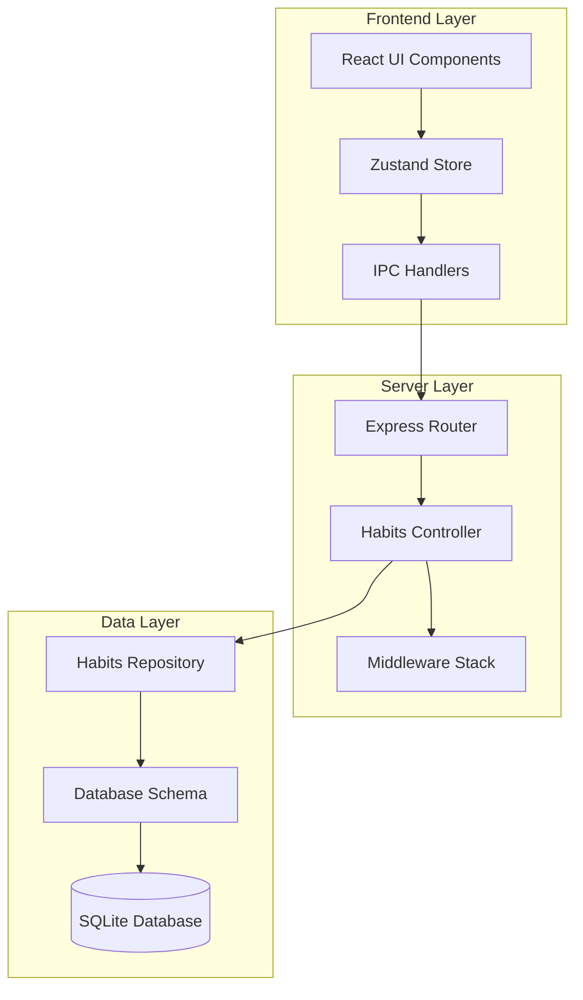
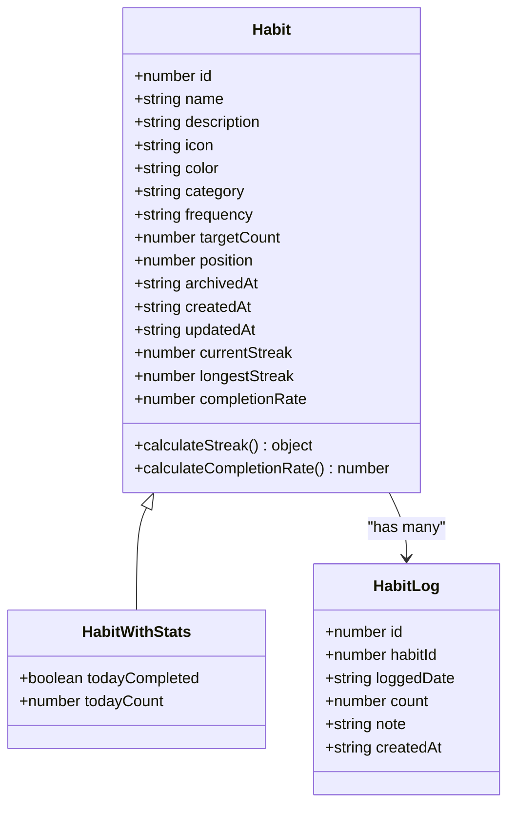
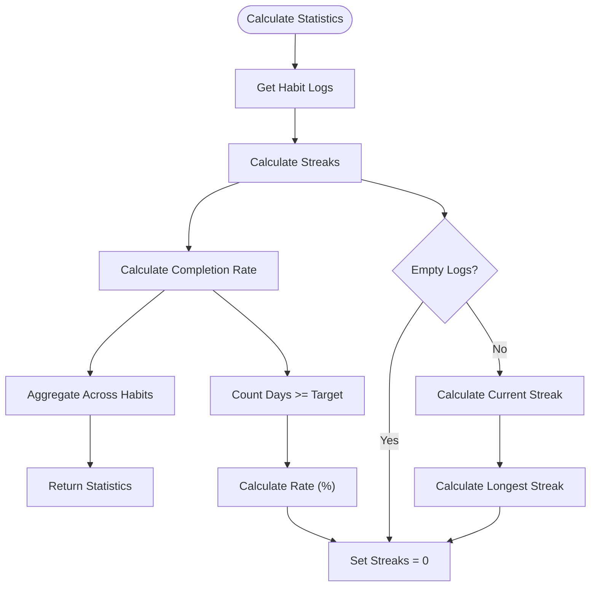
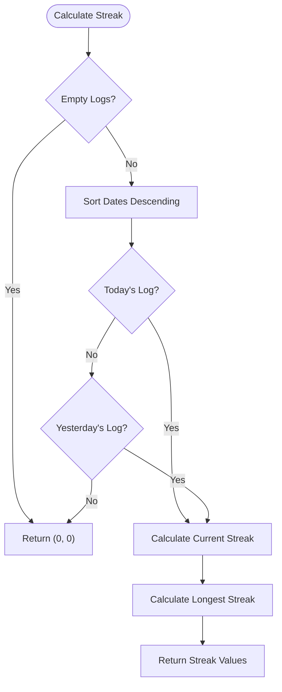
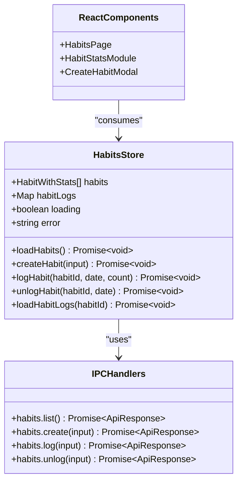

# Habits API Documentation

<cite>
**Referenced Files in This Document**
- [habits.ts](file://src/server/routes/habits.ts)
- [habitsController.ts](file://src/server/controllers/habitsController.ts)
- [habitsRepo.ts](file://src/database/habitsRepo.ts)
- [habitsSchema.ts](file://src/database/habitsSchema.ts)
- [HabitsPage.tsx](file://src/renderer/pages/HabitsPage.tsx)
- [habits.ts](file://src/store/habits.ts)
- [habits.ts](file://src/main/ipc/habits.ts)
- [response.ts](file://src/main/utils/response.ts)
- [HabitStatsModule.tsx](file://src/renderer/components/HabitStatsModule.tsx)
</cite>

## Table of Contents
1. [Introduction](#introduction)
2. [API Architecture](#api-architecture)
3. [Habit Data Model](#habit-data-model)
4. [CRUD Operations](#crud-operations)
5. [Logging Endpoints](#logging-endpoints)
6. [Statistics and Status](#statistics-and-status)
7. [Response Formats](#response-formats)
8. [Validation Rules](#validation-rules)
9. [Examples](#examples)
10. [Edge Cases and Error Handling](#edge-cases-and-error-handling)
11. [Frontend Integration](#frontend-integration)

## Introduction

The Habits API is a comprehensive RESTful service designed for managing personal habits and tracking completion progress. Built with Express.js and SQLite, it provides full CRUD operations for habit management, completion logging, and statistical analysis. The API follows REST principles and includes sophisticated streak calculation algorithms, completion rate tracking, and real-time statistics aggregation.

The system supports three frequency types: daily, weekly, and monthly habits, with configurable target counts. Each habit maintains detailed statistics including current streaks, longest streaks, completion rates, and today's completion status. The API integrates seamlessly with a React-based frontend while maintaining strict data validation and error handling.

## API Architecture

The Habits API follows a layered architecture pattern with clear separation of concerns:



**Diagram sources**
- [habits.ts](file://src/server/routes/habits.ts#L1-L32)
- [habitsController.ts](file://src/server/controllers/habitsController.ts#L1-L132)
- [habitsRepo.ts](file://src/database/habitsRepo.ts#L1-L395)

**Section sources**
- [habits.ts](file://src/server/routes/habits.ts#L1-L32)
- [habitsController.ts](file://src/server/controllers/habitsController.ts#L1-L132)
- [habitsRepo.ts](file://src/database/habitsRepo.ts#L1-L395)

## Habit Data Model

The habit system uses two primary data structures: the core Habit model and the HabitLog model for tracking completions.

### Habit Interface



**Diagram sources**
- [habitsRepo.ts](file://src/database/habitsRepo.ts#L5-L35)
- [habitsRepo.ts](file://src/database/habitsRepo.ts#L37-L42)

### Database Schema

The SQLite schema defines two main tables with appropriate indexing for optimal performance:

| Table | Column | Type | Constraints | Description |
|-------|--------|------|-------------|-------------|
| habits | id | INTEGER | PRIMARY KEY AUTOINCREMENT | Unique identifier |
| habits | name | TEXT | NOT NULL | Habit name (1-200 chars) |
| habits | description | TEXT | NULLABLE | Detailed description (max 1000 chars) |
| habits | icon | TEXT | NULLABLE | Emoji icon (max 30 chars) |
| habits | color | TEXT | NULLABLE | Hex color code (max 20 chars) |
| habits | category | TEXT | NULLABLE | Category grouping (max 50 chars) |
| habits | frequency | TEXT | NOT NULL DEFAULT 'daily' | daily/weekly/monthly |
| habits | target_count | INTEGER | NOT NULL DEFAULT 1 | Target completion count |
| habits | position | INTEGER | NOT NULL DEFAULT 0 | Display ordering |
| habits | archived_at | TEXT | NULLABLE | Archive timestamp |
| habits | created_at | TEXT | NOT NULL DEFAULT CURRENT_TIMESTAMP | Creation timestamp |
| habits | updated_at | TEXT | NOT NULL DEFAULT CURRENT_TIMESTAMP | Last update timestamp |

| Table | Column | Type | Constraints | Description |
|-------|--------|------|-------------|-------------|
| habit_logs | id | INTEGER | PRIMARY KEY AUTOINCREMENT | Unique identifier |
| habit_logs | habit_id | INTEGER | NOT NULL | Foreign key to habits |
| habit_logs | logged_date | TEXT | NOT NULL | Date of completion (YYYY-MM-DD) |
| habit_logs | count | INTEGER | NOT NULL DEFAULT 1 | Actual completion count |
| habit_logs | note | TEXT | NULLABLE | Optional completion note |
| habit_logs | created_at | TEXT | NOT NULL DEFAULT CURRENT_TIMESTAMP | Creation timestamp |
| habit_logs | UNIQUE | (habit_id, logged_date) | Composite unique constraint |

**Section sources**
- [habitsSchema.ts](file://src/database/habitsSchema.ts#L1-L39)
- [habitsRepo.ts](file://src/database/habitsRepo.ts#L5-L35)

## CRUD Operations

The Habits API provides comprehensive CRUD functionality for habit management with proper validation and error handling.

### Create Habit

Creates a new habit with specified parameters and assigns it the next available position.

**Endpoint:** `POST /api/habits/create`

**Request Body:**
```json
{
  "name": "Exercise",
  "description": "Daily workout routine",
  "icon": "🏋️‍♂️",
  "color": "#FF6B6B",
  "category": "Health",
  "frequency": "daily",
  "targetCount": 1
}
```

**Response:**
```json
{
  "ok": true,
  "data": {
    "id": 1,
    "name": "Exercise",
    "description": "Daily workout routine",
    "icon": "🏋️‍♂️",
    "color": "#FF6B6B",
    "category": "Health",
    "frequency": "daily",
    "targetCount": 1,
    "position": 0,
    "archivedAt": null,
    "createdAt": "2024-01-15T10:00:00.000Z",
    "updatedAt": "2024-01-15T10:00:00.000Z",
    "currentStreak": 0,
    "longestStreak": 0,
    "completionRate": 0
  }
}
```

### Get Habit

Retrieves a specific habit by ID with calculated statistics.

**Endpoint:** `GET /api/habits/:id`

**Parameters:**
- `id` (number): Habit identifier

**Response:**
```json
{
  "ok": true,
  "data": {
    "id": 1,
    "name": "Exercise",
    "description": "Daily workout routine",
    "icon": "🏋️‍♂️",
    "color": "#FF6B6B",
    "category": "Health",
    "frequency": "daily",
    "targetCount": 1,
    "position": 0,
    "archivedAt": null,
    "createdAt": "2024-01-15T10:00:00.000Z",
    "updatedAt": "2024-01-15T10:00:00.000Z",
    "currentStreak": 5,
    "longestStreak": 8,
    "completionRate": 95
  }
}
```

### List Habits

Retrieves all habits with optional filtering for archived habits.

**Endpoint:** `GET /api/habits/`

**Query Parameters:**
- `includeArchived` (boolean): Include archived habits (default: false)

**Response:**
```json
{
  "ok": true,
  "data": [
    {
      "id": 1,
      "name": "Exercise",
      "description": "Daily workout routine",
      "icon": "🏋️‍♂️",
      "color": "#FF6B6B",
      "category": "Health",
      "frequency": "daily",
      "targetCount": 1,
      "position": 0,
      "archivedAt": null,
      "createdAt": "2024-01-15T10:00:00.000Z",
      "updatedAt": "2024-01-15T10:00:00.000Z",
      "currentStreak": 5,
      "longestStreak": 8,
      "completionRate": 95
    }
  ]
}
```

### Update Habit

Updates an existing habit with new parameters.

**Endpoint:** `PUT /api/habits/:id`

**Request Body:**
```json
{
  "name": "Morning Exercise",
  "targetCount": 2,
  "frequency": "daily"
}
```

**Response:**
```json
{
  "ok": true,
  "data": {
    "id": 1,
    "name": "Morning Exercise",
    "description": "Daily workout routine",
    "icon": "🏋️‍♂️",
    "color": "#FF6B6B",
    "category": "Health",
    "frequency": "daily",
    "targetCount": 2,
    "position": 0,
    "archivedAt": null,
    "createdAt": "2024-01-15T10:00:00.000Z",
    "updatedAt": "2024-01-15T11:00:00.000Z",
    "currentStreak": 5,
    "longestStreak": 8,
    "completionRate": 95
  }
}
```

### Delete Habit

Permanently deletes a habit and all associated logs.

**Endpoint:** `DELETE /api/habits/:id`

**Response:**
```json
{
  "ok": true,
  "data": {
    "success": true,
    "id": 1
  }
}
```

**Section sources**
- [habitsController.ts](file://src/server/controllers/habitsController.ts#L5-L131)
- [habitsRepo.ts](file://src/database/habitsRepo.ts#L171-L394)

## Logging Endpoints

The logging system provides sophisticated completion tracking with automatic streak calculation and duplicate handling.

### Log Habit Completion

Records habit completion with date, count, and optional notes. Handles duplicates by incrementing the existing entry.

**Endpoint:** `POST /api/habits/:id/log`

**Request Body:**
```json
{
  "loggedDate": "2024-01-15",
  "count": 1,
  "note": "Completed 30 minutes yoga"
}
```

**Response:**
```json
{
  "ok": true,
  "data": {
    "id": 1,
    "habitId": 1,
    "loggedDate": "2024-01-15",
    "count": 1,
    "note": "Completed 30 minutes yoga",
    "createdAt": "2024-01-15T10:30:00.000Z"
  }
}
```

### Unlog Habit

Removes a habit completion entry for a specific date.

**Endpoint:** `DELETE /api/habits/:id/log/:date`

**Parameters:**
- `id` (number): Habit identifier
- `date` (string): Date in YYYY-MM-DD format

**Response:**
```json
{
  "ok": true,
  "data": {
    "success": true,
    "habitId": 1,
    "loggedDate": "2024-01-15"
  }
}
```

### Get Habit Logs

Retrieves completion logs for a habit with pagination support.

**Endpoint:** `GET /api/habits/:id/logs`

**Query Parameters:**
- `limit` (number): Number of logs to return (default: 30)

**Response:**
```json
{
  "ok": true,
  "data": [
    {
      "id": 1,
      "habitId": 1,
      "loggedDate": "2024-01-15",
      "count": 1,
      "note": "Completed 30 minutes yoga",
      "createdAt": "2024-01-15T10:30:00.000Z"
    },
    {
      "id": 2,
      "habitId": 1,
      "loggedDate": "2024-01-14",
      "count": 1,
      "note": "30-minute cardio",
      "createdAt": "2024-01-14T18:00:00.000Z"
    }
  ]
}
```

**Section sources**
- [habitsController.ts](file://src/server/controllers/habitsController.ts#L65-L100)
- [habitsRepo.ts](file://src/database/habitsRepo.ts#L320-L394)

## Statistics and Status

The API provides comprehensive statistics aggregation across all habits with real-time calculations.

### Habits Status Endpoint

Aggregates statistics across all habits including totals, completion rates, and best streaks.

**Endpoint:** `GET /api/habits/status`

**Response:**
```json
{
  "ok": true,
  "data": {
    "total": 15,
    "active": 12,
    "archived": 3,
    "completedToday": 8,
    "avgCompletionRate": 85,
    "bestStreak": 25,
    "habits": [
      {
        "id": 1,
        "name": "Exercise",
        "frequency": "daily",
        "currentStreak": 5,
        "completionRate": 95,
        "todayCompleted": true
      },
      {
        "id": 2,
        "name": "Reading",
        "frequency": "daily",
        "currentStreak": 3,
        "completionRate": 80,
        "todayCompleted": false
      }
    ]
  }
}
```

### Statistics Calculation Methods

The system employs sophisticated algorithms for calculating habit statistics:



**Diagram sources**
- [habitsRepo.ts](file://src/database/habitsRepo.ts#L58-L123)
- [habitsRepo.ts](file://src/database/habitsRepo.ts#L125-L140)

**Section sources**
- [habitsController.ts](file://src/server/controllers/habitsController.ts#L100-L131)
- [habitsRepo.ts](file://src/database/habitsRepo.ts#L370-L394)

## Response Formats

The API consistently uses a standardized response format with error handling and success indicators.

### Standard Response Structure

```typescript
interface ApiResponse<T> {
  ok: boolean;
  data?: T;
  error?: string;
}
```

### Success Response

```json
{
  "ok": true,
  "data": {
    // Content varies by endpoint
  }
}
```

### Error Response

```json
{
  "ok": false,
  "error": "Habit not found"
}
```

### Wrapped IPC Handler

The backend uses a wrapper function for consistent error handling:

```typescript
export function wrapIpc<T extends (...args: any[]) => any>(handler: T) {
  return async (...args: Parameters<T>): Promise<ApiResponse<Awaited<ReturnType<T>>>> => {
    try {
      const result = await handler(...args);
      return success(result);
    } catch (error) {
      return failure(error instanceof Error ? error.message : String(error));
    }
  };
}
```

**Section sources**
- [response.ts](file://src/main/utils/response.ts#L1-L37)
- [habits.ts](file://src/main/ipc/habits.ts#L1-L101)

## Validation Rules

The API implements comprehensive validation using Zod schemas to ensure data integrity.

### Habit Creation Validation

```typescript
const createHabitSchema = z.object({
  name: z.string().min(1).max(200),
  description: z.string().max(1000).optional(),
  icon: z.string().max(30).optional(),
  color: z.string().max(20).optional(),
  category: z.string().max(50).optional(),
  frequency: z.enum(['daily', 'weekly', 'monthly']).default('daily'),
  targetCount: z.number().int().positive().default(1),
});
```

### Habit Logging Validation

```typescript
const logHabitSchema = z.object({
  habitId: z.number().int().positive(),
  loggedDate: z.string().regex(/^\d{4}-\d{2}-\d{2}$/),
  count: z.number().int().positive().default(1),
  note: z.string().max(500).optional(),
});
```

### Validation Rules Summary

| Field | Type | Constraints | Default | Description |
|-------|------|-------------|---------|-------------|
| name | string | min: 1, max: 200 | Required | Habit name |
| description | string | max: 1000 | null | Detailed description |
| icon | string | max: 30 | null | Emoji or icon |
| color | string | max: 20 | null | Hex color code |
| category | string | max: 50 | null | Category grouping |
| frequency | enum | daily/weekly/monthly | daily | Completion frequency |
| targetCount | number | int, positive | 1 | Target completion count |
| loggedDate | string | YYYY-MM-DD format | Required | Completion date |
| count | number | int, positive | 1 | Actual completion count |
| note | string | max: 500 | null | Optional completion note |

**Section sources**
- [habitsRepo.ts](file://src/database/habitsRepo.ts#L37-L57)
- [habitsRepo.ts](file://src/database/habitsRepo.ts#L59-L65)

## Examples

### Creating Different Habit Types

#### Daily Habit Example
```json
{
  "name": "Drink Water",
  "description": "Stay hydrated throughout the day",
  "icon": "💧",
  "color": "#64B5F6",
  "category": "Health",
  "frequency": "daily",
  "targetCount": 8
}
```

#### Weekly Habit Example
```json
{
  "name": "Grocery Shopping",
  "description": "Buy groceries for the week",
  "icon": "🛒",
  "color": "#81C784",
  "category": "Home",
  "frequency": "weekly",
  "targetCount": 1
}
```

#### Monthly Habit Example
```json
{
  "name": "Budget Review",
  "description": "Review and adjust monthly budget",
  "icon": "📈",
  "color": "#FFB74D",
  "category": "Finance",
  "frequency": "monthly",
  "targetCount": 1
}
```

### Logging Completions

#### Single Completion
```json
{
  "loggedDate": "2024-01-15",
  "count": 1,
  "note": "Drank 8 glasses of water"
}
```

#### Multiple Completions
```json
{
  "loggedDate": "2024-01-15",
  "count": 3,
  "note": "Completed morning, afternoon, and evening walks"
}
```

### Getting Habit Statistics

#### Today's Completion Status
```json
{
  "ok": true,
  "data": {
    "id": 1,
    "name": "Exercise",
    "description": "Daily workout routine",
    "frequency": "daily",
    "targetCount": 1,
    "currentStreak": 5,
    "longestStreak": 8,
    "completionRate": 95,
    "todayCompleted": true,
    "todayCount": 1
  }
}
```

**Section sources**
- [HabitsPage.tsx](file://src/renderer/pages/HabitsPage.tsx#L15-L80)
- [habitsRepo.ts](file://src/database/habitsRepo.ts#L171-L220)

## Edge Cases and Error Handling

The API handles various edge cases with robust error handling and graceful degradation.

### Common Error Scenarios

#### Habit Not Found
```json
{
  "ok": false,
  "error": "Habit not found"
}
```

#### Invalid Date Format
```json
{
  "ok": false,
  "error": "Invalid date format. Expected YYYY-MM-DD"
}
```

#### Duplicate Log Entry
The system handles duplicate logs by incrementing the existing count rather than creating new entries.

#### Database Connection Issues
```json
{
  "ok": false,
  "error": "Database not initialized"
}
```

### Streak Calculation Edge Cases

The streak calculation algorithm handles several edge cases:



**Diagram sources**
- [habitsRepo.ts](file://src/database/habitsRepo.ts#L58-L123)

### Error Handling Strategies

1. **Validation Errors**: Return descriptive error messages for invalid input
2. **Database Errors**: Graceful degradation with empty responses when database unavailable
3. **Resource Not Found**: Clear 404 responses with descriptive messages
4. **Duplicate Entries**: Automatic conflict resolution with incrementing counts
5. **Missing Dependencies**: Fallback calculations when partial data is available

**Section sources**
- [habitsRepo.ts](file://src/database/habitsRepo.ts#L58-L123)
- [response.ts](file://src/main/utils/response.ts#L15-L37)

## Frontend Integration

The frontend integrates seamlessly with the Habits API through a comprehensive state management system.

### Store Architecture



**Diagram sources**
- [habits.ts](file://src/store/habits.ts#L5-L25)
- [habits.ts](file://src/main/ipc/habits.ts#L1-L101)

### Real-time Updates

The frontend automatically refreshes habit data after each operation:

1. **Create Habit**: Triggers `loadHabits()` to refresh the habit list
2. **Log Habit**: Refreshes habit statistics and logs
3. **Unlog Habit**: Updates streak calculations and completion status
4. **Delete Habit**: Removes from list and clears associated logs

### UI Integration Patterns

The frontend components demonstrate best practices for API integration:

- **Loading States**: Clear indication during API calls
- **Error Handling**: User-friendly error messages
- **Real-time Feedback**: Immediate UI updates after successful operations
- **Form Validation**: Client-side validation before API calls

**Section sources**
- [habits.ts](file://src/store/habits.ts#L1-L161)
- [HabitsPage.tsx](file://src/renderer/pages/HabitsPage.tsx#L1-L299)
- [HabitStatsModule.tsx](file://src/renderer/components/HabitStatsModule.tsx#L1-L139)