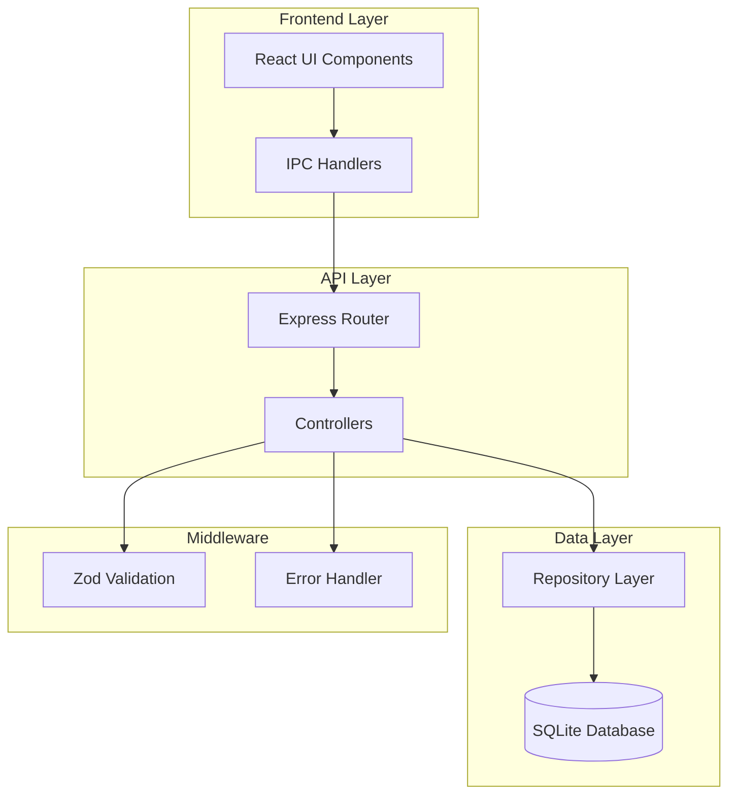
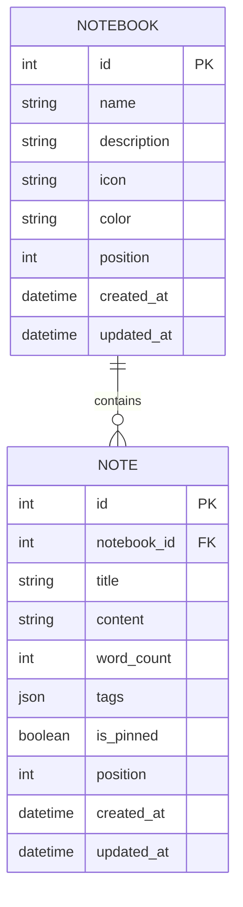
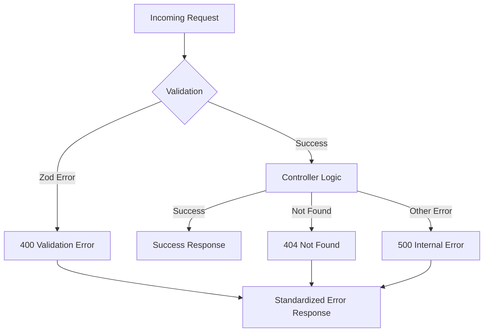
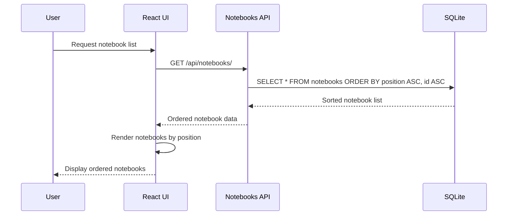
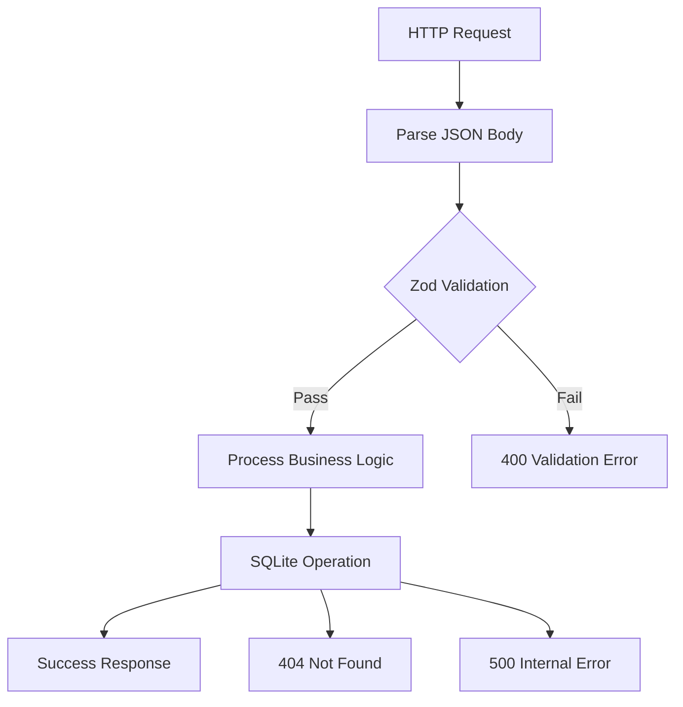

# Notebooks API

<cite>
**Referenced Files in This Document**
- [notebooksController.ts](file://src/server/controllers/notebooksController.ts)
- [notebooks.ts](file://src/server/routes/notebooks.ts)
- [notebookRepo.ts](file://src/database/notebookRepo.ts)
- [notebookSchema.ts](file://src/database/notebookSchema.ts)
- [notebook.ts](file://src/main/ipc/notebook.ts)
- [NotebookPage.tsx](file://src/renderer/pages/NotebookPage.tsx)
- [errorHandler.ts](file://src/server/middleware/errorHandler.ts)
- [types.ts](file://src/common/types.ts)
</cite>

## Table of Contents
1. [Introduction](#introduction)
2. [API Architecture Overview](#api-architecture-overview)
3. [Core Endpoints](#core-endpoints)
4. [Data Models](#data-models)
5. [Relationship Between Notebooks and Notes](#relationship-between-notebooks-and-notes)
6. [Status Endpoint](#status-endpoint)
7. [Error Handling](#error-handling)
8. [Position Field and UI Ordering](#position-field-and-ui-ordering)
9. [Examples and Usage](#examples-and-usage)
10. [Validation and Constraints](#validation-and-constraints)

## Introduction

The Notebooks API provides a comprehensive RESTful interface for managing notebooks and their associated notes within the LifeOS productivity suite. This API enables users to create, read, update, and delete notebooks while maintaining rich metadata including descriptions, icons, colors, and word counts. The API follows REST principles and integrates seamlessly with the Electron desktop application architecture.

The API is built using Express.js for the backend, SQLite for data persistence, and TypeScript for type safety. It supports real-time collaboration features, automatic word counting, and maintains strict data validation through Zod schemas.

## API Architecture Overview

The Notebooks API follows a layered architecture pattern with clear separation of concerns:



**Diagram sources**
- [notebooks.ts](file://src/server/routes/notebooks.ts#L1-L22)
- [notebooksController.ts](file://src/server/controllers/notebooksController.ts#L1-L88)
- [notebook.ts](file://src/main/ipc/notebook.ts#L1-L105)

**Section sources**
- [notebooks.ts](file://src/server/routes/notebooks.ts#L1-L22)
- [notebooksController.ts](file://src/server/controllers/notebooksController.ts#L1-L88)

## Core Endpoints

The Notebooks API provides six primary endpoints for CRUD operations and status reporting:

### Create Notebook
**POST** `/api/notebooks/create`

Creates a new notebook with the specified attributes and assigns it the next available position.

**Request Body:**
```typescript
{
  name: string;           // Required, min 1, max 200 characters
  description?: string;   // Optional, max 1000 characters
  icon?: string;         // Optional, max 30 characters (typically emoji)
  color?: string;        // Optional, max 20 characters (CSS color)
}
```

**Response:** 201 Created with notebook data

### Get Notebook
**GET** `/api/notebooks/:id`

Retrieves a specific notebook by its ID.

**Parameters:**
- `id`: Notebook ID (integer)

**Response:** Notebook data or 404 Not Found

### List Notebooks
**GET** `/api/notebooks/`

Returns all notebooks sorted by position and creation order.

**Response:** Array of notebook objects

### Update Notebook
**PUT** `/api/notebooks/:id`

Updates an existing notebook's attributes.

**Parameters:**
- `id`: Notebook ID (integer)

**Request Body:**
```typescript
{
  name?: string;
  description?: string | null;
  icon?: string | null;
  color?: string | null;
  position?: number;
}
```

**Response:** Updated notebook data

### Delete Notebook
**DELETE** `/api/notebooks/:id`

Removes a notebook and all associated notes (via cascading delete).

**Parameters:**
- `id`: Notebook ID (integer)

**Response:** Success confirmation

### Get Notebooks Status
**GET** `/api/notebooks/status`

Returns aggregate statistics about all notebooks and their notes.

**Response:** Status object with totals and notebook metadata

**Section sources**
- [notebooksController.ts](file://src/server/controllers/notebooksController.ts#L4-L88)
- [notebooks.ts](file://src/server/routes/notebooks.ts#L5-L21)

## Data Models

### Notebook Model

The notebook entity represents a collection of notes with rich metadata:

```typescript
interface Notebook {
  id: number;              // Unique identifier
  name: string;           // Notebook title (required)
  description: string | null; // Optional description
  icon: string | null;    // Icon (typically emoji)
  color: string | null;   // Background color
  position: number;       // Display order position
  noteCount: number;      // Number of notes in notebook
  createdAt: string;      // ISO timestamp
  updatedAt: string;      // ISO timestamp
}
```

### Note Model

Individual notes within notebooks contain rich content and metadata:

```typescript
interface Note {
  id: number;              // Unique identifier
  notebookId: number;     // Parent notebook ID
  title: string;          // Note title (required)
  content: string;        // Note content (markdown supported)
  wordCount: number;      // Automatic word count
  tags: string[] | null;  // Associated tags
  isPinned: boolean;      // Pinned status
  position: number;       // Display order within notebook
  createdAt: string;      // ISO timestamp
  updatedAt: string;      // ISO timestamp
}
```

### Status Response Model

The status endpoint returns comprehensive statistics:

```typescript
interface StatusResponse {
  total: number;          // Total number of notebooks
  totalNotes: number;     // Total number of notes
  notebooks: Array<{
    id: number;
    title: string;
    noteCount: number;
    lastUpdated: string;
  }>;
}
```

**Section sources**
- [notebookRepo.ts](file://src/database/notebookRepo.ts#L7-L30)
- [notebookRepo.ts](file://src/database/notebookRepo.ts#L32-L45)

## Relationship Between Notebooks and Notes

The API design establishes a clear hierarchical relationship between notebooks and notes:



**Diagram sources**
- [notebookSchema.ts](file://src/database/notebookSchema.ts#L15-L51)
- [notebookRepo.ts](file://src/database/notebookRepo.ts#L12-L30)

### Key Relationship Features:

1. **Foreign Key Constraint**: Notes reference their parent notebook via `notebook_id`
2. **Cascade Deletion**: Deleting a notebook automatically deletes all associated notes
3. **Position Tracking**: Both notebooks and notes maintain position fields for UI ordering
4. **Metadata Aggregation**: Notebooks track their note count for efficient display

### Query Patterns

The repository layer implements optimized queries for common operations:

- **List notebooks with note counts**: Uses SQL aggregation with `COUNT()` and `GROUP BY`
- **List notes by notebook**: Filters notes by `notebook_id` with position-based sorting
- **Search notes**: Implements full-text search across titles and content

**Section sources**
- [notebookSchema.ts](file://src/database/notebookSchema.ts#L35-L40)
- [notebookRepo.ts](file://src/database/notebookRepo.ts#L100-L120)

## Status Endpoint

The status endpoint provides comprehensive aggregate statistics about the notebook system:

### Endpoint: GET `/api/notebooks/status`

Returns a detailed overview of all notebooks and their associated notes, along with system-wide statistics.

### Response Schema

```typescript
{
  "data": {
    "total": number,           // Total number of notebooks
    "totalNotes": number,      // Total number of notes across all notebooks
    "notebooks": [
      {
        "id": number,          // Notebook ID
        "title": string,       // Notebook name
        "noteCount": number,   // Number of notes in this notebook
        "lastUpdated": string  // ISO timestamp of latest note update
      }
    ]
  }
}
```

### Implementation Details

The status endpoint combines two separate repository calls:
1. **Statistics Calculation**: Calls `getNotebookStats()` for system-wide metrics
2. **Notebook Metadata**: Calls `listNotebooks()` for individual notebook details

This approach ensures optimal performance by avoiding redundant database queries while providing comprehensive information.

**Section sources**
- [notebooksController.ts](file://src/server/controllers/notebooksController.ts#L67-L88)
- [notebookRepo.ts](file://src/database/notebookRepo.ts#L370-L399)

## Error Handling

The Notebooks API implements comprehensive error handling with standardized response formats:

### Standard Error Response Format

```typescript
{
  "error": {
    "code": string,         // Error classification
    "message": string,      // Human-readable error message
    "details": any          // Additional error context
  }
}
```

### Error Types

1. **Validation Errors** (400 Bad Request)
   - Occur when request data fails Zod validation
   - Example: `name` field exceeds 200 character limit

2. **Not Found Errors** (404 Not Found)
   - Occurs when attempting to access non-existent notebooks
   - Example: GET `/api/notebooks/999` when notebook doesn't exist

3. **Internal Server Errors** (500 Internal Server Error)
   - Generic server errors with optional debug information in development

### Error Handling Middleware

The API uses centralized error handling through the `errorHandler` middleware:



**Diagram sources**
- [errorHandler.ts](file://src/server/middleware/errorHandler.ts#L10-L69)

**Section sources**
- [errorHandler.ts](file://src/server/middleware/errorHandler.ts#L10-L69)
- [notebooksController.ts](file://src/server/controllers/notebooksController.ts#L10-L25)

## Position Field and UI Ordering

The position field plays a crucial role in maintaining consistent UI presentation across the application:

### Position Field Behavior

1. **Automatic Assignment**: When creating a notebook, the position is automatically set to the next available position
2. **Manual Adjustment**: Users can manually reorder notebooks by updating their position values
3. **Stable Sorting**: The database query orders notebooks by position first, then by ID for consistency

### UI Presentation Logic

The frontend implements sophisticated ordering logic:



**Diagram sources**
- [notebookRepo.ts](file://src/database/notebookRepo.ts#L100-L110)
- [NotebookPage.tsx](file://src/renderer/pages/NotebookPage.tsx#L40-L55)

### Position Management Strategies

1. **Sequential Assignment**: New notebooks receive the highest position + 1
2. **Gap Filling**: When notebooks are deleted, positions remain contiguous
3. **Manual Reordering**: Users can drag and drop to change notebook order

This positioning system ensures predictable UI behavior and maintains user expectations across sessions.

**Section sources**
- [notebookRepo.ts](file://src/database/notebookRepo.ts#L120-L140)
- [NotebookPage.tsx](file://src/renderer/pages/NotebookPage.tsx#L40-L55)

## Examples and Usage

### Creating a Notebook with Description

```javascript
// Request
POST /api/notebooks/create
Content-Type: application/json

{
  "name": "Personal Journal",
  "description": "Daily reflections and personal thoughts",
  "icon": "📔",
  "color": "#F0E68C"
}

// Response
201 Created
{
  "data": {
    "id": 1,
    "name": "Personal Journal",
    "description": "Daily reflections and personal thoughts",
    "icon": "📔",
    "color": "#F0E68C",
    "position": 0,
    "noteCount": 0,
    "createdAt": "2024-01-15T10:30:00.000Z",
    "updatedAt": "2024-01-15T10:30:00.000Z"
  }
}
```

### Retrieving Notebook Metadata

```javascript
// Request
GET /api/notebooks/1

// Response
200 OK
{
  "data": {
    "id": 1,
    "name": "Personal Journal",
    "description": "Daily reflections and personal thoughts",
    "icon": "📔",
    "color": "#F0E68C",
    "position": 0,
    "noteCount": 15,
    "createdAt": "2024-01-15T10:30:00.000Z",
    "updatedAt": "2024-01-16T14:22:00.000Z"
  }
}
```

### Updating Notebook Properties

```javascript
// Request
PUT /api/notebooks/1
Content-Type: application/json

{
  "name": "Updated Journal Title",
  "description": "Enhanced daily reflections",
  "icon": "📚",
  "position": 1
}

// Response
200 OK
{
  "data": {
    "id": 1,
    "name": "Updated Journal Title",
    "description": "Enhanced daily reflections",
    "icon": "📚",
    "color": "#F0E68C",
    "position": 1,
    "noteCount": 15,
    "createdAt": "2024-01-15T10:30:00.000Z",
    "updatedAt": "2024-01-16T15:45:00.000Z"
  }
}
```

### Getting All Notebooks Status

```javascript
// Request
GET /api/notebooks/status

// Response
200 OK
{
  "data": {
    "total": 3,
    "totalNotes": 42,
    "notebooks": [
      {
        "id": 1,
        "title": "Personal Journal",
        "noteCount": 15,
        "lastUpdated": "2024-01-16T14:22:00.000Z"
      },
      {
        "id": 2,
        "title": "Work Projects",
        "noteCount": 20,
        "lastUpdated": "2024-01-16T13:15:00.000Z"
      },
      {
        "id": 3,
        "title": "Research Notes",
        "noteCount": 7,
        "lastUpdated": "2024-01-15T16:30:00.000Z"
      }
    ]
  }
}
```

### Error Scenario: Non-existent Notebook

```javascript
// Request
GET /api/notebooks/999

// Response
404 Not Found
{
  "error": {
    "code": "NOT_FOUND",
    "message": "Notebook not found"
  }
}
```

**Section sources**
- [NotebookPage.tsx](file://src/renderer/pages/NotebookPage.tsx#L80-L120)
- [notebooksController.ts](file://src/server/controllers/notebooksController.ts#L10-L25)

## Validation and Constraints

### Input Validation

The API uses Zod schemas for comprehensive input validation:

#### Notebook Creation Schema
```typescript
const createNotebookSchema = z.object({
  name: z.string().min(1).max(200),
  description: z.string().max(1000).optional(),
  icon: z.string().max(30).optional(),
  color: z.string().max(20).optional(),
});
```

#### Notebook Update Schema
```typescript
const updateNotebookSchema = z.object({
  id: z.number().int().positive(),
  payload: z.object({
    name: z.string().min(1).max(200).optional(),
    description: z.string().max(1000).optional().nullable(),
    icon: z.string().max(30).optional().nullable(),
    color: z.string().max(20).optional().nullable(),
    position: z.number().optional(),
  })
});
```

### Database Constraints

The SQLite schema enforces several important constraints:

1. **Primary Keys**: Auto-incrementing integer IDs
2. **Foreign Keys**: Cascade deletion from notebooks to notes
3. **Default Values**: Automatic timestamps and position assignment
4. **Indexing**: Optimized queries for position-based sorting

### Validation Flow



**Diagram sources**
- [notebookRepo.ts](file://src/database/notebookRepo.ts#L32-L50)
- [errorHandler.ts](file://src/server/middleware/errorHandler.ts#L25-L35)

**Section sources**
- [notebookRepo.ts](file://src/database/notebookRepo.ts#L32-L50)
- [notebookSchema.ts](file://src/database/notebookSchema.ts#L15-L51)