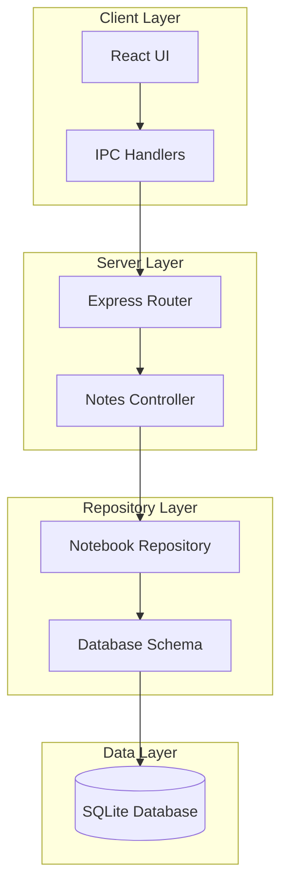
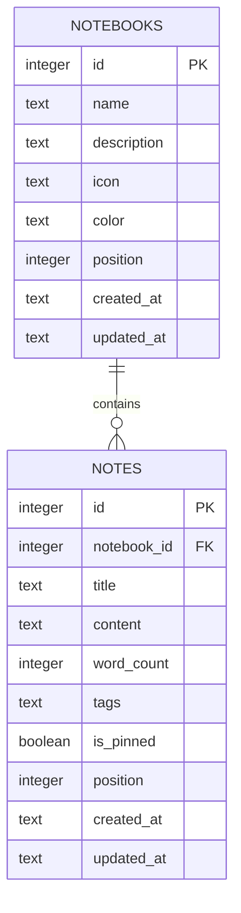
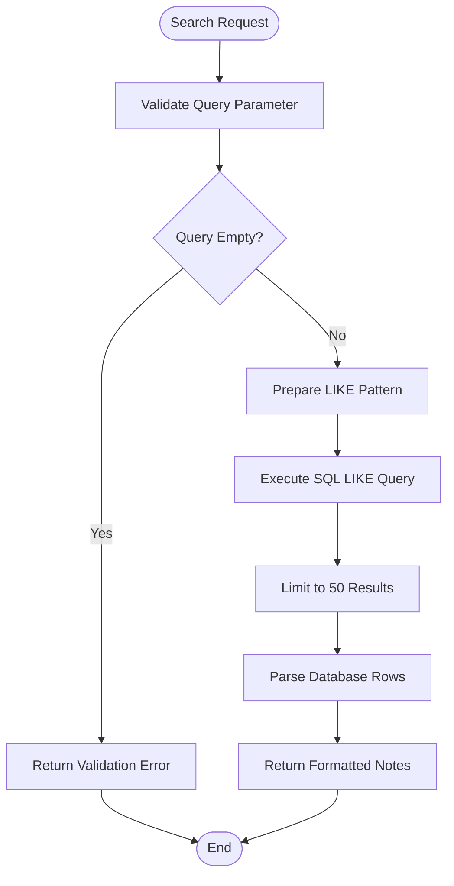
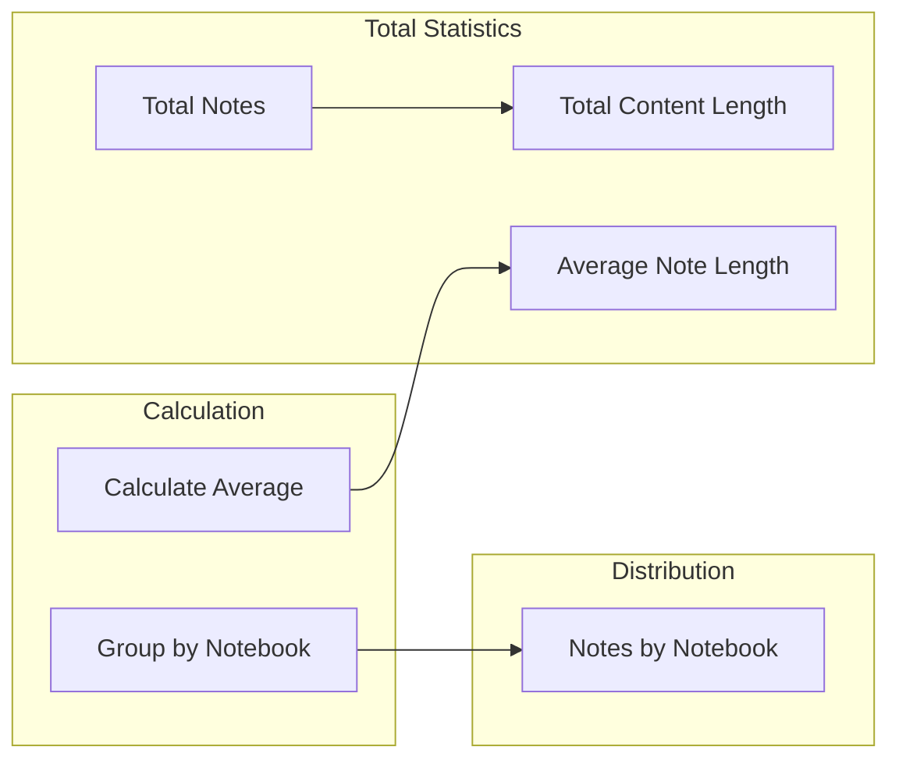
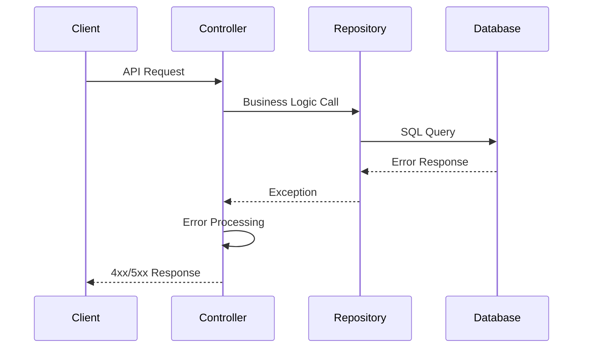
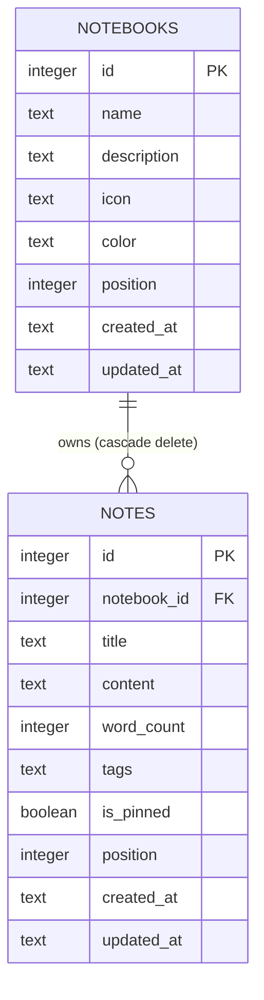

# Notes API Documentation

<cite>
**Referenced Files in This Document**
- [notesController.ts](file://src/server/controllers/notesController.ts)
- [notes.ts](file://src/server/routes/notes.ts)
- [notebookRepo.ts](file://src/database/notebookRepo.ts)
- [notebookSchema.ts](file://src/database/notebookSchema.ts)
- [init.ts](file://src/database/init.ts)
- [NotebookPage.tsx](file://src/renderer/pages/NotebookPage.tsx)
- [notebook.ts](file://src/main/ipc/notebook.ts)
- [statusController.ts](file://src/server/controllers/statusController.ts)
</cite>

## Table of Contents
1. [Introduction](#introduction)
2. [API Architecture](#api-architecture)
3. [Core Endpoints](#core-endpoints)
4. [Data Models](#data-models)
5. [Database Schema](#database-schema)
6. [Search Functionality](#search-functionality)
7. [Status Endpoint](#status-endpoint)
8. [Performance Considerations](#performance-considerations)
9. [Error Handling](#error-handling)
10. [Usage Examples](#usage-examples)
11. [Relationships and Constraints](#relationships-and-constraints)
12. [Troubleshooting](#troubleshooting)

## Introduction

The Notes API is a comprehensive RESTful service built with Express.js that provides full CRUD operations for managing notes within notebooks. It serves as the backend for LifeOS's notebook and note-taking functionality, offering rich text editing capabilities with Markdown support, automatic word counting, tagging systems, and advanced search functionality.

The API follows REST principles and provides endpoints for creating, retrieving, updating, and deleting notes, as well as listing notes by notebook and performing full-text searches. It integrates seamlessly with the Electron desktop application through IPC handlers and maintains data integrity through foreign key constraints.

## API Architecture

The Notes API follows a layered architecture pattern with clear separation of concerns:



**Diagram sources**
- [notes.ts](file://src/server/routes/notes.ts#L1-L26)
- [notesController.ts](file://src/server/controllers/notesController.ts#L1-L120)
- [notebookRepo.ts](file://src/database/notebookRepo.ts#L1-L400)

**Section sources**
- [notes.ts](file://src/server/routes/notes.ts#L1-L26)
- [notesController.ts](file://src/server/controllers/notesController.ts#L1-L120)
- [notebookRepo.ts](file://src/database/notebookRepo.ts#L1-L400)

## Core Endpoints

The Notes API provides seven primary endpoints for comprehensive note management:

### Create Note
**POST** `/api/notes/create`

Creates a new note within a specified notebook with automatic word count calculation and position assignment.

### Get Note
**GET** `/api/notes/:id`

Retrieves a specific note by its ID, returning the complete note object with all metadata.

### List Notes by Notebook
**GET** `/api/notes/notebook/:notebookId`

Returns all notes belonging to a specific notebook, ordered by pin status and creation date.

### Update Note
**PUT** `/api/notes/:id`

Updates an existing note's title, content, tags, or pin status with automatic word count recalculation.

### Delete Note
**DELETE** `/api/notes/:id`

Removes a note from the database, triggering cascade effects on dependent data.

### Search Notes
**GET** `/api/notes/search?q=query`

Performs full-text search across note titles and content with partial matching support.

### Get Notes Status
**GET** `/api/notes/status`

Provides comprehensive statistics about the note collection including totals, word counts, and distribution.

**Section sources**
- [notesController.ts](file://src/server/controllers/notesController.ts#L5-L119)
- [notes.ts](file://src/server/routes/notes.ts#L4-L25)

## Data Models

The Notes API operates on two primary data models: Notebook and Note.

### Notebook Model

Represents a container for organizing related notes:

| Field | Type | Description | Constraints |
|-------|------|-------------|-------------|
| `id` | number | Unique identifier | Auto-increment, Primary Key |
| `name` | string | Notebook title | Required, 1-200 characters |
| `description` | string \| null | Optional description | Max 1000 characters |
| `icon` | string \| null | Emoji or icon | Max 30 characters |
| `color` | string \| null | Color theme | Max 20 characters |
| `position` | number | Display order | Default: 0 |
| `noteCount` | number | Number of notes | Calculated field |
| `createdAt` | string | Creation timestamp | ISO format |
| `updatedAt` | string | Last update timestamp | ISO format |

### Note Model

Represents individual entries within notebooks:

| Field | Type | Description | Constraints |
|-------|------|-------------|-------------|
| `id` | number | Unique identifier | Auto-increment, Primary Key |
| `notebookId` | number | Parent notebook reference | Foreign Key, Required |
| `title` | string | Note title | Required, 1-500 characters |
| `content` | string | Note content | Default: empty string |
| `wordCount` | number | Word count | Calculated, Default: 0 |
| `tags` | string[] \| null | Associated tags | Array of strings, max 30 chars each |
| `isPinned` | boolean | Pin status | Default: false |
| `position` | number | Display order | Default: 0 |
| `createdAt` | string | Creation timestamp | ISO format |
| `updatedAt` | string | Last update timestamp | ISO format |

**Section sources**
- [notebookRepo.ts](file://src/database/notebookRepo.ts#L10-L35)

## Database Schema

The Notes API uses SQLite with carefully designed schemas for optimal performance and data integrity:



**Diagram sources**
- [notebookSchema.ts](file://src/database/notebookSchema.ts#L15-L51)

### Schema Details

The database schema includes several key features:

#### Foreign Key Constraints
- **ON DELETE CASCADE**: Deleting a notebook automatically deletes all associated notes
- **Referential Integrity**: Ensures notebook_id references valid notebooks

#### Indexes for Performance
- `idx_notebooks_position`: Speeds up notebook ordering
- `idx_notes_notebook`: Optimizes notebook-specific queries
- `idx_notes_created`: Fastest recent notes retrieval
- `idx_notes_pinned`: Efficient pinned note sorting

#### Automatic Timestamps
- `created_at`: Automatically set on record creation
- `updated_at`: Automatically updated on modifications

**Section sources**
- [notebookSchema.ts](file://src/database/notebookSchema.ts#L15-L51)
- [init.ts](file://src/database/init.ts#L100-L120)

## Search Functionality

The search endpoint provides powerful full-text search capabilities across note titles and content:

### Search Implementation



**Diagram sources**
- [notebookRepo.ts](file://src/database/notebookRepo.ts#L350-L370)

### Search Behavior

- **Partial Matching**: Uses SQL LIKE operator for flexible matching
- **Case Insensitive**: SQLite performs case-insensitive searches by default
- **Multiple Fields**: Searches both title and content fields
- **Result Limit**: Limits to 50 results for performance
- **Ordering**: Results ordered by last updated date

### Search Patterns

The search query is transformed into SQL patterns:
- Input: `"journal"`
- Pattern: `"%journal%"`

This enables flexible matching for:
- `"journal"` → Matches "daily journal"
- `"jour"` → Matches "weekly journal"
- `"nale"` → Matches "personal journal"

**Section sources**
- [notebookRepo.ts](file://src/database/notebookRepo.ts#L350-L370)
- [notesController.ts](file://src/server/controllers/notesController.ts#L65-L85)

## Status Endpoint

The status endpoint provides comprehensive metrics about the note collection:

### Status Metrics



**Diagram sources**
- [notesController.ts](file://src/server/controllers/notesController.ts#L87-L119)

### Available Metrics

| Metric | Description | Calculation |
|--------|-------------|-------------|
| `total` | Total number of notes | `COUNT(*)` from notes table |
| `totalContentLength` | Combined word count | `SUM(word_count)` |
| `avgNoteLength` | Average words per note | `totalContentLength / total` |
| `byNotebook` | Distribution across notebooks | Count grouped by notebook_id |

### Status Response Structure

```typescript
{
  total: number;
  byNotebook: Array<{
    notebookId: number;
    count: number;
  }>;
  totalContentLength: number;
  avgNoteLength: number;
}
```

**Section sources**
- [notesController.ts](file://src/server/controllers/notesController.ts#L87-L119)

## Performance Considerations

### Database Optimization

The Notes API implements several performance optimizations:

#### Index Strategy
- **Composite Indexes**: `notebook_id, position DESC` for efficient notebook queries
- **Single Field**: `created_at DESC` for recent items
- **Boolean Index**: `is_pinned DESC` for pinned note sorting

#### Query Optimization
- **LIMIT Clauses**: Search results limited to 50 items
- **Selective Columns**: Only necessary fields retrieved
- **Parameterized Queries**: Prevent SQL injection and enable query plan caching

#### Memory Management
- **Streaming Results**: Large result sets handled efficiently
- **Connection Pooling**: Single database connection reused
- **Garbage Collection**: Proper cleanup of database resources

### Search Performance

For large note collections, consider:

- **Index Coverage**: Ensure search patterns match indexed columns
- **Result Pagination**: Implement pagination for search results
- **Caching**: Cache frequently accessed note lists
- **Full-Text Search**: Consider SQLite FTS for advanced search needs

### Scalability Limits

Current limitations:
- **Search Limit**: 50 results maximum
- **Concurrent Users**: Single-user local application
- **Storage**: SQLite file size limits (~140TB logical)

**Section sources**
- [notebookSchema.ts](file://src/database/notebookSchema.ts#L35-L45)
- [notebookRepo.ts](file://src/database/notebookRepo.ts#L350-L370)

## Error Handling

The Notes API implements comprehensive error handling across all endpoints:

### Standard Error Responses



**Diagram sources**
- [notesController.ts](file://src/server/controllers/notesController.ts#L5-L119)

### Error Types

| Error Code | HTTP Status | Description | Example Scenarios |
|------------|-------------|-------------|-------------------|
| `NOT_FOUND` | 404 | Resource not found | Non-existent note ID |
| `VALIDATION_ERROR` | 400 | Invalid input data | Empty search query |
| `INTERNAL_ERROR` | 500 | Server-side failure | Database connection lost |

### Validation Rules

Each endpoint enforces specific validation:

- **ID Parameters**: Must be positive integers
- **Required Fields**: Title and notebookId for note creation
- **Length Limits**: Character limits enforced at database level
- **Foreign Keys**: Notebook existence verified

**Section sources**
- [notesController.ts](file://src/server/controllers/notesController.ts#L15-L85)
- [notebookRepo.ts](file://src/database/notebookRepo.ts#L45-L85)

## Usage Examples

### Creating a Note with Rich Content

```javascript
// Create a note with Markdown content
const noteData = {
  notebookId: 1,
  title: "Daily Journal Entry",
  content: `
# Morning Routine

## Tasks Completed
- [x] Meditation (15 min)
- [x] Exercise (30 min)
- [ ] Review weekly goals

## Reflection
Today was productive despite...

## Tags
- journal
- morning
- productivity
`,
  tags: ["journal", "morning", "productivity"]
};

const response = await fetch('/api/notes/create', {
  method: 'POST',
  headers: { 'Content-Type': 'application/json' },
  body: JSON.stringify(noteData)
});
```

### Updating an Existing Note

```javascript
// Update note content and tags
const updateData = {
  title: "Updated Daily Journal Entry",
  content: "# Revised Morning Routine\n\n...",
  tags: ["journal", "updated", "reflection"],
  isPinned: true
};

const response = await fetch('/api/notes/123', {
  method: 'PUT',
  headers: { 'Content-Type': 'application/json' },
  body: JSON.stringify(updateData)
});
```

### Listing Notes by Notebook

```javascript
// Get all notes in notebook 1
const response = await fetch('/api/notes/notebook/1');
const notes = await response.json();
console.log(`Found ${notes.data.length} notes`);
```

### Performing a Search

```javascript
// Search for notes containing "journal"
const response = await fetch('/api/notes/search?q=journal');
const results = await response.json();
console.log(`Found ${results.data.length} matching notes`);
```

### Getting Note Statistics

```javascript
// Get comprehensive note statistics
const response = await fetch('/api/notes/status');
const stats = await response.json();
console.log(`Total notes: ${stats.data.total}`);
console.log(`Average length: ${stats.data.avgNoteLength} words`);
```

**Section sources**
- [NotebookPage.tsx](file://src/renderer/pages/NotebookPage.tsx#L100-L200)
- [notebook.ts](file://src/main/ipc/notebook.ts#L40-L80)

## Relationships and Constraints

### Foreign Key Relationships

The Notes API maintains strict referential integrity through foreign key constraints:



**Diagram sources**
- [notebookSchema.ts](file://src/database/notebookSchema.ts#L25-L35)

### Cascade Behaviors

#### Notebook Deletion
When a notebook is deleted:
- All associated notes are automatically removed
- No orphaned notes remain in the database
- Maintains data consistency

#### Note Updates
When notes are modified:
- Word count is automatically recalculated
- Timestamps are updated
- Related events are triggered for metrics tracking

### Data Integrity Measures

| Constraint | Purpose | Implementation |
|------------|---------|----------------|
| `NOT NULL` | Required fields | Database schema |
| `UNIQUE` | Distinct values | Primary keys |
| `FOREIGN KEY` | Referential integrity | ON DELETE CASCADE |
| `CHECK` | Value validation | Domain constraints |

**Section sources**
- [notebookSchema.ts](file://src/database/notebookSchema.ts#L25-L35)
- [notebookRepo.ts](file://src/database/notebookRepo.ts#L300-L350)

## Troubleshooting

### Common Issues and Solutions

#### Database Connection Problems
**Symptom**: API endpoints return 500 errors
**Cause**: Database initialization failure
**Solution**: Check database file permissions and disk space

#### Search Not Returning Results
**Symptom**: Search returns empty results despite existing content
**Cause**: Case sensitivity or special characters in search query
**Solution**: Try broader search terms or check character encoding

#### Performance Issues
**Symptom**: Slow response times with large note collections
**Cause**: Missing indexes or inefficient queries
**Solution**: Verify index coverage and consider query optimization

#### Validation Errors
**Symptom**: 400 Bad Request responses
**Cause**: Invalid input data format
**Solution**: Check field lengths and required parameters

### Debugging Steps

1. **Check Database Health**: Verify database file accessibility
2. **Validate Input Data**: Ensure proper JSON structure
3. **Monitor Performance**: Use browser developer tools
4. **Review Logs**: Check application logs for detailed errors
5. **Test Connectivity**: Verify IPC handler registration

### Monitoring and Maintenance

Regular maintenance tasks:
- **Database Vacuum**: Optimize database file size
- **Index Rebuild**: Rebuild indexes for performance
- **Backup Verification**: Ensure data backups are working
- **Performance Monitoring**: Track response times and resource usage

**Section sources**
- [init.ts](file://src/database/init.ts#L20-L40)
- [notesController.ts](file://src/server/controllers/notesController.ts#L15-L85)