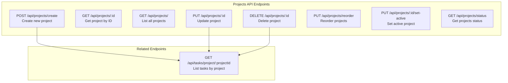
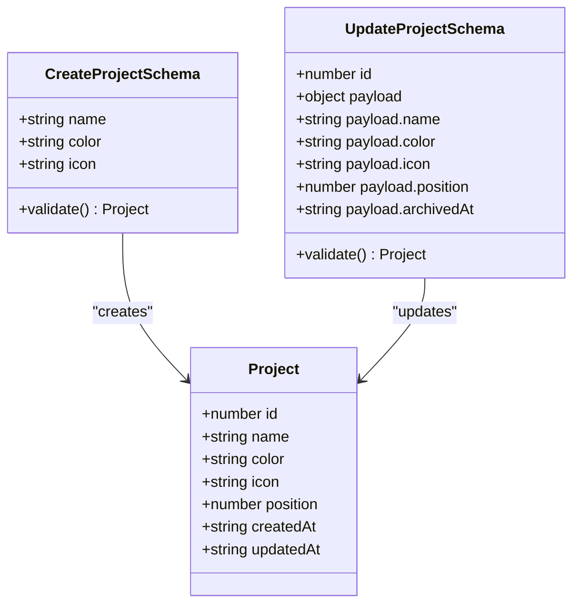
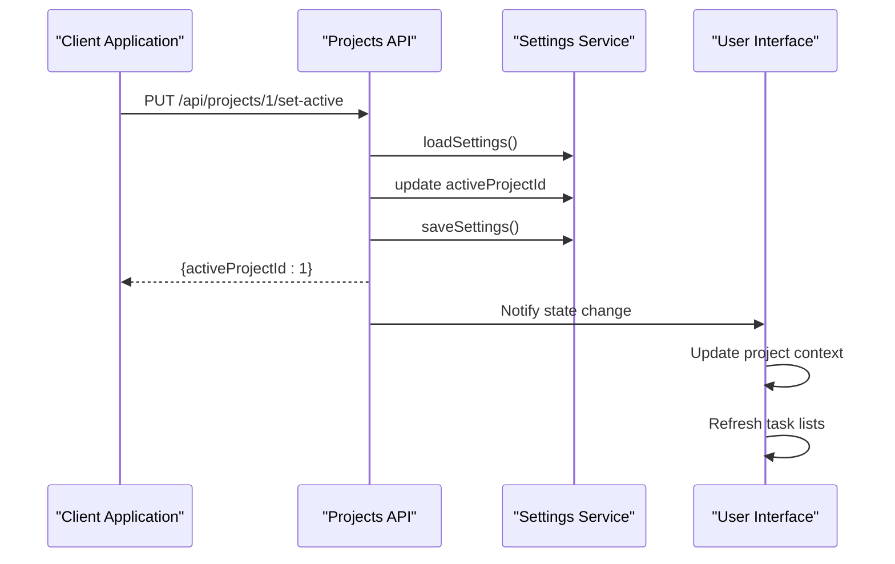
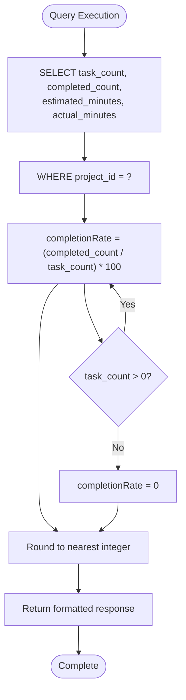
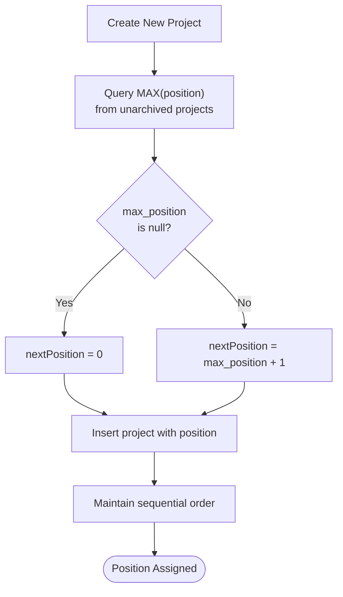
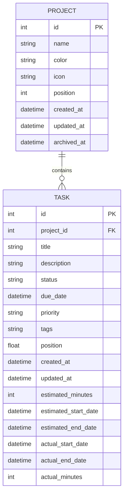
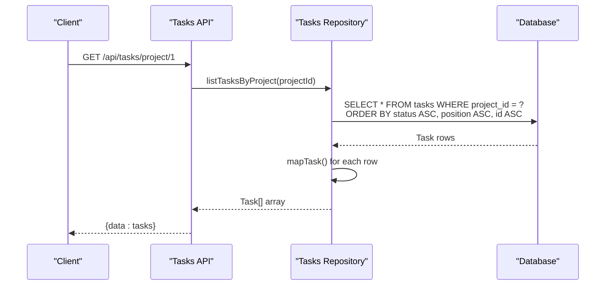
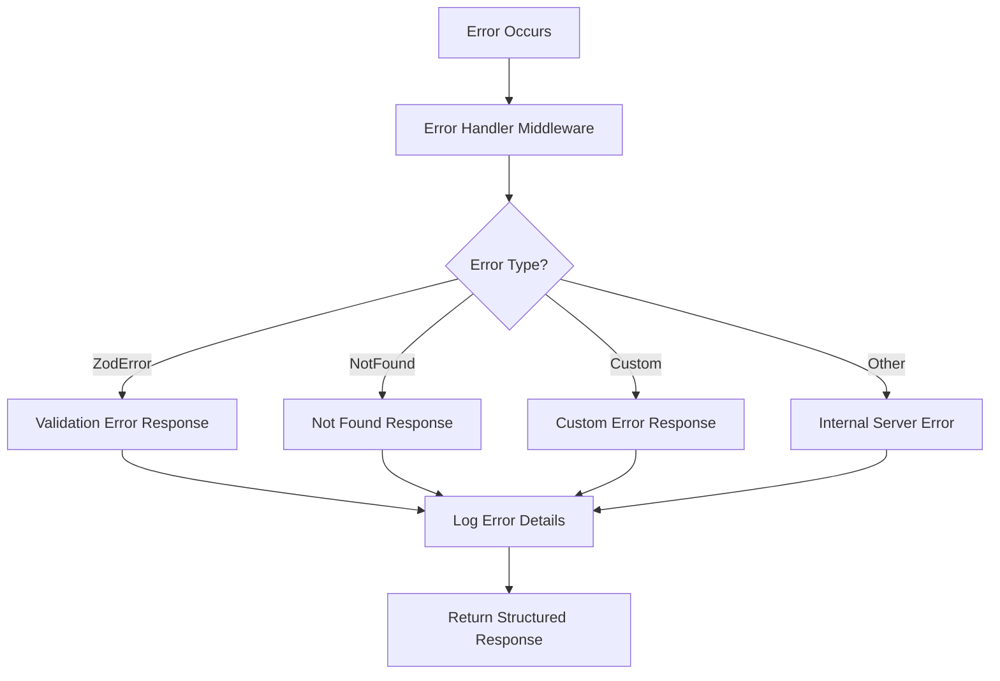

# Projects API Documentation

<cite>
**Referenced Files in This Document**
- [src/server/routes/projects.ts](file://src/server/routes/projects.ts)
- [src/server/controllers/projectsController.ts](file://src/server/controllers/projectsController.ts)
- [src/server/controllers/tasksController.ts](file://src/server/controllers/tasksController.ts)
- [src/database/projectsRepo.ts](file://src/database/projectsRepo.ts)
- [src/database/tasksRepo.ts](file://src/database/tasksRepo.ts)
- [src/common/types.ts](file://src/common/types.ts)
- [src/database/types.ts](file://src/database/types.ts)
- [src/database/init.ts](file://src/database/init.ts)
- [src/services/settings.ts](file://src/services/services/settings.ts)
- [src/server/middleware/errorHandler.ts](file://src/server/middleware/errorHandler.ts)
</cite>

## Table of Contents
1. [Introduction](#introduction)
2. [API Endpoints Overview](#api-endpoints-overview)
3. [Project Schema](#project-schema)
4. [Core Operations](#core-operations)
5. [Project Status Endpoint](#project-status-endpoint)
6. [Project Position Management](#project-position-management)
7. [Relationship with Tasks](#relationship-with-tasks)
8. [Error Handling](#error-handling)
9. [Examples and Usage Patterns](#examples-and-usage-patterns)
10. [Best Practices](#best-practices)

## Introduction

The Projects API provides comprehensive functionality for managing projects within the LifeOS application. It supports CRUD operations for projects, including creation with custom icons and colors, reordering for UI organization, and setting active projects. The API integrates closely with the task management system, maintaining relationships between projects and their associated tasks while providing detailed status metrics.

## API Endpoints Overview

The Projects API consists of the following endpoints organized under `/api/projects`:



**Diagram sources**
- [src/server/routes/projects.ts](file://src/server/routes/projects.ts#L1-L28)

**Section sources**
- [src/server/routes/projects.ts](file://src/server/routes/projects.ts#L1-L28)

## Project Schema

### Project Interface

The Project interface defines the structure of project objects:

| Field | Type | Description | Constraints |
|-------|------|-------------|-------------|
| `id` | `number` | Unique project identifier | Auto-incremented integer |
| `name` | `string` | Project display name | Required, 1-120 characters |
| `color` | `string \| null` | Custom color code | Optional, max 20 characters |
| `icon` | `string \| null` | Icon identifier | Optional, max 30 characters |
| `position` | `number` | UI ordering position | Non-negative integer |
| `createdAt` | `string` | Creation timestamp | ISO 8601 format |
| `updatedAt` | `string` | Last update timestamp | ISO 8601 format |

### Validation Schema

The API enforces strict validation through Zod schemas:



**Diagram sources**
- [src/database/projectsRepo.ts](file://src/database/projectsRepo.ts#L6-L25)

**Section sources**
- [src/common/types.ts](file://src/common/types.ts#L1-L15)
- [src/database/projectsRepo.ts](file://src/database/projectsRepo.ts#L6-L25)

## Core Operations

### Create Project

Creates a new project with optional customizations.

**Endpoint:** `POST /api/projects/create`

**Request Body:**
```json
{
  "name": "Personal Finance",
  "color": "#FF6B6B",
  "icon": "wallet"
}
```

**Response:**
```json
{
  "data": {
    "id": 1,
    "name": "Personal Finance",
    "color": "#FF6B6B",
    "icon": "wallet",
    "position": 0,
    "createdAt": "2024-01-15T10:30:00.000Z",
    "updatedAt": "2024-01-15T10:30:00.000Z"
  }
}
```

**Implementation Details:**
- Automatically assigns next available position
- Validates input against schema
- Trims whitespace from name field
- Sets default values for optional fields

### Get Project

Retrieves a specific project by ID.

**Endpoint:** `GET /api/projects/:id`

**Parameters:**
- `id` (number): Project identifier

**Response:**
```json
{
  "data": {
    "id": 1,
    "name": "Personal Finance",
    "color": "#FF6B6B",
    "icon": "wallet",
    "position": 0,
    "createdAt": "2024-01-15T10:30:00.000Z",
    "updatedAt": "2024-01-15T10:30:00.000Z"
  }
}
```

### List Projects

Retrieves all projects with optional filtering.

**Endpoint:** `GET /api/projects/`

**Query Parameters:**
- `includeArchived` (boolean): Include archived projects

**Response:**
```json
{
  "data": [
    {
      "id": 1,
      "name": "Personal Finance",
      "color": "#FF6B6B",
      "icon": "wallet",
      "position": 0,
      "createdAt": "2024-01-15T10:30:00.000Z",
      "updatedAt": "2024-01-15T10:30:00.000Z"
    },
    {
      "id": 2,
      "name": "Work Projects",
      "color": "#4ECDC4",
      "icon": "briefcase",
      "position": 1,
      "createdAt": "2024-01-15T10:35:00.000Z",
      "updatedAt": "2024-01-15T10:35:00.000Z"
    }
  ]
}
```

### Update Project

Updates an existing project's properties.

**Endpoint:** `PUT /api/projects/:id`

**Request Body:**
```json
{
  "name": "Updated Personal Finance",
  "color": "#FF5252",
  "icon": "piggy-bank",
  "position": 0
}
```

**Response:**
```json
{
  "data": {
    "id": 1,
    "name": "Updated Personal Finance",
    "color": "#FF5252",
    "icon": "piggy-bank",
    "position": 0,
    "createdAt": "2024-01-15T10:30:00.000Z",
    "updatedAt": "2024-01-15T11:15:00.000Z"
  }
}
```

### Delete Project

Permanently deletes a project and all associated data.

**Endpoint:** `DELETE /api/projects/:id`

**Response:**
```json
{
  "data": {
    "success": true,
    "id": 1
  }
}
```

**Cascade Effects:**
- Deletes all tasks in the project
- Removes related activities
- Maintains referential integrity

### Reorder Projects

Updates the position of multiple projects simultaneously.

**Endpoint:** `PUT /api/projects/reorder`

**Request Body:**
```json
{
  "order": [
    { "id": 1, "position": 1 },
    { "id": 2, "position": 0 },
    { "id": 3, "position": 2 }
  ]
}
```

**Response:**
```json
{
  "data": {
    "success": true
  }
}
```

**Section sources**
- [src/server/controllers/projectsController.ts](file://src/server/controllers/projectsController.ts#L7-L133)
- [src/database/projectsRepo.ts](file://src/database/projectsRepo.ts#L34-L147)

## Active Project Management

### setActive Endpoint

Sets a project as the currently active project, affecting application state and UI behavior.

**Endpoint:** `PUT /api/projects/:id/set-active`

**Implementation:**
The setActive operation modifies application state by updating the activeProjectId in the settings service. This change affects:

- Current project context for task operations
- UI navigation and display
- Default project for new tasks
- Application-wide project switching

**Response:**
```json
{
  "data": {
    "activeProjectId": 1
  }
}
```

**Error Conditions:**
- Attempting to set a non-existent project as active
- Invalid project ID format
- Project belongs to another user (if applicable)

**Impact on Application State:**


**Diagram sources**
- [src/server/controllers/projectsController.ts](file://src/server/controllers/projectsController.ts#L85-L97)
- [src/services/settings.ts](file://src/services/settings.ts#L1-L45)

**Section sources**
- [src/server/controllers/projectsController.ts](file://src/server/controllers/projectsController.ts#L85-L97)
- [src/services/settings.ts](file://src/services/settings.ts#L1-L45)

## Project Status Endpoint

### getProjectsStatus

Provides comprehensive statistics and metrics for all projects, including completion rates and time tracking data.

**Endpoint:** `GET /api/projects/status`

**Response Schema:**
```json
{
  "data": {
    "total": 3,
    "activeProjectId": 1,
    "projects": [
      {
        "id": 1,
        "name": "Personal Finance",
        "taskCount": 15,
        "completedCount": 8,
        "completionRate": 53,
        "totalEstimatedMinutes": 1200,
        "totalActualMinutes": 950
      },
      {
        "id": 2,
        "name": "Work Projects",
        "taskCount": 22,
        "completedCount": 14,
        "completionRate": 64,
        "totalEstimatedMinutes": 1800,
        "totalActualMinutes": 1650
      }
    ]
  }
}
```

### Status Calculation Logic

The status endpoint performs SQL aggregation to calculate metrics:



**Diagram sources**
- [src/server/controllers/projectsController.ts](file://src/server/controllers/projectsController.ts#L99-L133)

**Metrics Included:**
- **Task Statistics**: Total count, completed count, completion rate
- **Time Tracking**: Estimated vs. actual minutes spent
- **Project Context**: Active project identification

**Section sources**
- [src/server/controllers/projectsController.ts](file://src/server/controllers/projectsController.ts#L99-L133)

## Project Position Management

### UI Ordering System

Projects are ordered using a position-based system that enables drag-and-drop reordering in the UI.

**Position Characteristics:**
- Zero-based indexing
- Non-negative integers
- Sequential ordering
- Automatic assignment during creation

### Position Assignment Logic



**Diagram sources**
- [src/database/projectsRepo.ts](file://src/database/projectsRepo.ts#L42-L50)

### Reordering Process

The reorder operation uses transactions to ensure atomic updates:

**Implementation Details:**
- Batch updates for performance
- Transaction rollback on failure
- Concurrent access protection
- Position validation

**Section sources**
- [src/database/projectsRepo.ts](file://src/database/projectsRepo.ts#L42-L50)
- [src/database/projectsRepo.ts](file://src/database/projectsRepo.ts#L119-L128)

## Relationship with Tasks

### Project-Task Architecture

Projects serve as containers for tasks, establishing a one-to-many relationship:



**Diagram sources**
- [src/database/init.ts](file://src/database/init.ts#L44-L85)
- [src/database/types.ts](file://src/database/types.ts#L1-L30)

### Task Retrieval by Project

**Endpoint:** `GET /api/tasks/project/:projectId`

**Implementation:**
Tasks are retrieved sorted by status, position, and ID for consistent ordering:



**Diagram sources**
- [src/server/controllers/tasksController.ts](file://src/server/controllers/tasksController.ts#L47-L52)
- [src/database/tasksRepo.ts](file://src/database/tasksRepo.ts#L58-L62)

### Cascade Operations

When projects are deleted, related tasks are automatically handled:

**Deletion Cascade:**
- All tasks in the project are deleted
- Related activities are removed
- Foreign key constraints maintained
- Transaction ensures data integrity

**Section sources**
- [src/server/controllers/tasksController.ts](file://src/server/controllers/tasksController.ts#L47-L52)
- [src/database/tasksRepo.ts](file://src/database/tasksRepo.ts#L58-L62)
- [src/database/projectsRepo.ts](file://src/database/projectsRepo.ts#L129-L147)

## Error Handling

### Standard Error Responses

The API follows consistent error response patterns:

| HTTP Status | Error Code | Description |
|-------------|------------|-------------|
| 400 | VALIDATION_ERROR | Invalid request data |
| 404 | NOT_FOUND | Resource not found |
| 500 | INTERNAL_SERVER_ERROR | Unexpected server error |

### Project-Specific Errors

**Non-existent Project:**
```json
{
  "error": {
    "code": "NOT_FOUND",
    "message": "Project not found"
  }
}
```

**Validation Errors:**
```json
{
  "error": {
    "code": "VALIDATION_ERROR",
    "message": "Invalid request data",
    "details": [
      {
        "code": "too_small",
        "path": ["name"],
        "message": "String must contain at least 1 character(s)"
      }
    ]
  }
}
```

### Error Handling Middleware

The error handler provides structured error responses with logging:



**Diagram sources**
- [src/server/middleware/errorHandler.ts](file://src/server/middleware/errorHandler.ts#L10-L69)

**Section sources**
- [src/server/middleware/errorHandler.ts](file://src/server/middleware/errorHandler.ts#L10-L69)

## Examples and Usage Patterns

### Creating Projects with Customization

**Basic Project Creation:**
```javascript
fetch('/api/projects/create', {
  method: 'POST',
  headers: { 'Content-Type': 'application/json' },
  body: JSON.stringify({
    name: 'New Project',
    color: '#4CAF50',
    icon: 'calendar'
  })
})
.then(response => response.json())
.then(data => console.log('Project created:', data))
```

### Setting Active Project

**Switching Active Project:**
```javascript
fetch('/api/projects/1/set-active', {
  method: 'PUT'
})
.then(response => response.json())
.then(data => {
  console.log('Active project set:', data.activeProjectId);
  // UI should refresh to show new active project context
})
```

### Managing Project Order

**Bulk Reordering:**
```javascript
fetch('/api/projects/reorder', {
  method: 'PUT',
  headers: { 'Content-Type': 'application/json' },
  body: JSON.stringify({
    order: [
      { id: 3, position: 0 },
      { id: 1, position: 1 },
      { id: 2, position: 2 }
    ]
  })
})
```

### Retrieving Project Status

**Getting Project Metrics:**
```javascript
fetch('/api/projects/status')
.then(response => response.json())
.then(data => {
  const projects = data.data.projects;
  projects.forEach(project => {
    console.log(`${project.name}: ${project.completionRate}% complete`);
  });
});
```

### Task Management with Projects

**Creating Task in Specific Project:**
```javascript
fetch('/api/tasks/create', {
  method: 'POST',
  headers: { 'Content-Type': 'application/json' },
  body: JSON.stringify({
    projectId: 1,
    title: 'Review budget',
    status: 'To-Do',
    priority: 'High'
  })
})
```

**Retrieving Project Tasks:**
```javascript
fetch('/api/tasks/project/1')
.then(response => response.json())
.then(data => {
  const tasks = data.data;
  console.log(`Found ${tasks.length} tasks in project 1`);
});
```

## Best Practices

### Project Management Guidelines

1. **Naming Conventions**: Use descriptive, concise names (1-120 characters)
2. **Color Coding**: Choose accessible color combinations for visual distinction
3. **Icon Selection**: Use consistent icon naming patterns
4. **Position Planning**: Consider long-term project growth when setting positions

### Performance Considerations

1. **Batch Operations**: Use bulk reordering for multiple position changes
2. **Query Optimization**: Include appropriate filters for large datasets
3. **Caching**: Cache project lists for frequently accessed data
4. **Index Usage**: Leverage database indexes for efficient sorting

### Data Integrity

1. **Transaction Safety**: Rely on database transactions for cascade operations
2. **Validation**: Always validate input data before API requests
3. **Error Handling**: Implement robust error handling for all endpoints
4. **Backup Strategy**: Regular backups of project and task data

### Security Considerations

1. **Input Sanitization**: Validate all user inputs
2. **Access Control**: Implement proper authentication and authorization
3. **Audit Logging**: Log all project modifications for accountability
4. **Data Privacy**: Protect sensitive project information