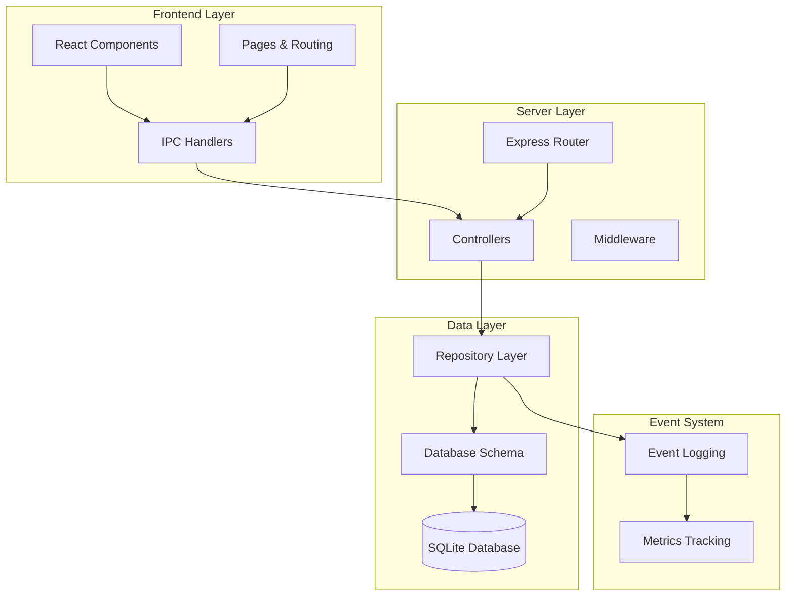
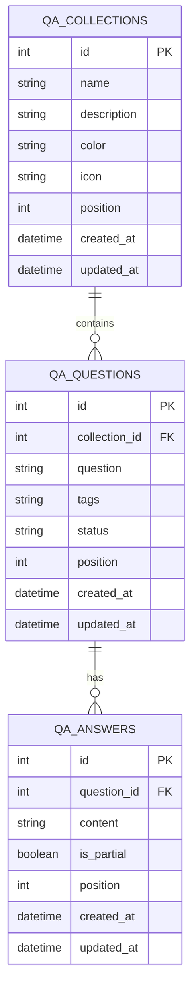
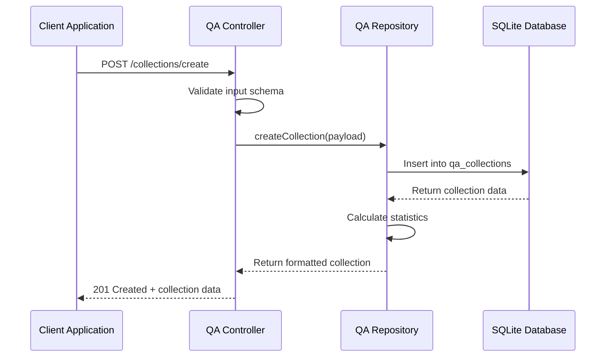
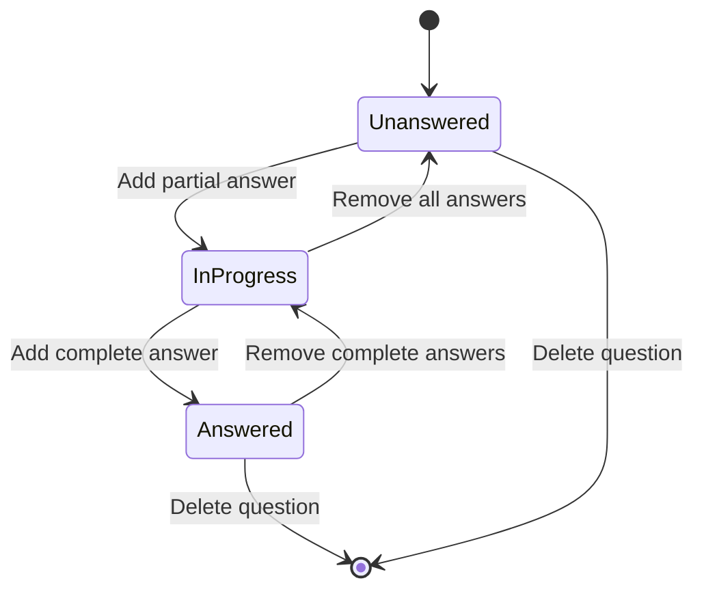
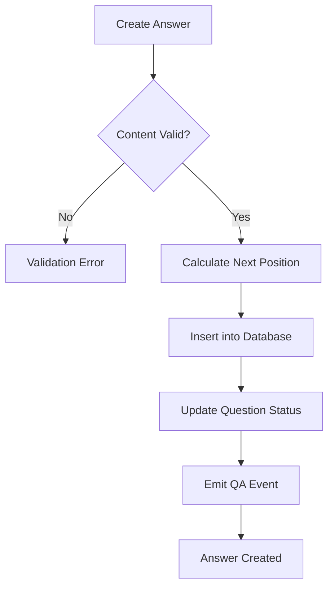
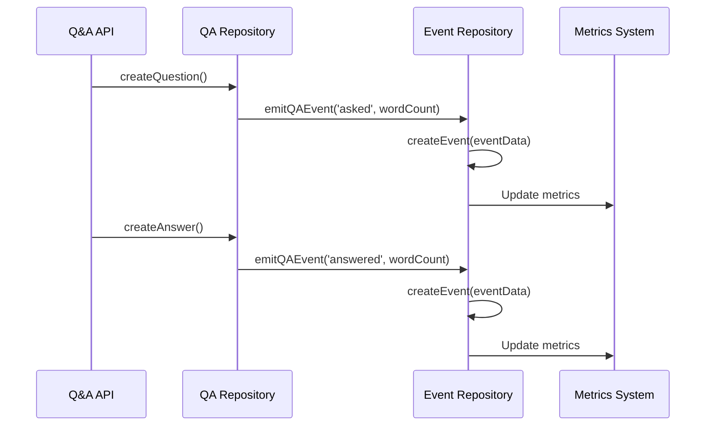
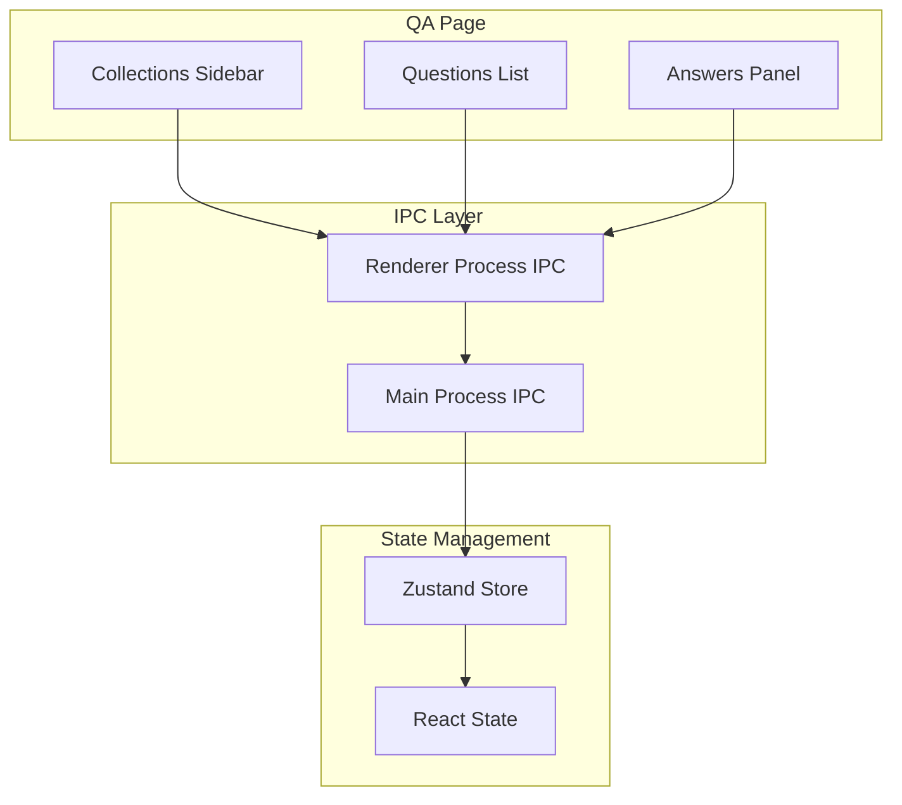

# Q&A API Documentation

<cite>
**Referenced Files in This Document**
- [qaRepo.ts](file://src/database/qaRepo.ts)
- [qaSchema.ts](file://src/database/qaSchema.ts)
- [qaController.ts](file://src/server/controllers/qaController.ts)
- [qa.ts](file://src/server/routes/qa.ts)
- [qa.ts](file://src/main/ipc/qa.ts)
- [QA.tsx](file://src/renderer/pages/QA.tsx)
- [QAStats.tsx](file://src/renderer/components/QAStats.tsx)
- [eventsRepo.ts](file://src/database/eventsRepo.ts)
- [README.md](file://README.md)
</cite>

## Table of Contents
1. [Introduction](#introduction)
2. [System Architecture](#system-architecture)
3. [Data Model](#data-model)
4. [API Endpoints](#api-endpoints)
5. [Collections Management](#collections-management)
6. [Questions Management](#questions-management)
7. [Answers Management](#answers-management)
8. [Status Tracking](#status-tracking)
9. [Event System](#event-system)
10. [Frontend Integration](#frontend-integration)
11. [Use Cases](#use-cases)
12. [Performance Considerations](#performance-considerations)
13. [Troubleshooting](#troubleshooting)

## Introduction

The Q&A API is a comprehensive knowledge management system built into LifeOS that enables users to organize questions and answers in a structured manner. It provides a hierarchical data model with collections (cards) to group related questions, multiple answers per question, and sophisticated status tracking for learning progress and knowledge gap identification.

The system supports both local-first operation and real-time synchronization between the Electron main process and renderer process, making it suitable for desktop productivity applications. It integrates seamlessly with LifeOS's broader ecosystem of productivity tools.

## System Architecture

The Q&A API follows a layered architecture pattern with clear separation between data persistence, business logic, and presentation layers.



**Diagram sources**
- [qa.ts](file://src/server/routes/qa.ts#L1-L28)
- [qaController.ts](file://src/server/controllers/qaController.ts#L1-L217)
- [qaRepo.ts](file://src/database/qaRepo.ts#L1-L540)

**Section sources**
- [qa.ts](file://src/server/routes/qa.ts#L1-L28)
- [qaController.ts](file://src/server/controllers/qaController.ts#L1-L217)
- [qaRepo.ts](file://src/database/qaRepo.ts#L1-L540)

## Data Model

The Q&A system uses a three-tier relational model with collections, questions, and answers that form a hierarchical structure.



**Diagram sources**
- [qaSchema.ts](file://src/database/qaSchema.ts#L10-L71)

### Status Types

The system defines three primary question statuses:

| Status | Description | Criteria |
|--------|-------------|----------|
| `unanswered` | No answers exist | No entries in qa_answers table |
| `in_progress` | Has partial answers | At least one answer marked as partial |
| `answered` | Has complete answers | At least one answer marked as complete |

**Section sources**
- [qaSchema.ts](file://src/database/qaSchema.ts#L64-L71)
- [qaRepo.ts](file://src/database/qaRepo.ts#L372-L395)

## API Endpoints

The Q&A API provides RESTful endpoints organized into collections, questions, answers, and status reporting.

### Collections Endpoints

| Method | Endpoint | Description |
|--------|----------|-------------|
| POST | `/api/qa/collections/create` | Create new collection |
| GET | `/api/qa/collections/:id` | Get specific collection |
| GET | `/api/qa/collections` | List all collections |
| PUT | `/api/qa/collections/:id` | Update collection |
| DELETE | `/api/qa/collections/:id` | Delete collection |

### Questions Endpoints

| Method | Endpoint | Description |
|--------|----------|-------------|
| POST | `/api/qa/questions/create` | Create new question |
| GET | `/api/qa/questions/:id` | Get specific question |
| GET | `/api/qa/questions` | List questions by collection |
| PUT | `/api/qa/questions/:id` | Update question |
| DELETE | `/api/qa/questions/:id` | Delete question |

### Answers Endpoints

| Method | Endpoint | Description |
|--------|----------|-------------|
| POST | `/api/qa/answers/create` | Create new answer |
| GET | `/api/qa/answers/:questionId` | List answers for question |
| PUT | `/api/qa/answers/:id` | Update answer |
| DELETE | `/api/qa/answers/:id` | Delete answer |

### Status Endpoint

| Method | Endpoint | Description |
|--------|----------|-------------|
| GET | `/api/qa/status` | Get Q&A system statistics |

**Section sources**
- [qa.ts](file://src/server/routes/qa.ts#L1-L28)
- [qaController.ts](file://src/server/controllers/qaController.ts#L1-L217)

## Collections Management

Collections serve as containers for organizing related questions, similar to flashcards in spaced repetition systems.

### Creating Collections

Collections support rich metadata including name, description, color coding, and icons for visual organization.



**Diagram sources**
- [qaController.ts](file://src/server/controllers/qaController.ts#L5-L12)
- [qaRepo.ts](file://src/database/qaRepo.ts#L100-L130)

### Collection Operations

Collections support CRUD operations with automatic position management and statistical calculations:

- **List Collections**: Returns all collections with computed statistics
- **Update Collection**: Supports partial updates with field validation
- **Delete Collection**: Cascades deletion to associated questions and answers
- **Statistics**: Automatically tracks question counts and answered ratios

**Section sources**
- [qaRepo.ts](file://src/database/qaRepo.ts#L100-L180)
- [qaController.ts](file://src/server/controllers/qaController.ts#L14-L60)

## Questions Management

Questions represent individual knowledge items within collections, supporting tagging, positioning, and status tracking.

### Question Lifecycle



**Diagram sources**
- [qaRepo.ts](file://src/database/qaRepo.ts#L372-L395)

### Question Creation and Metadata

Questions support rich metadata including tags for categorization and flexible positioning within collections.

**Section sources**
- [qaRepo.ts](file://src/database/qaRepo.ts#L182-L220)
- [qaController.ts](file://src/server/controllers/qaController.ts#L62-L90)

## Answers Management

The answer system supports both partial and complete answers, enabling incremental knowledge building and spaced repetition workflows.

### Answer Types

| Type | IsPartial | Use Case |
|------|-----------|----------|
| Partial | `true` | Initial thoughts, brainstorming, incomplete solutions |
| Complete | `false` | Final, comprehensive answers ready for review |

### Answer Positioning

Answers are ordered chronologically within questions, supporting revision tracking and learning progression.



**Diagram sources**
- [qaRepo.ts](file://src/database/qaRepo.ts#L420-L457)

**Section sources**
- [qaRepo.ts](file://src/database/qaRepo.ts#L420-L515)
- [qaController.ts](file://src/server/controllers/qaController.ts#L92-L160)

## Status Tracking

The status endpoint provides comprehensive analytics about Q&A system usage and knowledge acquisition progress.

### Statistics Breakdown

The system tracks multiple metrics for understanding learning patterns:

- **Total Questions**: Overall question inventory
- **Answer Rates**: Percentage of questions with complete answers
- **Status Distribution**: Unanswered, In Progress, Answered breakdown
- **Collection Statistics**: Per-collection question counts

### Answer Rate Calculation

The system calculates answer rates as a percentage of questions with at least one complete answer:

```
Answer Rate = (Answered Questions / Total Questions) × 100
```

**Section sources**
- [qaRepo.ts](file://src/database/qaRepo.ts#L517-L540)
- [qaController.ts](file://src/server/controllers/qaController.ts#L180-L217)

## Event System

The Q&A system integrates with LifeOS's event logging system to track user interactions and measure knowledge acquisition.

### Event Types

| Event Type | Trigger | Metadata |
|------------|---------|----------|
| `qa_asked` | Question creation | `{words: number}` |
| `qa_answered` | Answer creation | `{words: number}` |

### Event Processing

Events are processed through the event repository and contribute to metrics calculation:



**Diagram sources**
- [eventsRepo.ts](file://src/database/eventsRepo.ts#L120-L135)
- [qaRepo.ts](file://src/database/qaRepo.ts#L225-L230)

**Section sources**
- [eventsRepo.ts](file://src/database/eventsRepo.ts#L120-L135)
- [qaRepo.ts](file://src/database/qaRepo.ts#L225-L230)

## Frontend Integration

The Q&A system provides a comprehensive React-based interface with real-time synchronization between the main and renderer processes.

### Component Architecture



**Diagram sources**
- [QA.tsx](file://src/renderer/pages/QA.tsx#L1-L727)
- [qa.ts](file://src/main/ipc/qa.ts#L1-L124)

### Real-time Updates

The frontend maintains real-time synchronization through IPC handlers that mirror backend API calls:

- **Collection Management**: Create, update, delete collections
- **Question Management**: CRUD operations with immediate UI updates
- **Answer Management**: Live answer editing and status tracking
- **Statistics**: Real-time status updates and answer rate calculations

**Section sources**
- [QA.tsx](file://src/renderer/pages/QA.tsx#L1-L727)
- [qa.ts](file://src/main/ipc/qa.ts#L1-L124)

## Use Cases

The Q&A API supports various productivity and learning scenarios within the LifeOS ecosystem.

### Learning Progress Tracking

Track knowledge acquisition across different domains:

- **Subject Mastery**: Organize questions by academic subjects
- **Skill Development**: Track technical skill proficiency
- **Language Learning**: Build vocabulary and grammar knowledge
- **Professional Development**: Document industry-specific knowledge

### Knowledge Gap Identification

Identify areas requiring attention:

- **Unanswered Questions**: Highlight topics needing research
- **Incomplete Answers**: Focus on refining partial knowledge
- **Learning Patterns**: Analyze progress across different domains
- **Review Scheduling**: Plan spaced repetition sessions

### Integration Scenarios

The Q&A system integrates with other LifeOS modules:

- **Task Linking**: Connect questions to related tasks
- **Note Integration**: Reference notes in answers
- **Activity Tracking**: Monitor study session durations
- **Goal Setting**: Align Q&A progress with personal goals

### Study Session Management

Structure focused learning periods:

- **Flashcard Mode**: Rapid question-answer cycles
- **Deep Dives**: Comprehensive answer development
- **Review Sessions**: Systematic knowledge reinforcement
- **Progress Monitoring**: Track improvement over time

## Performance Considerations

The Q&A system is optimized for local-first operation with efficient indexing and query patterns.

### Database Optimization

- **Index Strategies**: Strategic indexes on foreign keys and frequently queried columns
- **Query Optimization**: Efficient joins for statistics calculations
- **Transaction Management**: Atomic operations for complex updates
- **Connection Pooling**: Single database connection for consistency

### Memory Management

- **Lazy Loading**: Load collections and questions on demand
- **Pagination**: Handle large datasets efficiently
- **Caching**: Cache frequently accessed statistics
- **Cleanup**: Automatic cleanup of orphaned records

### Scalability Limits

The system is designed for personal productivity with reasonable scalability:

- **Collection Limit**: Practical limit around 1000 collections
- **Question Limit**: Up to 50,000 questions per collection
- **Answer Limit**: Unlimited answers per question
- **Concurrent Users**: Single-user local-first design

## Troubleshooting

Common issues and their solutions when working with the Q&A API.

### Data Integrity Issues

**Problem**: Orphaned records appearing in statistics
**Solution**: Verify foreign key constraints and cascade deletions are properly configured

**Problem**: Incorrect status calculations
**Solution**: Check answer type classifications and update question status manually if needed

### Performance Issues

**Problem**: Slow loading of large collections
**Solution**: Implement pagination or lazy loading for collections with many questions

**Problem**: Slow answer retrieval
**Solution**: Verify indexes on question_id columns and optimize query patterns

### API Integration Issues

**Problem**: IPC communication failures
**Solution**: Check main process handler registration and renderer process API exposure

**Problem**: Validation errors in production
**Solution**: Review Zod schemas and ensure proper input sanitization

### Frontend Synchronization

**Problem**: UI not reflecting database changes
**Solution**: Verify IPC handler implementation and state management updates

**Problem**: Concurrent modification conflicts
**Solution**: Implement optimistic updates with conflict resolution strategies

**Section sources**
- [qaRepo.ts](file://src/database/qaRepo.ts#L1-L540)
- [qaController.ts](file://src/server/controllers/qaController.ts#L1-L217)