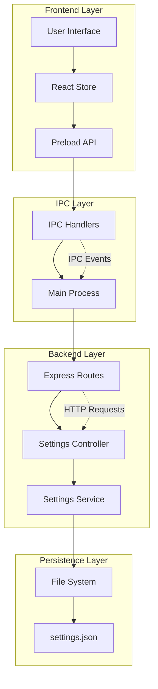
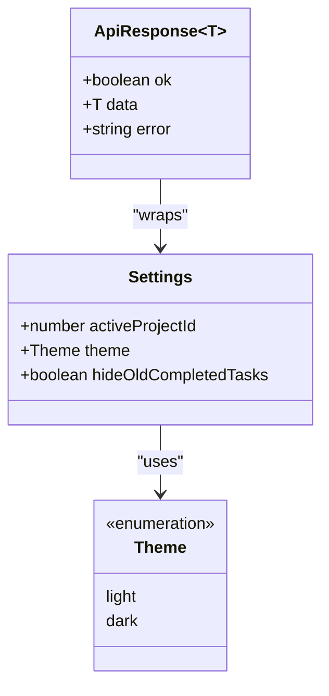
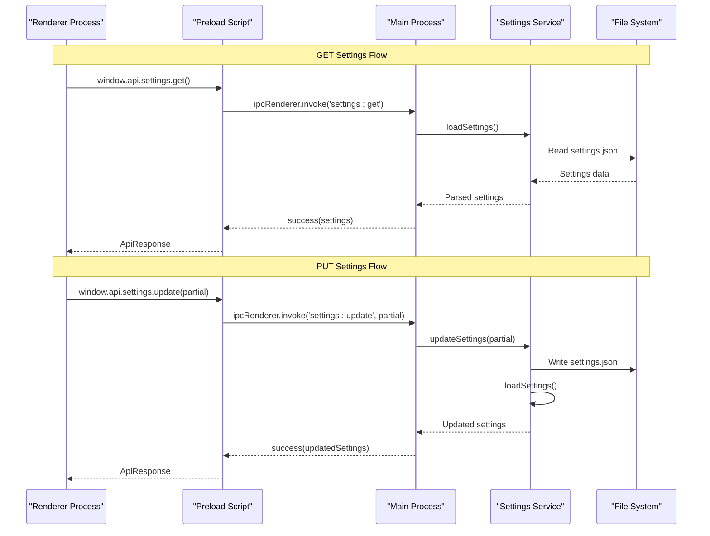
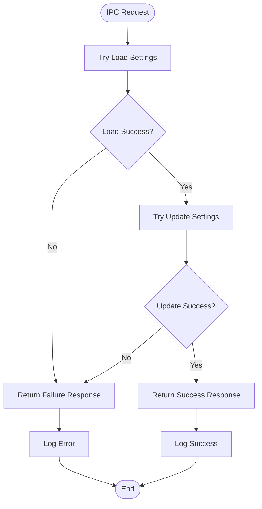
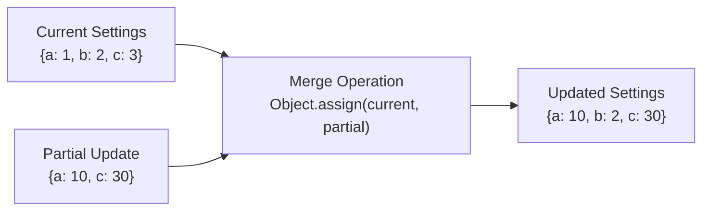

# Settings API

<cite>
**Referenced Files in This Document**
- [src/main/ipc/settings.ts](file://src/main/ipc/settings.ts)
- [src/server/controllers/settingsController.ts](file://src/server/controllers/settingsController.ts)
- [src/server/routes/settings.ts](file://src/server/routes/settings.ts)
- [src/services/settings.ts](file://src/services/settings.ts)
- [src/store/theme.ts](file://src/store/theme.ts)
- [src/preload/index.ts](file://src/preload/index.ts)
- [src/common/types.ts](file://src/common/types.ts)
- [src/main/utils/response.ts](file://src/main/utils/response.ts)
</cite>

## Table of Contents
1. [Introduction](#introduction)
2. [API Architecture](#api-architecture)
3. [Settings Data Structure](#settings-data-structure)
4. [General Settings Endpoints](#general-settings-endpoints)
5. [Theme Settings Endpoints](#theme-settings-endpoints)
6. [IPC Communication Flow](#ipc-communication-flow)
7. [Settings Persistence](#settings-persistence)
8. [Validation and Error Handling](#validation-and-error-handling)
9. [Partial Updates](#partial-updates)
10. [Usage Examples](#usage-examples)
11. [Troubleshooting](#troubleshooting)

## Introduction

The Settings API provides comprehensive endpoints for managing application preferences and theme configurations. It supports both general application settings and theme-specific settings with dedicated endpoints for each. The API follows RESTful principles and integrates seamlessly with the Electron application through Inter-Process Communication (IPC).

The settings system is designed to handle persistent configuration storage, real-time updates, and cross-platform compatibility. It supports both server-side Express routes for backend operations and Electron IPC handlers for frontend communication.

## API Architecture

The Settings API consists of multiple layers that work together to provide a robust configuration management system:



**Diagram sources**
- [src/main/ipc/settings.ts](file://src/main/ipc/settings.ts#L1-L28)
- [src/server/routes/settings.ts](file://src/server/routes/settings.ts#L1-L17)
- [src/services/settings.ts](file://src/services/settings.ts#L1-L46)

**Section sources**
- [src/main/ipc/settings.ts](file://src/main/ipc/settings.ts#L1-L28)
- [src/server/routes/settings.ts](file://src/server/routes/settings.ts#L1-L17)

## Settings Data Structure

The settings system uses a TypeScript interface to define the structure of configuration objects:



**Diagram sources**
- [src/services/settings.ts](file://src/services/settings.ts#L5-L9)
- [src/common/types.ts](file://src/common/types.ts#L1-L117)

### Available Settings Properties

| Property | Type | Description | Default Value |
|----------|------|-------------|---------------|
| `activeProjectId` | `number \| undefined` | Currently active project identifier | `undefined` |
| `theme` | `'light' \| 'dark'` | Application theme preference | `'light'` |
| `hideOldCompletedTasks` | `boolean` | Whether to hide old completed tasks | `false` |

**Section sources**
- [src/services/settings.ts](file://src/services/settings.ts#L5-L9)

## General Settings Endpoints

### GET /api/settings

Retrieves all current application settings.

**Endpoint:** `GET /api/settings`

**Response Format:**
```json
{
  "data": {
    "activeProjectId": 123,
    "theme": "dark",
    "hideOldCompletedTasks": true
  }
}
```

**Implementation Details:**
- Loads settings from the persistent JSON file
- Returns all configured settings regardless of which ones are set
- Handles missing or corrupted files gracefully by returning empty settings

### PUT /api/settings

Updates multiple settings properties atomically.

**Endpoint:** `PUT /api/settings`

**Request Body:**
```json
{
  "activeProjectId": 456,
  "hideOldCompletedTasks": false
}
```

**Response Format:**
```json
{
  "data": {
    "activeProjectId": 456,
    "theme": "dark",
    "hideOldCompletedTasks": false
  }
}
```

**Key Features:**
- Supports partial updates (only specified properties are changed)
- Preserves existing settings not included in the request
- Validates all properties before applying changes
- Returns the complete updated settings object

**Section sources**
- [src/server/controllers/settingsController.ts](file://src/server/controllers/settingsController.ts#L4-L53)
- [src/server/routes/settings.ts](file://src/server/routes/settings.ts#L5-L7)

## Theme Settings Endpoints

### GET /api/settings/theme

Retrieves the current theme configuration.

**Endpoint:** `GET /api/settings/theme`

**Response Format:**
```json
{
  "data": {
    "theme": "dark"
  }
}
```

**Default Behavior:**
- Returns `"light"` if theme is not explicitly set
- Ensures backward compatibility with older settings files

### PUT /api/settings/theme

Updates the theme preference with validation.

**Endpoint:** `PUT /api/settings/theme`

**Request Body:**
```json
{
  "theme": "dark"
}
```

**Validation Rules:**
- `theme` property is required
- Must be either `"light"` or `"dark"`
- Case-sensitive validation enforced

**Response Format:**
```json
{
  "data": {
    "theme": "dark"
  }
}
```

**Error Response:**
```json
{
  "error": {
    "code": "VALIDATION_ERROR",
    "message": "Invalid theme. Must be \"light\" or \"dark\""
  }
}
```

**Section sources**
- [src/server/controllers/settingsController.ts](file://src/server/controllers/settingsController.ts#L18-L53)
- [src/server/routes/settings.ts](file://src/server/routes/settings.ts#L9-L16)

## IPC Communication Flow

The Settings API uses Electron's Inter-Process Communication (IPC) to enable seamless communication between the main and renderer processes:



**Diagram sources**
- [src/main/ipc/settings.ts](file://src/main/ipc/settings.ts#L5-L26)
- [src/preload/index.ts](file://src/preload/index.ts#L65-L69)

### IPC Handler Registration

The IPC handlers are automatically registered when the settings module is loaded:

**Section sources**
- [src/main/ipc/settings.ts](file://src/main/ipc/settings.ts#L1-L28)
- [src/main/index.ts](file://src/main/index.ts#L14-L22)

## Settings Persistence

Settings are persisted to a JSON file in the Electron application's user data directory:

### Storage Location
- **Development:** `{project_root}/userData/lifeos/settings.json`
- **Production:** `{app_data}/lifeos/settings.json`

### File Structure
```json
{
  "activeProjectId": 123,
  "theme": "dark",
  "hideOldCompletedTasks": true
}
```

### Persistence Mechanism
1. **Atomic Operations:** Settings are written as complete objects to prevent corruption
2. **Backup Safety:** JSON formatting with indentation for readability
3. **Error Handling:** Graceful fallback to empty settings if file is corrupted
4. **Directory Creation:** Automatically creates the settings directory if it doesn't exist

**Section sources**
- [src/services/settings.ts](file://src/services/settings.ts#L11-L45)

## Validation and Error Handling

### Server-Side Validation

The Express controller implements comprehensive validation:

#### Theme Validation
- **Required Field:** `theme` property must be present
- **Enum Validation:** Must be exactly `"light"` or `"dark"`
- **Case Sensitivity:** Validation is case-sensitive
- **Error Response:** Returns structured error with `VALIDATION_ERROR` code

#### General Settings Validation
- **Type Safety:** Uses TypeScript interfaces for compile-time validation
- **Partial Updates:** Allows updating individual properties
- **Graceful Degradation:** Handles missing or malformed settings files

### IPC Error Handling

The IPC layer provides robust error handling:



**Diagram sources**
- [src/main/ipc/settings.ts](file://src/main/ipc/settings.ts#L6-L25)
- [src/main/utils/response.ts](file://src/main/utils/response.ts#L1-L37)

**Section sources**
- [src/server/controllers/settingsController.ts](file://src/server/controllers/settingsController.ts#L32-L42)
- [src/main/utils/response.ts](file://src/main/utils/response.ts#L1-L37)

## Partial Updates

The settings system supports partial updates, allowing clients to modify individual properties without affecting others:

### Implementation Pattern



**Diagram sources**
- [src/services/settings.ts](file://src/services/settings.ts#L40-L45)

### Benefits of Partial Updates
- **Efficiency:** Only modified properties are saved
- **Safety:** Unspecified properties remain unchanged
- **Flexibility:** Clients can update individual settings independently
- **Consistency:** Maintains atomicity of settings operations

**Section sources**
- [src/services/settings.ts](file://src/services/settings.ts#L40-L45)
- [src/server/controllers/settingsController.ts](file://src/server/controllers/settingsController.ts#L11-L16)

## Usage Examples

### Basic Settings Retrieval

**HTTP Request:**
```bash
curl -X GET http://localhost:3000/api/settings
```

**HTTP Response:**
```json
{
  "data": {
    "theme": "dark",
    "hideOldCompletedTasks": false
  }
}
```

### Updating Multiple Settings

**HTTP Request:**
```bash
curl -X PUT http://localhost:3000/api/settings \
  -H "Content-Type: application/json" \
  -d '{
    "theme": "light",
    "hideOldCompletedTasks": true
  }'
```

**HTTP Response:**
```json
{
  "data": {
    "theme": "light",
    "hideOldCompletedTasks": true
  }
}
```

### Theme-Specific Updates

**HTTP Request:**
```bash
curl -X PUT http://localhost:3000/api/settings/theme \
  -H "Content-Type: application/json" \
  -d '{"theme": "dark"}'
```

**HTTP Response:**
```json
{
  "data": {
    "theme": "dark"
  }
}
```

### Frontend JavaScript Example

Using the preload API wrapper:

```javascript
// Get current settings
const response = await window.api.settings.get();
if (response.ok) {
  console.log('Current settings:', response.data);
}

// Update theme
const updateResponse = await window.api.settings.update({ theme: 'dark' });
if (updateResponse.ok) {
  console.log('Theme updated successfully');
}
```

**Section sources**
- [src/preload/index.ts](file://src/preload/index.ts#L65-L69)

## Troubleshooting

### Common Issues and Solutions

#### Settings File Corruption
**Symptoms:** Settings not persisting or loading incorrectly
**Solution:** The system automatically falls back to empty settings and creates a new file

#### Permission Errors
**Symptoms:** Settings cannot be saved
**Cause:** Insufficient permissions to write to the user data directory
**Solution:** Verify application has write permissions to the Electron userData folder

#### Validation Failures
**Symptoms:** 400 Bad Request responses for theme updates
**Cause:** Invalid theme value (not "light" or "dark")
**Solution:** Ensure theme value is exactly "light" or "dark" (case-sensitive)

#### IPC Communication Issues
**Symptoms:** Settings updates not reflected in the UI
**Cause:** IPC handler not registered or preload script not loaded
**Solution:** Verify IPC handlers are registered in the main process and preload API is exposed

### Debug Information

Enable debug logging to troubleshoot settings-related issues:

```javascript
// Enable debug mode in the settings service
console.log('Settings path:', settingsService.getSettingsPath());
console.log('Current settings:', settingsService.loadSettings());
```

**Section sources**
- [src/services/settings.ts](file://src/services/settings.ts#L20-L30)
- [src/main/utils/response.ts](file://src/main/utils/response.ts#L20-L37)