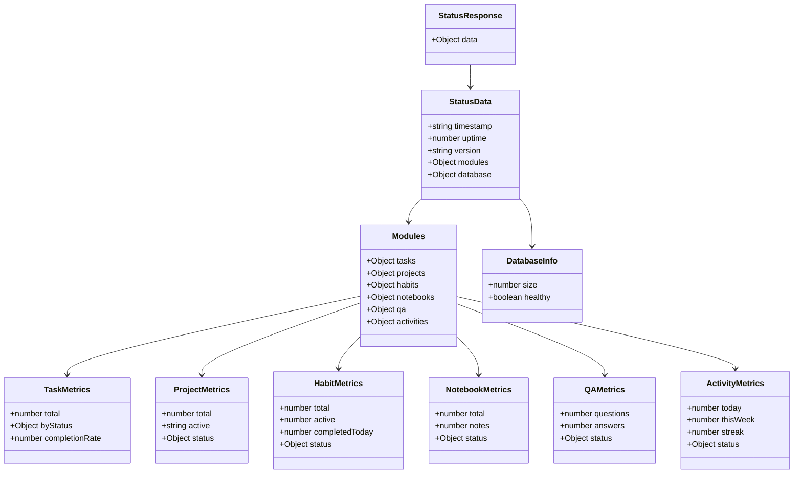
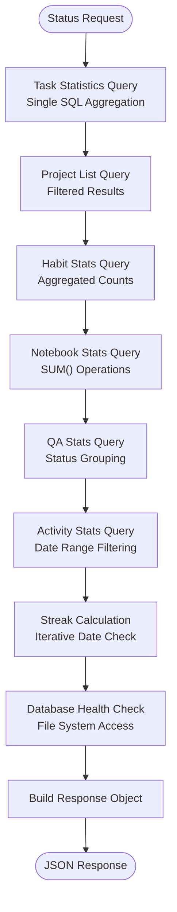

# Status API Documentation

<cite>
**Referenced Files in This Document**
- [statusController.ts](file://src/server/controllers/statusController.ts)
- [status.ts](file://src/server/routes/status.ts)
- [mcp-server.ts](file://src/server/mcp-server.ts)
- [tasksRepo.ts](file://src/database/tasksRepo.ts)
- [projectsRepo.ts](file://src/database/projectsRepo.ts)
- [habitsRepo.ts](file://src/database/habitsRepo.ts)
- [notebookRepo.ts](file://src/database/notebookRepo.ts)
- [qaRepo.ts](file://src/database/qaRepo.ts)
- [activitiesRepo.ts](file://src/database/activitiesRepo.ts)
- [init.ts](file://src/database/init.ts)
- [settings.ts](file://src/services/settings.ts)
- [package.json](file://package.json)
- [types.ts](file://src/common/types.ts)
</cite>

## Table of Contents
1. [Introduction](#introduction)
2. [Endpoint Overview](#endpoint-overview)
3. [Response Schema](#response-schema)
4. [Module Metrics Calculation](#module-metrics-calculation)
5. [Database Health Monitoring](#database-health-monitoring)
6. [Performance Considerations](#performance-considerations)
7. [External Tool Integration](#external-tool-integration)
8. [Version Management](#version-management)
9. [Error Handling](#error-handling)
10. [Monitoring Best Practices](#monitoring-best-practices)

## Introduction

The Status API endpoint (`GET /api/status`) provides a comprehensive system overview for LifeOS applications. This endpoint aggregates metrics from all major modules (tasks, projects, habits, notebooks, Q&A, activities) and offers real-time insights into application health and performance. Designed for monitoring systems, external tools, and automated health checks, it delivers a unified view of the application's operational state.

The endpoint serves as a centralized monitoring solution that enables administrators and monitoring tools to assess system performance, track usage patterns, and detect potential issues across all LifeOS modules.

## Endpoint Overview

### Base URL
```
GET /api/status
```

### Authentication
- **Required**: No authentication needed for status endpoint
- **Purpose**: Public health check endpoint for monitoring systems

### Response Format
The endpoint returns a JSON object containing system status, metrics, and health indicators:

```json
{
  "data": {
    "timestamp": "2024-01-15T10:30:00.000Z",
    "uptime": 3600,
    "version": "0.1.12",
    "modules": {
      "tasks": {...},
      "projects": {...},
      "habits": {...},
      "notebooks": {...},
      "qa": {...},
      "activities": {...}
    },
    "database": {
      "size": 1048576,
      "healthy": true
    }
  }
}
```

**Section sources**
- [statusController.ts](file://src/server/controllers/statusController.ts#L11-L151)
- [status.ts](file://src/server/routes/status.ts#L1-L8)

## Response Schema

The Status API response follows a structured schema designed to provide comprehensive system insights:



**Diagram sources**
- [statusController.ts](file://src/server/controllers/statusController.ts#L118-L149)

### Core Fields

| Field | Type | Description |
|-------|------|-------------|
| `timestamp` | string | ISO 8601 formatted current timestamp |
| `uptime` | number | Application uptime in seconds |
| `version` | string | Current application version from package.json |

### Module Metrics

Each module provides specific metrics tailored to its functionality:

#### Tasks Module
- **Total Tasks**: Complete count of all tasks
- **Status Distribution**: Breakdown by status (Backlog, To-Do, In Progress, Completed)
- **Completion Rate**: Percentage of completed vs. total tasks

#### Projects Module
- **Total Projects**: Count of all projects
- **Active Project**: Currently selected active project name
- **Active Project ID**: UUID of active project

#### Habits Module
- **Total Habits**: Number of configured habits
- **Active Habits**: Active habits (not archived)
- **Completed Today**: Habits completed today
- **Average Completion Rate**: Mean completion rate across all habits

#### Notebooks Module
- **Total Notebooks**: Number of notebook collections
- **Total Notes**: Total notes across all notebooks
- **Word Count**: Aggregate word count of all notes
- **Recent Notes**: New notes created in last 7 days

#### Q&A Module
- **Questions**: Total questions asked
- **Answers**: Total answers provided
- **Status Breakdown**: Unanswered, in-progress, and answered questions

#### Activities Module
- **Today's Activities**: Activities logged today
- **Weekly Activities**: Activities in last 7 days
- **Current Streak**: Consecutive days with activities
- **Activity Types**: Distribution by activity type

### Database Information

| Field | Type | Description |
|-------|------|-------------|
| `size` | number | Database file size in bytes |
| `healthy` | boolean | Database connectivity and integrity status |

**Section sources**
- [statusController.ts](file://src/server/controllers/statusController.ts#L118-L149)

## Module Metrics Calculation

### Task Statistics Calculation

The task metrics are calculated using SQL aggregation queries that provide real-time statistics:

```sql
SELECT
  COUNT(*) as total,
  SUM(CASE WHEN status = 'Backlog' THEN 1 ELSE 0 END) as backlog,
  SUM(CASE WHEN status = 'To-Do' THEN 1 ELSE 0 END) as todo,
  SUM(CASE WHEN status = 'In Progress' THEN 1 ELSE 0 END) as in_progress,
  SUM(CASE WHEN status = 'Completed' THEN 1 ELSE 0 END) as completed
FROM tasks
```

**Completion Rate Formula**:
```
completionRate = (completedTasks / totalTasks) × 100
```

### Habit Statistics Calculation

Habit metrics involve complex calculations including streak detection and completion rates:

```sql
SELECT
  (SELECT COUNT(*) FROM habits) as total_habits,
  (SELECT COUNT(*) FROM habits WHERE archived_at IS NULL) as active_habits,
  (SELECT COUNT(DISTINCT habit_id) FROM habit_logs WHERE logged_date = ?) as completed_today
```

**Streak Calculation Algorithm**:
1. Sort habit logs by date in descending order
2. Check consecutive dates from today backward
3. Count consecutive days with completions
4. Track longest streak observed

**Completion Rate Calculation**:
```
completionRate = (days_completed / days_considered) × 100
```

### Notebook Statistics Calculation

Notebook metrics aggregate across all notebooks and notes:

```sql
SELECT
  (SELECT COUNT(*) FROM notebooks) as total_notebooks,
  (SELECT COUNT(*) FROM notes) as total_notes,
  (SELECT COALESCE(SUM(word_count), 0) FROM notes) as total_words,
  (SELECT COUNT(*) FROM notes WHERE created_at >= datetime('now', '-7 days')) as recent_notes
```

### Activity Statistics Calculation

Activity metrics provide temporal insights:

```sql
SELECT
  COUNT(*) as count,
  type,
  COUNT(*) as count
FROM activities
GROUP BY type
```

**Streak Detection Logic**:
1. Start from current date
2. Check daily activity counts
3. Count consecutive days with activity
4. Stop when no activity found

**Section sources**
- [statusController.ts](file://src/server/controllers/statusController.ts#L18-L117)
- [tasksRepo.ts](file://src/database/tasksRepo.ts#L55-L65)
- [habitsRepo.ts](file://src/database/habitsRepo.ts#L375-L394)
- [notebookRepo.ts](file://src/database/notebookRepo.ts#L380-L399)
- [activitiesRepo.ts](file://src/database/activitiesRepo.ts#L75-L105)

## Database Health Monitoring

### Size Monitoring

The database size is monitored by checking the physical file size:

```typescript
const dbPath = path.join(app.getPath('userData'), 'lifeos', 'app.db');
if (fs.existsSync(dbPath)) {
  const stats = fs.statSync(dbPath);
  dbSize = stats.size;
}
```

### Health Validation

Database health is validated through multiple approaches:

1. **File Existence Check**: Verify database file exists
2. **Connection Test**: Attempt database operations
3. **Integrity Verification**: Check for corruption
4. **Performance Metrics**: Monitor query response times

### Health Indicators

| Metric | Threshold | Action |
|--------|-----------|---------|
| Database Size | > 1GB | Alert administrator |
| Query Response | > 100ms | Log performance issue |
| Connection Failures | > 3 attempts | Restart service |

**Section sources**
- [statusController.ts](file://src/server/controllers/statusController.ts#L95-L117)
- [init.ts](file://src/database/init.ts#L15-L35)

## Performance Considerations

### Query Optimization

The status endpoint executes multiple database queries, each optimized for performance:



**Diagram sources**
- [statusController.ts](file://src/server/controllers/statusController.ts#L18-L117)

### Performance Impact Analysis

| Operation | Complexity | Impact Factor |
|-----------|------------|---------------|
| Task Statistics | O(n) | Low - Single query |
| Habit Streaks | O(d) | Medium - Daily iteration |
| Activity Streaks | O(d) | Medium - Daily iteration |
| Database Size | O(1) | Minimal - File stat |
| Total Calculation | O(n+d) | Medium - Multiple operations |

### Caching Strategies

While the current implementation doesn't include caching, several caching strategies could be implemented:

1. **Time-based Caching**: Cache results for 30-60 seconds
2. **Event-driven Updates**: Invalidate cache on data changes
3. **Incremental Updates**: Update only changed metrics
4. **Distributed Caching**: Store in Redis for multi-instance setups

### Scalability Considerations

For large datasets (>100K records), consider:

- Pagination for activity history
- Sampling for trend calculations
- Background metric calculation
- Asynchronous updates

**Section sources**
- [statusController.ts](file://src/server/controllers/statusController.ts#L18-L117)

## External Tool Integration

### Monitoring System Integration

External monitoring tools can leverage the Status API for comprehensive system oversight:

```yaml
# Example Prometheus configuration
scrape_configs:
  - job_name: 'lifeos-status'
    static_configs:
      - targets: ['localhost:3000']
    metrics_path: '/api/status'
    scrape_interval: 30s
```

### Dashboard Integration

Key metrics for dashboard visualization:

| Metric | Chart Type | Purpose |
|--------|------------|---------|
| Uptime | Gauge | Service availability |
| Task Completion Rate | Line Chart | Productivity trends |
| Database Size | Time Series | Storage growth |
| Active Habits | Bar Chart | Engagement level |
| Activity Streak | Gauge | Consistency measure |

### Alerting Rules

Recommended alerting thresholds:

```yaml
groups:
  - name: lifeos.rules
    rules:
      - alert: LifeOSDatabaseLarge
        expr: lifeos_database_size_bytes > 1073741824
        for: 5m
        labels:
          severity: warning
        annotations:
          summary: "LifeOS database size exceeded 1GB"
          
      - alert: LifeOSHighTaskCompletion
        expr: lifeos_task_completion_rate > 90
        for: 1h
        labels:
          severity: info
        annotations:
          summary: "High task completion rate detected"
```

### API Client Examples

#### Python Client
```python
import requests
import json

def get_lifeos_status(base_url):
    """Fetch LifeOS status with business insights."""
    response = requests.get(f"{base_url}/api/status")
    data = response.json()['data']
    
    # Business insights extraction
    insights = {
        'uptime_hours': data['uptime'] / 3600,
        'productivity_score': calculate_productivity_score(data),
        'engagement_level': assess_engagement(data),
        'system_health': 'healthy' if data['database']['healthy'] else 'degraded'
    }
    
    return insights
```

#### JavaScript Client
```javascript
async function monitorLifeOS(baseURL) {
    try {
        const response = await fetch(`${baseURL}/api/status`);
        const { data } = await response.json();
        
        // Real-time monitoring
        console.log(`System Uptime: ${Math.floor(data.uptime / 3600)} hours`);
        console.log(`Active Projects: ${data.modules.projects.total}`);
        console.log(`Daily Activity: ${data.modules.activities.today}`);
        
        return data;
    } catch (error) {
        console.error('Failed to fetch LifeOS status:', error);
        return null;
    }
}
```

**Section sources**
- [statusController.ts](file://src/server/controllers/statusController.ts#L11-L151)

## Version Management

### Version Population

The application version is populated from the package.json file:

```typescript
version: require('../../../package.json').version
```

### Version Tracking

| Source | Location | Format |
|--------|----------|--------|
| Package Manifest | `package.json` | Semantic Versioning (SemVer) |
| Build System | CI/CD Pipeline | Automated version increment |
| Runtime | Status Endpoint | Direct file reading |

### Version Update Process

1. **Development**: Manual version bump in package.json
2. **CI/CD**: Automated build with version tag
3. **Distribution**: Version embedded in build artifacts
4. **Runtime**: Version exposed via status endpoint

### Version Compatibility

The status endpoint maintains backward compatibility:

- **Major Version**: Breaking changes require migration
- **Minor Version**: New features without breaking changes
- **Patch Version**: Bug fixes and minor improvements

**Section sources**
- [statusController.ts](file://src/server/controllers/statusController.ts#L105)
- [package.json](file://package.json#L2)

## Error Handling

### Exception Management

The status controller implements comprehensive error handling:

```typescript
try {
  // Database operations
  // Metric calculations
  // Response construction
  res.json({ data: status });
} catch (error) {
  next(error);
}
```

### Error Categories

| Error Type | Cause | Response |
|------------|-------|----------|
| Database Error | Connection failure | Graceful degradation |
| Query Timeout | Large dataset | Partial results |
| File System Error | Missing database | Health indicator |
| Memory Error | Insufficient resources | Reduced metrics |

### Error Recovery Strategies

1. **Graceful Degradation**: Return available metrics
2. **Fallback Values**: Use cached or default values
3. **Health Indicators**: Mark affected modules as unhealthy
4. **Logging**: Comprehensive error logging for debugging

### Monitoring Integration

Errors are automatically logged and can be monitored:

```typescript
logger.error('Failed to calculate status metrics', error);
```

**Section sources**
- [statusController.ts](file://src/server/controllers/statusController.ts#L149-L151)

## Monitoring Best Practices

### Health Check Implementation

#### Basic Health Check
```bash
curl -f http://localhost:3000/api/status || echo "Service unhealthy"
```

#### Advanced Monitoring Script
```bash
#!/bin/bash
# LifeOS Health Check Script

BASE_URL="http://localhost:3000"
TIMEOUT=5

# Fetch status with timeout
STATUS=$(timeout $TIMEOUT curl -s "$BASE_URL/api/status")

if [ $? -ne 0 ]; then
    echo "ERROR: Service timeout"
    exit 1
fi

# Parse JSON
UPTIME=$(echo $STATUS | jq '.data.uptime')
VERSION=$(echo $STATUS | jq '.data.version')
DB_HEALTH=$(echo $STATUS | jq '.data.database.healthy')

# Business logic validation
if [ "$DB_HEALTH" != "true" ]; then
    echo "WARNING: Database health degraded"
fi

if [ $UPTIME -lt 300 ]; then
    echo "INFO: Service recently restarted (<5 minutes)"
fi

echo "OK: Service healthy (v$VERSION, uptime: $(($UPTIME/3600))h)"
```

### Alert Configuration

#### Critical Alerts
- Database connection failures
- Service downtime (>5 minutes)
- Excessive database growth (>500MB/day)

#### Warning Alerts
- High task completion rates (>90%)
- Low activity streaks (<3 days)
- Increasing database size trends

### Performance Baselines

Establish baseline metrics for comparison:

| Metric | Normal Range | Warning Threshold | Critical Threshold |
|--------|--------------|-------------------|-------------------|
| Uptime | > 24 hours | < 1 hour | Service restart |
| Task Completion | 60-80% | < 40% | Productivity dip |
| Database Size | < 500MB | > 1GB | Storage warning |
| Activity Streak | 5-7 days | < 3 days | Engagement drop |

### Business Insights Extraction

The status data provides valuable business insights:

```javascript
function extractInsights(statusData) {
    const insights = {
        // Productivity metrics
        dailyEfficiency: calculateDailyEfficiency(statusData),
        weeklyTrends: analyzeWeeklyTrends(statusData),
        
        // Engagement metrics
        habitEngagement: assessHabitEngagement(statusData),
        noteCreationRate: calculateNoteRate(statusData),
        
        // System health
        performanceScore: calculatePerformanceScore(statusData),
        reliabilityIndex: assessReliability(statusData)
    };
    
    return insights;
}
```

### Integration Patterns

#### Grafana Dashboard Setup
1. Create data source pointing to `/api/status`
2. Configure templating for dynamic queries
3. Build panels for key metrics
4. Set up alerting rules

#### Prometheus Integration
1. Create custom exporter script
2. Expose metrics in Prometheus format
3. Configure scraping intervals
4. Set up alertmanager notifications

**Section sources**
- [mcp-server.ts](file://src/server/mcp-server.ts#L35-L45)