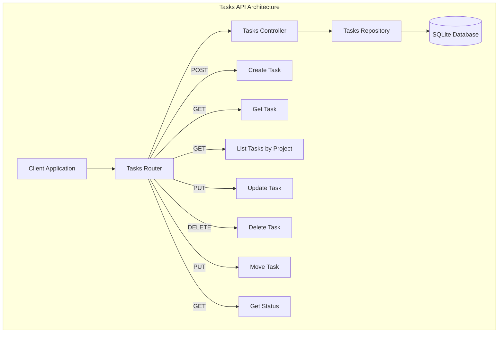
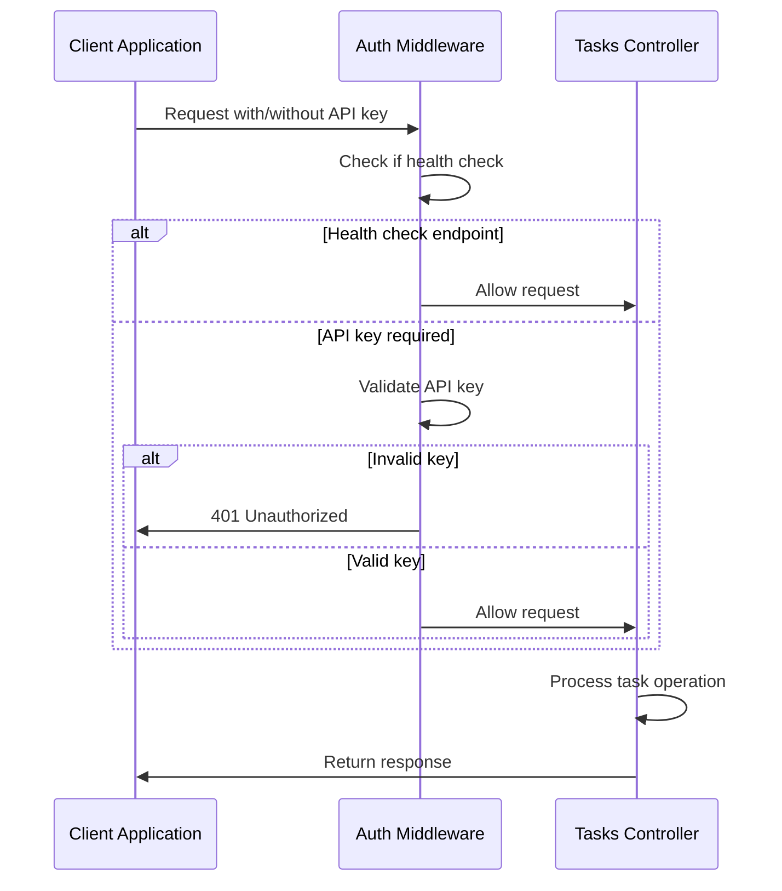
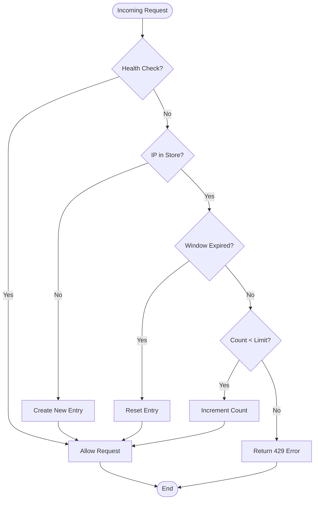
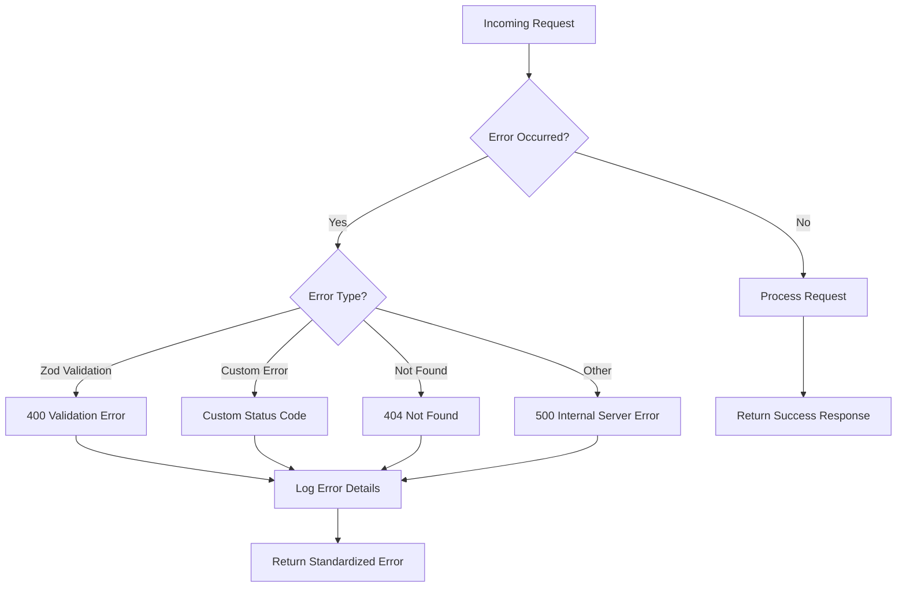
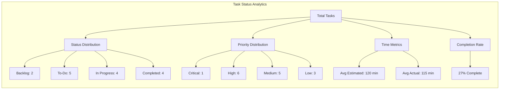
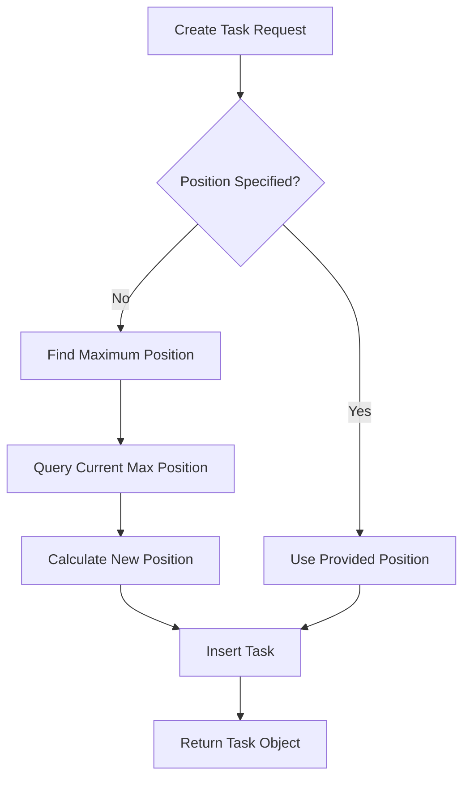
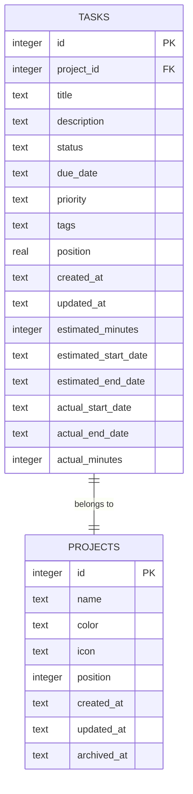

# Tasks API

<cite>
**Referenced Files in This Document**
- [src/server/routes/tasks.ts](file://src/server/routes/tasks.ts)
- [src/server/controllers/tasksController.ts](file://src/server/controllers/tasksController.ts)
- [src/database/tasksRepo.ts](file://src/database/tasksRepo.ts)
- [src/database/types.ts](file://src/database/types.ts)
- [src/common/types.ts](file://src/common/types.ts)
- [AI/mcp.md](file://AI/mcp.md)
- [src/server/middleware/auth.ts](file://src/server/middleware/auth.ts)
- [src/server/middleware/rateLimiter.ts](file://src/server/middleware/rateLimiter.ts)
- [src/server/middleware/errorHandler.ts](file://src/server/middleware/errorHandler.ts)
- [src/server/mcp-server.ts](file://src/server/mcp-server.ts)
</cite>

## Table of Contents
1. [Introduction](#introduction)
2. [API Overview](#api-overview)
3. [Authentication and Security](#authentication-and-security)
4. [Rate Limiting](#rate-limiting)
5. [Error Handling](#error-handling)
6. [Task Schema](#task-schema)
7. [Endpoint Reference](#endpoint-reference)
8. [Request/Response Examples](#requestresponse-examples)
9. [Status Endpoint](#status-endpoint)
10. [Task Reordering and Project Association](#task-reordering-and-project-association)
11. [Database Schema](#database-schema)
12. [Best Practices](#best-practices)

## Introduction

The Tasks API provides comprehensive CRUD operations for managing tasks within the LifeOS ecosystem. Built on Express.js with TypeScript, the API offers RESTful endpoints for task creation, retrieval, updates, deletion, and status reporting. The API follows the Model Context Protocol (MCP) specification and integrates with LifeOS's database layer for persistent storage.

## API Overview

The Tasks API consists of seven primary endpoints organized under the `/api/tasks` base path. Each endpoint handles specific task management operations with standardized request/response patterns and comprehensive error handling.



**Diagram sources**
- [src/server/routes/tasks.ts](file://src/server/routes/tasks.ts#L1-L26)
- [src/server/controllers/tasksController.ts](file://src/server/controllers/tasksController.ts#L1-L140)
- [src/database/tasksRepo.ts](file://src/database/tasksRepo.ts#L1-L211)

**Section sources**
- [src/server/routes/tasks.ts](file://src/server/routes/tasks.ts#L1-L26)
- [src/server/controllers/tasksController.ts](file://src/server/controllers/tasksController.ts#L1-L140)

## Authentication and Security

The Tasks API implements a flexible authentication system designed for local development and secure production deployments.

### Local Development Mode
- **Default**: No authentication required
- **Access**: Binds to `localhost:3000` by default
- **Security**: Suitable for development environments only

### Production Mode
- **API Key Required**: Configure via `MCP_API_KEY` environment variable
- **Header Format**: `X-API-Key: your-secret-key`
- **Validation**: Strict key comparison with case-sensitive matching

### Authentication Flow



**Diagram sources**
- [src/server/middleware/auth.ts](file://src/server/middleware/auth.ts#L1-L27)

**Section sources**
- [src/server/middleware/auth.ts](file://src/server/middleware/auth.ts#L1-L27)

## Rate Limiting

The API implements sliding window rate limiting to prevent abuse and ensure fair resource allocation.

### Configuration
- **Default Limit**: 100 requests per minute
- **Customizable**: Set via `MCP_RATE_LIMIT` environment variable
- **Window Duration**: 60-second sliding window
- **Scope**: IP-based rate limiting

### Rate Limit Headers

All responses include rate limiting headers for client-side consumption:

| Header | Description |
|--------|-------------|
| `X-RateLimit-Limit` | Maximum requests allowed in window |
| `X-RateLimit-Remaining` | Requests remaining in current window |
| `X-RateLimit-Reset` | Unix timestamp when window resets |
| `Retry-After` | Seconds until rate limit resets |

### Rate Limiting Behavior



**Diagram sources**
- [src/server/middleware/rateLimiter.ts](file://src/server/middleware/rateLimiter.ts#L1-L70)

**Section sources**
- [src/server/middleware/rateLimiter.ts](file://src/server/middleware/rateLimiter.ts#L1-L70)

## Error Handling

The API implements comprehensive error handling with standardized error responses and appropriate HTTP status codes.

### Standard Error Response Format

```typescript
{
  error: {
    code: string;
    message: string;
    details?: any;
  }
}
```

### Error Types and HTTP Status Codes

| Error Type | HTTP Status | Description |
|------------|-------------|-------------|
| `VALIDATION_ERROR` | 400 | Invalid request data |
| `UNAUTHORIZED` | 401 | Missing or invalid API key |
| `NOT_FOUND` | 404 | Resource not found |
| `RATE_LIMIT_EXCEEDED` | 429 | Too many requests |
| `INTERNAL_SERVER_ERROR` | 500 | Unexpected server error |

### Error Handling Flow



**Diagram sources**
- [src/server/middleware/errorHandler.ts](file://src/server/middleware/errorHandler.ts#L1-L70)

**Section sources**
- [src/server/middleware/errorHandler.ts](file://src/server/middleware/errorHandler.ts#L1-L70)

## Task Schema

The Tasks API operates on a comprehensive task data model with extensive validation and optional fields for advanced task management.

### Core Task Properties

| Property | Type | Required | Validation | Description |
|----------|------|----------|------------|-------------|
| `id` | number | Auto-generated | Positive integer | Unique task identifier |
| `projectId` | number | Yes | Positive integer | Associated project ID |
| `title` | string | Yes | Min: 1, Max: 200 chars | Task title/description |
| `description` | string | No | Max: 4000 chars | Detailed task description |
| `status` | string | No | Default: 'To-Do' | Task status |
| `dueDate` | string | No | ISO datetime | Task deadline |
| `priority` | string | No | Max: 50 chars | Task priority level |
| `tags` | string[] | No | Array of strings | Task categorization tags |
| `position` | number | No | Numeric | Task ordering position |

### Status Values
- **Backlog**: Initial task state
- **To-Do**: Ready for work
- **In Progress**: Currently being worked on
- **Completed**: Task finished successfully

### Priority Values
- **Critical**: Highest priority tasks
- **High**: Important tasks
- **Medium**: Standard priority
- **Low**: Low priority items

### Time Tracking Fields

| Field | Type | Purpose | Nullable |
|-------|------|---------|----------|
| `estimatedMinutes` | number | Planned duration | Yes |
| `estimatedStartDate` | string | Planned start date | Yes |
| `estimatedEndDate` | string | Planned completion date | Yes |
| `actualStartDate` | string | Actual start timestamp | Yes |
| `actualEndDate` | string | Actual completion timestamp | Yes |
| `actualMinutes` | number | Actual time spent | Yes |

**Section sources**
- [src/database/types.ts](file://src/database/types.ts#L10-L30)
- [src/common/types.ts](file://src/common/types.ts#L1-L30)
- [src/database/tasksRepo.ts](file://src/database/tasksRepo.ts#L7-L25)

## Endpoint Reference

### Create Task

Creates a new task with automatic positioning and default values.

**Endpoint**: `POST /api/tasks/create`

**Request Body Schema**:
```typescript
{
  projectId: number;
  title: string;
  description?: string;
  status?: string;
  dueDate?: string;
  priority?: string;
  tags?: string[];
  position?: number;
}
```

**Response**: `201 Created`
```typescript
{
  data: Task
}
```

**Example Request**:
```bash
curl -X POST http://localhost:3000/api/tasks/create \
  -H "Content-Type: application/json" \
  -H "X-API-Key: your-api-key" \
  -d '{
    "projectId": 1,
    "title": "Implement API endpoint",
    "description": "Create REST endpoint for task management",
    "status": "To-Do",
    "priority": "High",
    "tags": ["backend", "api"],
    "estimatedMinutes": 120
  }'
```

### Get Task by ID

Retrieves a specific task by its unique identifier.

**Endpoint**: `GET /api/tasks/{id}`

**Parameters**:
- `id` (number): Task identifier

**Response**: `200 OK`
```typescript
{
  data: Task
}
```

**Error Responses**:
- `404 Not Found`: Task does not exist

### List Tasks by Project

Retrieves all tasks associated with a specific project, ordered by status, position, and ID.

**Endpoint**: `GET /api/tasks/project/{projectId}`

**Parameters**:
- `projectId` (number): Project identifier

**Response**: `200 OK`
```typescript
{
  data: Task[]
}
```

**Sorting Order**: `status ASC, position ASC, id ASC`

### Update Task

Updates one or more attributes of an existing task with partial update capability.

**Endpoint**: `PUT /api/tasks/{id}`

**Parameters**:
- `id` (number): Task identifier

**Request Body Schema**:
```typescript
{
  title?: string;
  description?: string | null;
  status?: string;
  dueDate?: string | null;
  priority?: string | null;
  tags?: string[] | null;
  position?: number;
  projectId?: number;
  estimatedMinutes?: number | null;
  estimatedStartDate?: string | null;
  estimatedEndDate?: string | null;
  actualStartDate?: string | null;
  actualEndDate?: string | null;
  actualMinutes?: number | null;
}
```

**Response**: `200 OK`
```typescript
{
  data: Task
}
```

**Behavior**: Supports partial updates - only specified fields are modified

### Delete Task

Removes a task from the system with cascade deletion protection.

**Endpoint**: `DELETE /api/tasks/{id}`

**Parameters**:
- `id` (number): Task identifier

**Response**: `200 OK`
```typescript
{
  data: {
    success: true;
    id: number;
  }
}
```

**Error Responses**:
- `404 Not Found`: Task does not exist

### Move Task

Moves a task to a different project and/or status with position adjustment.

**Endpoint**: `PUT /api/tasks/{id}/move`

**Parameters**:
- `id` (number): Task identifier

**Request Body Schema**:
```typescript
{
  projectId: number;
  status: string;
  position: number;
}
```

**Response**: `200 OK`
```typescript
{
  data: Task
}
```

**Behavior**: Combines project change and position adjustment in single operation

### Get Tasks Status

Provides comprehensive statistics and metrics for all tasks in the system.

**Endpoint**: `GET /api/tasks/status`

**Response**: `200 OK`
```typescript
{
  data: {
    total: number;
    byStatus: {
      backlog: number;
      todo: number;
      inProgress: number;
      completed: number;
    };
    byPriority: {
      critical: number;
      high: number;
      medium: number;
      low: number;
    };
    avgEstimatedMinutes: number;
    avgActualMinutes: number;
    completionRate: number; // percentage
  }
}
```

**Section sources**
- [src/server/routes/tasks.ts](file://src/server/routes/tasks.ts#L1-L26)
- [src/server/controllers/tasksController.ts](file://src/server/controllers/tasksController.ts#L1-L140)

## Request/Response Examples

### Creating a Task with Minimal Information

**Request**:
```json
{
  "projectId": 1,
  "title": "Daily Standup Meeting"
}
```

**Response**:
```json
{
  "data": {
    "id": 1,
    "projectId": 1,
    "title": "Daily Standup Meeting",
    "description": null,
    "status": "To-Do",
    "dueDate": null,
    "priority": null,
    "tags": null,
    "position": 1,
    "createdAt": "2024-10-27T09:00:00.000Z",
    "updatedAt": "2024-10-27T09:00:00.000Z",
    "estimatedMinutes": null,
    "estimatedStartDate": null,
    "estimatedEndDate": null,
    "actualStartDate": null,
    "actualEndDate": null,
    "actualMinutes": null
  }
}
```

### Updating Task Status and Adding Time Tracking

**Request**:
```json
{
  "status": "In Progress",
  "estimatedMinutes": 180,
  "estimatedStartDate": "2024-10-27T09:00:00.000Z",
  "estimatedEndDate": "2024-10-27T12:00:00.000Z"
}
```

**Response**:
```json
{
  "data": {
    "id": 1,
    "projectId": 1,
    "title": "Daily Standup Meeting",
    "description": null,
    "status": "In Progress",
    "dueDate": null,
    "priority": null,
    "tags": null,
    "position": 1,
    "createdAt": "2024-10-27T09:00:00.000Z",
    "updatedAt": "2024-10-27T09:30:00.000Z",
    "estimatedMinutes": 180,
    "estimatedStartDate": "2024-10-27T09:00:00.000Z",
    "estimatedEndDate": "2024-10-27T12:00:00.000Z",
    "actualStartDate": null,
    "actualEndDate": null,
    "actualMinutes": null
  }
}
```

### Moving Task to Another Project

**Request**:
```json
{
  "projectId": 2,
  "status": "To-Do",
  "position": 3
}
```

**Response**:
```json
{
  "data": {
    "id": 1,
    "projectId": 2,
    "title": "Daily Standup Meeting",
    "description": null,
    "status": "To-Do",
    "dueDate": null,
    "priority": null,
    "tags": null,
    "position": 3,
    "createdAt": "2024-10-27T09:00:00.000Z",
    "updatedAt": "2024-10-27T09:45:00.000Z",
    "estimatedMinutes": 180,
    "estimatedStartDate": "2024-10-27T09:00:00.000Z",
    "estimatedEndDate": "2024-10-27T12:00:00.000Z",
    "actualStartDate": null,
    "actualEndDate": null,
    "actualMinutes": null
  }
}
```

### Getting Task Status Statistics

**Response**:
```json
{
  "data": {
    "total": 15,
    "byStatus": {
      "backlog": 2,
      "todo": 5,
      "inProgress": 4,
      "completed": 4
    },
    "byPriority": {
      "critical": 1,
      "high": 6,
      "medium": 5,
      "low": 3
    },
    "avgEstimatedMinutes": 120,
    "avgActualMinutes": 115,
    "completionRate": 27
  }
}
```

**Section sources**
- [src/database/tasksRepo.ts](file://src/database/tasksRepo.ts#L50-L90)
- [src/server/controllers/tasksController.ts](file://src/server/controllers/tasksController.ts#L1-L140)

## Status Endpoint

The status endpoint provides comprehensive analytics and metrics for task management across the entire system.

### Response Structure

The status endpoint returns a detailed breakdown of task distribution, priorities, time tracking metrics, and completion rates.



**Diagram sources**
- [src/server/controllers/tasksController.ts](file://src/server/controllers/tasksController.ts#L70-L139)

### Metrics Breakdown

| Metric Category | Description | Calculation |
|----------------|-------------|-------------|
| **Task Distribution** | Counts by status and priority | Simple aggregation queries |
| **Time Tracking** | Average estimated vs actual time | AVG() calculations with null handling |
| **Completion Rate** | Percentage of completed tasks | `(completed / total) * 100` |
| **Performance Indicators** | Efficiency metrics | Calculated from time tracking data |

**Section sources**
- [src/server/controllers/tasksController.ts](file://src/server/controllers/tasksController.ts#L70-L139)

## Task Reordering and Project Association

The Tasks API provides sophisticated mechanisms for organizing tasks through positioning and project assignment.

### Automatic Position Management

When creating tasks without explicit position values, the system automatically calculates optimal positions:



**Diagram sources**
- [src/database/tasksRepo.ts](file://src/database/tasksRepo.ts#L50-L65)

### Position-Based Sorting

Tasks are automatically sorted using a composite key system:

1. **Primary Sort**: `status` (alphabetical order)
2. **Secondary Sort**: `position` (numerical order)
3. **Tertiary Sort**: `id` (ascending order)

### Project Association Features

Tasks can be moved between projects using the move endpoint, which combines project change with position adjustment:

**Move Operation Flow**:
1. Validate target project exists
2. Calculate new position within target project
3. Update task project_id, status, and position
4. Trigger state change recording
5. Emit task event notifications

**Section sources**
- [src/database/tasksRepo.ts](file://src/database/tasksRepo.ts#L50-L65)
- [src/database/tasksRepo.ts](file://src/database/tasksRepo.ts#L190-L211)

## Database Schema

The Tasks API operates on a well-structured SQLite database schema with foreign key constraints and indexing for optimal performance.

### Table Structure



**Diagram sources**
- [src/database/init.ts](file://src/database/init.ts#L50-L85)
- [src/database/types.ts](file://src/database/types.ts#L10-L30)

### Indexes and Performance

The database includes several optimized indexes:

| Index | Purpose | Columns |
|-------|---------|---------|
| `idx_tasks_project_status` | Fast project/task lookup | `project_id`, `status` |
| `idx_tasks_due_date` | Efficient deadline queries | `due_date` |
| `idx_tasks_position` | Quick position-based sorting | `position` |

### Migration and Schema Evolution

The database supports dynamic schema evolution through migration scripts that safely add new columns while preserving existing data.

**Section sources**
- [src/database/init.ts](file://src/database/init.ts#L50-L148)
- [src/database/types.ts](file://src/database/types.ts#L10-L30)

## Best Practices

### Request Design Guidelines

1. **Use Meaningful Titles**: Provide descriptive task titles that clearly indicate the task's purpose
2. **Set Appropriate Priorities**: Use priority levels consistently across your task management workflow
3. **Include Descriptions**: Add detailed descriptions for complex tasks requiring clarification
4. **Estimate Time**: Provide realistic time estimates to improve planning accuracy

### Error Handling Recommendations

1. **Validate Input Data**: Ensure all required fields are present and properly formatted
2. **Handle Not Found Scenarios**: Check task existence before attempting updates or deletions
3. **Monitor Rate Limits**: Implement exponential backoff for rate-limited requests
4. **Log API Interactions**: Maintain audit trails for task management operations

### Performance Optimization

1. **Batch Operations**: Group related task updates to minimize API calls
2. **Efficient Filtering**: Use project-based queries to reduce data transfer
3. **Cache Status Data**: Periodic polling of status endpoints for dashboard updates
4. **Optimize Queries**: Leverage database indexes for large task datasets

### Security Considerations

1. **API Key Management**: Store API keys securely and rotate them regularly
2. **Network Security**: Use HTTPS in production environments
3. **Access Control**: Implement proper authorization checks for task operations
4. **Data Validation**: Validate all incoming data against schema definitions