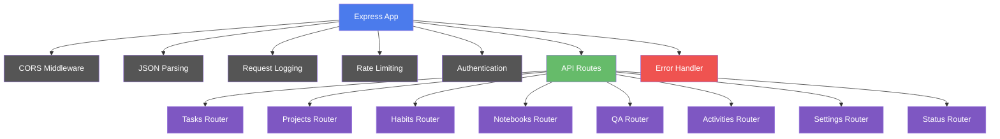
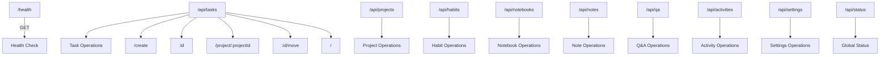
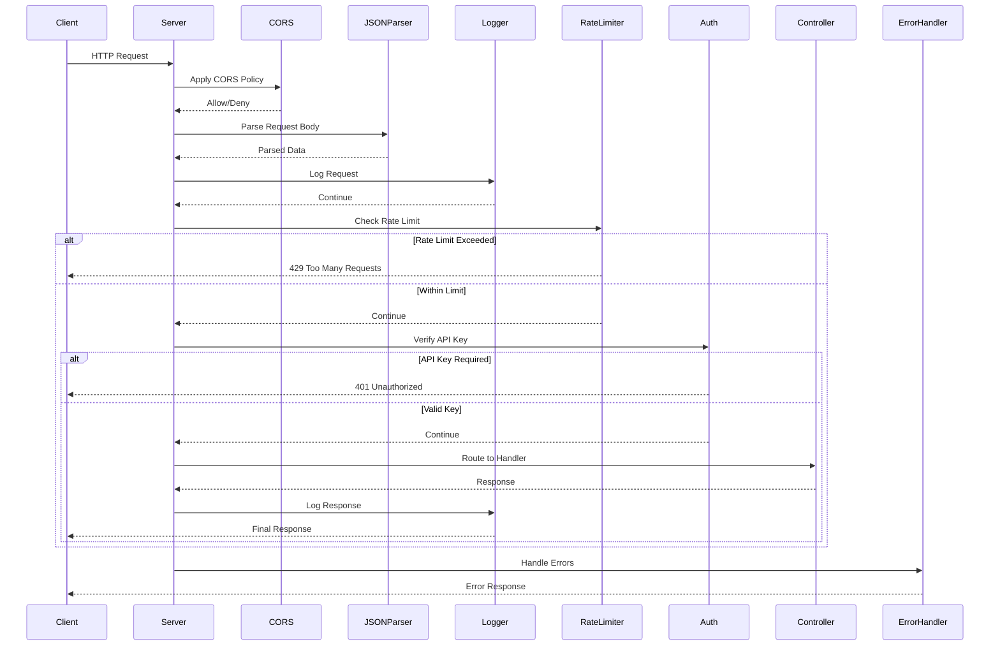
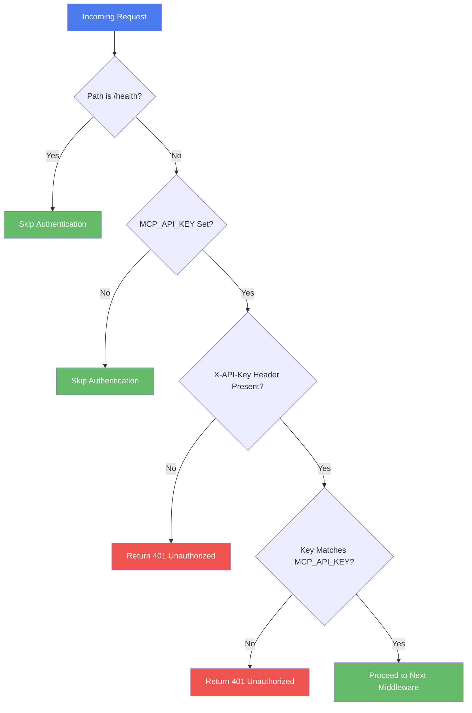
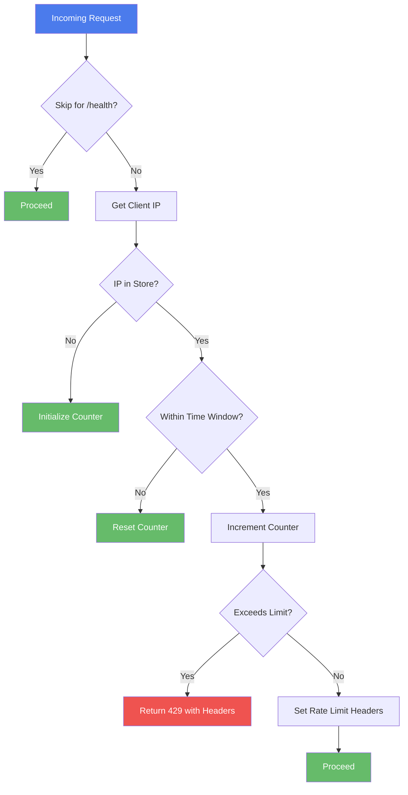
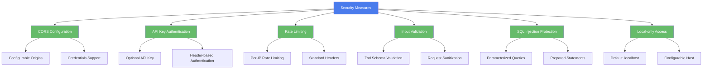
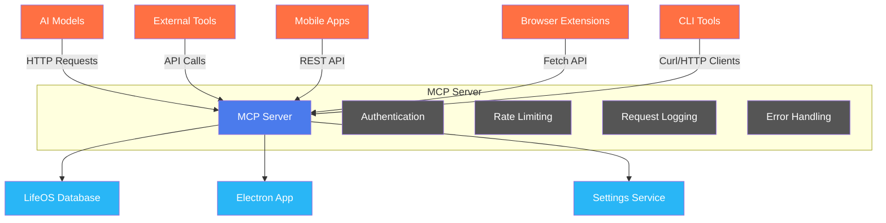

# Backend Services

<cite>
**Referenced Files in This Document**   
- [mcp-server.ts](file://src/server/mcp-server.ts)
- [auth.ts](file://src/server/middleware/auth.ts)
- [logging.ts](file://src/server/middleware/logging.ts)
- [rateLimiter.ts](file://src/server/middleware/rateLimiter.ts)
- [errorHandler.ts](file://src/server/middleware/errorHandler.ts)
- [logger.ts](file://src/server/utils/logger.ts)
- [tasksController.ts](file://src/server/controllers/tasksController.ts)
- [habitsController.ts](file://src/server/controllers/habitsController.ts)
- [statusController.ts](file://src/server/controllers/statusController.ts)
- [settingsController.ts](file://src/server/controllers/settingsController.ts)
- [tasks.ts](file://src/server/routes/tasks.ts)
- [habits.ts](file://src/server/routes/habits.ts)
- [status.ts](file://src/server/routes/status.ts)
- [settings.ts](file://src/server/routes/settings.ts)
- [README.md](file://src/server/README.md)
</cite>

## Table of Contents
1. [Introduction](#introduction)
2. [Server Architecture](#server-architecture)
3. [REST API Design](#rest-api-design)
4. [Route-Controller Separation Pattern](#route-controller-separation-pattern)
5. [Middleware Implementation](#middleware-implementation)
6. [Server Configuration](#server-configuration)
7. [API Key Authentication](#api-key-authentication)
8. [Error Handling](#error-handling)
9. [Performance Optimization](#performance-optimization)
10. [Security Considerations](#security-considerations)
11. [API Usage Examples](#api-usage-examples)
12. [Integration Patterns](#integration-patterns)

## Introduction

The MCP (Model Context Protocol) Server is an Express.js-based backend service that provides a comprehensive HTTP API for the LifeOS application. It enables seamless interaction between AI models, external tools, and the application's core functionality through a well-structured RESTful interface. The server follows modern architectural patterns with clear separation of concerns, robust middleware implementation, and comprehensive error handling.

**Section sources**
- [README.md](file://src/server/README.md#L1-L20)

## Server Architecture

The MCP Server implements a modular architecture with distinct layers for routing, controllers, middleware, and utilities. The core server entry point (`mcp-server.ts`) initializes the Express application, configures middleware, registers routes, and sets up error handling.



**Diagram sources**
- [mcp-server.ts](file://src/server/mcp-server.ts#L1-L80)

**Section sources**
- [mcp-server.ts](file://src/server/mcp-server.ts#L1-L80)
- [README.md](file://src/server/README.md#L70-L85)

## REST API Design

The MCP Server implements a consistent RESTful API design with predictable endpoint patterns and standardized response formats. The API is organized by functional modules, each with its own router and controller.

### API Endpoint Structure



**Diagram sources**
- [README.md](file://src/server/README.md#L40-L150)
- [tasks.ts](file://src/server/routes/tasks.ts#L1-L25)

**Section sources**
- [README.md](file://src/server/README.md#L40-L150)
- [tasks.ts](file://src/server/routes/tasks.ts#L1-L25)
- [habits.ts](file://src/server/routes/habits.ts#L1-L31)

## Route-Controller Separation Pattern

The MCP Server implements a clean separation between routes and controllers, following the Express.js best practices. This pattern ensures that routing logic is decoupled from business logic, making the codebase more maintainable and testable.

```mermaid
classDiagram
class Router {
+post(path, handler)
+get(path, handler)
+put(path, handler)
+delete(path, handler)
}
class Controller {
+createTask(req, res, next)
+getTask(req, res, next)
+updateTask(req, res, next)
+deleteTask(req, res, next)
}
class Repository {
+createTask(data)
+getTask(id)
+updateTask(data)
+deleteTask(id)
}
Router --> Controller : delegates to
Controller --> Repository : uses
Repository --> Database : queries
note right of Router
Defines URL patterns and
HTTP methods for endpoints
end note
note right of Controller
Handles request processing,
validation, and response
formatting
end note
note right of Repository
Contains data access logic
and database operations
end note
```

**Diagram sources**
- [tasks.ts](file://src/server/routes/tasks.ts#L1-L25)
- [tasksController.ts](file://src/server/controllers/tasksController.ts#L1-L140)

**Section sources**
- [tasks.ts](file://src/server/routes/tasks.ts#L1-L25)
- [tasksController.ts](file://src/server/controllers/tasksController.ts#L1-L140)

## Middleware Implementation

The MCP Server utilizes a comprehensive middleware stack to handle cross-cutting concerns such as authentication, logging, rate limiting, and error handling. Each middleware function follows the Express.js middleware pattern and is applied in a specific order.

### Middleware Pipeline



**Diagram sources**
- [mcp-server.ts](file://src/server/mcp-server.ts#L1-L80)
- [auth.ts](file://src/server/middleware/auth.ts#L1-L26)
- [logging.ts](file://src/server/middleware/logging.ts#L1-L22)
- [rateLimiter.ts](file://src/server/middleware/rateLimiter.ts#L1-L69)

**Section sources**
- [auth.ts](file://src/server/middleware/auth.ts#L1-L26)
- [logging.ts](file://src/server/middleware/logging.ts#L1-L22)
- [rateLimiter.ts](file://src/server/middleware/rateLimiter.ts#L1-L69)

## Server Configuration

The MCP Server is configured through environment variables, allowing for flexible deployment across different environments. The configuration system provides sensible defaults while enabling customization of key server parameters.

### Configuration Options

| Environment Variable | Default Value | Description |
|----------------------|-------------|-------------|
| MCP_SERVER_PORT | 3000 | Server port number |
| MCP_SERVER_HOST | localhost | Server host address |
| MCP_API_KEY | (none) | API key for authentication |
| MCP_RATE_LIMIT | 100 | Requests per minute limit |
| MCP_LOG_LEVEL | info | Logging verbosity level |
| MCP_CORS_ORIGIN | * | Allowed CORS origins |

The server reads these environment variables at startup and uses them to configure the Express application accordingly. This approach enables secure configuration management and easy environment-specific tuning.

**Section sources**
- [mcp-server.ts](file://src/server/mcp-server.ts#L1-L80)
- [README.md](file://src/server/README.md#L150-L170)

## API Key Authentication

The MCP Server implements optional API key authentication to secure endpoints from unauthorized access. When an API key is configured, all requests (except health checks) must include a valid API key in the `X-API-Key` header.



**Diagram sources**
- [auth.ts](file://src/server/middleware/auth.ts#L1-L26)

**Section sources**
- [auth.ts](file://src/server/middleware/auth.ts#L1-L26)
- [README.md](file://src/server/README.md#L230-L240)

## Error Handling

The MCP Server implements a robust error handling system that standardizes error responses and provides meaningful feedback to clients. The error handling middleware catches errors thrown by route handlers and formats them consistently.

### Error Response Structure

```mermaid
classDiagram
class ErrorResponse {
-error : ErrorDetail
}
class ErrorDetail {
-code : string
-message : string
-details : object
}
class SuccessResponse {
-data : any
}
ErrorResponse --> ErrorDetail
SuccessResponse -->|Contains data payload| Any
note right of ErrorResponse
Used for all error conditions
with standardized format
end note
note right of SuccessResponse
Used for successful operations
with data payload
end note
```

The server handles various error types with specific response codes and messages:

- **VALIDATION_ERROR** (400): Invalid request data
- **NOT_FOUND** (404): Resource not found
- **UNAUTHORIZED** (401): Invalid or missing API key  
- **RATE_LIMIT_EXCEEDED** (429): Too many requests
- **INTERNAL_SERVER_ERROR** (500): Server error

**Diagram sources**
- [errorHandler.ts](file://src/server/middleware/errorHandler.ts#L1-L69)
- [README.md](file://src/server/README.md#L200-L220)

**Section sources**
- [errorHandler.ts](file://src/server/middleware/errorHandler.ts#L1-L69)
- [README.md](file://src/server/README.md#L200-L220)

## Performance Optimization

The MCP Server incorporates several performance optimization techniques to ensure responsive API operations and efficient resource utilization.

### Rate Limiting Implementation



The server also includes performance optimizations such as:

- **Request logging with conditional body logging**: Only logs request bodies for non-GET requests to reduce log size
- **Efficient database queries**: Uses parameterized queries and optimized SQL statements
- **Memory-efficient rate limiting**: Implements in-memory rate limiting with automatic cleanup of expired entries
- **Configurable payload limits**: Sets a 10MB limit for JSON payloads to prevent abuse

**Diagram sources**
- [rateLimiter.ts](file://src/server/middleware/rateLimiter.ts#L1-L69)
- [logging.ts](file://src/server/middleware/logging.ts#L1-L22)

**Section sources**
- [rateLimiter.ts](file://src/server/middleware/rateLimiter.ts#L1-L69)
- [logging.ts](file://src/server/middleware/logging.ts#L1-L22)

## Security Considerations

The MCP Server implements multiple security measures to protect against common web vulnerabilities and ensure data integrity.

### Security Features



Key security practices include:
- Binding to localhost by default to limit external access
- Using strong, unique API keys in production environments
- Configuring appropriate CORS origins for web clients
- Implementing rate limiting to prevent abuse
- Validating all inputs with Zod schemas
- Preventing SQL injection through parameterized queries

**Diagram sources**
- [README.md](file://src/server/README.md#L240-L270)
- [auth.ts](file://src/server/middleware/auth.ts#L1-L26)
- [rateLimiter.ts](file://src/server/middleware/rateLimiter.ts#L1-L69)

**Section sources**
- [README.md](file://src/server/README.md#L240-L270)

## API Usage Examples

The MCP Server provides a comprehensive API for interacting with LifeOS functionality. Below are practical examples of common API usage patterns.

### Task Creation Example

```bash
curl -X POST http://localhost:3000/api/tasks/create \
  -H "Content-Type: application/json" \
  -H "X-API-Key: your_key" \
  -d '{
    "projectId": 1,
    "title": "Implement feature X",
    "description": "Complete implementation",
    "status": "To-Do",
    "estimatedMinutes": 120
  }'
```

### Habit Logging Example

```bash
curl -X POST http://localhost:3000/api/habits/1/log \
  -H "Content-Type: application/json" \
  -H "X-API-Key: your_key" \
  -d '{
    "loggedDate": "2024-10-27",
    "count": 1,
    "note": "Completed successfully"
  }'
```

### Global Status Check

```bash
curl http://localhost:3000/api/status \
  -H "X-API-Key: your_key"
```

### Notes Search

```bash
curl "http://localhost:3000/api/notes/search?q=project" \
  -H "X-API-Key: your_key"
```

These examples demonstrate the consistent API pattern across different modules, with JSON payloads for data operations and query parameters for filtering and searching.

**Section sources**
- [README.md](file://src/server/README.md#L170-L200)

## Integration Patterns

The MCP Server supports various integration patterns for different use cases, from AI model interactions to external tool integrations.

### Integration Architecture



Common integration patterns include:
- **AI Model Integration**: AI systems use the MCP Server to access user data and perform actions on their behalf
- **External Tool Integration**: Third-party applications connect to LifeOS through the API for data synchronization
- **Automation Scripts**: Users create scripts that interact with the MCP Server to automate routine tasks
- **Dashboard Applications**: External dashboards consume data from the MCP Server to provide visualizations

The server's RESTful design and standardized response format make it easy to integrate with various clients and programming languages.

**Diagram sources**
- [README.md](file://src/server/README.md#L1-L20)
- [mcp-server.ts](file://src/server/mcp-server.ts#L1-L80)

**Section sources**
- [README.md](file://src/server/README.md#L1-L20)