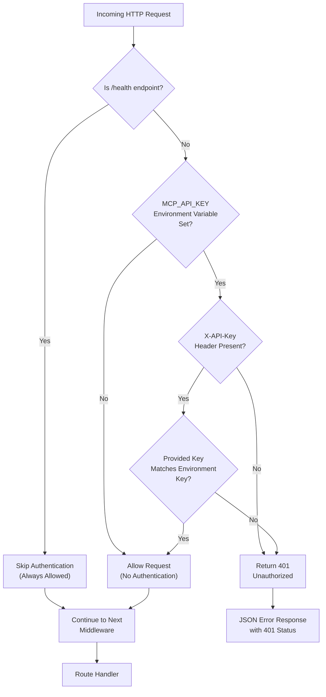

# Authentication

<cite>
**Referenced Files in This Document**
- [auth.ts](file://src/server/middleware/auth.ts)
- [mcp-server.ts](file://src/server/mcp-server.ts)
- [statusController.ts](file://src/server/controllers/statusController.ts)
- [rateLimiter.ts](file://src/server/middleware/rateLimiter.ts)
- [mcp.md](file://AI/mcp.md)
- [package.json](file://package.json)
</cite>

## Table of Contents
1. [Introduction](#introduction)
2. [Authentication Architecture](#authentication-architecture)
3. [Core Authentication Mechanism](#core-authentication-mechanism)
4. [Environment Configuration](#environment-configuration)
5. [Health Endpoint Exemption](#health-endpoint-exemption)
6. [Request Validation Process](#request-validation-process)
7. [Error Response Structure](#error-response-structure)
8. [Integration with Server Setup](#integration-with-server-setup)
9. [Security Best Practices](#security-best-practices)
10. [Troubleshooting Guide](#troubleshooting-guide)
11. [Examples and Usage](#examples-and-usage)

## Introduction

The MCP (Model Context Protocol) Server implements a flexible authentication mechanism designed to provide security for production deployments while maintaining accessibility for development environments. The authentication system operates on a conditional basis, requiring API key validation only when explicitly configured through environment variables.

This authentication approach balances security needs with developer convenience, allowing local development without authentication overhead while protecting production instances from unauthorized access. The system integrates seamlessly with Express middleware architecture and provides standardized error responses for authentication failures.

## Authentication Architecture

The authentication system follows a middleware-based architecture that intercepts all incoming requests before they reach route handlers. The middleware operates as a gatekeeper, validating requests based on the presence and correctness of the API key header.



**Diagram sources**
- [auth.ts](file://src/server/middleware/auth.ts#L3-L25)

**Section sources**
- [auth.ts](file://src/server/middleware/auth.ts#L1-L27)
- [mcp-server.ts](file://src/server/mcp-server.ts#L25-L35)

## Core Authentication Mechanism

The authentication middleware implements a three-tier validation process:

### Conditional Activation
The authentication system activates only when the `MCP_API_KEY` environment variable is present. This design allows for seamless development without authentication overhead while enabling production security when needed.

### Health Endpoint Bypass
Requests to the `/health` endpoint bypass authentication entirely, ensuring monitoring and health checks remain accessible regardless of authentication configuration. This exemption is crucial for infrastructure monitoring and load balancer health checks.

### Header-Based Validation
When authentication is active, requests must include the `X-API-Key` header containing the exact value of the `MCP_API_KEY` environment variable. The comparison is performed using strict equality, ensuring precise key matching.

**Section sources**
- [auth.ts](file://src/server/middleware/auth.ts#L3-L25)

## Environment Configuration

### Required Environment Variables

| Variable | Purpose | Example Value | Security Level |
|----------|---------|---------------|----------------|
| `MCP_API_KEY` | Authentication key for production deployments | `your-secret-api-key-here` | High |
| `MCP_SERVER_PORT` | Port for server binding | `3000` | Medium |
| `MCP_SERVER_HOST` | Host interface binding | `localhost` | Medium |
| `MCP_CORS_ORIGIN` | CORS allowed origins | `*` or `https://example.com` | Medium |

### Default Configuration Values

The server falls back to sensible defaults when environment variables are not provided:

- **Port**: `3000` (development-friendly default)
- **Host**: `localhost` (local-only binding)
- **CORS Origin**: `*` (wildcard for development)

**Section sources**
- [mcp-server.ts](file://src/server/mcp-server.ts#L17-L18)
- [auth.ts](file://src/server/middleware/auth.ts#L9-L11)

## Health Endpoint Exemption

The `/health` endpoint serves as a critical infrastructure component, providing system status information without requiring authentication. This exemption ensures:

### Monitoring Accessibility
Infrastructure monitoring systems, load balancers, and health check mechanisms can access the health endpoint without authentication overhead.

### Operational Continuity
System administrators can verify server status and operational health without compromising security controls on authenticated endpoints.

### Implementation Details
The health endpoint exemption is implemented at the middleware level, ensuring consistent behavior across all request types and preventing bypass attempts.

**Section sources**
- [auth.ts](file://src/server/middleware/auth.ts#L4-L7)
- [mcp-server.ts](file://src/server/mcp-server.ts#L37-L41)

## Request Validation Process

The authentication middleware executes a structured validation process for each request:

### Step 1: Path Examination
The middleware first examines the request path to determine if special handling is required. The `/health` endpoint receives immediate exemption from authentication requirements.

### Step 2: Environment Variable Check
The system verifies whether the `MCP_API_KEY` environment variable is configured. If absent, authentication is skipped entirely, allowing unrestricted access.

### Step 3: Header Validation
When authentication is active, the middleware extracts the `X-API-Key` header from the request and compares it against the configured API key.

### Step 4: Response Generation
If authentication fails at any point, the middleware generates a standardized 401 Unauthorized response with detailed error information.

**Section sources**
- [auth.ts](file://src/server/middleware/auth.ts#L3-L25)

## Error Response Structure

When authentication fails, the system returns a standardized JSON response structure that provides clear error information:

### Response Format
```json
{
  "error": {
    "code": "UNAUTHORIZED",
    "message": "Invalid or missing API key"
  }
}
```

### HTTP Status Code
- **401 Unauthorized**: Returned when the API key is missing, invalid, or does not match the configured value.

### Error Properties
- **code**: Standardized error identifier (`UNAUTHORIZED`)
- **message**: Human-readable error description

This consistent error structure enables client applications to handle authentication failures programmatically and provide appropriate user feedback.

**Section sources**
- [auth.ts](file://src/server/middleware/auth.ts#L15-L23)

## Integration with Server Setup

The authentication middleware integrates seamlessly with the Express server configuration, positioned strategically within the middleware stack:

### Middleware Order
1. **CORS Configuration**: Handles Cross-Origin Resource Sharing
2. **Body Parsing**: Processes JSON and URL-encoded request bodies
3. **Logging**: Records request information for debugging
4. **Rate Limiting**: Controls request frequency to prevent abuse
5. **Authentication**: Validates API key requirements
6. **Route Handlers**: Processes authenticated requests
7. **Error Handling**: Manages exceptions and errors

### Server Initialization
The authentication middleware is registered during server creation, ensuring all subsequent middleware and route handlers inherit the security protections.

**Section sources**
- [mcp-server.ts](file://src/server/mcp-server.ts#L25-L35)

## Security Best Practices

### Production Deployment
For production environments, implement the following security measures:

1. **Strong API Keys**: Use cryptographically secure random strings for API keys
2. **Environment Isolation**: Store API keys in secure environment variables
3. **Network Security**: Bind to localhost or restrict network access appropriately
4. **Monitoring**: Implement logging and alerting for authentication failures

### Development Environment
During development, authentication remains disabled by default, reducing setup complexity while maintaining security awareness.

### Key Rotation
Implement procedures for periodic API key rotation to minimize exposure risk in case of compromise.

### Access Control
Combine authentication with other security measures like IP whitelisting and HTTPS enforcement for comprehensive protection.

**Section sources**
- [mcp.md](file://AI/mcp.md#L354-L390)

## Troubleshooting Guide

### Common Authentication Issues

#### Issue: 401 Unauthorized Response
**Symptoms**: Requests receive 401 status with error message about invalid or missing API key.

**Causes and Solutions**:
1. **Missing X-API-Key Header**
   - Verify the `X-API-Key` header is included in all requests
   - Check header name casing (case-sensitive)

2. **Incorrect API Key**
   - Confirm the API key matches the `MCP_API_KEY` environment variable
   - Verify no extra whitespace or characters

3. **Environment Variable Not Set**
   - Check if `MCP_API_KEY` is properly configured
   - Restart the server after setting environment variables

#### Issue: Health Endpoint Fails Authentication
**Symptoms**: The `/health` endpoint returns 401 despite being exempt.

**Solution**: This is expected behavior. The health endpoint should never require authentication.

#### Issue: Development Mode Issues
**Symptoms**: Authentication prevents normal development workflow.

**Solution**: No action needed. Authentication is automatically disabled when `MCP_API_KEY` is not set.

### Debugging Steps

1. **Verify Environment Configuration**
   ```bash
   echo $MCP_API_KEY
   ```

2. **Test Authentication Headers**
   ```bash
   curl -H "X-API-Key: $MCP_API_KEY" http://localhost:3000/api/endpoint
   ```

3. **Check Server Logs**
   Review server output for authentication-related messages

4. **Validate Request Format**
   Ensure requests include proper headers and content types

**Section sources**
- [auth.ts](file://src/server/middleware/auth.ts#L12-L25)

## Examples and Usage

### Setting Up Authentication

#### Production Configuration
```bash
# Set environment variables
export MCP_API_KEY="your-secure-random-key-here"
export MCP_SERVER_PORT=3000
export MCP_SERVER_HOST=localhost

# Start the server
npm run mcp:start
```

#### Development Configuration
```bash
# No authentication required
export MCP_SERVER_PORT=3000

# Start the server
npm run mcp:dev
```

### Making Authenticated Requests

#### Using cURL
```bash
# With authentication
curl -H "X-API-Key: your-api-key" \
     http://localhost:3000/api/tasks

# Without authentication (development)
curl http://localhost:3000/api/tasks
```

#### Using JavaScript Fetch
```javascript
// With authentication
fetch('http://localhost:3000/api/tasks', {
  headers: {
    'X-API-Key': 'your-api-key'
  }
});

// Without authentication (development)
fetch('http://localhost:3000/api/tasks');
```

### Error Handling in Applications

```javascript
async function makeAuthenticatedRequest(endpoint) {
  try {
    const response = await fetch(`http://localhost:3000${endpoint}`, {
      headers: {
        'X-API-Key': process.env.MCP_API_KEY
      }
    });

    if (response.status === 401) {
      const errorData = await response.json();
      console.error('Authentication failed:', errorData.error.message);
      // Handle authentication error
      return null;
    }

    return response.json();
  } catch (error) {
    console.error('Request failed:', error);
    return null;
  }
}
```

### Health Check Implementation
```bash
# Verify server health (always works)
curl http://localhost:3000/health

# Expected response
{
  "status": "ok",
  "timestamp": "2024-01-01T00:00:00.000Z"
}
```

**Section sources**
- [mcp-server.ts](file://src/server/mcp-server.ts#L37-L41)
- [auth.ts](file://src/server/middleware/auth.ts#L12-L25)