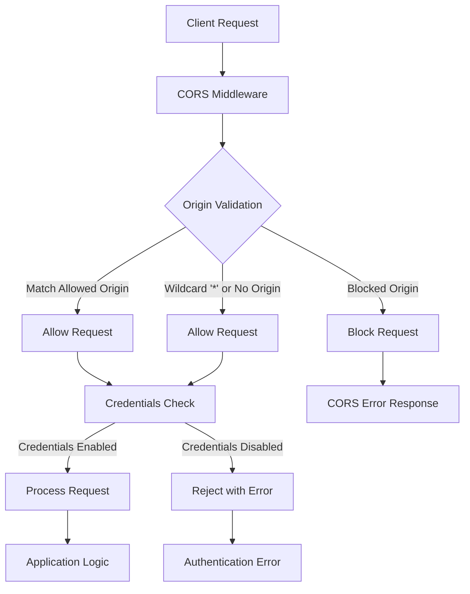
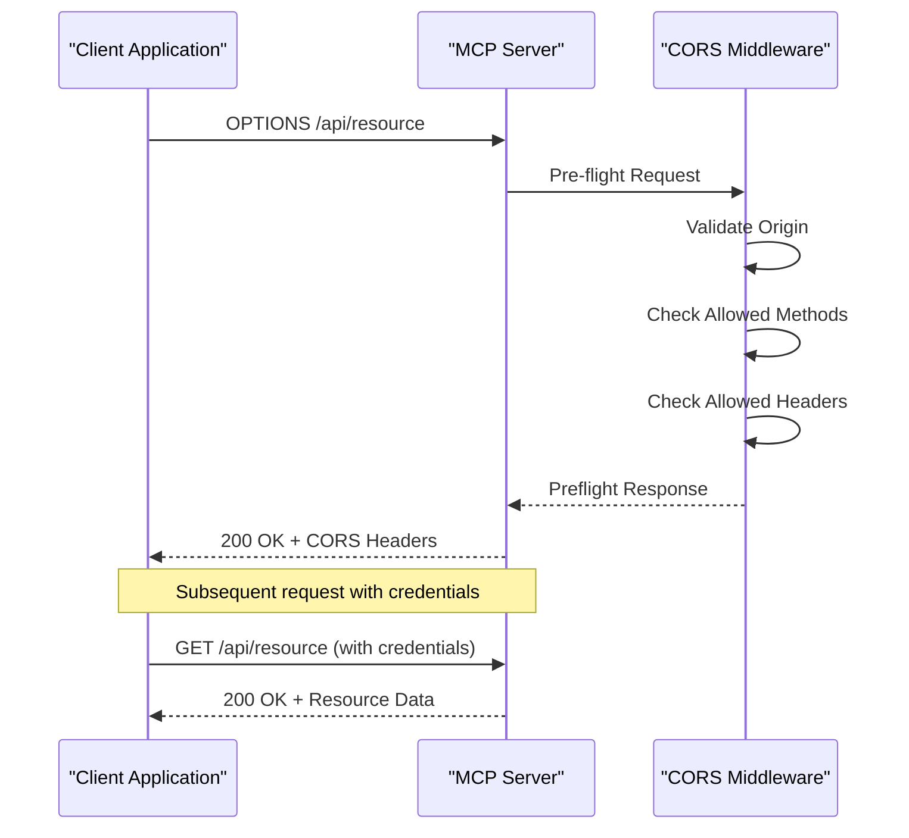

# CORS Configuration

<cite>
**Referenced Files in This Document**
- [mcp-server.ts](file://src/server/mcp-server.ts)
- [auth.ts](file://src/server/middleware/auth.ts)
- [mcp.ts](file://src/main/ipc/mcp.ts)
- [types.ts](file://src/common/types.ts)
- [mcpRepo.ts](file://src/database/mcpRepo.ts)
- [package.json](file://package.json)
- [mcp.md](file://AI/mcp.md)
</cite>

## Table of Contents
1. [Introduction](#introduction)
2. [CORS Implementation Overview](#cors-implementation-overview)
3. [Environment Configuration](#environment-configuration)
4. [Security Considerations](#security-considerations)
5. [Preflight Request Handling](#preflight-request-handling)
6. [Deployment Scenarios](#deployment-scenarios)
7. [Troubleshooting Guide](#troubleshooting-guide)
8. [Best Practices](#best-practices)
9. [Conclusion](#conclusion)

## Introduction

The LifeOS MCP (Model Context Protocol) Server implements Cross-Origin Resource Sharing (CORS) configuration through the Express.js `cors` middleware. This implementation provides flexible origin whitelisting capabilities while maintaining security through configurable credential support and environment-based configuration.

The CORS configuration serves as a critical security boundary for the MCP Server, controlling which external domains can communicate with the server and how credentials are handled across different deployment scenarios.

## CORS Implementation Overview

The MCP Server's CORS configuration is implemented using the `cors` middleware with a centralized configuration approach that leverages environment variables for flexibility and security.



**Diagram sources**
- [mcp-server.ts](file://src/server/mcp-server.ts#L24-L28)

**Section sources**
- [mcp-server.ts](file://src/server/mcp-server.ts#L24-L28)

## Environment Configuration

### Core Environment Variables

The CORS configuration is controlled through several key environment variables that provide runtime flexibility and security controls:

| Variable | Purpose | Default Value | Security Impact |
|----------|---------|---------------|-----------------|
| `MCP_CORS_ORIGIN` | Origin whitelist for CORS requests | `'*'` (wildcard) | Controls which domains can access the server |
| `MCP_API_KEY` | API key authentication for production | Not set | Adds authentication layer for external access |
| `MCP_SERVER_PORT` | Server listening port | `3000` | Determines server accessibility |
| `MCP_SERVER_HOST` | Server binding address | `'localhost'` | Controls network accessibility |

### Origin Whitelist Configuration

The `MCP_CORS_ORIGIN` environment variable accepts various formats for origin specification:

#### Wildcard Configuration
```typescript
// Default behavior - allows all origins
origin: process.env.MCP_CORS_ORIGIN || '*'
```

#### Specific Origin Configuration
```bash
# Single origin
MCP_CORS_ORIGIN=https://app.example.com

# Multiple origins (comma-separated)
MCP_CORS_ORIGIN=https://app.example.com,https://admin.example.com

# Development origins
MCP_CORS_ORIGIN=http://localhost:3000,http://localhost:5173
```

#### Dynamic Origin Resolution
The middleware supports dynamic origin resolution through callback functions for advanced scenarios requiring runtime origin validation.

**Section sources**
- [mcp-server.ts](file://src/server/mcp-server.ts#L18-L28)
- [mcp.ts](file://src/main/ipc/mcp.ts#L32-L33)

## Security Considerations

### Credentials Support Configuration

The CORS middleware enables credential support through the `credentials: true` option, which has significant security implications:

```typescript
app.use(cors({
  origin: process.env.MCP_CORS_ORIGIN || '*',
  credentials: true
}));
```

#### Credential Security Implications

**Enabling Credentials:**
- Allows cookies and authentication headers to be sent
- Enables session-based authentication
- Requires careful origin validation
- Vulnerable to CSRF attacks if not properly secured

**Disabling Credentials:**
- Blocks cookies and sensitive headers
- Reduces attack surface
- Simplifies security model
- May break certain authentication flows

### Production Security Best Practices

#### Restricted Origin Configuration
```bash
# Production: Restrict to known domains only
MCP_CORS_ORIGIN=https://yourdomain.com,https://app.yourdomain.com

# Development: Allow localhost for local testing
MCP_CORS_ORIGIN=http://localhost:3000,http://localhost:5173
```

#### Combined Security Measures
```bash
# Production: Secure configuration
MCP_CORS_ORIGIN=https://yourdomain.com
MCP_API_KEY=your-secret-api-key
NODE_ENV=production
```

**Section sources**
- [mcp-server.ts](file://src/server/mcp-server.ts#L26-L28)
- [auth.ts](file://src/server/middleware/auth.ts#L9-L25)

## Preflight Request Handling

### OPTIONS Request Processing

The Express.js CORS middleware automatically handles HTTP OPTIONS preflight requests, which are essential for cross-origin requests that require additional headers or methods.



**Diagram sources**
- [mcp-server.ts](file://src/server/mcp-server.ts#L30-L35)

### Preflight Response Headers

The CORS middleware automatically includes appropriate headers in preflight responses:

- `Access-Control-Allow-Origin`: Set to the requesting origin or wildcard
- `Access-Control-Allow-Methods`: Configured HTTP methods
- `Access-Control-Allow-Headers`: Configured request headers
- `Access-Control-Allow-Credentials`: Set to `true` when credentials are enabled
- `Access-Control-Max-Age`: Preflight caching duration

### Method and Header Configuration

The server supports various HTTP methods and headers commonly used in MCP communications:

#### Supported HTTP Methods
- `GET` - Resource retrieval
- `POST` - Data creation and updates
- `PUT` - Resource updates
- `DELETE` - Resource deletion
- `OPTIONS` - Preflight requests

#### Supported Request Headers
- `Content-Type` - JSON and form data
- `Authorization` - Token-based authentication
- `X-API-Key` - API key authentication
- `Accept` - Content negotiation

**Section sources**
- [mcp-server.ts](file://src/server/mcp-server.ts#L30-L35)

## Deployment Scenarios

### Local Development Configuration

For local development environments, the default configuration provides maximum flexibility:

```bash
# Development environment
MCP_CORS_ORIGIN=http://localhost:3000,http://localhost:5173
MCP_SERVER_HOST=localhost
MCP_SERVER_PORT=3000
NODE_ENV=development
```

### Production Deployment Patterns

#### Single Domain Deployment
```bash
# Production: Single domain
MCP_CORS_ORIGIN=https://yourdomain.com
MCP_API_KEY=your-production-api-key
NODE_ENV=production
```

#### Multi-Domain Deployment
```bash
# Production: Multiple trusted domains
MCP_CORS_ORIGIN=https://app.yourdomain.com,https://admin.yourdomain.com
MCP_API_KEY=your-multi-domain-api-key
NODE_ENV=production
```

#### Cloud Deployment with Reverse Proxy
```bash
# Production: Behind reverse proxy
MCP_CORS_ORIGIN=https://yourdomain.com
MCP_SERVER_HOST=0.0.0.0
MCP_SERVER_PORT=3000
NODE_ENV=production
```

### Containerized Deployment

For containerized deployments, environment variables are typically set in Docker Compose or Kubernetes configurations:

```yaml
# docker-compose.yml
environment:
  - MCP_CORS_ORIGIN=https://app.yourdomain.com
  - MCP_API_KEY=${MCP_API_KEY}
  - MCP_SERVER_PORT=3000
  - NODE_ENV=production
```

**Section sources**
- [mcp.ts](file://src/main/ipc/mcp.ts#L32-L33)
- [mcpRepo.ts](file://src/database/mcpRepo.ts#L10-L25)

## Troubleshooting Guide

### Common CORS Issues

#### Issue: "Access to XMLHttpRequest from origin X has been blocked by CORS policy"

**Symptoms:**
- Browser console shows CORS errors
- Requests fail with network errors
- Preflight OPTIONS requests rejected

**Causes and Solutions:**

1. **Origin Not Whitelisted**
   ```bash
   # Solution: Add origin to whitelist
   MCP_CORS_ORIGIN=https://app.example.com
   ```

2. **Wildcard Configuration in Production**
   ```bash
   # Solution: Use specific origins in production
   MCP_CORS_ORIGIN=https://app.example.com
   ```

3. **Missing Credentials Support**
   ```javascript
   // Solution: Enable credentials if needed
   app.use(cors({
     origin: process.env.MCP_CORS_ORIGIN || '*',
     credentials: true  // Enable for cookie-based auth
   }));
   ```

#### Issue: "Response to preflight request doesn't pass access control check"

**Symptoms:**
- OPTIONS requests succeed but subsequent requests fail
- Missing required headers in response

**Solutions:**
1. **Verify Allowed Methods**
   ```javascript
   // Ensure all required methods are supported
   app.options('*', cors()); // Enable preflight for all routes
   ```

2. **Check Allowed Headers**
   ```javascript
   // Configure allowed headers
   app.use(cors({
     origin: process.env.MCP_CORS_ORIGIN || '*',
     allowedHeaders: ['Content-Type', 'Authorization', 'X-API-Key']
   }));
   ```

### Authentication and Credential Issues

#### Issue: "Request header field X is not allowed by Access-Control-Allow-Headers"

**Solution:**
```javascript
// Add custom headers to allowed headers
app.use(cors({
  origin: process.env.MCP_CORS_ORIGIN || '*',
  allowedHeaders: ['Content-Type', 'Authorization', 'X-API-Key', 'Custom-Header']
}));
```

#### Issue: "The value of the 'Access-Control-Allow-Credentials' header is '' which must be 'true'"

**Solution:**
```javascript
// Ensure credentials are properly configured
app.use(cors({
  origin: process.env.MCP_CORS_ORIGIN || '*',
  credentials: true  // Must be true for credential support
}));
```

### Debugging Tools and Techniques

#### Browser Developer Tools
1. **Network Tab**: Monitor CORS-related requests
2. **Console**: View CORS error messages
3. **Application Tab**: Inspect cookies and storage

#### Server Logs
Enable detailed logging to troubleshoot CORS issues:

```typescript
// Enhanced CORS logging
app.use(cors({
  origin: process.env.MCP_CORS_ORIGIN || '*',
  credentials: true,
  optionsSuccessStatus: 200,
  debug: true // Enable debug mode
}));
```

#### Testing with curl
```bash
# Test preflight request
curl -X OPTIONS \
  -H "Origin: https://app.example.com" \
  -H "Access-Control-Request-Method: POST" \
  -H "Access-Control-Request-Headers: Content-Type" \
  http://localhost:3000/api/resource

# Test actual request
curl -X GET \
  -H "Origin: https://app.example.com" \
  -H "Authorization: Bearer token" \
  http://localhost:3000/api/resource
```

**Section sources**
- [mcp-server.ts](file://src/server/mcp-server.ts#L24-L28)
- [auth.ts](file://src/server/middleware/auth.ts#L9-L25)

## Best Practices

### Security Hardening

#### Principle of Least Privilege
```bash
# Only allow necessary origins
MCP_CORS_ORIGIN=https://trusted-domain.com

# Disable credentials unless absolutely needed
credentials: false
```

#### Environment-Specific Configuration
```bash
# development.env
MCP_CORS_ORIGIN=http://localhost:3000,http://localhost:5173

# production.env
MCP_CORS_ORIGIN=https://app.yourdomain.com
MCP_API_KEY=production-secret-key
```

### Performance Optimization

#### Preflight Caching
Configure appropriate preflight cache durations:

```javascript
app.use(cors({
  origin: process.env.MCP_CORS_ORIGIN || '*',
  credentials: true,
  maxAge: 3600 // Cache preflight responses for 1 hour
}));
```

#### Efficient Origin Validation
Use specific origin patterns rather than wildcards when possible:

```javascript
// Good: Specific domain
origin: 'https://app.yourdomain.com'

// Better: Pattern-based
origin: /^https:\/\/app\.yourdomain\.com$/

// Avoid: Wildcard in production
origin: '*'
```

### Monitoring and Maintenance

#### CORS Policy Auditing
Regularly review and audit CORS configurations:

```bash
# Monitor CORS violations
tail -f /var/log/mcp-server/access.log | grep "CORS"
```

#### Automated Testing
Implement automated CORS testing in CI/CD pipelines:

```javascript
// CORS test suite
describe('CORS Configuration', () => {
  it('should allow requests from authorized origins', async () => {
    const response = await fetch('http://localhost:3000/api/test', {
      method: 'OPTIONS',
      headers: {
        'Origin': 'https://authorized-domain.com',
        'Access-Control-Request-Method': 'GET'
      }
    });
    expect(response.status).toBe(200);
  });
});
```

**Section sources**
- [mcp-server.ts](file://src/server/mcp-server.ts#L24-L28)
- [mcp.md](file://AI/mcp.md#L354-L390)

## Conclusion

The MCP Server's CORS configuration provides a robust foundation for secure cross-origin communication while maintaining flexibility for various deployment scenarios. The implementation leverages environment-based configuration for easy management across development, staging, and production environments.

Key takeaways for successful CORS implementation:

1. **Security First**: Always restrict origins in production environments and disable credentials when not needed
2. **Environment Awareness**: Use environment variables to manage CORS settings across different deployment stages
3. **Monitoring**: Implement logging and monitoring for CORS-related issues
4. **Testing**: Regularly test CORS configurations with automated tests and manual verification
5. **Documentation**: Maintain clear documentation of CORS policies and their rationale

The modular design allows for easy extension and customization while maintaining security best practices. By following the guidelines and patterns outlined in this documentation, developers can implement secure and efficient CORS configurations for their MCP Server deployments.