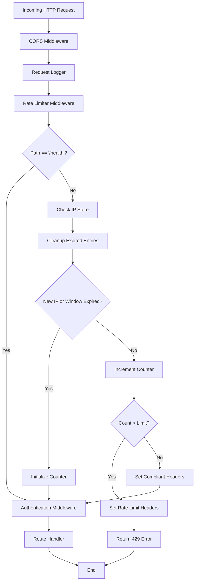
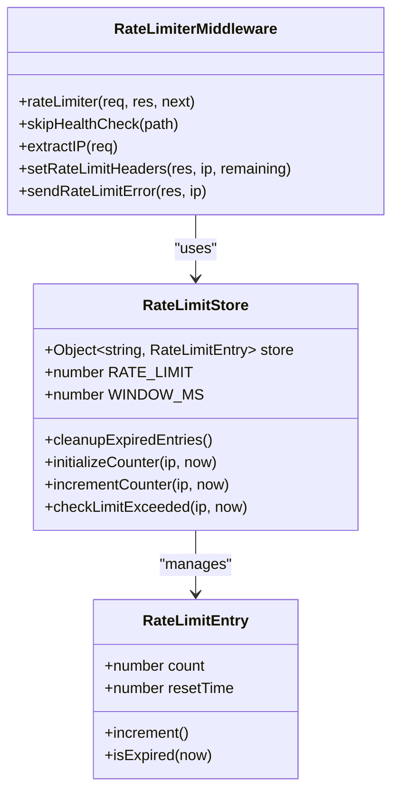
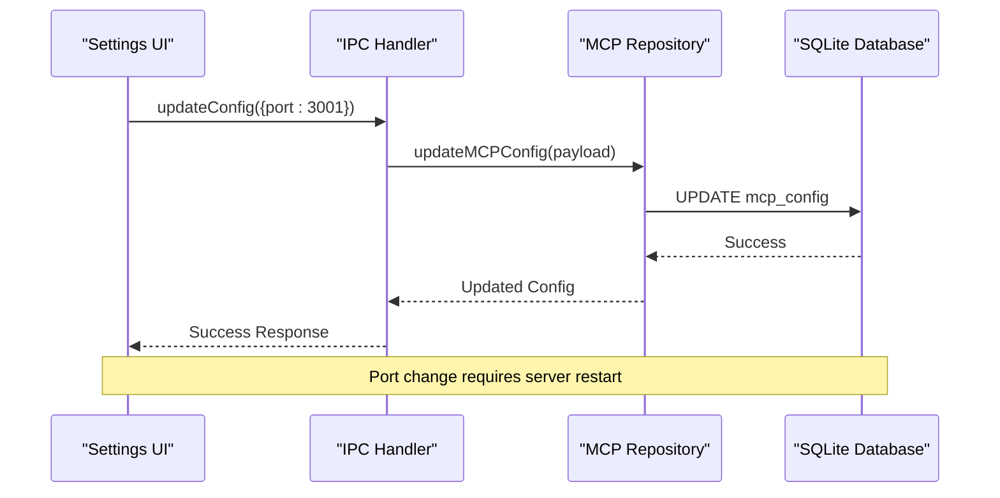
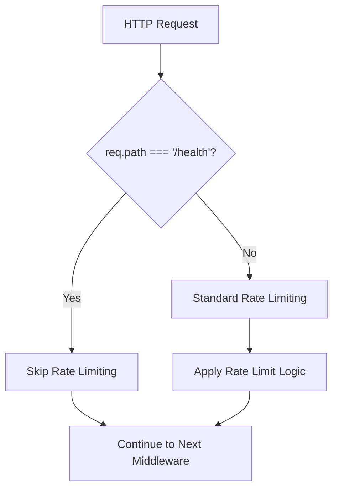
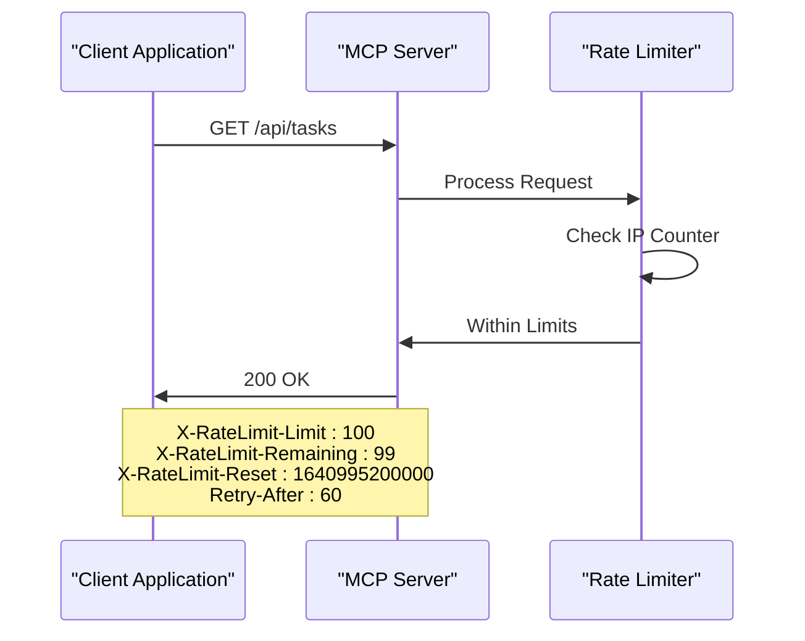

# Rate Limiting

<cite>
**Referenced Files in This Document**
- [rateLimiter.ts](file://src/server/middleware/rateLimiter.ts)
- [mcp-server.ts](file://src/server/mcp-server.ts)
- [auth.ts](file://src/server/middleware/auth.ts)
- [statusController.ts](file://src/server/controllers/statusController.ts)
- [mcp.ts](file://src/main/ipc/mcp.ts)
- [mcpRepo.ts](file://src/database/mcpRepo.ts)
- [SettingsPage.tsx](file://src/renderer/pages/SettingsPage.tsx)
- [package.json](file://package.json)
</cite>

## Table of Contents
1. [Introduction](#introduction)
2. [Rate Limiter Architecture](#rate-limiter-architecture)
3. [Core Implementation](#core-implementation)
4. [Configuration](#configuration)
5. [Exemption Mechanism](#exemption-mechanism)
6. [Response Headers and Error Handling](#response-headers-and-error-handling)
7. [Performance Considerations](#performance-considerations)
8. [Monitoring and Tuning](#monitoring-and-tuning)
9. [Security Implications](#security-implications)
10. [Troubleshooting Guide](#troubleshooting-guide)

## Introduction

The LifeOS MCP (Model Context Protocol) Server implements a sophisticated rate limiting mechanism designed to prevent abuse and ensure fair resource allocation across concurrent client connections. The rate limiter operates as an Express middleware component that enforces a default limit of 100 requests per minute per IP address, with configurable thresholds via environment variables.

This implementation employs an in-memory store approach for simplicity and performance, specifically designed for local development and controlled production environments where horizontal scaling isn't a primary concern. The system provides comprehensive rate limit headers and structured error responses while maintaining exceptional performance characteristics for typical usage patterns.

## Rate Limiter Architecture

The rate limiting system follows a centralized middleware pattern within the Express application stack, positioned strategically between request parsing and authentication layers to provide optimal protection against abuse while minimizing performance overhead.



**Diagram sources**
- [rateLimiter.ts](file://src/server/middleware/rateLimiter.ts#L11-L69)
- [mcp-server.ts](file://src/server/mcp-server.ts#L25-L37)

**Section sources**
- [rateLimiter.ts](file://src/server/middleware/rateLimiter.ts#L1-L70)
- [mcp-server.ts](file://src/server/mcp-server.ts#L25-L37)

## Core Implementation

### Data Structure Design

The rate limiter utilizes a simple yet effective in-memory store structure that maintains request counts and reset timestamps for each unique IP address:



**Diagram sources**
- [rateLimiter.ts](file://src/server/middleware/rateLimiter.ts#L3-L10)

### Request Processing Flow

The rate limiter processes each incoming request through a carefully orchestrated sequence of operations designed to minimize computational overhead while providing robust protection:

1. **Health Check Exemption**: Requests to the `/health` endpoint bypass rate limiting entirely
2. **IP Extraction**: Retrieves the client IP address from request properties with fallback mechanisms
3. **Store Cleanup**: Removes expired entries to prevent memory bloat
4. **Counter Initialization**: Sets up new counters for unknown IPs or expired windows
5. **Counter Increment**: Increases request count for known IPs within active windows
6. **Limit Validation**: Checks if the current count exceeds the configured threshold
7. **Header Injection**: Adds rate limit metadata to compliant requests
8. **Error Response**: Returns structured 429 responses for exceeded limits

**Section sources**
- [rateLimiter.ts](file://src/server/middleware/rateLimiter.ts#L11-L69)

## Configuration

### Environment Variables

The rate limiter supports configuration through environment variables, providing flexibility for different deployment scenarios:

| Variable | Default Value | Description | Range |
|----------|---------------|-------------|-------|
| `MCP_RATE_LIMIT` | 100 | Maximum requests per minute per IP | 1-1000+ |
| `MCP_SERVER_PORT` | 3000 | Server listening port | 1-65535 |
| `MCP_SERVER_HOST` | localhost | Server binding address | Valid hostname/IP |
| `MCP_CORS_ORIGIN` | * | Allowed CORS origins | Comma-separated URLs |

### Runtime Configuration

The system provides runtime configuration capabilities through the database layer, allowing administrators to modify server settings without requiring service restarts:



**Diagram sources**
- [mcp.ts](file://src/main/ipc/mcp.ts#L95-L105)
- [mcpRepo.ts](file://src/database/mcpRepo.ts#L18-L57)

**Section sources**
- [rateLimiter.ts](file://src/server/middleware/rateLimiter.ts#L8-L9)
- [mcp.ts](file://src/main/ipc/mcp.ts#L25-L35)
- [mcpRepo.ts](file://src/database/mcpRepo.ts#L18-L57)

## Exemption Mechanism

### Health Endpoint Protection

The rate limiter implements a critical exemption for the `/health` endpoint, ensuring that health checks and monitoring systems can operate without interference from rate limiting policies. This exemption applies universally across all HTTP methods and request patterns targeting the health endpoint.



**Diagram sources**
- [rateLimiter.ts](file://src/server/middleware/rateLimiter.ts#L13-L15)

### Authentication Integration

The rate limiter works in conjunction with the authentication middleware, ensuring that legitimate authenticated requests receive appropriate rate limiting treatment while unauthorized requests are blocked at earlier stages of the middleware pipeline.

**Section sources**
- [rateLimiter.ts](file://src/server/middleware/rateLimiter.ts#L13-L15)
- [auth.ts](file://src/server/middleware/auth.ts#L4-L6)

## Response Headers and Error Handling

### Rate Limit Headers

The rate limiter injects comprehensive rate limit metadata into HTTP responses, enabling clients to understand their current rate limit status and implement appropriate retry strategies:

| Header | Purpose | Format |
|--------|---------|--------|
| `X-RateLimit-Limit` | Maximum requests allowed per window | Integer |
| `X-RateLimit-Remaining` | Remaining requests in current window | Integer |
| `X-RateLimit-Reset` | Unix timestamp when window resets | Timestamp |
| `Retry-After` | Seconds until rate limit resets | Integer |

### Error Response Structure

When rate limits are exceeded, the system returns a standardized JSON error response with structured information for client consumption:

```json
{
  "error": {
    "code": "RATE_LIMIT_EXCEEDED",
    "message": "Rate limit exceeded. Try again in 60 seconds.",
    "details": {
      "limit": 100,
      "retryAfter": 60
    }
  }
}
```

### Compliance Headers

For compliant requests within rate limits, the system injects headers indicating the current rate limit status, enabling client-side rate limiting awareness and optimization:



**Diagram sources**
- [rateLimiter.ts](file://src/server/middleware/rateLimiter.ts#L48-L52)
- [rateLimiter.ts](file://src/server/middleware/rateLimiter.ts#L54-L69)

**Section sources**
- [rateLimiter.ts](file://src/server/middleware/rateLimiter.ts#L48-L69)

## Performance Considerations

### Memory Efficiency

The in-memory store approach provides exceptional performance characteristics for typical usage patterns but introduces specific limitations and considerations:

#### Storage Characteristics
- **Linear Complexity**: O(n) where n is the number of unique IP addresses
- **Memory Growth**: Continuously grows until cleanup removes expired entries
- **Garbage Collection**: Relies on JavaScript's garbage collection for memory management

#### Performance Benchmarks
- **Average Lookup**: O(1) for IP-based counter access
- **Cleanup Overhead**: Minimal impact on request processing
- **Concurrent Access**: Single-threaded nature prevents race conditions

### Scalability Limitations

The current implementation has inherent scalability constraints:

#### Horizontal Scaling Challenges
- **Shared State**: In-memory storage prevents distribution across multiple instances
- **Persistence**: No built-in persistence mechanism for rate limit state
- **Cluster Coordination**: Requires external coordination for distributed environments

#### Memory Management
- **Long-term Growth**: Unbounded memory growth with sustained high-traffic scenarios
- **Cleanup Frequency**: Automatic cleanup occurs during request processing
- **Peak Memory**: Maximum memory usage correlates with concurrent IP addresses

### Optimization Strategies

Several optimization approaches can enhance performance for high-traffic scenarios:

1. **Window Size Adjustment**: Reduce the 1-minute window to 30 seconds for higher throughput
2. **Threshold Tuning**: Increase limits proportionally to traffic patterns
3. **External Storage**: Implement Redis or similar for distributed rate limiting
4. **Sampling**: Apply rate limiting to a subset of requests for testing

**Section sources**
- [rateLimiter.ts](file://src/server/middleware/rateLimiter.ts#L16-L25)

## Monitoring and Tuning

### Built-in Monitoring

The rate limiter provides several mechanisms for monitoring and understanding rate limit behavior:

#### Health Endpoint Integration
The `/health` endpoint serves as a monitoring target that bypasses rate limiting, providing reliable access for health checks and monitoring systems.

#### Status Reporting
The server exposes comprehensive status information through the status controller, including database health, uptime, and system statistics that help identify potential rate limiting impacts.

### Tuning Guidelines

#### Initial Configuration
- **Development**: Start with default 100 requests per minute
- **Testing**: Adjust based on test scenario requirements
- **Production**: Monitor traffic patterns and adjust accordingly

#### Traffic Pattern Analysis
- **Baseline Establishment**: Monitor request patterns before implementing rate limiting
- **Threshold Setting**: Set limits based on expected peak traffic
- **Grace Periods**: Allow temporary increases during peak periods

#### Performance Monitoring
- **Memory Usage**: Track memory consumption over time
- **Request Latency**: Monitor rate limiter impact on response times
- **Error Rates**: Track 429 error rates and patterns

### Alerting Configuration

Recommended alerting thresholds for production environments:

| Metric | Warning Threshold | Critical Threshold |
|--------|-------------------|-------------------|
| Rate Limit Exceeded | 5% of requests | 10% of requests |
| Memory Usage | 80% of capacity | 90% of capacity |
| Response Time | 100ms increase | 200ms increase |

**Section sources**
- [statusController.ts](file://src/server/controllers/statusController.ts#L140-L151)
- [mcp.ts](file://src/main/ipc/mcp.ts#L88-L94)

## Security Implications

### Abuse Prevention

The rate limiter serves as a critical defense mechanism against various abuse vectors:

#### Denial of Service Protection
- **Request Flooding**: Prevents attackers from overwhelming the server with excessive requests
- **Resource Exhaustion**: Limits memory and CPU consumption by malicious clients
- **Bandwidth Throttling**: Controls network resource consumption

#### Fair Usage Enforcement
- **Resource Allocation**: Ensures equitable access to server resources
- **Priority Management**: Maintains service quality for legitimate users
- **Cost Control**: Prevents unexpected resource consumption spikes

### Mitigation Strategies

#### IP-Based Limiting
- **Source Address Filtering**: Protects against IP-based attacks
- **Proxy Considerations**: Accounts for proxy and load balancer scenarios
- **Dynamic IP Handling**: Manages NAT and mobile device scenarios

#### Graceful Degradation
- **Progressive Throttling**: Provides increasing delays for repeated violations
- **Temporary Relief**: Allows brief recovery periods after limit exhaustion
- **Client Guidance**: Provides clear error messages and retry instructions

### Security Best Practices

#### Production Deployment
- **Environment Separation**: Use different rate limits for development and production
- **Monitoring Integration**: Combine with logging and alerting systems
- **Regular Review**: Periodically review and adjust rate limiting policies

#### Client Integration
- **Retry Logic**: Implement exponential backoff for rate-limited requests
- **Circuit Breakers**: Use circuit breaker patterns for resilient client applications
- **Queue Management**: Implement request queuing for high-volume scenarios

**Section sources**
- [rateLimiter.ts](file://src/server/middleware/rateLimiter.ts#L13-L15)
- [auth.ts](file://src/server/middleware/auth.ts#L1-L25)

## Troubleshooting Guide

### Common Issues

#### Rate Limit Exceeded Errors
**Symptoms**: Clients receiving 429 status codes with rate limit error messages
**Causes**: 
- Excessive request volume from single IP address
- Insufficient rate limit configuration for traffic patterns
- Client-side request bursts

**Solutions**:
1. Increase `MCP_RATE_LIMIT` environment variable
2. Implement client-side request throttling
3. Distribute requests across multiple IP addresses
4. Review and optimize client request patterns

#### Memory Growth Issues
**Symptoms**: Increasing memory usage over time
**Causes**:
- High concurrent IP address count
- Extended periods without cleanup
- Memory leaks in request processing

**Solutions**:
1. Monitor memory usage trends
2. Implement periodic cleanup strategies
3. Consider external storage solutions
4. Review concurrent connection patterns

#### Health Check Failures
**Symptoms**: Health endpoint returning rate limit errors
**Causes**:
- Misconfigured health check patterns
- Health check tools triggering rate limits
- Monitoring system request patterns

**Solutions**:
1. Verify health check URL and patterns
2. Implement dedicated health check endpoints
3. Configure monitoring systems to respect rate limits
4. Use different IP addresses for health checks

### Diagnostic Procedures

#### Request Pattern Analysis
1. Enable request logging to monitor traffic patterns
2. Track rate limit header values in responses
3. Analyze error rate trends over time
4. Correlate rate limit hits with specific endpoints

#### Performance Profiling
1. Monitor memory usage during peak periods
2. Profile request processing latency
3. Analyze cleanup operation frequency
4. Measure concurrent IP address growth

#### Configuration Validation
1. Verify environment variable settings
2. Test rate limit enforcement with controlled requests
3. Validate header injection in responses
4. Confirm health check exemption behavior

### Recovery Procedures

#### Immediate Actions
1. Temporarily disable rate limiting for investigation
2. Reset affected IP addresses through cleanup
3. Review recent traffic patterns and anomalies
4. Notify affected clients of temporary service adjustments

#### Long-term Solutions
1. Implement gradual rate limit increases
2. Deploy monitoring and alerting systems
3. Develop client-side rate limiting strategies
4. Plan for horizontal scaling solutions

**Section sources**
- [rateLimiter.ts](file://src/server/middleware/rateLimiter.ts#L16-L25)
- [mcp.ts](file://src/main/ipc/mcp.ts#L15-L86)