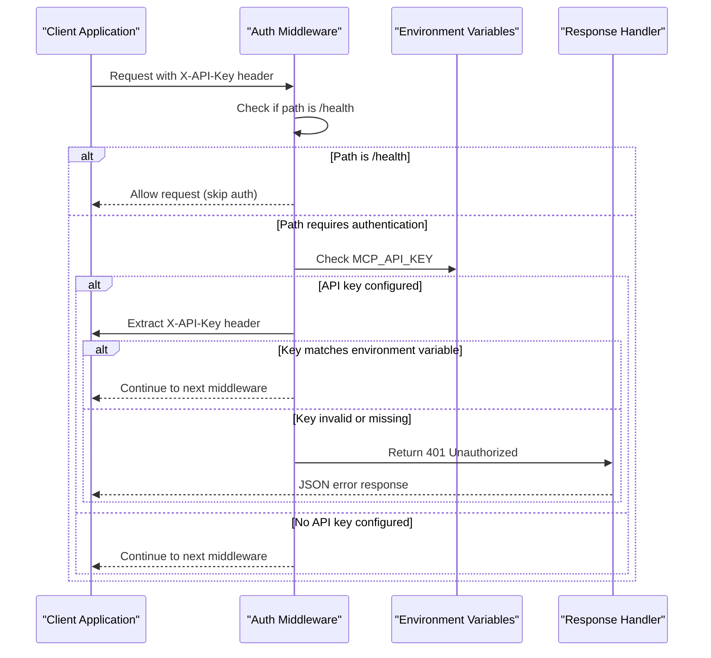
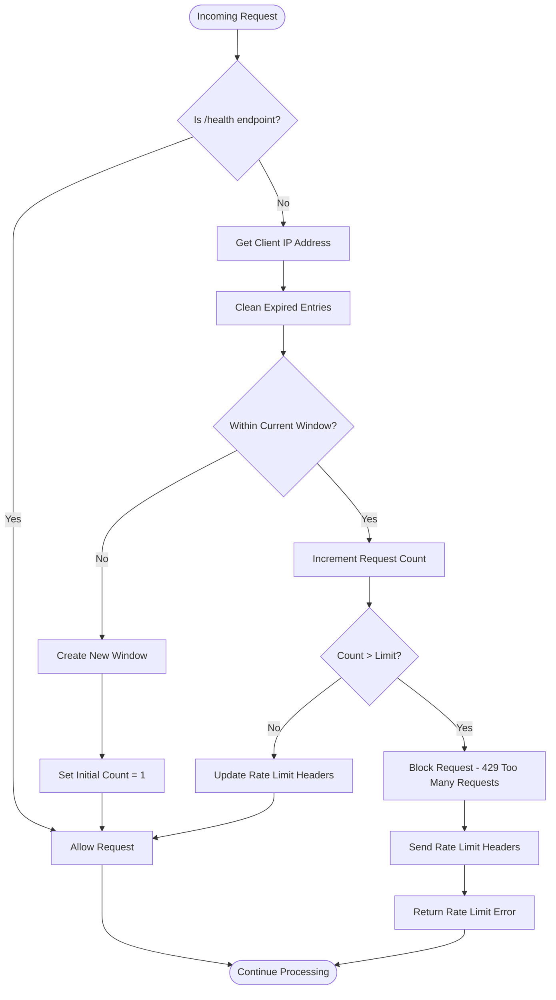
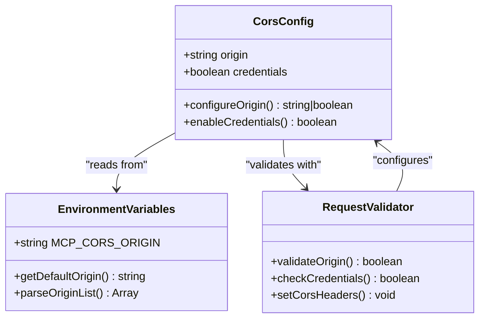
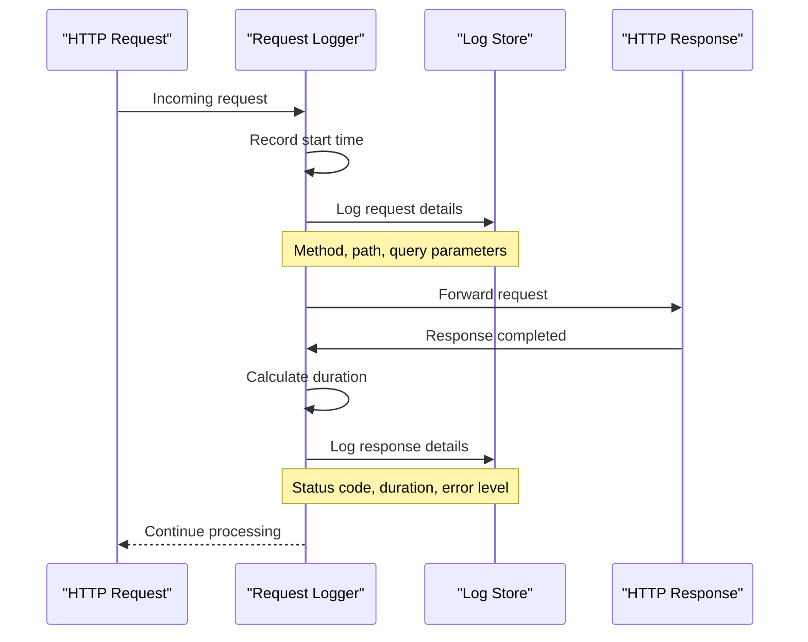
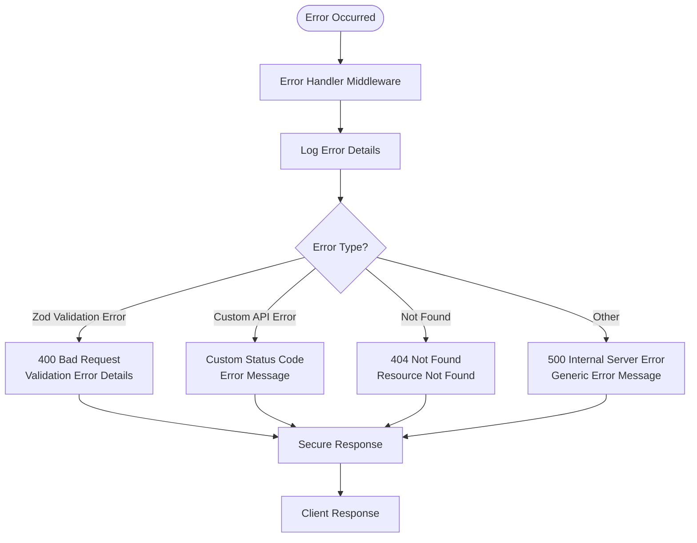

# Security Model

<cite>
**Referenced Files in This Document**
- [auth.ts](file://src/server/middleware/auth.ts)
- [rateLimiter.ts](file://src/server/middleware/rateLimiter.ts)
- [logging.ts](file://src/server/middleware/logging.ts)
- [errorHandler.ts](file://src/server/middleware/errorHandler.ts)
- [mcp-server.ts](file://src/server/mcp-server.ts)
- [logger.ts](file://src/server/utils/logger.ts)
- [statusController.ts](file://src/server/controllers/statusController.ts)
- [mcp.md](file://AI/mcp.md)
- [package.json](file://package.json)
</cite>

## Table of Contents
1. [Introduction](#introduction)
2. [Authentication Mechanism](#authentication-mechanism)
3. [Rate Limiting System](#rate-limiting-system)
4. [CORS Configuration](#cors-configuration)
5. [Logging and Monitoring](#logging-and-monitoring)
6. [Error Handling Security](#error-handling-security)
7. [Environment-Based Security Controls](#environment-based-security-controls)
8. [Security Best Practices](#security-best-practices)
9. [Deployment Considerations](#deployment-considerations)
10. [Troubleshooting Security Issues](#troubleshooting-security-issues)

## Introduction

The MCP (Model Context Protocol) Server implements a comprehensive security model designed to protect against unauthorized access, abuse, and common web vulnerabilities. The security architecture follows defense-in-depth principles, incorporating multiple layers of protection including authentication, rate limiting, CORS restrictions, and robust error handling.

The server operates with configurable security controls that adapt to different deployment environments, from local development to production systems requiring strict access controls. All security mechanisms are implemented as Express middleware, ensuring seamless integration with the server's request processing pipeline.

## Authentication Mechanism

### X-API-Key Header Authentication

The MCP Server implements optional API key authentication through the `X-API-Key` HTTP header. This authentication mechanism provides an additional layer of security for production deployments while maintaining accessibility for development environments.



**Diagram sources**
- [auth.ts](file://src/server/middleware/auth.ts#L1-L26)

### Authentication Flow Implementation

The authentication middleware implements a straightforward yet effective security check:

1. **Health Check Bypass**: Requests to the `/health` endpoint bypass authentication to allow monitoring and load balancer health checks
2. **Environment Variable Check**: The middleware reads the `MCP_API_KEY` environment variable to determine if authentication is required
3. **Header Validation**: When authentication is enabled, the middleware validates the presence and correctness of the `X-API-Key` header
4. **Error Response**: Invalid or missing API keys result in a standardized 401 Unauthorized response with detailed error information

### Security Considerations

- **Optional Deployment**: Authentication is optional and controlled by environment configuration, allowing flexible deployment scenarios
- **Header Security**: The `X-API-Key` header is transmitted over HTTPS connections to prevent interception
- **Standardized Responses**: Consistent error responses help attackers understand authentication requirements without leaking sensitive information
- **Health Endpoint Accessibility**: The `/health` endpoint remains accessible to enable monitoring and automated health checking

**Section sources**
- [auth.ts](file://src/server/middleware/auth.ts#L1-L26)

## Rate Limiting System

### Token Bucket Algorithm Implementation

The rate limiting middleware implements a token bucket algorithm to prevent abuse and ensure fair resource allocation. The system tracks request rates per IP address and enforces configurable limits.



**Diagram sources**
- [rateLimiter.ts](file://src/server/middleware/rateLimiter.ts#L1-L69)

### Rate Limiting Configuration

The rate limiting system provides several configurable parameters:

| Parameter | Environment Variable | Default Value | Description |
|-----------|---------------------|---------------|-------------|
| Request Limit | `MCP_RATE_LIMIT` | 100 | Maximum requests per minute per IP |
| Time Window | Fixed | 60 seconds | Duration of each rate limiting window |
| Storage | Memory | In-memory object | Rate limit state storage mechanism |

### Rate Limit Headers

The middleware automatically sets HTTP headers to provide rate limiting information:

- `X-RateLimit-Limit`: Maximum requests allowed in the current window
- `X-RateLimit-Remaining`: Remaining requests in the current window
- `X-RateLimit-Reset`: Timestamp when the window resets
- `Retry-After`: Seconds until the rate limit window resets

### Implementation Details

The rate limiter maintains an in-memory store that tracks request counts and expiration times for each client IP address. The system implements automatic cleanup of expired entries to prevent memory leaks during prolonged operation.

**Section sources**
- [rateLimiter.ts](file://src/server/middleware/rateLimiter.ts#L1-L69)

## CORS Configuration

### Origin-Based Access Control

The MCP Server implements Cross-Origin Resource Sharing (CORS) configuration to restrict access to trusted origins. The CORS policy is configurable through environment variables and provides fine-grained control over cross-origin requests.

### CORS Policy Implementation

The server uses the `cors` middleware with configurable origin settings:



**Diagram sources**
- [mcp-server.ts](file://src/server/mcp-server.ts#L22-L25)

### Security Benefits

- **Origin Validation**: Ensures requests originate from trusted domains only
- **Credential Support**: Allows cookies and authentication headers when credentials are enabled
- **Flexible Configuration**: Supports wildcard origins for development while restricting in production
- **Prevention of XSS Attacks**: Blocks unauthorized cross-origin requests that could exploit browser security policies

### Default Behavior

By default, the CORS configuration allows all origins (`*`) with credentials enabled, providing maximum flexibility for development environments. Production deployments should configure specific trusted origins to enhance security.

**Section sources**
- [mcp-server.ts](file://src/server/mcp-server.ts#L22-L25)

## Logging and Monitoring

### Comprehensive Request Logging

The logging middleware implements structured logging for all HTTP requests and responses, providing visibility into server operations and potential security threats.



**Diagram sources**
- [logging.ts](file://src/server/middleware/logging.ts#L1-L22)

### Logging Levels and Content

The logging system implements multiple severity levels with appropriate content for each:

| Level | Purpose | Logged Information |
|-------|---------|-------------------|
| Info | Normal operations | Request method, path, query parameters |
| Error | Error conditions | Request details, error messages, stack traces |
| Debug | Development debugging | Full request body (non-GET requests) |

### Security-Relevant Logging

The logging system captures security-relevant events:

- **Authentication Failures**: API key validation failures
- **Rate Limit Exceeded**: Requests blocked due to rate limiting
- **Error Conditions**: Unexpected errors that may indicate attacks
- **Health Checks**: Monitoring endpoint access for infrastructure health

### Log Format and Structure

Logs follow a consistent format with timestamps, severity levels, and structured data:

```
[2024-01-15T10:30:45.123Z] INFO  → GET /api/status
[2024-01-15T10:30:45.125Z] INFO  ← GET /api/status 200 (2ms)
```

**Section sources**
- [logging.ts](file://src/server/middleware/logging.ts#L1-L22)
- [logger.ts](file://src/server/utils/logger.ts#L1-L47)

## Error Handling Security

### Standardized Error Responses

The error handling middleware implements security-conscious error responses that prevent information leakage while providing useful feedback for debugging and monitoring.



**Diagram sources**
- [errorHandler.ts](file://src/server/middleware/errorHandler.ts#L1-L69)

### Error Response Structure

All error responses follow a consistent structure to aid in debugging and monitoring:

```typescript
{
  error: {
    code: string;        // Machine-readable error code
    message: string;     // Human-readable error message
    details?: any;       // Additional error details
  }
}
```

### Security-Conscious Error Handling

The error handler implements several security best practices:

- **Information Disclosure Prevention**: Production errors hide internal error details
- **Consistent Response Format**: All errors follow the same structure regardless of origin
- **Structured Logging**: All errors are logged with context and stack traces
- **Validation Error Specificity**: Zod validation errors provide detailed field-level information

### Error Types and HTTP Status Codes

| Error Type | HTTP Status | Security Impact | Information Provided |
|------------|-------------|-----------------|---------------------|
| UNAUTHORIZED | 401 | Low - Authentication failure | Generic authentication message |
| RATE_LIMIT_EXCEEDED | 429 | Medium - Abuse prevention | Retry-after timing information |
| VALIDATION_ERROR | 400 | Low - Client error | Field-specific validation details |
| NOT_FOUND | 404 | Low - Resource access | Generic resource not found |
| INTERNAL_SERVER_ERROR | 500 | High - Server issue | Generic error message (prod) |

**Section sources**
- [errorHandler.ts](file://src/server/middleware/errorHandler.ts#L1-L69)

## Environment-Based Security Controls

### Configuration-Driven Security

The MCP Server's security model is heavily influenced by environment variables, allowing administrators to configure security controls without code changes.

### Available Security Environment Variables

| Variable | Purpose | Default Value | Security Impact |
|----------|---------|---------------|-----------------|
| `MCP_API_KEY` | API key authentication | None (disabled) | Enables authentication layer |
| `MCP_RATE_LIMIT` | Requests per minute | 100 | Controls abuse prevention |
| `MCP_CORS_ORIGIN` | Allowed origins | `*` | Restricts cross-origin access |
| `MCP_SERVER_PORT` | Server port | 3000 | Controls network exposure |
| `MCP_SERVER_HOST` | Server host binding | localhost | Controls network accessibility |
| `MCP_LOG_LEVEL` | Logging verbosity | info | Controls audit trail depth |

### Security Configuration Patterns

#### Development Environment
```bash
# Minimal security for development
MCP_API_KEY=""                    # Disable authentication
MCP_RATE_LIMIT=1000               # Higher rate limits
MCP_CORS_ORIGIN="*"               # Allow all origins
MCP_LOG_LEVEL="debug"             # Verbose logging
```

#### Production Environment
```bash
# Enhanced security for production
MCP_API_KEY="your-secret-key-here" # Enable authentication
MCP_RATE_LIMIT=100                 # Moderate rate limits
MCP_CORS_ORIGIN="https://trusted-domain.com" # Restrict origins
MCP_LOG_LEVEL="info"               # Balanced logging
```

### Dynamic Security Adaptation

The server dynamically adapts its security posture based on environment configuration:

- **Authentication**: Automatically enabled when `MCP_API_KEY` is set
- **Rate Limiting**: Adjusts based on `MCP_RATE_LIMIT` value
- **CORS Policy**: Changes according to `MCP_CORS_ORIGIN` setting
- **Logging**: Adjusts verbosity based on `MCP_LOG_LEVEL`

**Section sources**
- [mcp-server.ts](file://src/server/mcp-server.ts#L14-L16)
- [auth.ts](file://src/server/middleware/auth.ts#L8-L10)
- [rateLimiter.ts](file://src/server/middleware/rateLimiter.ts#L10-L11)

## Security Best Practices

### Deployment Security Guidelines

#### Network Security
- **Bind to localhost**: Use `localhost` binding for development to prevent external access
- **Firewall Configuration**: Implement firewall rules to restrict access to the server port
- **Reverse Proxy**: Deploy behind a reverse proxy for additional security layers
- **HTTPS Termination**: Use HTTPS termination at the proxy level for encrypted communication

#### Authentication Security
- **Strong API Keys**: Generate strong, randomly generated API keys for production
- **Key Rotation**: Implement regular API key rotation procedures
- **Secure Storage**: Store API keys securely in environment variables or secret management systems
- **Key Validation**: Validate API keys at the earliest middleware stage

#### Rate Limiting Best Practices
- **Monitor Usage**: Track rate limit violations to identify potential abuse
- **Adjust Limits**: Tune rate limits based on legitimate usage patterns
- **Graceful Degradation**: Implement fallback mechanisms when rate limits are reached
- **Monitoring Integration**: Integrate rate limiting with monitoring systems

### Input Validation and Sanitization

While the current implementation focuses on middleware security, additional input validation should be implemented:

- **Body Parsing Limits**: The server already limits request body size to 10MB
- **Parameter Validation**: Implement schema validation for all request parameters
- **SQL Injection Protection**: Use prepared statements and parameterized queries
- **Cross-Site Scripting**: Implement input sanitization and output encoding

### Monitoring and Alerting

Implement comprehensive monitoring for security events:

- **Authentication Failures**: Monitor failed authentication attempts
- **Rate Limit Violations**: Track when clients exceed rate limits
- **Unusual Traffic Patterns**: Detect potential DDoS or scanning attempts
- **Error Rate Increases**: Monitor for unusual error patterns that may indicate attacks

## Deployment Considerations

### Production Hardening Checklist

#### Network Configuration
- [ ] Bind to localhost or private network interface
- [ ] Configure firewall rules to restrict access
- [ ] Implement reverse proxy with SSL termination
- [ ] Use non-standard ports for additional obfuscation

#### Authentication Setup
- [ ] Generate strong API keys for production
- [ ] Configure environment variables securely
- [ ] Implement key rotation procedures
- [ ] Test authentication mechanisms thoroughly

#### Rate Limiting Configuration
- [ ] Set appropriate rate limits for your workload
- [ ] Monitor rate limit violations
- [ ] Configure alerting for frequent rate limit hits
- [ ] Test rate limiting under load

#### Logging and Monitoring
- [ ] Configure centralized logging
- [ ] Set up security event monitoring
- [ ] Implement log retention policies
- [ ] Configure log aggregation and analysis

### Container Deployment Security

When deploying in containerized environments:

- **Resource Limits**: Set CPU and memory limits to prevent resource exhaustion
- **Network Policies**: Implement network policies to restrict inter-service communication
- **Security Context**: Run containers with minimal privileges
- **Secret Management**: Use Kubernetes secrets or equivalent for sensitive configuration

### Infrastructure Security

#### Load Balancer Configuration
- **Health Checks**: Configure health check endpoints carefully
- **Rate Limiting**: Implement rate limiting at the load balancer level
- **SSL Termination**: Terminate SSL at the load balancer
- **Access Logs**: Enable comprehensive access logging

#### Database Security
- **Connection Security**: Use encrypted database connections
- **Access Control**: Implement database-level access controls
- **Backup Security**: Secure database backups and restore procedures
- **Audit Logging**: Enable database audit logging for security events

## Troubleshooting Security Issues

### Common Authentication Problems

#### Issue: API Key Not Working
**Symptoms**: 401 Unauthorized responses despite correct API key
**Diagnosis Steps**:
1. Verify `MCP_API_KEY` environment variable is set correctly
2. Check for whitespace or special characters in the API key
3. Ensure the `X-API-Key` header is properly formatted
4. Review server logs for authentication-related errors

**Resolution**:
- Regenerate API key if corrupted
- Verify header format: `X-API-Key: your-api-key`
- Check environment variable loading in server startup logs

#### Issue: Health Check Failing
**Symptoms**: Health endpoint returns 401 Unauthorized
**Diagnosis**:
- Health checks bypass authentication, so this indicates a broader issue
- Check server startup logs for authentication middleware errors
- Verify environment variable loading

### Rate Limiting Troubleshooting

#### Issue: Frequent Rate Limit Errors
**Symptoms**: 429 Too Many Requests responses
**Diagnosis**:
1. Check current rate limit configuration
2. Monitor client request patterns
3. Verify rate limiting middleware is functioning
4. Review rate limit headers in responses

**Resolution**:
- Increase rate limit for legitimate high-volume clients
- Implement client-side exponential backoff
- Add caching to reduce redundant requests
- Consider load balancing to distribute traffic

### CORS Configuration Issues

#### Issue: Cross-Origin Requests Blocked
**Symptoms**: Browser CORS errors despite server configuration
**Diagnosis**:
1. Verify `MCP_CORS_ORIGIN` is set correctly
2. Check if credentials are required for your use case
3. Review browser developer console for specific CORS errors
4. Test with different origin configurations

**Resolution**:
- Set specific allowed origins instead of wildcards
- Enable credentials only when necessary
- Use browser developer tools to debug CORS headers
- Test with curl or Postman to isolate browser-specific issues

### Performance and Security Monitoring

#### Monitoring Tools and Techniques
- **Log Analysis**: Use tools like ELK stack or Splunk for log analysis
- **Metrics Collection**: Implement Prometheus metrics for rate limiting and authentication
- **Security Scanning**: Regular vulnerability scans of the deployed system
- **Penetration Testing**: Periodic security assessments by qualified professionals

#### Alerting Configuration
- **Authentication Failures**: Alert on sustained authentication failures
- **Rate Limit Violations**: Notify when rate limits are frequently hit
- **Error Rate Spikes**: Alert on unusual increases in error rates
- **Resource Exhaustion**: Monitor for memory and CPU exhaustion

**Section sources**
- [mcp.md](file://AI/mcp.md#L354-L390)