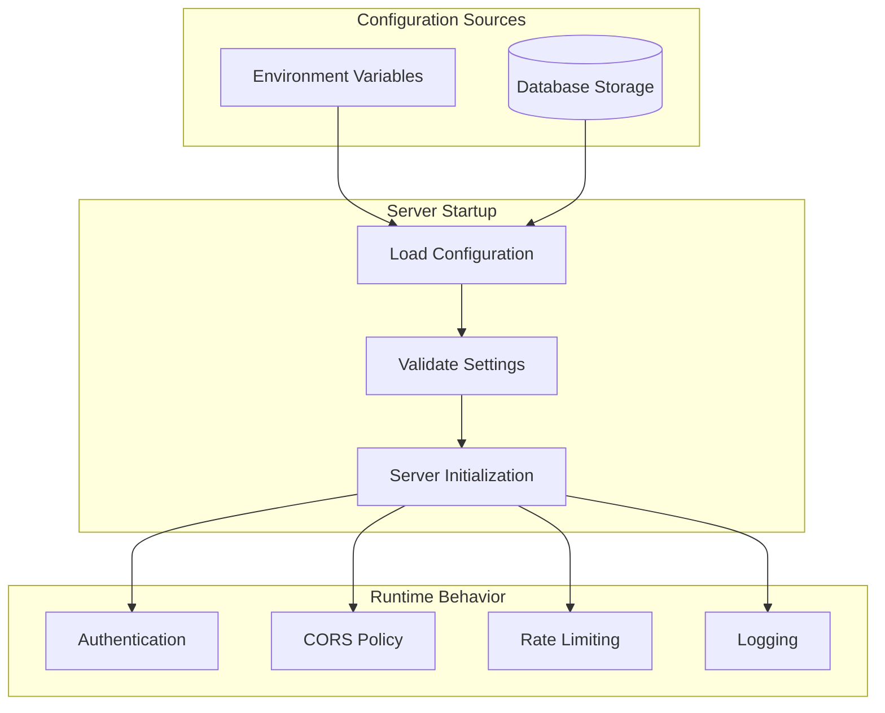
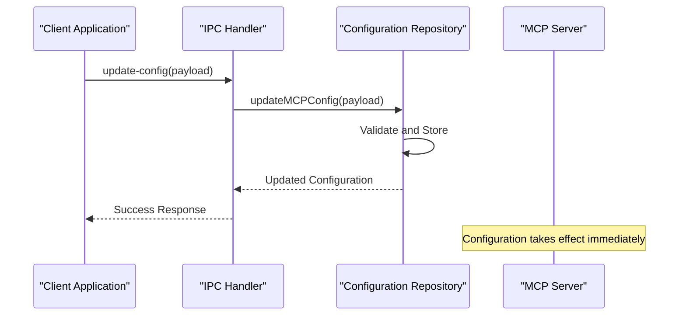
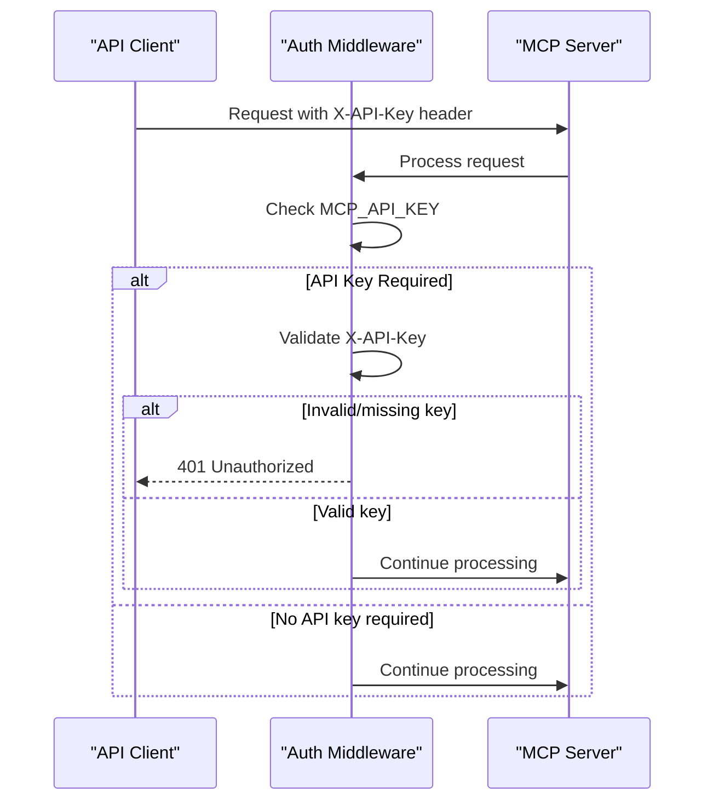

# Server Configuration

<cite>
**Referenced Files in This Document**
- [mcp-server.ts](file://src/server/mcp-server.ts)
- [auth.ts](file://src/server/middleware/auth.ts)
- [rateLimiter.ts](file://src/server/middleware/rateLimiter.ts)
- [errorHandler.ts](file://src/server/middleware/errorHandler.ts)
- [logger.ts](file://src/server/utils/logger.ts)
- [mcp.ts](file://src/main/ipc/mcp.ts)
- [mcpRepo.ts](file://src/database/mcpRepo.ts)
- [init.ts](file://src/database/init.ts)
- [types.ts](file://src/common/types.ts)
- [package.json](file://package.json)
</cite>

## Table of Contents
1. [Introduction](#introduction)
2. [Environment Variables](#environment-variables)
3. [Configuration Architecture](#configuration-architecture)
4. [Default Values and Production Settings](#default-values-and-production-settings)
5. [Configuration Management](#configuration-management)
6. [Security Configuration](#security-configuration)
7. [Network Binding](#network-binding)
8. [Deployment Considerations](#deployment-considerations)
9. [Troubleshooting](#troubleshooting)
10. [Best Practices](#best-practices)

## Introduction

The MCP (Model Control Protocol) Server in LifeOS is a configurable Express.js-based HTTP server that provides API endpoints for managing tasks, projects, habits, and other productivity features. The server's behavior, security settings, and operational parameters are controlled through environment variables and database configuration, allowing for flexible deployment across development, testing, and production environments.

The server architecture follows a modular design with middleware-based security, rate limiting, and logging capabilities. Configuration is managed through both environment variables and persistent database storage, ensuring that settings persist across server restarts while allowing runtime modifications through the IPC interface.

## Environment Variables

The MCP Server configuration is primarily controlled through environment variables that define server behavior, security settings, and operational parameters. These variables are processed during server startup and influence various aspects of the server's operation.

### Core Server Configuration

| Variable | Description | Default Value | Type | Security Impact |
|----------|-------------|---------------|------|-----------------|
| `MCP_SERVER_PORT` | TCP port for server binding | `3000` | Integer (1-65535) | Medium - Controls access point |
| `MCP_SERVER_HOST` | Network interface to bind | `'localhost'` | String | High - Controls network accessibility |
| `MCP_API_KEY` | Authentication API key | `undefined` | String | Critical - Enables authentication |
| `MCP_CORS_ORIGIN` | Allowed CORS origins | `'*'` | String | Medium - Controls cross-origin access |
| `MCP_RATE_LIMIT` | Requests per minute limit | `100` | Integer | Low - Prevents abuse |

### Logging Configuration

| Variable | Description | Default Value | Options | Purpose |
|----------|-------------|---------------|---------|---------|
| `MCP_LOG_LEVEL` | Log verbosity level | `'info'` | `'debug'`, `'info'`, `'warn'`, `'error'` | Debugging and monitoring |

**Section sources**
- [mcp-server.ts](file://src/server/mcp-server.ts#L18-L19)
- [logger.ts](file://src/server/utils/logger.ts#L3-L4)
- [rateLimiter.ts](file://src/server/middleware/rateLimiter.ts#L8)

## Configuration Architecture

The MCP Server implements a dual-layer configuration system that combines environment variables with persistent database storage. This architecture ensures flexibility during development while maintaining stability in production environments.



**Diagram sources**
- [mcp-server.ts](file://src/server/mcp-server.ts#L18-L19)
- [mcpRepo.ts](file://src/database/mcpRepo.ts#L4-L22)

### Configuration Priority

The server follows a specific priority order when resolving configuration values:

1. **Database Configuration** - Persistent settings stored in the database
2. **Environment Variables** - Runtime environment settings
3. **Hardcoded Defaults** - Fallback values defined in code

This priority ensures that database settings take precedence over environment variables, allowing for persistent configuration changes while still supporting runtime environment customization.

**Section sources**
- [mcp-server.ts](file://src/server/mcp-server.ts#L18-L19)
- [mcpRepo.ts](file://src/database/mcpRepo.ts#L4-L22)

## Default Values and Production Settings

### Development Defaults

During development, the server operates with relaxed security settings and local network binding for ease of testing and debugging:

- **Port**: `3000` - Standard development port
- **Host**: `'localhost'` - Local access only
- **CORS**: `'*'` - Allow all origins
- **API Key**: Not required - No authentication
- **Rate Limit**: `100` requests per minute
- **Log Level**: `'info'` - Balanced logging

### Production Recommendations

For production deployments, the following configuration changes are strongly recommended:

#### Security Hardening
```bash
# Secure port assignment (avoid common ports)
MCP_SERVER_PORT=8080

# Bind to specific interface (never 0.0.0.0 in production)
MCP_SERVER_HOST=127.0.0.1

# Enable API key authentication
MCP_API_KEY=your_secure_random_api_key_here

# Restrict CORS to specific domains
MCP_CORS_ORIGIN=https://yourdomain.com

# Lower rate limits for security
MCP_RATE_LIMIT=50
```

#### Performance Tuning
```bash
# Higher rate limits for legitimate traffic
MCP_RATE_LIMIT=200

# Production log level
MCP_LOG_LEVEL=warn
```

### Database Schema Configuration

The server automatically initializes with the following default database configuration:

| Field | Default Value | Description |
|-------|---------------|-------------|
| `port` | `3000` | Server listening port |
| `host` | `'localhost'` | Network interface binding |
| `enabled` | `true` | Server enable/disable flag |
| `auto_start` | `true` | Automatic startup on application launch |

**Section sources**
- [init.ts](file://src/database/init.ts#L124-L135)
- [mcpRepo.ts](file://src/database/mcpRepo.ts#L4-L22)

## Configuration Management

### Database-Based Configuration

The server stores configuration in a dedicated `mcp_config` table with the following structure:

```sql
CREATE TABLE mcp_config (
  id INTEGER PRIMARY KEY CHECK (id = 1),
  port INTEGER NOT NULL DEFAULT 3000,
  host TEXT NOT NULL DEFAULT 'localhost',
  enabled INTEGER NOT NULL DEFAULT 1,
  auto_start INTEGER NOT NULL DEFAULT 1,
  created_at TEXT NOT NULL DEFAULT CURRENT_TIMESTAMP,
  updated_at TEXT NOT NULL DEFAULT CURRENT_TIMESTAMP
);
```

### Runtime Configuration Updates

Configuration changes can be made through the IPC interface, allowing for dynamic reconfiguration without server restart:



**Diagram sources**
- [mcp.ts](file://src/main/ipc/mcp.ts#L95-L105)
- [mcpRepo.ts](file://src/database/mcpRepo.ts#L24-L58)

### Configuration Validation

The server implements comprehensive validation for configuration updates:

- **Port Validation**: Ensures port numbers are within valid range (1-65535)
- **Host Validation**: Validates network interface specifications
- **Boolean Validation**: Ensures boolean fields are properly formatted
- **Type Validation**: Maintains data type consistency

**Section sources**
- [mcpRepo.ts](file://src/database/mcpRepo.ts#L24-L58)
- [mcp.ts](file://src/main/ipc/mcp.ts#L95-L105)

## Security Configuration

### API Key Authentication

The server implements API key-based authentication when the `MCP_API_KEY` environment variable is set. This provides an additional layer of security for production deployments.

#### Authentication Flow



**Diagram sources**
- [auth.ts](file://src/server/middleware/auth.ts#L4-L26)

#### API Key Best Practices

- **Generate Strong Keys**: Use cryptographically secure random generators
- **Rotate Regularly**: Implement key rotation policies
- **Environment Isolation**: Store keys in secure environment management systems
- **Access Control**: Limit API key distribution to authorized clients only

### CORS Policy Enforcement

Cross-Origin Resource Sharing (CORS) configuration controls which domains can access the server:

- **Development**: `'*'` - Allow all origins (relaxed security)
- **Production**: Specific domain(s) - Restrict to known clients
- **Credentials**: Enabled for authenticated requests

**Section sources**
- [auth.ts](file://src/server/middleware/auth.ts#L4-L26)
- [mcp-server.ts](file://src/server/mcp-server.ts#L23-L26)

## Network Binding

### Host Binding Options

The server supports various network interface bindings depending on deployment requirements:

#### Local Development
```bash
MCP_SERVER_HOST=localhost
```
- **Scope**: Accessible only from localhost
- **Security**: Highest security level
- **Use Case**: Development and testing environments

#### Internal Network Access
```bash
MCP_SERVER_HOST=127.0.0.1
```
- **Scope**: Accessible from local machine only
- **Security**: High security
- **Use Case**: Single-machine deployments

#### Network Accessibility
```bash
MCP_SERVER_HOST=0.0.0.0
```
- **Scope**: Accessible from any network interface
- **Security**: Medium security (requires firewall protection)
- **Use Case**: Multi-client deployments

#### Specific Interface Binding
```bash
MCP_SERVER_HOST=192.168.1.100
```
- **Scope**: Accessible only on specified interface
- **Security**: Medium security
- **Use Case**: Specific network segment access

### Port Configuration

Port selection follows standard conventions with special considerations:

- **Development**: `3000` - Common development port
- **Production**: `8080` or higher - Avoid common service ports
- **Custom**: Any available port (1-65535)
- **Firewall**: Ensure selected port is open in firewall rules

**Section sources**
- [mcp-server.ts](file://src/server/mcp-server.ts#L18-L19)
- [mcp.ts](file://src/main/ipc/mcp.ts#L30-L40)

## Deployment Considerations

### Docker Deployment

For containerized deployments, environment variables should be passed to the container:

```dockerfile
FROM node:18-alpine
WORKDIR /app
COPY package*.json ./
RUN npm ci
COPY . .
EXPOSE 8080
ENV MCP_SERVER_PORT=8080
ENV MCP_SERVER_HOST=0.0.0.0
ENV MCP_API_KEY=${MCP_API_KEY}
CMD ["npm", "run", "mcp:start"]
```

### Systemd Service Configuration

For Linux production deployments, create a systemd service:

```ini
[Unit]
Description=MCP Server
After=network.target

[Service]
Type=simple
User=lifeos
WorkingDirectory=/opt/lifeos
Environment=MCP_SERVER_PORT=8080
Environment=MCP_SERVER_HOST=0.0.0.0
Environment=MCP_API_KEY=${MCP_API_KEY}
ExecStart=/usr/bin/npm run mcp:start
Restart=always
RestartSec=10

[Install]
WantedBy=multi-user.target
```

### Reverse Proxy Configuration

When using reverse proxies (Nginx, Apache), configure appropriate headers:

```nginx
location / {
    proxy_pass http://127.0.0.1:8080;
    proxy_set_header Host $host;
    proxy_set_header X-Real-IP $remote_addr;
    proxy_set_header X-Forwarded-For $proxy_add_x_forwarded_for;
    proxy_set_header X-Forwarded-Proto $scheme;
}
```

### SSL/TLS Configuration

For production HTTPS deployments:

```bash
# Generate self-signed certificate (development)
openssl req -x509 -newkey rsa:4096 -nodes -out cert.pem -keyout key.pem -days 365

# Or use Let's Encrypt for production
certbot --standalone -d yourdomain.com
```

**Section sources**
- [mcp.ts](file://src/main/ipc/mcp.ts#L30-L40)
- [package.json](file://package.json#L13-L15)

## Troubleshooting

### Common Configuration Issues

#### Port Already in Use
**Symptoms**: Server fails to start with port binding errors
**Solution**: Change port or stop conflicting services
```bash
# Check port usage
netstat -an | grep :8080
# or
lsof -i :8080
```

#### Permission Denied
**Symptoms**: Cannot bind to privileged ports (< 1024)
**Solution**: Use higher port numbers or run with elevated privileges
```bash
# Use sudo (not recommended for production)
sudo MCP_SERVER_PORT=80 npm run mcp:start
# or use port forwarding
iptables -t nat -A PREROUTING -p tcp --dport 80 -j REDIRECT --to-port 8080
```

#### CORS Errors
**Symptoms**: Browser blocks API requests
**Solution**: Configure appropriate CORS origins
```bash
MCP_CORS_ORIGIN=https://yourdomain.com
```

### Debugging Configuration

Enable debug logging to troubleshoot configuration issues:

```bash
MCP_LOG_LEVEL=debug npm run mcp:dev
```

### Health Check Monitoring

The server provides a health endpoint for monitoring:

```bash
curl http://localhost:3000/health
# Response: {"status":"ok","timestamp":"2024-01-01T00:00:00.000Z"}
```

**Section sources**
- [mcp-server.ts](file://src/server/mcp-server.ts#L39-L43)
- [logger.ts](file://src/server/utils/logger.ts#L15-L47)

## Best Practices

### Security Hardening

1. **Always Use API Keys in Production**
   ```bash
   MCP_API_KEY=$(openssl rand -hex 32)
   ```

2. **Restrict Network Access**
   ```bash
   MCP_SERVER_HOST=127.0.0.1  # Local access only
   # or
   MCP_SERVER_HOST=10.0.0.100  # Specific internal IP
   ```

3. **Implement Proper CORS Policies**
   ```bash
   MCP_CORS_ORIGIN=https://trusted-domain.com
   ```

4. **Use Environment Files**
   ```bash
   # .env.production
   MCP_SERVER_PORT=8080
   MCP_SERVER_HOST=127.0.0.1
   MCP_API_KEY=your_secure_key_here
   MCP_CORS_ORIGIN=https://yourdomain.com
   MCP_RATE_LIMIT=50
   MCP_LOG_LEVEL=warn
   ```

### Performance Optimization

1. **Optimize Rate Limits**
   - Monitor actual usage patterns
   - Adjust limits based on legitimate traffic
   - Consider client-side caching

2. **Configure Appropriate Log Levels**
   ```bash
   # Development
   MCP_LOG_LEVEL=debug
   
   # Production
   MCP_LOG_LEVEL=warn
   ```

3. **Monitor Resource Usage**
   - Track memory consumption
   - Monitor CPU utilization
   - Watch connection counts

### Maintenance Procedures

1. **Regular Configuration Backups**
   - Export database configuration
   - Backup environment files
   - Document changes

2. **Monitoring and Alerting**
   - Monitor server health endpoints
   - Track error rates
   - Alert on configuration changes

3. **Testing Configuration Changes**
   - Test in staging environment first
   - Validate API key authentication
   - Verify CORS policies
   - Test rate limiting behavior

**Section sources**
- [rateLimiter.ts](file://src/server/middleware/rateLimiter.ts#L8-L69)
- [logger.ts](file://src/server/utils/logger.ts#L3-L4)