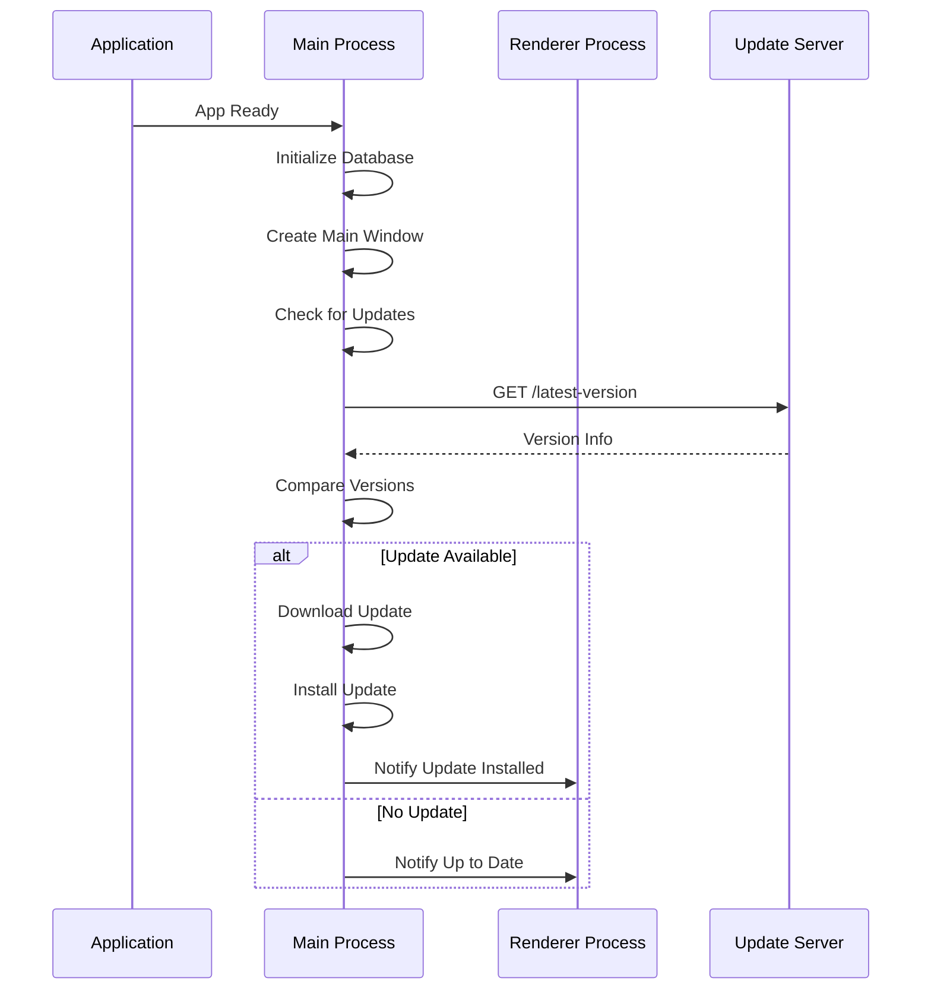

# Auto-Update Mechanism

<cite>
**Referenced Files in This Document**   
- [package.json](file://package.json)
- [AI/BUILD-RELEASE.md](file://AI/BUILD-RELEASE.md)
- [AI/ARCHITECTURE.md](file://AI/ARCHITECTURE.md)
- [src/main/index.ts](file://src/main/index.ts)
- [src/preload/index.ts](file://src/preload/index.ts)
</cite>

## Table of Contents
1. [Introduction](#introduction)
2. [Configuration and Setup](#configuration-and-setup)
3. [Update Channels](#update-channels)
4. [Update Triggers](#update-triggers)
5. [Distribution Sources](#distribution-sources)
6. [Release Notes](#release-notes)
7. [Security Considerations](#security-considerations)
8. [Testing in Staging](#testing-in-staging)
9. [Conclusion](#conclusion)

## Introduction
The Auto-Update Mechanism in the LifeOS application leverages `electron-updater` to provide seamless application updates for users. This system enables the application to check for updates on startup and through the About dialog, download and install updates automatically, and display release notes to inform users about new features and improvements. The implementation supports both local feed and GitHub Releases as distribution sources, allowing flexibility in deployment strategies. This documentation details the configuration, implementation, and best practices for managing application updates securely and efficiently.

## Configuration and Setup
The auto-update functionality is configured through the `package.json` file, where the `build` section specifies the application's metadata and update settings. The `appId` and `productName` are defined to uniquely identify the application, while the `win`, `mac`, and `linux` sections configure platform-specific build options. The `nsis` configuration within the `win` section includes settings for the installer and uninstaller icons. The `postinstall` script runs `electron-builder install-app-deps` to ensure native dependencies are properly installed. The `dist` script executes `electron-builder` to package the application with auto-update capabilities enabled.

**Section sources**
- [package.json](file://package.json#L1-L108)

## Update Channels
The application supports multiple update channels, which are determined by the version's pre-release components. If the version is `0.12.1-alpha.1`, the channel will be set to `alpha`; otherwise, it defaults to `latest`. This channel detection is automatic and helps in managing different release streams such as alpha, beta, and stable. The `detectUpdateChannel` option in the build configuration controls this behavior, defaulting to `true`. This allows developers to release updates to specific user groups based on their version, facilitating staged rollouts and beta testing.

**Section sources**
- [AI/BUILD-RELEASE.md](file://AI/BUILD-RELEASE.md#L10)
- [AI/ARCHITECTURE.md](file://AI/ARCHITECTURE.md#L15)

## Update Triggers
Updates are checked automatically on application startup. This is handled in the main process where the application initializes and registers IPC handlers. The `createMainWindow` function is called after database initialization, and if not in development mode, it attempts to start the MCP server if auto-start is enabled. While the current implementation does not explicitly show an About dialog for manual update checks, the architecture supports such a feature through IPC communication between the main and renderer processes. The preload script exposes an API to the renderer, which could be extended to include update check functionality triggered by user interaction in the About dialog.

**Diagram sources **
- [src/main/index.ts](file://src/main/index.ts#L39-L85)
- [src/preload/index.ts](file://src/preload/index.ts#L1-L201)

## Distribution Sources
The application supports two primary distribution sources for updates: a local feed and GitHub Releases. The local feed is configured through the `generic` provider in the build configuration, specifying a base URL where update files are hosted. For GitHub Releases, the `github` provider is used, which automatically detects the repository from the `.git/config` file or the `repository` field in `package.json`. The `generateUpdatesFilesForAllChannels` option, when enabled, ensures that update files are generated for all channels (alpha, beta, latest), allowing users on different channels to receive appropriate updates.

**Section sources**
- [AI/BUILD-RELEASE.md](file://AI/BUILD-RELEASE.md#L10)
- [package.json](file://package.json#L1-L108)

## Release Notes
Release notes are an integral part of the update process, providing users with information about changes and improvements in each release. The application is designed to read release notes from a file named `release-notes.md` or platform-specific variants like `release-notes-mac.md` located in the build resources directory. These notes are included in the update information sent to the client, allowing the application to display them during the update process. This ensures that users are informed about what has changed, enhancing transparency and user satisfaction.

**Section sources**
- [AI/BUILD-RELEASE.md](file://AI/BUILD-RELEASE.md#L10)

## Security Considerations
Security is paramount when downloading and installing updates. The application uses HTTPS for all update requests to ensure the integrity and confidentiality of the data. The `electron-updater` library verifies the authenticity of updates by checking digital signatures and hashes. The `updaterCacheDirName` is derived from the sanitized product name to prevent path traversal attacks. Additionally, the application should validate the source of updates, especially when using a local feed, to prevent man-in-the-middle attacks. Developers should ensure that the update server is secured and that only authorized personnel can publish updates.

**Section sources**
- [AI/BUILD-RELEASE.md](file://AI/BUILD-RELEASE.md#L10)
- [package.json](file://package.json#L1-L108)

## Testing in Staging
Testing the update flow in a staging environment is crucial to ensure a smooth user experience. Developers can simulate different update scenarios by modifying the version number and release notes in the staging environment. The `PUBLISH_FOR_PULL_REQUEST` environment variable can be set to `true` to enable publishing for pull requests, allowing updates to be tested without affecting the production release. This setup enables teams to verify the update process, including download, installation, and restart, before rolling out to all users. Automated tests can be written to validate the update mechanism, ensuring reliability and stability.

**Section sources**
- [AI/BUILD-RELEASE.md](file://AI/BUILD-RELEASE.md#L10)

## Conclusion
The Auto-Update Mechanism in the LifeOS application provides a robust and flexible solution for delivering updates to users. By leveraging `electron-updater` and supporting multiple distribution sources, the application can efficiently manage updates across different platforms and channels. The integration of release notes and security best practices ensures that users are informed and protected. Testing in staging environments allows developers to validate the update process, minimizing the risk of issues in production. This comprehensive approach to application updates enhances user experience and maintains the application's reliability and security.