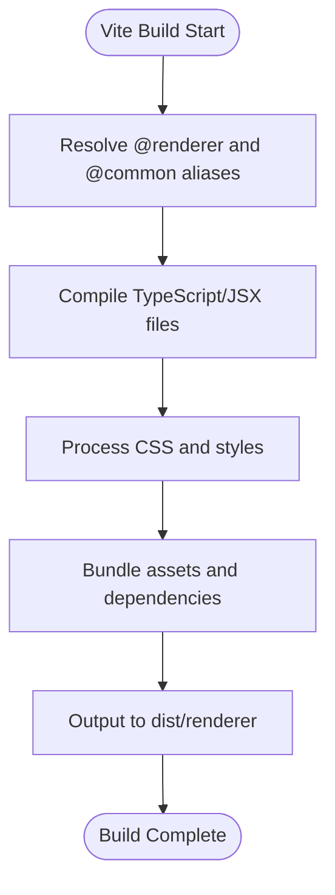
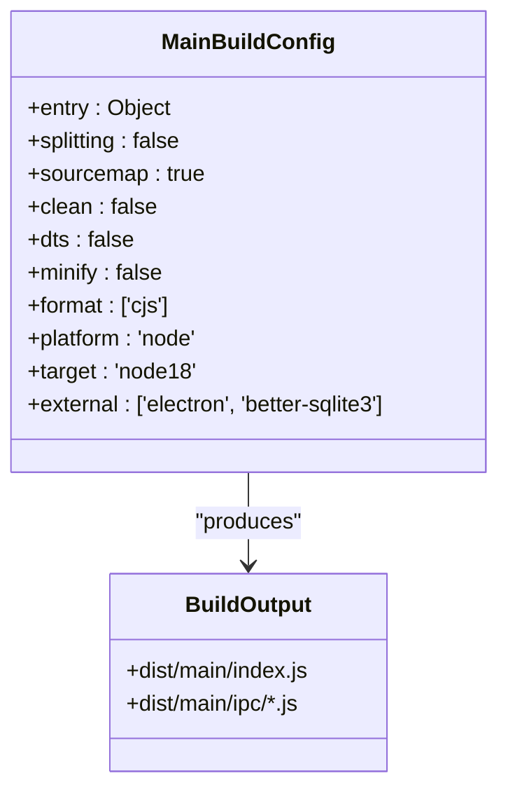
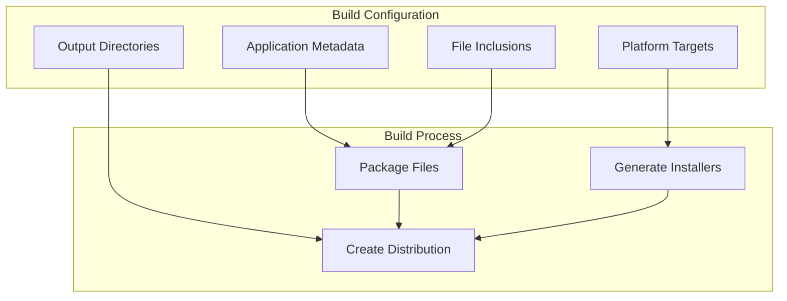
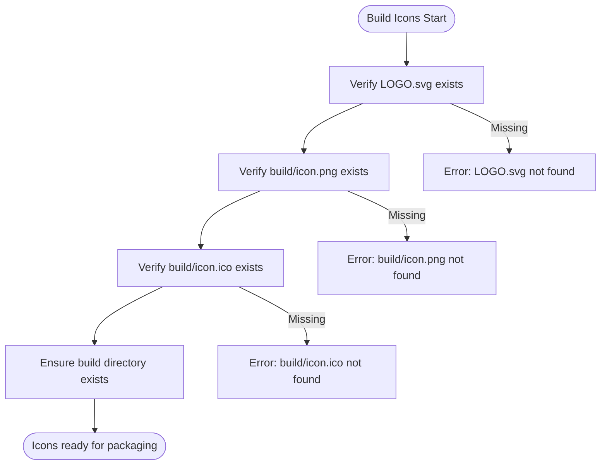

# Build and Deployment

<cite>
**Referenced Files in This Document**   
- [package.json](file://package.json)
- [configs/tsup.config.ts](file://configs/tsup.config.ts)
- [configs/vite.config.ts](file://configs/vite.config.ts)
- [scripts/build-icons.js](file://scripts/build-icons.js)
- [scripts/convert-svg-to-png.ps1](file://scripts/convert-svg-to-png.ps1)
- [tsconfig.main.json](file://tsconfig.main.json)
- [tsconfig.server.json](file://tsconfig.server.json)
</cite>

## Table of Contents
1. [Build Pipeline Overview](#build-pipeline-overview)
2. [Component Build Processes](#component-build-processes)
3. [Packaging Configuration](#packaging-configuration)
4. [Platform-Specific Builds](#platform-specific-builds)
5. [Versioning and Distribution](#versioning-and-distribution)
6. [Build Optimization](#build-optimization)

## Build Pipeline Overview

The LifeOS application utilizes a comprehensive build pipeline that coordinates multiple tools and processes to compile and package the Electron application. The build process is orchestrated through npm scripts defined in package.json, which coordinate Vite for the renderer, tsup for Node.js components, and electron-builder for final packaging.

The primary build workflow follows this sequence:
1. Icon generation and verification
2. Renderer component compilation with Vite
3. Main process compilation with tsup
4. Preload script compilation with tsup
5. Server component compilation with tsup
6. Final packaging with electron-builder

The build process is initiated through the `build` script, which executes all component builds in sequence, ensuring proper dependency ordering. The `dist` script combines the build process with electron-builder to create distributable packages.

**Section sources**
- [package.json](file://package.json#L20-L40)

## Component Build Processes

### Renderer Build Process

The renderer component, containing the React-based user interface, is built using Vite with a custom configuration. The build process compiles TypeScript and JSX files, processes CSS, and bundles assets for optimal web performance.

The Vite configuration specifies the entry point at `src/renderer` and outputs to `dist/renderer`. It includes React plugin support and establishes path aliases for `@renderer` and `@common` imports, enabling clean module references throughout the codebase.

**Diagram sources**
- [configs/vite.config.ts](file://configs/vite.config.ts#L1-L23)

**Section sources**
- [configs/vite.config.ts](file://configs/vite.config.ts#L1-L23)
- [package.json](file://package.json#L25-L26)

### Main Process Build Process

The main process, which runs in the Electron main thread, is compiled using tsup with a specialized configuration. This configuration ensures proper bundling of Electron main process modules while maintaining compatibility with Node.js APIs.

The tsup configuration includes multiple entry points for the main process and its IPC handlers, preserving the modular structure while creating a single output bundle. The build targets Node.js 18 with CommonJS modules, and excludes Electron and better-sqlite3 from bundling to maintain native module compatibility.

**Diagram sources**
- [configs/tsup.config.ts](file://configs/tsup.config.ts#L1-L30)

**Section sources**
- [configs/tsup.config.ts](file://configs/tsup.config.ts#L1-L30)
- [tsconfig.main.json](file://tsconfig.main.json#L1-L28)
- [package.json](file://package.json#L27-L28)

### Preload and Server Build Processes

Both the preload script and server components use the same tsup configuration as the main process but with different entry points and output directories. The preload script acts as a bridge between the renderer and main processes, while the server component handles backend services.

The server build is configured to output both ESM and CJS formats to support different module systems, ensuring compatibility across various Node.js environments. This dual-format output enables the server component to be used in both modern ESM contexts and traditional CommonJS applications.

**Section sources**
- [configs/tsup.config.ts](file://configs/tsup.config.ts#L1-L30)
- [package.json](file://package.json#L29-L30)

## Packaging Configuration

### Electron-Builder Configuration

The application packaging is managed by electron-builder, configured through the `build` section in package.json. This configuration defines the application metadata, file inclusions, and platform-specific packaging options.

The build configuration specifies the application ID, product name, and included files, ensuring all necessary assets are packaged. It also defines the output directory structure, with builds directed to the `release` folder and build resources sourced from the `build` directory.

**Diagram sources**
- [package.json](file://package.json#L10-L40)

**Section sources**
- [package.json](file://package.json#L10-L40)
- [release/builder-effective-config.yaml](file://release/builder-effective-config.yaml#L1-L39)

### Icon Management System

The build process includes a robust icon management system that verifies the presence of required icon files before packaging. The system requires two key assets:
- `build/icon.png` (1024x1024 PNG) for macOS and Linux applications
- `build/icon.ico` (multi-size ICO) for Windows installers

The `build-icons.js` script validates these assets and provides clear error messages when files are missing, including guidance for creating the required ICO file. This verification step prevents packaging failures due to missing icon resources.

**Diagram sources**
- [scripts/build-icons.js](file://scripts/build-icons.js#L1-L51)

**Section sources**
- [scripts/build-icons.js](file://scripts/build-icons.js#L1-L51)
- [scripts/convert-svg-to-png.ps1](file://scripts/convert-svg-to-png.ps1#L1)
- [AI/ICONS.md](file://AI/ICONS.md#L70-L121)

## Platform-Specific Builds

### Windows Build Configuration

The Windows build targets NSIS (Nullsoft Scriptable Install System) and portable formats for x64 architecture. The NSIS installer provides a traditional installation experience with options for custom installation directories, while the portable version allows users to run the application without installation.

The configuration includes Windows-specific settings such as installer and uninstaller icons, ensuring a professional appearance throughout the installation process. The one-click installation is disabled to give users control over the installation location.

**Section sources**
- [package.json](file://package.json#L31-L39)
- [release/builder-effective-config.yaml](file://release/builder-effective-config.yaml#L20-L30)

### macOS Build Configuration

The macOS build targets DMG (Disk Image) and ZIP formats, with the application categorized as productivity software in the App Store. The DMG format provides a standard macOS installation experience, while the ZIP format offers a compressed archive for direct application use.

The configuration specifies the application category as `public.app-category.productivity`, ensuring proper categorization in the macOS Launchpad and App Store (if distributed through that channel).

**Section sources**
- [package.json](file://package.json#L40-L45)
- [release/builder-effective-config.yaml](file://release/builder-effective-config.yaml#L31-L36)

### Linux Build Configuration

The Linux build targets AppImage and DEB formats, catering to different distribution methods. AppImage provides a universal package that can run on most Linux distributions without installation, while DEB is optimized for Debian-based systems like Ubuntu.

The application is categorized under "Office" in the Linux desktop environment, ensuring it appears in the appropriate application menu section. Both formats include the required PNG icon for proper display in file managers and application launchers.

**Section sources**
- [package.json](file://package.json#L46-L51)
- [release/builder-effective-config.yaml](file://release/builder-effective-config.yaml#L37-L40)

## Versioning and Distribution

### Version Management

The application version is managed through the `version` field in package.json, currently set to 0.1.11. This semantic versioning follows the MAJOR.MINOR.PATCH format, allowing for clear communication of changes and compatibility.

The version is automatically included in all generated packages, ensuring traceability across different builds and releases. The electron-builder configuration inherits this version from package.json, maintaining consistency across all distribution artifacts.

**Section sources**
- [package.json](file://package.json#L2)

### Distribution Channels

The build process supports multiple distribution channels through different npm scripts:
- `pack`: Creates unpacked application directories for testing
- `dist`: Creates fully packaged distributable files for all configured platforms
- `build`: Compiles all components without packaging

The generated packages are output to the `release` directory, with platform-specific subdirectories containing the final distributable files. This structure facilitates automated deployment to various distribution platforms.

**Section sources**
- [package.json](file://package.json#L38-L40)

## Build Optimization

### Performance Considerations

The build configuration prioritizes development experience and debugging capabilities over aggressive optimization. Source maps are enabled for all components, facilitating debugging in both development and production environments.

The current configuration does not include minification (`minify: false` in tsup.config.ts), preserving code readability for debugging purposes. This approach balances performance with maintainability, allowing developers to effectively troubleshoot issues in production builds.

**Section sources**
- [configs/tsup.config.ts](file://configs/tsup.config.ts#L8)
- [configs/vite.config.ts](file://configs/vite.config.ts#L15)

### Size Optimization

While the current build process focuses on functionality and developer experience, several opportunities exist for size optimization:
- Enable minification in tsup configuration for production builds
- Implement code splitting for the renderer component
- Optimize asset compression in Vite configuration
- Remove unused dependencies from package.json

These optimizations could significantly reduce the final package size, improving download times and storage requirements for end users.

**Section sources**
- [configs/tsup.config.ts](file://configs/tsup.config.ts#L8)
- [configs/vite.config.ts](file://configs/vite.config.ts#L15)
- [package.json](file://package.json#L52-L88)