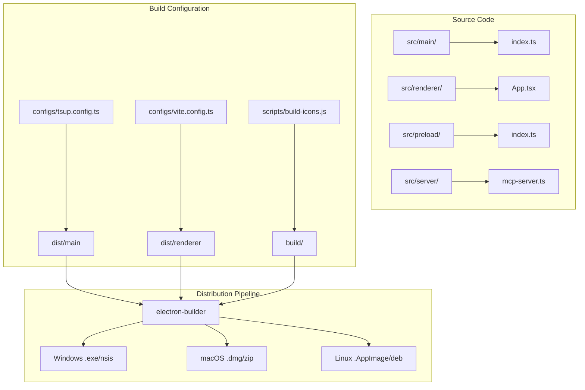
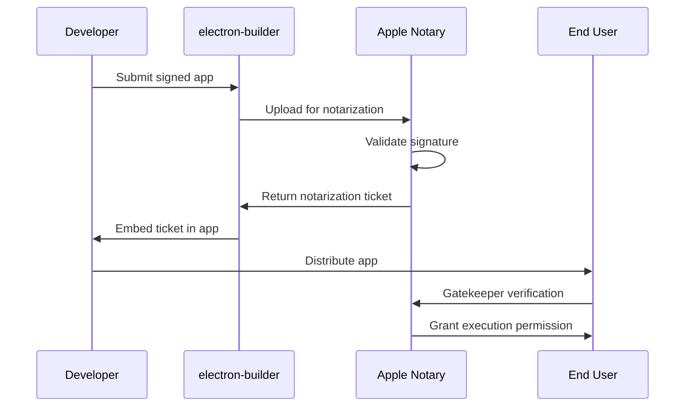
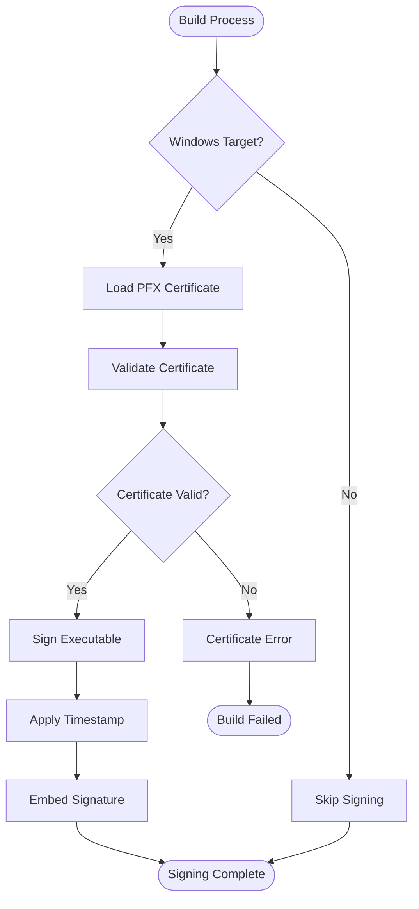
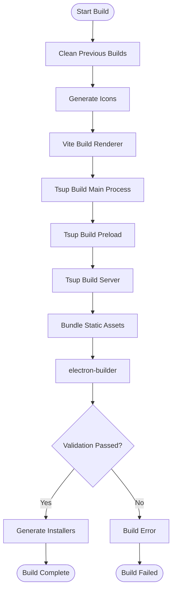
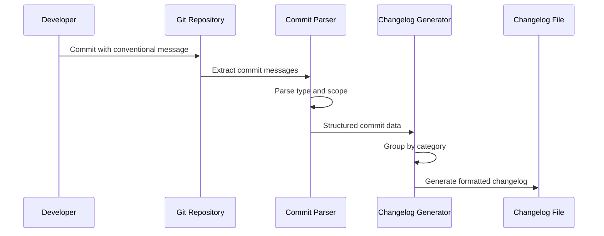
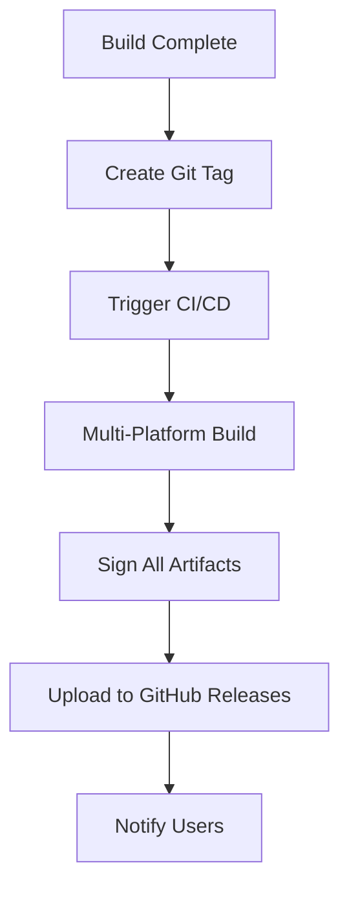
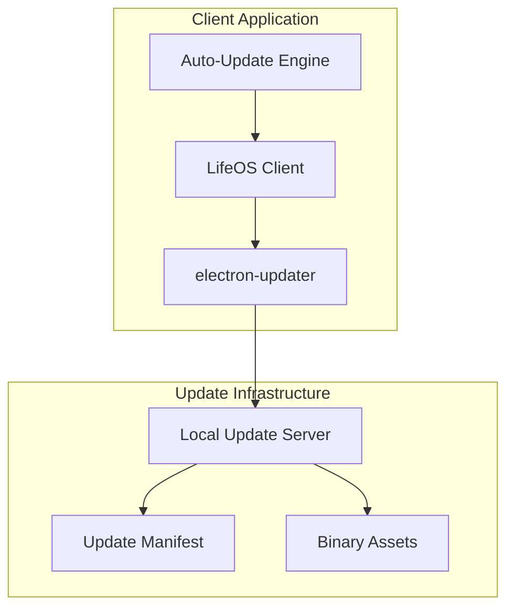
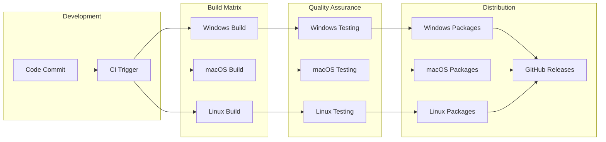

# Packaging and Distribution

<cite>
**Referenced Files in This Document**
- [package.json](file://package.json)
- [configs/vite.config.ts](file://configs/vite.config.ts)
- [configs/tsup.config.ts](file://configs/tsup.config.ts)
- [scripts/build-icons.js](file://scripts/build-icons.js)
- [AI/BUILD-RELEASE.md](file://AI/BUILD-RELEASE.md)
- [AI/ELECTRON-MIRRORS.md](file://AI/ELECTRON-MIRRORS.md)
- [README.md](file://README.md)
</cite>

## Table of Contents
1. [Introduction](#introduction)
2. [Project Structure Overview](#project-structure-overview)
3. [Electron Builder Configuration](#electron-builder-configuration)
4. [Platform-Specific Targets](#platform-specific-targets)
5. [Code Signing and Security](#code-signing-and-security)
6. [Build Scripts and Automation](#build-scripts-and-automation)
7. [Version Management and Changelog](#version-management-and-changelog)
8. [Distribution Options](#distribution-options)
9. [CI/CD Integration](#cicd-integration)
10. [Troubleshooting and Best Practices](#troubleshooting-and-best-practices)

## Introduction

LifeOS is a cross-platform Electron application that requires careful packaging and distribution strategies to deliver native experiences across Windows, macOS, and Linux. The project utilizes electron-builder as its primary packaging solution, configured to generate platform-specific installers and handle code signing requirements for secure distribution.

This documentation covers the complete packaging pipeline, from initial build configuration through final distribution, including automated version management, changelog generation, and various distribution channels.

## Project Structure Overview

The LifeOS project follows a modular architecture optimized for Electron development with separate build processes for different components:



**Diagram sources**
- [configs/vite.config.ts](file://configs/vite.config.ts#L1-L24)
- [configs/tsup.config.ts](file://configs/tsup.config.ts#L1-L31)
- [scripts/build-icons.js](file://scripts/build-icons.js#L1-L50)

**Section sources**
- [README.md](file://README.md#L1-L50)
- [configs/vite.config.ts](file://configs/vite.config.ts#L1-L24)
- [configs/tsup.config.ts](file://configs/tsup.config.ts#L1-L31)

## Electron Builder Configuration

The electron-builder configuration in package.json defines comprehensive build settings for all supported platforms with platform-specific optimizations and security features.

### Core Configuration Structure

The build configuration encompasses several key areas:

| Configuration Area | Purpose | Platform Support |
|-------------------|---------|------------------|
| **Basic Metadata** | App identification and branding | All platforms |
| **File Bundling** | Asset inclusion and exclusion | All platforms |
| **Windows Target** | NSIS installer and portable app | Windows |
| **macOS Target** | DMG and ZIP archives | macOS |
| **Linux Target** | AppImage and DEB packages | Linux |
| **Security Settings** | Code signing and notarization | All platforms |

### File Bundling Strategy

The `files` configuration ensures optimal bundle size while maintaining functionality:

```json
{
  "files": [
    "dist/**/*",
    "build/**/*", 
    "notification.html",
    "LOGO.svg",
    "package.json"
  ]
}
```

This strategy includes:
- **Compiled assets**: All distributed JavaScript bundles
- **Build resources**: Platform-specific icons and assets
- **Static content**: HTML templates and SVG logos
- **Package metadata**: Essential configuration files

### Directory Structure Configuration

The `directories` section defines the build output organization:

```json
{
  "directories": {
    "buildResources": "build",
    "output": "release"
  }
}
```

**Section sources**
- [package.json](file://package.json#L20-L72)

## Platform-Specific Targets

LifeOS supports three major desktop platforms, each with optimized packaging strategies and installer formats.

### Windows Configuration

Windows targets utilize NSIS (Nullsoft Scriptable Install System) for traditional installer distribution and portable applications for convenience.

#### NSIS Installer Configuration

```json
{
  "win": {
    "icon": "build/icon.ico",
    "target": [
      {
        "target": "nsis",
        "arch": ["x64"]
      },
      {
        "target": "portable",
        "arch": ["x64"]
      }
    ]
  },
  "nsis": {
    "oneClick": false,
    "allowToChangeInstallationDirectory": true,
    "installerIcon": "build/icon.ico",
    "uninstallerIcon": "build/icon.ico"
  }
}
```

**Key Features:**
- **64-bit architecture support**: Optimized for modern Windows systems
- **Customizable installation directory**: Users can choose installation location
- **Multi-format support**: Both installer and portable versions
- **Consistent branding**: Custom installer and uninstaller icons

#### Portable Application Support

Portable applications offer immediate deployment without system modifications, ideal for:
- **Temporary installations**
- **Shared computing environments**
- **Testing scenarios**
- **Minimal system impact**

### macOS Configuration

macOS targets produce DMG disk images and ZIP archives for universal distribution.

#### DMG Configuration

```json
{
  "mac": {
    "icon": "build/icon.png",
    "category": "public.app-category.productivity",
    "target": ["dmg", "zip"]
  }
}
```

**Distribution Formats:**
- **DMG (Disk Image)**: Native macOS installer with drag-and-drop installation
- **ZIP Archive**: Universal format for direct extraction and distribution

#### Notarization Support

macOS applications require Apple's notarization process for Gatekeeper compatibility:



**Diagram sources**
- [package.json](file://package.json#L40-L45)

### Linux Configuration

Linux targets support both AppImage for universal compatibility and DEB packages for Debian-based distributions.

#### AppImage Configuration

```json
{
  "linux": {
    "icon": "build/icon.png",
    "category": "Office",
    "target": ["AppImage", "deb"]
  }
}
```

**Target Formats:**
- **AppImage**: Universal Linux application format requiring no installation
- **DEB**: Debian package format for apt-based distributions

**Section sources**
- [package.json](file://package.json#L35-L50)

## Code Signing and Security

Security is paramount for trusted application distribution. LifeOS implements comprehensive code signing strategies for each platform.

### Windows Code Signing

Windows applications require PFX certificate-based signing for authenticity verification.

#### Certificate Requirements

| Requirement | Specification | Purpose |
|------------|---------------|---------|
| **Certificate Format** | PFX (PKCS#12) | Standard Windows signing format |
| **Private Key** | RSA 2048-bit or higher | Cryptographic signature |
| **Certificate Chain** | Root and intermediate certificates | Trust chain validation |
| **Timestamp Server** | SHA-256 compliant | Long-term validity |

#### Signing Process



**Diagram sources**
- [package.json](file://package.json#L40-L45)

### macOS Code Signing

macOS applications use Developer ID certificates for notarization and distribution.

#### Developer ID Configuration

```json
{
  "mac": {
    "identity": "Developer ID Application: Your Company (TEAM_ID)",
    "provisioningProfile": "path/to/profile.provisioningprofile"
  }
}
```

#### Notarization Workflow

The notarization process involves multiple validation stages:

1. **Signature Verification**: Validates Developer ID certificate
2. **Entitlements Check**: Ensures proper permissions
3. **Malware Scanning**: Anti-virus validation
4. **Gatekeeper Compatibility**: macOS security compliance

### Cross-Platform Security

Common security measures across all platforms:

- **ASAR Archive**: Electron application source compression
- **Asset Protection**: Encrypted resource bundling
- **Integrity Verification**: Checksum validation
- **Update Security**: Signed update channels

**Section sources**
- [AI/BUILD-RELEASE.md](file://AI/BUILD-RELEASE.md#L5-L10)

## Build Scripts and Automation

LifeOS employs a comprehensive build automation system with specialized scripts for different build scenarios.

### Core Build Commands

| Command | Purpose | Output | Use Case |
|---------|---------|--------|----------|
| `npm run build` | Full production build | Complete application bundle | Development/testing |
| `npm run pack` | Directory packaging | Unpacked application | Local testing |
| `npm run dist` | Production distribution | Platform installers | Release preparation |

### Build Process Flow



**Diagram sources**
- [package.json](file://package.json#L10-L20)

### Icon Generation System

The icon generation system ensures consistent branding across all platforms:

```javascript
// Icon generation workflow
const iconFiles = {
  png: ['build/icon.png'],      // 1024x1024 for macOS/Linux
  ico: ['build/icon.ico']      // Multi-resolution for Windows
};
```

**Section sources**
- [scripts/build-icons.js](file://scripts/build-icons.js#L1-L50)
- [package.json](file://package.json#L15-L20)

## Version Management and Changelog

LifeOS implements Semantic Versioning (SemVer) with automated changelog generation from conventional commit messages.

### Semantic Versioning Strategy

The project follows SemVer 2.0 specification with automatic version bumping:

| Version Component | Increment Trigger | Example |
|------------------|-------------------|---------|
| **Major** | Breaking changes | 0.1.12 → 1.0.0 |
| **Minor** | New features | 0.1.12 → 0.2.0 |
| **Patch** | Bug fixes | 0.1.12 → 0.1.13 |

### Conventional Commits Integration

Commit message format enables automated changelog generation:

```
feat(auth): add two-factor authentication
^    ^       ^
|    |       +-- What changed
|    +------- Category
+---------- Type
```

**Supported Types:**
- `feat`: New features
- `fix`: Bug fixes
- `docs`: Documentation changes
- `style`: Code formatting
- `refactor`: Code restructuring
- `test`: Test additions/changes
- `chore`: Maintenance tasks

### Changelog Generation

Automated changelog creation from commit history:



**Diagram sources**
- [AI/BUILD-RELEASE.md](file://AI/BUILD-RELEASE.md#L15-L19)

**Section sources**
- [AI/BUILD-RELEASE.md](file://AI/BUILD-RELEASE.md#L15-L19)

## Distribution Options

LifeOS supports multiple distribution channels to reach different user segments and deployment scenarios.

### GitHub Releases

Primary distribution channel utilizing GitHub's release infrastructure:

#### Release Artifacts

Each GitHub release includes comprehensive distribution packages:

| Artifact Type | Purpose | Platform Support |
|--------------|---------|------------------|
| **Windows** | `.exe` installer | Windows x64 |
| **Windows** | `.portable.exe` | Windows x64 |
| **macOS** | `.dmg` installer | macOS Intel/Apple Silicon |
| **macOS** | `.zip` archive | Universal distribution |
| **Linux** | `.AppImage` | Linux universal |
| **Linux** | `.deb` package | Debian/Ubuntu |

#### Release Process



**Diagram sources**
- [AI/BUILD-RELEASE.md](file://AI/BUILD-RELEASE.md#L1-L5)

### Local Update Feeds

Enterprise and internal distribution scenarios utilize local update servers:

#### Update Feed Architecture



**Diagram sources**
- [AI/BUILD-RELEASE.md](file://AI/BUILD-RELEASE.md#L8-L12)

#### Update Channel Configuration

Different update channels serve specific deployment scenarios:

- **Stable**: Production-ready releases
- **Beta**: Pre-release testing
- **Nightly**: Development builds
- **Enterprise**: Internal company deployments

### Alternative Distribution Methods

Additional distribution channels for specialized scenarios:

| Method | Use Case | Advantages |
|--------|----------|------------|
| **Direct Download** | Small-scale distribution | Simple setup |
| **Package Managers** | Linux distributions | System integration |
| **Container Images** | Docker environments | Isolation and consistency |
| **Cloud Deployment** | SaaS scenarios | Centralized management |

**Section sources**
- [AI/BUILD-RELEASE.md](file://AI/BUILD-RELEASE.md#L8-L12)

## CI/CD Integration

Continuous Integration and Delivery pipelines automate the entire build and distribution process.

### Automated Build Pipeline

The CI/CD system handles multiple build targets and distribution channels:



**Diagram sources**
- [package.json](file://package.json#L10-L20)

### Environment Configuration

CI/CD environments require specific configuration for successful builds:

| Environment Variable | Purpose | Example Value |
|---------------------|---------|---------------|
| `NODE_ENV` | Build environment | `production` |
| `ELECTRON_CACHE` | Electron binary cache | `/root/.cache/electron` |
| `ELECTRON_BUILDER_CACHE` | Builder cache | `/root/.cache/electron-builder` |
| `APPLE_ID` | Apple Developer ID | `developer@example.com` |
| `APPLE_APP_SPECIFIC_PASSWORD` | App-specific password | `abcd-efgh-ijkl-mnop` |

### Build Optimization

CI/CD pipelines implement several optimization strategies:

- **Parallel Builds**: Concurrent platform-specific builds
- **Cache Management**: Reuse of downloaded dependencies
- **Incremental Packaging**: Only rebuild changed components
- **Artifact Sharing**: Efficient asset distribution between stages

**Section sources**
- [AI/ELECTRON-MIRRORS.md](file://AI/ELECTRON-MIRRORS.md#L1-L50)

## Troubleshooting and Best Practices

Common issues and solutions for successful packaging and distribution.

### Icon Generation Issues

The most frequent build problems relate to missing or incorrect icon files:

#### Resolution Steps

1. **Verify Source SVG**: Ensure `LOGO.svg` exists in project root
2. **Check Build Directory**: Confirm `build/` directory creation
3. **Validate Icon Formats**: Verify both PNG and ICO files are present
4. **Resolution Requirements**: Ensure proper icon sizes (1024x1024 PNG, multi-resolution ICO)

### Platform-Specific Challenges

| Platform | Common Issues | Solutions |
|----------|---------------|-----------|
| **Windows** | Missing PFX certificate | Configure certificate environment variables |
| **macOS** | Notarization failures | Verify Developer ID certificate and entitlements |
| **Linux** | Missing dependencies | Ensure system libraries are available |

### Performance Optimization

Build performance improvements through strategic optimizations:

- **Parallel Processing**: Utilize multiple CPU cores for concurrent builds
- **Incremental Builds**: Only rebuild changed components
- **Asset Optimization**: Compress static resources
- **Cache Strategies**: Leverage build artifact caching

### Security Best Practices

Maintaining security throughout the distribution pipeline:

- **Certificate Management**: Secure storage of signing credentials
- **Access Control**: Restricted access to signing keys
- **Audit Logging**: Comprehensive build and distribution logs
- **Integrity Verification**: Checksum validation of all artifacts

**Section sources**
- [scripts/build-icons.js](file://scripts/build-icons.js#L15-L50)
- [AI/ELECTRON-MIRRORS.md](file://AI/ELECTRON-MIRRORS.md#L58-L64)