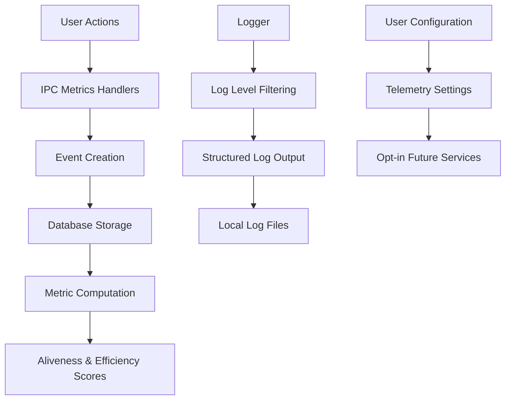

# Versioning and Telemetry

<cite>
**Referenced Files in This Document **   
- [package.json](file://package.json)
- [BUILD-RELEASE.md](file://AI/BUILD-RELEASE.md)
- [logger.ts](file://src/server/utils/logger.ts)
- [metrics.ts](file://src/main/ipc/metrics.ts)
- [settings.ts](file://src/services/settings.ts)
- [metricsSchema.ts](file://src/database/metricsSchema.ts)
</cite>

## Table of Contents
1. [Versioning Strategy](#versioning-strategy)
2. [Telemetry Architecture](#telemetry-architecture)
3. [Configuration and User Control](#configuration-and-user-control)
4. [Best Practices](#best-practices)

## Versioning Strategy

The LifeOS application follows Semantic Versioning (SemVer) for version management, as documented in the build and release guidelines. The current version of the application is 0.1.12, as specified in the package.json file. Version bumps are automated through a release script that follows conventional commit practices to generate changelogs automatically. This approach ensures consistent versioning that communicates the nature of changes to users and developers.

The versioning system follows the standard MAJOR.MINOR.PATCH format:
- MAJOR version increments for incompatible API changes
- MINOR version increments for backward-compatible feature additions
- PATCH version increments for backward-compatible bug fixes

The build process leverages electron-builder for packaging the application across Windows, macOS, and Linux platforms, with version information embedded in the build configuration. The release workflow includes generating changelogs from conventional commit messages, which helps maintain transparency about changes between versions. This automated approach reduces human error in version management and ensures that release notes accurately reflect the code changes.

**Section sources**
- [package.json](file://package.json#L2)
- [BUILD-RELEASE.md](file://AI/BUILD-RELEASE.md#L14)

## Telemetry Architecture

The telemetry architecture in LifeOS is designed with privacy as a core principle, implementing a local-first approach by default. The system collects metrics through an IPC (Inter-Process Communication) interface that handles various metrics-related operations, including current metrics retrieval, daily metrics for specific dates, event creation, and configuration management.

The server component includes a logger utility that supports different log levels (debug, info, warn, error) with configurable verbosity through the MCP_LOG_LEVEL environment variable. Log messages include timestamps and structured data when available, following a consistent format for easier parsing and analysis. The logger implements level-based filtering to control the verbosity of output based on the configured log level.

Metrics collection focuses on user engagement and application performance, with predefined event types including task management, habit tracking, diary entries, and Q&A interactions. Each event type has an associated base weight that contributes to the user's aliveness and efficiency scores. The system stores these events in a local database, allowing for offline operation and user privacy by default.

**Diagram sources **
- [metrics.ts](file://src/main/ipc/metrics.ts#L10)
- [logger.ts](file://src/server/utils/logger.ts#L1)
- [metricsSchema.ts](file://src/database/metricsSchema.ts#L71)

**Section sources**
- [metrics.ts](file://src/main/ipc/metrics.ts#L10)
- [logger.ts](file://src/server/utils/logger.ts#L1)
- [metricsSchema.ts](file://src/database/metricsSchema.ts#L71)

## Configuration and User Control

User control over telemetry and metrics is implemented through a settings service that persists user preferences locally. The settings are stored in a JSON file within the application's user data directory, ensuring that user choices are maintained between sessions. The current settings interface supports preferences for active project, theme selection, and task visibility, with the architecture designed to accommodate additional settings including telemetry preferences.

The metrics system includes configuration endpoints that allow for retrieving and updating metrics configuration. This design anticipates future implementation of user-controlled telemetry options, where users can opt-in to share anonymized usage data with analytics services. The current implementation provides a stub for this functionality, maintaining the privacy-first approach while enabling future enhancement.

The IPC handlers for metrics configuration use a wrapper function that ensures graceful degradation when the database is not available, returning appropriate responses rather than failing. This robust error handling ensures that the application remains functional even when metrics collection is temporarily unavailable.

**Section sources**
- [settings.ts](file://src/services/settings.ts#L1)
- [metrics.ts](file://src/main/ipc/metrics.ts#L105)

## Best Practices

LifeOS follows several best practices in its versioning and telemetry implementation, with a strong emphasis on user privacy and data minimization. The default configuration collects data only locally, ensuring that user activity remains private unless explicitly shared. This approach aligns with privacy-by-design principles, where the most privacy-protective option is the default.

For crash reporting, the architecture relies on local logging with the potential for opt-in remote reporting in the future. The logger implementation includes structured data capture, which facilitates debugging while maintaining readability. Error logs include sufficient context for diagnosis without capturing sensitive user information.

The metrics system implements data minimization by collecting only the information necessary for calculating user engagement scores. Event types are specifically defined to capture meaningful interactions without excessive detail. The base weights assigned to different event types reflect the relative importance of various user activities in the LifeOS ecosystem.

Future integration with analytics services would follow an opt-in model, requiring explicit user consent before any data is shared externally. This approach respects user autonomy while allowing those who wish to contribute to product improvement to do so. The system is designed to anonymize or pseudonymize data before transmission to external services, further protecting user privacy.

**Section sources**
- [BUILD-RELEASE.md](file://AI/BUILD-RELEASE.md#L16)
- [logger.ts](file://src/server/utils/logger.ts#L1)
- [metricsSchema.ts](file://src/database/metricsSchema.ts#L71)