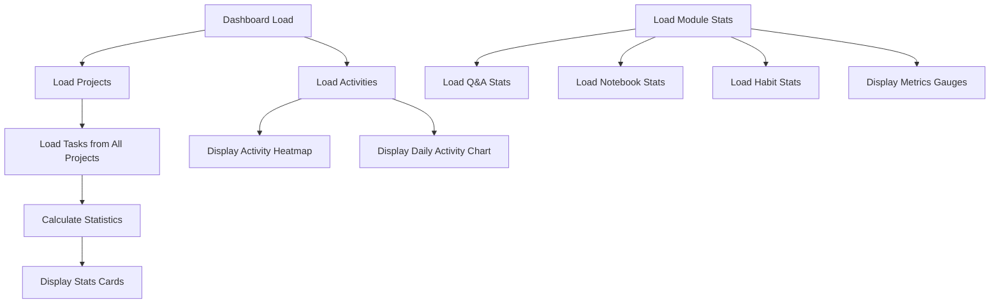

# Core Modules

<cite>
**Referenced Files in This Document**   
- [KanbanPage.tsx](file://src/renderer/pages/KanbanPage.tsx)
- [HabitsPage.tsx](file://src/renderer/pages/HabitsPage.tsx)
- [Dashboard.tsx](file://src/renderer/pages/Dashboard.tsx)
- [NotebookPage.tsx](file://src/renderer/pages/NotebookPage.tsx)
- [QA.tsx](file://src/renderer/pages/QA.tsx)
- [tasksRepo.ts](file://src/database/tasksRepo.ts)
- [habitsRepo.ts](file://src/database/habitsRepo.ts)
- [projectsRepo.ts](file://src/database/projectsRepo.ts)
- [notebookRepo.ts](file://src/database/notebookRepo.ts)
- [qaRepo.ts](file://src/database/qaRepo.ts)
- [tasks.ts](file://src/store/tasks.ts)
- [habits.ts](file://src/store/habits.ts)
- [projects.ts](file://src/store/projects.ts)
- [activity.ts](file://src/store/activity.ts)
- [types.ts](file://src/common/types.ts)
</cite>

## Table of Contents
1. [Introduction](#introduction)
2. [Task Management (Kanban)](#task-management-kanban)
3. [Habit Tracking](#habit-tracking)
4. [Project Management](#project-management)
5. [Notebook/QA System](#notebookqa-system)
6. [Dashboard Analytics](#dashboard-analytics)
7. [Data Relationships and Shared Components](#data-relationships-and-shared-components)
8. [Feature Interactions and Dependencies](#feature-interactions-and-dependencies)

## Introduction
LifeOS is a comprehensive personal productivity platform designed to help users manage tasks, track habits, organize projects, maintain knowledge through notebooks and Q&A systems, and gain insights through analytics. This document details the core modules of LifeOS, explaining their purpose, functionality, implementation, user workflows, integration points, and inter-module relationships. The system is built with a modular architecture where each component serves a distinct purpose while maintaining seamless integration through shared data models and state management.

## Task Management (Kanban)
The Task Management module implements a Kanban board interface for visualizing and managing tasks across different workflow stages. Users can create, update, and move tasks between columns representing different statuses: Backlog, To-Do, In Progress, and Completed. The implementation supports drag-and-drop functionality for intuitive task reordering and status changes.

Key features include:
- Visual Kanban board with four status columns
- Drag-and-drop task movement between columns
- Double-click to open detailed task editing panel
- Option to hide old completed tasks from view
- Archive view to restore previously completed tasks
- Task creation directly within each column
- Local storage persistence for selected task state

The module integrates with the Project Management system, requiring an active project context to display tasks. When a task is moved between columns, the system updates both the status and position fields in the database to maintain proper ordering within each column. Activity tracking is implemented to record task creation, updates, and status changes for analytics purposes.

**Section sources**
- [KanbanPage.tsx](file://src/renderer/pages/KanbanPage.tsx)
- [tasksRepo.ts](file://src/database/tasksRepo.ts)
- [tasks.ts](file://src/store/tasks.ts)

## Habit Tracking
The Habit Tracking module enables users to create and monitor recurring habits with customizable frequency (daily, weekly, or monthly). Each habit can be configured with a name, description, icon, color, category, and target completion count per period. The system tracks completion statistics including current streak, longest streak, and completion rate over the past 30 days.

Key features include:
- Visual habit cards with completion status indicators
- Category-based filtering of habits
- One-click completion toggling for today's habits
- Comprehensive statistics display (total habits, completed today, average completion rate, best streak)
- Creation modal with customizable habit properties
- Color-coded habit cards for visual organization

The implementation calculates habit statistics by analyzing the habit log entries in the database. The completion rate is calculated based on the percentage of days in the last 30 days where the habit was completed at least the target number of times. Streak calculations consider consecutive days of completion, with special handling for daily, weekly, and monthly frequencies.

**Section sources**
- [HabitsPage.tsx](file://src/renderer/pages/HabitsPage.tsx)
- [habitsRepo.ts](file://src/database/habitsRepo.ts)
- [habits.ts](file://src/store/habits.ts)

## Project Management
The Project Management module serves as the organizational backbone of LifeOS, providing containers for tasks and establishing context for other modules. Projects can be created, renamed, and organized with custom names, colors, and icons. The system maintains a clear hierarchy where tasks belong to specific projects, and users work within the context of an active project.

Key features include:
- Project switcher component for quick navigation between projects
- Visual project cards with icons and colors
- Position-based ordering of projects
- Activity tracking for project creation
- Integration with task management system
- Automatic loading of project-specific tasks

The implementation ensures data consistency by using transactions when deleting projects, which removes all associated tasks and activities. The system maintains an active project state that determines which set of tasks are displayed in the Kanban view. Project creation automatically sets the new project as active and loads its associated tasks.

**Section sources**
- [projectsRepo.ts](file://src/database/projectsRepo.ts)
- [projects.ts](file://src/store/projects.ts)

## Notebook/QA System
The Notebook and Q&A modules provide knowledge management capabilities within LifeOS, allowing users to organize information in structured formats.

### Notebook System
The Notebook module implements a hierarchical organization system where notes are grouped into notebooks. Each notebook can contain multiple notes with rich text content using Markdown formatting. Key features include:
- Notebook creation with custom names, descriptions, icons, and colors
- Note creation and editing with Markdown support
- Full-screen editing mode for distraction-free writing
- Note pinning for prioritization
- Word count tracking and display
- Auto-save functionality with visual status indicators
- Keyboard shortcuts (Ctrl+S/Cmd+S) for saving

### Q&A System
The Q&A module provides a structured way to maintain knowledge through question-and-answer pairs organized into collections. Key features include:
- Collections as containers for related questions
- Questions with rich text answers using Markdown
- Support for partial and complete answers
- Status tracking (Unanswered, In Progress, Answered)
- Answer statistics per question
- Creation of new collections, questions, and answers through modal interfaces

Both systems share similar architectural patterns with parent-child relationships (notebook/notes and collection/questions) and support rich text editing through the MDEditor component.

**Section sources**
- [NotebookPage.tsx](file://src/renderer/pages/NotebookPage.tsx)
- [QA.tsx](file://src/renderer/pages/QA.tsx)
- [notebookRepo.ts](file://src/database/notebookRepo.ts)
- [qaRepo.ts](file://src/database/qaRepo.ts)

## Dashboard Analytics
The Dashboard module provides a centralized view of user activity and productivity metrics across all modules. It serves as the default landing page and offers comprehensive insights through various visual components.

Key features include:
- Statistics cards showing completion rates, productivity metrics, and task counts
- Activity heatmap visualizing user engagement over time
- Daily activity chart displaying recent actions
- Life metrics gauges for key performance indicators
- Countdown module for time-sensitive goals
- Integrated statistics from multiple modules (Q&A, Notebook, Habits)
- Recent activity log with categorized entries

The implementation aggregates data from across the system by loading all projects and their associated tasks to calculate statistics such as total tasks, completion rates, and average tasks per day. The activity system tracks user actions across modules, enabling the dashboard to display a unified timeline of recent activities with proper categorization by module type.

**Diagram sources **
- [Dashboard.tsx](file://src/renderer/pages/Dashboard.tsx)

**Section sources**
- [Dashboard.tsx](file://src/renderer/pages/Dashboard.tsx)
- [activity.ts](file://src/store/activity.ts)

## Data Relationships and Shared Components
The LifeOS architecture is built around well-defined data relationships and shared components that ensure consistency across modules.

### Data Relationships
The system follows a hierarchical data model:
- Projects contain Tasks
- Notebooks contain Notes
- Collections contain Questions
- Questions contain Answers
- Habits have associated Logs

Each entity type has its own repository for database operations, with consistent patterns for listing, creating, updating, and deleting records. The common types defined in `types.ts` ensure type safety across the application.

### Shared Components
Several UI components are reused across modules:
- Modal dialogs for creation and editing
- Status indicators and badges
- List/grid layouts with selection states
- Markdown editors for rich text content
- Statistics displays with consistent styling
- Activity logging system

The state management system uses Zustand stores that follow a consistent pattern across modules, with each store providing methods for loading, creating, updating, and deleting entities, along with derived state for UI presentation.

**Section sources**
- [types.ts](file://src/common/types.ts)
- [activity.ts](file://src/store/activity.ts)

## Feature Interactions and Dependencies
The core modules of LifeOS are designed to work together seamlessly, with well-defined dependencies and integration points.

### Primary Dependencies
- Task Management depends on Project Management for context
- Dashboard Analytics depends on all other modules for data
- Activity tracking is integrated into all modules
- Settings affect behavior across multiple modules

### Integration Points
- Activity logging occurs when creating or updating entities in any module
- The dashboard aggregates statistics from all modules
- User actions in one module may trigger updates in others (e.g., completing a task may affect productivity metrics)
- Consistent UI patterns provide a unified user experience

### Shared Functionality
- All modules use the same API communication pattern through window.api
- Consistent error handling and loading states
- Uniform notification system
- Shared styling and theming through CSS variables
- Common data access patterns using repository functions

The architecture enables independent development of modules while maintaining integration through well-defined interfaces and shared infrastructure.

**Section sources**
- [types.ts](file://src/common/types.ts)
- [activity.ts](file://src/store/activity.ts)