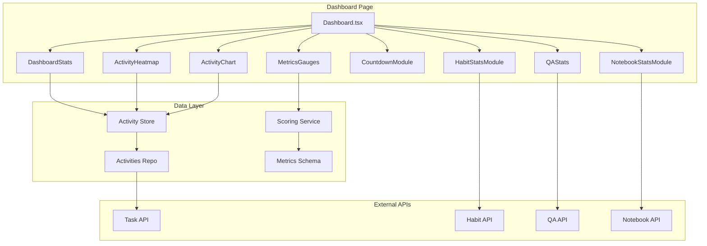
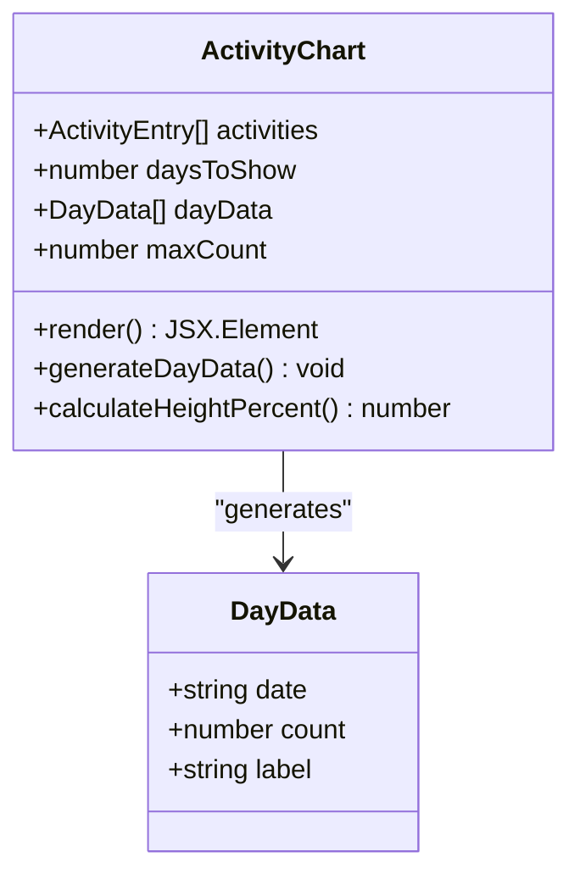
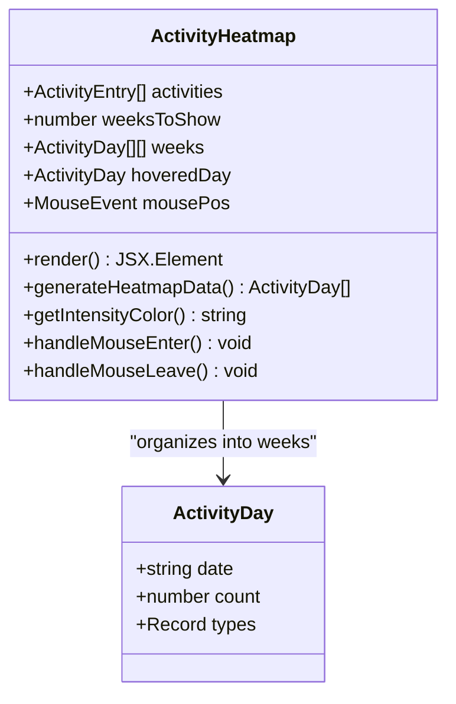
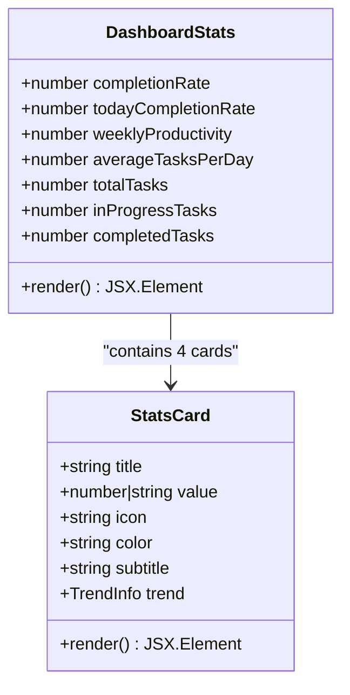
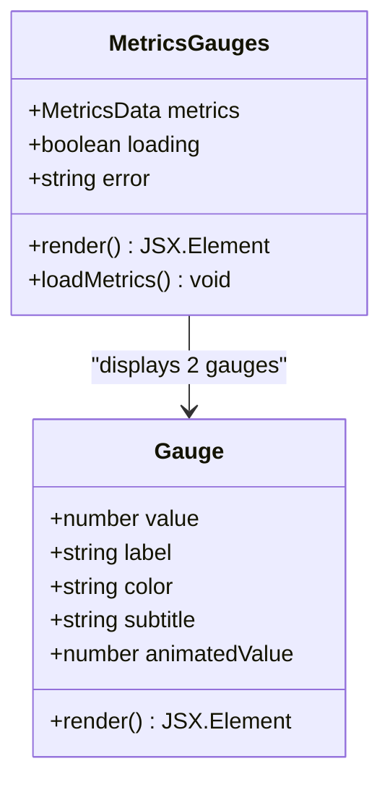
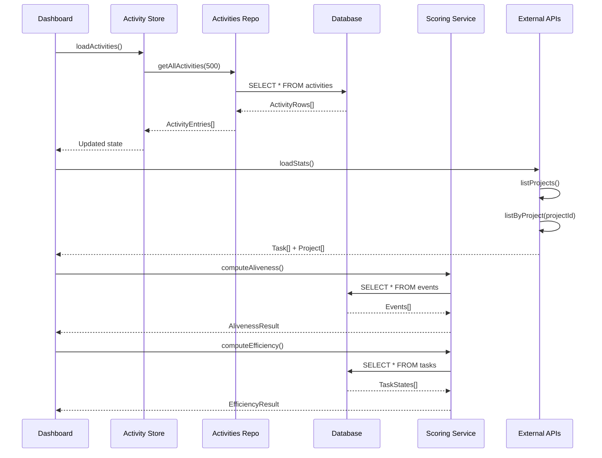
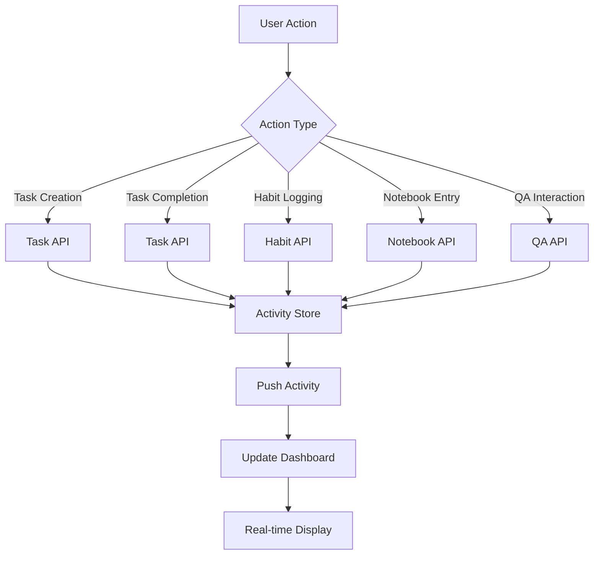
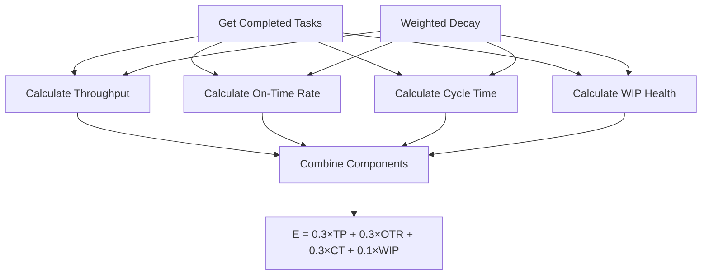
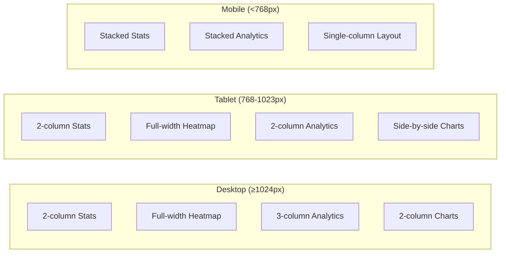

# Dashboard and Analytics

<cite>
**Referenced Files in This Document**
- [Dashboard.tsx](file://src/renderer/pages/Dashboard.tsx)
- [ActivityChart.tsx](file://src/renderer/components/ActivityChart.tsx)
- [ActivityHeatmap.tsx](file://src/renderer/components/ActivityHeatmap.tsx)
- [DashboardStats.tsx](file://src/renderer/components/DashboardStats.tsx)
- [MetricsGauges.tsx](file://src/renderer/components/MetricsGauges.tsx)
- [QAStats.tsx](file://src/renderer/components/QAStats.tsx)
- [HabitStatsModule.tsx](file://src/renderer/components/HabitStatsModule.tsx)
- [NotebookStatsModule.tsx](file://src/renderer/components/NotebookStatsModule.tsx)
- [CountdownModule.tsx](file://src/renderer/components/CountdownModule.tsx)
- [activity.ts](file://src/store/activity.ts)
- [activitiesRepo.ts](file://src/database/activitiesRepo.ts)
- [scoring.ts](file://src/services/scoring.ts)
- [metricsSchema.ts](file://src/database/metricsSchema.ts)
- [types.ts](file://src/common/types.ts)
</cite>

## Table of Contents
1. [Introduction](#introduction)
2. [Dashboard Architecture](#dashboard-architecture)
3. [Core Analytics Components](#core-analytics-components)
4. [Data Aggregation and Management](#data-aggregation-and-management)
5. [Real-time Activity Tracking](#real-time-activity-tracking)
6. [Scoring Algorithms](#scoring-algorithms)
7. [Performance Optimization](#performance-optimization)
8. [Responsive Design Implementation](#responsive-design-implementation)
9. [Extending the Dashboard](#extending-the-dashboard)
10. [Common Issues and Solutions](#common-issues-and-solutions)

## Introduction

The Dashboard and Analytics module serves as the central hub for visualizing user productivity, tracking activity patterns, and displaying key performance metrics in LifeOS. Built with React and TypeScript, it integrates multiple data sources to provide comprehensive insights into user behavior across tasks, habits, activities, and knowledge management systems.

The module implements sophisticated data visualization components including time-series charts, heatmaps, progress gauges, and statistical summaries, all powered by a robust state management system using Zustand stores and real-time data aggregation from various subsystems.

## Dashboard Architecture

The dashboard follows a modular architecture with clearly separated concerns for different types of analytics and visualizations.



**Diagram sources**
- [Dashboard.tsx](file://src/renderer/pages/Dashboard.tsx#L1-L237)
- [activity.ts](file://src/store/activity.ts#L1-L69)
- [scoring.ts](file://src/services/scoring.ts#L1-L532)

**Section sources**
- [Dashboard.tsx](file://src/renderer/pages/Dashboard.tsx#L1-L237)

## Core Analytics Components

### ActivityChart Component

The ActivityChart provides a daily activity visualization showing the distribution of activities across a configurable number of days.



**Diagram sources**
- [ActivityChart.tsx](file://src/renderer/components/ActivityChart.tsx#L1-L230)

Key features:
- **Dynamic Bar Heights**: Proportional scaling based on activity counts
- **Color Coding**: Distinct colors for today vs. historical data
- **Interactive Tooltips**: Hover-over details showing exact counts
- **Responsive Labels**: Intelligent label placement to avoid crowding

**Section sources**
- [ActivityChart.tsx](file://src/renderer/components/ActivityChart.tsx#L1-L230)

### ActivityHeatmap Component

The ActivityHeatmap creates a calendar-style visualization showing activity intensity over time.



**Diagram sources**
- [ActivityHeatmap.tsx](file://src/renderer/components/ActivityHeatmap.tsx#L1-L266)

Advanced features:
- **Intelligent Color Scaling**: Adaptive color schemes for light/dark modes
- **Multi-type Activity Tracking**: Different activity types shown distinctly
- **Automatic Scrolling**: Current day automatically positioned at the right edge
- **Comprehensive Tooltips**: Detailed hover information with activity breakdown

**Section sources**
- [ActivityHeatmap.tsx](file://src/renderer/components/ActivityHeatmap.tsx#L1-L266)

### DashboardStats Component

The DashboardStats component presents key performance indicators in a card-based layout with animated transitions.



**Diagram sources**
- [DashboardStats.tsx](file://src/renderer/components/DashboardStats.tsx#L1-L188)

Design characteristics:
- **Animated Transitions**: Smooth hover effects and value animations
- **Gradient Backgrounds**: Subtle radial gradients for visual appeal
- **Trend Indicators**: Percentage changes with directional arrows
- **Responsive Grid**: Automatic column sizing based on screen width

**Section sources**
- [DashboardStats.tsx](file://src/renderer/components/DashboardStats.tsx#L1-L188)

### MetricsGauges Component

The MetricsGauges displays life metrics (Aliveness and Efficiency) using SVG-based circular gauges.



**Diagram sources**
- [MetricsGauges.tsx](file://src/renderer/components/MetricsGauges.tsx#L1-L275)

Technical features:
- **SVG Animation**: Smooth value transitions using CSS transforms
- **Real-time Updates**: Automatic refresh every 5 minutes
- **Status Indicators**: Color-coded based on performance thresholds
- **Loading States**: Graceful loading with spinner animations

**Section sources**
- [MetricsGauges.tsx](file://src/renderer/components/MetricsGauges.tsx#L1-L275)

## Data Aggregation and Management

The dashboard integrates data from multiple sources through a centralized state management system.



**Diagram sources**
- [Dashboard.tsx](file://src/renderer/pages/Dashboard.tsx#L25-L120)
- [activity.ts](file://src/store/activity.ts#L15-L45)
- [scoring.ts](file://src/services/scoring.ts#L200-L250)

### Activity Store Management

The activity store manages the primary activity feed with efficient loading and caching mechanisms.

**Section sources**
- [activity.ts](file://src/store/activity.ts#L1-L69)
- [activitiesRepo.ts](file://src/database/activitiesRepo.ts#L1-L140)

### Data Loading Strategies

The dashboard employs several optimization strategies for handling large datasets:

1. **Pagination**: Activities are limited to 500 entries with lazy loading
2. **Selective Loading**: Only necessary data is fetched for each component
3. **Caching**: Local state caching prevents redundant API calls
4. **Debounced Updates**: Frequent updates are throttled to prevent performance issues

## Real-time Activity Tracking

The dashboard maintains real-time awareness of user activities through multiple mechanisms.

### Activity Logging Integration

Activities are automatically logged across all major system components:



**Diagram sources**
- [Dashboard.tsx](file://src/renderer/pages/Dashboard.tsx#L40-L60)
- [activity.ts](file://src/store/activity.ts#L40-L60)

### Live Data Updates

The dashboard implements several live update mechanisms:

- **Activity Feed**: New activities appear immediately in the recent activity list
- **Statistics**: Key metrics update automatically as user interacts with the system
- **Metrics Gauges**: Life metrics refresh every 5 minutes
- **Countdown Modules**: Time-based counters update every minute

**Section sources**
- [Dashboard.tsx](file://src/renderer/pages/Dashboard.tsx#L25-L120)
- [MetricsGauges.tsx](file://src/renderer/components/MetricsGauges.tsx#L120-L140)
- [CountdownModule.tsx](file://src/renderer/components/CountdownModule.tsx#L25-L45)

## Scoring Algorithms

The dashboard integrates sophisticated scoring algorithms that provide deep insights into user productivity and engagement patterns.

### Aliveness Score Calculation

The Aliveness score measures user engagement and activity level over time:

```mermaid
flowchart TD
A[Get All Events] --> B[Calculate Event Weight]
B --> C[Apply Exponential Decay]
C --> D[Sum Weighted Points]
D --> E[Normalize with Soft-Cap]
E --> F[A = 100 × (1 - exp(-alive_points / k_a))]
G[Base Weights] --> B
H[Text Factor] --> B
I[Context Switch Tax] --> B
J[Focus Bonus] --> B
```

**Diagram sources**
- [scoring.ts](file://src/services/scoring.ts#L200-L250)

### Efficiency Score Calculation

The Efficiency score evaluates task completion patterns and workflow optimization:



**Diagram sources**
- [scoring.ts](file://src/services/scoring.ts#L280-L350)

### Advanced Scoring Features

The scoring system includes several advanced features:

- **Exponential Decay**: Older activities have diminishing influence
- **Context Switch Penalties**: Penalizes frequent task switching
- **Focus Bonuses**: Rewards sustained concentration periods
- **Text Content Factors**: Values written content appropriately
- **Weight Normalization**: Ensures consistent scoring across different activity types

**Section sources**
- [scoring.ts](file://src/services/scoring.ts#L1-L532)
- [metricsSchema.ts](file://src/database/metricsSchema.ts#L1-L104)

## Performance Optimization

The dashboard implements multiple performance optimization strategies to handle large datasets efficiently.

### Memory Management

- **Limited Activity History**: Maximum 500 activities stored in memory
- **Lazy Loading**: Components load data only when needed
- **Component Memoization**: React.memo used for expensive calculations
- **Efficient State Updates**: Minimal re-renders through selective state updates

### Rendering Optimizations

- **Virtual Scrolling**: Long lists use virtualization techniques
- **Canvas Rendering**: Heatmap uses optimized canvas for large grids
- **SVG Optimization**: Gauges use minimal DOM manipulation
- **CSS Animations**: Hardware-accelerated animations for smooth transitions

### Database Query Optimization

The backend implements several query optimization strategies:

- **Indexed Queries**: All frequently accessed columns are indexed
- **Batch Operations**: Multiple operations grouped into single transactions
- **Pre-computed Aggregates**: Daily statistics cached for quick retrieval
- **Connection Pooling**: Database connections reused efficiently

**Section sources**
- [activitiesRepo.ts](file://src/database/activitiesRepo.ts#L50-L100)
- [metricsSchema.ts](file://src/database/metricsSchema.ts#L40-L60)

## Responsive Design Implementation

The dashboard adapts seamlessly across different screen sizes and devices.

### Grid-Based Layout System

The dashboard uses CSS Grid for flexible, responsive layouts:



### Component Adaptations

Each analytics component adapts to different screen sizes:

- **ActivityChart**: Adjusts bar spacing and label visibility
- **ActivityHeatmap**: Modifies grid density and tooltip positioning
- **DashboardStats**: Uses automatic grid column sizing
- **MetricsGauges**: Resizes for optimal mobile display

### Touch-Friendly Interactions

- **Touch Targets**: Minimum 44px touch targets for all interactive elements
- **Gesture Support**: Swipe navigation for heatmap scrolling
- **Responsive Typography**: Font sizes scale appropriately for different devices
- **Adaptive Colors**: High contrast ratios for accessibility

**Section sources**
- [Dashboard.tsx](file://src/renderer/pages/Dashboard.tsx#L130-L230)
- [ActivityChart.tsx](file://src/renderer/components/ActivityChart.tsx#L150-L200)

## Extending the Dashboard

The modular architecture makes it easy to add new analytics components and metrics.

### Adding New Analytics Components

To create a new analytics component:

1. **Define Component Structure**: Create a new component following the established patterns
2. **Implement Data Fetching**: Add API calls or integrate with existing data sources
3. **Add Styling**: Use the established design system with CSS custom properties
4. **Integrate with Dashboard**: Add the component to the main dashboard layout
5. **Test Responsiveness**: Ensure proper adaptation across screen sizes

### Creating Custom Metrics

New metrics can be added by extending the scoring service:

1. **Define Metric Interface**: Add new metric types to the scoring service
2. **Implement Calculation Logic**: Create calculation functions following the existing patterns
3. **Update Database Schema**: Add necessary database tables or columns
4. **Create Visualization**: Build appropriate chart or gauge components
5. **Configure Auto-Updates**: Set up periodic recalculations

### Integration Patterns

The dashboard follows consistent integration patterns:

- **Zustand Stores**: Centralized state management for shared data
- **React Hooks**: Custom hooks for data fetching and state management
- **TypeScript Interfaces**: Strong typing for all data structures
- **Error Boundaries**: Robust error handling with fallback UIs

**Section sources**
- [Dashboard.tsx](file://src/renderer/pages/Dashboard.tsx#L1-L50)
- [scoring.ts](file://src/services/scoring.ts#L1-L100)

## Common Issues and Solutions

### Data Loading States

**Issue**: Slow data loading causing poor user experience
**Solution**: Implement progressive loading with skeleton screens and loading states

**Code Reference**: [MetricsGauges.tsx](file://src/renderer/components/MetricsGauges.tsx#L120-L140)

### Performance with Large Datasets

**Issue**: Dashboard becomes sluggish with extensive activity history
**Solution**: Implement pagination, virtual scrolling, and data sampling

**Code Reference**: [Dashboard.tsx](file://src/renderer/pages/Dashboard.tsx#L10-L15)

### Real-time Synchronization

**Issue**: Delayed updates in activity feeds and metrics
**Solution**: Use WebSocket connections or periodic polling with debouncing

**Code Reference**: [MetricsGauges.tsx](file://src/renderer/components/MetricsGauges.tsx#L120-L140)

### Responsive Design Problems

**Issue**: Components don't adapt properly to different screen sizes
**Solution**: Use CSS Grid and Flexbox with media queries for adaptive layouts

**Code Reference**: [Dashboard.tsx](file://src/renderer/pages/Dashboard.tsx#L130-L230)

### Memory Leaks

**Issue**: Increasing memory usage over time
**Solution**: Implement proper cleanup in useEffect hooks and use proper event listener management

**Code Reference**: [CountdownModule.tsx](file://src/renderer/components/CountdownModule.tsx#L25-L45)

### Accessibility Concerns

**Issue**: Poor accessibility for users with disabilities
**Solution**: Implement ARIA labels, keyboard navigation, and high contrast modes

**Code Reference**: [ActivityHeatmap.tsx](file://src/renderer/components/ActivityHeatmap.tsx#L200-L250)

### Error Handling

**Issue**: Unhandled errors causing dashboard crashes
**Solution**: Implement comprehensive error boundaries and graceful degradation

**Code Reference**: [MetricsGauges.tsx](file://src/renderer/components/MetricsGauges.tsx#L150-L200)

The Dashboard and Analytics module represents a sophisticated system for visualizing user productivity and engagement patterns. Its modular architecture, robust data management, and performance optimizations make it a powerful tool for understanding and improving user behavior across the LifeOS platform.