# Habit Tracking Module

<cite>
**Referenced Files in This Document**
- [HabitsPage.tsx](file://src/renderer/pages/HabitsPage.tsx)
- [habits.ts](file://src/store/habits.ts)
- [habitsRepo.ts](file://src/database/habitsRepo.ts)
- [habits.ts](file://src/main/ipc/habits.ts)
- [habitsSchema.ts](file://src/database/habitsSchema.ts)
- [HabitStatsModule.tsx](file://src/renderer/components/HabitStatsModule.tsx)
- [notification.ts](file://src/main/ipc/notification.ts)
- [eventsRepo.ts](file://src/database/eventsRepo.ts)
- [HabitsPage.css](file://src/renderer/pages/HabitsPage.css)
- [habitsController.ts](file://src/server/controllers/habitsController.ts)
</cite>

## Table of Contents
1. [Introduction](#introduction)
2. [System Architecture](#system-architecture)
3. [Core Data Structures](#core-data-structures)
4. [Habit Creation and Management](#habit-creation-and-management)
5. [Daily Logging System](#daily-logging-system)
6. [Statistics and Analytics](#statistics-and-analytics)
7. [UI Components](#ui-components)
8. [Data Flow Architecture](#data-flow-architecture)
9. [State Management](#state-management)
10. [Notification System Integration](#notification-system-integration)
11. [Performance Considerations](#performance-considerations)
12. [Common Issues and Solutions](#common-issues-and-solutions)
13. [Customization Options](#customization-options)
14. [Troubleshooting Guide](#troubleshooting-guide)

## Introduction

The Habit Tracking module is a comprehensive system designed to help users establish, track, and maintain daily habits. Built with Electron and React, it provides a seamless experience for habit creation, daily logging, streak calculation, and statistical visualization. The system emphasizes user engagement through visual feedback, progress tracking, and motivational features.

The module supports multiple habit frequencies (daily, weekly, monthly), customizable categories, and rich visual indicators for tracking progress. It integrates with a robust notification system to provide immediate feedback on habit creation and logging activities.

## System Architecture

The Habit Tracking module follows a layered architecture pattern with clear separation of concerns:

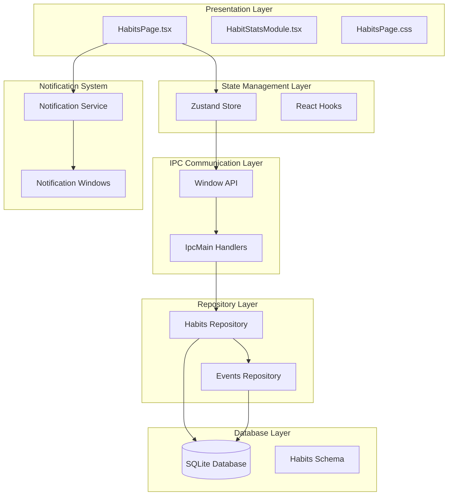

**Diagram sources**
- [HabitsPage.tsx](file://src/renderer/pages/HabitsPage.tsx#L1-L299)
- [habits.ts](file://src/store/habits.ts#L1-L161)
- [habits.ts](file://src/main/ipc/habits.ts#L1-L101)
- [habitsRepo.ts](file://src/database/habitsRepo.ts#L1-L395)

## Core Data Structures

The system defines several key interfaces that form the foundation of habit tracking functionality:

### Habit Interface

The core Habit interface defines the structure of habit entities with comprehensive tracking capabilities:

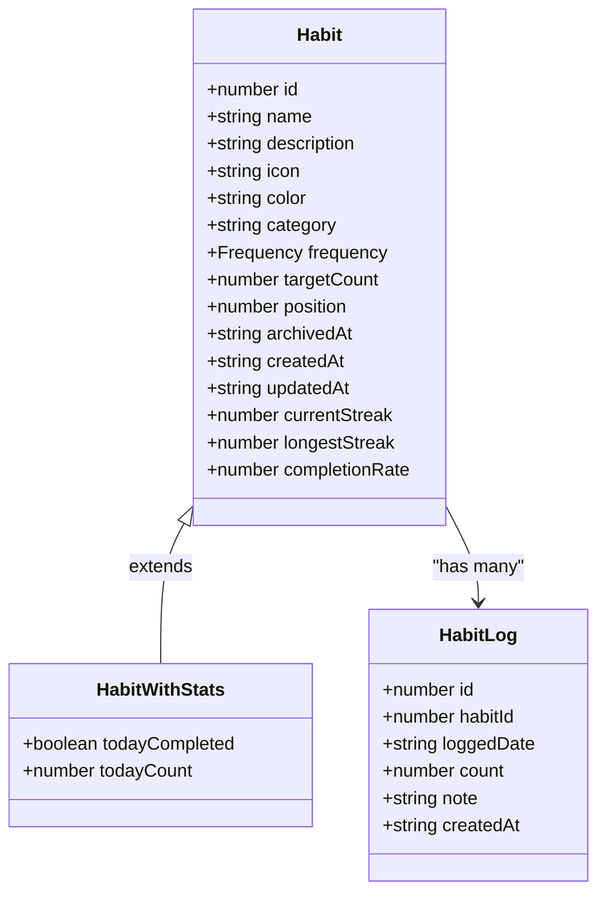

**Diagram sources**
- [habitsRepo.ts](file://src/database/habitsRepo.ts#L4-L32)

### Frequency Types

The system supports three distinct frequency types for habit scheduling:

| Frequency | Description | Calculation Method |
|-----------|-------------|-------------------|
| Daily | Requires completion every day | 24-hour rolling window |
| Weekly | Requires completion within 7-day period | 7-day rolling window |
| Monthly | Requires completion within 30-day period | 30-day rolling window |

**Section sources**
- [habitsRepo.ts](file://src/database/habitsRepo.ts#L4-L32)
- [habitsRepo.ts](file://src/database/habitsRepo.ts#L126-L145)

## Habit Creation and Management

### Habit Creation Process

The habit creation process involves multiple validation layers and state management:

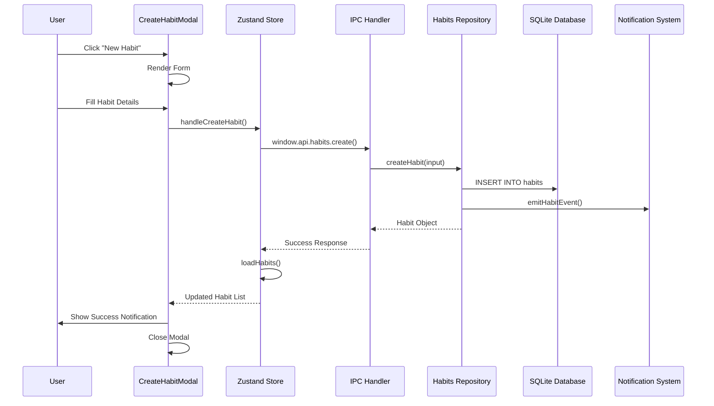

**Diagram sources**
- [HabitsPage.tsx](file://src/renderer/pages/HabitsPage.tsx#L159-L177)
- [habits.ts](file://src/store/habits.ts#L44-L54)
- [habits.ts](file://src/main/ipc/habits.ts#L25-L42)

### Habit Validation and Constraints

The system implements comprehensive validation through Zod schemas:

| Field | Validation Rules | Default Value |
|-------|------------------|---------------|
| name | Required, 1-200 characters | None |
| description | Optional, max 1000 characters | null |
| icon | Optional, max 30 characters | ⭐ |
| color | Optional, max 20 characters | #3b82f6 |
| category | Optional, max 50 characters | null |
| frequency | Enum: daily, weekly, monthly | daily |
| targetCount | Positive integer, default 1 | 1 |

**Section sources**
- [habitsRepo.ts](file://src/database/habitsRepo.ts#L34-L44)
- [HabitsPage.tsx](file://src/renderer/pages/HabitsPage.tsx#L10-L28)

## Daily Logging System

### Date-Based Tracking Implementation

The daily logging system handles temporal data with careful consideration for timezone neutrality:

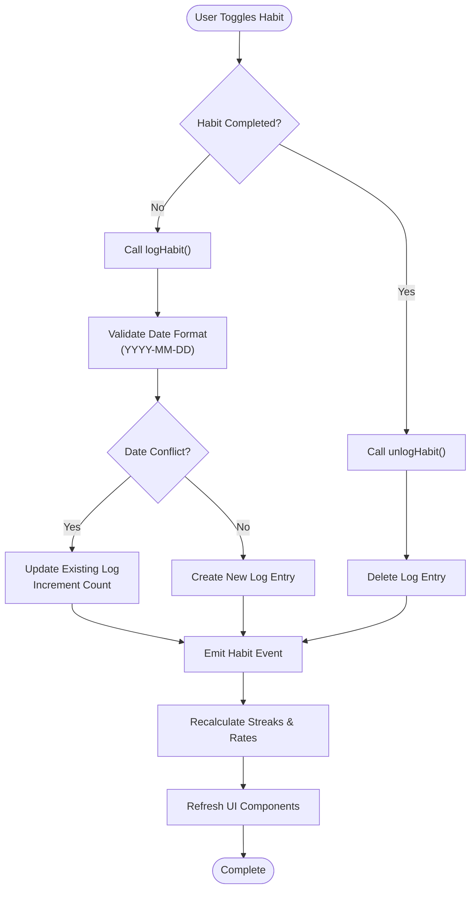

**Diagram sources**
- [HabitsPage.tsx](file://src/renderer/pages/HabitsPage.tsx#L143-L152)
- [habitsRepo.ts](file://src/database/habitsRepo.ts#L305-L343)

### Streak Calculation Algorithm

The streak calculation algorithm handles various scenarios including missed days and different frequency types:

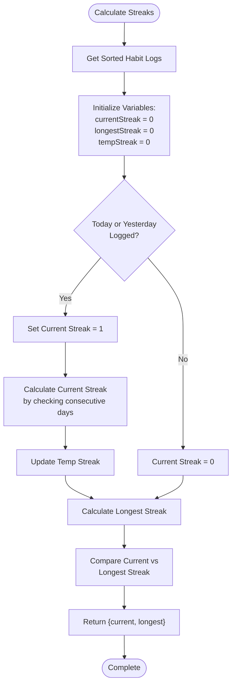

**Diagram sources**
- [habitsRepo.ts](file://src/database/habitsRepo.ts#L105-L171)

**Section sources**
- [habitsRepo.ts](file://src/database/habitsRepo.ts#L105-L171)
- [habitsRepo.ts](file://src/database/habitsRepo.ts#L126-L145)

## Statistics and Analytics

### Completion Rate Calculation

The completion rate calculation considers the target count and recent activity:

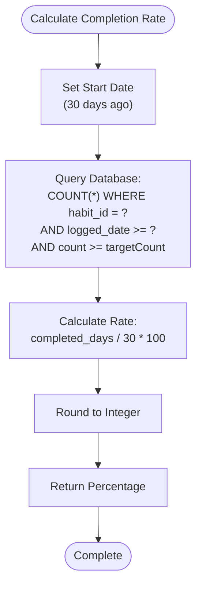

**Diagram sources**
- [habitsRepo.ts](file://src/database/habitsRepo.ts#L126-L145)

### Statistical Metrics

The system tracks multiple statistical metrics for comprehensive habit analysis:

| Metric | Calculation Method | Purpose |
|--------|-------------------|---------|
| Current Streak | Consecutive successful days | Motivational indicator |
| Longest Streak | Historical peak streak | Achievement benchmark |
| Completion Rate | (Successful Days / 30) × 100 | Overall consistency measure |
| Today's Completion | Boolean flag | Daily progress indicator |
| Average Completion Rate | Sum of all habits' rates / count | System-wide performance |

**Section sources**
- [habitsRepo.ts](file://src/database/habitsRepo.ts#L345-L394)
- [HabitStatsModule.tsx](file://src/renderer/components/HabitStatsModule.tsx#L10-L40)

## UI Components

### Habit Grid Layout

The main habit display uses a responsive grid system with visual indicators:

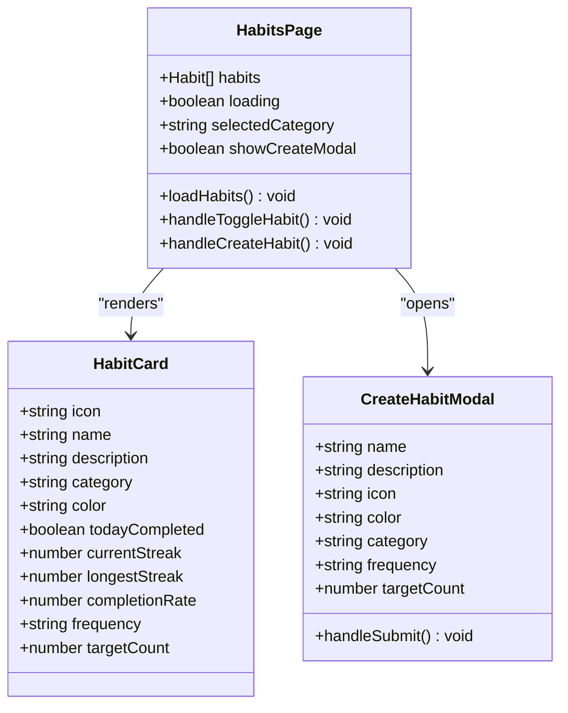

**Diagram sources**
- [HabitsPage.tsx](file://src/renderer/pages/HabitsPage.tsx#L123-L299)

### Category Filtering System

The category filtering system enables users to organize habits by themes:

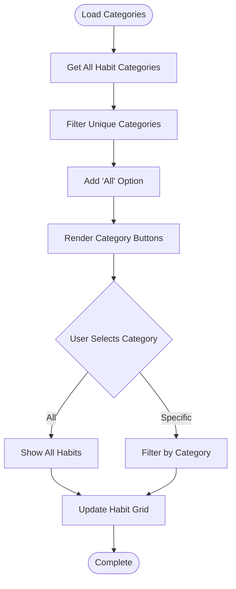

**Diagram sources**
- [HabitsPage.tsx](file://src/renderer/pages/HabitsPage.tsx#L135-L142)

**Section sources**
- [HabitsPage.tsx](file://src/renderer/pages/HabitsPage.tsx#L123-L299)
- [HabitsPage.css](file://src/renderer/pages/HabitsPage.css#L1-L356)

## Data Flow Architecture

### Complete Data Flow Pipeline

The data flow follows a unidirectional pattern with clear boundaries between layers:

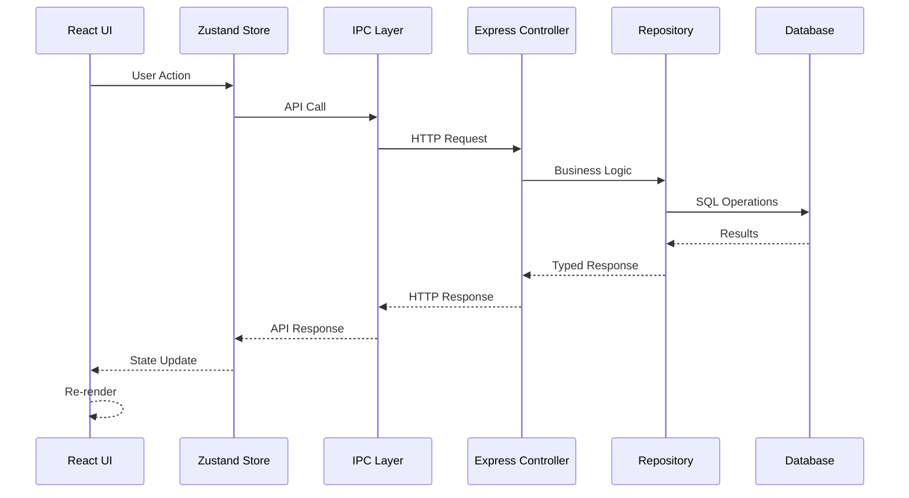

**Diagram sources**
- [habits.ts](file://src/store/habits.ts#L1-L161)
- [habits.ts](file://src/main/ipc/habits.ts#L1-L101)
- [habitsController.ts](file://src/server/controllers/habitsController.ts#L1-L132)

### Error Handling and Loading States

The system implements comprehensive error handling and loading state management:

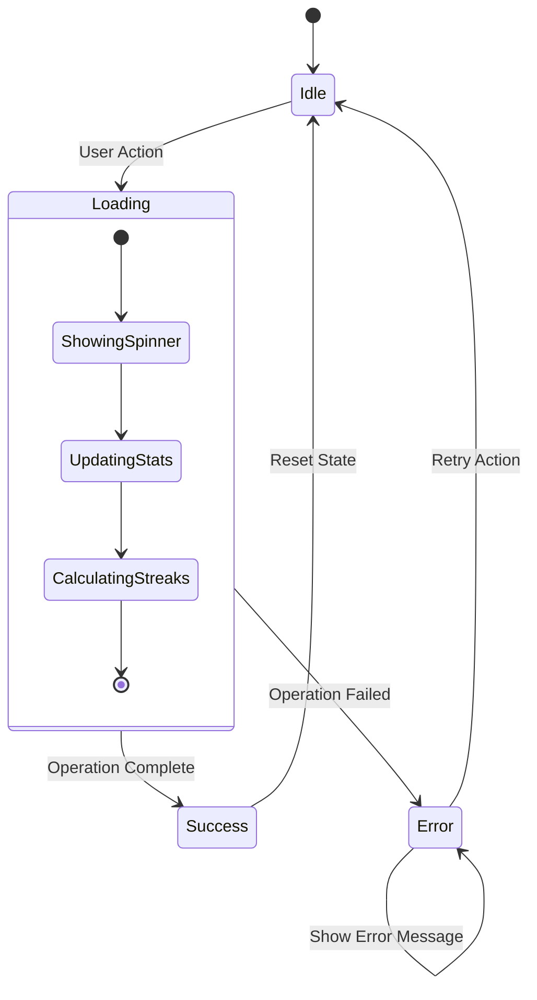

**Section sources**
- [habits.ts](file://src/store/habits.ts#L34-L72)
- [HabitsPage.tsx](file://src/renderer/pages/HabitsPage.tsx#L154-L162)

## State Management

### Zustand Store Implementation

The Zustand store manages habit state with reactive updates and optimistic UI patterns:

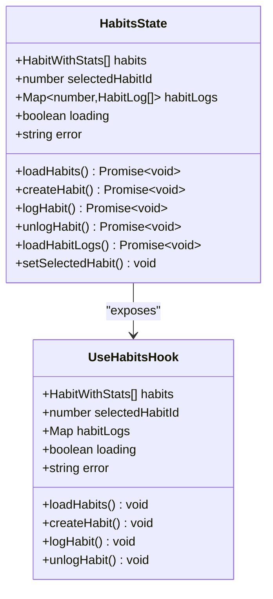

**Diagram sources**
- [habits.ts](file://src/store/habits.ts#L4-L25)

### Optimistic Updates

The store implements optimistic updates for improved user experience:

| Operation | Optimistic Behavior | Fallback Behavior |
|-----------|-------------------|-------------------|
| Create Habit | Immediately add to UI | Remove from UI on failure |
| Log Habit | Mark as completed instantly | Revert completion state |
| Unlog Habit | Remove completion immediately | Restore completion state |
| Delete Habit | Remove from UI instantly | Re-add habit on failure |

**Section sources**
- [habits.ts](file://src/store/habits.ts#L4-L161)

## Notification System Integration

### Habit Creation Feedback

The notification system provides immediate feedback for habit creation:

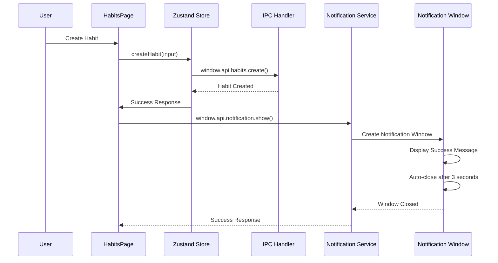

**Diagram sources**
- [HabitsPage.tsx](file://src/renderer/pages/HabitsPage.tsx#L163-L177)
- [notification.ts](file://src/main/ipc/notification.ts#L15-L70)

### Event Emission

The system emits events for analytics and tracking purposes:

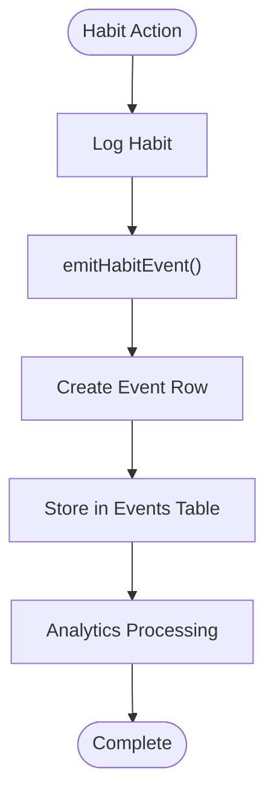

**Diagram sources**
- [eventsRepo.ts](file://src/database/eventsRepo.ts#L115-L134)

**Section sources**
- [HabitsPage.tsx](file://src/renderer/pages/HabitsPage.tsx#L163-L177)
- [notification.ts](file://src/main/ipc/notification.ts#L1-L115)
- [eventsRepo.ts](file://src/database/eventsRepo.ts#L115-L134)

## Performance Considerations

### Database Optimization

The system implements several database optimization strategies:

| Optimization | Implementation | Benefit |
|-------------|----------------|---------|
| Indexing | Composite indexes on habit_logs | Faster queries |
| Pagination | Limit habit logs to 30 entries | Reduced memory usage |
| Lazy Loading | Load habit logs on demand | Improved initial load time |
| Connection Pooling | Single database connection | Better resource utilization |

### Memory Management

The store implements efficient memory management:

- Habit logs are stored in Maps for O(1) access
- Only active habits are loaded initially
- Habit logs are cleared when habit is deselected
- State updates are batched for efficiency

### UI Responsiveness

The system maintains UI responsiveness through:

- Debounced state updates
- Virtualized rendering for large habit lists
- Optimistic UI updates
- Efficient re-rendering with React.memo

## Common Issues and Solutions

### Timezone Handling for Daily Logs

**Issue**: Users in different timezones experiencing incorrect daily log calculations.

**Solution**: The system uses UTC date strings (YYYY-MM-DD) for all date comparisons, ensuring timezone neutrality. The database stores dates as strings, and all calculations are performed using JavaScript Date objects with proper UTC handling.

### UI Responsiveness During Loading States

**Issue**: UI freezing during habit loading operations.

**Solution**: The system implements proper loading state management with:
- Immediate loading indicators
- Optimistic UI updates
- Graceful error handling
- Debounced state updates

### State Initialization Problems

**Issue**: Inconsistent state when the app restarts.

**Solution**: The system ensures proper state initialization through:
- Server-side hydration
- Database consistency checks
- Default value fallbacks
- Error boundary implementation

**Section sources**
- [habitsRepo.ts](file://src/database/habitsRepo.ts#L105-L171)
- [habits.ts](file://src/store/habits.ts#L34-L72)

## Customization Options

### Habit Appearance Customization

Users can customize habit appearance through multiple parameters:

| Customization | Options | Implementation |
|--------------|---------|----------------|
| Icon | Unicode emojis (max 2 chars) | Direct string storage |
| Color | Hex color codes | CSS variable binding |
| Category | Text labels (max 50 chars) | String categorization |
| Description | Rich text (max 1000 chars) | Multi-line display |

### Frequency and Target Configuration

The system supports flexible habit configurations:

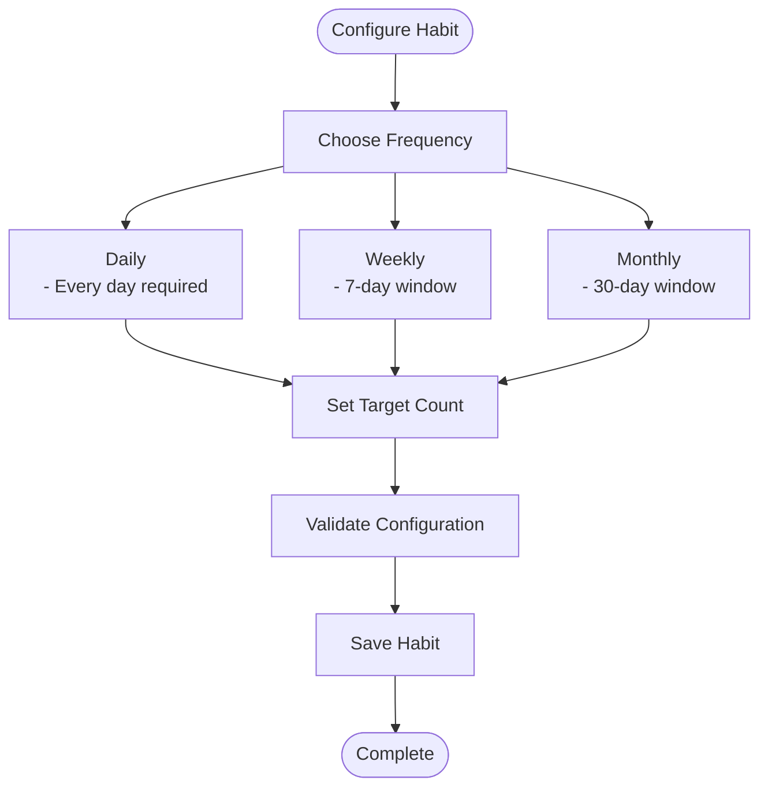

**Diagram sources**
- [HabitsPage.tsx](file://src/renderer/pages/HabitsPage.tsx#L85-L110)

### Category Management

Categories provide organizational structure for habits:

- Automatic category discovery from existing habits
- Case-insensitive category filtering
- Empty category handling
- Category-based habit grouping

**Section sources**
- [HabitsPage.tsx](file://src/renderer/pages/HabitsPage.tsx#L85-L110)
- [HabitsPage.tsx](file://src/renderer/pages/HabitsPage.tsx#L135-L142)

## Troubleshooting Guide

### Habit Creation Failures

**Symptoms**: Habit creation fails silently or with errors.

**Diagnosis Steps**:
1. Check network connectivity
2. Verify database accessibility
3. Review console errors
4. Validate input data

**Solutions**:
- Implement retry mechanisms
- Provide user-friendly error messages
- Validate inputs before submission
- Log detailed error information

### Streak Calculation Inconsistencies

**Symptoms**: Incorrect streak counts or completion rates.

**Diagnosis Steps**:
1. Verify date format consistency
2. Check for missing log entries
3. Review frequency calculation logic
4. Validate target count matching

**Solutions**:
- Implement date normalization
- Add data validation checks
- Provide debug information
- Recalculate on data inconsistencies

### Performance Issues

**Symptoms**: Slow habit loading or UI lag.

**Diagnosis Steps**:
1. Profile database queries
2. Monitor memory usage
3. Analyze network requests
4. Check for infinite loops

**Solutions**:
- Optimize database indexes
- Implement pagination
- Add caching mechanisms
- Reduce unnecessary re-renders

### Notification System Issues

**Symptoms**: Notifications not appearing or appearing incorrectly.

**Diagnosis Steps**:
1. Check notification permissions
2. Verify IPC communication
3. Review notification configuration
4. Test with different notification types

**Solutions**:
- Implement permission handling
- Add fallback notification methods
- Improve error reporting
- Test cross-platform compatibility

**Section sources**
- [habits.ts](file://src/store/habits.ts#L74-L104)
- [habitsRepo.ts](file://src/database/habitsRepo.ts#L105-L171)
- [notification.ts](file://src/main/ipc/notification.ts#L15-L70)