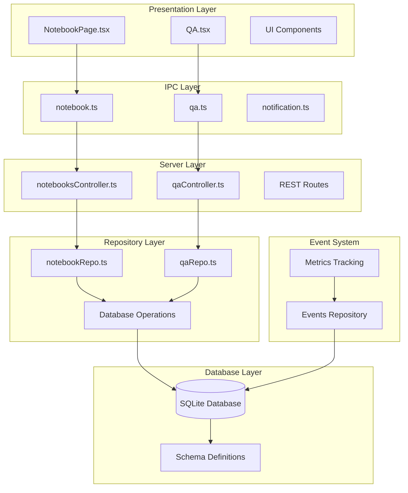
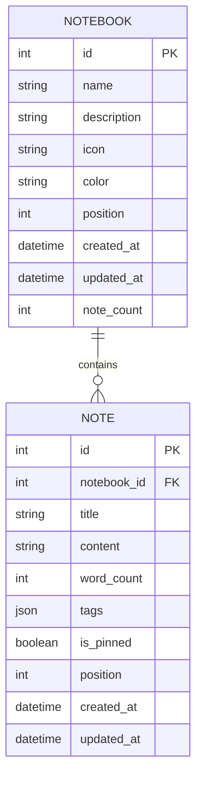
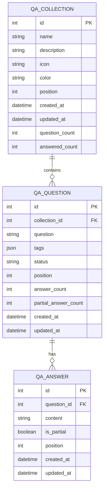
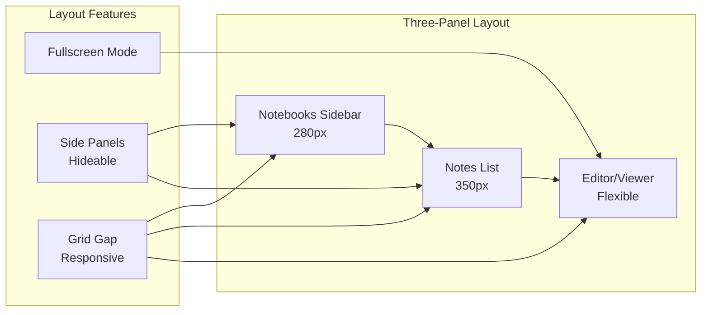
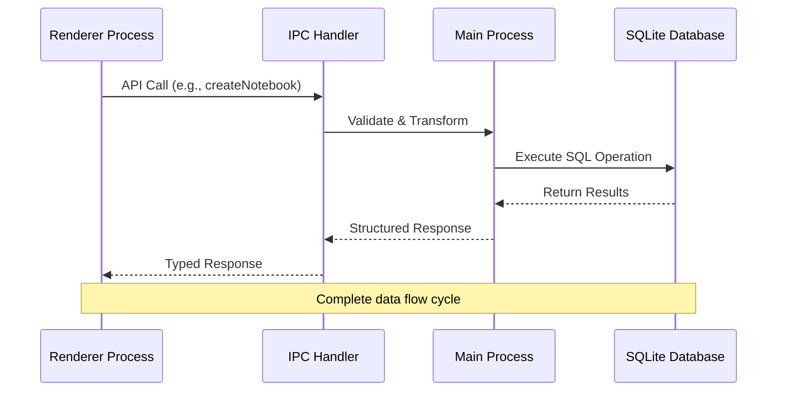
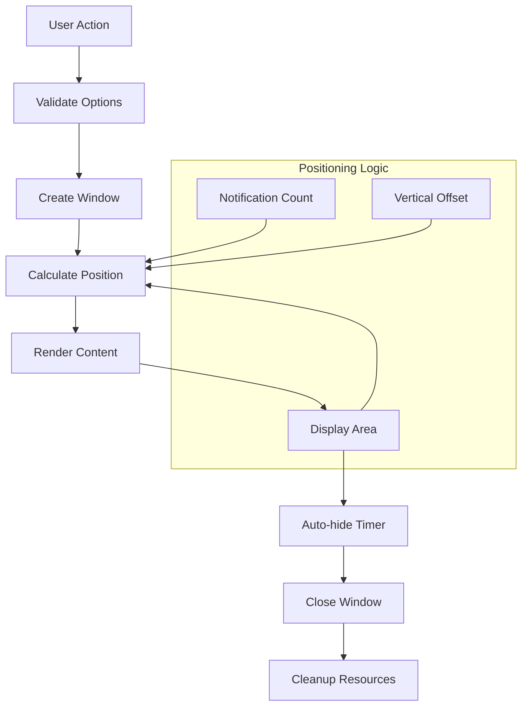

# Notebook/QA System

<cite>
**Referenced Files in This Document**
- [NotebookPage.tsx](file://src/renderer/pages/NotebookPage.tsx)
- [QA.tsx](file://src/renderer/pages/QA.tsx)
- [notebookRepo.ts](file://src/database/notebookRepo.ts)
- [notebookSchema.ts](file://src/database/notebookSchema.ts)
- [qaRepo.ts](file://src/database/qaRepo.ts)
- [qaSchema.ts](file://src/database/qaSchema.ts)
- [notebook.ts](file://src/main/ipc/notebook.ts)
- [qa.ts](file://src/main/ipc/qa.ts)
- [notebooksController.ts](file://src/server/controllers/notebooksController.ts)
- [qaController.ts](file://src/server/controllers/qaController.ts)
- [notification.ts](file://src/main/ipc/notification.ts)
- [eventsRepo.ts](file://src/database/eventsRepo.ts)
- [init.ts](file://src/database/init.ts)
- [types.ts](file://src/common/types.ts)
</cite>

## Table of Contents
1. [Introduction](#introduction)
2. [System Architecture](#system-architecture)
3. [Two-Tier Structure](#two-tier-structure)
4. [Notebook System](#notebook-system)
5. [Q&A System](#qa-system)
6. [Rich Text Editing](#rich-text-editing)
7. [Data Persistence Flow](#data-persistence-flow)
8. [State Management](#state-management)
9. [Notification System](#notification-system)
10. [Common Issues and Solutions](#common-issues-and-solutions)
11. [UX Patterns](#ux-patterns)
12. [Performance Considerations](#performance-considerations)

## Introduction

The Notebook/QA System is a comprehensive knowledge management platform within LifeOS that provides dual functionality for note-taking and question-answer organization. The system implements a two-tier hierarchical structure where notebooks contain individual notes, while Q&A collections organize questions with multiple answers. Both systems feature rich text editing capabilities, real-time synchronization, and robust data persistence through a SQLite database backend.

The system emphasizes user productivity through intuitive interfaces, keyboard shortcuts, fullscreen modes, and comprehensive CRUD operations. It integrates seamlessly with the broader LifeOS ecosystem through IPC communication and REST APIs, ensuring consistent data flow and user experience across all modules.

## System Architecture

The Notebook/QA System follows a layered architecture pattern with clear separation of concerns across presentation, business logic, data access, and storage layers.

**Diagram sources**
- [NotebookPage.tsx](file://src/renderer/pages/NotebookPage.tsx#L1-L50)
- [QA.tsx](file://src/renderer/pages/QA.tsx#L1-L50)
- [notebook.ts](file://src/main/ipc/notebook.ts#L1-L30)
- [qa.ts](file://src/main/ipc/qa.ts#L1-L30)
- [notebooksController.ts](file://src/server/controllers/notebooksController.ts#L1-L30)
- [qaController.ts](file://src/server/controllers/qaController.ts#L1-L30)

**Section sources**
- [NotebookPage.tsx](file://src/renderer/pages/NotebookPage.tsx#L1-L717)
- [QA.tsx](file://src/renderer/pages/QA.tsx#L1-L727)
- [init.ts](file://src/database/init.ts#L1-L150)

## Two-Tier Structure

The Notebook/QA System implements a sophisticated two-tier hierarchical organization that provides logical grouping and efficient content management.

### Notebook Structure

The notebook system organizes content through a parent-child relationship where notebooks serve as containers for individual notes:

**Diagram sources**
- [notebookSchema.ts](file://src/database/notebookSchema.ts#L15-L35)
- [notebookRepo.ts](file://src/database/notebookRepo.ts#L10-L30)

### Q&A Structure

The Q&A system follows a similar hierarchical pattern with collections containing questions and questions containing multiple answers:

**Diagram sources**
- [qaSchema.ts](file://src/database/qaSchema.ts#L15-L45)
- [qaRepo.ts](file://src/database/qaRepo.ts#L10-L40)

**Section sources**
- [notebookSchema.ts](file://src/database/notebookSchema.ts#L1-L52)
- [qaSchema.ts](file://src/database/qaSchema.ts#L1-L72)
- [notebookRepo.ts](file://src/database/notebookRepo.ts#L1-L400)
- [qaRepo.ts](file://src/database/qaRepo.ts#L1-L540)

## Notebook System

The Notebook system provides comprehensive note-taking functionality with rich text editing, organizational features, and seamless data persistence.

### Three-Panel Layout

The NotebookPage implements a sophisticated three-panel layout that optimizes space utilization and user workflow:

**Diagram sources**
- [NotebookPage.tsx](file://src/renderer/pages/NotebookPage.tsx#L200-L250)

### Creation Workflows

The system supports multiple creation workflows for both notebooks and notes:

#### Notebook Creation
- **Modal Interface**: Clean, focused creation form with name, icon, and description fields
- **Validation**: Real-time validation with immediate feedback
- **Default Values**: Pre-filled emoji icon and automatic positioning
- **Success Feedback**: Notification system integration for user confirmation

#### Note Creation
- **Automatic Naming**: Generated timestamp-based titles for convenience
- **Empty Content**: Fresh, blank content areas for immediate writing
- **Context Awareness**: Automatically associates notes with selected notebooks

### Editing and Deletion Workflows

The system provides comprehensive CRUD operations with state management and user feedback:

#### Edit Modes
- **Toggle Interface**: Seamless switching between view and edit modes
- **State Preservation**: Maintains content integrity during mode transitions
- **Keyboard Shortcuts**: Ctrl+S/Cmd+S for instant saving
- **Save Status Indicators**: Visual feedback for save states (idle, saving, saved, error)

#### Deletion Handling
- **Confirmation Dialogs**: Prevent accidental deletions through user confirmation
- **Cascade Effects**: Proper cleanup of associated data and relationships
- **Immediate Updates**: Real-time UI updates reflecting deletion changes

**Section sources**
- [NotebookPage.tsx](file://src/renderer/pages/NotebookPage.tsx#L50-L200)
- [notebookRepo.ts](file://src/database/notebookRepo.ts#L100-L200)

## Q&A System

The Q&A system provides structured knowledge organization through collections, questions, and multi-modal answers with status tracking.

### Collection Management

Q&A collections serve as organizational containers for related questions, similar to notebook organization:

#### Collection Features
- **Hierarchical Organization**: Logical grouping of related questions
- **Status Tracking**: Automatic calculation of collection-wide statistics
- **Visual Indicators**: Icon and color customization for identification
- **Analytics Integration**: Built-in statistics for progress tracking

### Question Management

Questions represent knowledge gaps or topics requiring answers:

#### Question States
- **Unanswered**: Initial state with no responses
- **In Progress**: Contains partial answers but not complete solutions
- **Answered**: Contains at least one complete answer
- **Automatic Status Updates**: Real-time status calculation based on answer composition

### Answer System

The answer system supports both partial and complete responses:

#### Answer Types
- **Partial Answers**: Incomplete responses that contribute to solution development
- **Complete Answers**: Final, comprehensive responses that resolve questions
- **Rich Text Support**: Full markdown editing capabilities for answers
- **Version Control**: Automatic timestamp tracking for answer modifications

**Section sources**
- [QA.tsx](file://src/renderer/pages/QA.tsx#L50-L150)
- [qaRepo.ts](file://src/database/qaRepo.ts#L200-L350)

## Rich Text Editing

The system integrates advanced rich text editing capabilities through MDEditor components, providing comprehensive markdown support and live preview functionality.

### MDEditor Integration

Both notebook notes and Q&A answers utilize the @uiw/react-md-editor component for enhanced editing experiences:

#### Editor Features
- **Live Preview**: Real-time rendering of markdown content
- **Syntax Highlighting**: Code block syntax highlighting with multiple languages
- **Toolbar Controls**: Intuitive formatting controls for text styling
- **Responsive Design**: Adaptive sizing for various screen dimensions

#### Markdown Support
- **Basic Formatting**: Bold, italic, strikethrough, underline
- **Headings**: H1-H6 level headings with automatic numbering
- **Lists**: Ordered and unordered lists with nesting support
- **Code Blocks**: Multi-language syntax highlighting
- **Tables**: Basic table creation and editing
- **Links and Images**: Inline link and image insertion with preview

### Fullscreen Mode

The system provides immersive editing experiences through fullscreen mode:

#### Fullscreen Features
- **Layout Optimization**: Single-column layout for maximum content area
- **Borderless Interface**: Minimal UI elements for distraction-free writing
- **Keyboard Navigation**: Full keyboard accessibility in fullscreen mode
- **Exit Controls**: Easy exit mechanisms with state preservation

**Section sources**
- [NotebookPage.tsx](file://src/renderer/pages/NotebookPage.tsx#L400-L500)
- [QA.tsx](file://src/renderer/pages/QA.tsx#L300-L400)

## Data Persistence Flow

The system implements a robust data persistence architecture that ensures reliable storage and synchronization across all components.

### IPC Communication Flow

Inter-process communication handles data operations between the renderer and main processes:

**Diagram sources**
- [notebook.ts](file://src/main/ipc/notebook.ts#L10-L50)
- [qa.ts](file://src/main/ipc/qa.ts#L10-L50)

### REST API Integration

The server layer provides RESTful endpoints for external access and internal routing:

#### Endpoint Patterns
- **CRUD Operations**: Standard REST patterns for all entities
- **Parameter Validation**: Zod schema validation for all inputs
- **Error Handling**: Consistent error responses with appropriate HTTP status codes
- **Response Formatting**: Unified ApiResponse structure across all endpoints

### SQLite Database Operations

The database layer implements comprehensive transaction management and data integrity:

#### Transaction Management
- **Atomic Operations**: Ensures data consistency across complex operations
- **Foreign Key Constraints**: Maintains referential integrity between related tables
- **Index Optimization**: Strategic indexing for query performance
- **Backup Strategies**: Regular backup procedures for data protection

**Section sources**
- [notebook.ts](file://src/main/ipc/notebook.ts#L1-L106)
- [qa.ts](file://src/main/ipc/qa.ts#L1-L124)
- [notebooksController.ts](file://src/server/controllers/notebooksController.ts#L1-L89)
- [qaController.ts](file://src/server/controllers/qaController.ts#L1-L217)

## State Management

The system employs sophisticated state management patterns to ensure consistent UI behavior and optimal user experience.

### React State Architecture

NotebookPage and QA components utilize React's state management capabilities with custom hooks:

#### State Categories
- **Entity State**: Primary data objects (notebooks, notes, collections, questions)
- **UI State**: Interface-related states (editing mode, modal visibility, fullscreen)
- **Operation State**: Current operation status (loading, saving, error)
- **Form State**: Temporary form data and validation states

### Edit Mode Management

The system implements intelligent edit mode detection and management:

#### Edit Detection Logic
- **Content Comparison**: Real-time comparison between edited and original content
- **Change Tracking**: Automatic detection of unsaved changes
- **Status Indicators**: Visual feedback for edit states and save status
- **Auto-save Prevention**: Intelligent save prevention to avoid accidental data loss

### Save State Management

Comprehensive save state tracking ensures reliable data persistence:

#### Save State Phases
- **Idle**: No pending changes or recent saves
- **Saving**: Active save operation with loading indicators
- **Saved**: Successful completion with success feedback
- **Error**: Failed save attempts with error recovery options

**Section sources**
- [NotebookPage.tsx](file://src/renderer/pages/NotebookPage.tsx#L15-L50)
- [QA.tsx](file://src/renderer/pages/QA.tsx#L15-L50)

## Notification System

The notification system provides comprehensive user feedback through a sophisticated popup notification architecture.

### Notification Architecture

The notification system implements a floating window architecture for persistent user feedback:

**Diagram sources**
- [notification.ts](file://src/main/ipc/notification.ts#L20-L80)

### Notification Types

The system supports multiple notification types for different user feedback scenarios:

#### Notification Categories
- **Success**: Positive confirmation messages for successful operations
- **Error**: Error notifications with detailed failure information
- **Warning**: Cautionary messages for potentially problematic actions
- **Info**: General informational messages for user guidance

### Event Integration

The notification system integrates with the broader event system for comprehensive user feedback:

#### Event Triggers
- **CRUD Operations**: Automatic notifications for create, update, and delete operations
- **Status Changes**: Notifications for significant status transitions
- **Error Conditions**: Immediate feedback for failed operations
- **System Events**: Notifications for system-level events and maintenance

**Section sources**
- [notification.ts](file://src/main/ipc/notification.ts#L1-L115)
- [eventsRepo.ts](file://src/database/eventsRepo.ts#L100-L136)

## Common Issues and Solutions

The system addresses several common challenges through robust architectural decisions and implementation patterns.

### Content Change Detection

Accurate change detection prevents data loss and provides appropriate user feedback:

#### Implementation Strategies
- **Deep Comparison**: Comprehensive content comparison for complex objects
- **Debounced Checks**: Prevent excessive re-evaluation during rapid changes
- **State Normalization**: Consistent state representation across different contexts
- **Performance Optimization**: Efficient change detection algorithms for large datasets

### Save State Management

Reliable save state management ensures data integrity and user confidence:

#### State Synchronization
- **Real-time Updates**: Immediate reflection of save operations
- **Conflict Resolution**: Handling concurrent modification scenarios
- **Rollback Mechanisms**: Recovery options for failed save attempts
- **Offline Support**: Graceful handling of network interruptions

### Large Collection Handling

The system optimizes performance for large note and question collections:

#### Performance Optimizations
- **Virtual Scrolling**: Efficient rendering of large lists
- **Lazy Loading**: Progressive loading of content as needed
- **Pagination**: Strategic pagination for memory management
- **Caching Strategies**: Intelligent caching of frequently accessed data

### Memory Management

Efficient memory usage prevents performance degradation:

#### Memory Optimization
- **Component Unmounting**: Proper cleanup of unused components
- **Event Listener Management**: Automatic removal of event listeners
- **Image Optimization**: Efficient handling of media content
- **State Pruning**: Removal of unnecessary state data

**Section sources**
- [NotebookPage.tsx](file://src/renderer/pages/NotebookPage.tsx#L150-L200)
- [QA.tsx](file://src/renderer/pages/QA.tsx#L150-L200)

## UX Patterns

The system implements established UX patterns that enhance usability and user satisfaction.

### Empty State Handling

Intelligent empty state management guides users through initial setup:

#### Empty State Strategies
- **Guided Onboarding**: Step-by-step introduction to system features
- **Visual Cues**: Clear indication of available actions
- **Helpful Messaging**: Informative guidance for first-time users
- **Action Prompts**: Clear calls-to-action for content creation

### Modal Creation Flows

Structured modal dialogs provide focused user experiences:

#### Modal Design Principles
- **Focus Management**: Proper keyboard navigation and focus trapping
- **Escape Handling**: Escape key support for modal dismissal
- **Validation Feedback**: Real-time validation with immediate feedback
- **Success Confirmation**: Clear indication of successful operations

### Keyboard Shortcuts

Comprehensive keyboard support enhances productivity:

#### Shortcut Implementation
- **Global Shortcuts**: System-wide shortcuts for common operations
- **Context Sensitivity**: Appropriate shortcuts based on current context
- **Accessibility**: Full keyboard navigation support
- **Customization**: Extensible shortcut system for user preferences

### Responsive Design

Adaptive layouts ensure optimal experience across devices:

#### Responsive Features
- **Breakpoint Management**: Strategic responsive breakpoints
- **Touch Optimization**: Touch-friendly interfaces for mobile devices
- **High DPI Support**: Clear rendering on high-resolution displays
- **Orientation Handling**: Proper adaptation to device orientation changes

**Section sources**
- [NotebookPage.tsx](file://src/renderer/pages/NotebookPage.tsx#L600-L717)
- [QA.tsx](file://src/renderer/pages/QA.tsx#L600-L727)

## Performance Considerations

The system implements several performance optimization strategies to ensure smooth operation under various conditions.

### Database Optimization

Strategic database design and indexing ensure optimal query performance:

#### Indexing Strategy
- **Composite Indexes**: Multi-column indexes for complex queries
- **Covering Indexes**: Indexes that include all required columns
- **Selective Indexing**: Careful selection of indexed columns
- **Maintenance Procedures**: Regular index optimization and maintenance

### Memory Management

Efficient memory usage prevents performance degradation:

#### Memory Optimization Techniques
- **Object Pooling**: Reuse of expensive objects to reduce garbage collection
- **Weak References**: Appropriate use of weak references for cache management
- **Memory Profiling**: Regular monitoring of memory usage patterns
- **Leak Detection**: Proactive identification and resolution of memory leaks

### Network Optimization

Efficient data transfer reduces latency and improves user experience:

#### Network Strategies
- **Request Batching**: Combining multiple requests into single operations
- **Compression**: Data compression for reduced bandwidth usage
- **Caching**: Intelligent caching of frequently accessed data
- **Connection Pooling**: Efficient management of network connections

### Rendering Performance

Optimized rendering ensures smooth user interactions:

#### Rendering Optimizations
- **Component Memoization**: React.memo for expensive components
- **Render Delegation**: Offloading heavy rendering to worker threads
- **Frame Rate Management**: Consistent 60fps rendering performance
- **Animation Optimization**: Hardware-accelerated animations where possible

The Notebook/QA System represents a comprehensive knowledge management solution that balances functionality, performance, and user experience. Through its sophisticated architecture, robust data persistence, and intuitive interface design, it provides users with powerful tools for organizing and accessing their knowledge while maintaining reliability and performance across diverse usage scenarios.