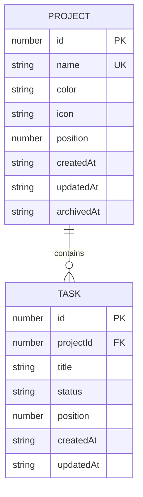
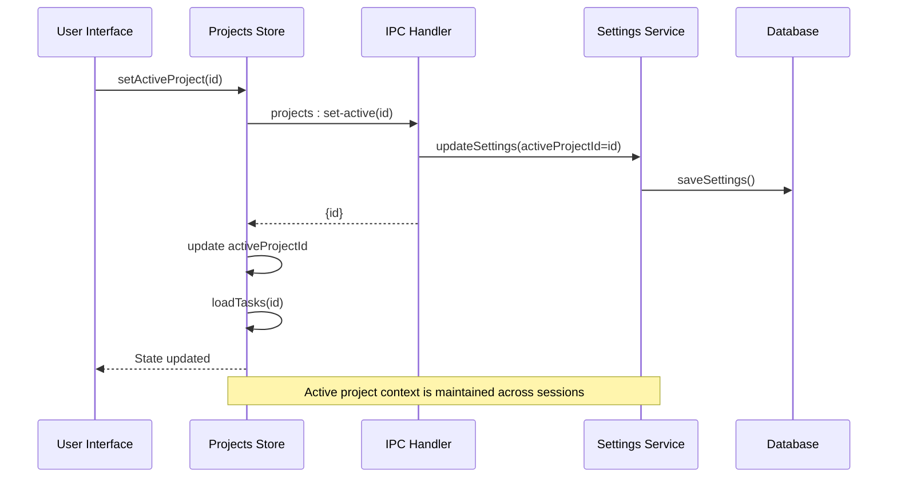
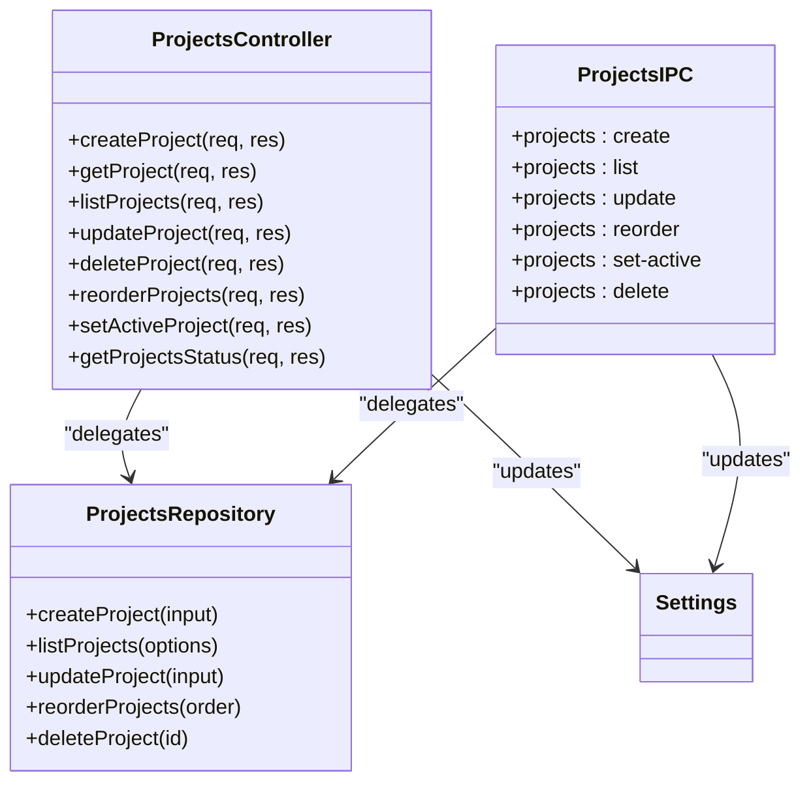
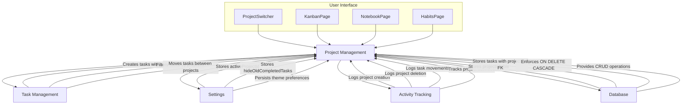

# Project Management

<cite>
**Referenced Files in This Document**   
- [ProjectSwitcher.tsx](file://src/renderer/components/ProjectSwitcher.tsx)
- [KanbanPage.tsx](file://src/renderer/pages/KanbanPage.tsx)
- [projectsRepo.ts](file://src/database/projectsRepo.ts)
- [projects.ts](file://src/main/ipc/projects.ts)
- [projectsController.ts](file://src/server/controllers/projectsController.ts)
- [types.ts](file://src/common/types.ts)
- [projects.ts](file://src/store/projects.ts)
- [projects.ts](file://src/server/routes/projects.ts)
- [settings.ts](file://src/services/settings.ts)
- [App.tsx](file://src/renderer/App.tsx)
</cite>

## Table of Contents
1. [Introduction](#introduction)
2. [Project Data Model](#project-data-model)
3. [Project Switcher Component](#project-switcher-component)
4. [Project Context Management](#project-context-management)
5. [CRUD Operations](#crud-operations)
6. [Integration with Kanban Page](#integration-with-kanban-page)
7. [State Persistence](#state-persistence)
8. [Relationships with Other Modules](#relationships-with-other-modules)
9. [Common Issues and Solutions](#common-issues-and-solutions)
10. [UI Patterns and Visual Indicators](#ui-patterns-and-visual-indicators)

## Introduction
The Project Management module provides a comprehensive system for organizing and switching between projects in the LifeOS application. This documentation details the implementation of project organization, the ProjectSwitcher component, data models, CRUD operations, and integration with other modules like Kanban. The system enables users to create, manage, and switch between projects with visual indicators and maintains project context across the application.

## Project Data Model
The project data model defines the structure and properties of projects in the system, including name, color, icon, and position.



**Diagram sources**
- [types.ts](file://src/common/types.ts#L0-L116)
- [projectsRepo.ts](file://src/database/projectsRepo.ts#L0-L147)
- [init.ts](file://src/database/init.ts#L44-L85)

### Project Properties
| Property | Type | Description | Constraints |
|--------|------|-------------|-------------|
| **id** | number | Unique identifier for the project | Primary key, auto-increment |
| **name** | string | Display name of the project | Required, unique, 1-120 characters |
| **color** | string | Color code for visual identification | Optional, max 20 characters |
| **icon** | string | Icon identifier for the project | Optional, max 30 characters |
| **position** | number | Order position in the project list | Non-negative integer, default 0 |
| **createdAt** | string | Timestamp of project creation | ISO 8601 format |
| **updatedAt** | string | Timestamp of last update | ISO 8601 format |
| **archivedAt** | string | Timestamp when project was archived | ISO 8601 format, null if active |

**Section sources**
- [types.ts](file://src/common/types.ts#L0-L116)
- [projectsRepo.ts](file://src/database/projectsRepo.ts#L0-L147)

## Project Switcher Component
The ProjectSwitcher component provides a user interface for project selection, creation, and deletion with visual statistics.

```mermaid
flowchart TD
A[ProjectSwitcher Component] --> B[State Management]
B --> B1[open: boolean]
B --> B2[newProjectName: string]
B --> B3[creating: boolean]
B --> B4[projectToDelete: Project]
B --> B5[projectStats: Record]
A --> C[Event Listeners]
C --> C1[Document Click Handler]
C --> C2[Escape Key Handler]
A --> D[Statistics Fetching]
D --> D1[Fetch task counts]
D --> D2[Calculate completion stats]
D --> D3[Update projectStats]
A --> E[UI Rendering]
E --> E1[Active Project Display]
E --> E2[Dropdown Menu]
E --> E3[Create Project Form]
E --> E4[Delete Confirmation Dialog]
E1 --> E1a[Color Indicator]
E1 --> E1b[Project Name]
E1 --> E1c[Task Statistics]
E2 --> E2a[Project List]
E2 --> E2b[Active Project Highlight]
E2 --> E2c[Delete Buttons]
E3 --> E3a[Name Input]
E3 --> E3b[Add Button]
E4 --> E4a[Confirmation Modal]
E4 --> E4b[Delete/Cancel Actions]
```



**Diagram sources**
- [ProjectSwitcher.tsx](file://src/renderer/components/ProjectSwitcher.tsx#L0-L325)

### Component Features
- **Visual Indicators**: Color dots and statistics display for quick project identification
- **Statistics Integration**: Real-time task count, completion, and progress metrics
- **Keyboard Navigation**: Support for Enter key selection and Escape key dismissal
- **Click Outside Dismissal**: Automatically closes when clicking outside the component
- **Confirmation Dialog**: Prevents accidental project deletion with confirmation
- **Responsive Design**: Adapts to different screen sizes and states

**Section sources**
- [ProjectSwitcher.tsx](file://src/renderer/components/ProjectSwitcher.tsx#L0-L325)

## Project Context Management
The system maintains project context across the application through a combination of state management, IPC communication, and settings persistence.



**Diagram sources**
- [projects.ts](file://src/store/projects.ts#L0-L86)
- [projects.ts](file://src/main/ipc/projects.ts#L0-L83)
- [settings.ts](file://src/services/settings.ts#L0-L45)

### Context Flow
1. **User Interaction**: User selects a project via ProjectSwitcher
2. **State Update**: Projects store updates activeProjectId immediately
3. **Persistence**: IPC handler updates settings to persist selection
4. **Data Loading**: Store loads tasks for the newly active project
5. **UI Update**: Components re-render with new project context

The context management system ensures that project selection is reflected consistently across all components and persists between application sessions.

**Section sources**
- [projects.ts](file://src/store/projects.ts#L0-L86)
- [projects.ts](file://src/main/ipc/projects.ts#L0-L83)
- [settings.ts](file://src/services/settings.ts#L0-L45)

## CRUD Operations
The project management system implements full CRUD (Create, Read, Update, Delete) operations through both IPC and REST API endpoints.



**Diagram sources**
- [projectsController.ts](file://src/server/controllers/projectsController.ts#L0-L133)
- [projects.ts](file://src/main/ipc/projects.ts#L0-L83)
- [projectsRepo.ts](file://src/database/projectsRepo.ts#L0-L147)

### Operation Details
#### Create Operation
- **Endpoint**: `POST /api/projects/create`
- **IPC**: `projects:create`
- **Validation**: Name required (1-120 chars), unique constraint
- **Position**: Automatically assigned as max position + 1
- **Active Project**: Set as active if first project or only project

#### Read Operations
- **List All**: `GET /api/projects` returns all active projects
- **Get Single**: `GET /api/projects/:id` returns specific project
- **Status Info**: `GET /api/projects/status` includes statistics
- **Active Project**: Automatically determined from settings

#### Update Operation
- **Endpoint**: `PUT /api/projects/:id`
- **IPC**: `projects:update`
- **Fields**: Name, color, icon, position, archivedAt
- **Validation**: Name 1-120 chars if provided
- **Timestamp**: updated_at automatically updated

#### Delete Operation
- **Endpoint**: `DELETE /api/projects/:id`
- **IPC**: `projects:delete`
- **Cascade**: Deletes all associated tasks and activities
- **Active Project**: Switches to first available project if deleted
- **Transaction**: All operations in a single database transaction

#### Reorder Operation
- **Endpoint**: `PUT /api/projects/reorder`
- **IPC**: `projects:reorder`
- **Input**: Array of {id, position} objects
- **Transaction**: Batch update of position values
- **Consistency**: Ensures position integrity across all projects

**Section sources**
- [projectsController.ts](file://src/server/controllers/projectsController.ts#L0-L133)
- [projects.ts](file://src/main/ipc/projects.ts#L0-L83)
- [projectsRepo.ts](file://src/database/projectsRepo.ts#L0-L147)

## Integration with Kanban Page
The ProjectSwitcher component is tightly integrated with the Kanban page to provide seamless project switching and task management.

```mermaid
flowchart TD
A[KanbanPage] --> B[Project Context]
B --> B1[activeProjectId]
B --> B2[projects]
B --> B3[onSelectProject]
B --> B4[onCreateProject]
B --> B5[onDeleteProject]
A --> C[Task Management]
C --> C1[Task Filtering]
C --> C2[Task Creation]
C --> C3[Task Updates]
C --> C4[Task Deletion]
A --> D[UI Components]
D --> D1[ProjectSwitcher]
D --> D2[KanbanColumn]
D --> D3[TaskCard]
D --> D4[TaskDetailPanel]
D1 --> D1a[Passes props to ProjectSwitcher]
D1a --> D1a1[projects]
D1a --> D1a2[activeProjectId]
D1a --> D1a3[onSelect]
D1a --> D1a4[onCreate]
D1a --> D1a5[onDelete]
C1 --> C1a[Filters tasks by activeProjectId]
C1a --> C1a1[Excludes deleted tasks]
C1a --> C1a2[Applies hideOldCompleted setting]
C2 --> C2a[Creates tasks with projectId]
C3 --> C3a[Updates tasks in active project]
C4 --> C4a[Soft deletes tasks (status=Deleted)]
```

**Diagram sources**
- [KanbanPage.tsx](file://src/renderer/pages/KanbanPage.tsx#L0-L519)
- [ProjectSwitcher.tsx](file://src/renderer/components/ProjectSwitcher.tsx#L0-L325)

### Integration Features
- **Project Selection**: Kanban page displays ProjectSwitcher in header
- **Task Filtering**: Only shows tasks from active project
- **Task Creation**: New tasks are automatically assigned to active project
- **State Persistence**: Selected task is saved to localStorage per project
- **Empty State**: Displays helpful message when no project is selected
- **Settings Integration**: Respects hideOldCompletedTasks preference

The integration ensures that users can seamlessly switch between projects and immediately see the relevant tasks in the Kanban board.

**Section sources**
- [KanbanPage.tsx](file://src/renderer/pages/KanbanPage.tsx#L0-L519)
- [ProjectSwitcher.tsx](file://src/renderer/components/ProjectSwitcher.tsx#L0-L325)

## State Persistence
The system maintains project state across application restarts through settings persistence and local storage.

```mermaid
flowchart LR
A[Application Start] --> B[Load Settings]
B --> C{Settings Exist?}
C --> |Yes| D[Get activeProjectId]
C --> |No| E[Use first project]
D --> F[Set activeProjectId]
E --> F
F --> G[Load Tasks]
G --> H[Restore UI State]
I[Project Switch] --> J[Update activeProjectId]
J --> K[Save to Settings]
K --> L[Load New Project Tasks]
L --> M[Update UI]
N[Task Selection] --> O[Save to localStorage]
O --> P[Key: kanban_selected_task_{projectId}]
P --> Q[Restore on reload]
```

**Diagram sources**
- [settings.ts](file://src/services/settings.ts#L0-L45)
- [App.tsx](file://src/renderer/App.tsx#L0-L175)
- [KanbanPage.tsx](file://src/renderer/pages/KanbanPage.tsx#L0-L519)

### Persistence Mechanisms
- **Settings File**: `settings.json` in user data directory stores activeProjectId
- **Local Storage**: Per-project task selection is preserved
- **Automatic Recovery**: If active project is deleted, switches to first available
- **First Run Experience**: When no projects exist, activeProjectId is undefined
- **Consistency Checks**: Validates active project exists in current project list

The persistence system ensures that users return to their previous working context when reopening the application.

**Section sources**
- [settings.ts](file://src/services/settings.ts#L0-L45)
- [App.tsx](file://src/renderer/App.tsx#L0-L175)
- [KanbanPage.tsx](file://src/renderer/pages/KanbanPage.tsx#L0-L519)

## Relationships with Other Modules
The Project Management module integrates with several other modules to provide a cohesive user experience.



**Diagram sources**
- [projectsRepo.ts](file://src/database/projectsRepo.ts#L0-L147)
- [tasksRepo.ts](file://src/database/tasksRepo.ts#L0-L31)
- [settings.ts](file://src/services/settings.ts#L0-L45)
- [activity.ts](file://src/store/activity.ts#L0-L67)

### Module Interactions
- **Task Management**: Projects provide context for task operations and filtering
- **Settings**: Active project selection is persisted and shared
- **Activity Tracking**: Project changes are logged as activities
- **Database**: Projects table with foreign key relationships to tasks
- **UI Components**: Project context drives content in Kanban, Notebook, and Habits

The relationships ensure that project changes are reflected consistently across all modules.

**Section sources**
- [projectsRepo.ts](file://src/database/projectsRepo.ts#L0-L147)
- [tasksRepo.ts](file://src/database/tasksRepo.ts#L0-L31)
- [settings.ts](file://src/services/settings.ts#L0-L45)
- [activity.ts](file://src/store/activity.ts#L0-L67)

## Common Issues and Solutions
This section addresses common issues in project management and their solutions.

### Empty Project State
When no projects exist, the application handles this gracefully:
- ProjectSwitcher displays "No projects yet" message
- Kanban page shows a helpful prompt to create a project
- First created project automatically becomes active
- UI elements adapt to the empty state

**Section sources**
- [ProjectSwitcher.tsx](file://src/renderer/components/ProjectSwitcher.tsx#L0-L325)
- [KanbanPage.tsx](file://src/renderer/pages/KanbanPage.tsx#L0-L519)

### Project Consistency Across Processes
The system ensures project consistency through:
- **Transaction Safety**: Database operations use transactions
- **Foreign Key Constraints**: ON DELETE CASCADE ensures data integrity
- **State Synchronization**: Store updates propagate to all components
- **Error Handling**: Graceful recovery from failed operations
- **Validation**: Input validation at multiple levels (IPC, repository)

**Section sources**
- [projectsRepo.ts](file://src/database/projectsRepo.ts#L0-L147)
- [projects.ts](file://src/main/ipc/projects.ts#L0-L83)

### Project Deletion with Associated Tasks
When deleting a project:
- **Cascade Deletion**: All tasks and activities are deleted
- **Transaction**: All deletions in a single transaction
- **Active Project**: Automatically switches to first available project
- **User Confirmation**: Requires explicit confirmation
- **Notification**: Shows success message after deletion

The system prevents orphaned tasks and maintains data integrity.

**Section sources**
- [projectsRepo.ts](file://src/database/projectsRepo.ts#L116-L146)
- [projects.ts](file://src/main/ipc/projects.ts#L65-L82)

## UI Patterns and Visual Indicators
The project management system employs consistent UI patterns for project selection and status.

### Project Selection Patterns
- **Dropdown Menu**: Click to expand project list
- **Keyboard Support**: Enter to select, Escape to close
- **Click Outside**: Automatically closes menu
- **Visual Feedback**: Active project highlighted in dropdown
- **Immediate Update**: Selection reflects instantly in UI

### Visual Indicators
- **Color Dots**: Small colored circles representing project color
- **Task Statistics**: Icons and counts for task status
- **Active Label**: "Active" text next to current project
- **Hover Effects**: Subtle background changes on hover
- **Loading States**: Disabled inputs during creation

### Accessibility Features
- **Keyboard Navigation**: Full keyboard operability
- **ARIA Labels**: Proper semantic markup
- **Focus Management**: Logical tab order
- **Contrast Ratios**: Sufficient color contrast
- **Screen Reader Support**: Accessible component structure

These patterns ensure a consistent and intuitive user experience.

**Section sources**
- [ProjectSwitcher.tsx](file://src/renderer/components/ProjectSwitcher.tsx#L0-L325)
- [KanbanPage.tsx](file://src/renderer/pages/KanbanPage.tsx#L0-L519)