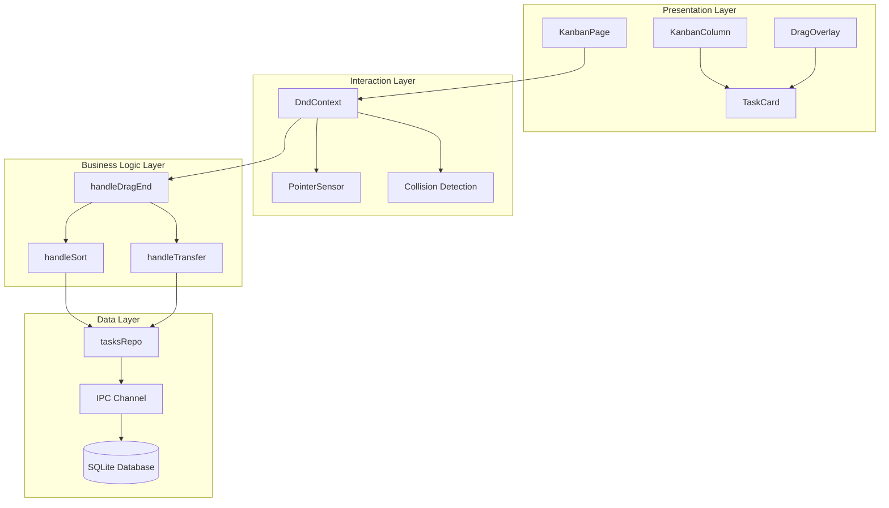
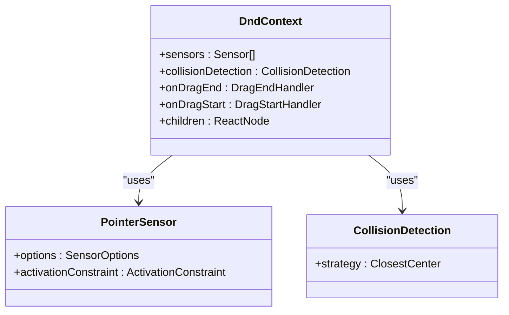
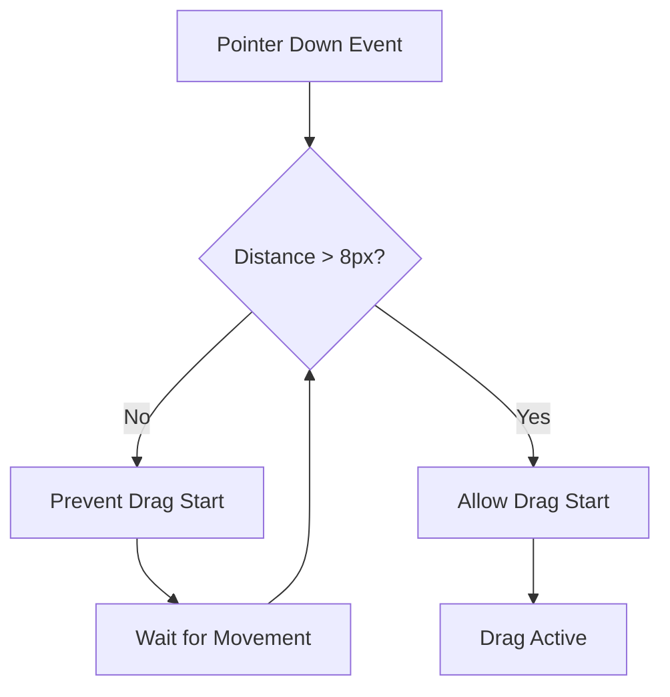
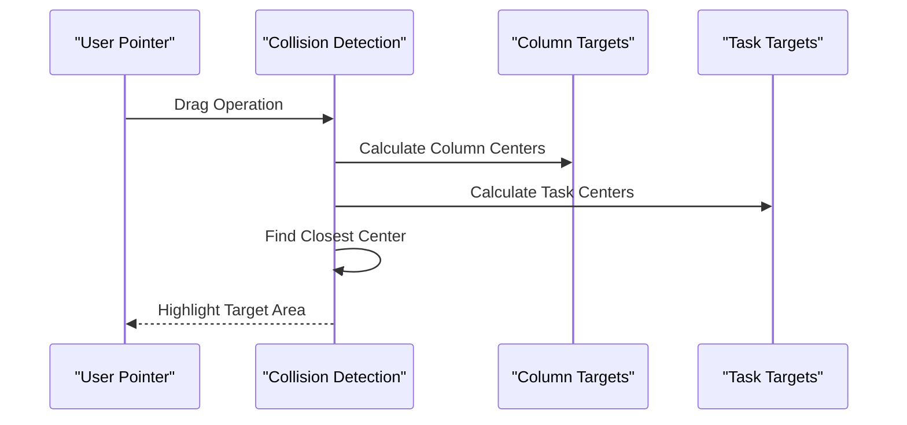
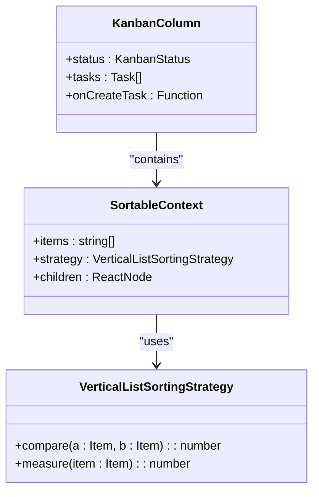
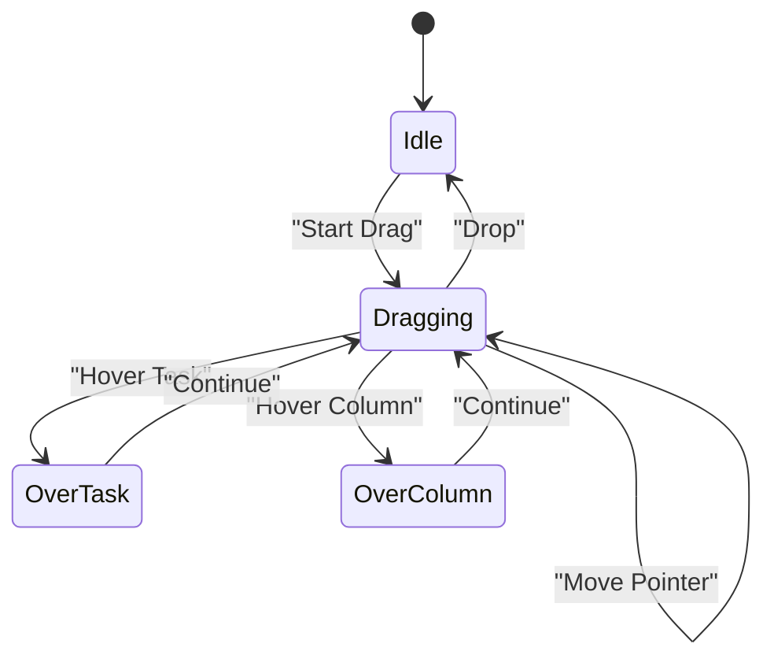
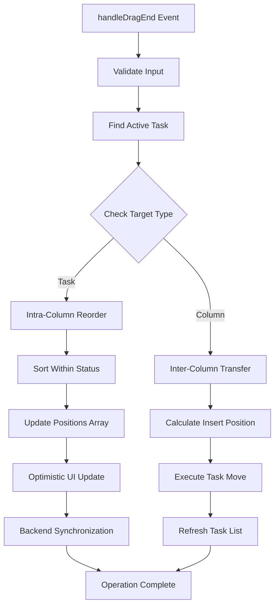
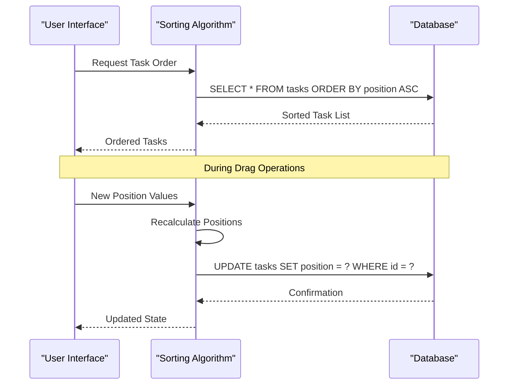
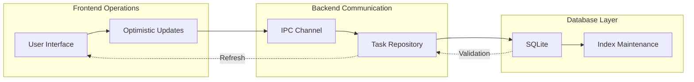
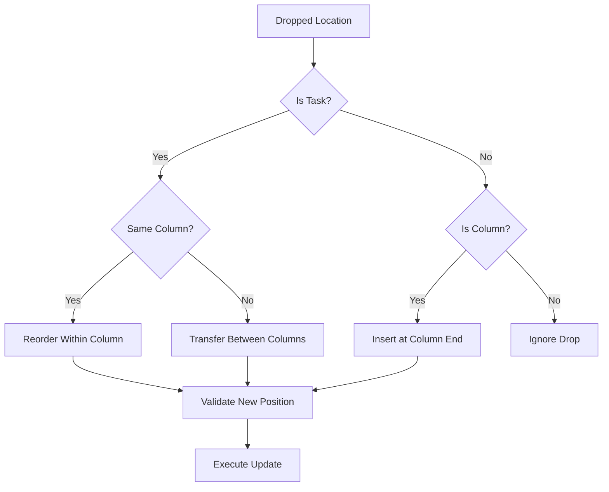

# Drag and Drop Functionality

<cite>
**Referenced Files in This Document**
- [KanbanPage.tsx](file://src/renderer/pages/KanbanPage.tsx)
- [TaskCard.tsx](file://src/renderer/components/TaskCard.tsx)
- [KanbanColumn.tsx](file://src/renderer/components/KanbanColumn.tsx)
- [tasksRepo.ts](file://src/database/tasksRepo.ts)
- [types.ts](file://src/common/types.ts)
- [constants.ts](file://src/renderer/constants.ts)
- [tasks.ts](file://src/main/ipc/tasks.ts)
</cite>

## Table of Contents
1. [Introduction](#introduction)
2. [Architecture Overview](#architecture-overview)
3. [DndContext Provider Configuration](#dndcontext-provider-configuration)
4. [PointerSensor Activation Constraints](#pointersensor-activation-constraints)
5. [Collision Detection Strategy](#collision-detection-strategy)
6. [SortableContext Implementation](#sortablecontext-implementation)
7. [Visual Feedback Mechanisms](#visual-feedback-mechanisms)
8. [Drag and Drop Event Handlers](#drag-and-drop-event-handlers)
9. [Position-Based Sorting Algorithm](#position-based-sorting-algorithm)
10. [Database Synchronization](#database-synchronization)
11. [Performance Optimization](#performance-optimization)
12. [Edge Case Handling](#edge-case-handling)
13. [Common Issues and Solutions](#common-issues-and-solutions)

## Introduction

LifeOS implements a sophisticated drag and drop functionality for task management using the @dnd-kit library ecosystem. This system enables seamless task reordering within columns and cross-column status transitions, providing an intuitive Kanban board experience. The implementation combines React hooks, custom positioning algorithms, and real-time database synchronization to deliver responsive and reliable task management capabilities.

The drag and drop system is built around several core principles: preventing accidental drags through activation constraints, providing immediate visual feedback during interactions, maintaining data consistency through optimistic updates, and handling complex edge cases like boundary conditions and performance optimization for large task lists.

## Architecture Overview

The drag and drop functionality in LifeOS follows a layered architecture that separates concerns between presentation, business logic, and data persistence:

**Diagram sources**
- [KanbanPage.tsx](file://src/renderer/pages/KanbanPage.tsx#L1-L520)
- [KanbanColumn.tsx](file://src/renderer/components/KanbanColumn.tsx#L1-L104)
- [TaskCard.tsx](file://src/renderer/components/TaskCard.tsx#L1-L182)

## DndContext Provider Configuration

The DndContext provider serves as the foundation for the entire drag and drop system, configuring essential parameters for interaction behavior and collision detection:

**Diagram sources**
- [KanbanPage.tsx](file://src/renderer/pages/KanbanPage.tsx#L213-L218)

The DndContext is configured with three primary parameters:

- **Sensors**: Defines input methods and activation criteria for drag interactions
- **Collision Detection**: Specifies how the system identifies target areas during drag operations
- **Event Handlers**: Manages drag lifecycle events for state updates and business logic execution

**Section sources**
- [KanbanPage.tsx](file://src/renderer/pages/KanbanPage.tsx#L213-L218)

## PointerSensor Activation Constraints

The PointerSensor implementation includes sophisticated activation constraints designed to prevent accidental drags while maintaining responsiveness for intentional interactions:

**Diagram sources**
- [KanbanPage.tsx](file://src/renderer/pages/KanbanPage.tsx#L195-L201)

The activation constraint is configured with a distance threshold of 8 pixels, providing several benefits:

- **Accidental Drag Prevention**: Users can click or tap without triggering unwanted drag operations
- **Intentional Interaction Recognition**: Clear movements trigger drag operations reliably
- **Touch Device Compatibility**: Works effectively across different input devices
- **Performance Optimization**: Reduces unnecessary computation for minor pointer movements

**Section sources**
- [KanbanPage.tsx](file://src/renderer/pages/KanbanPage.tsx#L195-L201)

## Collision Detection Strategy

The system employs the `closestCenter` collision detection strategy, which identifies the nearest center point among all potential drop targets:

**Diagram sources**
- [KanbanPage.tsx](file://src/renderer/pages/KanbanPage.tsx#L213-L218)

This strategy provides optimal behavior for Kanban-style interfaces by:

- **Precise Targeting**: Ensures users can place tasks exactly where intended
- **Column Awareness**: Recognizes column boundaries and task positions
- **Performance Efficiency**: Uses spatial indexing for fast calculations
- **Visual Clarity**: Provides clear visual feedback on potential drop locations

**Section sources**
- [KanbanPage.tsx](file://src/renderer/pages/KanbanPage.tsx#L213-L218)

## SortableContext Implementation

The SortableContext component manages task ordering within individual columns using a vertical list sorting strategy:

**Diagram sources**
- [KanbanColumn.tsx](file://src/renderer/components/KanbanColumn.tsx#L2-L3)
- [KanbanColumn.tsx](file://src/renderer/components/KanbanColumn.tsx#L25-L30)

Each column maintains its own sortable context with:

- **Item Identification**: Tasks are identified by `task-{id}` format for consistent referencing
- **Vertical Strategy**: Maintains natural top-to-bottom ordering within columns
- **Dynamic Updates**: Automatically handles task additions and removals
- **Position Tracking**: Preserves task positions during drag operations

**Section sources**
- [KanbanColumn.tsx](file://src/renderer/components/KanbanColumn.tsx#L25-L30)

## Visual Feedback Mechanisms

The visual feedback system provides comprehensive user experience enhancements during drag operations:

**Diagram sources**
- [TaskCard.tsx](file://src/renderer/components/TaskCard.tsx#L12-L40)
- [KanbanPage.tsx](file://src/renderer/pages/KanbanPage.tsx#L470-L485)

### Transform Effects and Opacity Changes

The TaskCard component implements sophisticated visual transformations during drag operations:

- **Rotation Effect**: Tasks rotate slightly (3 degrees) to indicate drag state
- **Opacity Management**: Original cards become invisible during drag to prevent ghost effects
- **Shadow Enhancement**: Increased shadow depth for visual depth during drag
- **Transform Persistence**: Smooth transitions between states using CSS transforms

### Drag Overlay Implementation

The DragOverlay component provides a floating representation of dragged tasks:

- **Optimized Rendering**: Uses minimal DOM overhead for smooth performance
- **Custom Styling**: Implements rotating, shadowed appearance for visual distinction
- **State Management**: Syncs with drag state to show/hide overlay appropriately

**Section sources**
- [TaskCard.tsx](file://src/renderer/components/TaskCard.tsx#L12-L40)
- [KanbanPage.tsx](file://src/renderer/pages/KanbanPage.tsx#L470-L485)

## Drag and Drop Event Handlers

The handleDragEnd function orchestrates complex logic for both intra-column reordering and inter-column status transitions:

**Diagram sources**
- [KanbanPage.tsx](file://src/renderer/pages/KanbanPage.tsx#L219-L320)

### Intra-Column Reordering Logic

When tasks are reordered within the same column, the system:

1. **Filters Column Tasks**: Selects only tasks from the destination status
2. **Sorts by Position**: Creates a sorted array based on current position values
3. **Calculates Indices**: Determines old and new positions for affected tasks
4. **Applies Array Movement**: Uses `arrayMove` utility for efficient reordering
5. **Updates Positions**: Recalculates position values for all affected tasks
6. **Optimistically Updates UI**: Immediately reflects changes in the interface
7. **Synchronizes with Backend**: Updates database with new position values

### Inter-Column Status Transitions

Cross-column movements involve additional complexity:

1. **Destination Determination**: Identifies target status and insertion position
2. **Position Calculation**: Determines appropriate position within new column
3. **Status Update**: Changes task status and position simultaneously
4. **Database Synchronization**: Persists changes to the backend system
5. **Activity Logging**: Records the transition for audit purposes

**Section sources**
- [KanbanPage.tsx](file://src/renderer/pages/KanbanPage.tsx#L219-L320)

## Position-Based Sorting Algorithm

The system implements a position-based sorting mechanism that ensures consistent ordering across client and server:

**Diagram sources**
- [tasksRepo.ts](file://src/database/tasksRepo.ts#L25-L30)
- [KanbanPage.tsx](file://src/renderer/pages/KanbanPage.tsx#L250-L270)

### Position Value Management

The algorithm maintains position values through several mechanisms:

- **Sequential Assignment**: New tasks receive sequential position values
- **Gap Filling**: Removed tasks create gaps that can be filled efficiently
- **Batch Updates**: Multiple position changes are handled in batches for performance
- **Consistency Checks**: Validates position values against database state

### Conflict Resolution

When position conflicts occur:

1. **Optimistic Updates**: UI reflects changes immediately while backend processes
2. **Conflict Detection**: Compares local state with database state
3. **Resolution Strategy**: Refreshes data if inconsistencies are detected
4. **User Notification**: Provides feedback for significant conflicts

**Section sources**
- [tasksRepo.ts](file://src/database/tasksRepo.ts#L25-L30)
- [KanbanPage.tsx](file://src/renderer/pages/KanbanPage.tsx#L250-L270)

## Database Synchronization

The database synchronization process ensures data consistency between the frontend interface and persistent storage:

**Diagram sources**
- [tasksRepo.ts](file://src/database/tasksRepo.ts#L1-L211)
- [tasks.ts](file://src/main/ipc/tasks.ts#L1-L37)

### Transaction Management

The system handles database operations through several transaction patterns:

- **Single Operations**: Individual task updates use atomic transactions
- **Batch Operations**: Multiple position updates are grouped for efficiency
- **Rollback Capability**: Failed operations can be rolled back safely
- **Concurrency Handling**: Manages simultaneous access from multiple clients

### Error Handling and Recovery

Robust error handling ensures system reliability:

1. **Network Failures**: Retries failed operations with exponential backoff
2. **Validation Errors**: Provides meaningful feedback for invalid operations
3. **Conflict Resolution**: Handles concurrent modification scenarios
4. **State Recovery**: Restores consistent state after failures

**Section sources**
- [tasksRepo.ts](file://src/database/tasksRepo.ts#L1-L211)
- [tasks.ts](file://src/main/ipc/tasks.ts#L1-L37)

## Performance Optimization

The drag and drop system incorporates several performance optimization strategies for handling large task lists efficiently:

### Virtual Scrolling Implementation

For large task lists, the system implements virtual scrolling to maintain performance:

- **Viewport Management**: Only renders visible tasks in the viewport
- **Dynamic Loading**: Loads additional tasks as users scroll
- **Memory Efficiency**: Minimizes DOM element count regardless of total task count
- **Smooth Scrolling**: Maintains 60fps scrolling performance

### Debounced Updates

Database updates are debounced to prevent excessive API calls:

- **Rate Limiting**: Limits update frequency to prevent server overload
- **Batch Processing**: Groups multiple changes into single requests
- **Priority Queuing**: Handles critical updates with higher priority
- **Background Processing**: Performs non-critical updates in background threads

### Efficient State Management

The system optimizes state updates through:

- **Selective Re-rendering**: Only affected components re-render during drag operations
- **Memoization**: Uses React.memo and useMemo for expensive computations
- **State Normalization**: Maintains flat state structures for efficient updates
- **Immutable Updates**: Uses immutable patterns to enable efficient change detection

## Edge Case Handling

The system addresses numerous edge cases that can occur during drag and drop operations:

### Boundary Condition Handling

**Diagram sources**
- [KanbanPage.tsx](file://src/renderer/pages/KanbanPage.tsx#L219-L320)

### Column Boundary Conditions

The system handles various column boundary scenarios:

- **Empty Columns**: Allows tasks to be moved to empty columns
- **Column Headers**: Prevents dropping tasks on column headers
- **Column Borders**: Accurately detects hover states near column edges
- **Multi-Column Layouts**: Handles layouts with varying numbers of columns

### Task State Conflicts

Several conflict scenarios are managed:

- **Deleted Tasks**: Prevents dragging of tasks marked for deletion
- **Archived Tasks**: Excludes archived/completed tasks from drag operations
- **Locked Tasks**: Handles tasks with special permissions or restrictions
- **Status Transitions**: Validates legal status changes during transfers

### Touch Device Support

The system provides enhanced support for touch devices:

- **Touch Sensitivity**: Adjusts activation thresholds for touch input
- **Gesture Recognition**: Supports swipe gestures for quick actions
- **Haptic Feedback**: Provides tactile feedback on supported devices
- **Touch Optimization**: Prevents accidental drags on touch screens

**Section sources**
- [KanbanPage.tsx](file://src/renderer/pages/KanbanPage.tsx#L219-L320)

## Common Issues and Solutions

### Accidental Drag Prevention

**Issue**: Users accidentally initiate drag operations while clicking or tapping.

**Solution**: The activation constraint prevents drag initiation until the pointer moves 8 pixels, providing a balance between responsiveness and accuracy.

### Performance Degradation with Large Lists

**Issue**: Drag operations become sluggish with hundreds of tasks.

**Solution**: The system implements virtual scrolling and selective rendering to maintain performance regardless of list size.

### Position Synchronization Issues

**Issue**: Task positions become inconsistent between client and server.

**Solution**: The system uses optimistic updates with automatic conflict resolution, refreshing data when inconsistencies are detected.

### Cross-Browser Compatibility

**Issue**: Drag and drop functionality behaves differently across browsers.

**Solution**: The system uses standardized @dnd-kit libraries that provide consistent behavior across modern browsers while gracefully degrading on older platforms.

### Mobile Device Challenges

**Issue**: Touch-based drag operations require different interaction patterns.

**Solution**: The system adapts activation constraints and provides alternative interaction methods for touch devices.

**Section sources**
- [KanbanPage.tsx](file://src/renderer/pages/KanbanPage.tsx#L195-L201)
- [KanbanPage.tsx](file://src/renderer/pages/KanbanPage.tsx#L219-L320)