# Drag and Drop Interactions

<cite>
**Referenced Files in This Document**
- [KanbanPage.tsx](file://src/renderer/pages/KanbanPage.tsx)
- [KanbanColumn.tsx](file://src/renderer/components/KanbanColumn.tsx)
- [TaskCard.tsx](file://src/renderer/components/TaskCard.tsx)
- [constants.ts](file://src/renderer/constants.ts)
- [tasks.ts](file://src/main/ipc/tasks.ts)
- [tasksRepo.ts](file://src/database/tasksRepo.ts)
- [types.ts](file://src/common/types.ts)
</cite>

## Table of Contents
1. [Introduction](#introduction)
2. [System Architecture](#system-architecture)
3. [Core Components](#core-components)
4. [Sensor Configuration](#sensor-configuration)
5. [Drag and Drop Implementation](#drag-and-drop-implementation)
6. [Position Calculation and Reordering](#position-calculation-and-reordering)
7. [Optimistic UI Updates](#optimistic-ui-updates)
8. [Drag Overlay and Visual Feedback](#drag-overlay-and-visual-feedback)
9. [Backend Integration](#backend-integration)
10. [Performance Optimization](#performance-optimization)
11. [Common Issues and Solutions](#common-issues-and-solutions)
12. [Best Practices](#best-practices)

## Introduction

LifeOS's Kanban board implements a sophisticated drag-and-drop interaction system built on top of the @dnd-kit library ecosystem. This system enables seamless task management through intuitive drag-and-drop operations across four distinct columns: Backlog, To-Do, In Progress, and Completed. The implementation combines React hooks, collision detection strategies, and optimistic UI updates to provide a responsive and visually appealing user experience.

The drag-and-drop system handles both intra-column reordering (within the same status column) and inter-column movement (across different status columns), maintaining data consistency while providing immediate visual feedback during user interactions.

## System Architecture

The drag-and-drop system follows a hierarchical architecture pattern with clear separation of concerns:

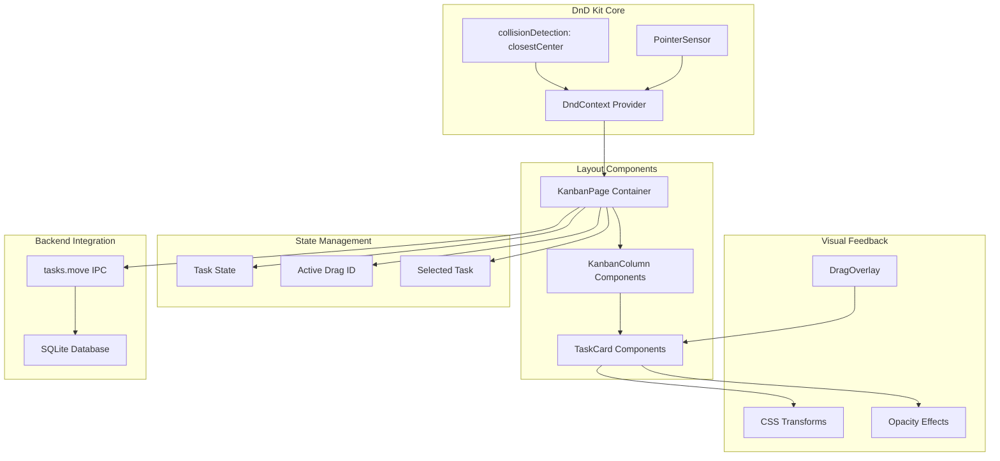

**Diagram sources**
- [KanbanPage.tsx](file://src/renderer/pages/KanbanPage.tsx#L1-L50)
- [KanbanColumn.tsx](file://src/renderer/components/KanbanColumn.tsx#L1-L20)
- [TaskCard.tsx](file://src/renderer/components/TaskCard.tsx#L1-L20)

## Core Components

### DndContext Configuration

The primary orchestrator of the drag-and-drop system is the DndContext component, which provides the foundational infrastructure for all drag operations:

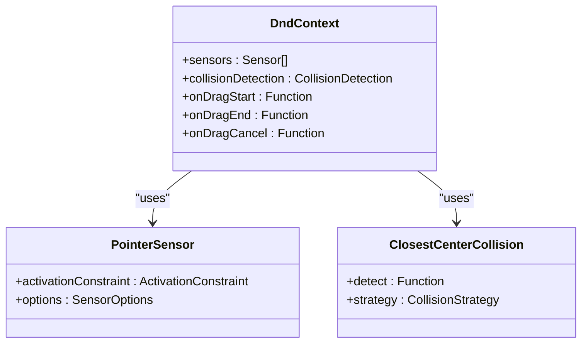

**Diagram sources**
- [KanbanPage.tsx](file://src/renderer/pages/KanbanPage.tsx#L195-L200)

### KanbanColumn Integration

Each Kanban column serves as both a droppable area and a sortable container, implementing the useDroppable and SortableContext hooks:

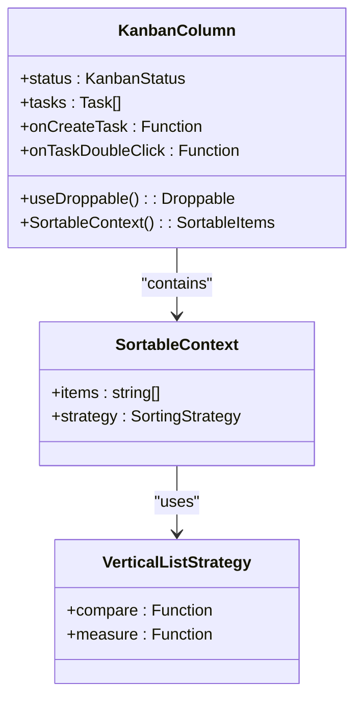

**Diagram sources**
- [KanbanColumn.tsx](file://src/renderer/components/KanbanColumn.tsx#L10-L25)

### TaskCard Implementation

Individual task cards utilize the useSortable hook to become draggable elements with sophisticated visual transformations:

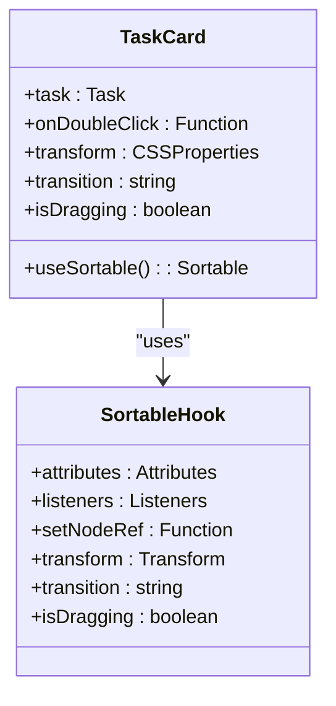

**Diagram sources**
- [TaskCard.tsx](file://src/renderer/components/TaskCard.tsx#L10-L15)

**Section sources**
- [KanbanPage.tsx](file://src/renderer/pages/KanbanPage.tsx#L195-L200)
- [KanbanColumn.tsx](file://src/renderer/components/KanbanColumn.tsx#L10-L25)
- [TaskCard.tsx](file://src/renderer/components/TaskCard.tsx#L10-L15)

## Sensor Configuration

The system employs a carefully configured PointerSensor with an activation constraint to prevent accidental drags:

### Activation Constraint Implementation

The activation constraint ensures that drag operations only begin after a minimum movement threshold is reached:

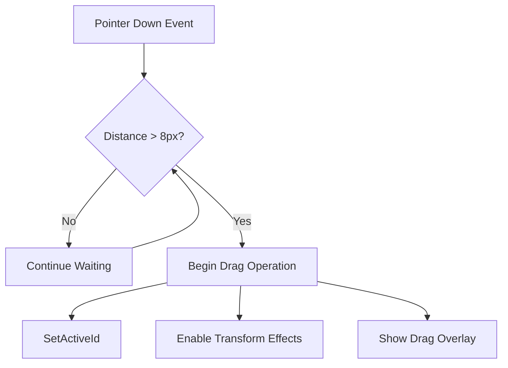

**Diagram sources**
- [KanbanPage.tsx](file://src/renderer/pages/KanbanPage.tsx#L185-L192)

### Sensor Configuration Details

The sensor configuration provides precise control over drag initiation:

| Configuration Parameter | Value | Purpose |
|------------------------|-------|---------|
| `distance` | 8px | Prevents accidental drags from quick clicks |
| `delay` | Default | No delay needed for immediate feedback |
| `tolerance` | Default | Standard tolerance for pointer movements |

**Section sources**
- [KanbanPage.tsx](file://src/renderer/pages/KanbanPage.tsx#L185-L192)

## Drag and Drop Implementation

### handleDragEnd Logic

The handleDragEnd function serves as the central orchestrator for all drag operations, implementing sophisticated logic for both intra-column reordering and inter-column movement:

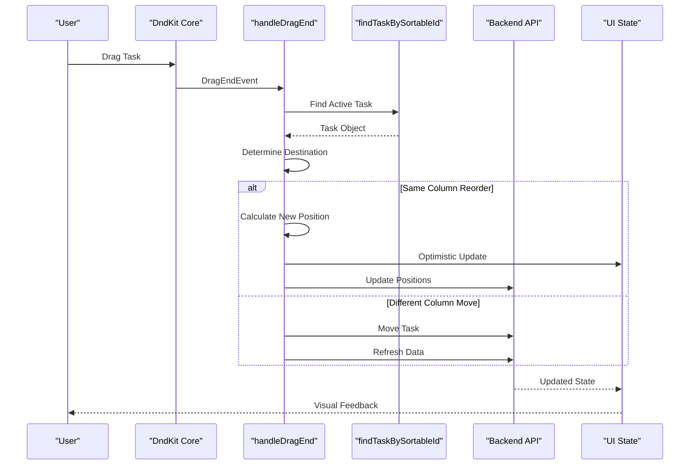

**Diagram sources**
- [KanbanPage.tsx](file://src/renderer/pages/KanbanPage.tsx#L213-L280)

### Destination Detection Logic

The system implements a comprehensive destination detection mechanism that handles various drop scenarios:

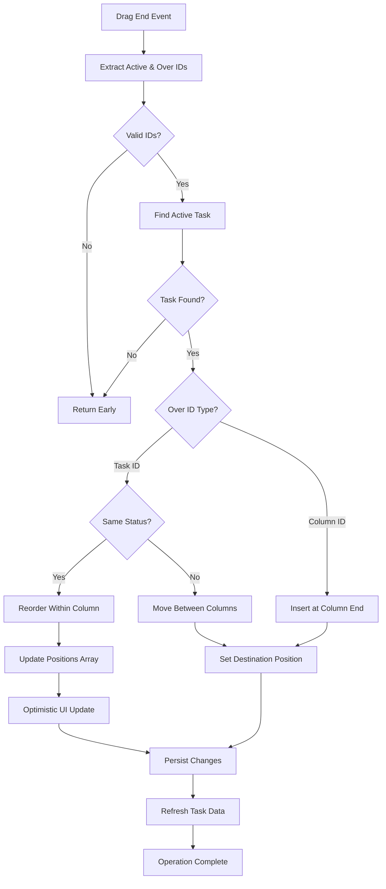

**Diagram sources**
- [KanbanPage.tsx](file://src/renderer/pages/KanbanPage.tsx#L213-L280)

**Section sources**
- [KanbanPage.tsx](file://src/renderer/pages/KanbanPage.tsx#L213-L280)

## Position Calculation and Reordering

### arrayMove Utility

The system utilizes the @dnd-kit/sortable's arrayMove utility for efficient array reordering operations:

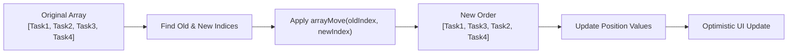

**Diagram sources**
- [KanbanPage.tsx](file://src/renderer/pages/KanbanPage.tsx#L240-L250)

### Position Synchronization

The system maintains strict position synchronization between the UI and database:

| Operation Type | Position Calculation | Persistence Strategy |
|---------------|---------------------|---------------------|
| Intra-column Reorder | `index + 1` for each task | Batch update via loop |
| Inter-column Move | `length + 1` for target column | Single update operation |
| New Task Creation | `max_position + 1` | Automatic calculation |

**Section sources**
- [KanbanPage.tsx](file://src/renderer/pages/KanbanPage.tsx#L240-L250)
- [tasksRepo.ts](file://src/database/tasksRepo.ts#L60-L80)

## Optimistic UI Updates

### Immediate Visual Feedback

The system implements optimistic updates to provide instant visual feedback during drag operations:

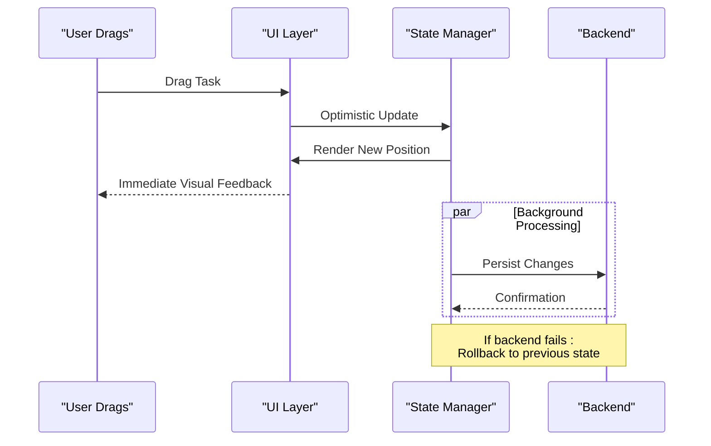

**Diagram sources**
- [KanbanPage.tsx](file://src/renderer/pages/KanbanPage.tsx#L250-L270)

### State Consistency Mechanisms

The system employs multiple strategies to ensure data consistency:

1. **Optimistic Updates**: Immediate UI changes with rollback capability
2. **Refresh After Operations**: Complete state refresh after backend operations
3. **Validation Checks**: Pre-operation validation to prevent invalid states

**Section sources**
- [KanbanPage.tsx](file://src/renderer/pages/KanbanPage.tsx#L250-L270)

## Drag Overlay and Visual Feedback

### Rotated TaskCard Rendering

The DragOverlay component renders a transformed version of the dragged TaskCard to provide visual continuity:

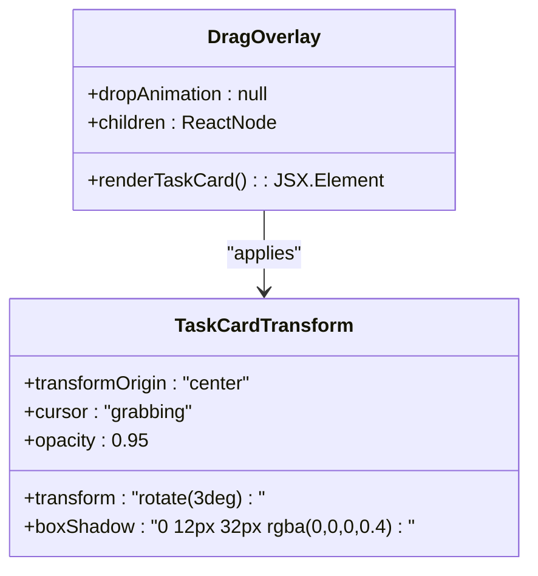

**Diagram sources**
- [KanbanPage.tsx](file://src/renderer/pages/KanbanPage.tsx#L476-L490)

### Visual Transformation Pipeline

The TaskCard undergoes a sophisticated transformation pipeline during drag operations:

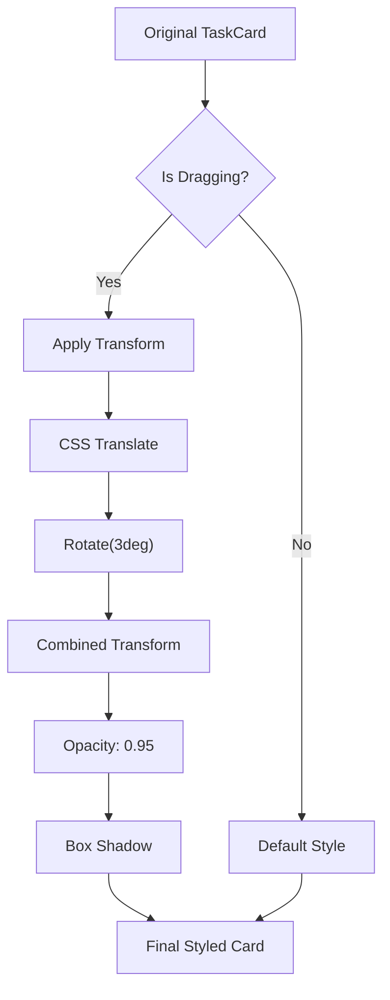

**Diagram sources**
- [TaskCard.tsx](file://src/renderer/components/TaskCard.tsx#L15-L35)

**Section sources**
- [KanbanPage.tsx](file://src/renderer/pages/KanbanPage.tsx#L476-L490)
- [TaskCard.tsx](file://src/renderer/components/TaskCard.tsx#L15-L35)

## Backend Integration

### IPC Communication

The system integrates seamlessly with the Electron IPC layer for backend communication:

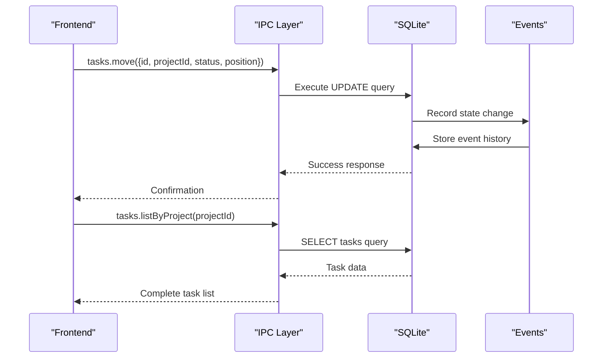

**Diagram sources**
- [tasks.ts](file://src/main/ipc/tasks.ts#L25-L35)
- [tasksRepo.ts](file://src/database/tasksRepo.ts#L190-L210)

### Database Schema Integration

The backend maintains strict adherence to the task schema with position tracking:

| Field | Type | Purpose | Constraints |
|-------|------|---------|-------------|
| `id` | INTEGER | Unique identifier | PRIMARY KEY |
| `project_id` | INTEGER | Foreign key | NOT NULL |
| `title` | TEXT | Task title | NOT NULL, MAX 200 |
| `status` | TEXT | Kanban status | NOT NULL, ENUM |
| `position` | INTEGER | Sort order | NOT NULL, AUTO_INCREMENT |
| `created_at` | DATETIME | Creation timestamp | DEFAULT CURRENT_TIMESTAMP |
| `updated_at` | DATETIME | Update timestamp | DEFAULT CURRENT_TIMESTAMP |

**Section sources**
- [tasks.ts](file://src/main/ipc/tasks.ts#L25-L35)
- [tasksRepo.ts](file://src/database/tasksRepo.ts#L190-L210)
- [types.ts](file://src/common/types.ts#L10-L25)

## Performance Optimization

### Efficient State Management

The system implements several performance optimization strategies:

1. **Memoized Calculations**: Uses React.memo and useMemo for expensive computations
2. **Batch Updates**: Groups related state updates to minimize re-renders
3. **Selective Rendering**: Only re-renders affected components during drag operations

### Memory Management

The drag-and-drop system implements careful memory management:

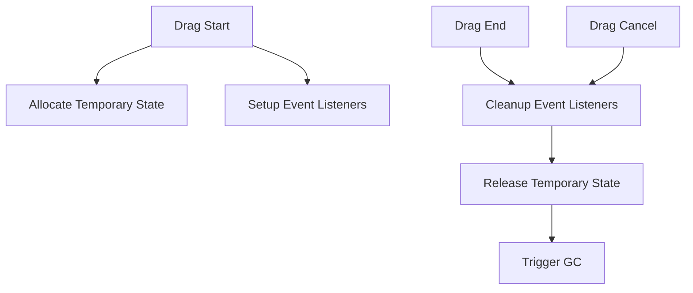

### Collision Detection Optimization

The closestCenter collision detection strategy provides optimal performance:

- **Spatial Partitioning**: Efficiently reduces collision candidates
- **Distance Thresholds**: Minimizes unnecessary calculations
- **Frame Rate Optimization**: Maintains smooth 60fps performance

## Common Issues and Solutions

### Empty Column Handling

The system gracefully handles empty columns during drag operations:

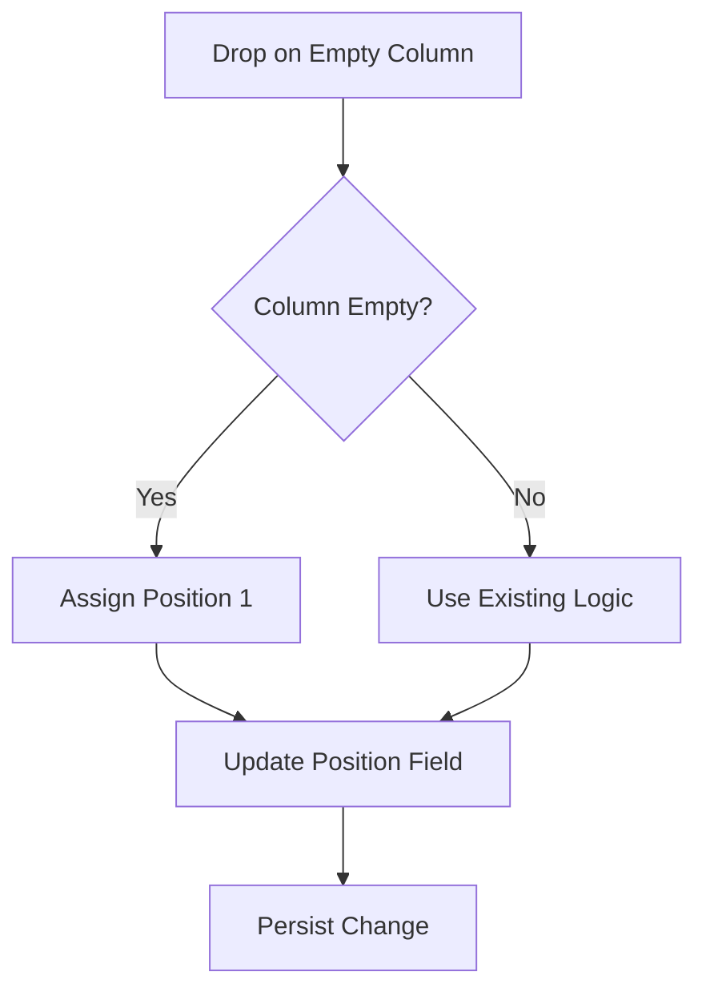

### Data Consistency Issues

Several strategies address potential data consistency problems:

1. **Validation Before Operations**: Ensures task existence and validity
2. **Rollback Mechanisms**: Reverts changes on backend failures
3. **State Synchronization**: Regular refreshes to maintain consistency

### Performance Degradation

Common performance issues and solutions:

| Issue | Cause | Solution |
|-------|-------|----------|
| Slow Drag Response | Heavy DOM manipulation | Use CSS transforms instead of layout changes |
| Stuttering Animations | Excessive re-renders | Implement memoization and selective updates |
| Memory Leaks | Unclean event listeners | Proper cleanup in useEffect cleanup functions |

## Best Practices

### Implementation Guidelines

1. **Sensor Configuration**: Always use appropriate activation constraints
2. **Error Handling**: Implement comprehensive error handling for all operations
3. **Accessibility**: Ensure keyboard navigation support
4. **Mobile Support**: Test touch interactions on mobile devices

### Code Organization

The system follows these organizational principles:

- **Separation of Concerns**: Clear boundaries between UI, state, and business logic
- **Reusable Components**: Modular design enabling component reuse
- **Type Safety**: Comprehensive TypeScript typing throughout the system

### Testing Strategies

Effective testing approaches for drag-and-drop functionality:

1. **Unit Tests**: Test individual component logic in isolation
2. **Integration Tests**: Verify component interactions
3. **End-to-End Tests**: Validate complete user workflows
4. **Performance Tests**: Monitor frame rates and responsiveness

The drag-and-drop system in LifeOS represents a sophisticated implementation of modern React patterns combined with advanced UI interaction techniques. Through careful architecture design, performance optimization, and comprehensive error handling, it provides users with a smooth and intuitive task management experience that scales effectively across different device types and usage patterns.