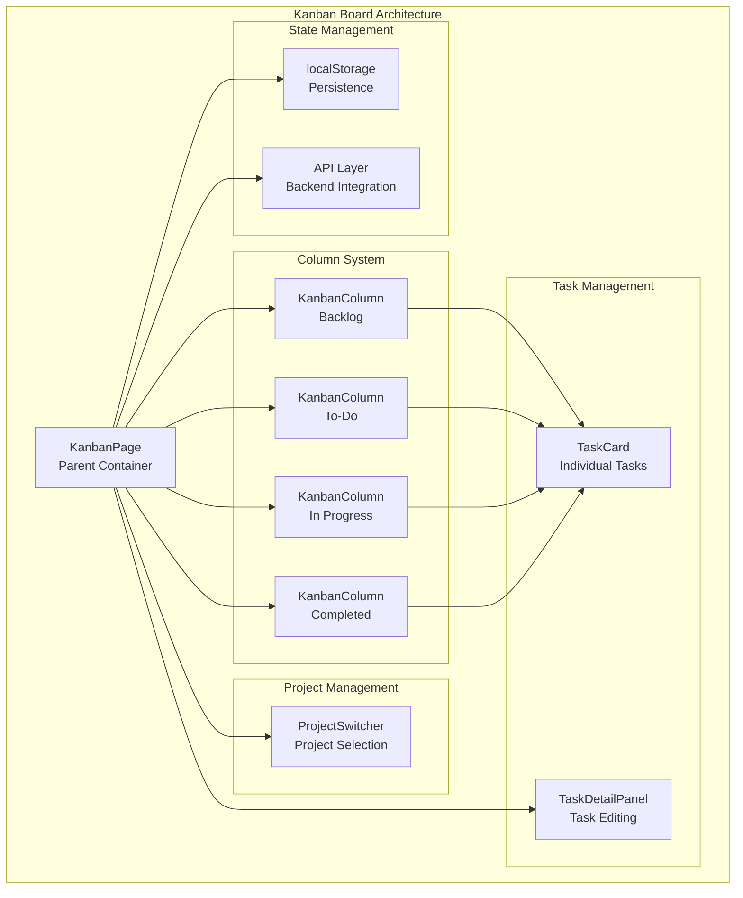
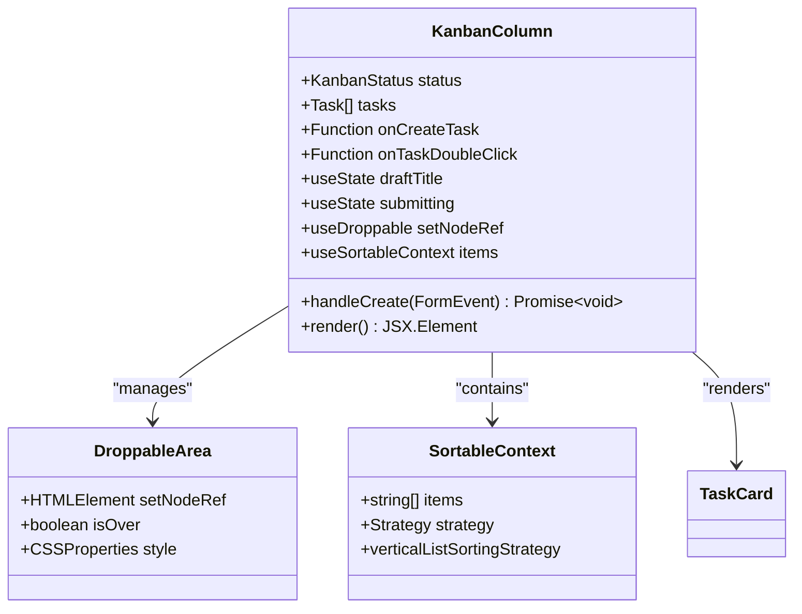
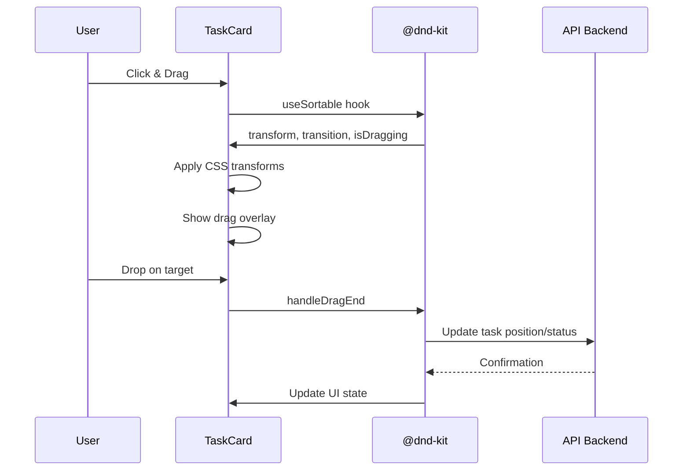
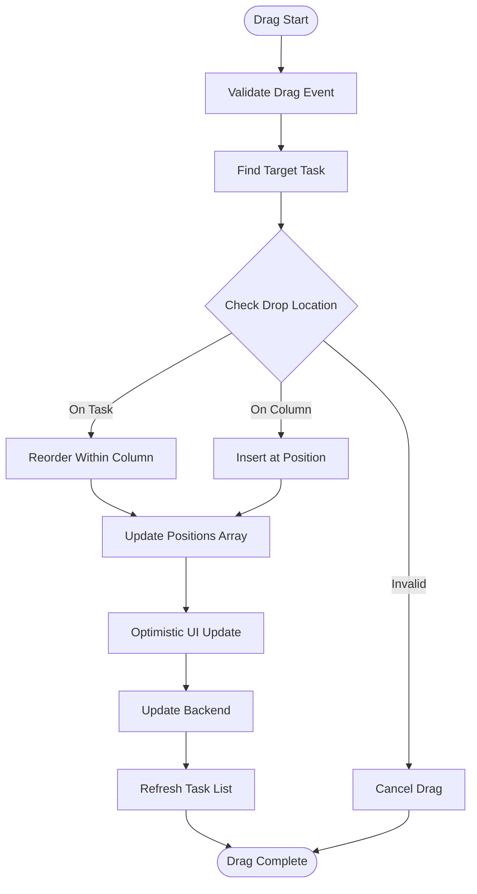
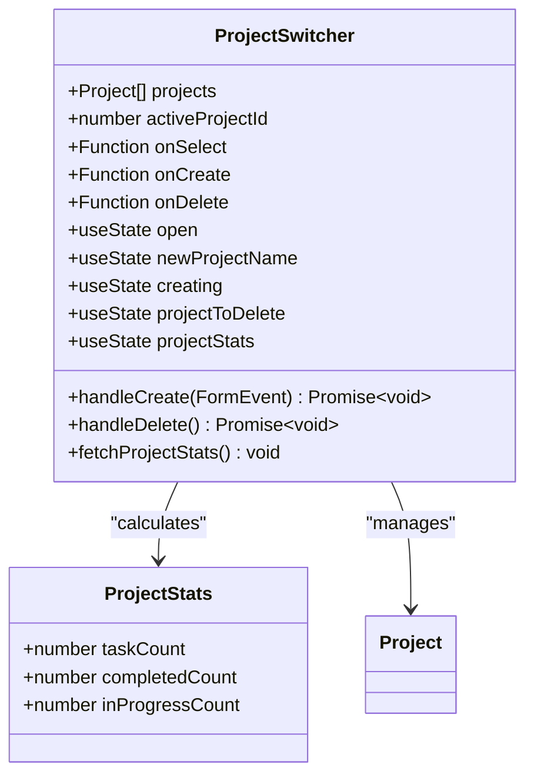
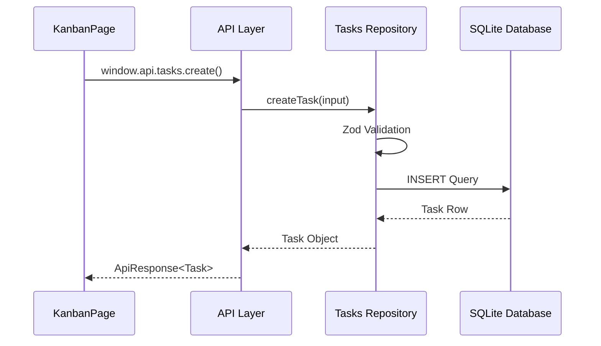

# Kanban Board Implementation

<cite>
**Referenced Files in This Document**
- [KanbanPage.tsx](file://src/renderer/pages/KanbanPage.tsx)
- [KanbanColumn.tsx](file://src/renderer/components/KanbanColumn.tsx)
- [TaskCard.tsx](file://src/renderer/components/TaskCard.tsx)
- [ProjectSwitcher.tsx](file://src/renderer/components/ProjectSwitcher.tsx)
- [TaskDetailPanel.tsx](file://src/renderer/components/TaskDetailPanel.tsx)
- [tasksRepo.ts](file://src/database/tasksRepo.ts)
- [types.ts](file://src/common/types.ts)
- [constants.ts](file://src/renderer/constants.ts)
- [App.tsx](file://src/renderer/App.tsx)
</cite>

## Table of Contents
1. [Introduction](#introduction)
2. [Component Architecture](#component-architecture)
3. [Core Components Analysis](#core-components-analysis)
4. [Drag-and-Drop Implementation](#drag-and-drop-implementation)
5. [Project Management Integration](#project-management-integration)
6. [State Management and Persistence](#state-management-and-persistence)
7. [Responsive Design and Visual Feedback](#responsive-design-and-visual-feedback)
8. [Performance Optimization](#performance-optimization)
9. [Common Issues and Solutions](#common-issues-and-solutions)
10. [Best Practices](#best-practices)

## Introduction

The Kanban Board in LifeOS is a sophisticated project management tool that provides visual task organization through a four-column workflow system. Built with React and utilizing the @dnd-kit/core library for drag-and-drop functionality, the implementation offers seamless task management with real-time collaboration capabilities and persistent state storage.

The board operates on a four-status workflow: **Backlog**, **To-Do**, **In Progress**, and **Completed**, enabling users to track task progression from initial ideas to completion. The implementation emphasizes performance, accessibility, and user experience through thoughtful design patterns and optimization techniques.

## Component Architecture

The Kanban Board follows a hierarchical component structure designed for scalability and maintainability:



**Diagram sources**
- [KanbanPage.tsx](file://src/renderer/pages/KanbanPage.tsx#L1-L520)
- [KanbanColumn.tsx](file://src/renderer/components/KanbanColumn.tsx#L1-L104)
- [TaskCard.tsx](file://src/renderer/components/TaskCard.tsx#L1-L182)

**Section sources**
- [KanbanPage.tsx](file://src/renderer/pages/KanbanPage.tsx#L1-L520)
- [KanbanColumn.tsx](file://src/renderer/components/KanbanColumn.tsx#L1-L104)
- [TaskCard.tsx](file://src/renderer/components/TaskCard.tsx#L1-L182)

## Core Components Analysis

### KanbanPage - Parent Container

The KanbanPage serves as the main orchestrator, managing global state, project integration, and drag-and-drop functionality. It implements a comprehensive state management system with optimistic updates and conflict resolution.

Key responsibilities include:
- **Project Context Management**: Integrates with ProjectSwitcher for project selection and lifecycle management
- **Task Lifecycle**: Handles task creation, updates, deletion, and restoration operations
- **Drag-and-Drop Coordination**: Manages the DndContext and coordinates between columns and cards
- **State Persistence**: Implements localStorage integration for task selection persistence
- **Settings Management**: Controls visibility filters and archived view toggles

The component maintains several critical state variables:
- `tasks`: Complete task collection with filtering and optimization
- `activeId`: Tracks currently dragged item for visual feedback
- `selectedTask`: Active task for detailed editing panel
- `hideOldCompleted`: Visibility toggle for historical completed tasks
- `showArchivedView`: Archive mode for reviewing completed tasks

**Section sources**
- [KanbanPage.tsx](file://src/renderer/pages/KanbanPage.tsx#L15-L100)

### KanbanColumn - Status Lane

Each KanbanColumn represents a workflow stage with specialized behavior for task organization and creation.



**Diagram sources**
- [KanbanColumn.tsx](file://src/renderer/components/KanbanColumn.tsx#L15-L104)

Specialized features per column:
- **Backlog Column**: Enables direct task creation with form submission
- **Other Columns**: Focus on task reordering and status transitions
- **Visual Feedback**: Dynamic background colors indicating drop targets
- **Task Counting**: Real-time task count display with status indicators

**Section sources**
- [KanbanColumn.tsx](file://src/renderer/components/KanbanColumn.tsx#L15-L104)

### TaskCard - Individual Tasks

TaskCard implements sophisticated drag-and-drop integration with visual feedback and interactive elements.



**Diagram sources**
- [TaskCard.tsx](file://src/renderer/components/TaskCard.tsx#L10-L50)
- [KanbanPage.tsx](file://src/renderer/pages/KanbanPage.tsx#L350-L450)

Advanced features include:
- **Dynamic Transformations**: Smooth CSS transformations during drag operations
- **Visual Feedback**: Opacity and visibility controls for ghost effects
- **Priority Indicators**: Color-coded badges based on Eisenhower Matrix
- **Markdown Rendering**: Rich text support with ReactMarkdown
- **Interactive Elements**: Double-click for task editing, tag display

**Section sources**
- [TaskCard.tsx](file://src/renderer/components/TaskCard.tsx#L10-L182)

## Drag-and-Drop Implementation

The drag-and-drop system utilizes @dnd-kit/core with sophisticated sensor configuration and collision detection strategies.

### Sensor Configuration

The implementation employs PointerSensor with precise activation constraints:

```typescript
const sensors = useSensors(
  useSensor(PointerSensor, {
    activationConstraint: {
      distance: 8, // Only start dragging after 8px movement
    },
  })
);
```

This configuration prevents accidental drags while maintaining intuitive touch interactions.

### Collision Detection Strategy

The system uses `closestCenter` collision detection for optimal positioning accuracy:

```typescript
<DndContext 
  sensors={sensors} 
  collisionDetection={closestCenter} 
  onDragEnd={handleDragEnd} 
  onDragStart={(e) => setActiveId(String(e.active?.id ?? null))}
/>
```

### Drag Overlay Implementation

The drag overlay provides visual continuity during drag operations:

```typescript
<DragOverlay dropAnimation={null}>
  {activeId ? (() => {
    const t = findTaskBySortableId(activeId);
    return t ? (
      <div style={{ 
        transform: 'rotate(3deg)', 
        transformOrigin: 'center',
        cursor: 'grabbing',
        opacity: 0.95,
        boxShadow: '0 12px 32px rgba(0,0,0,0.4)'
      }}>
        <TaskCard task={t} />
      </div>
    ) : null;
  })() : null}
</DragOverlay>
```

### Drag Operation Flow



**Diagram sources**
- [KanbanPage.tsx](file://src/renderer/pages/KanbanPage.tsx#L350-L450)

**Section sources**
- [KanbanPage.tsx](file://src/renderer/pages/KanbanPage.tsx#L280-L350)

## Project Management Integration

The Kanban Board integrates seamlessly with LifeOS's project management system through the ProjectSwitcher component.

### ProjectSwitcher Architecture



**Diagram sources**
- [ProjectSwitcher.tsx](file://src/renderer/components/ProjectSwitcher.tsx#L15-L326)

### Project Statistics Integration

The system automatically calculates and displays project statistics:
- **Total Task Count**: All active tasks across all statuses
- **Completed Tasks**: Tasks marked as 'Completed'
- **In Progress Tasks**: Tasks in 'In Progress' status

These statistics appear both in the project selector and within each project's Kanban view, providing immediate workflow insights.

### State Synchronization

Project selection changes trigger automatic task reloading and state persistence:

```typescript
function handleSelectProject(id: number) {
  setActiveProjectId(id);
  // Persist selection to database
  void window.api.projects.setActive(id);
}
```

**Section sources**
- [ProjectSwitcher.tsx](file://src/renderer/components/ProjectSwitcher.tsx#L15-L326)
- [App.tsx](file://src/renderer/App.tsx#L120-L140)

## State Management and Persistence

### LocalStorage Integration

The Kanban Board implements intelligent localStorage persistence for task selection:

```typescript
// Save selection to localStorage for persistence
if (activeProjectId) {
  localStorage.setItem(`kanban_selected_task_${activeProjectId}`, String(task.id));
}

// Restore selected task from localStorage
const savedTaskId = localStorage.getItem(`kanban_selected_task_${activeProjectId}`);
if (savedTaskId) {
  const taskToSelect = filteredData.find(t => t.id === parseInt(savedTaskId));
  if (taskToSelect) {
    setSelectedTask(taskToSelect);
  } else {
    // Task no longer exists, clear localStorage
    localStorage.removeItem(`kanban_selected_task_${activeProjectId}`);
  }
}
```

### Database Integration

The backend integration uses a robust repository pattern with Zod validation:



**Diagram sources**
- [tasksRepo.ts](file://src/database/tasksRepo.ts#L40-L80)
- [KanbanPage.tsx](file://src/renderer/pages/KanbanPage.tsx#L200-L250)

### Optimistic Updates

The system implements optimistic updates for improved user experience:

1. **Immediate UI Response**: Tasks are immediately moved in the UI
2. **Backend Synchronization**: Asynchronous backend updates occur
3. **Conflict Resolution**: Automatic rollback if backend fails
4. **State Refresh**: Complete task list reload ensures consistency

**Section sources**
- [KanbanPage.tsx](file://src/renderer/pages/KanbanPage.tsx#L200-L300)
- [tasksRepo.ts](file://src/database/tasksRepo.ts#L1-L211)

## Responsive Design and Visual Feedback

### Grid Layout System

The Kanban Board uses CSS Grid for responsive layout:

```css
display: 'grid', 
gridTemplateColumns: 'repeat(4, 1fr)', 
gap: '1rem', 
marginTop: '1rem'
```

This creates a flexible four-column layout that adapts to different screen sizes while maintaining visual balance.

### Visual Feedback System

Comprehensive visual feedback enhances user interaction:

#### Drag State Indicators
- **Rotation Effect**: 3-degree rotation during drag for spatial awareness
- **Shadow Effects**: Enhanced shadow during drag for depth perception
- **Opacity Transitions**: Smooth opacity changes for ghost effects
- **Cursor Changes**: Contextual cursor indicators

#### Column Interaction Feedback
- **Background Color Changes**: Subtle color shifts when dropping
- **Border Animations**: Smooth border transitions
- **Task Count Updates**: Real-time counter adjustments

#### Task Card Feedback
- **Transform Animations**: Smooth position changes during drag
- **Visibility Controls**: Ghost effect elimination during drag
- **Priority Badges**: Color-coded importance indicators

### Accessibility Features

The implementation includes several accessibility enhancements:
- **Keyboard Navigation**: Full keyboard support for all interactive elements
- **Screen Reader Support**: Proper ARIA labels and semantic markup
- **High Contrast Mode**: Theme-aware color schemes
- **Focus Indicators**: Clear focus outlines for keyboard navigation

**Section sources**
- [KanbanPage.tsx](file://src/renderer/pages/KanbanPage.tsx#L450-L500)
- [TaskCard.tsx](file://src/renderer/components/TaskCard.tsx#L20-L60)

## Performance Optimization

### Task Filtering and Memoization

The system implements efficient task filtering with React.memo:

```typescript
const filteredTasks = React.useMemo(() => {
  if (!hideOldCompleted) return tasks;
  
  const today = new Date().toISOString().split('T')[0];
  return tasks.filter(task => {
    if (task.status !== 'Completed') return true;
    // Show completed tasks from today
    return task.updatedAt?.startsWith(today);
  });
}, [tasks, hideOldCompleted]);
```

### Virtual Scrolling

Long task lists benefit from virtual scrolling principles:
- **Lazy Loading**: Tasks are rendered as needed
- **Overflow Management**: Auto-scroll containers for large lists
- **Performance Monitoring**: Efficient DOM manipulation

### Memory Management

The implementation includes several memory optimization strategies:
- **Event Listener Cleanup**: Automatic cleanup of drag event handlers
- **State Pruning**: Removal of unnecessary state data
- **Reference Optimization**: Stable references for unchanged data

### Drag Performance

Specific optimizations for drag operations:
- **Debounced Updates**: Reduced API calls during rapid movements
- **Batch Operations**: Grouped updates for better performance
- **Render Optimization**: Minimal re-renders during drag cycles

**Section sources**
- [KanbanPage.tsx](file://src/renderer/pages/KanbanPage.tsx#L30-L50)
- [KanbanPage.tsx](file://src/renderer/pages/KanbanPage.tsx#L350-L450)

## Common Issues and Solutions

### Drag Performance Issues

**Problem**: Slow drag performance with large task lists
**Solution**: Implement virtual scrolling and optimize render cycles

```typescript
// Optimize task rendering
<div style={{ 
  display: 'flex', 
  flexDirection: 'column', 
  gap: '0.75rem', 
  flex: 1, 
  overflowY: 'auto',
  overflowX: 'hidden',
  paddingRight: '0.25rem'
}}>
```

### Visual Feedback Consistency

**Problem**: Inconsistent visual feedback during drag operations
**Solution**: Standardize CSS transitions and transform origins

```typescript
// Consistent transform application
let transformString = transform ? CSS.Translate.toString(transform) : '';
if (transform && transformString) {
  transformString = `${transformString} rotate(3deg)`;
}
```

### Empty Column Handling

**Problem**: Poor UX when columns are empty
**Solution**: Implement placeholder states with guidance

```typescript
// Empty column state
{tasks.length === 0 ? (
  <div style={{ 
    textAlign: 'center', 
    padding: '3rem', 
    color: 'var(--text-tertiary)' 
  }}>
    No tasks in this column
  </div>
) : (
  tasks.map((task) => <TaskCard key={task.id} task={task} />)
)}
```

### State Synchronization Issues

**Problem**: UI desynchronization after backend updates
**Solution**: Implement comprehensive refresh mechanisms

```typescript
// Comprehensive refresh after operations
const res = await window.api.tasks.listByProject(activeProjectId);
if (res.ok && res.data) setTasks(res.data);
```

### Touch Device Compatibility

**Problem**: Poor touch interaction on mobile devices
**Solution**: Adjust sensor activation constraints and add touch optimizations

```typescript
useSensor(PointerSensor, {
  activationConstraint: {
    distance: 8, // Increased for touch devices
    delay: 100,  // Added delay for touch stability
  },
})
```

**Section sources**
- [KanbanPage.tsx](file://src/renderer/pages/KanbanPage.tsx#L450-L500)
- [TaskCard.tsx](file://src/renderer/components/TaskCard.tsx#L20-L60)

## Best Practices

### Component Organization

1. **Single Responsibility**: Each component handles one specific concern
2. **Composition Over Inheritance**: Use props and composition for flexibility
3. **Type Safety**: Leverage TypeScript for compile-time error prevention

### State Management

1. **Local State First**: Keep UI state local when possible
2. **Global State Minimization**: Use global stores sparingly
3. **Immutable Updates**: Always create new state objects

### Performance Guidelines

1. **Memoization**: Use React.memo and useMemo for expensive computations
2. **Event Delegation**: Implement efficient event handling patterns
3. **Resource Cleanup**: Always clean up resources in useEffect

### User Experience

1. **Progressive Enhancement**: Build core functionality first
2. **Accessibility**: Follow WCAG guidelines for all interactive elements
3. **Feedback Loops**: Provide immediate visual feedback for all actions

### Testing Strategies

1. **Unit Testing**: Test individual components in isolation
2. **Integration Testing**: Verify component interactions
3. **End-to-End Testing**: Test complete user workflows

The Kanban Board implementation demonstrates advanced React patterns, performance optimization techniques, and comprehensive user experience design. Its modular architecture enables easy maintenance and extension while providing a robust foundation for project management functionality.