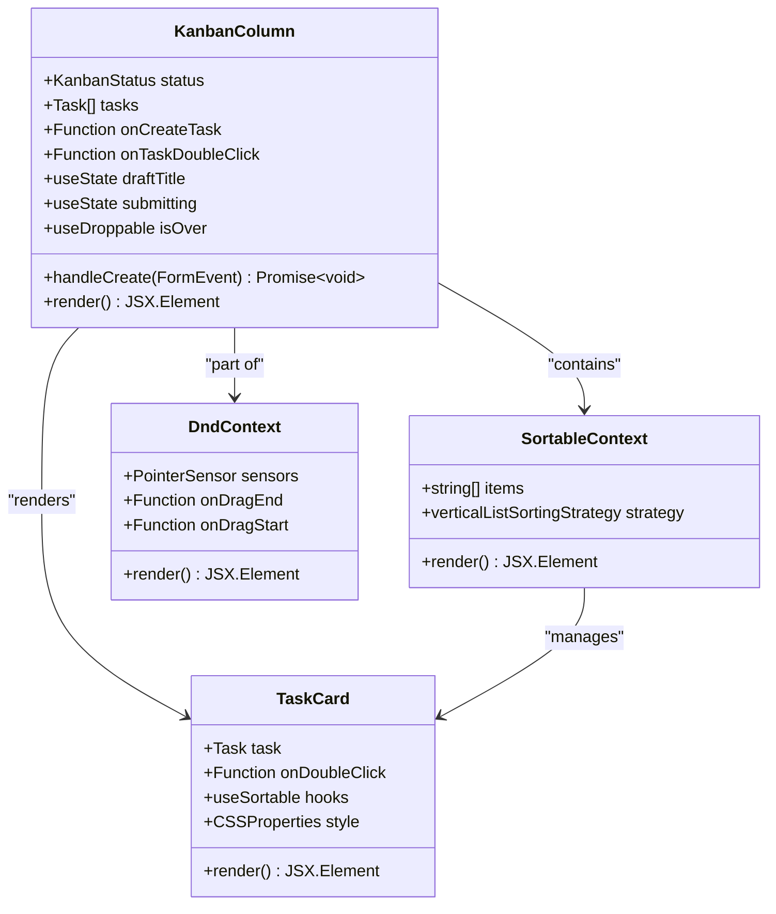
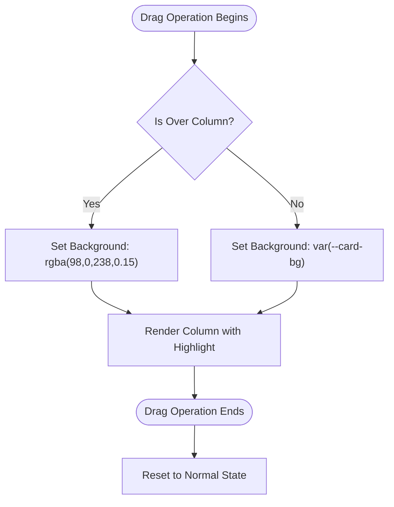
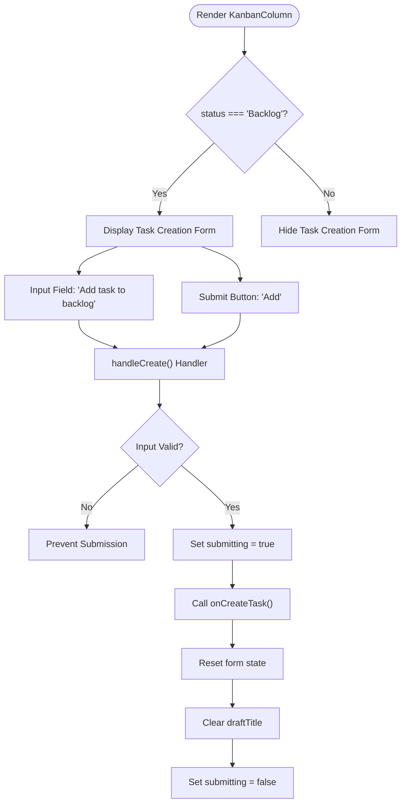
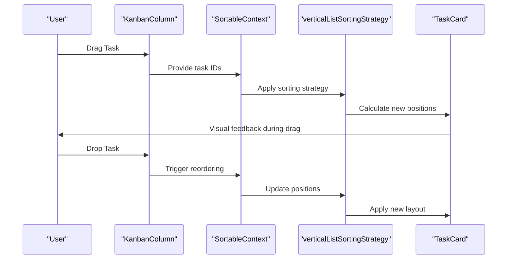

# Kanban Column Implementation

<cite>
**Referenced Files in This Document**
- [KanbanColumn.tsx](file://src/renderer/components/KanbanColumn.tsx)
- [KanbanPage.tsx](file://src/renderer/pages/KanbanPage.tsx)
- [TaskCard.tsx](file://src/renderer/components/TaskCard.tsx)
- [constants.ts](file://src/renderer/constants.ts)
- [types.ts](file://src/common/types.ts)
- [ProjectSwitcher.tsx](file://src/renderer/components/ProjectSwitcher.tsx)
</cite>

## Table of Contents
1. [Introduction](#introduction)
2. [Component Architecture](#component-architecture)
3. [Core Functionality](#core-functionality)
4. [Visual Feedback System](#visual-feedback-system)
5. [Task Creation Mechanism](#task-creation-mechanism)
6. [Integration with Sorting System](#integration-with-sorting-system)
7. [State Management](#state-management)
8. [Error Handling and Edge Cases](#error-handling-and-edge-cases)
9. [Performance Considerations](#performance-considerations)
10. [Troubleshooting Guide](#troubleshooting-guide)
11. [Best Practices](#best-practices)

## Introduction

The KanbanColumn component serves as a fundamental building block within LifeOS's Kanban board system, functioning as a status lane container that manages task display and drag-and-drop interactions. Built using React and leveraging the @dnd-kit/core library's useDroppable hook, it provides a sophisticated interface for organizing tasks across different workflow stages while maintaining visual feedback during drag operations.

Each KanbanColumn represents a distinct status in the workflow (Backlog, To-Do, In Progress, Completed) and encapsulates the logic for task management, visual feedback, and user interactions within its designated column.

## Component Architecture

The KanbanColumn component follows a modular architecture that separates concerns between presentation, state management, and external integrations:

**Diagram sources**
- [KanbanColumn.tsx](file://src/renderer/components/KanbanColumn.tsx#L1-L104)
- [TaskCard.tsx](file://src/renderer/components/TaskCard.tsx#L1-L182)

**Section sources**
- [KanbanColumn.tsx](file://src/renderer/components/KanbanColumn.tsx#L1-L104)
- [TaskCard.tsx](file://src/renderer/components/TaskCard.tsx#L1-L182)

## Core Functionality

### Status Lane Container

The KanbanColumn acts as a container for tasks belonging to a specific workflow status. It receives props that define its role within the Kanban board system:

- **status**: The workflow stage identifier (Backlog, To-Do, In Progress, Completed)
- **tasks**: Array of Task objects belonging to this status
- **onCreateTask**: Callback for creating new tasks within this column
- **onTaskDoubleClick**: Optional callback for handling task double-click events

### Task Display and Organization

Within each column, tasks are organized using the SortableContext component with verticalListSortingStrategy. This enables:

- **Vertical ordering**: Tasks are arranged vertically within the column
- **Drag-and-drop reordering**: Within-column task rearrangement
- **Cross-column movement**: Tasks can be dragged between different status columns
- **Visual feedback**: Real-time indicators during drag operations

**Section sources**
- [KanbanColumn.tsx](file://src/renderer/components/KanbanColumn.tsx#L10-L15)
- [KanbanPage.tsx](file://src/renderer/pages/KanbanPage.tsx#L476-L482)

## Visual Feedback System

### Drag Operation Highlighting

The component utilizes the isOver state from the useDroppable hook to provide immediate visual feedback during drag operations:

**Diagram sources**
- [KanbanColumn.tsx](file://src/renderer/components/KanbanColumn.tsx#L25-L30)

The visual feedback mechanism operates through conditional styling:

- **Normal state**: Uses the standard card background color
- **Hover state**: Applies a subtle purple overlay (rgba(98,0,238,0.15)) when a draggable item is over the column
- **Immediate response**: Changes occur instantly as the user moves the mouse

### Header Information Display

The column header displays essential information:

- **Status label**: Shows the column's workflow stage name
- **Task count**: Displays the number of tasks currently in the column
- **Responsive layout**: Uses flexbox for proper alignment and spacing

**Section sources**
- [KanbanColumn.tsx](file://src/renderer/components/KanbanColumn.tsx#L32-L37)

## Task Creation Mechanism

### Conditional Form Rendering

The KanbanColumn implements intelligent form rendering that appears only in the Backlog column:

**Diagram sources**
- [KanbanColumn.tsx](file://src/renderer/components/KanbanColumn.tsx#L73-L104)

### Form Submission Handler

The handleCreate function implements robust form handling with the following characteristics:

#### Input Validation
- **Empty check**: Prevents submission of empty task titles
- **Whitespace trimming**: Ensures meaningful content before submission
- **Early return**: Exits early for invalid inputs

#### State Management
- **Submitting state**: Tracks form submission progress to prevent duplicate submissions
- **Draft state**: Manages the temporary task title input
- **Error handling**: Wraps the submission process in try-finally blocks

#### Integration with Parent Component
The form delegates task creation to the parent KanbanPage component through the onCreateTask prop, ensuring centralized task management logic.

**Section sources**
- [KanbanColumn.tsx](file://src/renderer/components/KanbanColumn.tsx#L18-L30)
- [KanbanPage.tsx](file://src/renderer/pages/KanbanPage.tsx#L169-L185)

## Integration with Sorting System

### SortableContext Configuration

The KanbanColumn integrates seamlessly with the @dnd-kit/sortable system through the SortableContext component:

**Diagram sources**
- [KanbanColumn.tsx](file://src/renderer/components/KanbanColumn.tsx#L38-L42)
- [TaskCard.tsx](file://src/renderer/components/TaskCard.tsx#L12-L13)

### Vertical List Strategy

The verticalListSortingStrategy provides several benefits:

- **Natural ordering**: Tasks flow vertically in a logical sequence
- **Smooth transitions**: Position changes animate smoothly
- **Intuitive behavior**: Users expect vertical arrangement for lists
- **Performance optimization**: Efficient calculations for ordered lists

### Task Card Integration

Individual TaskCard components within the column utilize the useSortable hook for granular drag-and-drop control:

- **Unique identifiers**: Each task gets a unique ID format (`task-{taskId}`)
- **Drag handles**: Visual indicators for draggable areas
- **Visual feedback**: Cards tilt and transform during drag operations
- **Ghost effects**: Smooth animations for dragged items

**Section sources**
- [KanbanColumn.tsx](file://src/renderer/components/KanbanColumn.tsx#L38-L42)
- [TaskCard.tsx](file://src/renderer/components/TaskCard.tsx#L12-L13)

## State Management

### Local Component State

The KanbanColumn maintains two primary pieces of local state:

#### Draft Title Management
- **State variable**: `draftTitle` stores the current input value
- **Controlled input**: React-controlled form field prevents uncontrolled state issues
- **Real-time updates**: Immediate reflection of user input
- **Reset capability**: Automatic clearing after successful submission

#### Submission State Tracking
- **State variable**: `submitting` indicates active form submission
- **UI responsiveness**: Disables form controls during submission
- **Prevents duplicates**: Blocks multiple simultaneous submissions
- **Loading indication**: Provides visual feedback for long-running operations

### Prop-Based Communication

The component communicates with its parent through well-defined props:

- **onCreateTask**: Centralized task creation logic
- **onTaskDoubleClick**: Optional task detail interaction
- **status**: Workflow stage identification
- **tasks**: Current task collection for the column

**Section sources**
- [KanbanColumn.tsx](file://src/renderer/components/KanbanColumn.tsx#L16-L17)
- [KanbanColumn.tsx](file://src/renderer/components/KanbanColumn.tsx#L10-L15)

## Error Handling and Edge Cases

### Input Validation Strategies

The component implements multiple layers of input validation:

#### Early Validation
- **Empty string check**: Prevents submission of whitespace-only titles
- **Trimmed content verification**: Ensures meaningful task descriptions
- **Immediate rejection**: Stops processing before API calls

#### State Management Protection
- **Concurrent submission prevention**: The submitting state prevents multiple simultaneous requests
- **Cleanup guarantees**: Try-finally ensures state reset regardless of success or failure
- **User experience preservation**: Maintains form usability even after errors

### Integration Error Handling

While the KanbanColumn focuses on presentation and basic validation, it relies on parent component error handling for:

- **API communication failures**: Network errors and server responses
- **Task creation conflicts**: Duplicate titles or validation errors
- **State synchronization issues**: Out-of-sync task lists

### Edge Case Management

#### Empty Task Lists
- **Graceful degradation**: Columns render properly with zero tasks
- **Visual consistency**: Headers display accurate counts
- **Interaction support**: Drag operations work regardless of task count

#### Rapid User Interactions
- **Debouncing protection**: The submitting state prevents rapid successive submissions
- **UI responsiveness**: Form controls remain interactive during validation
- **State consistency**: Form resets occur reliably after submission

**Section sources**
- [KanbanColumn.tsx](file://src/renderer/components/KanbanColumn.tsx#L19-L22)
- [KanbanColumn.tsx](file://src/renderer/components/KanbanColumn.tsx#L24-L30)

## Performance Considerations

### Rendering Optimization

The KanbanColumn implements several performance optimization strategies:

#### Minimal Re-renders
- **Stable prop references**: Task arrays and callbacks maintain stable references
- **Conditional rendering**: Forms only render in the Backlog column
- **Efficient state updates**: Local state changes trigger minimal re-renders

#### Memory Management
- **Cleanup functions**: Proper cleanup of event listeners and subscriptions
- **Reference stability**: Memoized style objects prevent unnecessary recalculations
- **Resource pooling**: Reusable components minimize memory allocation

### Drag Performance

#### Smooth Animations
- **CSS transforms**: Hardware-accelerated transformations for smooth dragging
- **Optimized calculations**: Efficient coordinate calculations during drag operations
- **Frame-rate maintenance**: 60fps animations for responsive user experience

#### Large Dataset Handling
- **Virtualization potential**: While not implemented, the architecture supports virtual scrolling
- **Batch updates**: Multiple task updates are batched for efficiency
- **Selective rendering**: Only visible tasks receive full rendering treatment

### Bundle Size Impact

The component contributes to the overall bundle size through:
- **@dnd-kit dependencies**: Core and sortable packages add significant weight
- **React hooks**: Multiple hook invocations increase runtime overhead
- **CSS styling**: Inline styles and theme variables contribute to CSS size

**Section sources**
- [KanbanColumn.tsx](file://src/renderer/components/KanbanColumn.tsx#L25-L30)
- [TaskCard.tsx](file://src/renderer/components/TaskCard.tsx#L15-L32)

## Troubleshooting Guide

### Common Issues and Solutions

#### Form Submission Problems

**Issue**: Task creation fails silently
**Symptoms**: Form submits but no new task appears
**Solution**: Check parent component's onCreateTask implementation and API connectivity

**Issue**: Multiple identical tasks created
**Symptoms**: Same task title appears multiple times
**Solution**: Verify that the submitting state prevents concurrent submissions

#### Visual Feedback Issues

**Issue**: Column highlighting doesn't appear during drag
**Symptoms**: Purple overlay doesn't show when dragging over column
**Solution**: Ensure useDroppable hook is properly configured with correct status ID

**Issue**: Task cards don't show drag indicators
**Symptoms**: No visual cues when attempting to drag tasks
**Solution**: Verify useSortable hook is properly attached to TaskCard components

#### State Synchronization Problems

**Issue**: Tasks don't update after drag operations
**Symptoms**: Dragged tasks remain in old positions
**Solution**: Check that parent component properly updates task state after drag completion

**Issue**: Task counts don't reflect actual task numbers
**Symptoms**: Header shows incorrect task counts
**Solution**: Verify that filteredTasks properly excludes deleted tasks

### Debugging Strategies

#### Console Logging
- Add logging to handleCreate function to track submission flow
- Monitor useDroppable and useSortable hook states
- Track prop changes to identify unexpected behavior

#### DevTools Inspection
- Use React DevTools to inspect component state and props
- Monitor DOM structure for proper element attachment
- Check computed styles for visual feedback issues

#### Network Monitoring
- Inspect API calls for task creation and updates
- Monitor response times and error rates
- Verify payload structure matches expected API format

**Section sources**
- [KanbanColumn.tsx](file://src/renderer/components/KanbanColumn.tsx#L18-L30)
- [KanbanPage.tsx](file://src/renderer/pages/KanbanPage.tsx#L169-L185)

## Best Practices

### Implementation Guidelines

#### Form Handling
- **Always validate input** before submission to prevent API errors
- **Maintain form state** consistently to provide good user experience
- **Provide clear feedback** during asynchronous operations
- **Reset form state** completely after successful submission

#### Drag-and-Drop Integration
- **Use appropriate strategies** for different layout patterns
- **Ensure proper ID assignment** for sortable items
- **Handle edge cases** like rapid user interactions
- **Maintain visual consistency** during drag operations

#### State Management
- **Keep state minimal** to reduce re-render cycles
- **Use controlled components** for form inputs
- **Implement proper cleanup** for event listeners and subscriptions
- **Maintain referential stability** for performance optimization

### Accessibility Considerations

#### Keyboard Navigation
- Ensure drag-and-drop functionality works with keyboard inputs
- Provide focus indicators for draggable elements
- Support screen reader announcements for drag operations

#### Screen Reader Support
- Use semantic HTML for form elements
- Provide aria-labels for interactive elements
- Announce state changes during drag operations

#### Visual Accessibility
- Maintain sufficient contrast ratios for visual feedback
- Ensure colorblind-friendly indicators
- Provide alternative visual cues for drag states

### Performance Optimization

#### Rendering Efficiency
- Minimize unnecessary re-renders through proper prop comparison
- Use memoization for expensive calculations
- Implement virtual scrolling for large task lists

#### Memory Management
- Clean up event listeners and subscriptions
- Avoid memory leaks in callback functions
- Optimize image and asset loading

#### Bundle Optimization
- Tree-shake unused dnd-kit features
- Use dynamic imports for heavy dependencies
- Implement code splitting for large components

**Section sources**
- [KanbanColumn.tsx](file://src/renderer/components/KanbanColumn.tsx#L18-L30)
- [TaskCard.tsx](file://src/renderer/components/TaskCard.tsx#L15-L32)