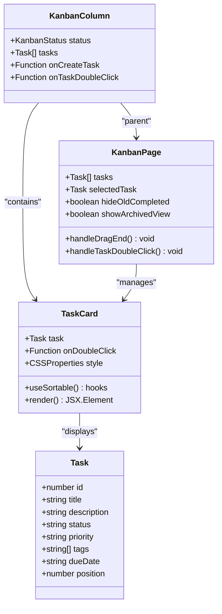
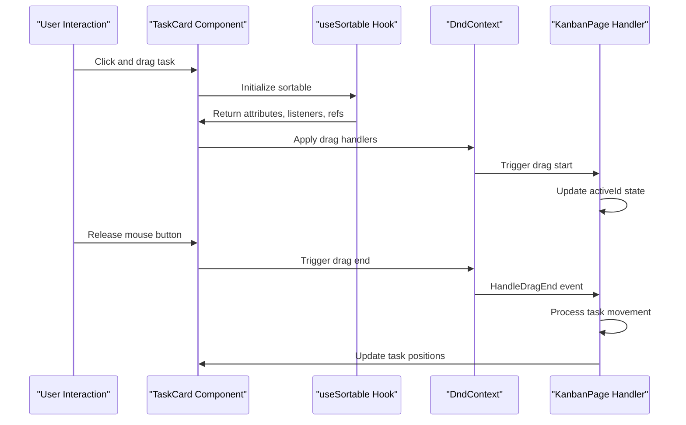
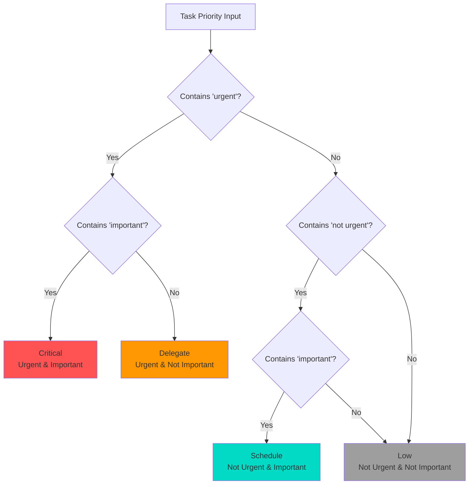
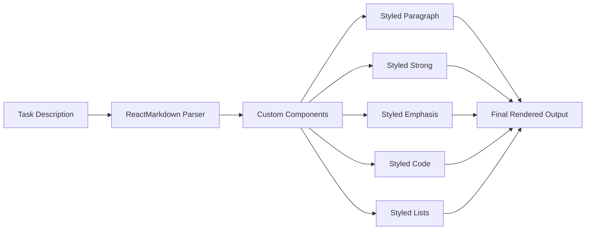
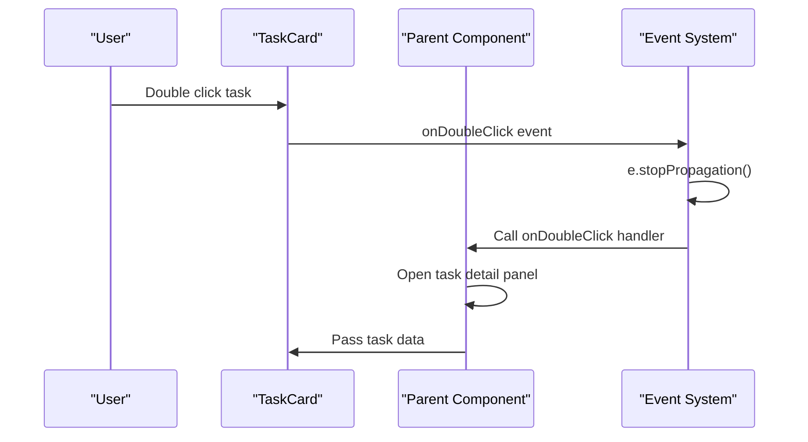
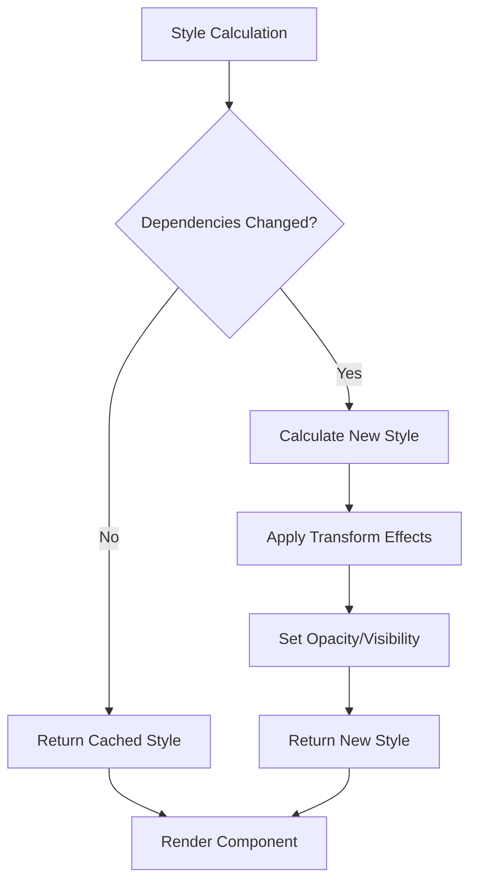
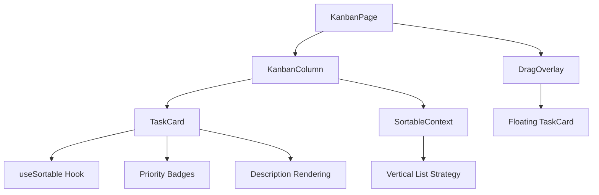

# Task Card Component

<cite>
**Referenced Files in This Document**
- [TaskCard.tsx](file://src/renderer/components/TaskCard.tsx)
- [KanbanPage.tsx](file://src/renderer/pages/KanbanPage.tsx)
- [KanbanColumn.tsx](file://src/renderer/components/KanbanColumn.tsx)
- [TaskDetailPanel.tsx](file://src/renderer/components/TaskDetailPanel.tsx)
- [types.ts](file://src/common/types.ts)
- [constants.ts](file://src/renderer/constants.ts)
</cite>

## Table of Contents
1. [Introduction](#introduction)
2. [Component Architecture](#component-architecture)
3. [Drag and Drop Implementation](#drag-and-drop-implementation)
4. [Visual Styling System](#visual-styling-system)
5. [Priority Badge System](#priority-badge-system)
6. [Rich Text Rendering](#rich-text-rendering)
7. [Event Handling](#event-handling)
8. [Performance Optimization](#performance-optimization)
9. [Integration with Kanban Board](#integration-with-kanban-board)
10. [Common Issues and Solutions](#common-issues-and-solutions)
11. [Best Practices](#best-practices)

## Introduction

The TaskCard component serves as the interactive representation of individual tasks within LifeOS's Kanban board system. Built using React and leveraging the @dnd-kit/core library's useSortable hook, it provides seamless drag-and-drop functionality while maintaining a clean, modern aesthetic with dynamic visual feedback.

As the cornerstone of the Kanban interface, TaskCard combines functionality with visual appeal, offering users an intuitive way to manage their tasks through spatial manipulation and rich visual indicators. The component handles everything from basic task display to complex drag-and-drop interactions, making it a critical component in LifeOS's productivity workflow.

## Component Architecture

The TaskCard component follows a functional React architecture with TypeScript for type safety and maintainability. Its design emphasizes separation of concerns and reusability across the application.

**Diagram sources**
- [TaskCard.tsx](file://src/renderer/components/TaskCard.tsx#L7-L12)
- [KanbanColumn.tsx](file://src/renderer/components/KanbanColumn.tsx#L8-L14)
- [KanbanPage.tsx](file://src/renderer/pages/KanbanPage.tsx#L15-L23)
- [types.ts](file://src/common/types.ts#L8-L22)

**Section sources**
- [TaskCard.tsx](file://src/renderer/components/TaskCard.tsx#L1-L182)
- [types.ts](file://src/common/types.ts#L8-L22)

## Drag and Drop Implementation

The TaskCard component utilizes @dnd-kit/core's useSortable hook to provide sophisticated drag-and-drop functionality. This implementation ensures smooth, responsive task movement across the Kanban board while preventing visual artifacts and ghost elements.

### useSortable Hook Integration

The useSortable hook provides essential drag-and-drop capabilities:

**Diagram sources**
- [TaskCard.tsx](file://src/renderer/components/TaskCard.tsx#L11-L13)
- [KanbanPage.tsx](file://src/renderer/pages/KanbanPage.tsx#L200-L246)

### Transform and Rotation Effects

During dragging, the component applies sophisticated visual transformations to enhance user experience:

- **Transform Application**: Uses CSS.Translate.toString() to convert transform objects to string format
- **Rotation Effect**: Adds a subtle 3-degree rotation when actual movement occurs
- **Ghost Prevention**: Implements opacity and visibility controls to eliminate ghost elements
- **Smooth Transitions**: Applies CSS transitions for fluid movement animations

### Ghost Element Prevention

The component employs a dual-layer approach to prevent ghost element appearance:

1. **Opacity Control**: Sets opacity to 0 when dragging begins
2. **Visibility Management**: Changes visibility to 'hidden' to remove from layout
3. **Conditional Styling**: Only applies transforms when actual movement occurs

**Section sources**
- [TaskCard.tsx](file://src/renderer/components/TaskCard.tsx#L11-L35)
- [KanbanPage.tsx](file://src/renderer/pages/KanbanPage.tsx#L200-L246)

## Visual Styling System

The TaskCard component implements a comprehensive visual styling system that adapts to different task states and provides consistent visual feedback across the application.

### Core Styling Properties

The component defines a rich set of CSS properties for consistent appearance:

| Property | Value | Purpose |
|----------|-------|---------|
| `background` | `var(--card-bg)` | Dynamic theme-based background |
| `borderRadius` | `12px` | Rounded corners for modern aesthetic |
| `padding` | `0.75rem 1rem` | Consistent internal spacing |
| `boxShadow` | `0 4px 12px rgba(0,0,0,0.15)` | Subtle depth effect |
| `border` | `2px solid var(--card-border)` | Theme-consistent border |
| `cursor` | `grab` | Indicates draggable state |

### Hover and Interactive States

The component provides visual feedback for different interaction states:

- **Default State**: Standard styling with theme variables
- **Hover State**: Enhanced visual cues through shadow and border changes
- **Dragging State**: Transform effects with rotation and opacity adjustments
- **Selected State**: Clear indication of active task selection

### Responsive Layout Design

The TaskCard implements responsive design principles:

- **Flexible Layout**: Uses flexbox for adaptive content arrangement
- **Truncated Descriptions**: Implements WebkitLineClamp for consistent text overflow
- **Dynamic Sizing**: Adjusts padding and margins based on content density
- **Mobile-Friendly**: Ensures touch-friendly interaction areas

**Section sources**
- [TaskCard.tsx](file://src/renderer/components/TaskCard.tsx#L25-L35)

## Priority Badge System

The TaskCard component features a sophisticated priority badge system that visually communicates task importance using the Eisenhower Matrix framework.

### Priority Classification System

The component implements a four-tier priority system based on urgency and importance:

**Diagram sources**
- [TaskCard.tsx](file://src/renderer/components/TaskCard.tsx#L132-L180)

### Dynamic Color Coding

The priority system provides dynamic color coding through three functions:

| Function | Purpose | Output |
|----------|---------|--------|
| `getPriorityLabel()` | Converts priority string to readable label | "Critical", "Delegate", "Schedule", "Low" |
| `getPriorityColor()` | Returns text color for priority badge | Hex color codes |
| `getPriorityBgColor()` | Returns background color for priority badge | RGBA color values |

### Badge Styling Implementation

Priority badges utilize a consistent styling pattern:

- **Background**: Semi-transparent color with 15% opacity
- **Text Color**: High contrast color based on priority level
- **Typography**: Bold 0.65rem font with 700 weight
- **Spacing**: 0.25rem padding with 0.5rem horizontal spacing
- **Shape**: 999px border radius for pill-shaped appearance

**Section sources**
- [TaskCard.tsx](file://src/renderer/components/TaskCard.tsx#L132-L180)

## Rich Text Rendering

The TaskCard component integrates ReactMarkdown for sophisticated text rendering capabilities, enabling rich formatting within task descriptions while maintaining accessibility and performance.

### Markdown Component Integration

The component uses ReactMarkdown with custom component styling:

**Diagram sources**
- [TaskCard.tsx](file://src/renderer/components/TaskCard.tsx#L75-L96)

### Custom Component Styling

Each markdown element receives specialized styling:

| Element | Style Properties | Purpose |
|---------|------------------|---------|
| `p` | Inline display, zero margin | Prevents paragraph spacing |
| `strong` | Varied text color, 600 weight | Emphasizes important text |
| `em` | Secondary text color | Provides emphasis variation |
| `code` | Monospace font, light background, rounded corners | Highlights code snippets |
| `ul/li` | Inline display, bullet point | Maintains list formatting |

### Responsive Text Truncation

The component implements sophisticated text truncation:

- **WebkitLineClamp**: Limits description to 3 lines
- **WebkitBoxOrient**: Vertical box orientation for line clamping
- **Overflow Handling**: Hidden overflow with ellipsis
- **Line Height**: 1.4 for optimal readability

### Accessibility Considerations

Rich text rendering maintains accessibility standards:

- **User Select**: Enabled for text selection
- **Cursor Styles**: Text cursor for editable content
- **Semantic Markup**: Proper HTML element usage
- **Color Contrast**: Maintained contrast ratios

**Section sources**
- [TaskCard.tsx](file://src/renderer/components/TaskCard.tsx#L75-L96)

## Event Handling

The TaskCard component implements comprehensive event handling to support user interactions while maintaining performance and preventing unintended side effects.

### Double-Click Event System

The component provides task detail access through double-click functionality:

**Diagram sources**
- [TaskCard.tsx](file://src/renderer/components/TaskCard.tsx#L37-L42)
- [KanbanPage.tsx](file://src/renderer/pages/KanbanPage.tsx#L65-L70)

### Event Propagation Prevention

The component implements crucial event propagation prevention:

- **Stop Propagation**: Prevents double-click events from bubbling up
- **Parent Handler**: Allows parent components to handle clicks appropriately
- **Consistent Behavior**: Ensures predictable interaction patterns

### Click Event Management

The component manages various click scenarios:

- **Task Selection**: Single click for selection state
- **Double-Click**: Opens task detail panel
- **Drag Activation**: Prevents accidental drag initiation
- **Button Interactions**: Handles embedded button clicks

**Section sources**
- [TaskCard.tsx](file://src/renderer/components/TaskCard.tsx#L37-L42)
- [KanbanPage.tsx](file://src/renderer/pages/KanbanPage.tsx#L65-L70)

## Performance Optimization

The TaskCard component incorporates several performance optimization strategies to ensure smooth operation even with large task datasets.

### useMemo for Style Optimization

The component uses React's useMemo hook for efficient style object generation:

**Diagram sources**
- [TaskCard.tsx](file://src/renderer/components/TaskCard.tsx#L15-L35)

### Dependency Tracking

The useMemo hook tracks specific dependencies:

- **Transform**: Only recalculates when transform values change
- **Transition**: Updates when transition properties change
- **IsDragging**: Recalculates when drag state changes

### Memory Efficiency

Performance optimizations include:

- **Cached Calculations**: Prevents unnecessary style recalculation
- **Conditional Rendering**: Only renders priority badges when present
- **Efficient Props**: Minimal prop passing reduces overhead
- **Stable References**: Consistent DOM references for better reconciliation

### Rendering Performance

The component optimizes rendering through:

- **Pure Components**: Leverages React's memoization
- **Minimal Re-renders**: Only updates when necessary props change
- **Efficient State Management**: Local state minimizes re-renders
- **Batch Operations**: Groups related updates together

**Section sources**
- [TaskCard.tsx](file://src/renderer/components/TaskCard.tsx#L15-L35)

## Integration with Kanban Board

The TaskCard component seamlessly integrates with the broader Kanban board system, participating in drag-and-drop operations and maintaining consistency across the interface.

### Kanban Column Integration

TaskCard works within KanbanColumn components to provide organized task display:

**Diagram sources**
- [KanbanPage.tsx](file://src/renderer/pages/KanbanPage.tsx#L470-L478)
- [KanbanColumn.tsx](file://src/renderer/components/KanbanColumn.tsx#L45-L50)

### Status-Based Organization

The component participates in status-based task organization:

- **Backlog Column**: Contains unstarted tasks
- **To-Do Column**: Pending tasks ready for work
- **In Progress Column**: Active tasks being worked on
- **Completed Column**: Finished tasks

### Task Movement Coordination

The component coordinates with parent components for task movement:

- **Drag Events**: Communicates with KanbanPage for movement handling
- **Position Updates**: Receives updated positions from parent
- **Status Changes**: Handles status transitions gracefully
- **Validation**: Ensures valid task movements

### State Synchronization

TaskCard maintains synchronization with the broader application state:

- **Local State**: Manages immediate visual state
- **Parent State**: Coordinates with KanbanPage for global state
- **Storage**: Persists selections to localStorage
- **Real-time Updates**: Responds to external state changes

**Section sources**
- [KanbanPage.tsx](file://src/renderer/pages/KanbanPage.tsx#L470-L478)
- [KanbanColumn.tsx](file://src/renderer/components/KanbanColumn.tsx#L45-L50)

## Common Issues and Solutions

The TaskCard component addresses several common issues that arise in drag-and-drop interfaces and task management systems.

### Click Event Propagation Issues

**Problem**: Double-click events triggering unwanted parent actions
**Solution**: Implemented e.stopPropagation() to prevent event bubbling

### Ghost Element Appearance

**Problem**: Original task card remains visible during drag operations
**Solution**: Applied opacity: 0 and visibility: 'hidden' during dragging

### Performance Degradation

**Problem**: Slow rendering with large task lists
**Solution**: Used useMemo for style calculations and optimized render cycles

### Inconsistent Visual Feedback

**Problem**: Unclear visual indicators for different task states
**Solution**: Implemented comprehensive styling system with theme variables

### Priority Badge Confusion

**Problem**: Users confused by priority classification system
**Solution**: Added descriptive labels and clear visual indicators

### Text Overflow Issues

**Problem**: Long descriptions causing layout problems
**Solution**: Implemented WebkitLineClamp with responsive truncation

### Drag Activation Sensitivity

**Problem**: Accidental drag initiation on mobile devices
**Solution**: Configured PointerSensor with distance constraint of 8px

**Section sources**
- [TaskCard.tsx](file://src/renderer/components/TaskCard.tsx#L37-L42)
- [KanbanPage.tsx](file://src/renderer/pages/KanbanPage.tsx#L185-L195)

## Best Practices

The TaskCard component demonstrates several best practices for React component development, particularly in the context of drag-and-drop interfaces and task management systems.

### Component Design Principles

1. **Single Responsibility**: Focuses solely on displaying and interacting with individual tasks
2. **Type Safety**: Comprehensive TypeScript implementation with strict typing
3. **Accessibility**: Maintains keyboard navigation and screen reader compatibility
4. **Performance**: Implements optimization strategies for smooth operation
5. **Maintainability**: Clean code structure with clear separation of concerns

### Drag-and-Drop Implementation

1. **Hook Usage**: Proper implementation of useSortable for consistent behavior
2. **State Management**: Minimal state management with external coordination
3. **Event Handling**: Comprehensive event management with proper propagation control
4. **Visual Feedback**: Clear visual indicators for different interaction states
5. **Error Handling**: Graceful degradation and error recovery mechanisms

### Styling and Theming

1. **CSS Variables**: Extensive use of CSS custom properties for theme flexibility
2. **Responsive Design**: Adaptive layouts that work across different screen sizes
3. **Performance**: Efficient styling with minimal reflows and repaints
4. **Consistency**: Uniform styling across all task states and interactions
5. **Accessibility**: High contrast ratios and semantic markup

### Integration Patterns

1. **Parent-Child Communication**: Clear communication channels with parent components
2. **Event Propagation**: Proper event handling with minimal side effects
3. **State Synchronization**: Coordinated state management across component hierarchy
4. **Performance Monitoring**: Regular performance reviews and optimizations
5. **Testing Strategy**: Comprehensive testing approaches for complex interactions

### Code Quality Standards

1. **TypeScript Usage**: Complete type definitions for all interfaces and props
2. **Code Organization**: Logical file structure with clear module boundaries
3. **Documentation**: Comprehensive comments and documentation for complex logic
4. **Error Handling**: Robust error handling with user-friendly messaging
5. **Testing Coverage**: Adequate test coverage for critical functionality

These best practices ensure that the TaskCard component remains maintainable, performant, and user-friendly while serving as a foundation for the broader Kanban board system in LifeOS.