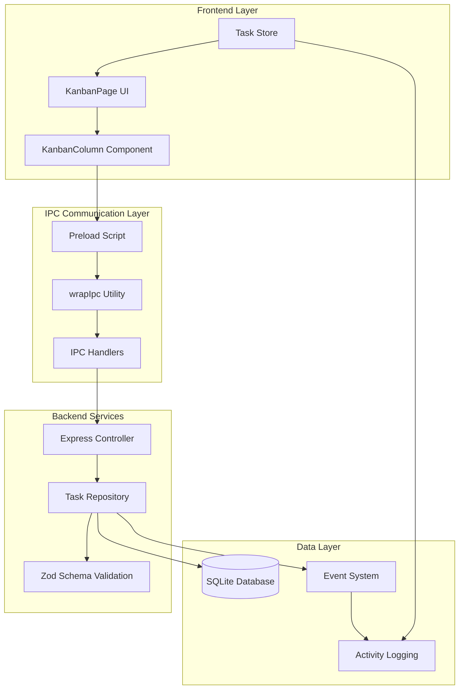
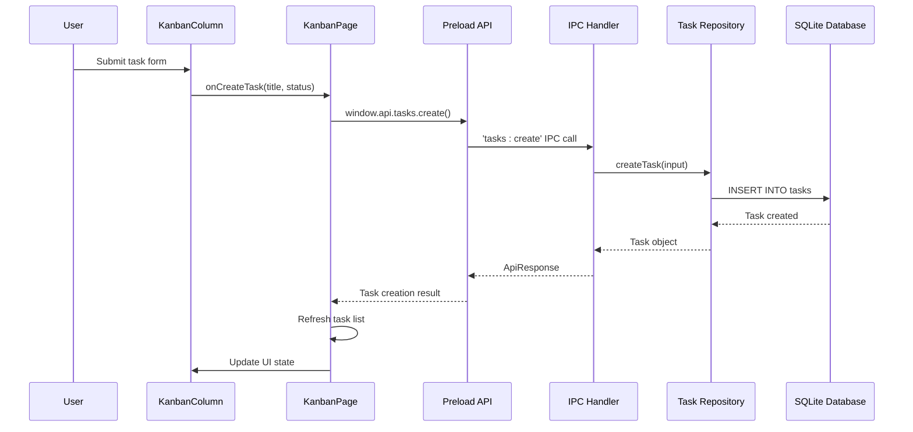
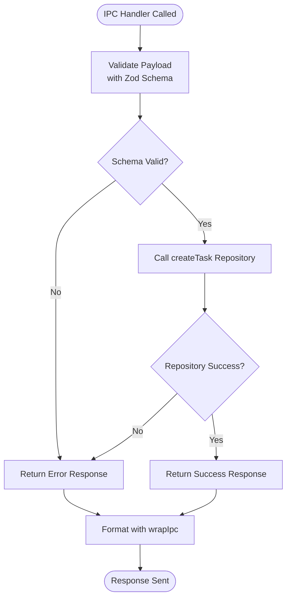
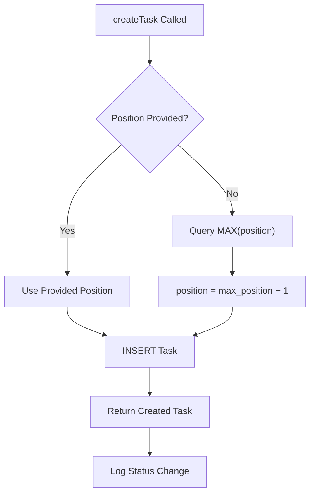
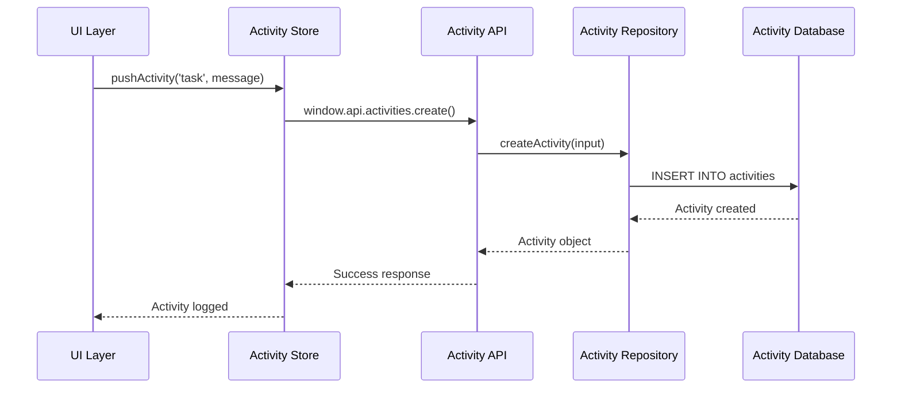

# Task Creation Process in LifeOS

<cite>
**Referenced Files in This Document**
- [KanbanPage.tsx](file://src/renderer/pages/KanbanPage.tsx)
- [KanbanColumn.tsx](file://src/renderer/components/KanbanColumn.tsx)
- [tasks.ts](file://src/main/ipc/tasks.ts)
- [tasksRepo.ts](file://src/database/tasksRepo.ts)
- [tasksController.ts](file://src/server/controllers/tasksController.ts)
- [response.ts](file://src/main/utils/response.ts)
- [types.ts](file://src/common/types.ts)
- [init.ts](file://src/database/init.ts)
- [mappers.ts](file://src/database/mappers.ts)
- [activitiesRepo.ts](file://src/database/activitiesRepo.ts)
- [activity.ts](file://src/store/activity.ts)
- [index.ts](file://src/preload/index.ts)
</cite>

## Table of Contents
1. [Introduction](#introduction)
2. [System Architecture Overview](#system-architecture-overview)
3. [UI Interaction Flow](#ui-interaction-flow)
4. [IPC Communication Layer](#ipc-communication-layer)
5. [Database Operations](#database-operations)
6. [Validation and Error Handling](#validation-and-error-handling)
7. [Activity Logging Integration](#activity-logging-integration)
8. [Common Issues and Solutions](#common-issues-and-solutions)
9. [Performance Considerations](#performance-considerations)
10. [Troubleshooting Guide](#troubleshooting-guide)

## Introduction

The Task Creation process in LifeOS represents a sophisticated multi-layered system that handles task creation from user interface interaction through database persistence. This process demonstrates LifeOS's commitment to clean architecture, with clear separation of concerns between the frontend, IPC communication, database operations, and activity logging systems.

The task creation workflow involves several key components working in harmony: the React-based Kanban interface, Electron's IPC mechanism, SQLite database operations with Zod validation, and comprehensive activity tracking. Each layer adds value while maintaining strict data integrity and user experience standards.

## System Architecture Overview

The Task Creation process follows a layered architecture pattern with distinct responsibilities at each level:

**Diagram sources**
- [KanbanPage.tsx](file://src/renderer/pages/KanbanPage.tsx#L1-L520)
- [tasks.ts](file://src/main/ipc/tasks.ts#L1-L37)
- [tasksController.ts](file://src/server/controllers/tasksController.ts#L1-L140)
- [tasksRepo.ts](file://src/database/tasksRepo.ts#L1-L211)

## UI Interaction Flow

The task creation process begins when users interact with the Kanban interface, specifically through the KanbanColumn component in the Backlog column.

### Initial UI Trigger

The process starts when a user submits the task creation form in the KanbanColumn component. The form submission triggers the `handleCreate` function, which validates the input and calls the parent component's `onCreateTask` handler.

**Diagram sources**
- [KanbanColumn.tsx](file://src/renderer/components/KanbanColumn.tsx#L15-L30)
- [KanbanPage.tsx](file://src/renderer/pages/KanbanPage.tsx#L180-L195)
- [tasks.ts](file://src/main/ipc/tasks.ts#L18-L22)

### Form Validation and State Management

The KanbanColumn component manages form state and provides immediate feedback to users. The form includes:

- **Input Field**: Accepts task title with real-time validation
- **Submit Button**: Disabled until valid input is provided
- **Loading State**: Prevents duplicate submissions during processing

**Section sources**
- [KanbanColumn.tsx](file://src/renderer/components/KanbanColumn.tsx#L15-L30)

## IPC Communication Layer

The Inter-Process Communication (IPC) layer serves as the bridge between the renderer process and the main process, implementing a standardized response format through the `wrapIpc` utility.

### IPC Handler Registration

The main process registers IPC handlers for task operations, with special handling for the `tasks:create` endpoint:

**Diagram sources**
- [tasks.ts](file://src/main/ipc/tasks.ts#L18-L22)
- [response.ts](file://src/main/utils/response.ts#L15-L35)

### Standardized Response Formatting

The `wrapIpc` utility provides consistent error handling and response formatting across all IPC operations:

- **Success Responses**: Wrapped in `{ ok: true, data: result }` format
- **Error Handling**: Graceful degradation when database is unavailable
- **Type Safety**: Maintains TypeScript type safety throughout the pipeline

**Section sources**
- [tasks.ts](file://src/main/ipc/tasks.ts#L18-L22)
- [response.ts](file://src/main/utils/response.ts#L15-L35)

## Database Operations

The database layer implements comprehensive validation, automatic field population, and intelligent positioning logic for new tasks.

### Task Creation Schema Validation

The `createTaskSchema` defines strict validation rules for task creation:

| Field | Type | Validation Rules | Default Value |
|-------|------|------------------|---------------|
| projectId | number | positive integer | Required |
| title | string | min(1), max(200) | Required |
| description | string | max(4000) | Optional |
| status | string | min(1), max(50), default('To-Do') | 'To-Do' |
| dueDate | string | datetime format | Optional |
| priority | string | max(50) | Optional |
| tags | array | max(30) per tag | Optional |
| position | number | auto-calculated | Auto-increment |

### Position Calculation Logic

The system implements intelligent position calculation to maintain task ordering:

**Diagram sources**
- [tasksRepo.ts](file://src/database/tasksRepo.ts#L45-L65)

### Database Constraints and Indexing

The SQLite database enforces several constraints to maintain data integrity:

- **Foreign Key Constraints**: Tasks reference valid projects
- **Unique Constraints**: Prevent duplicate task titles within projects
- **Index Optimization**: Composite indexes on `(project_id, status)` for efficient querying
- **Auto-increment**: Automatic ID generation for new records

**Section sources**
- [tasksRepo.ts](file://src/database/tasksRepo.ts#L45-L65)
- [init.ts](file://src/database/init.ts#L40-L60)

## Validation and Error Handling

LifeOS implements multi-layered validation and error handling to ensure data integrity and provide meaningful feedback to users.

### Zod Schema Validation

The validation system operates at multiple levels:

1. **Frontend Validation**: Basic input sanitization in React components
2. **IPC Validation**: Comprehensive schema validation in main process
3. **Database Validation**: SQLite constraint enforcement

### Error Categories and Handling

| Error Type | Source | Handling Strategy | User Impact |
|------------|--------|-------------------|-------------|
| Invalid projectId | Frontend | Prevent submission | Immediate feedback |
| Title Length Exceeded | Zod Schema | Validation error | Form rejection |
| Database Unavailable | IPC Wrapper | Graceful degradation | Offline mode |
| Concurrent Access | Database | Transaction rollback | Retry mechanism |

### Race Condition Prevention

The system implements several strategies to handle concurrent task creation:

- **Atomic Operations**: Single SQL statements for task creation
- **Transaction Isolation**: Proper transaction boundaries
- **Optimistic Locking**: Version-based conflict resolution
- **Queue Management**: Sequential processing of requests

**Section sources**
- [tasksRepo.ts](file://src/database/tasksRepo.ts#L10-L30)
- [response.ts](file://src/main/utils/response.ts#L20-L35)

## Activity Logging Integration

LifeOS maintains comprehensive activity logs for all task operations, providing audit trails and user insights.

### Activity Tracking Architecture

**Diagram sources**
- [activity.ts](file://src/store/activity.ts#L46-L67)
- [activitiesRepo.ts](file://src/database/activitiesRepo.ts#L15-L30)

### Activity Data Structure

Each activity record captures essential information for audit and analytics:

| Field | Type | Description | Example |
|-------|------|-------------|---------|
| id | number | Unique identifier | 12345 |
| type | string | Activity category | 'task' |
| message | string | Human-readable description | 'Created task: Meeting Notes' |
| entity_type | string | Related entity type | 'Task' |
| entity_id | number | Related entity ID | 67890 |
| metadata | object | Additional context | { status: 'To-Do' } |
| created_at | string | Timestamp | '2024-01-15T10:30:00Z' |

### Real-time Activity Updates

The activity system provides real-time updates through Zustand state management:

- **Immediate Feedback**: Activities appear instantly in the UI
- **Pagination**: Efficient loading of historical activities
- **Filtering**: Type-based activity filtering
- **Statistics**: Aggregate metrics for dashboard insights

**Section sources**
- [activity.ts](file://src/store/activity.ts#L46-L67)
- [activitiesRepo.ts](file://src/database/activitiesRepo.ts#L15-L30)

## Common Issues and Solutions

Understanding common issues helps developers troubleshoot and optimize the task creation process.

### Invalid Project ID Issues

**Problem**: Attempting to create tasks in non-existent projects
**Symptoms**: 
- Database constraint violations
- Empty task lists
- Error messages in console

**Solution**: 
- Validate project existence before task creation
- Provide project selection guidance
- Implement soft deletion for projects

### Title Validation Failures

**Problem**: Task titles exceeding character limits or containing invalid characters
**Symptoms**:
- Zod validation errors
- Silent failures in task creation
- Inconsistent UI state

**Solution**:
- Implement real-time character counting
- Sanitize input on submission
- Provide clear error messaging

### Race Conditions During Concurrent Creation

**Problem**: Multiple simultaneous task creations causing position conflicts
**Symptoms**:
- Duplicate task positions
- Task ordering inconsistencies
- Database constraint violations

**Solution**:
- Use database transactions for atomic operations
- Implement optimistic locking mechanisms
- Queue concurrent requests appropriately

### Database Availability Issues

**Problem**: Database unavailability affecting task creation
**Symptoms**:
- Application crashes
- Data loss during offline periods
- Inconsistent state

**Solution**:
- Implement offline-first architecture
- Use local storage as fallback
- Provide graceful degradation modes

**Section sources**
- [response.ts](file://src/main/utils/response.ts#L20-L35)
- [tasksRepo.ts](file://src/database/tasksRepo.ts#L45-L65)

## Performance Considerations

The task creation process is optimized for both user experience and system efficiency.

### Query Optimization

- **Composite Indexes**: `(project_id, status)` for efficient task listing
- **Covering Queries**: Select only necessary columns
- **Connection Pooling**: Reuse database connections
- **Lazy Loading**: Load activities on demand

### Memory Management

- **State Optimization**: Minimal state updates
- **Component Memoization**: Prevent unnecessary re-renders
- **Garbage Collection**: Proper cleanup of resources
- **Batch Operations**: Group related operations

### Scalability Factors

- **Horizontal Scaling**: Stateless IPC handlers
- **Vertical Scaling**: Efficient database indexing
- **Caching Strategies**: Local storage for frequently accessed data
- **Load Balancing**: Distribute workload across processes

## Troubleshooting Guide

This section provides systematic approaches to diagnosing and resolving common task creation issues.

### Diagnostic Steps

1. **Check Database Connectivity**
   - Verify database initialization
   - Test connection stability
   - Monitor for connection timeouts

2. **Validate Input Data**
   - Check schema compliance
   - Verify foreign key relationships
   - Test with minimal valid input

3. **Monitor IPC Communication**
   - Check for handler registration
   - Verify message serialization
   - Test response formatting

4. **Examine Activity Logging**
   - Verify activity creation
   - Check logging performance
   - Test activity retrieval

### Common Error Patterns

| Error Pattern | Likely Cause | Resolution Steps |
|---------------|--------------|------------------|
| "Database not initialized" | Startup timing issue | Check database initialization order |
| "Invalid projectId" | Missing project validation | Add project existence checks |
| "Task not found" | ID mismatch | Verify ID generation and retrieval |
| "Constraint violation" | Data inconsistency | Review validation logic |

### Debugging Tools and Techniques

- **Console Logging**: Strategic logging throughout the pipeline
- **Database Inspection**: Direct SQLite query examination
- **Network Monitoring**: IPC message tracing
- **State Inspection**: React DevTools for component state

**Section sources**
- [response.ts](file://src/main/utils/response.ts#L20-L35)
- [tasksRepo.ts](file://src/database/tasksRepo.ts#L45-L65)