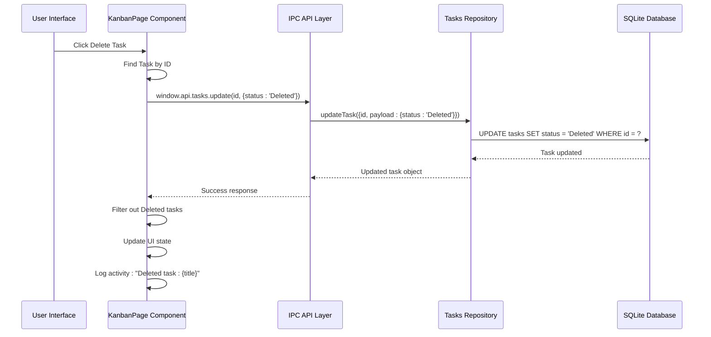
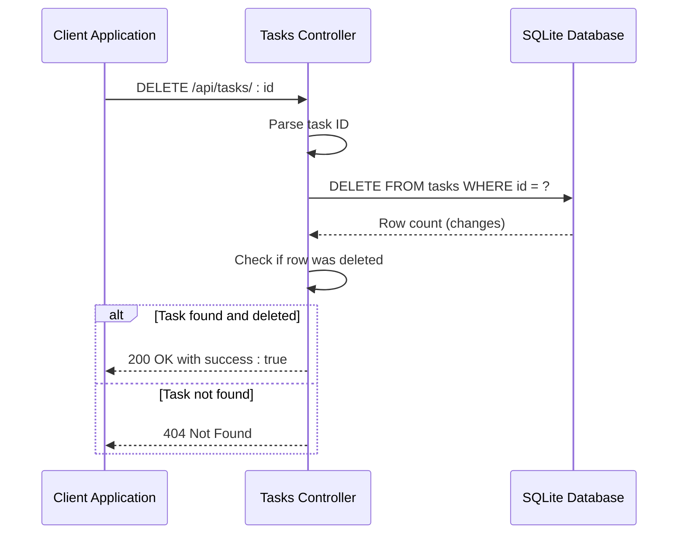
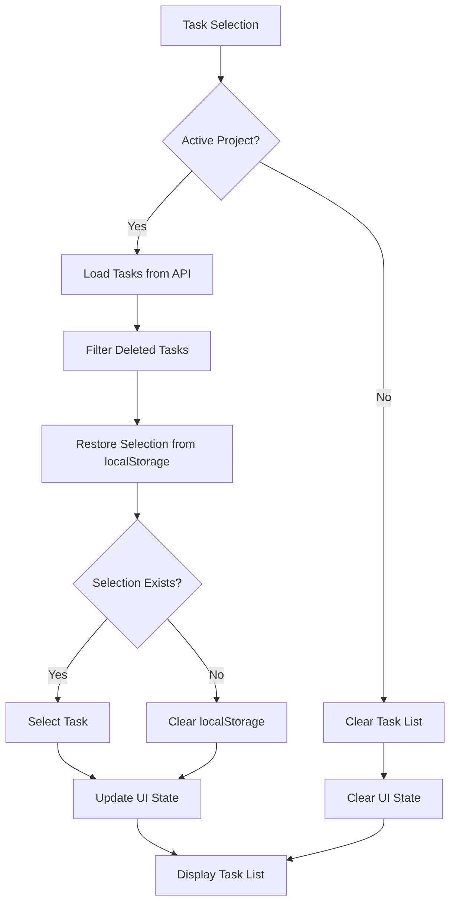
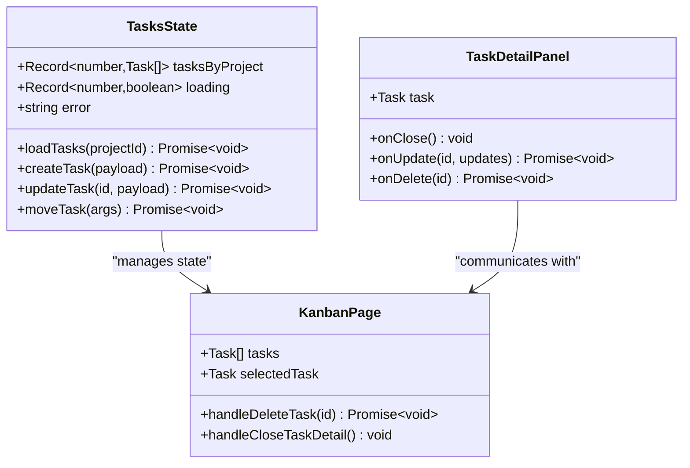
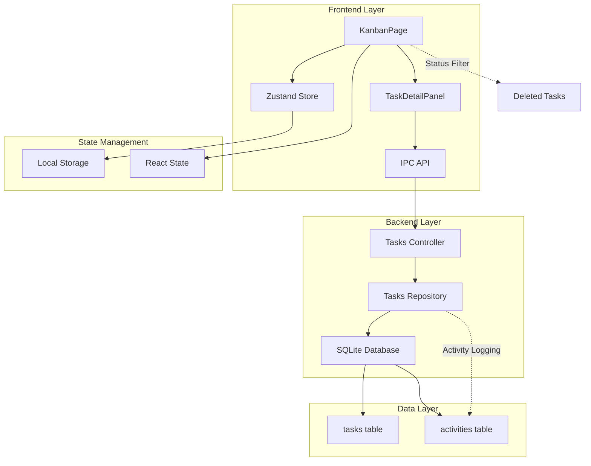

# Task Deletion and Soft Delete Mechanism in LifeOS

<cite>
**Referenced Files in This Document**
- [KanbanPage.tsx](file://src/renderer/pages/KanbanPage.tsx)
- [tasksRepo.ts](file://src/database/tasksRepo.ts)
- [tasksController.ts](file://src/server/controllers/tasksController.ts)
- [TaskDetailPanel.tsx](file://src/renderer/components/TaskDetailPanel.tsx)
- [tasks.ts](file://src/store/tasks.ts)
- [tasks.ts](file://src/main/ipc/tasks.ts)
- [types.ts](file://src/common/types.ts)
- [types.ts](file://src/database/types.ts)
- [init.ts](file://src/database/init.ts)
</cite>

## Table of Contents
1. [Introduction](#introduction)
2. [Soft Delete Implementation](#soft-delete-implementation)
3. [Hard Delete Implementation](#hard-delete-implementation)
4. [UI State Management](#ui-state-management)
5. [Activity Logging](#activity-logging)
6. [Security Considerations](#security-considerations)
7. [Common Issues and Solutions](#common-issues-and-solutions)
8. [Architecture Overview](#architecture-overview)
9. [Best Practices](#best-practices)
10. [Troubleshooting Guide](#troubleshooting-guide)

## Introduction

LifeOS implements a sophisticated task management system with dual deletion mechanisms: soft delete for reversible removal and hard delete for permanent removal. This system ensures data integrity while providing users with flexible task management capabilities. The implementation follows a layered architecture where the frontend handles soft deletes through status transitions, while the backend provides both soft and hard delete endpoints.

The task deletion mechanism operates on the principle that "deleted" tasks remain in the database with a special status flag, allowing for recovery and audit trails, while hard deletes provide irreversible removal for truly unwanted data.

## Soft Delete Implementation

### Frontend Soft Delete Process

The soft delete mechanism is primarily implemented in the KanbanPage component through the `handleDeleteTask` function. This approach transforms the traditional delete operation into a status change operation.

**Diagram sources**
- [KanbanPage.tsx](file://src/renderer/pages/KanbanPage.tsx#L90-L105)
- [tasksRepo.ts](file://src/database/tasksRepo.ts#L100-L150)

The soft delete process involves several key steps:

1. **Task Identification**: The system locates the target task by ID
2. **Status Transition**: Updates the task status to 'Deleted' instead of removing it
3. **UI Filtering**: Removes deleted tasks from the visible task list
4. **State Synchronization**: Updates local application state
5. **Activity Logging**: Records the deletion event with task title

**Section sources**
- [KanbanPage.tsx](file://src/renderer/pages/KanbanPage.tsx#L90-L105)

### Backend Repository Handling

The tasks repository handles the soft delete operation through the `updateTask` function, which performs a standard database update with the 'Deleted' status.

The repository maintains comprehensive validation and error handling, ensuring that only valid updates are processed. The function tracks status changes and emits appropriate events for monitoring and analytics.

**Section sources**
- [tasksRepo.ts](file://src/database/tasksRepo.ts#L100-L150)

### Status Field Design

The task status field serves dual purposes in the soft delete mechanism:

- **Active States**: 'Backlog', 'To-Do', 'In Progress', 'Completed'
- **Deleted State**: 'Deleted' (excluded from normal display)
- **Archived State**: 'Completed' (with special handling for visibility)

This design allows for easy filtering and restoration capabilities while maintaining data integrity.

## Hard Delete Implementation

### Permanent Deletion Endpoint

The hard delete mechanism is implemented through the `deleteTask` controller endpoint, which performs a direct SQL DELETE operation on the tasks table.

**Diagram sources**
- [tasksController.ts](file://src/server/controllers/tasksController.ts#L57-L75)

The hard delete endpoint provides:

1. **Direct SQL Execution**: Uses raw SQL for immediate removal
2. **NotFound Handling**: Returns appropriate HTTP status codes
3. **Audit Trail**: No automatic logging (separate from soft delete)

**Section sources**
- [tasksController.ts](file://src/server/controllers/tasksController.ts#L57-L75)

### Security Implications

Hard deletes bypass the soft delete mechanism and should be used cautiously. The implementation provides:

- **Access Control**: Requires proper authentication and authorization
- **Audit Logging**: Can be extended for compliance requirements
- **Irreversible Operation**: No automatic recovery mechanism

## UI State Management

### Local Storage Cleanup

The KanbanPage component implements comprehensive state management for task selection and UI persistence.

**Diagram sources**
- [KanbanPage.tsx](file://src/renderer/pages/KanbanPage.tsx#L120-L140)

The UI state management includes:

1. **Persistent Selection**: Task selection is stored in localStorage
2. **Automatic Cleanup**: Selection is cleared when the task is deleted
3. **Recovery Logic**: Attempts to restore previous selection on page reload
4. **Filtered Display**: Deleted tasks are excluded from the UI

**Section sources**
- [KanbanPage.tsx](file://src/renderer/pages/KanbanPage.tsx#L120-L140)

### Zustand Store Integration

The task store maintains synchronized state across the application:

**Diagram sources**
- [tasks.ts](file://src/store/tasks.ts#L5-L15)
- [KanbanPage.tsx](file://src/renderer/pages/KanbanPage.tsx#L20-L30)

**Section sources**
- [tasks.ts](file://src/store/tasks.ts#L40-L132)

## Activity Logging

### Soft Delete Activity Tracking

Both soft and hard delete operations trigger activity logging for audit purposes and user feedback.

The activity logging system captures:

- **Operation Type**: Task deletion or update
- **Task Details**: Title and ID for identification
- **Timestamp**: When the operation occurred
- **User Context**: Which user performed the action

**Section sources**
- [KanbanPage.tsx](file://src/renderer/pages/KanbanPage.tsx#L95-L100)
- [TaskDetailPanel.tsx](file://src/renderer/components/TaskDetailPanel.tsx#L45-L50)

### Notification System

The UI provides immediate feedback through the notification system:

- **Success Notifications**: Confirms successful operations
- **Error Notifications**: Alerts users to failures
- **Confirmation Dialogs**: Prevents accidental deletions

**Section sources**
- [TaskDetailPanel.tsx](file://src/renderer/components/TaskDetailPanel.tsx#L40-L60)

## Security Considerations

### Data Retention Policies

The soft delete mechanism provides several security benefits:

1. **Recovery Capability**: Deleted tasks can be restored within the application
2. **Audit Trail**: All status changes are logged and traceable
3. **Compliance**: Supports regulatory requirements for data retention
4. **Accidental Protection**: Reduces risk of permanent data loss

### Access Control

The system implements multiple layers of access control:

- **Authentication**: Users must be authenticated to perform operations
- **Authorization**: Only task owners or authorized users can delete tasks
- **Validation**: Input validation prevents malicious data injection

### Data Integrity

Several mechanisms ensure data integrity during deletion operations:

- **Transaction Support**: Database operations are wrapped in transactions
- **Foreign Key Constraints**: Maintains referential integrity
- **Cascading Deletes**: Proper cleanup of related data

## Common Issues and Solutions

### Accidental Deletions

**Problem**: Users accidentally delete important tasks
**Solution**: 
- Confirmation dialogs before soft delete operations
- Recovery mechanisms through the 'Deleted' status
- Activity logs for tracking changes

### Incomplete UI State Cleanup

**Problem**: Task selection remains in localStorage after deletion
**Solution**:
- Automatic localStorage cleanup in `handleCloseTaskDetail`
- UI state reset on task deletion
- Consistent state management across components

### Synchronization Issues

**Problem**: UI and database state become desynchronized
**Solution**:
- Immediate UI updates with optimistic rendering
- State refresh after successful API calls
- Error handling with state rollback

### Performance Considerations

**Problem**: Large task lists slow down deletion operations
**Solution**:
- Efficient filtering on the frontend
- Database indexing on status and project_id
- Lazy loading for large datasets

## Architecture Overview

**Diagram sources**
- [KanbanPage.tsx](file://src/renderer/pages/KanbanPage.tsx#L1-L50)
- [tasksController.ts](file://src/server/controllers/tasksController.ts#L1-L20)
- [tasksRepo.ts](file://src/database/tasksRepo.ts#L1-L30)

## Best Practices

### Implementation Guidelines

1. **Consistent Status Handling**: Always use the same status values for soft delete
2. **Proper Error Handling**: Implement comprehensive error handling at all layers
3. **State Synchronization**: Ensure UI state stays in sync with backend changes
4. **Activity Logging**: Log all significant operations for audit purposes
5. **User Feedback**: Provide clear feedback for all operations

### Performance Optimization

1. **Efficient Filtering**: Filter deleted tasks on the frontend to reduce API calls
2. **Database Indexing**: Ensure proper indexing on frequently queried fields
3. **Batch Operations**: Group related operations when possible
4. **Caching Strategies**: Implement appropriate caching for frequently accessed data

### Security Measures

1. **Input Validation**: Validate all user inputs before processing
2. **Access Controls**: Implement proper authentication and authorization
3. **Audit Trails**: Maintain comprehensive logs of all operations
4. **Data Encryption**: Encrypt sensitive data at rest and in transit

## Troubleshooting Guide

### Common Problems and Solutions

**Issue**: Deleted tasks still appear in the UI
**Solution**: Check that the UI filters out tasks with status 'Deleted'

**Issue**: Task deletion fails silently
**Solution**: Verify network connectivity and check browser console for errors

**Issue**: Activity logs not updating
**Solution**: Ensure the activity store is properly initialized and connected

**Issue**: Performance degradation with many tasks
**Solution**: Implement pagination or virtual scrolling for large task lists

### Debugging Steps

1. **Check Network Requests**: Verify API calls are successful
2. **Inspect Database**: Confirm status changes in the database
3. **Review Logs**: Check application and database logs for errors
4. **Validate State**: Ensure UI state matches backend state

### Recovery Procedures

1. **Restore from Deleted Status**: Change task status back to original value
2. **Database Backup**: Restore from recent database backup if needed
3. **Manual Recovery**: Use database tools for manual data recovery
4. **System Reset**: As last resort, reset to known good state