# Task Lifecycle Management

<cite>
**Referenced Files in This Document**
- [tasksRepo.ts](file://src/database/tasksRepo.ts)
- [KanbanPage.tsx](file://src/renderer/pages/KanbanPage.tsx)
- [tasks.ts](file://src/main/ipc/tasks.ts)
- [tasksController.ts](file://src/server/controllers/tasksController.ts)
- [eventsRepo.ts](file://src/database/eventsRepo.ts)
- [activity.ts](file://src/store/activity.ts)
- [tasks.ts](file://src/store/tasks.ts)
- [types.ts](file://src/common/types.ts)
- [types.ts](file://src/database/types.ts)
- [init.ts](file://src/database/init.ts)
- [notification.ts](file://src/main/ipc/notification.ts)
- [notification.html](file://notification.html)
</cite>

## Table of Contents
1. [Introduction](#introduction)
2. [Task State Model](#task-state-model)
3. [Database Schema](#database-schema)
4. [Task Lifecycle States](#task-lifecycle-states)
5. [Core Task Operations](#core-task-operations)
6. [API Endpoints and IPC Handlers](#api-endpoints-and-ipc-handlers)
7. [Zod Validation Schemas](#zod-validation-schemas)
8. [Task Management UI](#task-management-ui)
9. [Activity Logging Integration](#activity-logging-integration)
10. [Notification System](#notification-system)
11. [State Consistency and Concurrency](#state-consistency-and-concurrency)
12. [Common Issues and Solutions](#common-issues-and-solutions)
13. [Best Practices](#best-practices)

## Introduction

LifeOS implements a sophisticated Task Lifecycle Management system that provides comprehensive task tracking, status transitions, and collaborative features. The system supports a Kanban-style workflow with five distinct states: Backlog, To-Do, In Progress, Completed, and Deleted (soft deletion). This document provides detailed coverage of the complete task lifecycle, from creation through archival and restoration.

The system employs a multi-layered architecture with database persistence, real-time UI updates, activity tracking, and notification systems. It ensures data consistency through Zod validation schemas, handles concurrent modifications gracefully, and maintains state synchronization between the frontend and backend.

## Task State Model

The Task Lifecycle Management system operates on a finite state machine model with the following states:

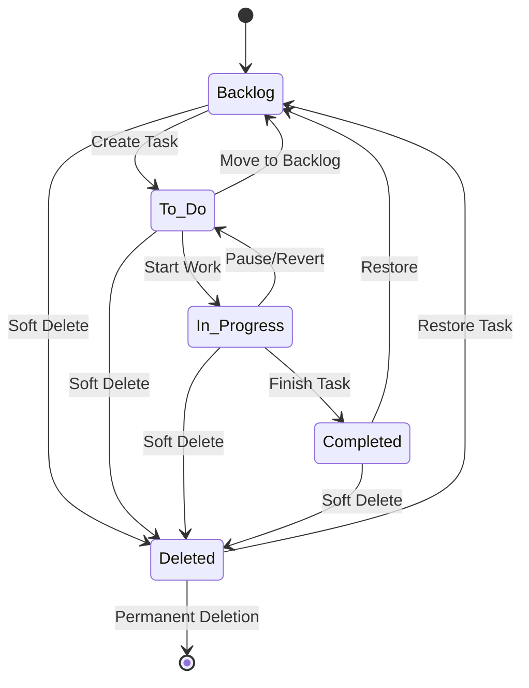

**Diagram sources**
- [tasksRepo.ts](file://src/database/tasksRepo.ts#L1-L50)
- [KanbanPage.tsx](file://src/renderer/pages/KanbanPage.tsx#L1-L100)

### State Definitions

| State | Description | UI Behavior | Database Storage |
|-------|-------------|-------------|------------------|
| **Backlog** | Initial state for new tasks | Shown in backlog column | `status = 'Backlog'` |
| **To-Do** | Ready for immediate action | Visible in To-Do column | `status = 'To-Do'` |
| **In Progress** | Active work in progress | Highlighted in column | `status = 'In Progress'` |
| **Completed** | Task finished successfully | Archived view available | `status = 'Completed'` |
| **Deleted** | Soft-deleted tasks | Hidden from main view | `status = 'Deleted'` |

**Section sources**
- [tasksRepo.ts](file://src/database/tasksRepo.ts#L1-L211)
- [types.ts](file://src/database/types.ts#L1-L31)

## Database Schema

The task management system uses a relational database schema optimized for Kanban-style workflows:

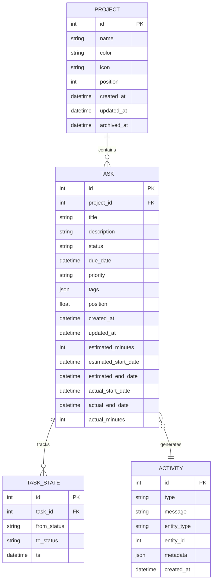

**Diagram sources**
- [init.ts](file://src/database/init.ts#L40-L70)
- [types.ts](file://src/database/types.ts#L1-L31)

### Key Schema Features

- **Foreign Key Constraints**: Tasks are linked to projects with cascading deletes
- **Position Tracking**: Float-based positioning allows smooth drag-and-drop reordering
- **Time Tracking Fields**: Comprehensive tracking of estimated and actual time spent
- **JSON Tags**: Flexible tagging system stored as JSON arrays
- **Audit Trail**: Task state changes tracked in dedicated table

**Section sources**
- [init.ts](file://src/database/init.ts#L40-L70)
- [types.ts](file://src/database/types.ts#L1-L31)

## Task Lifecycle States

### Creation State Transitions

When a new task is created, it follows this state progression:

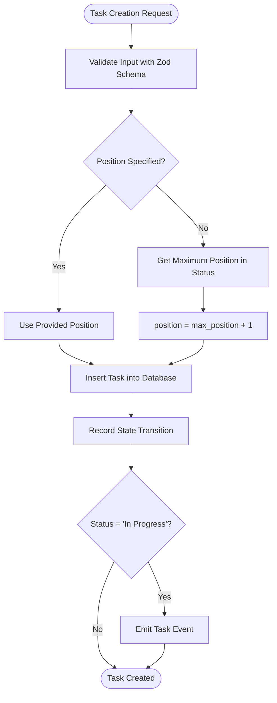

**Diagram sources**
- [tasksRepo.ts](file://src/database/tasksRepo.ts#L50-L85)

### Status Transition Rules

The system enforces strict state transition rules:

| From Status | To Status | Allowed | Reason |
|-------------|-----------|---------|---------|
| **Backlog** | To-Do | ✅ | Ready for action |
| **To-Do** | In Progress | ✅ | Starting work |
| **In Progress** | Completed | ✅ | Task finished |
| **In Progress** | To-Do | ✅ | Paused/reverted |
| **To-Do** | Backlog | ✅ | Moved back |
| **Completed** | Backlog | ✅ | Reopened |
| **Any** | Deleted | ✅ | Soft deletion |
| **Deleted** | Backlog | ✅ | Restoration |

**Section sources**
- [tasksRepo.ts](file://src/database/tasksRepo.ts#L150-L211)

## Core Task Operations

### Task Creation

The task creation process involves multiple layers of validation and state management:

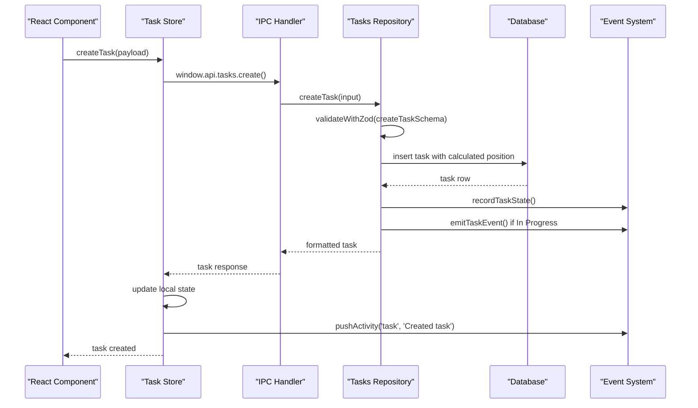

**Diagram sources**
- [tasksRepo.ts](file://src/database/tasksRepo.ts#L50-L85)
- [tasks.ts](file://src/store/tasks.ts#L50-L70)

### Task Updates

Task updates support partial field updates with comprehensive validation:

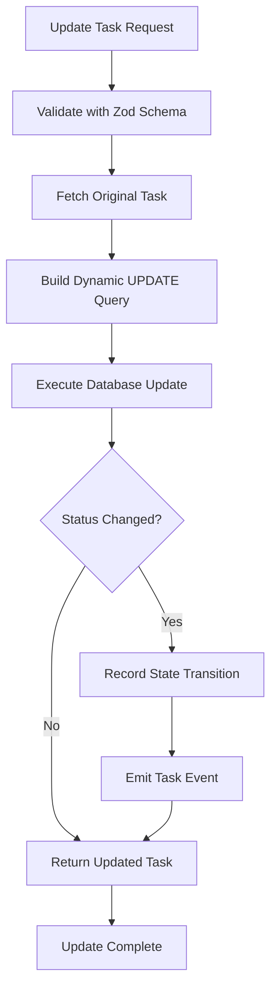

**Diagram sources**
- [tasksRepo.ts](file://src/database/tasksRepo.ts#L87-L150)

### Task Movement

Task movement combines status changes with position updates:

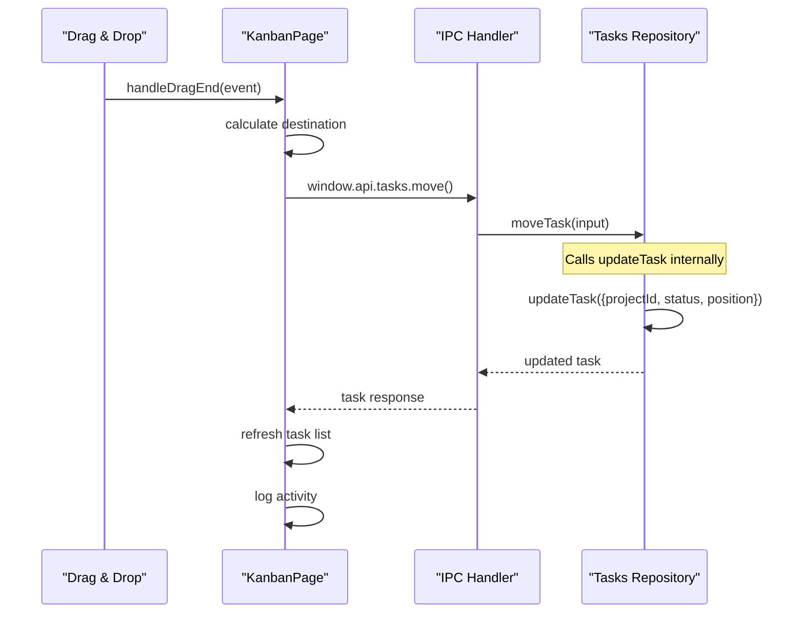

**Diagram sources**
- [KanbanPage.tsx](file://src/renderer/pages/KanbanPage.tsx#L250-L350)
- [tasksRepo.ts](file://src/database/tasksRepo.ts#L190-L211)

**Section sources**
- [tasksRepo.ts](file://src/database/tasksRepo.ts#L50-L211)
- [KanbanPage.tsx](file://src/renderer/pages/KanbanPage.tsx#L80-L150)

## API Endpoints and IPC Handlers

### Backend API Endpoints

The system exposes RESTful API endpoints through Express.js controllers:

| Endpoint | Method | Purpose | Response |
|----------|--------|---------|----------|
| `/tasks/create` | POST | Create new task | `{ data: Task }` |
| `/tasks/:id` | GET | Get task by ID | `{ data: Task }` |
| `/tasks/project/:projectId` | GET | List tasks by project | `{ data: Task[] }` |
| `/tasks/:id` | PUT | Update existing task | `{ data: Task }` |
| `/tasks/:id` | DELETE | Delete task | `{ data: { success: true, id } }` |
| `/tasks/:id/move` | PUT | Move task to new position | `{ data: Task }` |
| `/tasks` | GET | Get task statistics | `{ data: Stats }` |

### IPC Handler Implementation

The Electron IPC system provides secure communication between renderer and main processes:

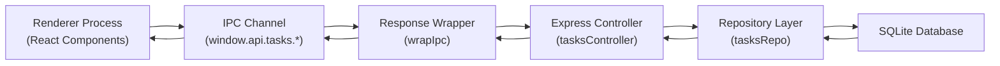

**Diagram sources**
- [tasks.ts](file://src/main/ipc/tasks.ts#L1-L37)
- [tasksController.ts](file://src/server/controllers/tasksController.ts#L1-L140)

### Frontend API Integration

The frontend uses a consistent API pattern for all task operations:

```typescript
// Task creation example from KanbanPage.tsx
async function handleCreateTask(title: string, status: KanbanStatus) {
  if (!activeProjectId) return;
  
  try {
    const res = await window.api.tasks.create({ 
      title, 
      status, 
      projectId: activeProjectId 
    });
    if (res.ok) {
      const listRes = await window.api.tasks.listByProject(activeProjectId);
      if (listRes.ok && listRes.data) setTasks(listRes.data);
      useActivityStore.getState().pushActivity('task', `Created task "${title}"`);
    }
  } catch (error) {
    console.error('Error creating task:', error);
  }
}
```

**Section sources**
- [tasks.ts](file://src/main/ipc/tasks.ts#L1-L37)
- [tasksController.ts](file://src/server/controllers/tasksController.ts#L1-L140)
- [KanbanPage.tsx](file://src/renderer/pages/KanbanPage.tsx#L150-L200)

## Zod Validation Schemas

The system employs Zod schemas for comprehensive input validation at multiple layers:

### Create Task Schema

The create task schema ensures data integrity during task creation:

```typescript
const createTaskSchema = z.object({
  projectId: z.number().int().positive(),
  title: z.string().min(1).max(200),
  description: z.string().max(4000).optional(),
  status: z.string().min(1).max(50).default('To-Do'),
  dueDate: z.string().datetime().optional(),
  priority: z.string().max(50).optional(),
  tags: z.array(z.string().max(30)).optional(),
  position: z.number().optional()
});
```

### Update Task Schema

The update task schema supports partial updates with flexible validation:

```typescript
const updateTaskSchema = z.object({
  id: z.number().int().positive(),
  payload: z.object({
    title: z.string().min(1).max(200).optional(),
    description: z.string().max(4000).optional().nullable(),
    status: z.string().min(1).max(50).optional(),
    dueDate: z.string().datetime().optional().nullable(),
    priority: z.string().max(50).optional().nullable(),
    tags: z.array(z.string().max(30)).optional().nullable(),
    position: z.number().optional(),
    projectId: z.number().int().positive().optional(),
    estimatedMinutes: z.number().int().positive().optional().nullable(),
    estimatedStartDate: z.string().datetime().optional().nullable(),
    estimatedEndDate: z.string().datetime().optional().nullable(),
    actualStartDate: z.string().datetime().optional().nullable(),
    actualEndDate: z.string().datetime().optional().nullable(),
    actualMinutes: z.number().int().positive().optional().nullable()
  })
});
```

### Move Task Schema

The move task schema validates position changes:

```typescript
const moveTaskSchema = z.object({
  id: z.number().int().positive(),
  projectId: z.number().int().positive(),
  status: z.string().min(1).max(50),
  position: z.number()
});
```

**Section sources**
- [tasksRepo.ts](file://src/database/tasksRepo.ts#L7-L40)

## Task Management UI

### Kanban Board Implementation

The KanbanPage component provides a comprehensive task management interface:

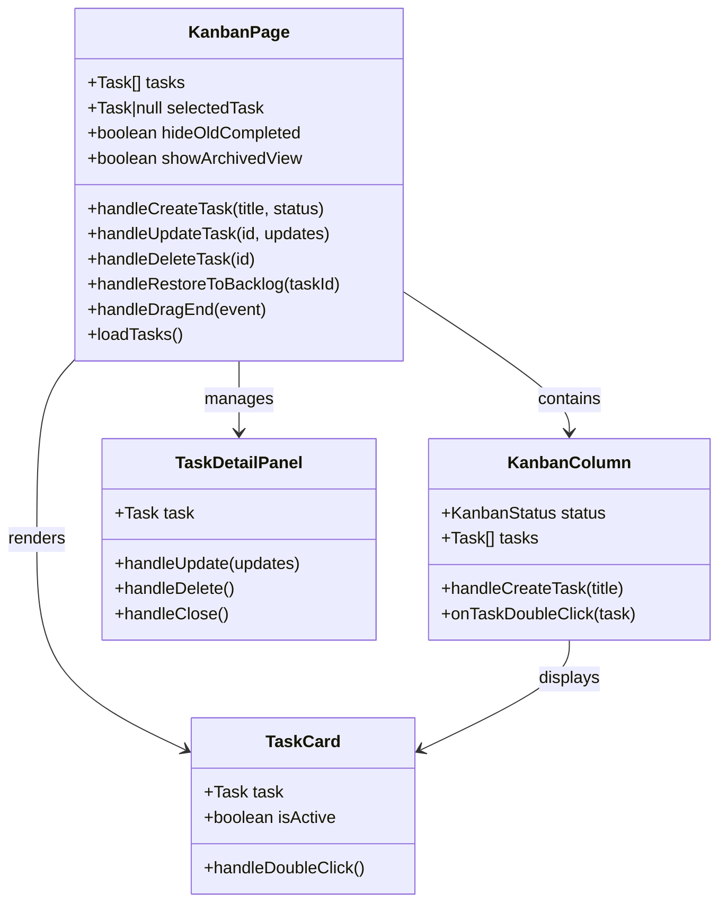

**Diagram sources**
- [KanbanPage.tsx](file://src/renderer/pages/KanbanPage.tsx#L1-L100)

### Task Creation Handler

The task creation handler demonstrates the complete lifecycle:

```typescript
async function handleCreateTask(title: string, status: KanbanStatus) {
  if (!activeProjectId) return;

  try {
    const res = await window.api.tasks.create({ 
      title, 
      status, 
      projectId: activeProjectId 
    });
    if (res.ok) {
      const listRes = await window.api.tasks.listByProject(activeProjectId);
      if (listRes.ok && listRes.data) setTasks(listRes.data);
      useActivityStore.getState().pushActivity('task', `Created task "${title}"`);
    }
  } catch (error) {
    console.error('Error creating task:', error);
  }
}
```

### Task Update Handler

The update handler supports comprehensive task modifications:

```typescript
const handleUpdateTask = async (id: number, updates: Partial<Task>) => {
  if (!activeProjectId) return;
  try {
    await window.api.tasks.update(id, updates as any);
    const res = await window.api.tasks.listByProject(activeProjectId);
    if (res.ok && res.data) setTasks(res.data);
    useActivityStore.getState().pushActivity('task', `Updated task`);
  } catch (error) {
    console.error('Failed to update task:', error);
    throw error;
  }
};
```

### Task Deletion Handler

The deletion handler implements soft deletion:

```typescript
const handleDeleteTask = async (id: number) => {
  if (!activeProjectId) return;
  try {
    const task = tasks.find(t => t.id === id);
    if (task) {
      await window.api.tasks.update(id, { status: 'Deleted' } as any);
      const res = await window.api.tasks.listByProject(activeProjectId);
      if (res.ok && res.data) setTasks(res.data.filter(t => t.status !== 'Deleted'));
      useActivityStore.getState().pushActivity('task', `Deleted task: ${task.title}`);
    }
  } catch (error) {
    console.error('Failed to delete task:', error);
    throw error;
  }
};
```

**Section sources**
- [KanbanPage.tsx](file://src/renderer/pages/KanbanPage.tsx#L80-L200)

## Activity Logging Integration

### Activity Store Architecture

The activity logging system provides comprehensive audit trails:

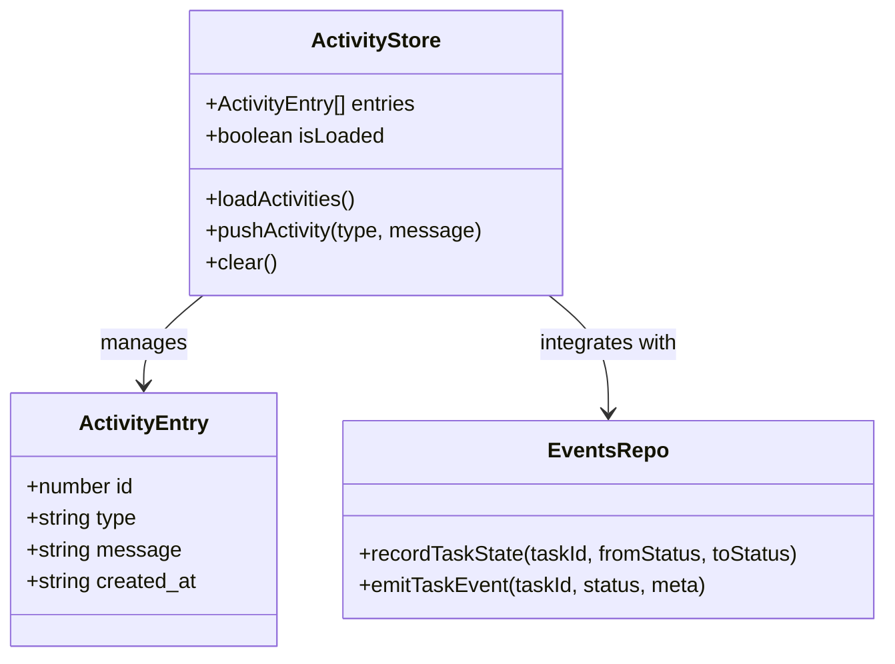

**Diagram sources**
- [activity.ts](file://src/store/activity.ts#L1-L69)
- [eventsRepo.ts](file://src/database/eventsRepo.ts#L60-L85)

### Task State Tracking

The system automatically tracks task state transitions:

```typescript
// Called during task creation and updates
export function recordTaskState(taskId: number, fromStatus: string | null, toStatus: string): void {
  const db = getDb();
  
  db.prepare(`
    INSERT INTO task_states (task_id, from_status, to_status, ts)
    VALUES (?, ?, ?, CURRENT_TIMESTAMP)
  `).run(taskId, fromStatus, toStatus);
}
```

### Event Emission

Task events trigger appropriate system responses:

```typescript
export function emitTaskEvent(taskId: number, status: string, meta?: Record<string, any>): void {
  let eventType: string;
  
  switch (status) {
    case 'In Progress':
      eventType = EVENT_TYPES.TASK_STARTED;
      break;
    case 'Completed':
      eventType = EVENT_TYPES.TASK_COMPLETED;
      break;
    default:
      eventType = EVENT_TYPES.TASK_PROGRESSED;
  }

  createEvent({
    type: eventType,
    meta: { task_id: taskId, ...meta }
  });
}
```

**Section sources**
- [eventsRepo.ts](file://src/database/eventsRepo.ts#L60-L85)
- [activity.ts](file://src/store/activity.ts#L1-L69)

## Notification System

### Notification Architecture

The notification system provides real-time feedback for task operations:

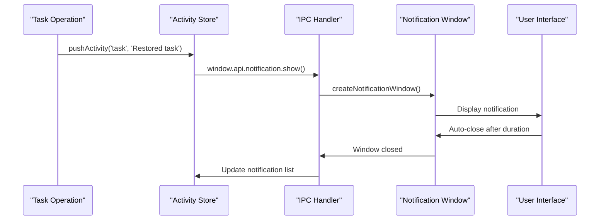

**Diagram sources**
- [notification.ts](file://src/main/ipc/notification.ts#L1-L115)
- [KanbanPage.tsx](file://src/renderer/pages/KanbanPage.tsx#L120-L130)

### Notification Types

The system supports multiple notification types:

| Type | Icon | Color | Use Case |
|------|------|-------|----------|
| **Success** | ✅ | Green (#4CAF50) | Task restored, created |
| **Error** | ❌ | Red (#FF5252) | Operation failed |
| **Warning** | ⚠️ | Orange (#FF9800) | Important warnings |
| **Info** | ℹ️ | Teal (#03DAC6) | General information |

### Task Restoration Notification

Task restoration includes visual feedback:

```typescript
window.api.notification.show({
  type: 'success',
  title: 'Task Restored',
  message: `"${task.title}" moved to Backlog`,
  duration: 2000
});
```

**Section sources**
- [notification.ts](file://src/main/ipc/notification.ts#L1-L115)
- [notification.html](file://notification.html#L1-L176)
- [KanbanPage.tsx](file://src/renderer/pages/KanbanPage.tsx#L120-L130)

## State Consistency and Concurrency

### Optimistic UI Updates

The system implements optimistic updates for improved user experience:

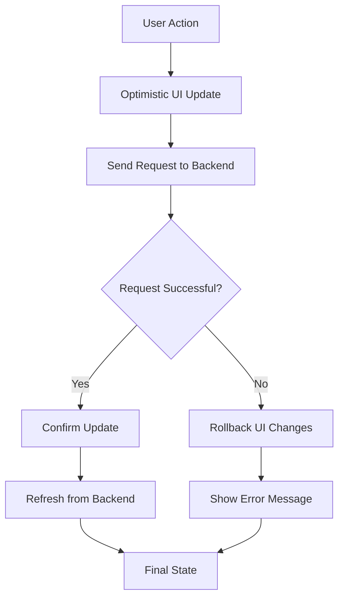

### LocalStorage Integration

The system maintains task selection state across sessions:

```typescript
// Save selection to localStorage for persistence
if (activeProjectId) {
  localStorage.setItem(`kanban_selected_task_${activeProjectId}`, String(task.id));
}

// Restore selection from localStorage
const savedTaskId = localStorage.getItem(`kanban_selected_task_${activeProjectId}`);
if (savedTaskId) {
  const taskToSelect = filteredData.find(t => t.id === parseInt(savedTaskId));
  if (taskToSelect) {
    setSelectedTask(taskToSelect);
  } else {
    // Task no longer exists, clear localStorage
    localStorage.removeItem(`kanban_selected_task_${activeProjectId}`);
  }
}
```

### Concurrent Modification Handling

The system handles concurrent modifications through several mechanisms:

1. **Timestamp-based Conflict Detection**: Uses `updated_at` timestamps
2. **Optimistic Locking**: Allows UI updates while validating backend
3. **Refresh-on-Conflict**: Automatically refreshes data when conflicts detected
4. **Local State Caching**: Maintains temporary state during network operations

**Section sources**
- [KanbanPage.tsx](file://src/renderer/pages/KanbanPage.tsx#L180-L220)
- [tasks.ts](file://src/store/tasks.ts#L50-L132)

## Common Issues and Solutions

### Issue: State Inconsistency Between UI and Database

**Problem**: UI shows outdated task state after database changes.

**Solution**: Implement automatic refresh mechanisms:

```typescript
// Refresh tasks after successful operations
const res = await window.api.tasks.listByProject(activeProjectId);
if (res.ok && res.data) {
  setTasks(res.data);
}
```

### Issue: Concurrent Task Modifications

**Problem**: Multiple users modifying the same task simultaneously.

**Solution**: Use database transactions and optimistic locking:

```typescript
// Database automatically handles concurrency through SQLite's ACID properties
const row = db
  .prepare(`UPDATE tasks SET ${fields.join(', ')}, updated_at = CURRENT_TIMESTAMP WHERE id = @id RETURNING *`)
  .get(parameters) as TaskRow | undefined;
```

### Issue: LocalStorage Cleanup

**Problem**: Stale localStorage references after task deletion.

**Solution**: Implement cleanup mechanisms:

```typescript
// Clear selection from localStorage
if (activeProjectId) {
  localStorage.removeItem(`kanban_selected_task_${activeProjectId}`);
}

// Handle missing tasks in localStorage
const savedTaskId = localStorage.getItem(`kanban_selected_task_${activeProjectId}`);
if (!savedTaskId) {
  localStorage.removeItem(`kanban_selected_task_${activeProjectId}`);
}
```

### Issue: Drag-and-Drop Position Conflicts

**Problem**: Position conflicts during bulk reordering operations.

**Solution**: Use batch updates with proper ordering:

```typescript
// Update positions in sequence to avoid conflicts
for (const update of updates) {
  await window.api.tasks.update(update.id, { position: update.position });
}
```

**Section sources**
- [KanbanPage.tsx](file://src/renderer/pages/KanbanPage.tsx#L250-L350)
- [tasksRepo.ts](file://src/database/tasksRepo.ts#L150-L211)

## Best Practices

### Task Lifecycle Management Guidelines

1. **Always Validate Inputs**: Use Zod schemas for comprehensive validation
2. **Implement Optimistic Updates**: Improve user experience with immediate UI feedback
3. **Maintain Audit Trails**: Track all state changes for accountability
4. **Handle Soft Deletion Gracefully**: Use 'Deleted' status instead of permanent deletion
5. **Provide User Feedback**: Use notifications for important operations
6. **Keep State Consistent**: Refresh UI state after backend operations
7. **Clean Up Resources**: Remove stale localStorage references
8. **Handle Concurrency**: Design for simultaneous user interactions

### Performance Optimization

1. **Batch Operations**: Group related updates together
2. **Index Optimization**: Use appropriate database indexes
3. **Lazy Loading**: Load tasks on demand rather than all at once
4. **Debounced Updates**: Prevent excessive API calls during rapid changes
5. **Efficient Filtering**: Implement client-side filtering for better responsiveness

### Error Handling

1. **Graceful Degradation**: Continue functioning when database unavailable
2. **User-Friendly Messages**: Present errors in understandable terms
3. **Retry Mechanisms**: Implement automatic retry for transient failures
4. **Logging**: Capture errors for debugging and monitoring
5. **Fallback States**: Provide default states when operations fail

### Security Considerations

1. **Input Sanitization**: Validate all user inputs
2. **Access Control**: Restrict task operations to authorized users
3. **Data Encryption**: Protect sensitive task data
4. **Audit Logging**: Track all task-related operations
5. **Validation Layers**: Implement multiple validation stages