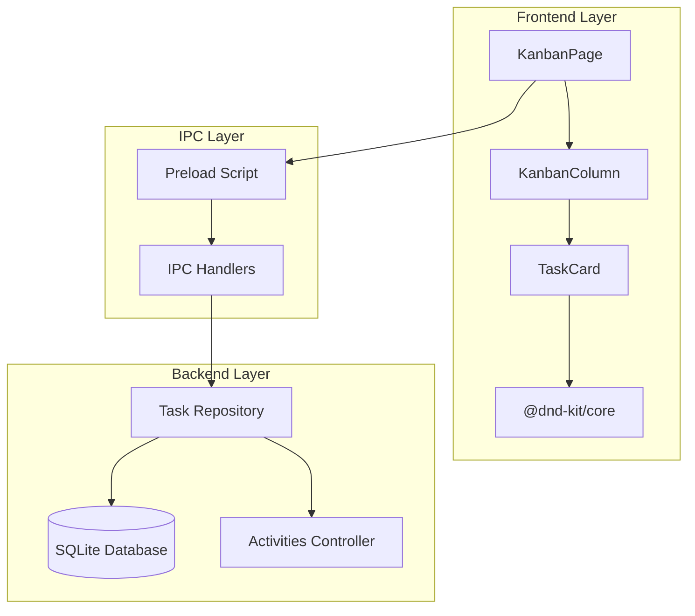
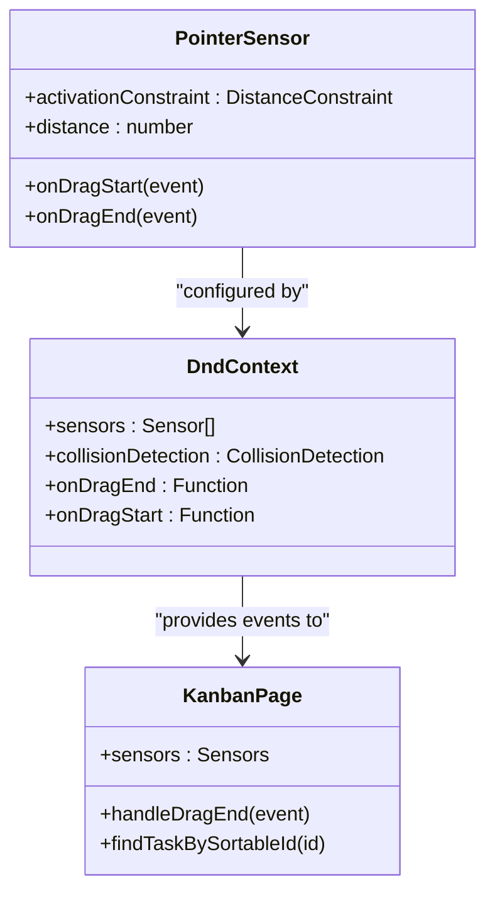
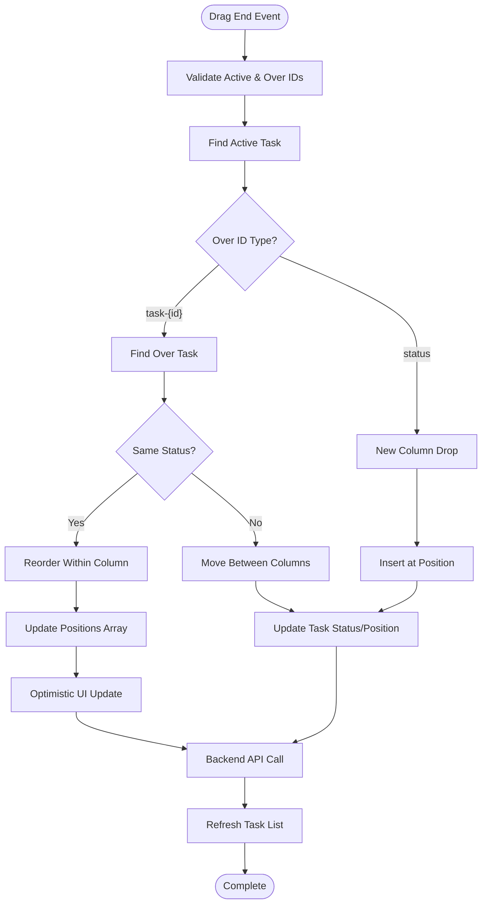
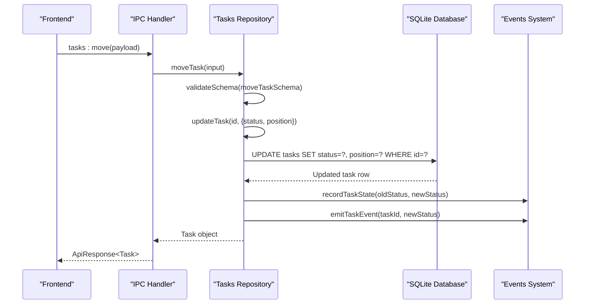

# Task Movement and Reordering

<cite>
**Referenced Files in This Document**
- [KanbanPage.tsx](file://src/renderer/pages/KanbanPage.tsx)
- [tasksRepo.ts](file://src/database/tasksRepo.ts)
- [tasks.ts](file://src/main/ipc/tasks.ts)
- [tasksController.ts](file://src/server/controllers/tasksController.ts)
- [index.ts](file://src/preload/index.ts)
- [types.ts](file://src/common/types.ts)
- [KanbanColumn.tsx](file://src/renderer/components/KanbanColumn.tsx)
- [TaskCard.tsx](file://src/renderer/components/TaskCard.tsx)
- [constants.ts](file://src/renderer/constants.ts)
- [init.ts](file://src/database/init.ts)
- [types.ts](file://src/database/types.ts)
</cite>

## Table of Contents
1. [Introduction](#introduction)
2. [System Architecture](#system-architecture)
3. [Drag-and-Drop Implementation](#drag-and-drop-implementation)
4. [Task Movement Logic](#task-movement-logic)
5. [Database Operations](#database-operations)
6. [IPC Communication](#ipc-communication)
7. [REST API Endpoints](#rest-api-endpoints)
8. [Position Management](#position-management)
9. [Activity Logging](#activity-logging)
10. [Error Handling](#error-handling)
11. [Common Issues and Solutions](#common-issues-and-solutions)
12. [Performance Considerations](#performance-considerations)

## Introduction

The Task Movement and Reordering system in LifeOS provides a sophisticated drag-and-drop interface for organizing tasks within a Kanban board. Built using React and Electron, the system enables users to reorder tasks within columns and move them between different status categories (Backlog, To-Do, In Progress, Completed). The implementation combines frontend interactivity with robust backend persistence, ensuring data consistency across client sessions.

## System Architecture

The task movement system follows a layered architecture with clear separation of concerns:

**Diagram sources**
- [KanbanPage.tsx](file://src/renderer/pages/KanbanPage.tsx#L1-L520)
- [KanbanColumn.tsx](file://src/renderer/components/KanbanColumn.tsx#L1-L104)
- [TaskCard.tsx](file://src/renderer/components/TaskCard.tsx#L1-L182)
- [index.ts](file://src/preload/index.ts#L1-L202)

## Drag-and-Drop Implementation

The system uses `@dnd-kit/core` for drag-and-drop functionality, providing smooth and responsive task manipulation.

### Sensor Configuration

The drag-and-drop system is configured with a pointer sensor that activates after minimal movement:

**Diagram sources**
- [KanbanPage.tsx](file://src/renderer/pages/KanbanPage.tsx#L180-L190)

The sensor is configured with a distance threshold of 8 pixels to prevent accidental drags while allowing intentional movements.

### Collision Detection

The system uses `closestCenter` collision detection to accurately determine when a task is dropped over another task or column.

**Section sources**
- [KanbanPage.tsx](file://src/renderer/pages/KanbanPage.tsx#L180-L190)

## Task Movement Logic

The core movement logic is implemented in the `handleDragEnd` function, which handles both reordering within columns and moving between statuses.

### Movement Decision Tree

**Diagram sources**
- [KanbanPage.tsx](file://src/renderer/pages/KanbanPage.tsx#L220-L320)

### Reordering Logic

When dropping a task within the same column, the system performs array reordering with position updates:

**Section sources**
- [KanbanPage.tsx](file://src/renderer/pages/KanbanPage.tsx#L240-L280)

### Cross-Column Movement

Moving tasks between columns requires calculating the destination position and updating the task's status:

**Section sources**
- [KanbanPage.tsx](file://src/renderer/pages/KanbanPage.tsx#L280-L320)

## Database Operations

The task movement system relies on several database operations handled by the tasks repository.

### moveTask Function

The core movement operation is encapsulated in the `moveTask` function:

**Diagram sources**
- [tasksRepo.ts](file://src/database/tasksRepo.ts#L200-L211)
- [tasks.ts](file://src/main/ipc/tasks.ts#L30-L36)

### Schema Validation

The system uses Zod schemas for input validation:

**Section sources**
- [tasksRepo.ts](file://src/database/tasksRepo.ts#L20-L31)
- [tasksRepo.ts](file://src/database/tasksRepo.ts#L200-L211)

## IPC Communication

The Inter-Process Communication layer handles frontend-backend communication for task operations.

### IPC Handler Registration

The IPC handlers are registered in the main process:

**Section sources**
- [tasks.ts](file://src/main/ipc/tasks.ts#L1-L37)

### Frontend API Interface

The preload script exposes the task API to the renderer process:

**Section sources**
- [index.ts](file://src/preload/index.ts#L25-L35)

## REST API Endpoints

The system also provides REST API endpoints for task management.

### Endpoint Definitions

| Endpoint | Method | Purpose | Parameters |
|----------|--------|---------|------------|
| `/tasks/{id}/move` | POST | Move task between statuses | id, projectId, status, position |
| `/tasks/{id}` | PUT | Update task properties | Various task fields |
| `/tasks/project/{projectId}` | GET | List tasks by project | projectId |

**Section sources**
- [tasksController.ts](file://src/server/controllers/tasksController.ts#L57-L70)

## Position Management

The system maintains task positions using a numerical ordering system that allows for efficient reordering.

### Position Calculation

When creating new tasks, positions are automatically calculated:

**Section sources**
- [tasksRepo.ts](file://src/database/tasksRepo.ts#L50-L60)

### Position Updates

During reordering operations, positions are recalculated and updated atomically:

**Section sources**
- [KanbanPage.tsx](file://src/renderer/pages/KanbanPage.tsx#L250-L270)

## Activity Logging

The system tracks task movements for activity history and analytics.

### Status Transition Logging

When tasks change status, the system records the transition:

**Section sources**
- [tasksRepo.ts](file://src/database/tasksRepo.ts#L190-L200)

### Activity Events

The system emits events for real-time synchronization:

**Section sources**
- [tasksRepo.ts](file://src/database/tasksRepo.ts#L195-L200)

## Error Handling

The system implements comprehensive error handling for various failure scenarios.

### Concurrent Move Handling

When multiple users attempt to move the same task simultaneously, the system handles conflicts gracefully:

**Section sources**
- [KanbanPage.tsx](file://src/renderer/pages/KanbanPage.tsx#L310-L320)

### Validation Errors

Input validation prevents invalid operations:

**Section sources**
- [tasksRepo.ts](file://src/database/tasksRepo.ts#L200-L211)

## Common Issues and Solutions

### Position Conflicts

**Issue**: Tasks getting stuck in incorrect positions during rapid movement
**Solution**: The system uses optimistic UI updates with subsequent refreshes to resolve conflicts

### Visual Feedback During Drags

**Issue**: Lack of clear visual indicators during drag operations
**Solution**: The drag overlay provides clear visual feedback with rotation effects

### Sort Order Consistency

**Issue**: Inconsistent task ordering across clients
**Solution**: The system uses database-level ordering with position fields for deterministic sorting

**Section sources**
- [KanbanPage.tsx](file://src/renderer/pages/KanbanPage.tsx#L450-L470)
- [TaskCard.tsx](file://src/renderer/components/TaskCard.tsx#L20-L50)

## Performance Considerations

### Optimistic Updates

The system performs immediate UI updates during drag operations to provide responsive feedback:

**Section sources**
- [KanbanPage.tsx](file://src/renderer/pages/KanbanPage.tsx#L260-L280)

### Batch Operations

Multiple position updates are batched to minimize database calls:

**Section sources**
- [KanbanPage.tsx](file://src/renderer/pages/KanbanPage.tsx#L270-L280)

### Database Indexing

The database schema includes indexes for optimal performance:

**Section sources**
- [init.ts](file://src/database/init.ts#L85-L95)