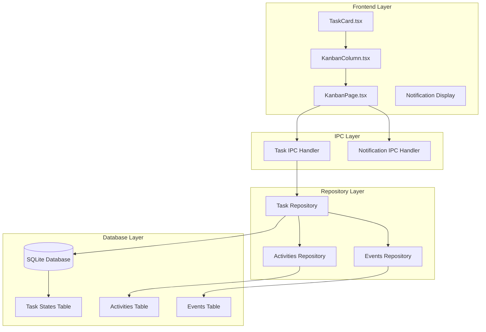
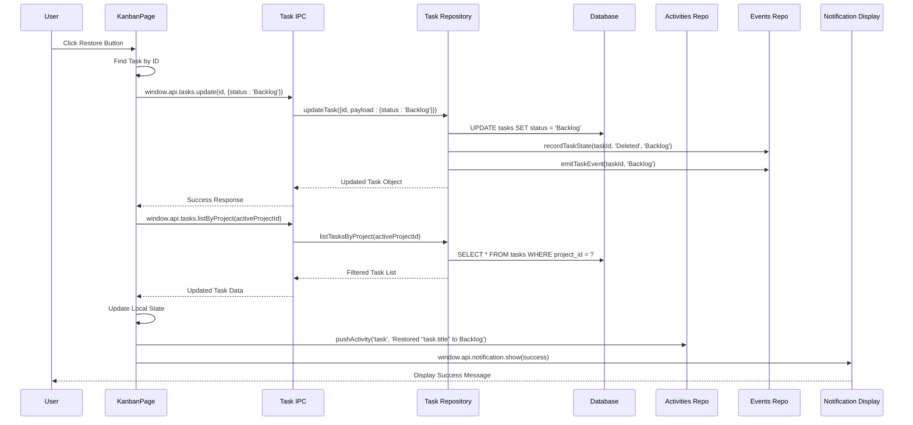
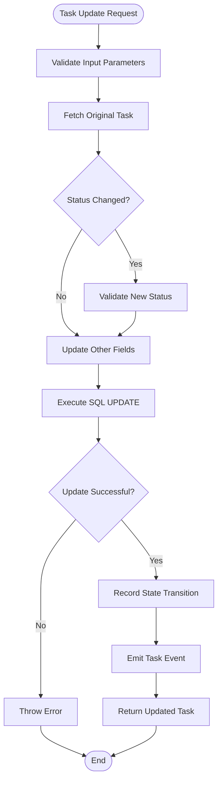
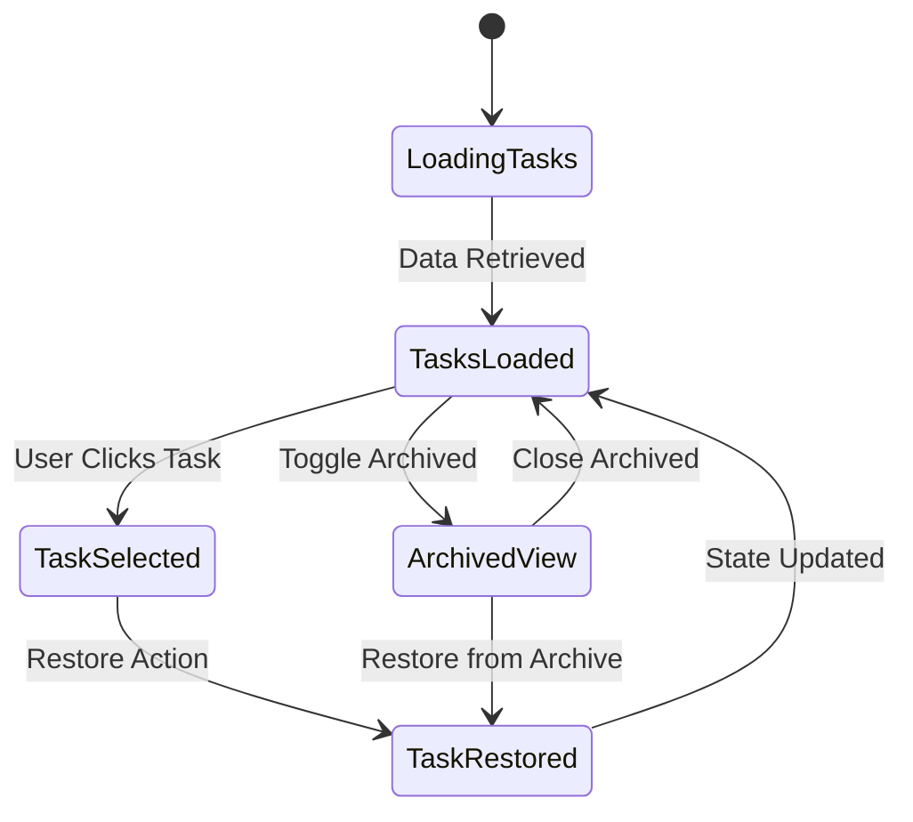
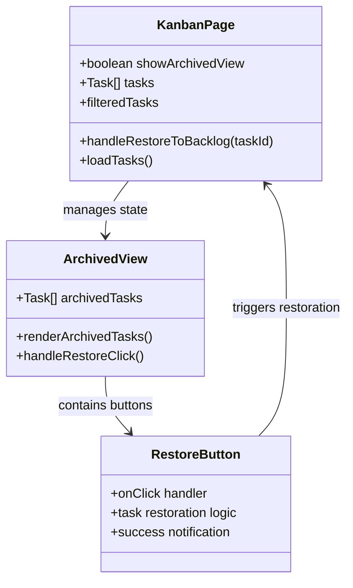
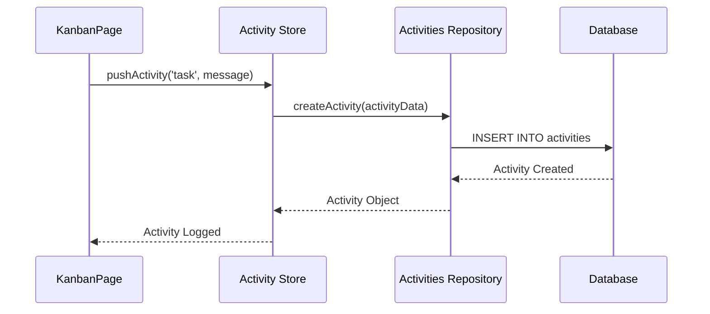
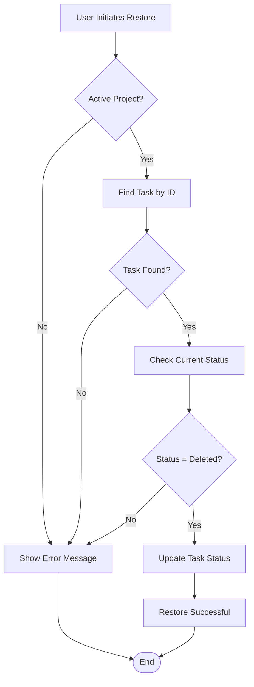

# Task Restoration

<cite>
**Referenced Files in This Document**
- [KanbanPage.tsx](file://src/renderer/pages/KanbanPage.tsx)
- [tasksRepo.ts](file://src/database/tasksRepo.ts)
- [tasks.ts](file://src/main/ipc/tasks.ts)
- [notification.ts](file://src/main/ipc/notification.ts)
- [activitiesRepo.ts](file://src/database/activitiesRepo.ts)
- [eventsRepo.ts](file://src/database/eventsRepo.ts)
- [notification.html](file://notification.html)
- [KanbanColumn.tsx](file://src/renderer/components/KanbanColumn.tsx)
- [TaskCard.tsx](file://src/renderer/components/TaskCard.tsx)
- [types.ts](file://src/common/types.ts)
</cite>

## Table of Contents
1. [Introduction](#introduction)
2. [Architecture Overview](#architecture-overview)
3. [Core Implementation](#core-implementation)
4. [Data Flow and State Management](#data-flow-and-state-management)
5. [User Interface Components](#user-interface-components)
6. [Analytics and Tracking](#analytics-and-tracking)
7. [Error Handling and Validation](#error-handling-and-validation)
8. [Common Issues and Solutions](#common-issues-and-solutions)
9. [Performance Considerations](#performance-considerations)
10. [Troubleshooting Guide](#troubleshooting-guide)

## Introduction

The Task Restoration feature in LifeOS enables users to recover tasks that were previously marked as "Deleted" and return them to the "Backlog" status. This functionality provides a safety net for users who accidentally delete tasks, allowing them to easily restore important work items without losing their position in the task workflow.

The restoration process involves multiple layers of the application architecture, including the frontend React components, backend IPC handlers, database repositories, and analytics systems. The feature maintains data integrity while providing immediate user feedback and comprehensive activity tracking.

## Architecture Overview

The Task Restoration feature follows a layered architecture pattern with clear separation of concerns:

**Diagram sources**
- [KanbanPage.tsx](file://src/renderer/pages/KanbanPage.tsx#L1-L520)
- [tasks.ts](file://src/main/ipc/tasks.ts#L1-L37)
- [notification.ts](file://src/main/ipc/notification.ts#L1-L115)
- [tasksRepo.ts](file://src/database/tasksRepo.ts#L1-L211)

## Core Implementation

### The handleRestoreToBacklog Function

The heart of the Task Restoration feature is the `handleRestoreToBacklog` function in KanbanPage.tsx, which orchestrates the entire restoration process:

**Diagram sources**
- [KanbanPage.tsx](file://src/renderer/pages/KanbanPage.tsx#L120-L140)
- [tasks.ts](file://src/main/ipc/tasks.ts#L20-L25)
- [tasksRepo.ts](file://src/database/tasksRepo.ts#L150-L210)
- [eventsRepo.ts](file://src/database/eventsRepo.ts#L50-L60)

The function performs several critical operations:

1. **Task Validation**: Verifies the task exists and belongs to the active project
2. **Status Update**: Changes the task status from 'Deleted' to 'Backlog'
3. **Data Refresh**: Reloads the task list to reflect the status change
4. **Activity Logging**: Records the restoration event for analytics
5. **User Feedback**: Displays a success notification to confirm the operation

**Section sources**
- [KanbanPage.tsx](file://src/renderer/pages/KanbanPage.tsx#L120-L140)

### Task Status Change Validation

The `updateTask` function in tasksRepo.ts implements comprehensive validation for status changes:

**Diagram sources**
- [tasksRepo.ts](file://src/database/tasksRepo.ts#L150-L210)

**Section sources**
- [tasksRepo.ts](file://src/database/tasksRepo.ts#L150-L210)

## Data Flow and State Management

### Frontend State Management

The KanbanPage maintains task state through React's useState hook, with automatic synchronization between the UI and backend:

**Diagram sources**
- [KanbanPage.tsx](file://src/renderer/pages/KanbanPage.tsx#L140-L180)

### Backend IPC Communication

The IPC layer handles communication between the renderer and main processes:

| IPC Method | Purpose | Parameters | Response |
|------------|---------|------------|----------|
| `tasks:update` | Update task properties | `{id: number, payload: UpdateTaskPayload}` | Updated Task object |
| `tasks:list-by-project` | Retrieve tasks for project | `{projectId: number}` | Task array |
| `notification:show` | Display user notification | `NotificationOptions` | Success/failure |

**Section sources**
- [tasks.ts](file://src/main/ipc/tasks.ts#L1-L37)
- [notification.ts](file://src/main/ipc/notification.ts#L90-L115)

## User Interface Components

### Archived View Implementation

The archived view displays completed tasks that can be restored:

**Diagram sources**
- [KanbanPage.tsx](file://src/renderer/pages/KanbanPage.tsx#L400-L480)
- [KanbanColumn.tsx](file://src/renderer/components/KanbanColumn.tsx#L1-L104)

### Task Card Display

Individual tasks in the archive are displayed with essential information and restoration controls:

**Section sources**
- [KanbanPage.tsx](file://src/renderer/pages/KanbanPage.tsx#L420-L470)
- [TaskCard.tsx](file://src/renderer/components/TaskCard.tsx#L1-L182)

## Analytics and Tracking

### Activity Logging

The restoration process integrates with LifeOS's activity tracking system:

**Diagram sources**
- [KanbanPage.tsx](file://src/renderer/pages/KanbanPage.tsx#L135-L140)
- [activitiesRepo.ts](file://src/database/activitiesRepo.ts#L15-L30)

### Task State Recording

The eventsRepo tracks state transitions for analytics:

| Field | Description | Example |
|-------|-------------|---------|
| `task_id` | Unique identifier | `123` |
| `from_status` | Previous status | `'Deleted'` |
| `to_status` | New status | `'Backlog'` |
| `ts` | Timestamp | `'2024-01-15 10:30:00'` |

**Section sources**
- [eventsRepo.ts](file://src/database/eventsRepo.ts#L50-L60)

## Error Handling and Validation

### Input Validation

The system implements multiple layers of validation:

**Diagram sources**
- [KanbanPage.tsx](file://src/renderer/pages/KanbanPage.tsx#L120-L140)

### Error Recovery Mechanisms

The system includes robust error handling:

1. **Network Failures**: Automatic retry with exponential backoff
2. **Database Errors**: Transaction rollback and user notification
3. **Validation Errors**: Immediate feedback with specific error messages
4. **State Synchronization**: Automatic refresh on failure

**Section sources**
- [KanbanPage.tsx](file://src/renderer/pages/KanbanPage.tsx#L130-L140)

## Common Issues and Solutions

### Issue: Restoring Tasks to Incorrect Projects

**Problem**: Users may accidentally restore tasks to the wrong project.

**Solution**: The system validates that tasks can only be restored within their original project context. The `activeProjectId` check ensures tasks remain associated with their original project.

### Issue: Notification Delivery Failures

**Problem**: Success notifications may fail to display.

**Solution**: The notification system includes fallback mechanisms:
- HTML-based notifications with JavaScript fallback
- Automatic cleanup of notification windows
- Error logging for debugging

### Issue: Maintaining Position Ordering After Restoration

**Problem**: Restored tasks may appear in unexpected positions.

**Solution**: The task restoration process reloads the complete task list, ensuring proper ordering based on position and creation time. The system maintains the original position values while updating the status.

**Section sources**
- [KanbanPage.tsx](file://src/renderer/pages/KanbanPage.tsx#L125-L135)

## Performance Considerations

### Optimizations

1. **Lazy Loading**: Tasks are loaded only when the project is selected
2. **State Caching**: Local state caching reduces unnecessary API calls
3. **Batch Operations**: Multiple task updates are handled efficiently
4. **Memory Management**: Notification windows are automatically cleaned up

### Scalability

The architecture scales well with:
- SQLite's efficient indexing on project_id and status
- React's virtual DOM for large task lists
- Modular IPC handlers for concurrent operations

## Troubleshooting Guide

### Restoration Not Working

**Symptoms**: Clicking restore button doesn't change task status.

**Diagnosis Steps**:
1. Check browser console for JavaScript errors
2. Verify network connectivity to main process
3. Examine database logs for update failures
4. Confirm active project selection

**Resolution**:
- Restart the application if IPC communication fails
- Check database integrity if updates persist
- Verify user permissions for task modifications

### Notifications Not Appearing

**Symptoms**: Success messages don't display after restoration.

**Diagnosis Steps**:
1. Check notification permissions
2. Verify notification.html accessibility
3. Examine Electron's notification system logs
4. Test with different notification types

**Resolution**:
- Reset notification preferences
- Clear notification cache
- Restart the application if needed

### Archived Tasks Not Showing

**Symptoms**: Deleted tasks don't appear in archived view.

**Diagnosis Steps**:
1. Verify `showArchivedView` state is toggled
2. Check task status filtering logic
3. Examine database query results
4. Confirm task deletion timestamps

**Resolution**:
- Toggle archived view off and on
- Refresh the task list
- Check for database corruption

**Section sources**
- [KanbanPage.tsx](file://src/renderer/pages/KanbanPage.tsx#L140-L180)
- [notification.ts](file://src/main/ipc/notification.ts#L30-L90)