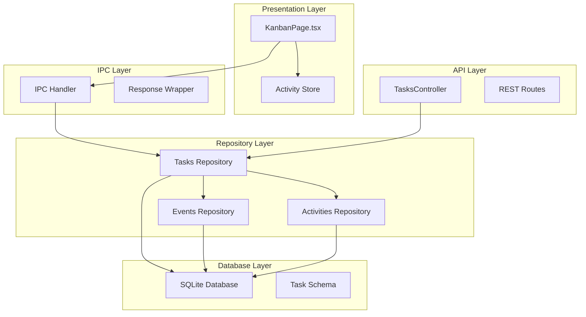
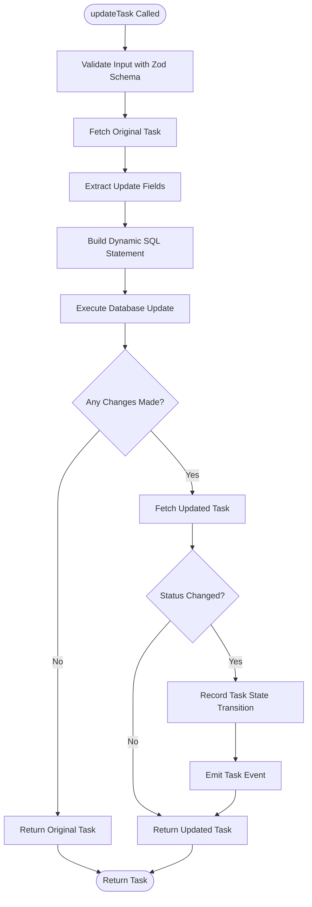
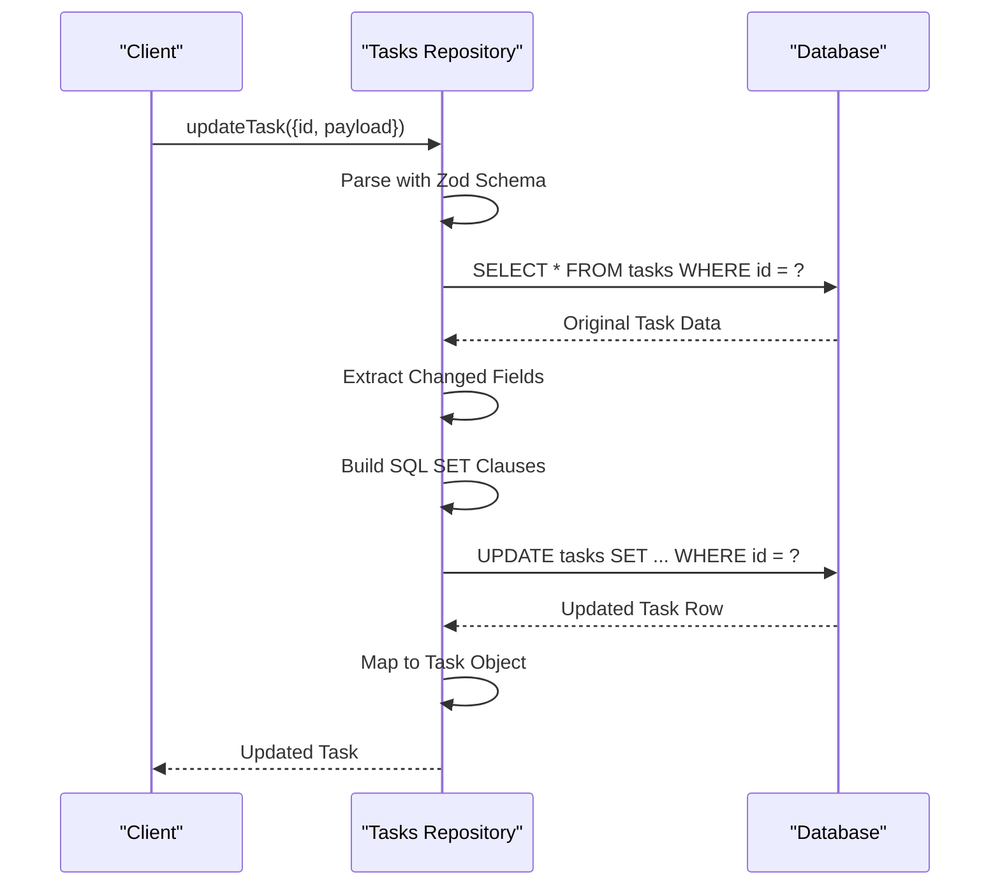
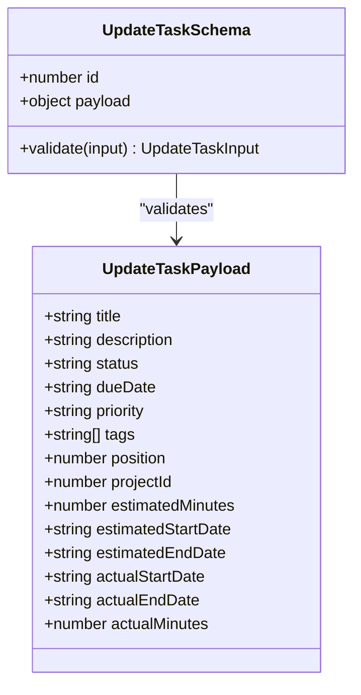
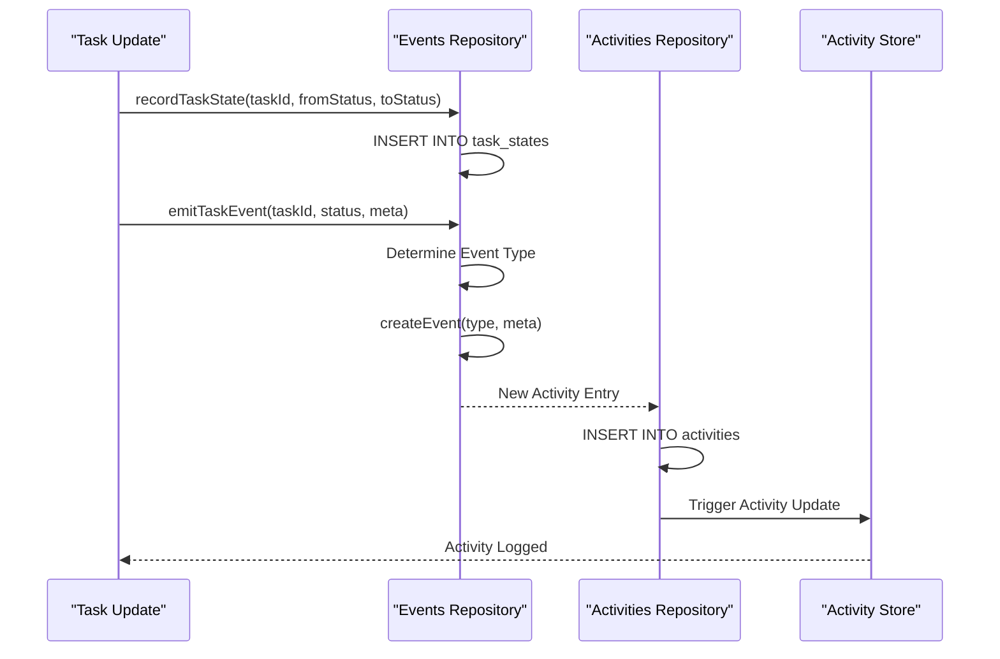
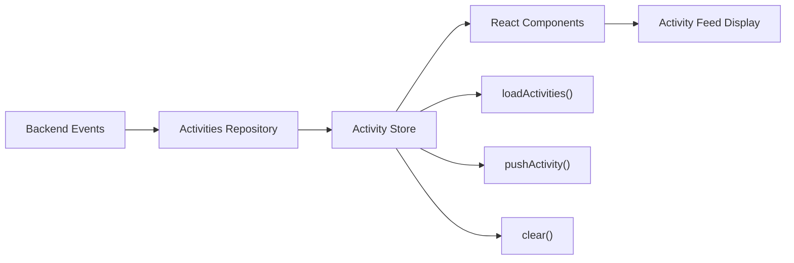
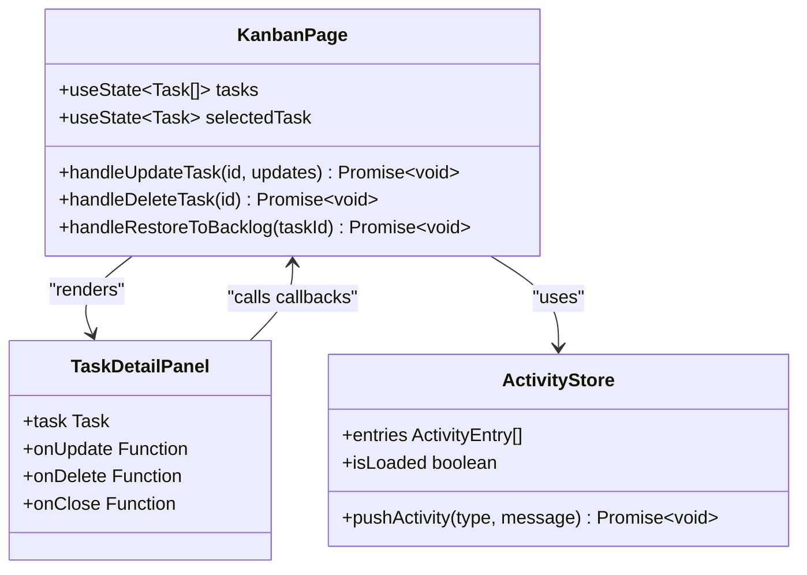
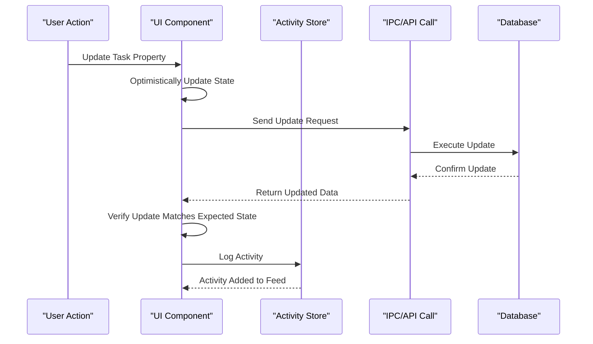
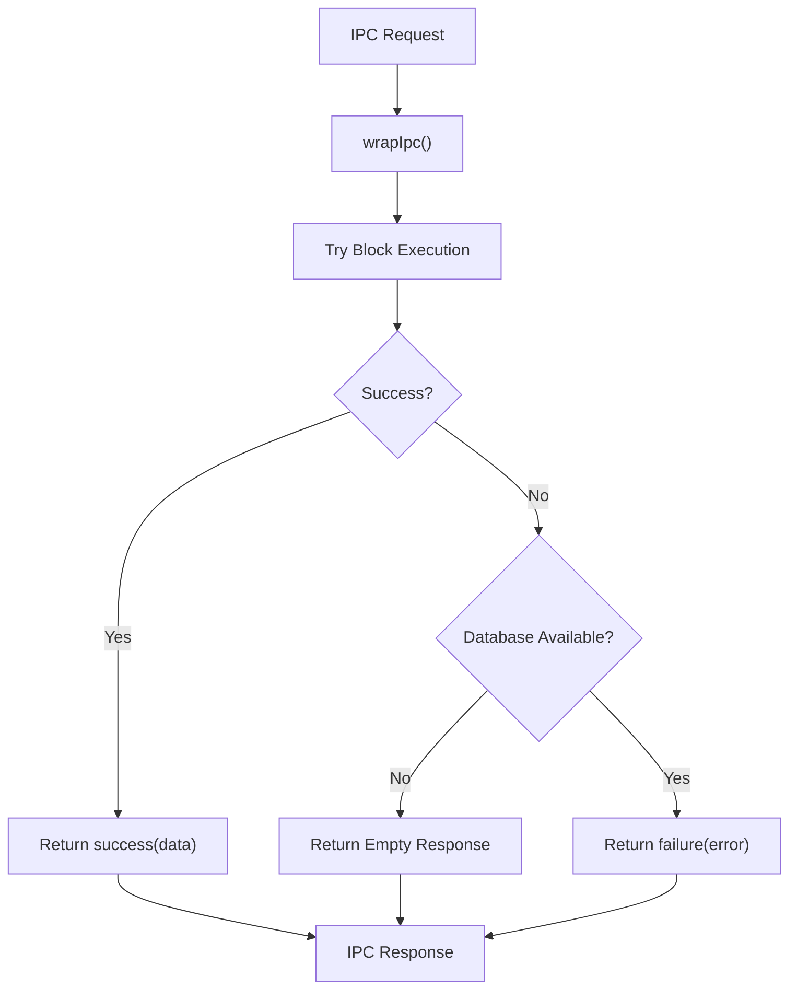
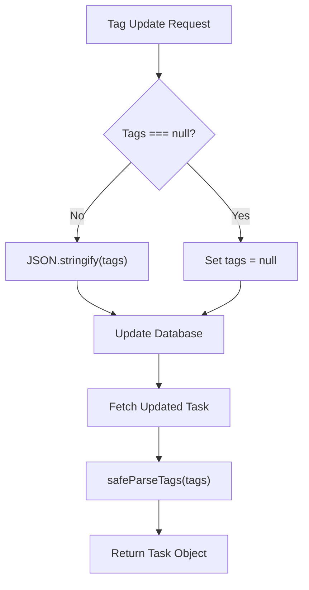

# Task Update and Modification System

<cite>
**Referenced Files in This Document**
- [tasksRepo.ts](file://src/database/tasksRepo.ts)
- [eventsRepo.ts](file://src/database/eventsRepo.ts)
- [activitiesRepo.ts](file://src/database/activitiesRepo.ts)
- [tasks.ts](file://src/main/ipc/tasks.ts)
- [tasksController.ts](file://src/server/controllers/tasksController.ts)
- [KanbanPage.tsx](file://src/renderer/pages/KanbanPage.tsx)
- [activity.ts](file://src/store/activity.ts)
- [types.ts](file://src/common/types.ts)
- [response.ts](file://src/main/utils/response.ts)
- [init.ts](file://src/database/init.ts)
- [mappers.ts](file://src/database/mappers.ts)
</cite>

## Table of Contents
1. [Introduction](#introduction)
2. [System Architecture](#system-architecture)
3. [Core Components](#core-components)
4. [Task Update Implementation](#task-update-implementation)
5. [Validation and Schema Management](#validation-and-schema-management)
6. [Activity Logging and Events](#activity-logging-and-events)
7. [UI Integration](#ui-integration)
8. [Error Handling and Concurrency](#error-handling-and-concurrency)
9. [Performance Considerations](#performance-considerations)
10. [Common Issues and Solutions](#common-issues-and-solutions)
11. [Best Practices](#best-practices)

## Introduction

The Task Update and Modification system in LifeOS provides a comprehensive framework for updating task properties while maintaining data integrity, tracking changes, and providing real-time feedback to users. This system handles partial updates, validates input data, manages nullable fields, tracks state transitions, and integrates with activity logging and event systems.

The system operates across multiple layers: database repositories for data persistence, IPC handlers for inter-process communication, REST API controllers for web access, and React components for user interaction. It employs Zod for schema validation, implements optimistic UI updates, and handles complex scenarios like concurrent modifications and JSON-serialized data.

## System Architecture

The Task Update system follows a layered architecture pattern with clear separation of concerns:

**Diagram sources**
- [KanbanPage.tsx](file://src/renderer/pages/KanbanPage.tsx#L1-L520)
- [tasksController.ts](file://src/server/controllers/tasksController.ts#L1-L140)
- [tasks.ts](file://src/main/ipc/tasks.ts#L1-L37)
- [tasksRepo.ts](file://src/database/tasksRepo.ts#L1-L211)

## Core Components

### Task Repository (`tasksRepo.ts`)

The task repository serves as the primary data access layer, implementing the core update functionality through the `updateTask` function. It handles partial updates, dynamic SQL generation, and maintains data integrity.

Key responsibilities include:
- **Partial Updates**: Supports updating individual task properties without requiring complete task data
- **Dynamic SQL Generation**: Builds SQL statements based on provided update fields
- **Nullable Field Handling**: Properly manages nullable fields like description and priority
- **State Tracking**: Monitors status changes and triggers appropriate events
- **Validation**: Uses Zod schemas for input validation and type safety

### Events Repository (`eventsRepo.ts`)

Manages system events and activity logging, providing hooks for task state transitions and user actions.

### Activity Store (`activity.ts`)

Provides reactive state management for activity tracking in the frontend, enabling real-time activity feed updates.

**Section sources**
- [tasksRepo.ts](file://src/database/tasksRepo.ts#L1-L211)
- [eventsRepo.ts](file://src/database/eventsRepo.ts#L1-L136)
- [activity.ts](file://src/store/activity.ts#L1-L69)

## Task Update Implementation

### The updateTask Function

The `updateTask` function in tasksRepo.ts is the core implementation for task modifications. It demonstrates sophisticated handling of partial updates and dynamic SQL generation.

**Diagram sources**
- [tasksRepo.ts](file://src/database/tasksRepo.ts#L95-L180)

### Dynamic SQL Field Generation

The system dynamically constructs SQL update statements based on the provided payload, ensuring only changed fields are updated:

**Diagram sources**
- [tasksRepo.ts](file://src/database/tasksRepo.ts#L95-L180)

### Nullable Field Handling

The system properly handles nullable fields by distinguishing between undefined (unchanged) and null (explicitly cleared) values:

- **Description Field**: Supports null values for clearing descriptions
- **Priority Field**: Allows null to remove priority assignments
- **Due Date**: Handles null values for removing deadlines
- **Tags**: Manages JSON serialization/deserialization for tag arrays

**Section sources**
- [tasksRepo.ts](file://src/database/tasksRepo.ts#L95-L180)

## Validation and Schema Management

### Zod Schema Definition

The system uses Zod schemas for comprehensive input validation and type safety:

**Diagram sources**
- [tasksRepo.ts](file://src/database/tasksRepo.ts#L15-L35)
- [types.ts](file://src/common/types.ts#L50-L70)

### Schema Features

- **Partial Updates**: All fields are optional, allowing selective updates
- **Type Safety**: Strong typing ensures compile-time validation
- **Null Handling**: Explicit nullable support for optional fields
- **Length Validation**: Enforces reasonable limits on text fields
- **Date Validation**: Ensures valid datetime formats

**Section sources**
- [tasksRepo.ts](file://src/database/tasksRepo.ts#L15-L35)
- [types.ts](file://src/common/types.ts#L50-L70)

## Activity Logging and Events

### State Transition Tracking

The system automatically tracks task status changes and logs them for analytics and audit purposes:

**Diagram sources**
- [tasksRepo.ts](file://src/database/tasksRepo.ts#L170-L185)
- [eventsRepo.ts](file://src/database/eventsRepo.ts#L50-L70)
- [activitiesRepo.ts](file://src/database/activitiesRepo.ts#L15-L35)

### Event Types and Categorization

The system categorizes task events into meaningful types:

- **TASK_STARTED**: Triggered when moving to 'In Progress' status
- **TASK_COMPLETED**: Generated upon task completion
- **TASK_PROGRESSED**: Standard progress updates for other status changes

### Activity Store Integration

The frontend maintains a reactive activity store that automatically updates when new activities are recorded:

**Diagram sources**
- [activity.ts](file://src/store/activity.ts#L10-L60)
- [activitiesRepo.ts](file://src/database/activitiesRepo.ts#L25-L45)

**Section sources**
- [eventsRepo.ts](file://src/database/eventsRepo.ts#L50-L85)
- [activitiesRepo.ts](file://src/database/activitiesRepo.ts#L15-L140)
- [activity.ts](file://src/store/activity.ts#L10-L69)

## UI Integration

### KanbanPage Integration

The KanbanPage component demonstrates comprehensive UI integration with the task update system:

**Diagram sources**
- [KanbanPage.tsx](file://src/renderer/pages/KanbanPage.tsx#L25-L50)
- [KanbanPage.tsx](file://src/renderer/pages/KanbanPage.tsx#L85-L105)
- [activity.ts](file://src/store/activity.ts#L10-L30)

### Optimistic UI Updates

The system implements optimistic UI updates to provide immediate feedback:

**Diagram sources**
- [KanbanPage.tsx](file://src/renderer/pages/KanbanPage.tsx#L85-L105)

### Error Handling Patterns

The UI implements comprehensive error handling for task updates:

- **Network Errors**: Graceful degradation when API calls fail
- **Validation Errors**: Clear feedback for invalid input
- **Concurrency Conflicts**: Handling of simultaneous updates
- **Database Errors**: Robust error reporting and recovery

**Section sources**
- [KanbanPage.tsx](file://src/renderer/pages/KanbanPage.tsx#L85-L105)
- [activity.ts](file://src/store/activity.ts#L30-L50)

## Error Handling and Concurrency

### IPC Error Wrapping

The IPC layer implements comprehensive error handling through the response wrapper:

**Diagram sources**
- [response.ts](file://src/main/utils/response.ts#L15-L35)

### Concurrent Modification Handling

The system handles concurrent modifications through several mechanisms:

- **Optimistic Locking**: UI updates immediately, with validation on backend
- **Conflict Detection**: Status change tracking identifies conflicts
- **Refresh Mechanisms**: Automatic refresh when inconsistencies detected
- **User Feedback**: Clear indication of concurrent modification issues

### Database Availability Management

The system gracefully handles database unavailability:

- **Graceful Degradation**: Empty responses when database unavailable
- **Retry Logic**: Automatic retry attempts for transient failures
- **Offline Mode**: Basic functionality when database is temporarily unavailable

**Section sources**
- [response.ts](file://src/main/utils/response.ts#L15-L35)
- [tasks.ts](file://src/main/ipc/tasks.ts#L10-L35)

## Performance Considerations

### Database Optimization

The system implements several performance optimizations:

- **Indexing Strategy**: Strategic indexes on frequently queried columns
- **Batch Operations**: Grouping related updates for efficiency
- **Lazy Loading**: Loading activities and tasks on demand
- **Connection Pooling**: Efficient database connection management

### Memory Management

- **State Cleanup**: Automatic cleanup of old activities
- **Pagination**: Limiting activity feeds to manageable sizes
- **Selective Loading**: Loading only necessary task data

### Network Optimization

- **Request Batching**: Combining multiple small requests
- **Caching Strategies**: Intelligent caching of frequently accessed data
- **Compression**: Compressing data transfers where applicable

## Common Issues and Solutions

### JSON-Serialized Tags Handling

One of the most complex aspects of the system involves handling JSON-serialized tags during update operations:

**Diagram sources**
- [tasksRepo.ts](file://src/database/tasksRepo.ts#L37-L40)
- [mappers.ts](file://src/database/mappers.ts#L5-L15)

### Optimistic UI Update Challenges

**Issue**: UI updates immediately, but backend validation fails
**Solution**: Implement validation on both client and server sides, with fallback mechanisms

**Issue**: Concurrent updates causing UI inconsistencies
**Solution**: Use optimistic updates with conflict resolution and automatic refresh

### Null Value Management

**Issue**: Confusion between undefined (unchanged) and null (cleared) values
**Solution**: Clear distinction in schema and proper handling in mapper functions

### Status Change Triggers

**Issue**: Events not firing for specific status transitions
**Solution**: Comprehensive status change detection and event emission logic

**Section sources**
- [tasksRepo.ts](file://src/database/tasksRepo.ts#L37-L40)
- [mappers.ts](file://src/database/mappers.ts#L5-L15)
- [KanbanPage.tsx](file://src/renderer/pages/KanbanPage.tsx#L85-L105)

## Best Practices

### Schema Design

- **Defensive Programming**: Always validate input data
- **Type Safety**: Use strong typing throughout the stack
- **Nullable Fields**: Clearly distinguish between optional and nullable fields
- **Default Values**: Provide sensible defaults for optional fields

### Error Handling

- **Graceful Degradation**: Handle failures without breaking the user experience
- **User Feedback**: Provide clear, actionable error messages
- **Logging**: Comprehensive logging for debugging and monitoring
- **Retry Logic**: Implement intelligent retry mechanisms

### Performance Optimization

- **Lazy Loading**: Load data only when needed
- **Caching**: Cache frequently accessed data
- **Batch Operations**: Group related operations together
- **Indexing**: Optimize database queries with appropriate indexes

### Security Considerations

- **Input Sanitization**: Validate and sanitize all user inputs
- **Access Control**: Implement proper authorization checks
- **Data Validation**: Verify data integrity at multiple layers
- **Audit Trails**: Maintain comprehensive audit logs

### Testing Strategies

- **Unit Tests**: Test individual components in isolation
- **Integration Tests**: Test component interactions
- **End-to-End Tests**: Test complete user workflows
- **Performance Tests**: Validate system performance under load

The Task Update and Modification system in LifeOS demonstrates sophisticated handling of complex data update scenarios while maintaining excellent user experience and system reliability. Its layered architecture, comprehensive validation, and robust error handling make it a model for similar systems requiring real-time data updates and activity tracking.