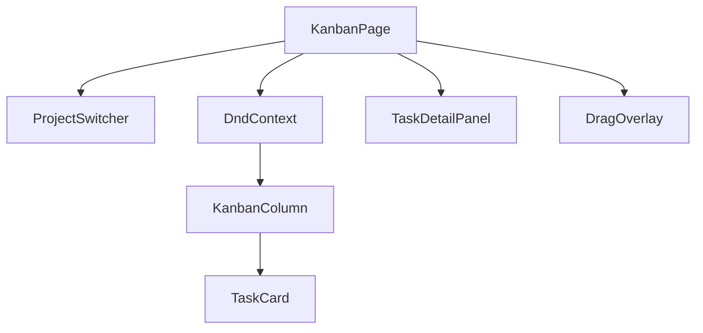
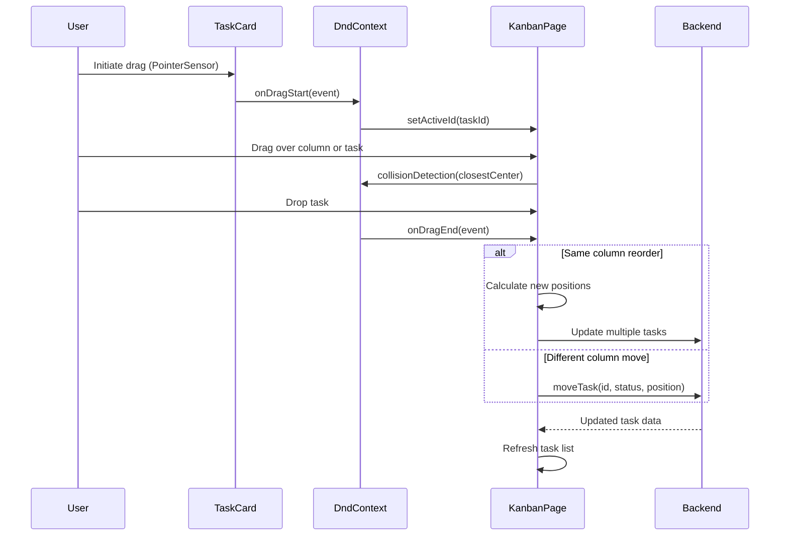
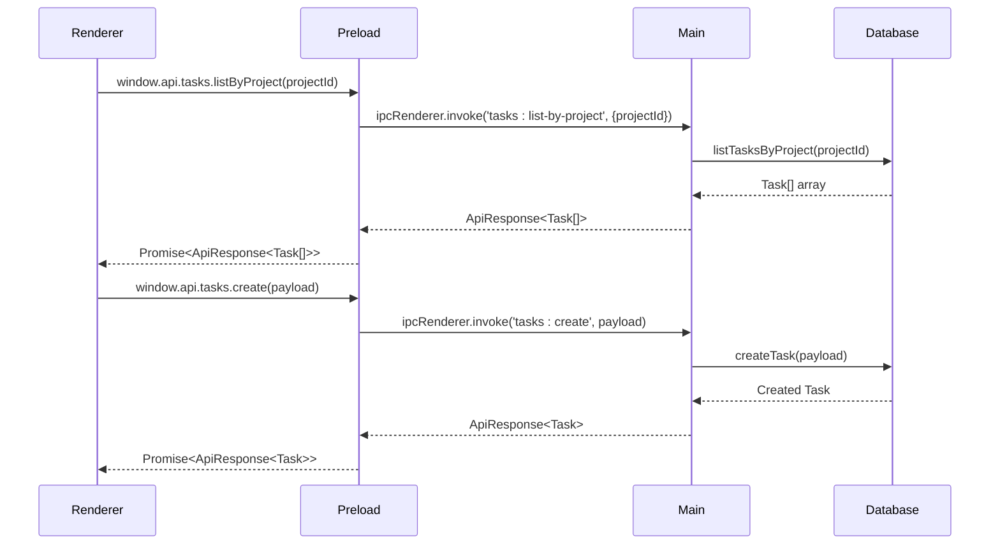
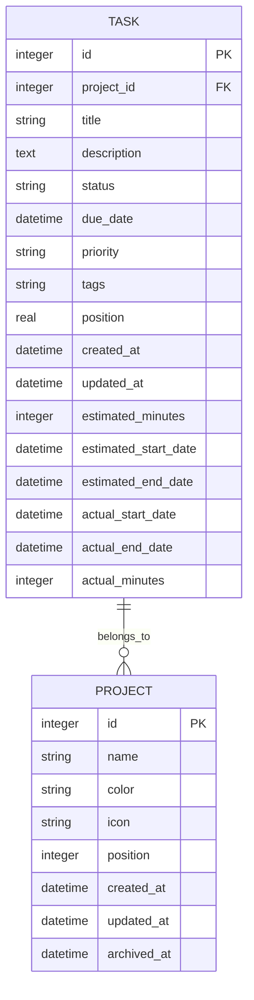
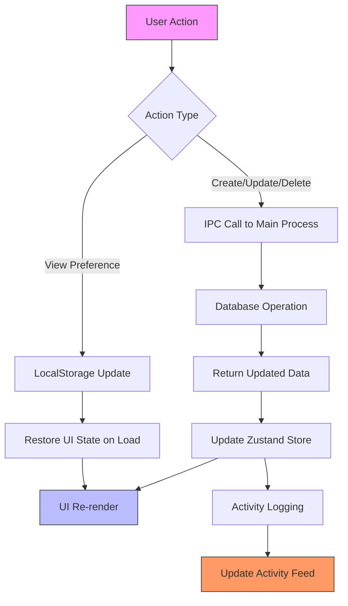
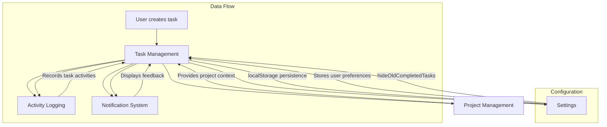
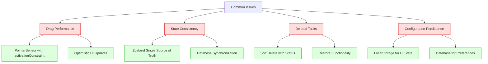

# Task Management

<cite>
**Referenced Files in This Document**   
- [KanbanPage.tsx](file://src/renderer/pages/KanbanPage.tsx)
- [tasks.ts](file://src/store/tasks.ts)
- [tasksRepo.ts](file://src/database/tasksRepo.ts)
- [tasks.ts](file://src/main/ipc/tasks.ts)
- [tasksController.ts](file://src/server/controllers/tasksController.ts)
- [types.ts](file://src/common/types.ts)
- [TaskCard.tsx](file://src/renderer/components/TaskCard.tsx)
- [KanbanColumn.tsx](file://src/renderer/components/KanbanColumn.tsx)
- [TaskDetailPanel.tsx](file://src/renderer/components/TaskDetailPanel.tsx)
- [eventsRepo.ts](file://src/database/eventsRepo.ts)
- [init.ts](file://src/database/init.ts)
- [index.ts](file://src/preload/index.ts)
</cite>

## Table of Contents
1. [Introduction](#introduction)
2. [Component Hierarchy](#component-hierarchy)
3. [State Management with Zustand](#state-management-with-zustand)
4. [Drag-and-Drop Functionality](#drag-and-drop-functionality)
5. [Task Lifecycle Management](#task-lifecycle-management)
6. [IPC Communication](#ipc-communication)
7. [Backend API Endpoints](#backend-api-endpoints)
8. [Data Persistence and Synchronization](#data-persistence-and-synchronization)
9. [Module Relationships](#module-relationships)
10. [Configuration and User Preferences](#configuration-and-user-preferences)
11. [Common Issues and Solutions](#common-issues-and-solutions)

## Introduction
The Task Management module in LifeOS implements a Kanban board system for visual task organization and workflow management. This document details the implementation of the Kanban functionality, focusing on the component architecture, state management, drag-and-drop interactions, task lifecycle operations, and integration between frontend and backend systems. The system enables users to create, organize, track, and complete tasks within projects, with features for task reordering, status transitions, archiving, and restoration.

## Component Hierarchy

The Kanban implementation follows a hierarchical component structure with clear separation of concerns. The main entry point is the `KanbanPage` component, which orchestrates the entire Kanban board experience.



**Diagram sources**
- [KanbanPage.tsx](file://src/renderer/pages/KanbanPage.tsx)
- [KanbanColumn.tsx](file://src/renderer/components/KanbanColumn.tsx)
- [TaskCard.tsx](file://src/renderer/components/TaskCard.tsx)

**Section sources**
- [KanbanPage.tsx](file://src/renderer/pages/KanbanPage.tsx#L1-L520)
- [KanbanColumn.tsx](file://src/renderer/components/KanbanColumn.tsx#L1-L104)
- [TaskCard.tsx](file://src/renderer/components/TaskCard.tsx#L1-L182)

## State Management with Zustand

The task management system uses Zustand for global state management, providing a centralized store for task data that can be accessed across components without prop drilling.

```mermaid
classDiagram
class TasksState {
+tasksByProject : Record<number, Task[]>
+loading : Record<number, boolean>
+error? : string
+loadTasks(projectId : number) : Promise<void>
+createTask(payload : CreateTaskInput) : Promise<void>
+updateTask(id : number, payload : UpdateTaskPayload) : Promise<void>
+moveTask(args : { id : number; projectId : number; status : string; position : number }) : Promise<void>
}
class useTasksStore {
+create<TasksState>()
+loadTasks()
+createTask()
+updateTask()
+moveTask()
}
class useTasks {
+tasks : Task[]
+loading : boolean
+error : string
+loadTasks : function
+createTask : function
+updateTask : function
+moveTask : function
}
useTasksStore --> TasksState : "implements"
useTasks --> useTasksStore : "uses selector"
```

**Diagram sources**
- [tasks.ts](file://src/store/tasks.ts#L1-L133)

**Section sources**
- [tasks.ts](file://src/store/tasks.ts#L1-L133)

## Drag-and-Drop Functionality

The Kanban board implements drag-and-drop functionality using the @dnd-kit/core library, enabling intuitive task reordering and status transitions through direct manipulation.



**Diagram sources**
- [KanbanPage.tsx](file://src/renderer/pages/KanbanPage.tsx#L1-L520)
- [TaskCard.tsx](file://src/renderer/components/TaskCard.tsx#L1-L182)

**Section sources**
- [KanbanPage.tsx](file://src/renderer/pages/KanbanPage.tsx#L1-L520)
- [TaskCard.tsx](file://src/renderer/components/TaskCard.tsx#L1-L182)

## Task Lifecycle Management

The task management system implements a comprehensive lifecycle for tasks, from creation to archival, with proper state transitions and user interactions.

```mermaid
stateDiagram-v2
[*] --> Backlog
Backlog --> "To-Do" : Create task
"To-Do" --> "In Progress" : Start working
"In Progress" --> "To-Do" : Pause/Stop
"In Progress" --> Completed : Finish task
Completed --> Backlog : Restore from archive
Backlog --> Deleted : Delete task
"To-Do" --> Deleted : Delete task
"In Progress" --> Deleted : Delete task
Completed --> Deleted : Delete task
Deleted --> Backlog : Restore to backlog
Backlog --> Archived : Hide old completed
"To-Do" --> Archived : Hide old completed
"In Progress" --> Archived : Hide old completed
Completed --> Archived : Hide old completed
note right of Completed
Tasks completed today
remain visible when
hiding old completed tasks
end note
note left of Deleted
Tasks marked with
status : 'Deleted'
rather than removed
from database
end note
```

**Diagram sources**
- [KanbanPage.tsx](file://src/renderer/pages/KanbanPage.tsx#L1-L520)
- [tasksRepo.ts](file://src/database/tasksRepo.ts#L1-L211)

**Section sources**
- [KanbanPage.tsx](file://src/renderer/pages/KanbanPage.tsx#L1-L520)
- [tasksRepo.ts](file://src/database/tasksRepo.ts#L1-L211)

## IPC Communication

The application uses Electron's IPC (Inter-Process Communication) system to bridge the renderer process (frontend) and main process (backend), enabling secure communication between the UI and database operations.



**Diagram sources**
- [tasks.ts](file://src/main/ipc/tasks.ts#L1-L37)
- [index.ts](file://src/preload/index.ts#L1-L202)

**Section sources**
- [tasks.ts](file://src/main/ipc/tasks.ts#L1-L37)
- [index.ts](file://src/preload/index.ts#L1-L202)

## Backend API Endpoints

The Express server provides RESTful API endpoints for task operations, enabling both Electron IPC and potential external access to task management functionality.



**Diagram sources**
- [tasksController.ts](file://src/server/controllers/tasksController.ts#L1-L140)
- [init.ts](file://src/database/init.ts#L1-L144)

**Section sources**
- [tasksController.ts](file://src/server/controllers/tasksController.ts#L1-L140)
- [tasks.ts](file://src/server/routes/tasks.ts#L1-L26)

## Data Persistence and Synchronization

The system implements robust data persistence and synchronization mechanisms to ensure data consistency across UI, local storage, and database.



**Diagram sources**
- [KanbanPage.tsx](file://src/renderer/pages/KanbanPage.tsx#L1-L520)
- [tasksRepo.ts](file://src/database/tasksRepo.ts#L1-L211)

**Section sources**
- [KanbanPage.tsx](file://src/renderer/pages/KanbanPage.tsx#L1-L520)
- [tasksRepo.ts](file://src/database/tasksRepo.ts#L1-L211)

## Module Relationships

The Task Management module integrates with other core modules in LifeOS, creating a cohesive productivity ecosystem.



**Diagram sources**
- [KanbanPage.tsx](file://src/renderer/pages/KanbanPage.tsx#L1-L520)
- [eventsRepo.ts](file://src/database/eventsRepo.ts#L1-L136)

**Section sources**
- [KanbanPage.tsx](file://src/renderer/pages/KanbanPage.tsx#L1-L520)
- [eventsRepo.ts](file://src/database/eventsRepo.ts#L1-L136)

## Configuration and User Preferences

The system provides configurable options for task management, allowing users to customize their workflow experience.

```mermaid
classDiagram
class Settings {
+hideOldCompletedTasks : boolean
+theme : string
+autoStartMCP : boolean
+mcpPort : number
+mcpHost : string
}
class KanbanPage {
+hideOldCompleted : boolean
+showArchivedView : boolean
}
class TaskCard {
+priority : string
+dueDate : string
+tags : string[]
}
Settings --> KanbanPage : "loads on mount"
KanbanPage --> Settings : "saves on toggle"
KanbanPage --> localStorage : "persists task selection"
TaskCard --> Settings : "displays based on priority"
note right of Settings
Stored in database
Accessed via settings
IPC channel
end note
note left of KanbanPage
hideOldCompleted hides
completed tasks from
previous days
end note
```

**Diagram sources**
- [KanbanPage.tsx](file://src/renderer/pages/KanbanPage.tsx#L1-L520)
- [index.ts](file://src/preload/index.ts#L1-L202)

**Section sources**
- [KanbanPage.tsx](file://src/renderer/pages/KanbanPage.tsx#L1-L520)

## Common Issues and Solutions

The implementation addresses several common issues in task management systems, providing solutions for performance, consistency, and usability challenges.



**Diagram sources**
- [KanbanPage.tsx](file://src/renderer/pages/KanbanPage.tsx#L1-L520)
- [tasks.ts](file://src/store/tasks.ts#L1-L133)

**Section sources**
- [KanbanPage.tsx](file://src/renderer/pages/KanbanPage.tsx#L1-L520)
- [tasks.ts](file://src/store/tasks.ts#L1-L133)