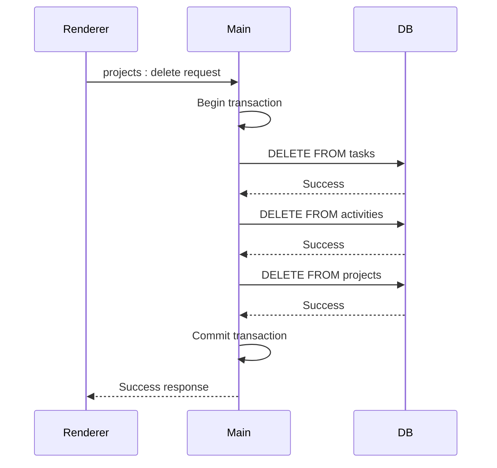
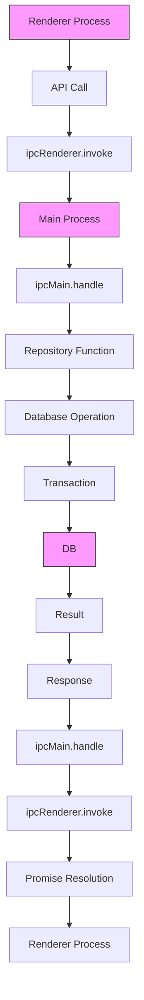

# Concurrency and Transactions

<cite>
**Referenced Files in This Document**   
- [init.ts](file://src/database/init.ts)
- [projectsRepo.ts](file://src/database/projectsRepo.ts)
- [tasksRepo.ts](file://src/database/tasksRepo.ts)
- [database.ts](file://src/main/ipc/database.ts)
- [index.ts](file://src/main/index.ts)
- [response.ts](file://src/main/utils/response.ts)
- [preload/index.ts](file://src/preload/index.ts)
</cite>

## Table of Contents
1. [Introduction](#introduction)
2. [Architecture Overview](#architecture-overview)
3. [Single Database Instance and Race Condition Prevention](#single-database-instance-and-race-condition-prevention)
4. [Transaction Management](#transaction-management)
5. [IPC Mechanism for Database Operations](#ipc-mechanism-for-database-operations)
6. [Error Handling and Transaction Rollbacks](#error-handling-and-transaction-rollbacks)
7. [Best Practices for Deadlock Prevention and Connection Pooling](#best-practices-for-deadlock-prevention-and-connection-pooling)
8. [Conclusion](#conclusion)

## Introduction
This document provides comprehensive documentation on concurrency control and transaction management in LifeOS. It explains how the application ensures data consistency and prevents race conditions through a centralized database architecture, transactional integrity, and a well-defined inter-process communication (IPC) mechanism. The document covers the implementation details of database operations, transaction usage patterns, error handling strategies, and best practices for maintaining optimal performance in a multi-process Electron application environment.

## Architecture Overview

```mermaid
graph TB
subgraph "Renderer Process"
UI[User Interface]
Preload[Preload Script]
IPCRenderer[ipcRenderer]
end
subgraph "Main Process"
IPCMain[ipcMain]
Database[Database Instance]
Repositories[Repository Layer]
end
UI --> Preload
Preload --> IPCRenderer
IPCRenderer < --> IPCMain
IPCMain --> Repositories
Repositories --> Database
style Database fill:#f9f,stroke:#333
style IPCMain fill:#bbf,stroke:#333
style IPCRenderer fill:#bbf,stroke:#333
click Database "src/database/init.ts" "Database Instance"
click IPCMain "src/main/ipc/database.ts" "IPC Handlers"
click Repositories "src/database/projectsRepo.ts" "Repository Layer"
```

**Diagram sources**
- [init.ts](file://src/database/init.ts)
- [database.ts](file://src/main/ipc/database.ts)
- [projectsRepo.ts](file://src/database/projectsRepo.ts)

**Section sources**
- [init.ts](file://src/database/init.ts)
- [index.ts](file://src/main/index.ts)
- [preload/index.ts](file://src/preload/index.ts)

## Single Database Instance and Race Condition Prevention

LifeOS employs a single database instance owned by the main process to prevent race conditions and ensure data consistency across the application. This architectural decision follows Electron's security and performance best practices by isolating direct database access to a single process.

The database instance is initialized in the main process during application startup through the `initDatabase()` function in `init.ts`. This function creates a singleton pattern for database access, ensuring that only one connection exists throughout the application lifecycle. The `getDb()` function provides controlled access to this single instance, throwing an error if accessed before initialization.

By centralizing database ownership in the main process, LifeOS eliminates the possibility of concurrent write operations from multiple processes, which could lead to data corruption or inconsistent states. All database operations from the renderer process must be relayed through IPC channels, creating a serialized access pattern that inherently prevents race conditions.

This approach also simplifies connection management and reduces resource consumption, as the application maintains only one active database connection rather than potentially multiple connections from different processes.

**Section sources**
- [init.ts](file://src/database/init.ts)
- [index.ts](file://src/main/index.ts)

## Transaction Management

LifeOS implements transaction management to ensure atomicity and consistency for multi-step database operations. Transactions are used to wrap sequences of related database operations, ensuring that either all operations succeed or all are rolled back in case of failure.

The application uses better-sqlite3's transaction API to create explicit transaction blocks for operations that modify multiple related records. For example, when deleting a project, the `deleteProject()` function in `projectsRepo.ts` wraps the deletion of related tasks, activities, and the project itself in a single transaction:



**Diagram sources**
- [projectsRepo.ts](file://src/database/projectsRepo.ts)

The codebase follows the principle of keeping transactions as short as possible to minimize blocking and maintain application responsiveness. Long-running transactions are avoided by limiting their scope to essential database operations only, without including business logic processing or external API calls within the transaction block.

Transaction boundaries are clearly defined at the repository layer, with each repository function responsible for managing its own transaction context when needed. This encapsulation ensures that transaction management is consistent and predictable across the application.

**Section sources**
- [projectsRepo.ts](file://src/database/projectsRepo.ts)
- [database.ts](file://src/main/ipc/database.ts)
- [tasksRepo.ts](file://src/database/tasksRepo.ts)

## IPC Mechanism for Database Operations

LifeOS implements a secure and efficient IPC mechanism to relay database operations from the renderer process to the main process where the database instance resides. This mechanism follows Electron's recommended security practices by using context isolation and the `contextBridge` API.

The preload script (`preload/index.ts`) exposes a carefully curated API to the renderer process through `contextBridge.exposeInMainWorld()`. This API provides typed methods for database operations while preventing direct access to Node.js APIs or the database itself. The IPC communication uses `ipcRenderer.invoke()` for request-response patterns, ensuring that operations are properly awaited and errors are handled.

In the main process, IPC handlers are registered using `ipcMain.handle()` in various files under `src/main/ipc/`. These handlers wrap database operations with the `wrapIpc()` utility function from `response.ts`, which provides consistent error handling and response formatting. The `wrapIpc()` function also includes special handling for cases where the database is not available, allowing the application to continue functioning in a limited capacity.

The IPC mechanism ensures that all database operations are serialized through the main process, preventing concurrent access and maintaining data integrity. Each IPC call results in a synchronous database operation in the main process, with the result returned to the renderer process through the promise-based IPC interface.



**Diagram sources**
- [preload/index.ts](file://src/preload/index.ts)
- [response.ts](file://src/main/utils/response.ts)
- [database.ts](file://src/main/ipc/database.ts)

**Section sources**
- [preload/index.ts](file://src/preload/index.ts)
- [response.ts](file://src/main/utils/response.ts)
- [database.ts](file://src/main/ipc/database.ts)

## Error Handling and Transaction Rollbacks

LifeOS implements robust error handling for database operations, with automatic transaction rollback in case of failures. The error handling strategy is implemented at multiple levels of the application architecture to ensure data consistency and provide meaningful feedback to users.

At the repository level, database operations are wrapped in try-catch blocks that ensure transactions are properly rolled back when exceptions occur. The better-sqlite3 library automatically rolls back transactions when an error is thrown within a transaction function, preventing partial updates from being committed to the database.

The `wrapIpc()` function in `response.ts` provides a centralized error handling mechanism for all IPC handlers. This function catches exceptions thrown by database operations and converts them into standardized API responses with error messages. It also includes special handling for database initialization errors, allowing the application to gracefully degrade when the database is unavailable.

For operations that involve multiple related entities, such as deleting a project and its associated tasks, the transaction ensures atomicity - if any part of the operation fails, all changes are rolled back. This prevents orphaned records and maintains referential integrity across the database.

The application also implements foreign key constraints in the database schema (enabled via `PRAGMA foreign_keys = ON`), which provide an additional layer of data integrity protection at the database level.

**Section sources**
- [response.ts](file://src/main/utils/response.ts)
- [projectsRepo.ts](file://src/database/projectsRepo.ts)
- [init.ts](file://src/database/init.ts)

## Best Practices for Deadlock Prevention and Connection Pooling

LifeOS follows several best practices to prevent deadlocks and optimize database connection usage with better-sqlite3.

To prevent deadlocks, the application ensures that transactions are kept short and focused on database operations only. Business logic processing, external API calls, and user interface updates are performed outside of transaction blocks. The application also follows a consistent ordering when accessing multiple resources, reducing the likelihood of circular wait conditions.

The single database instance architecture inherently prevents connection pooling issues by eliminating the need for multiple connections. With only one connection managed by the main process, there is no risk of connection exhaustion or the overhead associated with connection pool management.

Additional best practices implemented in the codebase include:

- Using parameterized queries to prevent SQL injection
- Implementing proper indexing on frequently queried columns
- Enabling foreign key constraints to maintain data integrity
- Using prepared statements for frequently executed queries
- Implementing graceful degradation when the database is unavailable

The application also follows the principle of least privilege in database operations, with each repository function having only the necessary permissions to perform its specific tasks. This reduces the potential impact of any security vulnerabilities.

**Section sources**
- [init.ts](file://src/database/init.ts)
- [projectsRepo.ts](file://src/database/projectsRepo.ts)
- [tasksRepo.ts](file://src/database/tasksRepo.ts)

## Conclusion
LifeOS implements a robust concurrency control and transaction management system that ensures data consistency and prevents race conditions in a multi-process Electron application. By centralizing database ownership in the main process, using explicit transactions for multi-step operations, and implementing a secure IPC mechanism, the application maintains data integrity while providing a responsive user experience.

The architecture follows best practices for database access in Electron applications, with proper error handling, transaction management, and protection against common issues like deadlocks and connection exhaustion. The combination of a single database instance, short transactions, and well-defined IPC channels creates a reliable foundation for data management in the application.